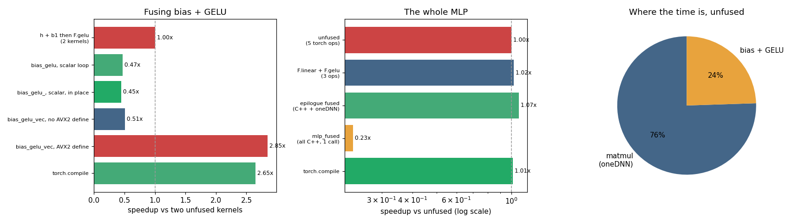

# Fused MLP

---

> Four operations, one trip to memory — fusion turns a pipeline into a single kernel.

---

## Key Insight

An [MLP](/shared/glossary/#mlp) normally runs as separate steps — [matmul](/shared/glossary/#matmul), add bias, [GELU](/shared/glossary/#gelu), matmul — each reading and writing memory. [Kernel fusion](/shared/glossary/#kernel-fusion) merges them into one [Triton](/shared/glossary/#triton) [kernel](/shared/glossary/#kernel) that keeps the intermediate results on-chip, so the data is read once instead of four times.

## Why This Matters

Most deep-learning operations are limited by memory bandwidth, not arithmetic, so fusing several small ops into one is among the most reliable ways to make a model faster.

---

**This is project 33.** The guide asks for one
[Triton](/shared/glossary/#triton) kernel doing all four steps. Triton cannot run
on this machine's sm_61 GPU
([why](../30-cpp-extension-for-elementwise-add/README.md#a-note-on-the-hardware-and-why-there-is-no-gpu-here)),
so the kernel is C++ — and the C++ version ends up answering a sharper question
than the Triton one would have: **which** of the four steps is worth fusing, and
which is a trap.

What `run.py` finds, on a 1024 × 512 → 2048 → 512 MLP:

- fusing bias + [GELU](/shared/glossary/#gelu) halves the memory traffic and the
  fused kernel is **0.54×** — nearly **2× slower** than the two unfused PyTorch ops
  it replaced
- the same fusion written with ATen's vector type is **3.50×** — a **6.5×
  difference between two kernels that compute the same thing** (across runs the
  vector kernel lands at 2.9–3.5×, the scalar one at 0.45–0.58×; the gap is
  always around 6×)
- and the thing that separates them is **one `-D` flag**: without
  `-DCPU_CAPABILITY_AVX2` the vector code silently compiles to scalar code and
  scores 0.59×
- fusing *everything* into one hand-written kernel gives **0.19×** — five times
  slower than doing nothing
- because the element-wise part is only **14 %** of the MLP's time; the two
  [matmuls](/shared/glossary/#matmul) are 86 %
- so the version that actually wins keeps [oneDNN](/shared/glossary/#onednn)'s
  matmul and fuses only the epilogue: **1.07×**, and it holds one temporary
  instead of four

---

## Files

| file | what it is |
|---|---|
| `run.py` | all six sections |
| `../30-cpp-extension-for-elementwise-add/kernels_lib.py` | shared build and timing helpers |
| `outputs/findings.csv` | every number quoted here |
| `outputs/triton_fused_mlp.py` | the fused MLP as a Triton kernel, annotated |
| `outputs/fused_mlp.png` | the three figures |

```bash
python3 run.py     # ~10 s after the first build (~50 s of compiling on run 1)
```

---

## What "fusion" means here

An MLP layer is `y = gelu(x @ W1 + b1) @ W2 + b2`. Written as separate PyTorch
operations, each step reads its input from memory and writes its output back:

```python
h = x @ W1        # write h        (8 MB)
h = h + b1        # read h, write h+b1
h = F.gelu(h)     # read h+b1, write gelu
y = h @ W2
```

The two middle lines move the hidden activation **four times**: read, write, read,
write. But nothing except the next line ever looks at `h + b1`. It is written to
memory purely so that a second kernel can read it straight back.

[Kernel fusion](/shared/glossary/#kernel-fusion) is doing both in one pass, so the
value stays in a [register](/shared/glossary/#registers) between the add and the
GELU:

```cpp
for (int64_t c = 0; c < cols; ++c)
  orow[c] = gelu_scalar(hr[c] + pb[c]);      // add and gelu, one trip
```

Two moves instead of four. The hidden activation is 8 MB, so the saving is 16 MB
per call. The theory says this should be roughly 2× faster.

---

## The theory is wrong here, by 2× in the other direction



The epilogue alone, on the 1024 × 2048 hidden activation (8 MB):

| version | ms | GB/s | speedup |
|---|---|---|---|
| `h + b1` then `F.gelu` (2 kernels) | 3.38 | 9.9 | 1.00× |
| `bias_gelu`, scalar loop | 6.26 | 2.7 | **0.54×** |
| `bias_gelu_`, scalar, in place | 6.33 | 2.7 | 0.53× |
| `bias_gelu_vec`, no AVX2 define | 5.69 | 2.9 | 0.59× |
| **`bias_gelu_vec`, AVX2 define** | **0.97** | **17.3** | **3.50×** |
| `torch.compile` | 1.07 | 15.7 | 3.16× |

The fused kernel moves half the bytes and takes almost twice as long.

The reason is that **this kernel is not [memory-bound](/shared/glossary/#memory-bound)**,
which is surprising for an element-wise operation. The exact form of
[GELU](/shared/glossary/#gelu) is

```
gelu(x) = x · 0.5 · (1 + erf(x / √2))
```

and [erf](/shared/glossary/#error-function-erf) is a real library function costing
tens of cycles per call. Two million elements means two million calls. The 16 MB
saved is worth about 1.6 ms at this machine's bandwidth; the scalar `erf` calls
cost more than that. The kernel is [compute-bound](/shared/glossary/#compute-bound),
and halving its memory traffic optimizes the resource it had to spare.

> **"Then how is `F.gelu` fast? It computes the same erf."** It does not compute it
> one element at a time. ATen's implementation processes 8 floats per instruction
> using a vectorized `erf`, so it makes 256 000 vector calls where our loop makes
> 2 000 000 scalar ones. The library was not winning on memory traffic — it was
> winning on instruction count, while *losing* on traffic. That is why fusing it
> naively loses: we fixed the thing PyTorch was already doing badly and broke the
> thing it was doing well.

---

## Closing the gap: use PyTorch's own vector type

PyTorch ships the missing piece. `at::vec::Vectorized<float>` is a portable SIMD
type — one object holding 8 floats on this CPU — with `exp`, `erf` and `tanh`
implemented as vector instructions:

```cpp
#include <ATen/cpu/vec/vec.h>
using Vec = at::vec::Vectorized<float>;

const int64_t W = Vec::size();                    // 8 on this machine
for (; c + W <= cols; c += W) {
  Vec z = Vec::loadu(hr + c) + Vec::loadu(pb + c);
  Vec y = z * Vec(0.5f) * (Vec(1.f) + (z * Vec(0.70710678f)).erf());
  y.store(orow + c);
}
for (; c < cols; ++c) orow[c] = gelu_scalar(hr[c] + pb[c]);   // the tail
```

Same arithmetic, same result (max difference from `F.gelu`: **4.8e-07**), eight
elements per instruction. Now the fusion wins as the traffic model always said it
should: **3.50×**, and 17.3 GB/s — above what `F.gelu` achieves, because we are
moving half as much.

The second loop is the *tail*: if the row length is not a multiple of 8, the last
few elements are done one at a time. Every vectorized kernel needs one.

> **"Why write this by hand when project 31 got the same effect from
> `-ffast-math`?"** Because they are different bargains. `-ffast-math` is
> permission for the compiler to change your arithmetic and hope it finds the
> vectorization; `at::vec` is you writing the vector operations explicitly, with
> no permission granted and nothing left to hope for. The second is what you want
> in code other people will run.

### The trap: the header compiles either way

Look at the fourth row of the table again — **`bias_gelu_vec` with no AVX2 define:
0.59×**, essentially the same as the scalar loop.

That row is the *identical source file* as the winning row. The difference is the
build:

```python
K.build("p33_mlp",      CPP, functions=FUNCS)
K.build("p33_mlp_avx2", CPP, functions=FUNCS,
        extra_cflags=["-DCPU_CAPABILITY_AVX2", "-mavx2", "-mfma"])
```

ATen's vector header selects its implementation from preprocessor macros. Without
`CPU_CAPABILITY_AVX2`, it quietly falls back to a **scalar** implementation of
`Vectorized<float>` — a struct with an array inside and a `for` loop in every
operator. It compiles cleanly, it produces correct results, and it runs one element
at a time. There is no warning.

You get vector-shaped code with scalar performance and nothing tells you. `run.py`
prints the evidence directly, by exposing a function that reads the macro:

```
default flags            : Vec::size()=8  CPU_CAPABILITY_AVX2=False
+ -DCPU_CAPABILITY_AVX2  : Vec::size()=8  CPU_CAPABILITY_AVX2=True
```

Note that `Vec::size()` is **8 in both cases** — the fallback keeps the interface,
including the width. The only reliable signals are the macro and the clock.

---

## The whole MLP: fusion has a ceiling

| version | ms | GFLOP/s | vs unfused |
|---|---|---|---|
| unfused (5 torch ops) | 14.7 | 293.0 | 1.00× |
| `F.linear` + `F.gelu` (3 ops) | 14.7 | 291.7 | 1.00× |
| **epilogue fused (C++ + oneDNN)** | **13.7** | **313.1** | **1.07×** |
| `mlp_fused` (all C++, one call) | 78.6 | 54.6 | **0.19×** |
| `torch.compile` | 14.5 | 296.7 | 1.01× |

The 3.50× from the previous section became **1.07×**. And the fully fused kernel —
the one the guide describes, matmul → bias → GELU → matmul in a single call, with
nothing written to memory between the steps — is **five times slower than doing
nothing**.

Section 5 explains both numbers in one table:

| part | ms | share |
|---|---|---|
| matmul 1 (`x @ W1`) | 6.28 | 43.2 % |
| matmul 2 (`h @ W2`) | 6.23 | 42.8 % |
| bias + GELU | 2.03 | **14.0 %** |

The element-wise part is **14 %** of the work. Making it *infinitely fast* would
save 14 %. Our 3.50× on that 14 % is worth about 10 % overall, and 1.07× is what
survives.

And the fully-fused kernel has to do the matmuls itself — with the hand-written
tiled matmul from [project 32](../32-triton-matmul/README.md), which runs at about
15 % of oneDNN. It saves 14 % of the time and pays 6× on the other 86 %. It cannot
win, and no amount of tuning the fusion changes that.

**This is the practically useful result of the project:** fuse the *epilogue* into
the pipeline, not the matmuls. Keep the vendor library for the heavy operation and
replace the cheap operations around it. That is exactly what the production
version of this looks like — cuBLASLt "epilogue" support, oneDNN post-ops,
Inductor's fusion rules — and the reason is the 14 % above, not tradition.

> **"But the guide says one Triton kernel for all four steps. Is that wrong?"** No
> — it is right in a setting this measurement does not reproduce. On a GPU, a
> `tl.dot` on a tile runs on the tensor cores at near-vendor speed, so a fused
> Triton kernel is not giving up the fast matmul the way our C++ is. Even there,
> the constraint is real: to start the second matmul you need a whole hidden row
> live at once, so the tile must be as wide as the hidden dimension. That is why
> the annotated `outputs/triton_fused_mlp.py` is marked schematic, and why
> production kernels fuse the epilogue and leave the two matmuls separate — the
> same conclusion this CPU measurement reaches by a different road.

`torch.compile` deserves a mention: it got **3.16×** on the epilogue with no C++ at
all, close to our best hand-written kernel, by generating exactly this fusion
automatically. On the full MLP it lands at 1.01×, for the same 14 % reason. Before
writing a kernel, try the compiler — it is very good at precisely this transform.

---

## What fusion saves in memory

| version | temporaries alive | MB held |
|---|---|---|
| unfused (5 torch ops) | 4 | 34 |
| `F.linear` + `F.gelu` (3 ops) | 2 | 17 |
| epilogue fused (C++) | 1 | 8 |
| `mlp_fused` (all C++) | 1 | 8 |

Time was the wrong metric to judge the epilogue fusion by; memory is a fairer one.
One hidden activation is 8 MB, and the unfused version keeps four of them alive.
In a real training step every one of those temporaries is also an
[activation](/shared/glossary/#activations) that
[autograd](/shared/glossary/#autograd) may hold until the backward pass, so the
saving compounds — this is the same accounting that
[project 27](../27-memory-breakdown/README.md) did for a whole model.

There is also an in-place variant (`bias_gelu_`) that writes over `h` instead of
allocating: same two memory moves, and no allocation at all. It is used inside
`epilogue_fused`, and it is the sort of op that must be declared honestly to
`torch.library` — which is [project 35](../35-custom-op-registration/README.md).

---

## What to take away

1. **Halving memory traffic is worthless if you triple the arithmetic.** The naive
   fused kernel moved 2× fewer bytes and ran 1.9× slower.
2. **Element-wise does not mean [memory-bound](/shared/glossary/#memory-bound).**
   One expensive function call per element ([erf](/shared/glossary/#error-function-erf),
   `exp`, `tanh`) can make it [compute-bound](/shared/glossary/#compute-bound).
3. **Use `at::vec::Vectorized<float>`** rather than hoping the compiler vectorizes
   a loop containing a library call. It turned 0.54× into 3.50×.
4. **`-DCPU_CAPABILITY_AVX2` is not optional.** Without it, ATen's vector header
   silently gives you scalar code with the same interface, the same `Vec::size()`,
   and 6× the runtime.
5. **Measure where the time is before choosing what to fuse.** 86 % of this MLP is
   matmul; the whole fusion opportunity was 14 %.
6. **Fuse the epilogue, keep the vendor's matmul.** The all-in-one hand-written
   kernel scored 0.19×.
7. **Try `torch.compile` first.** It found this fusion by itself and got 3.16×.

---

Next: [project 34](../34-mini-flashattention/README.md) takes the same tiling and
[online softmax](/shared/glossary/#online-softmax) ideas to the one place where
fusion is not worth 14 % but **511 MB**.
