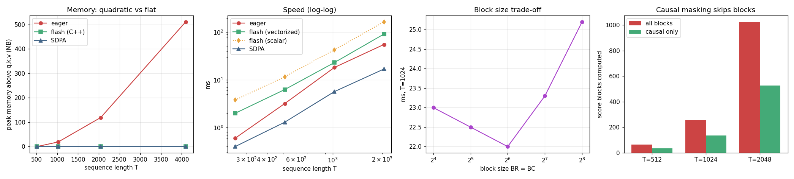

# Mini FlashAttention

---

> Never write the giant score matrix to memory — stream it through in tiles instead.

---

## Key Insight

Standard [attention](/shared/glossary/#attention) builds a large `T×T` [softmax](/shared/glossary/#softmax) score matrix in slow GPU memory ([HBM](/shared/glossary/#hbm)). [FlashAttention](/shared/glossary/#flashattention) avoids this with [tiling](/shared/glossary/#tiling) and an [online softmax](/shared/glossary/#online-softmax) that updates the running result block by block, so the full matrix is never stored. Building a small version and checking it matches eager attention shows how the same math can cost far less memory.

## Why This Matters

The single idea — do the same [FLOPs](/shared/glossary/#flops) but touch memory far less — is why FlashAttention made long-context [transformers](/shared/glossary/#transformer) practical, and it is the canonical example of memory-aware kernel design.

---

**This is project 34.** The kernel is C++ rather than
[Triton](/shared/glossary/#triton)
([why](../30-cpp-extension-for-elementwise-add/README.md#a-note-on-the-hardware-and-why-there-is-no-gpu-here)),
which costs less here than anywhere else in the phase: FlashAttention's idea is
about *memory*, and a CPU has the same shape of memory hierarchy as a GPU — a small
fast level and a big slow one. `outputs/triton_flashattention.py` holds the Triton
kernel with every line matched to its C++ twin.

What `run.py` finds, with 4 heads and head dimension 64:

- eager attention's peak memory grows quadratically — measured at **511 MB above
  baseline** at T = 4096, where the tiled kernel and
  [SDPA](/shared/glossary/#fscaled_dot_product_attention) both measure **0 MB**
- the tiled kernel matches eager attention to **~1e-06** relative error, including
  at a sequence length of 500, which is not a multiple of the block size
- with logits around **316** — more than three times past the value where `exp`
  overflows `float32` — it still returns finite, correct results
- with a causal mask, the tiled loop skips **48 %** of all score blocks, and runs
  **1.5× faster** as a result; eager computes every one of them and then throws
  half away
- and the honest limit: on speed the hand-written kernel is **0.62×** of eager and
  **0.18×** of `F.scaled_dot_product_attention`. This project wins on memory, not
  on the clock, and the reason is specific

---

## Files

| file | what it is |
|---|---|
| `run.py` | all seven sections |
| `../30-cpp-extension-for-elementwise-add/kernels_lib.py` | shared build and timing helpers |
| `outputs/findings.csv` | every number quoted here |
| `outputs/triton_flashattention.py` | the same kernel in Triton, annotated |
| `outputs/_mem_child.py` | the child script used to measure peak memory |
| `outputs/flashattention.png` | the four figures |

```bash
python3 run.py     # ~40 s after the first build (~25 s of compiling on run 1)
```

---

## The problem, in one table

Attention is

```
S   = q @ kᵀ · scale        # a T x T matrix
P   = softmax(S)            # another T x T matrix
out = P @ v
```

`q`, `k` and `v` each hold `T × D` numbers. `S` holds `T × T`:

| T | q,k,v (MB) | scores T×T (MB) | ratio |
|---|---|---|---|
| 256 | 0.8 | 1.0 | 1.3× |
| 1024 | 3.1 | 16.8 | 5.3× |
| 4096 | 12.6 | 268.4 | 21.3× |
| 8192 | 25.2 | 1073.7 | **42.7×** |

The inputs grow with `T`. The intermediate grows with `T²`. At 8192 tokens the
model's actual data is 25 MB and the scratch space is a gigabyte — and every byte
of it is thrown away as soon as `out` exists.

**That is the entire reason FlashAttention exists.** Not to do less arithmetic — it
does exactly the same [FLOPs](/shared/glossary/#flops) — but to never write that
matrix down.

---

## The trick: finishing a softmax you have not finished reading

To avoid storing the row of scores, you must compute
[softmax](/shared/glossary/#softmax) over it while seeing only a piece at a time.
That sounds impossible, because softmax needs the row's maximum (for stability, see
[project 31](../31-triton-softmax/README.md#why-the-max-subtraction-is-not-optional))
and its total — both of which depend on values you have not looked at yet.

The [online softmax](/shared/glossary/#online-softmax) solves it by keeping three
running quantities per query row and *repairing* them when new information arrives:

```
m   = the largest logit seen so far
l   = sum of exp(logit - m) over logits seen so far
acc = sum of exp(logit - m) · v over logits seen so far
```

When a new block contains a bigger logit, `m` changes — and everything already
accumulated used the *old* `m`, so all of it is too large by exactly
`exp(m_old - m_new)`. One multiplication on `l` and on `acc` fixes the entire
history:

```cpp
const float mn = std::max(m[i], rowmax);          // the new maximum
const float corr = std::exp(m[i] - mn);           // <- the whole trick
l[i] = l[i] * corr + rowsum;
for (d...) a[d] *= corr;                          // rescale the accumulated output
m[i] = mn;
for (j...) for (d...) a[d] += p[j] * v[j][d];     // add this block's contribution
```

That correction line is the difference between an algorithm that needs the whole
row and one that needs a 64 × 64 tile.

> **"Why rescale at all — why not just keep the maximum of everything and do one
> pass at the end?"** Because "one pass at the end" means keeping the scores until
> the end, which is the `T × T` matrix we are trying not to store. The rescaling
> is what buys the right to *throw each tile away* the moment it has been folded
> in.

> **"Project 31 measured online softmax as 1.5× SLOWER. Why use it here?"** Because
> the trade is different. Online softmax spends an extra `exp` per element to save
> a pass over the data. In project 31 that pass was over a 16 KB row already in
> [cache](/shared/glossary/#cpu-cache-hierarchy) — nearly free, so the trade lost.
> Here the pass it saves is over a `T × T` matrix that would have to be
> *materialised in memory first*: 268 MB at T = 4096. The same algorithm, the same
> extra `exp`, and now it is buying something enormous. **An optimization is not
> good or bad on its own; it is good or bad against a specific cost.**

---

## Does it give the same answer?

| test | flash vs eager | vectorized vs eager | eager vs SDPA |
|---|---|---|---|
| T = 128 | 6.5e-07 | 9.3e-07 | 7.0e-07 |
| T = 256 | 9.1e-07 | 9.8e-07 | 9.1e-07 |
| T = 500 | 9.1e-07 | 9.8e-07 | 6.8e-07 |
| causal, T = 256 | 6.2e-07 | — | — |

Relative errors around 1e-06, which is `float32` rounding. T = 500 is deliberate:
it is not a multiple of the 64-wide blocks, so the last tile is partial and the
boundary handling gets exercised. Note the last column — eager and PyTorch's own
[SDPA](/shared/glossary/#fscaled_dot_product_attention) disagree with each other by
the same amount, so this is the noise floor of the format, not a defect in the
kernel.

The stability test is the striking one:

```
with logits ~316 (far past exp's float32 limit of 88):
  finite output: True, relative error 2.2e-05
```

The running maximum keeps every argument to `exp` at or below zero at all times, so
overflow is structurally impossible — not avoided by luck or by clamping, but by
the shape of the algorithm.

---

## Memory: the measurement



| T | eager MB | flash MB | SDPA MB | MB saved | one T×T matrix |
|---|---|---|---|---|---|
| 512 | 0 | 0 | 0 | 0 | 4 |
| 1024 | 19 | 0 | 0 | 19 | 17 |
| 2048 | 119 | 0 | 0 | 119 | 67 |
| 4096 | **511** | **0** | **0** | **511** | 268 |

Each cell is peak resident memory above the `q,k,v` baseline, measured in a **fresh
child process**. That detail is not fussiness: PyTorch's CPU allocator reuses freed
blocks, so measuring eager and then flash in one process would find flash quietly
recycling the 268 MB eager had just released, and report a saving of zero.

The measured saving is about **twice** the size of one score matrix, and the factor
of two is real: `softmax(s)` does not overwrite `s`, it allocates a second matrix
of the same size. Two `T × T` matrices are alive at the same moment. A prediction
that comes out 2× low is more useful than one that matches, because chasing the
discrepancy is what tells you the intermediate you forgot exists.

The tiled kernel reads 0 MB because what it adds — one `BR × BC` score tile and one
`BR × D` accumulator per thread, about 40 KB total — is below the 1 MB resolution
of the measurement. That is the headline: **quadratic became flat**, and it is why
long-context models are possible.

---

## Speed: the honest part

| T | eager ms | scalar flash | vectorized flash | SDPA ms | vector/eager |
|---|---|---|---|---|---|
| 256 | 0.7 | 2.9 | 1.6 | 0.3 | 0.41× |
| 512 | 3.3 | 11.4 | 6.0 | 1.2 | 0.56× |
| 1024 | 13.4 | 42.4 | 23.5 | 4.7 | 0.57× |
| 2048 | 54.4 | 163.0 | 87.9 | 15.5 | 0.62× |

Our kernel is **0.62×** of eager and **0.18×** of SDPA. Vectorizing the two inner
loops with `at::vec` — the technique from
[project 33](../33-fused-mlp/README.md#closing-the-gap-use-pytorchs-own-vector-type)
— was worth **1.9×**, and still leaves it behind.

The reason is the same one [project 32](../32-triton-matmul/README.md) measured.
Eager attention's `q @ kᵀ` and `P @ v` are calls into
[oneDNN](/shared/glossary/#onednn); ours are hand-written loops running at roughly
15 % of that. Attention is two matmuls with a softmax in the middle, so a kernel
that hand-writes the matmuls inherits that 6× deficit, and the memory saving cannot
pay it back on a machine where the 268 MB still fits in RAM.

**What this changes about the conclusion: nothing, and it is worth being clear
why.** On a GPU, `tl.dot` inside a Triton kernel runs on the tensor cores at
essentially vendor speed, so the fused kernel does *not* give up the fast matmul —
it keeps it and removes the [HBM](/shared/glossary/#hbm) traffic, which is why real
FlashAttention is both smaller and faster. On this CPU we could only reproduce one
of the two halves. The memory result stands on its own: at T = 8192 eager needs a
gigabyte of scratch and this kernel needs 40 KB, and a model that does not fit does
not run at any speed.

### Block size

| BR = BC | score tile (KB) | ms |
|---|---|---|
| 16 | 1.0 | 23.0 |
| 32 | 4.0 | 22.2 |
| **64** | **16.0** | **21.9** |
| 128 | 64.0 | 23.8 |
| 256 | 256.0 | 23.6 |

Flat — 8 % from best to worst. Larger tiles mean fewer rescaling steps and longer
vectorized runs; smaller tiles keep everything in L1. Here those pull about equally
hard. On a GPU this parameter matters far more, because the tile must physically
fit in a fixed amount of shared memory and registers, and going over cuts
[occupancy](/shared/glossary/#occupancy).

---

## Causal masking: work that is never done at all

A causal (autoregressive) mask means each query may only attend to keys at or
before its own position. The word *causal* is the ordinary one — effects may not
depend on the future — and in a language model it is what stops token 5 from seeing
token 6 while predicting it.

Eager attention implements this by computing every score and then setting the
forbidden half to `-inf`. The tiled loop can do something better: a block that lies
entirely in the future is never visited.

```cpp
const int64_t last_key = causal ? i1 : T;      // stop at this query block's end
for (int64_t j0 = 0; j0 < last_key; j0 += BC) { ... }
```

| T | blocks, full | blocks, causal | skipped | causal ms | full ms |
|---|---|---|---|---|---|
| 512 | 64 | 36 | 44 % | 2.9 | 6.2 |
| 1024 | 256 | 136 | 47 % | 19.6 | 26.9 |
| 2048 | 1024 | 528 | 48 % | 66.2 | 99.4 |

Just under half the work disappears, approaching 50 % as `T` grows (it is
`(n²/2 + n/2) / n²` blocks — the diagonal blocks still have to be visited and masked
element by element, which is what the inside-block `if` handles).

This is a structural advantage of tiling that has nothing to do with memory
bandwidth: **once work is organised into blocks, whole blocks can be skipped.** The
dense version has no way to express "do not compute this region"; it is a single
matmul. The same idea scales up to sliding-window attention, block-sparse
attention, and every other structured-sparsity trick in modern
[transformers](/shared/glossary/#transformer).

---

## What to take away

1. **The score matrix, not the arithmetic, is the problem.** 42.7× the size of
   `q,k,v` at T = 8192, and discarded immediately.
2. **[Online softmax](/shared/glossary/#online-softmax) makes the impossible
   routine.** One rescaling factor, `exp(m_old - m_new)`, lets you finish a softmax
   over data you have already thrown away.
3. **Quadratic became flat.** 511 MB measured at T = 4096 against 0 MB — and the
   prediction being 2× low taught us that `softmax` allocates a second matrix.
4. **Measure peak memory in a fresh process.** A caching allocator will hide the
   result otherwise.
5. **The same algorithm that lost 1.5× in project 31 wins here.** Optimizations are
   good or bad relative to a cost, never on their own.
6. **Tiling enables skipping.** Causal masking removes 48 % of the blocks; the
   dense version computes them and deletes them.
7. **Hand-written matmuls are the ceiling on this machine.** 0.62× of eager on
   time, while saving 511 MB. On a GPU, `tl.dot` removes that ceiling — which is
   why the real thing wins both.

---

Next: [project 35](../35-custom-op-registration/README.md) takes a finished kernel
and makes PyTorch treat it as a first-class operator — with a gradient, a shape
rule, and a place inside a compiled graph.
