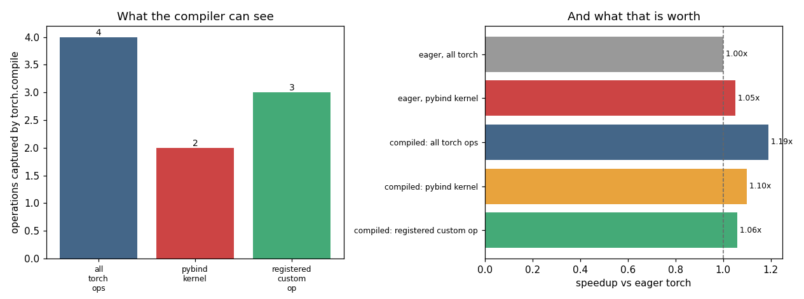

# Custom Op Registration

---

> Register your kernel as a real op, and the compiler will treat it as one of its own.

---

## Key Insight

Wrapping your [kernel](/shared/glossary/#kernel) as a [custom op](/shared/glossary/#custom-op) with `torch.library.custom_op` gives PyTorch the metadata it needs (such as the output shape) to treat your code as a first-class operation. Without this, [`torch.compile`](/shared/glossary/#torchcompile) hits an op it cannot trace and inserts a [graph break](/shared/glossary/#graph-break); with it, your kernel stays inside the optimized graph.

## Why This Matters

A fast custom kernel is far less useful if it forces the compiler to stop, so proper registration is what lets hand-written and compiled code work together instead of fighting each other.

---

**This is project 35**, and the last of Phase 6. Every project so far ended with a
working kernel that PyTorch did not really understand:
[project 30](../30-cpp-extension-for-elementwise-add/README.md)'s `add` had no
gradient, and [project 33](../33-fused-mlp/README.md)'s `bias_gelu` — which is
genuinely 3.5× faster than the two operations it replaces — is invisible to the
compiler. This project fixes that, one piece at a time, and measures what each
piece is worth.

What `run.py` finds:

- an unregistered [pybind11](/shared/glossary/#pybind11) kernel makes
  `torch.compile` capture **1 operation instead of 3** — the kernel is simply not
  in the graph, and in the full MLP it splits one graph into **two**
- registering the identical kernel as a
  [custom op](/shared/glossary/#custom-op) puts it back: **3 operations, 1 graph**
- the [fake implementation](/shared/glossary/#fake-tensor) is one line, and it is
  what lets **four different batch sizes share 2 compiled graphs** instead of four
- `register_autograd` turns `grad_fn=None` into a working backward pass whose
  gradients match PyTorch's to **1.4e-07**
- [`gradcheck`](/shared/glossary/#gradcheck), the standard tool for testing that,
  **cannot be used** on this kernel at all — and the reason is worth knowing before
  you reach for it
- a custom op that quietly overwrites its input runs perfectly and changes its
  caller's data by **3.305**; [`opcheck`](/shared/glossary/#opcheck) catches it in
  one line
- and the honest end-to-end number: registration is worth **structure, not speed**
  here — 1.05× compiled, inside the noise

---

## Files

| file | what it is |
|---|---|
| `run.py` | all seven sections |
| `../30-cpp-extension-for-elementwise-add/kernels_lib.py` | shared build and timing helpers |
| `outputs/findings.csv` | every number quoted here |
| `outputs/dynamo_warning.txt` | what Dynamo says about an untraceable kernel, verbatim |
| `outputs/custom_op.png` | the two figures |

```bash
python3 run.py     # ~10 s after the first build (~25 s of compiling on run 1)
```

---

## The kernel we are registering

It is project 33's winner — bias and [GELU](/shared/glossary/#gelu) in one pass, 8
floats per instruction:

```cpp
Vec z = Vec::loadu(hr + c) + Vec::loadu(pb + c);
Vec y = z * Vec(0.5f) * (Vec(1.f) + (z * Vec(0.70710678f)).erf());
y.store(orow + c);
```

Compiled through `load_inline(functions=["bias_gelu", ...])`, what comes back is:

```
type: <class 'builtin_function_or_method'> -- a plain Python callable, nothing more
```

It computes the right answer (2.4e-07 from `F.gelu(h + b)`) and PyTorch knows
nothing about it. It has no schema, no [dispatch](/shared/glossary/#dispatcher)
entry, no gradient, and no shape rule.

---

## What the compiler does with it

```python
def with_torch_ops(h, b):    return F.gelu(h + b) * 2.0
def with_our_kernel(h, b):   return mod.bias_gelu(h, b) * 2.0
```

| function | operations captured | graphs |
|---|---|---|
| pure torch ops | **3** | 1 |
| our pybind kernel | **1** | 1 |

Three operations become one. The missing two are the add and the GELU — our kernel
— and the one that remains is the `* 2.0`. The kernel runs, correctly, in
[eager mode](/shared/glossary/#eager-mode), outside the graph.

Dynamo says so itself, and the message is unusually good (`outputs/dynamo_warning.txt`):

```
Dynamo does not know how to trace the builtin
`p35_ops.pybind11_detail_function_record_...bias_gelu.` This function is either a
Python builtin (e.g. _warnings.warn) or a third-party C/C++ Python extension
(perhaps created with pybind).

If it is a third-party C/C++ Python extension, please either wrap it into a
PyTorch-understood custom operator ... or, if it is traceable, use
`torch.compiler.allow_in_graph`.
```

> **Why can it not just call our function?** Because `torch.compile` is not
> executing your code — it is *reading* it, to write a recipe it will run later. It
> walks your function with [fake tensors](/shared/glossary/#fake-tensor): objects
> that carry shape, [dtype](/shared/glossary/#dtype) and device but hold no
> numbers. Our kernel is compiled machine code that immediately calls
> `h.data_ptr<float>()` and reads memory. There is no memory. The compiler cannot
> step through it, cannot know what shape comes out, and cannot reason about
> whether it may be reordered — so it stops and hands that part back to eager.

And [autograd](/shared/glossary/#autograd) has the same blind spot:

```
output requires_grad: False, grad_fn: None
RuntimeError: element 0 of tensors does not require grad and does not have a grad_fn
```

Autograd records operations as they run. Ours ran in C++, where nothing is
recorded, so the output arrives with no history. **In a model this does not crash —
it silently stops training that layer**, which is far worse than the exception you
get here.

---

## Registering it

```python
@torch.library.custom_op("p35::bias_gelu", mutates_args=())
def bias_gelu(h: torch.Tensor, bias: torch.Tensor) -> torch.Tensor:
    return mod.bias_gelu(h, bias)
```

That decorator reads the type annotations, builds a schema, and installs the
operator in the [dispatcher](/shared/glossary/#dispatcher):

```
torch.ops.p35.bias_gelu -> p35.bias_gelu
schema: p35::bias_gelu(Tensor h, Tensor bias) -> Tensor
still correct: 2.38e-07
```

`mutates_args=()` is a **promise**: this op does not modify any of its inputs.
Section 6 is about what happens when that promise is false.

> **"Project 30 already registered a kernel with
> [TORCH_LIBRARY](/shared/glossary/#torch_library) in C++. Why do this again in
> Python?"** They register the same thing at different levels.
> `TORCH_LIBRARY` gives the dispatcher an entry — enough for `torch.ops` and
> TorchScript, and it is the right tool when the op lives entirely in C++.
> `torch.library.custom_op` is the modern Python-side API that additionally makes
> it easy to attach the two things `torch.compile` and training need: a
> [fake](/shared/glossary/#fake-tensor) implementation and an autograd rule. You
> can do all of it from C++ too; this way is shorter and harder to get wrong.

---

## Piece 1: the fake implementation

```python
@bias_gelu.register_fake
def _(h, bias):
    return torch.empty_like(h)
```

One line, and it never touches data. It is not a second implementation of GELU — it
is a **rule about shapes**: "given an input of this shape and dtype, the output has
the same shape and dtype."

You can call it directly, which makes what it is very concrete:

```
on meta tensors: got shape (1024, 512), dtype torch.float32, device meta
-- no data was touched; only the shape rule ran
```

`meta` is a device where tensors have every property except contents. That is what
`torch.compile` traces with, so the fake implementation is the only thing standing
between the compiler and "I do not know what comes out of this".

And because it is a rule rather than a fixed answer, it works for shapes nobody has
seen yet:

```
four different batch sizes -> 2 compiled graphs
```

Two, not four. The first call compiles for a specific shape; the second reveals
that the row count varies, so Dynamo recompiles once with that dimension left
symbolic, and the third and fourth reuse it. `torch.empty_like(h)` is true for any
number of rows, so nothing in our op blocks that. (This is the same specialisation
behaviour [project 26](../26-torch-compile-test/README.md) measured on plain torch
ops — our custom op now participates in it instead of standing outside it.)

## Piece 2: the backward pass

```python
def setup_context(ctx, inputs, output):
    ctx.saved = inputs                    # what backward will need

def backward(ctx, grad):
    h, bias = ctx.saved
    return torch.ops.p35.bias_gelu_backward(grad, h, bias)

bias_gelu.register_autograd(backward, setup_context=setup_context)
```

The maths, written out because it is short. With `z = h + bias` and
`y = gelu(z)`:

```
dy/dz = 0.5·(1 + erf(z/√2)) + z · exp(-z²/2)/√(2π)
```

The first term is the GELU factor itself; the second is `z` times the bell curve,
from differentiating [erf](/shared/glossary/#error-function-erf). `grad_h` is that
times the incoming gradient. `grad_bias` is the *sum* of `grad_h` down the rows —
because one bias value was added to every row, so it collects gradient from all of
them.

```
grad_fn is now: <GeneratedBackwardFor_p35_bias_gelu_default>
grad wrt h    : relative error 1.36e-07
grad wrt bias : relative error 1.97e-07
```

### The testing tool that does not work here

[`torch.autograd.gradcheck`](/shared/glossary/#gradcheck) is how you normally verify
a hand-written backward pass. On this op:

```
torch.autograd.gradcheck -> RuntimeError: Expected h.is_contiguous() &&
                            h.scalar_type() == torch::kFloat to be true
```

`gradcheck` compares your gradient against a numerical one computed by nudging each
input, and it insists on [float64](/shared/glossary/#float64) for a good reason:
the numerical estimate divides by a step size around `1e-6`, which multiplies the
forward pass's rounding error by a million. `float32` does not have the digits to
survive that, so correct code would fail. Our kernel is float32-only, so the two
requirements are incompatible.

`run.py` therefore does the comparison by hand — and the *design* of that check is
the transferable part:

```python
probe = h.clone().requires_grad_()
op(probe, b)[i, j].backward()             # gradient of ONE output element
analytic = probe.grad[i, j].item()
num = (op(plus, b)[i, j] - op(minus, b)[i, j]).item() / (2 * eps)
```

```
central differences at 8 random coordinates: worst relative mismatch 7.86e-05
```

Note that the objective is a **single output element**, not a sum over all of them.
With a sum, the value is around 1000 and nudging one input moves it by about 0.01 —
a relative change of `1e-5`, right at the edge of what float32 can represent, so
most of the measured difference is rounding noise. (An earlier version of this
check did exactly that and reported a 12 % mismatch on correct code.) Element by
element, the value is around 1 and the signal survives. **When a numerical gradient
check fails, suspect the check before the gradient.**

---

## Piece 3: opcheck, and two ways to lie

`mutates_args=()` was a promise. `torch.library.opcheck` is the tool that audits
it:

```
-- the honest op --
torch.library.opcheck: all tests passed
```

Now the in-place kernel — the one that writes over `h` instead of allocating —
registered with the same `mutates_args=()`.

**Lie #1: return the input tensor itself.**

```python
@torch.library.custom_op("p35::lying_alias", mutates_args=())
def lying_alias(h, bias):
    return mod.bias_gelu_inplace(h, bias)     # returns h
```

```
RuntimeError on the very first call: The output of this custom operator must not
also be an input ... may not alias any inputs
```

PyTorch catches this one for free. Returning an input is
[aliasing](/shared/glossary/#aliasing-memory) — two names for the same buffer — and
the schema you signed said the op is functional. The compiler is entitled to rely
on that, so the check is enforced at call time. Good news: this class of bug cannot
survive its first execution.

**Lie #2: mutate the input, return a copy.**

```python
@torch.library.custom_op("p35::lying_mutate", mutates_args=())
def lying_mutate(h, bias):
    mod.bias_gelu_inplace(h, bias)            # writes into h ...
    return h.clone()                          # ... and hides the evidence
```

Now nothing aliases, so the automatic check has nothing to see:

```
the call ran with no error, and changed its input by up to 3.305
```

The caller's tensor is now different, silently. This is a genuinely nasty bug —
the numbers are right, no exception is raised, and it only becomes visible later
when something else reads that tensor, or when `torch.compile` reorders work around
a call it was told had no side effects.

`opcheck` finds it in one line:

```
opcheck CAUGHT it: OpCheckError: opcheck(op, ...): test_schema failed with
Argument h is not defined as mutable but was mutated
```

**The fix is not to stop mutating — it is to say so:**

```python
@torch.library.custom_op("p35::bias_gelu_", mutates_args={"h"})
def bias_gelu_(h: torch.Tensor, bias: torch.Tensor) -> None:
    mod.bias_gelu_inplace(h, bias)
```

```
mutates_args={'h'} and returns None: result correct to 2.4e-07
opcheck: all tests passed
```

In-place kernels are welcome — [project 33](../33-fused-mlp/README.md) showed why
you want them — as long as PyTorch knows. Declare the mutation, return `None`, and
the compiler will order the call correctly instead of assuming it can move it.

**Run `opcheck` once per custom op, in a test.** It is the only thing standing
between a promise and a proof.

---

## End to end



A two-layer MLP, 2048 × 512 → 2048 → 512:

| version | operations captured | graphs | error |
|---|---|---|---|
| all torch ops | 4 | 1 | 2.5e-07 |
| pybind kernel | 2 | **2** | 2.2e-07 |
| registered custom op | 3 | **1** | 2.2e-07 |

The structural result is unambiguous. The unregistered kernel **splits the model
into two graphs**: everything before it, then everything after, with an eager call
in between. Registered, the same kernel sits inside one graph, and the compiler can
schedule across it.

The timing result is not:

| version | ms | vs eager |
|---|---|---|
| eager, all torch | 34.9 | 1.00× |
| eager, pybind kernel | 32.4 | 1.08× |
| compiled: all torch ops | 29.6 | 1.18× |
| compiled: pybind kernel | 31.4 | 1.11× |
| compiled: registered custom op | 33.3 | 1.05× |

Everything is between 1.00× and 1.18×, and the registered version is not the
fastest. That is not a failure of registration — it is
[project 33](../33-fused-mlp/README.md)'s ceiling showing up again: **86 % of this
MLP is matmul**, so the entire element-wise story, however well optimized, can only
move 14 %. On top of that, Inductor already generates a fused bias+GELU of its own,
so the custom op is replacing something that was not slow.

So state the value of registration accurately, because the honest version is more
useful than an inflated one:

- **You keep one graph instead of two.** On a real model with a kernel in the
  middle of every layer, that is the difference between whole-model optimization
  and a chain of fragments.
- **You get a gradient**, so the kernel can be used in training at all.
- **You get one compiled graph across many batch sizes**, from a one-line shape
  rule.
- **You get a correctness audit** (`opcheck`) that the pybind function cannot have.
- **You do not automatically get speed.** The kernel has to be worth using on its
  own merits first — measure that, as project 33 did, before deciding registration
  is the missing piece.

---

## What to take away

1. **A [pybind11](/shared/glossary/#pybind11) function is invisible to
   PyTorch.** No gradient, no shape rule, no place in a graph.
2. **Check the captured-operation count, not the clock.** 3 → 1 → 3, and 1 graph →
   2 → 1, are unambiguous where 1.05× is not.
3. **[`register_fake`](/shared/glossary/#fake-tensor) is a shape rule, not a second
   implementation** — one line, and it is what makes dynamic shapes work.
4. **`register_autograd` is the difference between a kernel you can infer with and
   one you can train with.**
5. **[`gradcheck`](/shared/glossary/#gradcheck) needs float64;** a float32 kernel
   cannot use it. When you roll your own finite-difference check, probe a single
   output element or the noise will swamp the signal.
6. **[`opcheck`](/shared/glossary/#opcheck) audits the promises in your schema.**
   PyTorch catches [aliasing](/shared/glossary/#aliasing-memory) at call time;
   silent mutation needs opcheck to find.
7. **Declare mutation with `mutates_args`** rather than avoiding in-place kernels.

---

## Phase 6 ends here

Six projects, and they answer one question in six ways: *when is writing a kernel
worth it?*

- [30](../30-cpp-extension-for-elementwise-add/README.md) — not for an elementwise
  add. Four implementations, one bandwidth, and the pointer loop was wrong on half
  the inputs.
- [31](../31-triton-softmax/README.md) — yes for [softmax](/shared/glossary/#softmax),
  but the win came from a compiler flag (2.0×) rather than from the algorithm, and
  the clever algorithm lost.
- [32](../32-triton-matmul/README.md) — not for [matmul](/shared/glossary/#matmul).
  16.7× from a loop swap, and still only 15 % of oneDNN, with the missing pieces
  named.
- [33](../33-fused-mlp/README.md) — yes for the *epilogue*: 3.5× on the elementwise
  part, 1.07× overall, because that part is only 14 % of the work.
- [34](../34-mini-flashattention/README.md) — yes when the intermediate does not
  fit: 511 MB saved, quadratic memory made flat, at 0.62× the speed.
- [35](../35-custom-op-registration/README.md) — and once it is worth it, register
  it, or the compiler will build its graph around you instead of through you.

The thread running through all six: **find out which resource you are short of
before optimizing anything.** Memory traffic, instruction count, and peak footprint
are three different problems, and every project here contains at least one
optimization that helped one of them by hurting another.

Next, [Phase 7](../../README.md#phase-7-distributed-training--ddp-fsdp-and-beyond)
stops making one device faster and starts making several devices cooperate.
