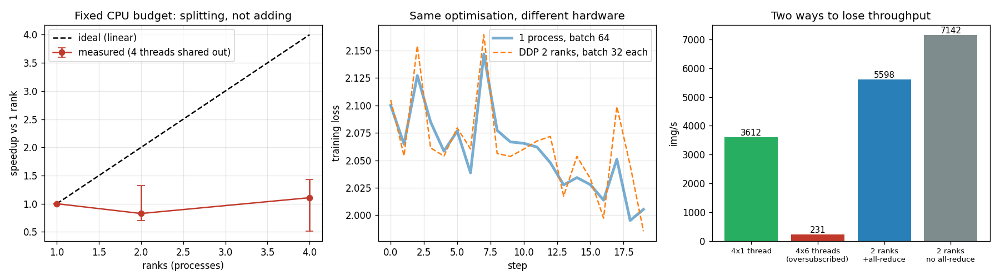

# Two-GPU DDP

---

> Two GPUs, two copies of the model, one shared gradient — and almost twice the speed.

---

## Key Insight

[DDP](/shared/glossary/#ddp) puts a full copy of the model on each GPU, splits the batch between them, and averages the [gradients](/shared/glossary/#gradients) so every copy stays in sync. You launch the job with [torchrun](/shared/glossary/#torchrun), which starts one process per GPU and wires them together.

## Why This Matters

DDP is the simplest and most common way to train faster. Watching two GPUs give nearly double the [throughput](/shared/glossary/#throughput) builds the intuition you need before moving on to sharded or multi-node training.

---

**This is project 36**, and the first of Phase 7. Everything up to here ran in one
process. From now on there are several, and they have to agree.

### About the hardware

This machine has no usable GPU — the card is a GTX 1070 Ti (compute capability sm_61)
and this PyTorch build ships no kernels for it, so the first CUDA launch fails with
`no kernel image is available for execution on the device`. Phase 7 therefore runs on
**CPU with the [gloo](/shared/glossary/#gloo) backend**, one OS process per "device",
each with its own slice of the CPU threads.

What that changes: nothing about the code (`DDP(model)` and every collective call are
identical) and nothing about the correctness results below (they are exact). What it
does change is the *speed* results — a real cluster's links and its idle machines
behave very differently from four processes sharing twelve busy cores, and section 3
is blunt about how little we can conclude from them.

What `run.py` measures:

- DDP on 2 ranks and one process with the doubled batch reach the same weights to
  **2.98e-08** — DDP really is "one big batch", not an approximation of it
- after 20 steps the replicas differ by **exactly 0.000e+00**, which is the entire
  point of the all-reduce
- weak-scaling speedup on this shared box: **0.83× at 2 ranks, 1.11× at 4**, with
  round-to-round spreads of 0.70–1.33 and 0.51–1.43. Read that as *no measurable
  speedup*, and read the section for why that is the expected answer here
- [oversubscription](/shared/glossary/#oversubscription) — every rank grabbing every
  core — costs **15.7×**, an effect so large it survives all that noise
- and the silent bug: without a [DistributedSampler](/shared/glossary/#distributedsampler),
  both ranks train on **all 512 identical samples**, with no warning of any kind

---

## Files

| file | what it is |
|---|---|
| `run.py` | all six sections |
| `dist_lib.py` | the shared launcher used by every project in Phase 7 |
| `outputs/findings.csv` | every number quoted on this page |
| `outputs/ddp.png` | the three figures |

```bash
python3 run.py          # ~3 minutes
```



---

## The launcher, and two rules baked into it

`dist_lib.launch(fn, world_size, threads=...)` starts `world_size` processes, gives
each one `RANK`/`WORLD_SIZE`/`MASTER_ADDR`/`MASTER_PORT`, calls
`init_process_group("gloo")`, and runs your function. It is `torchrun` in miniature —
we use a library instead of the command line so one script can launch dozens of
different configurations. ([Project 41](../41-multi-node-setup/README.md) uses the
real `torchrun`.)

Two rules it enforces, both learned the hard way:

1. **`spawn`, never `fork`.** A forked child inherits PyTorch's thread pools in a
   half-initialised state and deadlocks. `mp.get_context("spawn")` starts a fresh
   interpreter.
2. **`CUDA_VISIBLE_DEVICES=""` in every child.** Otherwise torch finds the unusable
   GPU and anything that auto-selects an accelerator (FSDP does) dies immediately.

And one that cost a debugging session: **a torch tensor put on a
`multiprocessing.Queue` is not copied.** PyTorch passes a shared-memory file
descriptor instead, and if the child exits before the parent reads it, the parent gets
a bare `EOFError`. `dist_lib` serialises results with `torch.save` into plain bytes
first.

---

## 1. Is DDP really "one big batch"?

The claim every DDP tutorial makes is that N ranks with a batch of B each is the same
computation as one process with a batch of N·B. It is checkable:

| after 20 identical steps (SGD, momentum 0.9) | max weight difference |
|---|---|
| DDP, 2 ranks × 32 vs 1 process × 64 | **2.980e-08** |
| DDP, 4 ranks × 16 vs 1 process × 64 | 7.483e-05 |

2.98e-08 on weights of order 0.1 is float32 rounding — the claim holds. The 4-rank
number is bigger, and the reason is worth understanding: floating-point addition is
not associative, so summing four partial gradients gives a slightly different last bit
than summing two, and 20 steps of momentum SGD amplify that difference. It is not a
bug and it is not a "worse" answer; it is the same reason two runs of the same code
with different reduction orders drift apart.

> **Why does averaging the ranks' gradients equal the gradient of the big batch?**
> Because each rank's loss is already a *mean* over its own samples, and the mean of
> means of equal-sized groups is the mean of everything. This is also the one
> assumption that quietly breaks: if the ranks get different batch sizes (a ragged
> last batch, say), the average of the means is no longer the mean of the whole, and
> the smaller rank's samples get more weight than they should.

---

## 2. Do the replicas stay identical?

| | value |
|---|---|
| max \|weights(rank 0) − weights(rank 1)\| after 20 steps | **0.000e+00** |
| max spread across 4 ranks after 20 steps | **0.000e+00** |
| \|loss(rank 0) − loss(rank 1)\| at step 0 | 0.0099 |

Zero. Not small — zero. Every rank starts from weights broadcast by rank 0, and every
rank applies the identical averaged gradient, so identical inputs to identical
arithmetic give identical outputs forever.

The third row is the part beginners find confusing: the **losses differ**, because
each rank computed its loss on its own 32 images. That is correct and expected. It is
also why "rank 0's loss" printed in your log is a noisy estimate of your real training
loss — if you want the true value you must all-reduce it, and if you all-reduce it on
*only* rank 0 you will get the hang from [project 40](../40-debug-a-hang/README.md).

---

## 3. Scaling, and why this machine cannot measure it

Every rank gets its own 32 images, so 4 ranks process 4× the images per step. The
question is whether the wall-clock time stays flat ([weak scaling](/shared/glossary/#weak-scaling)).

To keep the comparison fair, the total thread budget is fixed at 4: one rank gets 4
threads, two ranks get 2 each, four ranks get 1 each. Every configuration is measured
once per round, six rounds, and the speedup is computed *within* each round and then
median-ed — comparing the best A against the best B on a shared machine measures who
got lucky.

| configuration | throughput | speedup | range across 6 rounds |
|---|---|---|---|
| 1 rank × 4 threads | 5766 img/s | 1.00× | — |
| 2 ranks × 2 threads | 5770 img/s | 0.83× | 0.70 – 1.33 |
| 4 ranks × 1 thread | 6293 img/s | 1.11× | 0.51 – 1.43 |

**The honest reading: there is no measurable speedup here, and the error bars overlap
1.0 in both directions.** As a sanity check, `run.py` measures the *same* configuration
(4 ranks × 1 thread) again in the next section and gets 3612 img/s against this
section's 6293 — a 1.7× gap between two measurements of the identical thing.

That is not a defect in DDP; it is what this measurement is worth on a machine where
something else is already using half the cores. Two real effects are hiding under it:

- **DDP does not create compute.** On a real cluster, rank 2 is a *second GPU* — new
  hardware doing new work, so throughput really does nearly double. Here, the four
  processes share the same twelve cores, so we are dividing a fixed budget, not adding
  to it. Perfect scaling would be exactly 1.0× — flat — and anything above that comes
  from processes using the CPU better than threads do.
- **The all-reduce costs something**, which section 6 measures directly.

The lesson to take away is the methodological one: **if you cannot reproduce a
throughput number twice, you cannot conclude anything from it.** Measure scaling on an
idle machine, report the spread, and be suspicious of any speedup smaller than your
error bar.

---

## 4. The oversubscription trap

One effect *is* big enough to see through the noise. Same 4 ranks, same work; the only
change is how many threads each process thinks it may use.

| 4 ranks on a 12-core machine | throughput |
|---|---|
| 1 thread each (4 threads total) | 3612 img/s |
| 6 threads each (24 threads total) | **231 img/s** |
| **cost** | **15.7× slower** |

Not "a bit slower with some contention" — an order of magnitude. Twenty-four compute
threads on twelve cores do not politely take turns: the maths libraries' threads
*spin* while waiting for each other, so cores burn cycles doing nothing while the work
queues up behind them.

This is why `torchrun` prints this on startup when you have not set the variable
yourself:

```
Setting OMP_NUM_THREADS environment variable for each process to be 1 in default,
to avoid your system being overloaded
```

It is easy to dismiss as boilerplate. It is worth 15×.

---

## 5. The DistributedSampler bug that never announces itself

Each rank must read *different* data. [`DistributedSampler`](/shared/glossary/#distributedsampler)
is what arranges that. Here is what happens with and without it, 512 samples, 2 ranks:

| | with sampler | without |
|---|---|---|
| samples seen by **both** ranks | 376 of 512 | **512 of 512** |
| batches per epoch, per rank | 8 | 16 |
| final loss after 3 epochs | **1.6699** | 1.8345 |

Without the sampler, both ranks shuffle the same dataset with the same seed and walk
the identical 512 samples. Nothing crashes. No warning appears. The gradients are
still averaged correctly — they are just averages of two identical gradients, so the
model behaves exactly as if you had used one GPU, while you pay for two.

The measured loss says the same thing from the other side: with the sampler, one epoch
is 8 batches per rank and the model gets further; without it, 16 batches per rank of
duplicated work gets less far. You did twice the work for a worse result.

> **Why does the "with sampler" row still share 376 samples between the ranks?**
> Because the count is over three epochs. Within *one* epoch the split is disjoint —
> that is the guarantee. Across epochs the sampler reshuffles, so a sample that rank 0
> saw in epoch 1 may go to rank 1 in epoch 2, which is exactly what you want.

### The `set_epoch` half of the same bug

| | epochs whose order is identical to epoch 0 |
|---|---|
| without `sampler.set_epoch(epoch)` | **2 of 2** |
| with `sampler.set_epoch(epoch)` | 0 of 2 |

The sampler derives its shuffle from the epoch number you give it. Forget the call and
every epoch replays the identical order — you are training on a fixed sequence for the
rest of the run. One line, at the top of the epoch loop:

```python
for epoch in range(n_epochs):
    sampler.set_epoch(epoch)      # <- without this, no reshuffling ever happens
    for xb, yb in loader:
        ...
```

---

## 6. What does the all-reduce cost?

Same 2 ranks, same work, six paired rounds; the only difference is whether the model
is wrapped in `DDP` (correct, and communicates) or left bare (fast, and produces two
diverging models).

| | throughput |
|---|---|
| parameters in the model | 64,520 |
| gradient bytes all-reduced per step | 252 KB |
| 2 ranks **with** the all-reduce (real DDP) | 5598 img/s |
| 2 ranks **without** it (wrong, but fast) | 7142 img/s |
| overhead, median of paired rounds | **35%** (range −32% to +81%) |

The median says communication costs about a third of the step for this tiny model, and
the range says once again not to trust the exact figure on this machine. The direction
is solid and the reason is arithmetic: this model is *small*, so 252 KB of gradients
must be exchanged for only a few milliseconds of compute. Big models have a much better
ratio — the compute grows with the parameters *and* with the batch, while the
communication grows only with the parameters.

That ratio is the single best predictor of whether DDP will scale for you, and
[project 37](../37-implement-gradient-allreduce/README.md) takes it apart.

---

## What to remember

1. **DDP with N ranks == one process with N times the batch.** Verified to 3e-08.
2. **The replicas stay bit-identical** because they start identical and get an
   identical averaged gradient. The *losses* differ, and should.
3. **DDP does not create compute.** On real hardware the extra rank is extra hardware;
   in a CPU simulation you are splitting a fixed budget.
4. **Never trust a throughput number you cannot reproduce** — ours varied 1.7× between
   two measurements of the same configuration.
5. **Oversubscription costs 15×.** One process per device, and let `torchrun` set
   `OMP_NUM_THREADS=1`.
6. **No `DistributedSampler` = every rank trains on the same data**, silently.
   No `set_epoch` = every epoch is the same epoch, silently.

---

*Next: [project 37](../37-implement-gradient-allreduce/README.md) removes the `DDP`
wrapper and writes the all-reduce by hand.*
