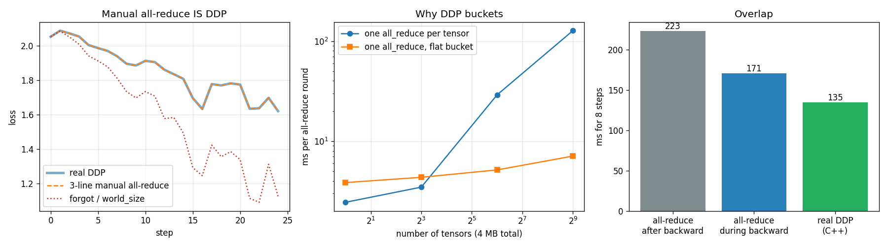

# Implement Gradient AllReduce

---

> DDP's magic is one collective call — write it yourself and the magic disappears.

---

## Key Insight

[AllReduce](/shared/glossary/#allreduce) is the [collective operation](/shared/glossary/#collective-operation) that sums a tensor across every [rank](/shared/glossary/#rank) and hands the result back to all of them. Doing this by hand on your [gradients](/shared/glossary/#gradients) with `torch.distributed.all_reduce` reproduces exactly what [DDP](/shared/glossary/#ddp) does automatically.

## Why This Matters

Once you can write the all-reduce yourself, DDP stops being a black box. You will understand why every GPU ends up with identical gradients, and therefore the same model, after each step.

---

**This is project 37.** [Project 36](../36-two-gpu-ddp/README.md) used `DDP(model)` and
took it on trust. Here we replace it with three lines we wrote ourselves and check,
number by number, that nothing changed — and then find out what the *rest* of DDP's
code is actually buying.

What `run.py` measures:

- three lines of `all_reduce` reproduce DDP **exactly**: after 25 steps the weights
  differ by **0.000e+00**
- the two bugs you will write anyway: forgetting `/ world_size` (a silently doubled
  learning rate) and forgetting the initial broadcast (**0.249** of permanent
  disagreement between ranks that no amount of training removes)
- a [ring all-reduce](/shared/glossary/#ring-all-reduce) built from `send`/`recv`, matching
  the built-in **exactly** at 2 ranks, and moving the **6.0 MB** the formula predicts
- [bucketing](/shared/glossary/#gradient-bucketing) is worth **17.9×** at 512 tensors —
  and **0.64× (i.e. slower)** at one tensor, which is the honest half of the story
- starting the communication *during* the backward pass: our hook version 1.31×,
  the real C++ DDP **1.65×**
- and DDP's own instrumentation admitting that on this machine communication
  (**11.2 ms**) costs more than the backward pass it hides behind (**7.1 ms**)

---

## Files

| file | what it is |
|---|---|
| `run.py` | all six sections |
| [`../36-two-gpu-ddp/dist_lib.py`](../36-two-gpu-ddp/dist_lib.py) | shared launcher (`spawn`, gloo, per-rank thread budget) |
| `outputs/findings.csv` | every number quoted on this page |
| `outputs/allreduce.png` | the three figures |

```bash
python3 run.py          # ~1 minute
```



---

## 1. DDP, in three lines

```python
def manual_sync_(model, world):
    for p in model.parameters():
        if p.grad is not None:
            dist.all_reduce(p.grad, op=dist.ReduceOp.SUM)
            p.grad /= world
```

Call that after `loss.backward()` and before `opt.step()`, on a plain `nn.Module`
with no wrapper at all, and you have data-parallel training.

Why it works is worth saying slowly. `all_reduce(SUM)` leaves **every** rank holding
the sum of all the ranks' copies — not just rank 0. Divide by the [world size](/shared/glossary/#world-size)
and every rank now holds the *same average gradient*. Same starting weights + same
gradient + same optimizer = the replicas cannot drift apart, ever.

| check, 2 ranks, 25 steps | value |
|---|---|
| max \|weights(manual) − weights(DDP)\| | **0.000e+00** |
| max \|gradient(manual) − gradient(DDP)\| at the last step | **0.000e+00** |
| final loss, DDP / manual | 1.6199 / 1.6199 |
| max \|weights(rank 0) − weights(rank 1)\| | **0.000e+00** |

Not "close". Bit-for-bit identical. DDP is not doing different arithmetic from your
three lines; everything else it contains is about *speed*, which is sections 4 and 5.

> **Why divide by the world size instead of just summing?** Because you want the
> gradient of the *mean* loss over the whole global batch. Each rank already averaged
> over its own 32 samples; summing two such averages gives twice the mean, not the
> mean of 64. `all_reduce` has no "average" mode on all backends, so summing and
> dividing is the portable way to write it.

---

## 2. The two bugs you will actually write

**Forgetting `/ world_size`.** Nothing crashes. The gradients are simply twice as
large as they should be with 2 ranks, which is arithmetically identical to doubling
your learning rate and telling nobody.

| | value |
|---|---|
| max \|weights − weights(DDP)\| after 25 steps | **9.4e-02** |
| final loss vs DDP | 1.1252 vs 1.6199 |

The loss is *lower*, which is the cruel part: on a small toy problem an accidentally
doubled learning rate often looks like an improvement. On a real run it is the
difference between converging and diverging at step 30,000, and you will be looking
for the bug in your data pipeline.

**Forgetting the initial broadcast.** Averaging gradients keeps replicas together
only if they *started* together. If each rank initialises its own weights (different
seed, or a seed derived from the rank), the averaged gradient is the same everywhere
but the weights are not, and they never converge to each other:

| | value |
|---|---|
| max \|weights(rank 0) − weights(rank 1)\| after 25 steps | **0.249** |
| final loss, rank 0 / rank 1 | 1.8560 / 1.8397 |

Two different models, each trained on a gradient computed for neither of them.
`DDP(model)` does this broadcast for you in its constructor — it copies rank 0's
parameters and buffers to everyone before the first step. In the hand-written
version you must write `for p in model.parameters(): dist.broadcast(p.data, src=0)`
yourself, or set the same seed on every rank as we do here.

> **Isn't setting the same seed enough, then?** For this toy model, yes. In a real
> job it is not: dropout masks, data ordering, and any weight loaded from disk on
> rank 0 only will all differ. The broadcast is the guarantee that does not depend
> on you having thought of every source of randomness.

---

## 3. Ring all-reduce, written by hand

The built-in `all_reduce` is one call. Underneath, for large tensors, it is usually
a **ring**. `run.py` implements it with nothing but point-to-point `isend`/`irecv`:

```
phase 1, reduce-scatter:  chunk k travels around the circle being ADDED at each stop
                          -> after N-1 steps rank r owns the finished chunk r
phase 2, all-gather:      those finished chunks travel around again
                          -> after N-1 more steps everyone has all of them
```

| | 2 ranks | 4 ranks |
|---|---|---|
| max error vs `dist.all_reduce` | **0.000e+00** | 9.5e-07 |
| bytes sent per rank | 4.0 MB = 1.00 D | 6.0 MB = 1.50 D |
| bytes through rank 0 if you gather-then-broadcast instead | 8.0 MB | **24.0 MB** |
| our Python ring / the built-in call | 6.6 ms / 2.6 ms | 12.7 ms / 7.4 ms |

The per-rank cost of the ring is `2 × (N−1)/N × D` — for a 4 MB tensor that is 4 MB
at 2 ranks and 6 MB at 4 ranks, and it never exceeds `2D` no matter how many machines
you add. The naive alternative — everyone sends to rank 0, rank 0 adds and sends the
answer back — pushes `(N−1) × D` bytes through **one machine's** network card, so it
gets steadily worse: 24 MB at 4 ranks, 240 MB at 41. That is the entire reason rings
exist.

Our Python version is **1.7–2.5× slower** than the built-in, which is the honest
result: the algorithm is right, but each chunk pays Python function-call overhead
and an extra buffer allocation that the C++ implementation does not.

> **Why is the 4-rank error 9.5e-07 instead of exactly zero?** Because floating-point
> addition is not associative: `(a+b)+c` and `a+(b+c)` can differ in the last bit.
> Our ring adds the chunks in a different order than gloo's implementation does. At
> 2 ranks there is only one order, so the answers match exactly.

---

## 4. Why DDP buckets

Same 4 MB of gradients every time. The only thing that changes is whether it arrives
as one tensor or many.

| tensors | one `all_reduce` each | one flat buffer | speedup |
|---|---|---|---|
| 1 | 2.45 ms | 3.86 ms | **0.64×** |
| 8 | 3.48 ms | 4.36 ms | **0.80×** |
| 64 | 29.05 ms | 5.16 ms | 5.62× |
| 512 | 127.28 ms | 7.10 ms | **17.9×** |

Read the last row first: **the same bytes take 18× longer when split into 512
messages.** The [alpha-beta model](/shared/glossary/#alpha-beta-model) explains it —
every message costs `α + D/B`, a fixed setup cost plus a per-byte cost. For a 8 KB
tensor the `α` dominates completely, so 512 messages cost about 512 α. Merge them
into one buffer and you pay α once. It is the same reason you put twenty pages in one
envelope instead of posting twenty envelopes.

Now read the *first* two rows, which are the honest inversion: at one tensor bucketing
is **1.6× slower**, and it is still losing at eight. There is only one message either way, so no latency is
saved, and the copy into and out of the flat buffer is pure added work. This is
exactly why `bucket_cap_mb` is a knob and not a constant: bucketing pays when you
have many small gradients, and costs when you have few large ones.

A real transformer sits firmly at the "many small" end — a 24-layer model has
hundreds of parameter tensors, most of them under a megabyte.

---

## 5. Overlapping communication with the backward pass

The three-line version waits for the entire backward pass to finish before it starts
communicating. But gradients become available *one layer at a time*, starting from
the output. There is no reason the last layer's gradient cannot be flying across the
network while the first layer's is still being computed.

```python
class OverlappedDDP:
    def __init__(self, module, world):
        for p in module.parameters():
            p.register_post_accumulate_grad_hook(self._hook)   # fires DURING backward

    def _hook(self, p):
        h = dist.all_reduce(p.grad, op=dist.ReduceOp.SUM, async_op=True)
        self.handles.append((h, p))                            # returns immediately

    def finish(self):
        for h, p in self.handles:                              # block only here
            h.wait()
            p.grad /= self.world
```

Model: 1,597,704 parameters in 52 tensors, 8 steps, 2 ranks.

| | time | speedup |
|---|---|---|
| all-reduce **after** backward | 223 ms | 1.00× |
| all-reduce **during** backward (the hooks above) | 171 ms | 1.31× |
| real DDP (C++ buckets + overlap) | **135 ms** | **1.65×** |

Our hook version captures part of the win; DDP captures more, because it also
*buckets* — a bucket's worth of gradients goes out as one message the moment the last
gradient in it is ready, combining both tricks from this project.

DDP will tell you this itself. `ddp._get_ddp_logging_data()` reports:

| DDP's own measurement | value |
|---|---|
| `bucket_cap_bytes` | 26,214,400 (25 MB, the default) |
| `avg_backward_compute_time` | 7.1 ms |
| `avg_backward_comm_time` | **11.2 ms** |
| `avg_backward_compute_comm_overlap_time` | 4.9 ms |

Communication costs *more* than the computation it is trying to hide behind, and only
4.9 of its 11.2 ms are successfully overlapped. That is a fair picture of a small
model on a slow link, and it is why the answer to "my DDP job does not scale" is
usually "your model is too small for your network", not "your code is wrong".

---

## 6. `no_sync()`: skipping the collectives you do not need

With [gradient accumulation](/shared/glossary/#gradient-accumulation) you run several
micro-batches and step the optimizer once. Gradients simply add up in `p.grad`
between steps — so all-reducing after *every* micro-batch is wasted network traffic.
You only need the average once, just before the step.

| 16 micro-batches, accumulating 4 at a time | `all_reduce` calls |
|---|---|
| syncing every micro-batch | 96 |
| syncing once per optimizer step | **24** |
| max \|weights(every) − weights(once)\| | **0.000e+00** |

Four times fewer collectives, and the resulting model is bit-for-bit identical. It
works because averaging and summing commute: averaging four gradients then adding
them gives the same answer as adding them then averaging.

With real DDP you get this by wrapping the non-final micro-batches in
`with ddp.no_sync():`, which tells DDP not to fire its bucket reductions on that
backward pass.

---

## What to remember

1. **DDP is `all_reduce(SUM)` then divide.** Everything else in it is performance.
2. **Forgetting `/ world_size` is a silent learning-rate change**, and on a small
   problem it can look like an improvement.
3. **Averaging gradients only keeps replicas identical if they started identical** —
   that is what DDP's constructor broadcast is for.
4. **A ring all-reduce moves just under 2 D bytes per rank regardless of N**; sending
   everything through rank 0 moves (N−1) D through one link.
5. **Bucketing is worth 18× at 512 small tensors and loses at one or eight.** Know which
   end of that your model is at.
6. **Communication can cost more than the compute it hides behind.** Ask DDP: it keeps
   the numbers.

---

*Next: [project 38](../38-fsdp-a-transformer/README.md) stops replicating the model
altogether and gives each rank a slice.*
