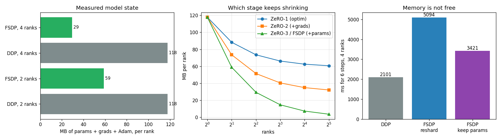

# FSDP a Transformer

---

> Don't copy the whole model to every GPU — give each one a slice and borrow the rest just in time.

---

## Key Insight

[FSDP](/shared/glossary/#fsdp) splits a model's [parameters](/shared/glossary/#parameters), [gradients](/shared/glossary/#gradients), and [optimizer state](/shared/glossary/#optimizer-state) into [shards](/shared/glossary/#sharding), one per GPU, and gathers each full layer only for the moment it is needed. This lets you train a [transformer](/shared/glossary/#transformer) that is far too large to fit on a single GPU under [DDP](/shared/glossary/#ddp).

## Why This Matters

FSDP is the modern default for training large models on ordinary clusters. Seeing a model run under FSDP that crashes under DDP makes the memory savings concrete.

---

**This is project 38.** [Projects 36](../36-two-gpu-ddp/README.md) and
[37](../37-implement-gradient-allreduce/README.md) both assumed the model fits on one
device, and spent their effort on splitting the *batch*. This one splits the *model*.

The guide asks for a 1B-parameter model on hardware that cannot hold it. This machine
has no usable GPU at all, so the same experiment is run at 1/100th the size with a
per-rank memory *budget* we enforce ourselves — the arithmetic, the API, and the
failure are identical, only the numbers are smaller.

What `run.py` measures:

- the 16-bytes-per-parameter rule, checked against the allocator: **112.3 MB** of
  model state for a 7.4M-parameter model
- `fully_shard` really does cut every parameter: `p.shape` still says `(2048, 256)`
  while `p.to_local().shape` says `(1024, 256)`
- **4.00× less** model state per rank at 4 ranks — exactly 1/N, no rounding
- a 19.3M-parameter model that **FAILS** a 100 MB budget under DDP and **FITS** under
  FSDP
- the loss curves are **identical to 0.000e+00** — sharding is a storage decision,
  not a different algorithm
- what it costs: **2.42× slower** than DDP here, and **1.63×** if you tell FSDP not to
  re-shard after the forward pass
- two traps that fail *silently*: building the optimizer one line too early trains
  **nothing at all**, and `model.state_dict()` hands you a quarter of a model that
  claims to be whole

---

## Files

| file | what it is |
|---|---|
| `run.py` | all seven sections |
| `model.py` | the small GPT-style transformer (shared with [project 39](../39-tensor-parallel-attention/README.md)) |
| [`../36-two-gpu-ddp/dist_lib.py`](../36-two-gpu-ddp/dist_lib.py) | shared launcher and byte-accounting helpers |
| `outputs/findings.csv` | every number quoted on this page |
| `outputs/fsdp.png` | the three figures |

```bash
python3 run.py          # ~3.5 minutes
```



---

## FSDP1 does not run without a GPU — FSDP2 does

Worth knowing before you try this on a laptop:

```
FullyShardedDataParallel(model)
  -> RuntimeError: FSDP needs a non-CPU accelerator device, but no accelerator
     device is detected.

fully_shard(model, mesh=init_device_mesh("cpu", (4,)))
  -> works
```

`fully_shard` (informally "FSDP2") is the current implementation, rebuilt on top of
[DTensor](/shared/glossary/#dtensor). Besides running on CPU, it is the version being
developed; the older `FullyShardedDataParallel` class is in maintenance. Everything
below uses `fully_shard`.

One more environment note: any child process must have `CUDA_VISIBLE_DEVICES=""`, or
FSDP finds this machine's unusable GPU, picks it as the accelerator, and dies with
`no kernel image is available for execution on the device`.

---

## 1. The arithmetic: 16 bytes per parameter

Before measuring anything, count. Training one float32 parameter with
[AdamW](/shared/glossary/#adamw) costs:

| what | bytes per parameter |
|---|---|
| the weight | 4 |
| its gradient | 4 |
| Adam's first moment (the running average of the gradient) | 4 |
| Adam's second moment (the running average of the gradient *squared*) | 4 |
| **total** | **16** |

For our 7,356,928-parameter model that is 28.1 + 28.1 + 56.1 = **112.3 MB**, and the
measured numbers agree exactly. This is the single most useful estimate in large-model
training: a 7B model needs **112 GB** just to hold the training state — before a
single activation — which is why it does not fit on an 80 GB card no matter how small
you make the batch.

> **Why does Adam cost twice what the weights do?** Because it keeps *two* running
> averages per parameter, not one. The first moment is a smoothed gradient (momentum);
> the second is a smoothed squared gradient, used to scale each parameter's step
> individually. Plain SGD without momentum keeps neither and costs 8 bytes per
> parameter instead of 16.

---

## 2. What `fully_shard` does to a parameter

```python
mesh = init_device_mesh("cpu", (world,))
for blk in model.blocks:
    fully_shard(blk, mesh=mesh)     # one shard unit per block
fully_shard(model, mesh=mesh)       # and one for the leftovers
```

Afterwards, every parameter is a [DTensor](/shared/glossary/#dtensor):

| | value |
|---|---|
| class of `model.tok.weight` | **DTensor** |
| `p.shape` — what your code sees | (2048, 256) |
| `p.to_local().shape` — what this rank stores | **(1024, 256)** |
| parameters actually held, 2 ranks | 3,678,464 of 7,356,928 |

This double identity is the whole trick. Your model code, your `forward`, and your
printouts all see the full 2048×256 matrix, so nothing has to be rewritten. Only the
storage is halved. When a layer is about to run, FSDP issues an
[all-gather](/shared/glossary/#allgather) to rebuild the full weight, uses it, and
throws the borrowed part away again.

> **If the full weight has to exist during the forward pass anyway, what was saved?**
> Only *one block's* weights exist in full at any moment, and only for as long as that
> block is running. The 16-bytes-per-parameter state — weights, gradients, and Adam's
> two moments — is what stays resident for the entire step, and *that* is what gets
> divided by N. The gathered copy is a brief spike the size of your largest block,
> not of your model.

---

## 3. Measured bytes per rank

| configuration | params | grads | Adam | total |
|---|---|---|---|---|
| DDP, 2 ranks | 28.1 MB | 28.1 MB | 56.1 MB | 112.3 MB |
| **FSDP, 2 ranks** | 14.0 MB | 14.0 MB | 28.1 MB | **56.1 MB** |
| DDP, 4 ranks | 28.1 MB | 28.1 MB | 56.1 MB | 112.3 MB |
| **FSDP, 4 ranks** | 7.0 MB | 7.0 MB | 14.0 MB | **28.1 MB** |

DDP's number does not move at all as you add ranks — that is the definition of
replication. FSDP's falls by exactly the factor you would hope: **4.00× smaller at 4
ranks**.

The whole-process memory tells a more modest story, because a Python process running
PyTorch costs a couple of hundred megabytes before your model exists:

| | peak resident growth |
|---|---|
| DDP, 4 ranks | 300 MB |
| FSDP, 4 ranks | 231 MB |

That is the honest picture at this scale: sharding a 28 MB model saves 28 MB of a 300
MB process. Scale the model up and the fixed overhead stops mattering — which is
exactly the regime FSDP is for.

### The ZeRO stages, computed for this model

[ZeRO](/shared/glossary/#zero) names three cumulative levels of "stop duplicating
things". FSDP's full sharding is stage 3.

| ranks | stage 1 (optimizer only) | stage 2 (+ gradients) | stage 3 = FSDP (+ parameters) |
|---|---|---|---|
| 1 | 112.3 MB | 112.3 MB | 112.3 MB |
| 2 | 84.2 MB | 70.2 MB | 56.1 MB |
| 4 | 70.2 MB | 49.1 MB | 28.1 MB |
| 8 | 63.1 MB | 38.6 MB | 14.0 MB |

Read down the columns, not across the rows. Stage 1 flattens out at 8 bytes per
parameter and stage 2 at 4, because they never shard the weights themselves — adding
more GPUs stops helping. Only stage 3 keeps falling as 1/N. That is why "we are out of
memory, add more GPUs" only works at stage 3.

---

## 4. The model that does not fit

A real GPU raises `CUDA out of memory`. We have no GPU, so `run.py` enforces the same
kind of limit itself: a 100 MB per-rank budget on model state, checked after the
optimizer step. The model is a bigger transformer — 19,296,000 parameters, so 309 MB
of state.

| 4 ranks, 100 MB budget | result |
|---|---|
| DDP | **FAILS** — `OutOfMemoryError (simulated): tried to keep 309 MB of model state on a device with a 100 MB budget` |
| FSDP | **FITS** — 73.6 MB of model state per rank |

Same model, same optimizer, same batch, same four processes. The only difference is
whether each rank keeps everything or one quarter of everything.

---

## 5. Is it the same training run?

A memory optimisation that changes your results is not an optimisation, it is a bug.
Same model, same data, same seeds, 2 ranks:

| step | 1 | 2 | 3 | 4 | 5 | 6 |
|---|---|---|---|---|---|---|
| DDP | 7.711 | 7.785 | 7.774 | 7.735 | 8.012 | 7.831 |
| FSDP | 7.711 | 7.785 | 7.774 | 7.735 | 8.012 | 7.831 |

**Maximum difference: 0.000e+00.** Not approximately equal — equal.

(The 4-rank FSDP run differs from the 2-rank DDP run by 9.5e-07, and that one *should*
differ: four ranks means four times the global batch, a genuinely different
optimisation problem. It is a useful control — it shows the comparison above is not
accidentally comparing something to itself.)

---

## 6. What sharding costs

FSDP moves more data than DDP, and the bytes say why:

| per rank, per step, 4 ranks | bytes |
|---|---|
| DDP: one [all-reduce](/shared/glossary/#allreduce) of the gradients | 42.1 MB |
| FSDP: all-gather (forward) + all-gather (backward) + [reduce-scatter](/shared/glossary/#reduce-scatter) (gradients) | **84.2 MB (2.0×)** |

DDP sends the gradients once. FSDP has to fetch the weights it does not own — twice,
once for each pass — and then scatter the gradients back. And it shows up on the
clock:

| 4 ranks, 6 steps | time | vs DDP |
|---|---|---|
| DDP | 2101 ms | 1.00× |
| FSDP, re-sharding after the forward pass | 5094 ms | **2.42× slower** |
| FSDP, keeping the gathered weights until backward | 3421 ms | 1.63× slower |

That middle row is the default and the memory-safest: after a block's forward pass,
throw the gathered weights away immediately, then gather them *again* for the backward
pass. `reshard_after_forward=False` keeps them instead — one gather instead of two,
33% faster here, at the cost of holding the un-sharded weights through the whole
forward pass. That knob is roughly the ZeRO-2 versus ZeRO-3 trade, expressed per layer.

**FSDP is slower than DDP. That is the correct result.** You use it when the
alternative is not running at all.

### Wrap every block, not just the model

| | peak resident memory | model state |
|---|---|---|
| `fully_shard(model)` only | **926 MB** | 28.1 MB |
| `fully_shard` on every block, then the model | **731 MB** | 28.1 MB |

The steady-state model state is identical — both shard the parameters equally. The
difference is entirely in the transient: with one shard unit, the *whole* model gets
gathered before the first layer runs, so the peak is as if you had never sharded at
all. With one unit per block, only one block is un-sharded at a time. 195 MB of
difference on a 28 MB model, purely from where you put the wrapper.

---

## 7. Two traps that do not raise anything

### Trap 1: building the optimizer before sharding

```python
opt = torch.optim.AdamW(model.parameters(), lr=1e-3)   # <-- one line too early
model = shard_it(model, mesh)
```

| | optimizer built **before** | optimizer built **after** |
|---|---|---|
| Adam state per rank | **0 B (0 tensors)** | 14.0 MB (69 tensors) |
| sum of weights before → after 6 steps | 1408.137453 → **1408.137453** | 1408.137453 → 1379.698467 |
| final loss | 7.8543 | 7.8308 |

The weights **did not move at all.** No exception, no warning, and a loss that goes up
and down convincingly because the data changes each step. What happened: `fully_shard`
replaces the module's parameter objects with new DTensor ones, so the optimizer is
still holding references to the old, now-orphaned tensors. Those tensors never receive
a gradient, so AdamW skips them — which is also why it never allocated any state for
them.

The rule is simple: **shard first, then build the optimizer.** The zero-byte Adam
state is the tell — if your optimizer state is empty after a step, nothing is training.

### Trap 2: `state_dict()` under FSDP

| | value |
|---|---|
| `model.state_dict()["blocks.0.qkv.weight"]` type | **DTensor** |
| its `.shape` / its local shape | (768, 256) / **(192, 256)** |
| bytes actually on this rank | **7.0 MB** of a 28.1 MB model |

`torch.save(model.state_dict(), path)` on rank 0 therefore writes **a quarter of your
model**, in a wrapper that reports the full shape. Loading it elsewhere will either
fail confusingly or silently give you a broken model.

The correct call gathers first:

```python
from torch.distributed.checkpoint.state_dict import get_model_state_dict, StateDictOptions
sd = get_model_state_dict(model, options=StateDictOptions(full_state_dict=True,
                                                          cpu_offload=True))
```

| | value |
|---|---|
| rank 0 gets | a plain `Tensor`, shape (768, 256), 28.1 MB total — the whole model |
| rank 1 gets | **0 keys** |

Note the second row, which is easy to trip over: with `cpu_offload=True` the full model
is assembled on rank 0 *only*. Save from every rank and you write one real checkpoint
and N−1 empty files. Guard the save with `if rank == 0:`. (For large models the better
answer is `torch.distributed.checkpoint`, which writes one file per rank in parallel
and never assembles the model anywhere.)

---

## What to remember

1. **16 bytes per parameter** with Adam in fp32 — 4 weight, 4 gradient, 8 optimizer.
   Estimate before you allocate.
2. **FSDP divides that by the number of ranks**, exactly; DDP divides it by nothing.
3. **Only ZeRO stage 3 / FSDP keeps shrinking** as you add GPUs. Stages 1 and 2 hit a
   floor.
4. **The loss curve is identical.** If sharding changes your numbers, something is
   wrong.
5. **It is 2.4× slower here.** Memory and speed are being traded, deliberately.
6. **Wrap every block**, or the first forward pass gathers the entire model and you
   save nothing at the peak.
7. **Shard first, then build the optimizer** — and never `torch.save(model.state_dict())`
   under FSDP.

---

*Next: [project 39](../39-tensor-parallel-attention/README.md) splits a single layer
instead of the batch — for when one layer is the thing that does not fit.*
