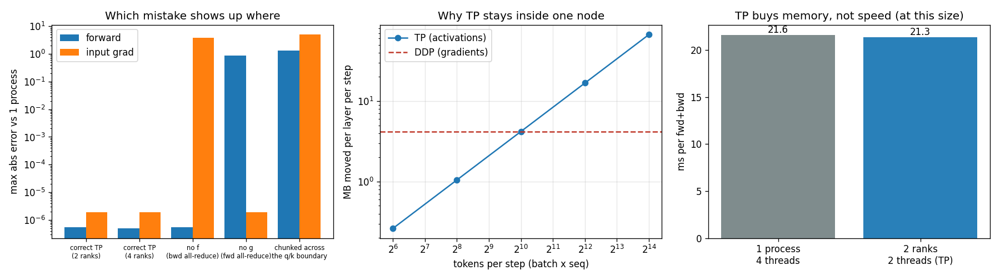

# Tensor Parallel Attention

---

> When one layer is too big for one GPU, cut the layer itself in half.

---

## Key Insight

[Tensor parallelism](/shared/glossary/#tensor-parallelism-tp) splits the [weights](/shared/glossary/#weights) of a single layer across GPUs, instead of replicating the whole model. Splitting a multi-head [attention](/shared/glossary/#attention) layer [column-wise](/shared/glossary/#column-wise-partitioning) across two GPUs (the [Megatron](/shared/glossary/#megatron) style) lets each GPU compute part of the [heads](/shared/glossary/#heads) and then combine the results.

## Why This Matters

Some layers are too large to fit or run on one GPU. Tensor parallelism is the standard way to spread that single layer's work across several GPUs, and it is a core building block for training the very largest models.

---

**This is project 39.** [Project 38](../38-fsdp-a-transformer/README.md) split the
model by *storage* — each rank owned a slice of every weight but still ran the whole
layer, gathering what it did not own. This one splits the model by *work*: each rank
runs a different part of the same layer and never sees the rest.

What `run.py` measures:

- attention on 2 ranks, each holding **half** the weights, agreeing with a single
  process to **3.7e-07 relative** — the limit of float32
- the same for the gradients, so it is a real training layer, not just a forward pass
- what breaks when you remove each of Megatron's two collectives: dropping `g` makes
  the **output** wrong by 87% of its scale, dropping `f` leaves the forward pass
  perfect and silently corrupts the **input gradient** by 3.78
- the head-boundary trap: `qkv.weight.chunk(2, dim=0)` produces the right *shape*,
  raises nothing, and computes a completely different function (**93% relative error**)
- PyTorch's own `ColwiseParallel`/`RowwiseParallel` reproducing the hand-written
  version to **3.0e-07**
- and the cost: half the parameters per rank, but **1.01×** the speed — tensor
  parallelism buys memory, not time

---

## Files

| file | what it is |
|---|---|
| `run.py` | all six sections |
| [`../38-fsdp-a-transformer/model.py`](../38-fsdp-a-transformer/model.py) | the reference attention block being split |
| [`../36-two-gpu-ddp/dist_lib.py`](../36-two-gpu-ddp/dist_lib.py) | shared launcher |
| `outputs/findings.csv` | every number quoted on this page |
| `outputs/tensor_parallel.png` | the three figures |

```bash
python3 run.py          # ~45 seconds
```



---

## 1. Which weight is cut which way

The block: `d_model = 512`, 8 heads, so each head is 64 wide.

| weight | shape | how it is split over 2 ranks | rank 0 gets |
|---|---|---|---|
| `qkv.weight` (fused q, k, v) | (1536, 512) | **column-wise**, by head | (768, 512) |
| `proj.weight` | (512, 512) | **row-wise** | (512, 256) |

| | value |
|---|---|
| attention parameters per rank | 524,288 |
| the same layer in one process | 1,048,576 |
| | **2.0× smaller** |

The two directions are not arbitrary — they are chosen so that they fit together.

**Column-wise** means each rank gets a subset of the *output* features. `qkv` produces
q, k and v for all 8 heads; give rank 0 heads 0-3 and rank 1 heads 4-7, and each rank
can compute its own heads' attention completely on its own, with no communication at
all, because attention never mixes one head with another.

**Row-wise** means each rank gets a subset of the *input* features. The output
projection's input is exactly the concatenation of the heads — so rank 0 naturally owns
the 256 input columns corresponding to its 4 heads. Multiplying its slice of the input
by its slice of the weight gives a **partial sum** of the full-size output: correct
shape, only part of the value. Adding the two partial sums gives the true result, and
that addition is one [all-reduce](/shared/glossary/#allreduce).

> **Why not make both layers column-parallel?** Because then rank 0's output projection
> would need input features that live on rank 1, so you would have to communicate
> *before* the second matmul as well as after it. The column-then-row pairing is chosen
> precisely so that the whole two-layer sandwich needs exactly one collective, at the
> end. Megatron applies the identical trick to the MLP: column-parallel `fc1`,
> row-parallel `fc2`.

---

## 2. Does it give the same answer?

| 2 ranks | absolute | relative to the largest true value |
|---|---|---|
| forward output | 5.36e-07 | **3.7e-07** |
| d(loss)/d(input) | 1.91e-06 | 3.8e-07 |
| d(loss)/d(qkv weight) | 6.10e-05 | 3.4e-07 |

| 4 ranks | relative |
|---|---|
| forward / input-grad / weight-grad | 3.4e-07 / 3.8e-07 / 3.8e-07 |

float32 carries about 7 decimal digits, so a relative error of 3e-07 is the last bit.
The layer is split across processes and the answer is unchanged — forward *and*
backward.

(The absolute weight-gradient error looks large at 6e-05, which is why the relative
column matters: that gradient's own largest entry is of order 100, so 6e-05 is the
same 3e-07 in proportion. Always divide by the scale of the thing you are comparing.)

---

## 3. `f` and `g`: the two collectives, and what each one protects

Megatron names the two communication points with two letters, and they are mirror
images of each other:

```python
class CopyToRanks(torch.autograd.Function):        # f
    forward:  return x                              # nothing: everyone has x already
    backward: dist.all_reduce(grad); return grad    # sum the partial derivatives

class ReduceFromRanks(torch.autograd.Function):    # g
    forward:  dist.all_reduce(x); return x          # sum the partial outputs
    backward: return grad                           # nothing: grad is already shared
```

`f` sits at the *entrance* of the parallel region and `g` at its *exit*. Each does its
work in exactly one direction and nothing in the other, which is why they look like a
strange pair of no-ops until you delete one:

| | forward error | input-gradient error |
|---|---|---|
| correct | 5.4e-07 | 1.9e-06 |
| **no `g`** (no all-reduce in the forward pass) | **0.871** | 1.9e-06 |
| **no `f`** (no all-reduce in the backward pass) | 5.4e-07 | **3.78** (relative 0.75) |

Two very different failure modes:

- **Without `g`**, every rank returns only its own partial sum. The output is
  immediately, visibly wrong — you would notice in one step.
- **Without `f`**, the forward pass is *perfect*. Nothing looks wrong. But each rank
  keeps only its own heads' share of the gradient with respect to the layer's input,
  so every layer *before* the attention block trains on a fraction of the signal it
  should have received. This layer's own weight gradients stay correct (6.1e-05,
  unchanged), so inspecting the attention weights tells you nothing. The damage is
  upstream, and the only symptom is that the model trains worse than it should.

> **Why does `f` need to do anything at all? It just passes `x` through.** In the
> forward direction, yes — every rank starts with the same input activations, so
> copying is free. But in the backward direction each rank has computed the derivative
> of the loss *with respect to that shared input*, using only its own heads. Those are
> partial derivatives of the same quantity, and calculus says partial contributions to
> a shared input add up. `f` is where they get added. It is a no-op forward and a sum
> backward for exactly the same reason `g` is a sum forward and a no-op backward.

---

## 4. The trap: splitting at the wrong boundary

`qkv.weight` has shape (1536, 512) — the q rows, then the k rows, then the v rows,
stacked. Column-parallel means "cut the output features in two", and the obvious way
to write that is:

```python
qkv.weight.chunk(2, dim=0)[rank]        # tempting, and wrong
```

Rank 0 now holds **all 512 rows of q and the first 256 rows of k**. It has no v at
all. The shape is (768, 512), which is exactly the shape the correct split produces,
so every assertion you might write about shapes passes.

| | value |
|---|---|
| forward error | **1.357** |
| relative to the largest output value | **0.930** |
| rank 0's slice shape | (768, 512) — identical to the correct one |

93% relative error, no exception, no NaN, no shape mismatch. The layer just computes a
different function, and if you only ever compare it against itself you will never find
out.

The correct split slices q, k and v **separately**, each by head, then re-stacks them:

```python
d_local = d_model // world
parts = []
for i in range(3):                                   # q, then k, then v
    block = qkv_weight[i * d_model:(i + 1) * d_model]
    parts.append(block[rank * d_local:(rank + 1) * d_local])
local_qkv = torch.cat(parts, dim=0)
```

The general rule: **a head is the unit that must not be cut.** Any partition boundary
has to land on a head boundary, which also means the number of heads must be divisible
by the tensor-parallel size — the reason a model with 12 heads cannot be split 8 ways.

---

## 5. The same thing with PyTorch's own helpers

You do not have to write `f` and `g` yourself. `parallelize_module` applies a plan of
[DTensor](/shared/glossary/#dtensor) layouts and inserts the collectives for you:

```python
plan = {"up": ColwiseParallel(), "down": RowwiseParallel()}
parallelize_module(mlp, mesh, plan)
```

| | value |
|---|---|
| `ColwiseParallel`: global shape → local shape | (2048, 512) → (1024, 512), `Shard(dim=0)` |
| `RowwiseParallel`: local shape | (512, 1024), `Shard(dim=1)` |
| max \|output − single process\| | **2.980e-07** |

Note which dimension each one shards. `nn.Linear` stores its weight as
`[out_features, in_features]`, so "column-wise" (splitting *outputs*) shards **dim 0**
of the stored tensor, and "row-wise" (splitting *inputs*) shards dim 1. The names come
from the mathematical matrix `W` in `y = xW`, where outputs really are columns; the
stored tensor is its transpose. This is a reliable source of confusion, and reading the
placement (`Shard(dim=0)`) rather than the name is the cure.

Use the built-in helpers in real code. Write it by hand once, as here, so that when the
gradients come out wrong you know which of the two collectives to look at.

---

## 6. What tensor parallelism costs

| per layer, per step (batch 8 × sequence 64 = 512 tokens) | bytes |
|---|---|
| TP: all-reduce of the activations, forward | 1.0 MB |
| TP: and again in the backward pass | 1.0 MB |
| DDP: all-reduce of this layer's gradients | 4.0 MB |
| **TP traffic / DDP traffic** | **0.50×** |

At 512 tokens per step, tensor parallelism moves *less* data than data parallelism. But
the two grow differently, and that is the whole story:

- **DDP's traffic depends only on the parameter count.** Double the batch and it does
  not change.
- **TP's traffic depends on the tokens** — batch × sequence — and is paid **per layer**,
  every step.

The crossover for this layer is at **1024 tokens per step**, and real training runs are
far past it: a batch of 8 sequences of 2048 tokens is 16,384 tokens, thirty-two times
over the line. That is the reason tensor parallelism is kept **inside one machine**,
where the links are fast, and data parallelism is what spans machines.

And the timing, on this CPU:

| | time per forward+backward |
|---|---|
| 1 process × 4 threads | 21.6 ms |
| 2 ranks × 2 threads (TP) | 21.3 ms (**1.01×**) |

A tie. Half the weights per rank, half the arithmetic per rank, and no speed. The
communication and the fixed per-process costs eat the win at this size — and on a real
cluster the same shape of trade applies, just with different constants. **Tensor
parallelism is a technique for fitting a layer that does not fit, not for making a
layer that fits go faster.**

---

## What to remember

1. **Column-parallel then row-parallel** is a pair: the first needs no communication,
   the second needs exactly one all-reduce, and together they cover a whole sublayer.
2. **Split by head, never across a head** — and never across the q/k/v boundary of a
   fused weight. The wrong split has the right shape.
3. **`f` and `g` are mirror images.** `g` protects the forward pass and fails loudly;
   `f` protects the backward pass and fails silently, upstream.
4. **Correct to the last float32 bit**, forward and backward, on 2 and 4 ranks.
5. **TP traffic grows with tokens; DDP traffic does not.** That is why TP stays inside
   a machine.
6. **It bought 2× memory and 1.01× speed.** Use it when memory is the problem.

---

*Next: [project 40](../40-debug-a-hang/README.md) — every collective in this project
had to be called by every rank. What happens when one is not?*
