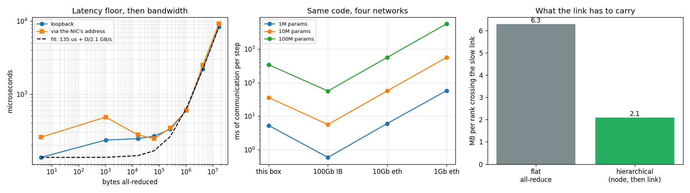

# Multi-Node Setup

---

> One machine or fifty — the code is the same; only the wiring between them changes.

---

## Key Insight

A multi-node job spreads training across more than one [node](/shared/glossary/#node-distributed) (machine), each with its own GPUs, connected over a network. [DDP](/shared/glossary/#ddp) behaves the same across nodes as within one — the new challenge is the network setup and making every process find the others.

## Why This Matters

Real large-scale training rarely fits on a single machine. Getting a job to cross node boundaries even once teaches you the networking and launch details that every big training run depends on.

---

**This is project 41**, and the last of Phase 7.

### What is real here and what is not

There is one machine, so the two "nodes" are **two separate `torchrun` commands on the
same host**, each with its own `--node-rank`, meeting at a
[rendezvous](/shared/glossary/#rendezvous) on 127.0.0.1. That gives you the real launch
protocol, the real rendezvous, the real per-process identity variables, and the real
elastic-restart machinery — every one of those is exercised exactly as it would be on
two machines.

What it cannot give you is the **network**. Section 5 measures precisely how much that
flatters the result, and the answer is: enough that you should never size a real
cluster from a single-box test.

What `run.py` measures:

- four processes launched by two independent commands, forming **one** 4-rank job whose
  weights agree to **0.000e+00**
- the identity table: `RANK` counts across the whole job, `LOCAL_RANK` counts within a
  machine, `GROUP_RANK` *is* the machine index
- the checkpoint bug: **4 processes writing one path**, and only one of the four copies
  survives
- with `--rdzv-backend=c10d`, **`--node-rank` is ignored** — the node ranks are handed
  out at the rendezvous
- a worker dies at step 3: without `--max-restarts` the job is gone; with it,
  **every** worker restarts (both report `TORCHELASTIC_RESTART_COUNT=1`), and recovery
  succeeded **3/3** with the static rendezvous and **2/3** with c10d
- the link's [alpha-beta model](/shared/glossary/#alpha-beta-model): **135 µs** of
  latency and **2.07 GB/s**, and what those numbers predict for a real 100M-parameter
  model on four kinds of network
- and a hand-built hierarchical all-reduce that puts **3× less** across the slow link

---

## Files

| file | what it is |
|---|---|
| `train.py` | the ordinary DDP script `torchrun` launches, one copy per process |
| `run.py` | the six experiments, each launching real `torchrun` commands |
| `outputs/launch_command.txt` | the exact command used, copy-pasteable |
| `outputs/*_node*.log` | the launcher output for every experiment |
| `outputs/findings.csv` | every number quoted on this page |
| `outputs/multinode.png` | the three figures |

```bash
python3 run.py          # ~4 minutes (several sections wait for a timeout)
```



---

## 1. Two commands, one job

On machine A:

```bash
torchrun --nnodes=2 --node-rank=0 --nproc-per-node=2 \
         --rdzv-backend=c10d --rdzv-endpoint=<machine-A-ip>:29500 --rdzv-id=job1 \
         train.py --out /shared/run
```

On machine B, the same command with `--node-rank=1`. That is the entire difference
between single-node and multi-node training. `train.py` itself contains no mention of
nodes at all — it calls `dist.init_process_group("gloo")` and reads the environment.

| | value |
|---|---|
| exit codes (node 0, node 1) | 0, 0 |
| processes that reported in | 4 |
| max spread of weight sums across the four | **0.000e+00** |

Four processes started by two unrelated commands trained one model to bit-identical
weights.

### The identity table

| RANK | LOCAL_RANK | GROUP_RANK | WORLD_SIZE | LOCAL_WORLD_SIZE |
|---|---|---|---|---|
| 0 | 0 | 0 | 4 | 2 |
| 1 | 1 | 0 | 4 | 2 |
| 2 | 0 | **1** | 4 | 2 |
| 3 | 1 | **1** | 4 | 2 |

Each one answers a different question, and using the wrong one is a classic bug:

- **`RANK`** — who am I in the whole job? Use it for "do this once globally": writing
  the checkpoint, logging to your experiment tracker, printing the loss.
- **`LOCAL_RANK`** — which slot am I on *this* machine? Use it for anything tied to
  local hardware: `torch.cuda.set_device(LOCAL_RANK)`. Note ranks 0 and 2 share
  `LOCAL_RANK=0` — on a real cluster they are on different machines, each driving
  *its own* GPU 0. Set the device by `RANK` and half your processes will try to use a
  GPU that does not exist.
- **`GROUP_RANK`** — which machine am I on? Use it for per-node work: downloading a
  dataset to local disk once per machine (`if LOCAL_RANK == 0`), or naming a per-node
  cache.
- **`WORLD_SIZE`** / **`LOCAL_WORLD_SIZE`** — how many of us in total / on this
  machine.

---

## 2. Who writes the checkpoint?

`train.py` can save in three ways. All three "work"; two are wrong.

| mode | processes that wrote | result |
|---|---|---|
| `everyone` | **4** | one file, written four times concurrently; the surviving copy is rank 0's — this time |
| `rank0` | 1 | one file, one writer ✅ |
| `local_rank0` | 2 | **two** files, one per node |

The `everyone` row is the bug you will meet in real code, usually as
`torch.save(model.state_dict(), "ckpt.pt")` copied from a single-GPU script. Since all
ranks hold identical weights, the *contents* are the same and it looks harmless. It is
not: four processes writing the same path concurrently can interleave, and you get a
truncated or torn file that fails to load days later. Which copy survives is a race —
we have observed both rank 0 and rank 1 winning across runs.

The `local_rank0` row is right for a *different* job: things that must exist once **per
machine**, such as extracting a dataset onto the node's local SSD. For a checkpoint it
writes N copies of the same bytes.

And whichever you pick, put a barrier after it:

```python
if rank == 0:
    torch.save(...)
dist.barrier()      # nobody exits or moves on before the file is complete
```

Without the [barrier](/shared/glossary/#barrier), the other ranks race ahead — and if
the next thing they do is *load* that checkpoint, they may load a half-written file.

---

## 3. Rendezvous failures

The [rendezvous](/shared/glossary/#rendezvous) is the appointment where the processes
find each other. The word is French for "appointment", and the analogy holds: everyone
shows up at an agreed address, and the job starts when the expected number have
arrived.

| failure | what happens |
|---|---|
| declared `--nnodes=2`, launched only node 0 | waits at the meeting point; **killed after 60 s** with nothing printed |
| unreachable endpoint (`127.0.0.1:1`) | `TCP client failed to connect/validate to host 127.0.0.1:1 - retrying (try=0, timeout=60000ms, delay=23152ms)` |
| both machines launched with `--node-rank=0` | **works** — 4 processes, `GROUP_RANK` = ['0','0','1','1'] |

The first row is the one that wastes an afternoon. A job whose second machine failed to
start does not report an error: it sits at the rendezvous, silently, until the
rendezvous timeout expires (ten minutes by default). If your job "hangs at startup",
count the processes that checked in before you look anywhere else. `--rdzv-conf=timeout=N`
shortens the wait while you debug.

The third row is genuinely surprising: we launched both agents claiming to be node 0,
and the job ran anyway with the node ranks correctly distinct. The reason is that
**with `--rdzv-backend=c10d`, `--node-rank` is ignored.** Node ranks are assigned *at*
the rendezvous, in arrival order. The flag only matters for the older *static*
rendezvous (`--master-addr`/`--master-port`), where you are numbering the machines
yourself and a duplicate really would collide. Knowing which of the two you are using
determines whether that flag is load-bearing or decorative.

---

## 4. When a worker dies

`train.py --crash-at 3 --crash-rank 1` makes exactly one worker exit(1) mid-training.

| | result |
|---|---|
| `--max-restarts=0` | exit 1, **0 of 2** workers finished |
| `--max-restarts=2`, static rendezvous | recovered **3 of 3** runs (9, 9, 11 s) |
| `--max-restarts=2`, c10d rendezvous | recovered **2 of 3** runs (120, 12, 12 s) |
| `TORCHELASTIC_RESTART_COUNT` after a recovery | **1 on rank 0 *and* 1 on rank 1** |

Three things to take from this.

**One worker dying kills all of them.** With no restarts, rank 0 was healthy and still
ended the run. That is correct behaviour: the survivors are stuck in collectives whose
partner is gone, so there is nothing useful for them to do.

**A restart restarts *everyone*.** Both ranks report `TORCHELASTIC_RESTART_COUNT=1`,
not just the one that crashed. The whole `train.py` runs again from the top —
`main()`, the model construction, everything. So [elastic training](/shared/glossary/#elastic-training)
buys you nothing unless your script *loads a checkpoint on startup*. Restarting a job
that always begins from random weights just repeats the first three steps forever.

**Recovery is not guaranteed.** 3/3 and 2/3 at two workers — and at **four** workers,
on this machine, the replacement group never completed its second rendezvous and the
job hung until killed, with both rendezvous backends. The mechanism is worth
understanding even if the exact flakiness is local: a restart is *another rendezvous*,
so it inherits every failure mode from section 3, and now it has to happen while old
sockets are still closing. Plan for restarts to sometimes not work, which again means:
checkpoint often.

---

## 5. What the link actually costs

Every all-reduce time follows the [alpha-beta model](/shared/glossary/#alpha-beta-model):
`time = α + bytes/B`. Measure a tiny message to get α (it is nearly all overhead) and
the slope between large messages to get B:

| | value |
|---|---|
| loopback: latency α | **135 µs** |
| loopback: bandwidth B | **2.07 GB/s** |
| 4-byte all-reduce / 4 MB all-reduce | 135 µs / 2.2 ms |

Sending 4 bytes costs 135 µs; sending a million times more data costs only 16× longer.
Below roughly 280 KB (α·B) you are paying for the *act* of sending, not for the data —
which is exactly why [gradient bucketing](/shared/glossary/#gradient-bucketing) in
[project 37](../37-implement-gradient-allreduce/README.md) was worth 19×.

### The honest part: this is not a network test

We also measured with `GLOO_SOCKET_IFNAME` pointed at the machine's real ethernet
interface instead of loopback:

| | latency | bandwidth |
|---|---|---|
| via the NIC's address vs loopback | 1.89× | 1.10× |

That ratio has bounced between 0.53× and 2.15× across runs — it is noise. **Linux
short-circuits traffic between two processes on the same host regardless of which
address you use**, so the packets never touch the wire. You cannot simulate a network
by using its IP address, and a "two-node" test on one box measures your memory bus.

### What the model predicts for real networks

Plugging α and B into the ring formula `2(N−1)(α + (D/N)/B)` for 100M parameters
(400 MB) on 8 ranks:

| link | pure communication per step |
|---|---|
| this box (measured) | 340 ms |
| 100 Gb/s InfiniBand (α≈2 µs) | **56 ms** |
| 10 Gb/s ethernet (α≈30 µs) | 560 ms |
| 1 Gb/s ethernet (α≈100 µs) | **5601 ms** |

A hundredfold difference in the network changes the per-step communication cost by a
hundredfold. If a step's computation takes ~200 ms, this model is the whole difference
between "scales fine" (InfiniBand) and "spends 96% of its time waiting" (1 Gb/s
ethernet). It is also why the cloud charges more for instances with fast interconnects,
and why "we added more machines and it got slower" is a normal outcome rather than a
paradox.

---

## 6. Hierarchical all-reduce: keep the traffic off the slow link

The links inside a machine are much faster than the links between machines. A flat
all-reduce ignores that; a hierarchical one reduces inside each node first, sends only
the node's summed result across the link, then broadcasts back down.

```python
dist.all_reduce(t, group=local_group)                    # inside the machine
if local_rank == 0:
    dist.all_reduce(t, group=leader_group)               # across the slow link
dist.broadcast(t, src=node_leader, group=local_group)    # back down
```

| 4 ranks arranged as 2 machines × 2 processes | value |
|---|---|
| correctness vs the flat version | **max error 0.0e+00** |
| bytes crossing the link per rank, flat | 6.0 MB |
| bytes crossing the link per rank, hierarchical | **2.0 MB (3.0× less)** |
| measured time, flat / hierarchical | 7.61 ms / 14.37 ms |

Read the last row honestly: **the hierarchical version is nearly 2× slower here**, and
that is the expected result. It does strictly more collectives (three instead of one),
and its whole advantage is avoiding a slow link that this machine does not have — both
"nodes" are the same box, so every link is equally fast. On a real cluster, where the
inter-node link might be 50× slower than the intra-node one, moving 3× less data across
it is exactly the trade that pays.

You do not normally write this yourself: NCCL detects the topology and chooses a
hierarchical algorithm automatically. Building it by hand is how you understand what it
is choosing, and the byte counts above are checkable arithmetic rather than a claim.

---

## What to remember

1. **The script does not change.** Multi-node is a launch concern; `train.py` just
   reads its environment.
2. **`RANK` for global work, `LOCAL_RANK` for local hardware, `GROUP_RANK` for the
   machine.** `set_device(RANK)` is a bug waiting for the second node.
3. **One writer per file, then a barrier.** Everyone writing "the same" checkpoint is a
   race that produces a torn file.
4. **A job with a missing node does not error — it waits.** Count the processes that
   checked in.
5. **`--node-rank` is ignored by the c10d rendezvous.** Know which rendezvous you are
   using.
6. **A restart restarts every worker from the top.** Without checkpoint loading,
   elasticity buys nothing — and recovery is not guaranteed.
7. **α + D/B explains everything**: why small messages are all overhead, why bucketing
   works, and why the interconnect decides whether your cluster scales.
8. **You cannot fake a network on one machine.** Loopback and the NIC's own address are
   the same path.

---

*That completes Phase 7. Phase 8 moves from training many machines to shipping the
result: [project 42](../42-export-to-onnx/README.md) exports a trained model to ONNX.*
