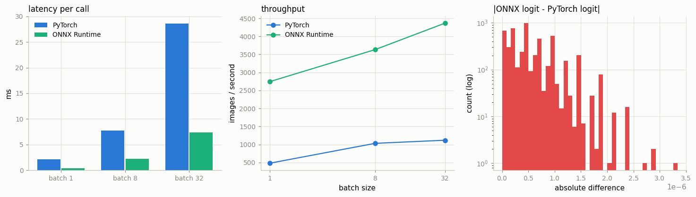

# Export to ONNX

---

> Save the model as a portable graph, then run it anywhere — no PyTorch needed.

---

## Key Insight

[ONNX](/shared/glossary/#onnx) is a framework-neutral file format that stores a model as a graph of operations. Exporting a [CNN](/shared/glossary/#cnn) to ONNX lets you run it with a separate engine like [ONNX Runtime](/shared/glossary/#onnx-runtime), on hardware or in environments where PyTorch is not installed.

## Why This Matters

Many production and edge targets cannot install PyTorch but can run ONNX. Comparing the ONNX output against PyTorch confirms the export preserved the model's math instead of silently changing it.

---

**This is project 42**, and the first of Phase 8.

### What the name means

**ONNX** = *Open Neural Network Exchange*. "Exchange" is the whole idea: a file that
one tool writes and a different tool reads. PyTorch writes it, and a runtime that has
never heard of PyTorch reads it.

A word you will meet immediately: **opset**, short for *operation set* — the version
number of ONNX's vocabulary. Opset 20 means "this file only uses operations that were
defined by ONNX version 20 or earlier". An old runtime reading a new opset is like an
old dictionary meeting a new word: it fails, and the error will say so.

### What is real here and what is not

Everything is real: a real trained CNN, a real `.onnx` file on disk, and a real
[ONNX Runtime](/shared/glossary/#onnx-runtime) session that never imports PyTorch to
produce its answers. The only thing missing is the *reason* you would normally do
this — some other machine that cannot run PyTorch. We check the file works; we just
check it on this machine.

The timing numbers move a lot between runs, because this box is shared (load average
around 9 on 12 cores). Section 5 times both engines **interleaved** — A, B, A, B, … —
so that if something else grabs the CPU half-way through, it is charged to both sides
rather than to whichever one happened to be running. Ratios are trustworthy;
absolute milliseconds are not.

What `run.py` measures:

- the two exporters: tracing takes **0.11 s**, `torch.export` takes **3.48 s**, and
  they emit **the same 15 nodes**
- the new exporter also quietly writes **a second file** — 0.025 MB of graph plus a
  0.562 MB sidecar of weights. Copy only the `.onnx` to your server and nothing works.
- ONNX Runtime and PyTorch agree to **3.8e-06**, which is *smaller than the difference
  between PyTorch and itself* at another batch size (4.8e-06), and predictions match on
  **100.00%** of 2000 images
- the tracing trap: a model that halves negative inputs, traced on a positive one,
  returns **-2.00** where PyTorch returns **-0.50** — no error, no warning. The new
  exporter **refuses** the same model, and `torch.cond` fixes it.
- a graph exported at batch 1 **rejects** batch 8 until you declare the batch dimension
  dynamic
- ONNX Runtime is **5.7× / 3.5× / 3.9×** faster than eager PyTorch at batch 1 / 8 / 32
- and 5 `BatchNorm2d` layers became **0** BatchNorm nodes: they were folded into the
  convolutions, changing the stored weights by up to **1.45** in absolute value

---

## Files

| file | what it is |
|---|---|
| `deploy_lib.py` | the shared model, data, and timing helpers for **all of Phase 8** (projects 43-47 import it) |
| `run.py` | the six sections below |
| `outputs/small_cnn.onnx` + `.onnx.data` | the exported model, weights in the sidecar file |
| `outputs/findings.csv` | every number quoted on this page |
| `outputs/latency.csv` | the batch-size timing table |
| `outputs/onnx_export.png` | the three figures |

```bash
pip install onnx onnxruntime onnxscript
python3 run.py       # ~20 s, plus ~2.5 min the first time (it trains the CNN)
```

The CNN is trained once and cached in `checkpoints/small_cnn.pt`; **141,034 parameters,
68.4% accuracy on CIFAR-10**. It is deliberately plain — Conv, BatchNorm, ReLU,
MaxPool, Linear — because every one of those has an int8 kernel, which projects 44 and
45 depend on.



---

## 1. Two exporters, one file format

PyTorch can write ONNX two ways, and the difference is *how it works out what your
model does*.

| | legacy: `dynamo=False` | modern: `dynamo=True` (the default since 2.9) |
|---|---|---|
| how it learns the graph | **tracing** — run the model once on an example input and record every operation that actually executed | **[`torch.export`](/shared/glossary/#torchexport)** — analyse the Python bytecode and build the graph symbolically |
| export time | **0.11 s** | **3.48 s** |
| file on disk | 0.566 MB, self-contained | 0.025 MB **+ a 0.562 MB `.onnx.data` sidecar** |
| nodes produced | 15 | 15 |

**"Tracing" is named for what it does**: it follows the execution like someone tracing
a drawing through thin paper — it only ever sees the lines the pen actually visited.
Anything the pen skipped that day (the `else` branch, the loop that ran zero times)
never makes it onto the copy. Section 3 is that failure in action.

### "Isn't `torch.export` doing the same job TorchScript already did?"

Reasonable question — [TorchScript](/shared/glossary/#torchscript) also captured graphs,
and it is still in the codebase. The difference is *what it captured with*. TorchScript
had its own compiler and its own restricted dialect of Python; if your model used a
Python feature it did not implement, you rewrote the model. `torch.export` instead
reuses the same bytecode analysis that powers `torch.compile`, so it understands ordinary
Python, and it produces one canonical graph format that ONNX export, ExecuTorch
([project 43](../43-mobile-deployment/README.md)) and [AOTInductor](/shared/glossary/#aotinductor) all consume. One capture
mechanism, three destinations, instead of one per destination.

### The sidecar file is a real deployment bug waiting to happen

`torch.export`-based export stores the weights **outside** the `.onnx` file, in
`model.onnx.data` next to it. This exists because ONNX files are
[protobuf](https://protobuf.dev/) messages with a hard 2 GB limit, and a modern model
blows past that. But it means the obvious deployment step — "copy the `.onnx` to the
server" — ships a 25 KB file containing a graph and no numbers. Copy the pair, or pass
`external_data=False` to force one self-contained file.

---

## 2. Verifying: is it the same model?

The export "should" be exact — it is the same arithmetic in a different container. It
is not exact, and the reason is worth understanding before you pick a tolerance.

| check | legacy | dynamo |
|---|---|---|
| max \|logit difference\| over 2000 images | **3.815e-06** | **3.815e-06** |
| mean \|logit difference\| | 5.462e-07 | 5.349e-07 |
| predictions identical to PyTorch | **100.00%** | **100.00%** |
| accuracy on those 2000 images | 0.6840 | 0.6840 |

PyTorch's own accuracy on the same images is **0.6840**. Identical.

**Why isn't the difference zero?** Float32 addition is not associative:
`(a + b) + c` and `a + (b + c)` can differ in the last bit. The two engines pick
different orders — different loop tiling, different vector widths, different
BLAS libraries — so tiny differences appear and then grow slightly through the
layers. Nothing is wrong.

The yardstick that makes this concrete: run **PyTorch against PyTorch**, same weights,
same images, only a different batch size, and the logits differ by **4.768e-06** —
*more* than PyTorch differs from ONNX Runtime. So a tolerance tight enough to fail the
ONNX export would also fail PyTorch against itself.

That is why the practical check is `np.testing.assert_allclose(..., rtol=1e-3,
atol=1e-3)` plus **"do the predicted classes match?"**, not `==`. A real export bug —
a mis-ordered `permute`, a wrong padding, a dropped layer — produces differences of
0.1 or 10, never 1e-06. The size of the error tells you which world you are in.

---

## 3. The tracing trap: control flow disappears

Here is a model with an `if`:

```python
class Branchy(nn.Module):
    def forward(self, x):
        if x.mean() > 0:
            return x * 2.0
        return x * 0.5
```

Export it with the tracing exporter, giving a **positive** example input, then run the
exported graph on a **negative** one:

| | value |
|---|---|
| ONNX (traced on a positive input), fed a negative input | **-2.00** |
| PyTorch, fed the same negative input | **-0.50** |
| does the traced graph contain a branch (`If`) node? | **False** |

The graph contains one `Mul` by 2.0 and nothing else. The `if` was evaluated *once*,
at export time, in Python — and Python's `if` leaves no trace in the recording, only
the branch it chose. Every future input now takes that branch. There is no error and
no warning; you find out from a customer.

Two defences, both shown by `run.py`:

1. **Use the modern exporter.** `torch.export` symbolically evaluates `x.mean() > 0`
   and gets a value it cannot resolve at compile time, so it stops:
   `refused: TorchExportError`. Refusing to export is enormously better than exporting
   the wrong thing.
2. **Write the branch as data, not as Python.** `torch.cond` makes both sides part of
   the graph:

   ```python
   torch.cond(x.mean() > 0, lambda t: t * 2.0, lambda t: t * 0.5, (x,))
   ```

   Exported graph: `ReduceMean → Squeeze → Greater → If`. It returns **+2.00** for a
   positive input and **-0.50** for a negative one — correct both ways, because the
   decision now happens at *run* time inside the runtime.

Not every `if` is dangerous. `if self.use_dropout:` reads a Python attribute that is
fixed for the life of the model, and baking it in is exactly right. The dangerous ones
are the `if`s that read **tensor values or shapes** — those change per input.

---

## 4. Fixed shapes vs dynamic shapes

Because the exporter learns from one example input, it also learns that input's shape.

| exported as | declared input shape | batch 1 | batch 8 |
|---|---|---|---|
| plain export at batch 1 | `[1, 3, 32, 32]` | ok | **FAILED:** `Got invalid dimensions for input: x … Got: 8 Expected: 1` |
| `dynamic_shapes={"x": {0: batch}}` | `['batch', 3, 32, 32]` | ok | ok, output `(8, 10)` |

```python
batch = torch.export.Dim("batch")            # "this axis is a variable, not a number"
torch.onnx.export(model, (sample,), "m.onnx", dynamo=True,
                  dynamic_shapes={"x": {0: batch}})
```

Note this error is *loud* — the runtime refuses at the first request. Compare that with
section 3, where the wrong answer arrived silently. Shape mismatches are the friendly
kind of bug.

Fixing the shape is not always wrong, though. A fixed shape lets the runtime pick
kernels and plan memory once, ahead of time, so it can be faster. The usual production
choice is a **dynamic batch axis and fixed everything else**: batch size is what varies
per request, image size usually is not.

---

## 5. Latency: is ONNX Runtime actually faster?

Same weights, same machine, same 6 threads, timed interleaved:

| batch | PyTorch eager (ms) | ONNX Runtime (ms) | speed-up | PyTorch img/s | ORT img/s |
|---|---|---|---|---|---|
| 1 | 2.09 | **0.36** | **5.72×** | 479 | **2744** |
| 8 | 7.76 | **2.20** | **3.52×** | 1031 | **3632** |
| 32 | 28.61 | **7.32** | **3.91×** | 1118 | **4370** |

Two things to read out of this table:

**The gap is biggest at batch 1.** With one small image there is almost no arithmetic
to do, so what you are timing is *overhead*: PyTorch dispatching each of ~21 modules
through Python, allocating an output tensor per op, checking dtypes. ONNX Runtime did
all of that thinking at load time — it holds a fixed plan of 15 fused kernels and a
pre-allocated arena. When there is real work to do (batch 32) the arithmetic starts to
dominate and the advantage shrinks. **Practical consequence: the smaller your model and
batch, the more a compiled runtime buys you.** For a large model at large batch, both
engines are calling the same vendor matrix-multiply kernels and the difference mostly
disappears.

**Latency and throughput point in opposite directions.** Going from batch 1 to 32
makes each *request* 20× slower (0.36 → 7.32 ms) while making the *machine* 1.6× more
productive (2744 → 4370 images/s). That trade-off is the entire subject of [project 47](../47-latency-profiling/README.md).

---

## 6. What survived the export

| | count | detail |
|---|---|---|
| PyTorch modules | 21 | 5 Conv2d, **5 BatchNorm2d**, 5 ReLU, 2 MaxPool2d, 1 AdaptiveAvgPool2d, 1 Linear (+2 containers) |
| ONNX nodes | 15 | 5 Conv, 5 Relu, 2 MaxPool, 1 GlobalAveragePool, 1 Flatten, 1 Gemm |
| BatchNorm nodes in the graph | **0** | |
| weight tensors stored in the file | 12 | |

The five `BatchNorm2d` layers are gone. They were **folded** into the convolutions
before them.

At inference time BatchNorm is just a fixed per-channel scale and shift:
`y = γ·(x - μ)/σ + β`. A convolution is also a per-channel linear map. Composing two
linear maps gives one linear map, so the exporter multiplies the scale into the conv
weights and adds the shift into the conv bias. Same output, one less layer to execute.
This is a small example of [operator fusion](/shared/glossary/#kernel-fusion), and it
only works because `.eval()` freezes BatchNorm's statistics — in training mode μ and σ
depend on the batch and there is nothing constant to fold.

The consequence is worth flagging: **the numbers in the `.onnx` file are not the
numbers in your checkpoint.** The first conv's folded weight differs from the eager one
by up to **1.45** in absolute value. If you ever compare an exported file against a
`state_dict` tensor-by-tensor, you will "find" enormous discrepancies that are not
bugs. Compare *outputs*, as section 2 does, never weights.

`Gemm`, by the way, is **GE**neral **M**atrix **M**ultiply — the name comes straight
from [BLAS](/shared/glossary/#blas), the 1979 Fortran linear-algebra library whose
naming conventions the whole field still uses. It is ONNX's node for a linear layer.

---

## What to take away

1. **Export is cheap; verifying is the job.** One line writes the file. The value is in
   the check that follows.
2. **Compare outputs, with a tolerance, on real inputs.** 1e-06 differences are float32
   being float32. Bug-sized differences are 1e-01 and up. Comparing weights instead
   will mislead you, because export fuses layers.
3. **Tracing bakes in every decision it saw once** — branches, shapes, `.item()` calls.
   The modern exporter turns those silent wrong answers into loud refusals, which is
   why it is the default now.
4. **Declare your dynamic axes**, usually just the batch dimension.
5. **Ship the sidecar `.data` file** or export self-contained.
6. **A compiled runtime wins most where the model is small and the batch is 1**, which
   happens to be exactly the interactive, latency-sensitive case.

---

## Next

[Project 43](../43-mobile-deployment/README.md) takes the same model to [ExecuTorch](/shared/glossary/#executorch), the
runtime built for phones — where the `.onnx`-style question ("does it still compute the
same thing?") comes back, now with a size budget attached.
