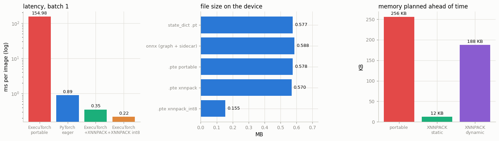

# Mobile Deployment

---

> A phone is just another device — with the right runtime, your model runs there too.

---

## Key Insight

[ExecuTorch](/shared/glossary/#executorch) is PyTorch's runtime for phones and other edge devices. It takes a model captured by [`torch.export`](/shared/glossary/#torchexport) and runs it on hardware that is too small or too restricted to host full PyTorch.

## Why This Matters

Running a model directly on a device keeps data private, removes network delay, and works offline. ExecuTorch is the modern PyTorch path to get a model onto a phone.

---

**This is project 43.**

### What is real here and what is not

There is **no Android phone attached to this machine**, so nothing here was measured on
a phone. Everything else is real, and it is more than you might expect:

- a real `.pte` file produced by the real ExecuTorch toolchain — byte-for-byte the
  file you would `adb push` to a device;
- the real ExecuTorch **runtime** loading and executing it, not PyTorch pretending;
- the real [XNNPACK](/shared/glossary/#xnnpack) backend, which is the same library
  that runs the model on an actual Android or iOS CPU;
- real int8 quantization through the real mobile quantizer.

What is missing is the phone's *hardware*: a slower, colder ARM core with a small
cache and a battery. So treat the **ratios** as transferable and the absolute
milliseconds as "what this desktop x86 core did".

The runtime itself gives away who it was built for. Its startup log, saved in
`outputs/et_bench.log`, contains:

```
[cpuinfo_utils.cpp:109] Failed to open midr file
    /sys/devices/system/cpu/cpu0/regs/identification/midr_el1
```

`midr_el1` is an **ARM** register — *Main ID Register*, the one that tells you which
ARM core you are on. The runtime looked for it, did not find it on this x86 desktop,
shrugged, and carried on.

What `run.py` measures:

- the same model built three ways: **portable** (0.578 MB), **XNNPACK** (0.570 MB),
  **XNNPACK + int8** (0.155 MB)
- the portable build runs at **155 ms** per image; delegating to XNNPACK makes it
  **0.35 ms** — a **444×** difference from one line of code
- XNNPACK folds the whole model into **one** graph node, and the ahead-of-time memory
  plan drops from **256 KB to 12 KB**
- int8 keeps accuracy identical (**0.6758** both) while changing 1.17% of predictions
- dynamic shapes on an edge runtime are **bounded**: a file declared `max=16` accepts
  batch 15 and refuses 16 — and one declared `max=32` also stops at 15
- the version-pin trap in section 0, which cost this session a broken environment

---

## Files

| file | what it is |
|---|---|
| `et_bench.py` | everything that must run inside the ExecuTorch environment |
| `run.py` | driver: prepares the model, launches `et_bench.py`, draws the figure |
| `outputs/cnn_xnnpack_int8.pte` | the mobile build, 155 KB — the file you would ship |
| `outputs/et_results.json` | raw measurements |
| `outputs/et_bench.log` | the runtime's own stderr, ARM probes included |
| `outputs/findings.csv` | every number on this page |
| `outputs/executorch.png` | the three figures |

```bash
python3 run.py --setup    # once: creates ~/.venvs/executorch (~1.5 GB)
python3 run.py            # ~50 s
```



---

## 0. The trap before the project starts

`pip install executorch` in the environment this guide uses **upgraded PyTorch from
2.10.0 to 2.13.0**, because ExecuTorch 1.4.0 declares `torch>=2.13.0a0`. pip printed a
warning and did it anyway. The next `import torchvision` failed:

```
RuntimeError: operator torchvision::nms does not exist
```

torchvision 0.25 is compiled against torch 2.10's C++ ABI. A different torch means its
compiled extension can no longer register its operators, and every project in Phases 3-7
that touches torchvision is broken until you reinstall the matching pair.

This is not an ExecuTorch defect; it is what "the deployment toolchain pins its own
framework version" always feels like. The fix is a **separate virtual environment**:

```bash
python3 -m venv ~/.venvs/executorch
~/.venvs/executorch/bin/pip install torch==2.13.0 \
      --index-url https://download.pytorch.org/whl/cpu
~/.venvs/executorch/bin/pip install executorch
```

`run.py` then launches `et_bench.py` with *that* interpreter and reads back JSON. It is
worth internalising early: **export tooling and training tooling do not have to live in
the same environment, and often must not.**

---

## 1. Three ways to build the same `.pte`

The flow has three stages, and each has a name you will see in ExecuTorch docs:

```python
ep    = torch.export.export(model, (sample,))          # 1. capture: an ATen graph
edge  = to_edge_transform_and_lower(ep, partitioner=[XnnpackPartitioner()])
                                                       # 2. lower: pick the ops and backend
prog  = edge.to_executorch()                           # 3. emit: plan memory, serialise
open("model.pte", "wb").write(prog.buffer)
```

- **"Edge" dialect** is a restricted version of PyTorch's operator set: explicit
  dtypes, no ambiguity, nothing that needs a Python interpreter. Restricted is the
  point — a small runtime can implement all of it.
- **"Lowering"** means moving from a general representation to a more specific one, the
  way a compiler lowers your source to machine code. Here it means deciding which
  hardware backend executes each part.
- **`.pte`** = *PyTorch ExecuTorch* program. It is a flatbuffer: a binary format you can
  read directly out of a memory-mapped file with no parsing step, which matters when
  your whole runtime is 50 KB.

| program | MB | graph nodes | operators | delegates | planned arena |
|---|---|---|---|---|---|
| portable | 0.5776 | **60** | 7 | 0 | **256.0 KB** |
| XNNPACK | 0.5698 | **2** | 0 | **1** | **12.1 KB** |
| XNNPACK + int8 | **0.1548** | 2 | 0 | 1 | 12.1 KB |

Lowering time: portable 1.0 s, XNNPACK 6.0 s, int8 6.8 s.

### What "delegate" means, and why 60 nodes became 2

A **delegate** is a piece of the graph handed over to a specialised backend, which
compiles it its own way and hands back a single opaque node. The XNNPACK partitioner
looked at our CNN, found it could take *all* of it, and returned a graph containing
exactly `executorch_call_delegate` and a `getitem`. The 60-node portable graph, by
contrast, lists every convolution, every BatchNorm, and — visibly — every `alloc`.

Those `alloc` nodes are the second thing to notice. ExecuTorch decides **at build
time** where every intermediate tensor will live, and writes the plan into the file.
There is no allocator at run time, no `malloc`, no garbage. That is why the table has a
column called "planned arena": 256 KB is *the entire dynamic memory this model will ever
use*. When the delegate takes over, ExecuTorch only has to plan the input and output
buffers (12 KB) because XNNPACK manages its own scratch space internally.

### "Doesn't `torch.export` already give me a portable model? Why a second format?"

Fair question — [project 42](../42-export-to-onnx/README.md) exported the same model with the same `torch.export` call.
The difference is what the *consumer* needs:

| | `torch.export` / ONNX | `.pte` |
|---|---|---|
| who reads it | a Python or C++ runtime with a real allocator | a C++ runtime with no Python, no allocator, sometimes no OS |
| memory | allocated as the graph runs | **planned at build time**, written into the file |
| binary size | ONNX Runtime is tens of MB | the ExecuTorch core is tens of KB |
| what it assumes | a general-purpose computer | a phone, a watch, a microcontroller |

`torch.export` is the **capture** step that both paths share; `.pte` is the packaging
for the smallest kind of target. That shared front end is exactly why PyTorch moved to
`torch.export` — capture once, package many ways.

---

## 2. Does the `.pte` compute the same thing?

| program | images checked | max \|difference\| | same prediction | accuracy |
|---|---|---|---|---|
| portable | 64 | 2.384e-06 | 100.00% | 0.6719 |
| XNNPACK | 512 | 2.861e-06 | 100.00% | 0.6758 |
| XNNPACK + int8 | 512 | **7.460e-01** | **98.83%** | **0.6758** |

The float builds land where project 42's ONNX export landed: a few times 1e-06, which
is float32 reordering, not a bug.

The int8 build is a different story and worth reading carefully. Its logits move by up
to **0.75** — five orders of magnitude more — and **1.17% of the 512 images change
class**. And yet the accuracy is *exactly the same*, 0.6758 both. Both facts are true
and neither is a rounding artefact: quantization pushes a handful of borderline images
across the decision boundary, and on this sample it flipped about as many wrong answers
right as right answers wrong.

The practical consequence: **for a quantized model, "outputs match" is the wrong
acceptance test.** It will always fail. Test the metric you actually care about
(accuracy, F1, [perplexity](/shared/glossary/#perplexity)) on a set big enough that a
1% change is measurable — and be aware that "same accuracy" on 512 images is
compatible with 1% of individual answers changing. Projects 44 and 45 do exactly this
measurement at more length.

---

## 3. Latency: the number that makes the whole project worthwhile

One image at a time, all four timed **interleaved** so a busy machine cannot rank them
for us:

| runtime | ms per image | relative |
|---|---|---|
| ExecuTorch, **portable** kernels | **154.98** | 444× slower |
| PyTorch eager (for reference) | 0.89 | 2.6× slower |
| ExecuTorch + **XNNPACK** | 0.35 | 1.0× |
| ExecuTorch + XNNPACK, **int8** | **0.22** | 0.6× |

The portable number is the headline. ExecuTorch's built-in kernels are **reference
implementations**: correct, tiny, dependency-free, written to be readable and to
compile anywhere. They are plain nested loops. XNNPACK is Google's hand-tuned
neural-network kernel library — vectorised, cache-blocked, threaded, with a separate
assembly path per CPU generation.

**The plain consequence: shipping a `.pte` without a backend delegate is a mistake you
can measure.** The model will run, all the tests will pass, and it will be 400× too
slow to use. Nothing warns you, because "portable" is the default that always works.

Two smaller readings:

- **int8 is 1.6× faster than fp32 here**, on top of being 3.7× smaller. On a phone the
  gap is usually larger, because mobile CPUs have int8 dot-product instructions and a
  much smaller cache to fit the weights into.
- These absolute numbers swing by 2-3× between runs on this shared box. The first draft
  of this project timed each runtime back to back and got int8 *slower* than fp32; the
  interleaved timer fixed the ranking. If a measurement's ranking changes between runs,
  the measurement is the problem.

---

## 4. Dynamic shapes are bounded on the edge

| batch | static `.pte` | dynamic `.pte`, declared `max=16` |
|---|---|---|
| 1 | ok (1, 10) | ok (1, 10) |
| 8 | **FAILED** | ok (8, 10) |
| 15 | **FAILED** | ok (15, 10) |
| 16 | **FAILED** | **FAILED** |

Planned arena: **12.1 KB static → 187.6 KB dynamic.**

The static file only accepts the exact shape it was exported with — the same rule as
ONNX in project 42, and the same clear error. Declaring a dynamic dimension works:

```python
dim = torch.export.Dim("b", min=1, max=16)
ep = torch.export.export(model, (x[:2],), dynamic_shapes={"x": {0: dim}})
```

But notice what it costs and what it does not buy:

- **Cost:** the arena grew 15×, because memory planned ahead of time must be planned
  for the *worst* case. On an edge device that RAM is committed whether you use it or
  not. There is no such thing as a "free" dynamic axis when there is no allocator.
- **A bound always exists.** Declaring `max=16` gave a file that stops at 15. Declaring
  `max=32` gave a file that *also* stops at 15 (`accepts [1, 8, 15]`). The number the
  toolchain plans for is not simply the number you asked for. The runtime is at least
  explicit about it:

  ```
  [tensor_impl.cpp:156] Attempted to resize a bounded tensor with a maximum
      capacity of 46080 elements to 49152 elements.
  ```

  46080 = 15 × 3 × 32 × 32.

**So: test the largest batch you intend to send, on the actual `.pte`.** Do not infer
it from the `Dim` you wrote. (Measured with executorch 1.4.0; the exact bound is a
toolchain detail and may differ in other versions — which is the reason to test rather
than assume.)

---

## 5. What you would actually copy to the phone

| artefact | MB |
|---|---|
| `state_dict` `.pt` | 0.5774 |
| ONNX graph + sidecar | 0.5881 |
| `.pte` portable | 0.5776 |
| `.pte` XNNPACK | 0.5698 |
| **`.pte` XNNPACK int8** | **0.1548** |

Every float32 format is the same size, because they all store the same 141,034 numbers
at 4 bytes each — the container adds only kilobytes. **Format choice does not shrink a
model; changing the dtype does.** int8 is 3.7× smaller (not 4×, because scales,
zero-points and the flatbuffer header are still float and still there).

### The steps this project does not run

With a phone in hand, the remaining work is packaging, not machine learning:

1. Build the ExecuTorch runtime for the target (`aar` for Android, `xcframework` for
   iOS), with the XNNPACK backend compiled in — **a backend that is not compiled into
   the runtime cannot execute your delegate, and the failure happens at load time on
   the device.**
2. Ship `cnn_xnnpack_int8.pte` as an app asset, or `adb push` it to
   `/data/local/tmp/`.
3. From Kotlin/Swift: load the file, wrap the camera frame as a tensor, call
   `forward`, read the output.
4. Re-measure on the device. Phone CPUs throttle: the tenth inference in a row is
   routinely slower than the first, and that is what your users experience.

---

## What to take away

1. **Deployment toolchains pin their own PyTorch.** Give them their own virtual
   environment before they give your main one a new torch.
2. **`torch.export` captures once; the packaging step chooses the target.** ONNX,
   `.pte`, and [AOTInductor](/shared/glossary/#aotinductor) all start from the same
   captured graph.
3. **Always delegate.** The portable kernels exist so that *something* runs everywhere;
   XNNPACK is what makes it fast. 444× is not a tuning detail.
4. **Edge runtimes plan memory at build time.** That is where the small footprint comes
   from, and it is why dynamic shapes cost RAM and always carry a maximum.
5. **A quantized model needs a metric-level acceptance test**, not an
   output-comparison one: identical accuracy here coexisted with 1.17% of predictions
   changing.

---

## Next

[Project 44](../44-dynamic-quantization/README.md) takes quantization off the phone and onto a language model, where the
weights are big enough that int8 changes the memory picture entirely — and where
"did quality drop?" needs a better answer than accuracy on 512 images.
