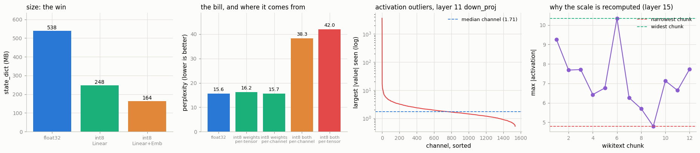

# Dynamic Quantization

---

> Store the weights as 8-bit integers and decide the activation scale on the fly.

---

## Key Insight

[Quantization](/shared/glossary/#quantization) stores a model's [weights](/shared/glossary/#weights) in low-precision integers like [int8](/shared/glossary/#int8) instead of 32-bit floats. [Dynamic quantization](/shared/glossary/#dynamic-quantization) keeps the weights quantized ahead of time but computes the scale for each layer's [activations](/shared/glossary/#activations) at runtime, just before the [matmul](/shared/glossary/#matmul).

## Why This Matters

int8 weights use a quarter of the memory and run faster on many CPUs, which helps most with the large linear layers in an [LLM](/shared/glossary/#llm). Measuring the quality drop tells you whether the speedup is worth it.

---

**This is project 44.**

### The vocabulary first

- **Quantization** here means: take a number that lives on a continuous scale (float32)
  and snap it to one of a small number of steps (256 of them, for int8). The word comes
  from physics — a *quantum* is a discrete amount, the opposite of continuous.
- The recipe is one number per group: `scale = max|x| / 127`, then
  `q = round(x / scale)`. To use the value you multiply back:
  `x ≈ q × scale`. Everything in this project is a consequence of **how the group is
  chosen and who picks `max|x|`**.
- **Dynamic** vs **static** is exactly that question for *activations* (the numbers
  flowing between layers, as opposed to the weights sitting in the file). Dynamic:
  look at the actual tensor arriving right now and compute `max|x|` from it. Static
  ([project 45](../45-static-quantization-ptq/README.md)): decide `max|x|` in advance from sample data and freeze it.
- **Perplexity** is the standard quality number for a language model. It is
  `exp(average negative log-probability of the correct next token)`, and it reads as
  *"how many equally-likely options was the model effectively choosing between?"*.
  16 means the model is about as uncertain as someone picking between 16 words.
  Lower is better; a doubling is a large, visible degradation.

### What is real here

A real 134.5M-parameter language model (SmolLM2-135M-Instruct), real Wikipedia text
(wikitext-2's validation split), real int8 kernels through PyTorch's x86 backend. Nothing
is simulated except the two *control* models in section 4, which are simulated on purpose.

What `run.py` measures:

- 211 `nn.Linear` layers replaced, the model on disk going **538 MB → 248 MB**, prefill
  **1.31×** faster and token-by-token decoding **1.28×** faster
- and perplexity going **16.13 → 39.49 (+145%)**, with only **52%** of next-token
  predictions unchanged. This is a **broken model**, and the project is mostly about
  finding out why.
- the culprit, isolated by a control: int8 *weights alone* cost **+3.8%** perplexity;
  int8 weights *and activations* cost **+169%**. **It is the activations.**
- the reason, measured: in `layers.11.mlp.down_proj` one input channel reaches
  **3611** while the typical channel maxes out at **1.7** — a **2116×** ratio that
  leaves an ordinary channel **0.1 of 255** int8 levels
- a cheaper deal that a real deployment might take: quantize only the attention
  projections for **+5.7%** perplexity instead of +145%
- and int8 embeddings on top, taking the model to **164 MB (3.29×)** for no extra
  quality loss

---

## Files

| file | what it is |
|---|---|
| `run.py` | all eight sections |
| `outputs/findings.csv` | every number quoted here |
| `outputs/summary.json` | the same, machine-readable |
| `outputs/generations.txt` | the same prompt continued by both models |
| `outputs/channel_max.npy` | the per-channel activation maxima behind section 5 |
| `outputs/dynamic_quant.png` | the four figures |

```bash
python3 run.py       # ~4 minutes; downloads the model (~540 MB) and 1 MB of text once
```



---

## 1. What one line replaced

```python
int8 = torch.ao.quantization.quantize_dynamic(model, {nn.Linear}, dtype=torch.qint8)
```

| | |
|---|---|
| time to run | **1.37 s** |
| `nn.Linear` modules in the model | 211 |
| modules actually replaced | **211** |
| weights inside those Linears (excluding the tied `lm_head`) | 106.2M of 134.5M (**79%**) |
| the embedding table | (49152, 576) = 28.3M values, **left in float32** |

`quantize_dynamic` walks the module tree and swaps each `nn.Linear` for a quantized
one holding int8 weights. It is *not* a compiler pass — no graph, no tracing, no
example input. That is why it takes a second and works on any model, including ones
with data-dependent control flow that `torch.export` ([project 42](../42-export-to-onnx/README.md)) would refuse.

Two things it does **not** touch, which explain the size in the next section:

- **`nn.Embedding`.** A token embedding is a lookup, not a matrix multiply; there is no
  matmul to accelerate, so the default rule skips it. Section 8 quantizes it anyway.
- **anything that is not a Linear** — activations, norms, the attention softmax.

One subtlety: `lm_head.weight` **is the same tensor** as the embedding table
(`tie_word_embeddings=True`, a standard trick to save parameters). Quantizing `lm_head`
makes an int8 *copy*, so the file ends up holding both the float32 table and its int8
twin.

---

## 2. The win: size and speed

| | float32 | int8 dynamic | |
|---|---|---|---|
| `state_dict` on disk | 538.2 MB | **248.1 MB** | 2.17× smaller |
| prefill, 512 tokens at once | 626 ms | **479 ms** | **1.31×** |
| prefill throughput | 818 tok/s | **1070 tok/s** | |
| decode, one token at a time | 42.4 ms | **33.1 ms** | **1.28×** |
| decode throughput | 23.6 tok/s | **30.2 tok/s** | |

If *every* weight became int8 the file would be 134.5 MB. It is 248.1 MB because the
28.3M-value embedding table stays float32 (113 MB of it) — **the layers you skip decide
your final size, not the layers you quantize.**

### Two words worth knowing

- **Prefill** is processing the prompt: all 512 tokens go through the model in one
  batch. It is *compute-bound* — the machine is busy multiplying.
- **Decode** is generating: one token per forward pass, using a
  [KV cache](/shared/glossary/#kv-cache) so earlier tokens are not recomputed. Every
  matrix multiply has a batch of 1, so almost no arithmetic happens per weight loaded.
  It is *memory-bound* — the machine is busy waiting for weights to arrive from RAM.

int8 helps both, for different reasons: prefill because integer matmul kernels do more
per cycle, decode because there are 4× fewer bytes to fetch.

### On these numbers being soft

This machine is shared (load average ~9 of 12 cores). Over 11 interleaved rounds,
float32 prefill ranged **626-1376 ms** and int8 **479-1031 ms**. The tables report the
**fastest** round of each, because contention can only ever make a run slower, so the
minimum is the closest thing to the true cost. An earlier draft used medians and
reported decode as *0.72× (slower)* one run and *1.86× (faster)* the next — same code,
same model. If a ranking changes between runs, fix the measurement before believing
either answer.

---

## 3. The bill: quality

| | |
|---|---|
| perplexity, float32 | **16.1251** |
| perplexity, int8 dynamic | **39.4917** (**+144.9%**) |
| next-token top-1 agreement | **52.00%** of 10,220 positions |
| greedy continuations identical | **False** |

```
prompt : The history of the printing press begins
float32: ... with the invention of the printing press by Johannes Gutenberg in the
         15th century. This invention revolutionized the way people consumed and
         communicated information ...
int8   : ... with the invention of the printing press in the 15th century. The first
         printing press was invented in 1440 in the town of Mainz in Germany. The
         first printing press ...
```

The int8 text still reads as English and is not obviously wrong (1440, Mainz, Gutenberg
— all correct), which is exactly the trap. Eyeballing a few generations would have
passed this model. The perplexity number says the model is now **half as confident about
the right answer as it was**, and the int8 sample is already starting to loop ("The
first printing press ... The first printing press").

**Do not accept a quantized model on vibes.** Measure.

---

## 4. Whose fault is it — the weights or the activations?

Both get quantized, so the headline number cannot tell you which one did the damage.
The way to find out is a **control**: quantize one of them and not the other.

`fake_quant_weights` rounds each weight to the nearest int8 level and immediately
scales it back to float32. The stored values are exactly what int8 would hold; the
arithmetic stays in float32, so activations are untouched. (This is often called
*fake quantization* or *simulated quantization* — "fake" because no integer kernel
ever runs, only the rounding is real.)

| configuration | perplexity (8 chunks) | vs float32 |
|---|---|---|
| float32 | 15.636 | — |
| **int8 weights only**, per-tensor | 16.236 | **+3.8%** |
| **int8 weights only**, per-channel | 15.669 | **+0.2%** |
| int8 weights **and activations**, per-channel weights | 38.346 | +145% |
| int8 weights **and activations**, per-tensor (the default) | **42.018** | **+169%** |

Read the table top to bottom and the answer is unambiguous:

- Rounding all 106M weights to 8 bits costs **almost nothing** (+3.8%, and +0.2% with
  per-channel scales — one scale per output row instead of one for the whole matrix).
- Adding activation quantization costs **everything**.
- Improving the *weight* granularity while activations are quantized only moves 42.0 →
  38.3. **The plain consequence: a better weight scheme cannot rescue a model whose
  activations are the problem.** This is why the well-known LLM quantization methods
  ([GPTQ](/shared/glossary/#gptq), [AWQ](/shared/glossary/#awq), and friends) are
  *weight-only* — they leave activations in float and get away with 4 bits, while
  int8 *activations* need extra machinery like
  [SmoothQuant](/shared/glossary/#smoothquant).

---

## 5. The activation outliers, measured

Section 4 says "the activations". Section 5 shows the actual numbers that break them.

For every one of the 211 Linear inputs, `run.py` records the largest absolute value
per input channel, then compares the **loudest channel** with the **typical
(median) channel**:

| layer | loudest / typical channel |
|---|---|
| `model.layers.11.mlp.down_proj` | **3791.7×** |
| `model.layers.28.mlp.down_proj` | 621.6× |
| `model.layers.2.mlp.down_proj` | 171.8× |
| `model.layers.29.mlp.down_proj` | 98.0× |
| median over all 211 Linear inputs | 9.9× |

Zooming in on the worst one (1536 input channels):

| | |
|---|---|
| typical channel's largest value | **1.707** |
| loudest channel (#1229) | **3611.032** |
| channels above 5× the typical maximum | 15 of 1536 (0.98%) |
| **int8 levels left for a typical channel** | **0.1 of 255** |

That last line is the whole story. Dynamic quantization computes **one scale for the
entire activation tensor**, and that scale must be large enough to represent 3611. So
`scale = 3611/127 ≈ 28.4`, and a typical channel — whose values live between -1.7 and
1.7 — maps to `round(1.7 / 28.4) = 0`. **Almost every ordinary channel is rounded to
zero.** The model is not being approximated; most of it is being erased.

These giant, persistent activations are a real and well-documented property of trained
transformers (sometimes called "massive activations" or "outlier features"). They
appear in a handful of channels, they are the same channels for every input, and they
seem to carry something the model needs. You cannot train them away after the fact,
which is why the fixes are all about *not letting one channel set everyone's scale*:
per-channel activation scales, holding the outlier channels in float16 (LLM.int8()),
or moving the difficulty into the weights where per-channel scaling is easy
(SmoothQuant).

---

## 6. Why the scale is recomputed on every call

If activations are the problem, why not just measure them once and freeze the scale —
which is what [static quantization](/shared/glossary/#static-quantization-ptq) does?
Because the range genuinely moves with the input. At an ordinary layer (15's
`down_proj`), across 12 chunks of Wikipedia:

```
max |activation| per chunk:  9.3  7.7  7.7  6.4  6.8  10.4  6.3  5.7 ...
min 4.8    max 10.4    ratio 2.16x
```

Freezing that scale, either way, costs something:

| choice | consequence |
|---|---|
| freeze at the **narrowest** chunk (4.8) | up to **0.0123%** of values clip, overshooting the range by **2.16×** — and clipped values are the *largest* ones, the ones that matter most |
| freeze at the **widest** chunk (10.4) | the narrowest chunk loses **1.11 bits** of resolution: 8-bit storage doing 6.89 bits of work |

Recomputing per call costs a pass over the tensor to find its maximum, which is cheap
next to the matmul, and buys the right scale every time. That is the entire trade.

A contrast worth noticing: at the *outlier* layer 11, the range barely moves (**1.27×**),
because it is pinned by that one constant loud channel. **Dynamic scaling earns its keep
where ranges vary — and at the layer that actually needs help, it has nothing to offer.**

---

## 7. A cheaper deal: quantize only some layers

`quantize_dynamic` takes a dict of module names, so you can pick.

| what is quantized | layers | perplexity (8 chunks) | prefill | size |
|---|---|---|---|---|
| nothing (float32) | 0 | 15.636 | 1.00× | 538 MB |
| **attention projections only** | 120 | **16.525 (+5.7%)** | 1.03× | 459 MB |
| MLP only | 90 | 34.078 (**+117.9%**) | 1.20× | 299 MB |
| all Linear | 211 | 42.018 (+169%) | 1.31× | 248 MB |

The damage lives almost entirely in the MLP — which is where section 5 found every
one of the worst outlier layers (`down_proj` is the MLP's output projection). And the
speed lives there too, because the MLP is the bigger share of the arithmetic.

So the honest summary is **not** "quantize attention, it is free": +5.7% perplexity for
1.03× is a poor trade on this model. It is: **the layers that give you the speed are
the same layers that break, so a naive per-layer compromise does not exist.** Getting
both requires a method that handles outliers, not a subset that avoids them.

---

## 8. Quantizing the embedding table as well

| | |
|---|---|
| `state_dict` on disk | **163.6 MB** (3.29× smaller than float32) |
| perplexity | 38.9507 (**-1.37%** versus int8 Linear only) |
| top-1 agreement with float32 | 52.30% |

Embeddings quantize with a different qconfig (`float_qparams_weight_only_qconfig`):
weights int8, no activation quantization at all — there is nothing flowing in, only a
row being looked up. The result is another 85 MB saved for **no** additional quality
cost (the perplexity even moves down slightly, which at this magnitude is noise).

For small models this matters a lot: the embedding was 46% of the float32 file. For a
7B model it is a rounding error. **Where your bytes are decides which optimization is
worth doing** — always look at the parameter breakdown before choosing.

---

## What to take away

1. **`quantize_dynamic` is one line and takes a second.** No graph capture, no
   calibration data, no example input. That convenience is its main selling point.
2. **It is not safe by default on an LLM.** +145% perplexity here, while the generated
   text still looked fine. Measure perplexity, or an accuracy you care about, on real
   data.
3. **Isolate before you fix.** The weights-only control turned "quantization hurt" into
   "the *activations* hurt", which points at a completely different set of remedies.
4. **One scale per tensor cannot survive a 2116× outlier.** Modern LLM quantization is
   built around this single fact.
5. **Skipped layers set your floor.** 79% of the weights quantized gave 2.17×, not 4×.
6. **On a shared machine, report the fastest interleaved round** and quote the spread.
   Medians here flipped a ranking between runs.

---

## Next

[Project 45](../45-static-quantization-ptq/README.md) does the *other* kind: static quantization, where the activation scales are
chosen ahead of time from calibration data — including what happens when that data is
wrong.
