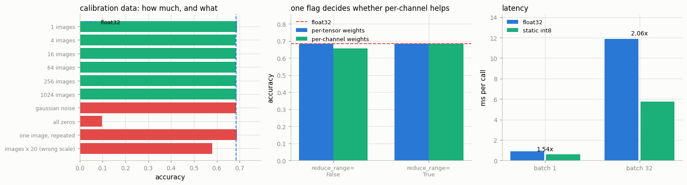

# Static Quantization (PTQ)

---

> Measure the activations once, fix the scales, and skip the per-batch guesswork.

---

## Key Insight

[Static quantization (PTQ)](/shared/glossary/#static-quantization-ptq) converts both [weights](/shared/glossary/#weights) and [activations](/shared/glossary/#activations) to [int8](/shared/glossary/#int8) ahead of time. To pick the right activation scales, it first runs a few sample batches through the model — a step called [calibration](/shared/glossary/#calibration).

## Why This Matters

Because the scales are fixed before serving, static quantization avoids the per-batch overhead of [dynamic quantization](/shared/glossary/#dynamic-quantization) and is usually faster, especially for a [CNN](/shared/glossary/#cnn). The cost is the extra calibration step and a little more accuracy tuning.

---

**This is project 45.**

### What the names mean

- **PTQ** = *post-training quantization*: you take a model that is already trained and
  finished, and quantize it. Nothing is retrained. The alternative,
  [QAT](/shared/glossary/#quantization-aware-training), simulates the rounding *during*
  training so the model can learn around it — more work, better results, and out of
  scope here.
- **Static** means the activation scales are constants baked into the model, decided
  before any user sees it. [Project 44](../44-dynamic-quantization/README.md)'s **dynamic** scales were recomputed on every
  call from the tensor in front of them.
- **Calibration** is the step that produces those constants: run a few hundred typical
  inputs through the model and watch how big the numbers get. Nothing is learned, only
  observed — no gradients, no labels.
- An **observer** is the object doing the watching. `prepare_fx` inserts one wherever a
  scale will be needed; it records ranges during calibration and is deleted at
  `convert_fx`.

### What is real here

The trained CNN from [project 42](../42-export-to-onnx/README.md) (141,034 parameters, 68.4% on CIFAR-10), real CIFAR-10
images for calibration and evaluation, real int8 kernels through PyTorch's x86 backend.
Latency is measured **interleaved** because the machine is shared.

What `run.py` measures:

- asking for dynamic quantization of the convolutions quantizes **0 modules** and
  changes the file size by **0 bytes** — the reason this project exists
- the static flow inserts **7 observers**, calibrates in **0.32 s**, and produces a
  model where `Conv+BatchNorm+ReLU` has collapsed into **one** `ConvReLU2d` and only
  **2** quantize/dequantize nodes remain in the whole graph
- accuracy **0.6840 → 0.6830** (-0.10 points), size **3.64× smaller**, latency
  **1.54× / 2.06×** faster at batch 1 / 32
- calibration set size barely matters: **1 image scores 0.6875, 1024 images 0.6860**.
  Even pure Gaussian noise works (0.6840). But all-zeros collapses the model to
  **0.0975** (chance), and images at 20× the right scale cost 10 points.
- an inversion worth remembering: per-channel weights score **0.6560** — *worse* than
  per-tensor — until one boolean flag is set, after which both score 0.6840
- and on layers where both methods are legal, static beats dynamic: **1.51× vs 1.31×**

---

## Files

| file | what it is |
|---|---|
| `run.py` | all six sections |
| `outputs/small_cnn_int8.pt` | the quantized model, TorchScript-serialized, 0.173 MB |
| `outputs/findings.csv` | every number quoted here |
| `outputs/summary.json` | the same, machine-readable |
| `outputs/static_quant.png` | the three figures |

```bash
python3 run.py       # ~30 s, plus ~2.5 min the first time (it trains the CNN)
```



---

## 1. Why project 44's method does nothing here

Project 44 quantized a language model with one line. Try the same line on a CNN:

| | |
|---|---|
| `quantize_dynamic(cnn, {nn.Conv2d})` — modules actually quantized | **0** |
| `quantize_dynamic(cnn, {nn.Linear})` — modules actually quantized | 2 |
| weights in Conv2d / in Linear | 139.1k / 1.3k — **99.1% is convolution** |
| size, float32 / after | 0.577 MB / **0.577 MB** |
| accuracy | 0.6840, unchanged |

**Nothing happened, and nothing complained.** PyTorch's dynamic path only implements
`Linear`, `LSTM`, `GRU`, and friends — asking for `Conv2d` silently returns the model
unchanged. The two Linear modules that *did* get quantized hold 1.3k of the 140k
weights, so the file size does not move.

### "Why not just add dynamic support for convolutions?"

Because the reason dynamic quantization works for Linear layers does not carry over.
Dynamic means paying, on every call, for a pass over the activation tensor to find its
range. For a language model that is a rounding error next to a
`(512 × 576) @ (576 × 1536)` matmul. For a convolution the arithmetic-to-data ratio is
much less forgiving, and — more importantly — a CNN is a long chain of convolutions,
so you would pay that overhead dozens of times and re-quantize the same feature maps
over and over between layers.

Static quantization fixes both: the scale is already known, so there is no measuring
pass, and because *every* layer's scales are known, the data can stay int8 all the way
through the network instead of converting back to float between layers. Section 2 shows
that happening.

---

## 2. The static flow: observe, calibrate, convert

```python
mapping  = get_default_qconfig_mapping("x86")           # what to do, per layer type
prepared = prepare_fx(model.eval(), mapping, (example,))  # 1. insert observers
for batch in calibration_batches:                        # 2. calibrate (no grads)
    prepared(batch)
int8 = convert_fx(prepared)                              # 3. swap in int8 modules
```

| | |
|---|---|
| observers inserted by `prepare_fx` | **7** |
| calibration on 512 images | **0.32 s** |
| leaf modules before | `Conv2d`×5, **`BatchNorm2d`×5**, `ReLU`×5, `MaxPool2d`×2, `AdaptiveAvgPool2d`, `Linear` |
| leaf modules after | **`ConvReLU2d`×5**, `MaxPool2d`×2, `AdaptiveAvgPool2d`, `LinearPackedParams` |
| quantize / dequantize nodes in the graph | **2** |

Three things to read here.

**FX graph mode.** `prepare_fx` symbolically traces the model into a graph, so it can
see *between* modules — which is what you need to know that a `Conv2d`'s output goes
straight into a `BatchNorm2d` and then a `ReLU`. That is why the flow is graph-based
rather than the module-walking swap of project 44.

**Fusion happened.** 15 modules became 9, with `Conv → BatchNorm → ReLU` collapsing
into one `ConvReLU2d` (BatchNorm folded into the convolution weights exactly as ONNX
export did in project 42, then ReLU merged into the same kernel). Fusing before
quantizing is not cosmetic: an unfused `Conv → ReLU` would quantize the conv's output
to int8, then the ReLU would throw away everything below zero — meaning half the 256
levels were spent representing numbers that get deleted. Fused, the observer sees the
post-ReLU range and all 256 levels land where the data actually is.

**Only two quantize/dequantize nodes in the entire graph** — one at the input, one at
the output. In between, tensors stay int8 the whole way. That is the payoff static
buys and dynamic cannot: dynamic quantization returns to float32 after every Linear,
because the next layer's scale is not known yet.

---

## 3. Accuracy, size, latency

| | float32 | static int8 | |
|---|---|---|---|
| accuracy on 2000 CIFAR-10 test images | 0.6840 | **0.6830** | **-0.10 points** |
| predictions identical to float32 | — | **97.75%** | |
| `state_dict` on disk | 0.577 MB | **0.159 MB** | **3.64×** |
| latency, batch 1 | 0.907 ms | **0.590 ms** | **1.54×** |
| latency, batch 32 | 11.900 ms | **5.768 ms** | **2.06×** |

Compare with project 44, where int8 raised perplexity by 145% on a language model.
Same dtype, same idea, opposite outcome. The difference is the outliers: a CNN's
activations after ReLU and BatchNorm are well-behaved, so one scale per tensor fits
them. A transformer has channels 2000× louder than their neighbours, and one scale per
tensor does not.

**Notice the 97.75%.** Accuracy moved by 0.1 points, but 2.25% of individual
predictions changed. Those two numbers are not in conflict: quantization flipped 45
images, roughly half of them in each direction. As in [project 43](../43-mobile-deployment/README.md), the acceptance test
must be the metric you care about, not per-image equality.

---

## 4. How much calibration data, and what kind

The intuitive worry about calibration is "how many images do I need?". The measurement
says: **that is the wrong question.**

| calibration data | accuracy |
|---|---|
| 1 real image | **0.6875** |
| 4 real images | 0.6830 |
| 16 real images | 0.6845 |
| 64 real images | 0.6845 |
| 256 real images | 0.6840 |
| 1024 real images | 0.6860 |
| **Gaussian noise** (not images at all) | **0.6840** |
| **one image, repeated 256 times** | **0.6875** |
| images multiplied by 20 (wrong input scale) | **0.5805** |
| **all zeros** | **0.0975** |

The whole real-image column is flat, and the spread (0.6830-0.6875) is smaller than the
noise you get from re-running with a different subset. **A single image is enough for
this model.** Even random noise is enough.

That makes sense once you see what calibration actually produces: **7 numbers**. Each
observer needs one range, and a range is decided by the largest values it happens to
see. Extreme values show up early — one 32×32 image already contains 3072 samples per
channel — so more data adds precision to a statistic that only needs to be roughly
right.

The failures are the interesting half:

- **All zeros → 0.0975 (pure chance, 1 in 10 classes).** Every observer records the
  range [0, 0], so every scale is degenerate and every activation quantizes to zero.
  The model is destroyed, silently, and it still runs at full speed and full size.
  This is the calibration bug you will actually hit — not "too few images", but a
  preprocessing pipeline that fed the model an empty or wrongly-normalised tensor.
- **Images × 20 → 0.5805.** Ranges 20× too wide, so real activations use 1/20th of the
  available levels: 8-bit storage doing about 3.7 bits of work. It costs 10 points of
  accuracy and, again, nothing errors out.
- **Gaussian noise → 0.6840, fine.** Noise happens to excite the network over a range
  similar to real images. Do not read this as "the data does not matter" — read it as
  "what matters is the *range*, and noise got the range approximately right".

**The rule: calibration data must be in the same numerical range as production data.
Beyond that, quantity is nearly free.** And always check accuracy after calibrating,
because every failure mode above is silent.

---

## 5. The observer, the granularity, and one flag that matters more

Standard advice says per-channel weight quantization (one scale per output channel)
beats per-tensor (one scale for the whole weight matrix). Measured here:

| | per-tensor weights | per-channel weights |
|---|---|---|
| `reduce_range=False` | 0.6845 | **0.6560** |
| `reduce_range=True` | 0.6840 | **0.6840** |

Per-channel is **2.9 points worse** — until one boolean is flipped, after which the two
are identical. The granularity was never the problem.

**What `reduce_range` does:** it restricts activations to 7 bits (0-127) instead of the
full 8 (0-255). On x86 without VNNI instructions, the int8 matmul kernel accumulates
products in a **16-bit** register. int8 × uint8 products summed over a few hundred
terms can exceed what 16 bits holds, and the accumulator saturates — silently, in the
middle of a convolution. Halving the activation range halves every product and buys
back a bit of headroom. Per-channel weights make the problem *more* likely, because
each channel now uses its full range instead of being shrunk by the loudest channel in
the tensor.

This is why `get_default_qconfig_mapping("x86")` sets `reduce_range=True` for you:

```
QConfig(activation=HistogramObserver(reduce_range=True),
        weight=PerChannelMinMaxObserver(dtype=qint8, qscheme=per_channel_symmetric))
```

The lesson generalises beyond this flag: **hand-built `QConfig`s are how people
accidentally lose accuracy.** Start from the backend default, change one thing at a
time, measure each time.

With `reduce_range=True`, the choice of activation observer barely matters on this
model:

| activation observer | accuracy |
|---|---|
| MinMax (remember the smallest and largest value ever seen) | 0.6835 |
| MovingAverageMinMax (an exponential average of per-batch min/max) | 0.6825 |
| Histogram (build a histogram, choose the range that minimises quantization error) | **0.6840** |

Histogram is the most expensive and wins by 0.15 points, i.e. by 3 images out of 2000
— not a real difference here. It earns its cost on models with occasional huge
activations, where MinMax would stretch the range to cover one freak value and starve
everything else. **A histogram observer is insurance against outliers; this CNN does
not have any.**

---

## 6. Static vs dynamic, head to head

Sections 1-5 compared static-on-a-CNN with dynamic-on-an-LLM, which is two changes at
once. Here is one change: a 3-layer MLP (the only shape both methods support),
batch 32, all three timed in one rotation.

| | ms | speed-up | max \|output difference\| vs float32 |
|---|---|---|---|
| float32 | 0.598 | 1.00× | — |
| dynamic int8 | 0.455 | **1.31×** | 0.0082 |
| **static int8** | **0.395** | **1.51×** | 0.0101 |

Static is faster, as the theory predicts — it skips the per-call range scan and keeps
data in int8 between layers. It is also slightly *less* accurate here (0.0101 vs
0.0082 maximum deviation), which is the other half of the theory: a frozen scale
cannot adapt to an input whose range differs from the calibration set, while a dynamic
scale is always exactly right for the tensor in front of it.

**That is the real trade, in one line: static buys speed by committing to a range in
advance; dynamic buys accuracy by measuring every time.** Which one wins depends on
whether your activations are predictable — very much so for a CNN on normalised
images, much less so for a transformer.

---

## What to take away

1. **Dynamic quantization does not support convolutions**, and says nothing when you
   ask. Check that modules were actually replaced, not just that the call returned.
2. **Fuse before you quantize.** `Conv+BN+ReLU → ConvReLU2d` is what lets a scale cover
   only values that survive, and what keeps the data int8 between layers.
3. **Static PTQ on a CNN is close to free**: -0.10 accuracy points, 3.64× smaller,
   2.06× faster at batch 32.
4. **Calibration needs the right *range*, not a large *quantity*.** One image matched
   1024; all-zeros produced a model at chance with no error message.
5. **Start from the backend's default `QConfig`.** A hand-written one lost 2.9 points
   through a single boolean about 16-bit accumulators.
6. **Static is faster, dynamic is more faithful.** Pick by how predictable your
   activations are.

---

## Next

[Project 46](../46-build-a-triton-server/README.md) stops optimising the model and starts serving it: a model repository, an
HTTP inference protocol, and the [dynamic batching](/shared/glossary/#dynamic-batching)
that decides whether your server is fast or merely quick.
