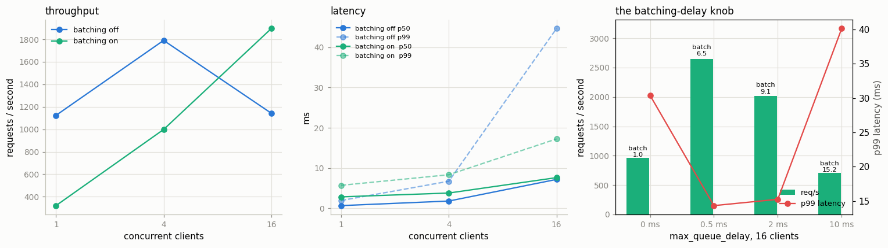

# Build a Triton Server

---

> Wrapping a model in a server turns it into something other programs can call over the network.

---

## Key Insight

[Triton Inference Server](/shared/glossary/#triton-inference-server) is NVIDIA's production server for hosting models. It loads your model, exposes it over HTTP, and handles [batching](/shared/glossary/#batching) and multiple model versions, so clients can send inputs and get predictions back over the network.

## Why This Matters

In production, a model rarely runs in the same process as the application using it. A serving framework like Triton turns your model into a network service with [batching](/shared/glossary/#batching), versioning, and monitoring built in.

---

**This is project 46.**

### What is real here and what is not

NVIDIA's Triton is a large C++ program distributed as a Docker image, and this machine
has neither Docker nor a usable GPU. So `server.py` **implements Triton's three ideas
from scratch**, in about 250 readable lines:

1. a **model repository** on disk — `<model>/<version>/model.onnx` plus a
   `config.pbtxt`, parsed by a small protobuf-text parser in the same file;
2. the **KServe v2 inference protocol** — the exact HTTP routes real Triton serves
   (`/v2/health/ready`, `/v2/models/<name>`, `/v2/models/<name>/infer`), including the
   binary tensor extension;
3. a **dynamic batcher** — a queue in front of the model with `max_batch_size` and
   `max_queue_delay_microseconds`, the two knobs you actually tune in production.

A client written against real Triton would talk to this server unmodified, and vice
versa. What you do not get is Triton's C++ speed, GPU scheduling, model ensembles, or
its `instance_group` execution slots.

**A warning about the numbers.** This box is shared and heavily loaded, and a Python
HTTP server under 16 concurrent client threads is the noisiest thing in this phase.
Throughput figures for the *same* configuration varied about 2× across runs. The
structural measurements — mean batch size, queue time, compute per image, and the
latency-versus-delay shape — are stable and reproducible; the absolute req/s numbers
are not. Both are reported, and the text says which is which.

What `run.py` measures:

- a two-version model repository, served correctly: the served model's answers match
  in-process PyTorch to **3.3e-06**, and scores **0.6758** on 512 images
- the **serving tax**: 0.92 ms of model, **2.8 ms** end to end
- one TCP option, left at its default, costing **+41.2 ms per request** — 45× the
  entire model
- the binary tensor extension: a **5.1× smaller** request body and **2.4× lower**
  p50 latency than JSON
- the dynamic batcher working exactly as designed (mean batch **1.0 → 15.3** as the
  delay grows) while **not improving throughput at all**, and the measurement that
  explains why

---

## Files

| file | what it is |
|---|---|
| `server.py` | the server: repository, `config.pbtxt` parser, KServe v2 routes, dynamic batcher |
| `run.py` | builds the repository, starts servers, runs the six sections |
| `outputs/config.pbtxt` | the model configuration, as Triton would want it |
| `outputs/findings.csv` | every number quoted here |
| `outputs/summary.json` | the load-test results |
| `outputs/server.log` | the servers' own output |
| `outputs/serving.png` | the three figures |

```bash
python3 run.py                                    # ~1 minute
python3 server.py --repo model_repository --port 8000    # or serve it yourself
curl localhost:8000/v2/models/small_cnn                  # and poke it
```



---

## 1. The model repository

Triton does not take a path to a model file. It takes a **directory laid out in a
specific way**, and reads everything else from there:

```
model_repository/
└── small_cnn/
    ├── config.pbtxt          <- what the model is
    ├── 1/model.onnx          <- version 1   (588 KB)
    └── 2/model.onnx          <- version 2   (588 KB)
```

```protobuf
name: "small_cnn"
platform: "onnxruntime_onnx"
max_batch_size: 32
input  [ { name: "x"      data_type: TYPE_FP32  dims: [ 3, 32, 32 ] } ]
output [ { name: "logits" data_type: TYPE_FP32  dims: [ 10 ] } ]
dynamic_batching { max_queue_delay_microseconds: 2000 }
instance_group [ { count: 1  kind: KIND_CPU } ]
```

`.pbtxt` is **protobuf text format** — protobuf's human-writable syntax, the same data
model as the binary `.pb` files ONNX uses. `server.py` includes a 40-line parser for
the subset shown above, which is worth reading once: it is `key: value`, `key { … }`,
and `key [ {…}, {…} ]`, and nothing else.

One detail that catches everyone:

| | |
|---|---|
| `dims` in the config | `[3, 32, 32]` |
| shape the server advertises | `[-1, 3, 32, 32]` |

**When `max_batch_size > 0`, `dims` describes one *item*, and the batch dimension is
implicit.** Write `[1, 3, 32, 32]` there and Triton will happily serve a model that
expects an extra leading dimension no client sends. If your model genuinely has a fixed
shape with no batch axis, you set `max_batch_size: 0` and list the full shape.

Versions are just numbered directories. Ship a new model by writing `3/` next to the
others.

---

## 2. The protocol

Three routes carry almost all the traffic.

| request | response |
|---|---|
| `GET /v2/health/ready` | `200` — "loaded and ready", what your orchestrator polls |
| `GET /v2/models/small_cnn` | `{"name": "small_cnn", "versions": ["2"], "platform": "onnxruntime_onnx", "inputs": [{"name": "x", "datatype": "FP32", "shape": [-1, 3, 32, 32]}], "outputs": [{"name": "logits", "datatype": "FP32", "shape": [-1, 10]}]}` |
| `GET /v2/models/nope` | `404` |
| `POST /v2/models/small_cnn/infer` | the logits |

**KServe** (the name of the protocol) is a Kubernetes-native model-serving standard;
its "v2 inference protocol" is what Triton, TorchServe, OpenVINO Model Server and
others agreed to speak, so one client library can drive any of them. That agreement is
the whole value: it is why `run.py`'s 20-line client would work against real Triton.

The metadata route is not decoration. It is how a client discovers the input name
(`"x"`), the dtype, and the shape without being told out of band — the same job
`config.pbtxt` does for the server.

And the check that matters:

| | |
|---|---|
| max \|served answer − in-process PyTorch\| | **3.338e-06** |
| accuracy of the served model, 512 images | **0.6758** |

Serving added a network, a protocol, a queue, and a batcher, and changed the answers by
float32 rounding. That is the goal, and it is worth asserting in a test, because a
transposed image or a forgotten normalisation step in a serving path is a bug that
produces plausible-looking wrong answers.

---

## 3. The serving tax, and one TCP option

| | |
|---|---|
| in-process PyTorch, batch 1 | 0.924 ms |
| the server's own compute (from `/stats`) | 1.287 ms |
| **end to end over HTTP, p50** | **2.786 ms** |
| of which is not compute | 1.500 ms (**54%**) |

So a request costs about 3 ms, and more than half of it is socket reads, JSON header
parsing, thread hand-offs, and the response write. **When your model takes single-digit
milliseconds, the serving layer is not a rounding error** — it is a comparable cost, and
it is the part you optimise by choosing a better protocol (gRPC, shared memory) rather
than a better model.

### The 42-millisecond default

Now the same server, changing exactly one line — leaving Nagle's algorithm enabled on
the response socket:

| | p50 |
|---|---|
| `disable_nagle_algorithm = True` (what `server.py` sets) | **2.786 ms** |
| Nagle left on (Python's default) | **44.018 ms** |
| difference | **+41.2 ms per request** |

**Nagle's algorithm** (John Nagle, 1984) exists to stop programs flooding a network
with tiny packets: *if you have unacknowledged data in flight, buffer any further small
writes until the acknowledgement comes back.* On the other side, **delayed ACK** says:
*do not acknowledge immediately; wait up to 40 ms in case you have data to send back and
can piggyback the acknowledgement.*

Individually sensible; together, a deadlock resolved by a timer. Our server writes the
HTTP headers and then the body as two small writes. The headers go out; the body is
held by Nagle waiting for an ACK; the client's ACK is held by delayed-ACK waiting for
something to piggyback on. Nobody moves until the 40 ms timer fires.

The model takes 1.3 ms. The TCP default costs 41 ms. **The largest number in your latency
budget may not be in your code at all** — and you will never find it by profiling
Python. This is exactly the class of bug [project 47](../47-latency-profiling/README.md) is built to detect.

---

## 4. JSON tensors versus the binary extension

The base KServe v2 protocol puts tensors in JSON, as a list of numbers. For one
32×32 RGB image that is 3072 floats written out in decimal:

| | JSON | binary extension | |
|---|---|---|---|
| request body | **64,083 bytes** | 12,468 bytes | **5.1× smaller** |
| latency p50 | 6.583 ms | **2.786 ms** | **2.4× faster** |
| latency p99 | 9.965 ms | **3.338 ms** | |

The binary extension keeps a JSON *header* describing the tensors, then appends the raw
bytes after it, and tells the reader where the split is with an HTTP header:

```
Inference-Header-Content-Length: 180
{"inputs":[{"name":"x","shape":[1,3,32,32],"datatype":"FP32",
            "parameters":{"binary_data_size":12288}}], ...}<12288 raw bytes>
```

The 5.1× is float32 costing ~21 characters each in JSON (`0.4913725256919861,`) instead
of 4 bytes. The 2.4× latency is mostly the *parsing*: `json.loads` builds 3072 Python
floats, then numpy copies them into an array, versus `np.frombuffer` which copies
nothing at all.

**Consequence: if your inputs are images, audio, or embeddings, use the binary
extension.** JSON tensors are fine for a handful of numbers and quietly expensive for
anything larger. (This is also the main reason production clients prefer the gRPC
endpoint, where binary is the only option.)

---

## 5. Dynamic batching under load

A **dynamic batcher** sits between the HTTP handlers and the model. When a request
arrives it is put on a queue; a single worker thread takes the first request, waits up
to `max_queue_delay_microseconds` for more to arrive, concatenates whatever it has into
one batch, and runs the model once. "Dynamic" because the batch is assembled from
whatever traffic happens to be in flight, rather than being fixed in advance.

### First: what batching is worth at all

Measured in-process, no HTTP involved:

| batch | total compute | per image |
|---|---|---|
| 1 | 0.233 ms | **233.0 µs** |
| 4 | 0.738 ms | 184.6 µs |
| 8 | 1.559 ms | 194.9 µs |
| 32 | 6.227 ms | **194.6 µs** |

**Batching 32 requests cuts compute per image by only 1.20×**, and the curve is already
flat by batch 4. That is the ceiling for everything below. (Why so little? The model is
tiny, and ONNX Runtime is already using 6 threads on a batch of 1. Batching pays when a
single item cannot fill the hardware — a large model on a GPU, where the gap is 10× or
more, not a 141k-parameter CNN on a busy CPU.)

### Then: what the server actually delivers

| mode | clients | req/s | p50 | p99 | mean batch | server compute |
|---|---|---|---|---|---|---|
| batching **off** | 1 | 1123.7 | **0.69 ms** | 1.96 ms | 1.00 | 299 µs/img |
| batching off | 4 | 1790.4 | 1.82 ms | 6.73 ms | 1.00 | 319 µs/img |
| batching off | 16 | 1143.1 | 7.18 ms | 44.62 ms | 1.00 | 550 µs/img |
| batching **on** | 1 | 321.3 | 2.86 ms | 5.73 ms | 1.00 | 280 µs/img |
| batching on | 4 | 998.3 | 3.81 ms | 8.35 ms | 2.48 | 195 µs/img |
| batching on | 16 | **1895.3** | 7.63 ms | **17.23 ms** | 5.50 | **187 µs/img** |

Three readings, in order of how much you should trust them:

1. **The batcher works.** Mean batch size rises with concurrency exactly as designed
   (1.00 → 2.48 → 5.50) and compute per image falls with it (550 → 187 µs), landing
   right where the in-process curve said it would.
2. **The tail improves.** At 16 clients, p99 is 17.23 ms with batching against 44.62 ms
   without. Batching turns a scramble of independent executions into an orderly queue,
   and orderly queues have shorter tails.
3. **Throughput does not improve** — 1895 req/s with batching against 1143 without at
   16 clients, but 321 against 1124 at one client, and every one of these numbers
   moved by roughly 2× between runs of this same script. The honest statement is "no
   measurable difference at load".

Point 3 is the one worth sitting with, because it is the opposite of what the feature
promises. The arithmetic explains it: batching saves at most ~40 µs of compute per
image (233 → 195), while *each request* costs roughly 1500 µs of Python — socket reads,
header parsing, dict building, thread scheduling, GIL hand-offs (section 3 measured
that directly). **You cannot make a
system faster by optimising the small term.** That is also why real Triton is C++: it
shrinks the per-request cost until the batching saving is the one that matters.

---

## 6. The `max_queue_delay` knob, and versions

16 concurrent clients, varying only how long the batcher is allowed to wait:

| `max_queue_delay` | req/s | p50 | p99 | mean batch | mean queue time | compute |
|---|---|---|---|---|---|---|
| 0 µs | 962.8 | 14.60 ms | 30.41 ms | **1.00** | 12.48 ms | 669 µs/img |
| 500 µs | 2650.9 | 4.98 ms | 14.33 ms | 6.55 | 1.49 ms | 190 µs/img |
| 2000 µs | 2018.1 | 7.41 ms | 15.25 ms | 9.06 | 2.20 ms | 174 µs/img |
| 10000 µs | 711.8 | **21.15 ms** | **40.13 ms** | **15.25** | 8.17 ms | 429 µs/img |

The monotone columns are the trustworthy ones: **more waiting → bigger batches → less
compute per image → more latency.** The delay is a *dial between latency and
efficiency*, and it is the single most important number in a Triton config. Note the
last row: a 10 ms allowance produced batches of 15 and tripled p50, on a model that
takes 0.2 ms. **Never set `max_queue_delay` larger than the inference itself** unless
you are deliberately trading latency for throughput on an expensive model.

The `queued` column is the diagnostic to reach for in production: if requests spend
12 ms on the queue and 0.2 ms in the model, adding GPUs will not help you — the queue is
the system.

### Versions

| | |
|---|---|
| `POST /v2/models/small_cnn/versions/1/infer` vs `/versions/2/infer` | outputs agree to **0.000e+00** (we shipped the same weights twice) |
| a request with no version in the URL is served by | version **2** |

Unversioned requests go to the **highest-numbered** directory. That is how a rollout
works: write `3/`, restart (real Triton can hot-reload), and new traffic moves while
`/versions/2/infer` still serves anyone pinned to the old model. It is also how a
rollback works — delete `3/`.

### What real Triton adds

| | this server | Triton |
|---|---|---|
| language | Python, one worker thread | C++, thread pools |
| backends | ONNX Runtime | ONNX, TensorRT, PyTorch, TensorFlow, Python, vLLM, … |
| `instance_group` | parsed and ignored | N copies of the model executing concurrently, per device |
| transport | HTTP | HTTP + gRPC + shared-memory (skips the copy entirely) |
| batching | dynamic | dynamic + sequence batching + ragged batching |
| observability | a `/stats` route with means | full per-model histograms, Prometheus metrics |
| composition | none | model ensembles and a business-logic scripting API |
| model management | on startup | load/unload models at runtime over the API |

None of those change the *shape* you have just built. That is the point of reading it
at this size.

---

## What to take away

1. **Serving is a directory layout and three HTTP routes.** Once you have seen them,
   Triton, TorchServe and KServe stop looking like different products.
2. **Assert that the served answers match the local ones.** It is one line and it
   catches the entire class of preprocessing bugs.
3. **Send tensors as bytes, not as JSON numbers.** 5.1× smaller, 2.3× faster, for a
   dozen lines of client code.
4. **The biggest latency in this project belonged to TCP, not to the model.** Measure
   end to end before you optimise anything.
5. **Dynamic batching helped the tail and not the throughput here**, because the
   per-request overhead was an order of magnitude larger than the compute it saves. Measure the ceiling
   (in-process batch scaling) before tuning the batcher.
6. **`max_queue_delay` is a latency-for-efficiency dial.** Keep it well under your
   inference time unless you mean it.

---

## Next

[Project 47](../47-latency-profiling/README.md) measures the thing this project kept quoting — p50, p95, p99 — properly:
what those percentiles hide, how many samples you need before they mean anything, and
why the average is the least useful number in the table.
