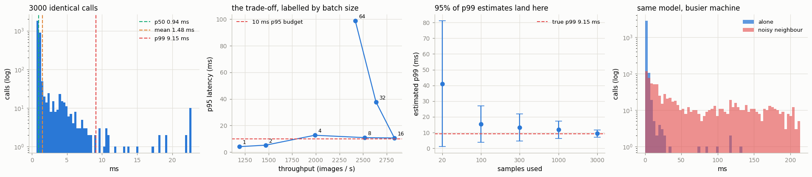

# Latency Profiling

---

> Averages hide the slow requests — and the slow ones are what users remember.

---

## Key Insight

[Latency](/shared/glossary/#latency) is the time a single request takes. Reporting it as percentiles (p50, p95, p99) separates the typical request from the slow [tail](/shared/glossary/#tail-latency) that a plain average would hide. Larger batch sizes usually raise [throughput](/shared/glossary/#throughput) but also raise per-request latency.

## Why This Matters

Users feel the slow requests, not the average. Measuring p50/p95/p99 across batch sizes reveals the real latency–throughput trade-off, so you can pick a batch size that meets your latency target.

---

**This is project 47**, and the last of Phase 8.

### The vocabulary, decoded

- **pN** is the value that N% of samples fall below. p50 (the *median*) is the typical
  request. **p99** is the request that only 1 in 100 is slower than. The "p" is just
  for *percentile*.
- **Tail latency** — the slow end of the distribution. Called a "tail" because if you
  draw the histogram, the bulk sits in a hump on the left and a long thin strip of rare
  slow calls trails off to the right, like a tail.
- **Throughput** — how many requests finish per second. Latency is about *one* request;
  throughput is about the *machine*. They are different questions and, as section 2
  shows, they have different answers.

### What is real here, and a warning that is also the lesson

Everything is measured on the CNN from [project 42](../42-export-to-onnx/README.md). And this machine is genuinely,
measurably busy — **load average 21 on 12 cores**, an Android Studio process using two
cores and another agent using one. That is not an excuse; it is the subject. A p99 is a
measurement of *your worst-behaving 1%*, and on a shared machine most of that 1% belongs
to someone else's program. You will see this in every table below, and section 5
reproduces it deliberately.

The stable, reproducible measurements here are p50 and the *shapes* of the curves. The
p99 column moves between runs. Saying so is part of the job.

What `run.py` measures:

- 3000 identical calls: p50 **0.94 ms**, p99 **9.15 ms**, max **131.97 ms** — a
  **140×** spread for the same work
- the mean sits at 1.48 ms and only **8.4%** of calls are slower than it, so "average
  latency" describes almost nobody
- batch 1 → 16 buys **2.4× throughput** and costs **6.7× latency**
- a p99 estimated from 20 samples lands anywhere in **[1.06, 81.11] ms** when the truth
  is 9.15 — an estimate with **±437%** of error
- a fresh process needs **1.83 s** before it can answer once, **1437×** a warm call
- six threads of noisy neighbour move p50 by **44×** and p99 by **83×**
- and for a request that makes 10 model calls, **9.6%** of requests contain a p99
  outlier — your service's p90 is your model's p99

---

## Files

| file | what it is |
|---|---|
| `run.py` | the six sections |
| `cold_start.py` | the fresh-process measurement of section 4 |
| `outputs/latencies_ms.npy` | all 3000 raw samples, if you want to re-analyse them |
| `outputs/batch_sweep.csv` | the batch-size table |
| `outputs/findings.csv` | every number quoted here |
| `outputs/latency.png` | the four figures |

```bash
python3 run.py       # ~2 minutes, plus ~2.5 min the first time (it trains the CNN)
```



---

## 1. One number is not enough

The same model, the same image, 3000 times in a row:

| | |
|---|---|
| p50 | **0.943 ms** |
| p90 | 1.263 ms |
| p95 | 3.481 ms |
| p99 | **9.154 ms** |
| p99.9 | 99.157 ms |
| mean | 1.476 ms |
| max | **131.973 ms** |

Ratios say it better than the absolute values:

| | |
|---|---|
| p99 / p50 | **9.71×** |
| max / p50 | **139.92×** |
| mean / p50 | 1.56× |
| calls slower than the mean | **8.4%** |

Nothing changed between these calls. Same weights, same input, same process. The 140×
spread is entirely the operating system: another process taking the core, a context
switch, a page fault, the CPU dropping its clock speed.

**The line to remember is the last one.** If latency were symmetric — a bell curve —
half of all calls would be slower than the mean. Here **8.4%** are. The distribution has
a long right tail, and a tail drags the average away from the typical case while
describing neither. Quote the mean and you are reporting a number that 92% of your
users beat and 8% experience as much worse.

This is why every serving system reports percentiles, and why SLOs (service level
objectives) are written as "p99 under 200 ms" and never as "average under 50 ms".

---

## 2. Batch size: the trade-off, with a number attached

| batch | p50 | p95 | p99 | ms per image | images/s | samples |
|---|---|---|---|---|---|---|
| 1 | **0.84** | 4.10 | 12.75 | 0.839 | 1191 | 3840 |
| 2 | 1.36 | 5.21 | 18.69 | 0.681 | 1469 | 1920 |
| 4 | 2.01 | 12.67 | 38.65 | 0.503 | 1989 | 960 |
| 8 | 3.18 | 10.89 | 24.54 | 0.397 | 2517 | 480 |
| 16 | 5.65 | 10.63 | 29.64 | **0.353** | **2832** | 288 |
| 32 | 12.13 | 37.65 | 86.31 | 0.379 | 2638 | 288 |
| 64 | 26.47 | 98.84 | 163.17 | 0.414 | 2418 | 288 |

Read the p50 and per-image columns; they are the stable ones:

- **Latency grows with batch size, almost linearly** (0.84 → 26.47 ms).
- **Per-image cost falls, then stops falling** (0.839 → 0.353 → back up to 0.414). By
  batch 16 the CPU is saturated; after that you are only adding queueing.
- So **throughput has a maximum in the middle**, at batch 16 — 2.4× batch 1. Bigger is
  not better; there is an optimum, and it is worth finding.

The batch sizes were measured **rotating round by round** (all seven sizes, then all
seven again, twelve times) rather than one size at a time. Contention arrives in bursts;
measuring sequentially would charge a whole burst to whichever batch size was unlucky.

### Choosing from a budget

The practical use of this table is inverse: you are given "p95 must stay under 10 ms"
and you pick the batch size.

| | |
|---|---|
| largest batch whose p95 fits 10 ms | **batch 2**, at 1469 img/s |
| throughput gained over batch 1 | **1.23×** |

That answer is unsatisfying, and honestly so: on a quieter moment of the same machine
this selection came out as batch 4 or batch 8. The p95 and p99 columns here are not
monotone in batch size (batch 4's p95 is 12.67 while batch 8's is 10.89), which is
impossible as a property of the model and is entirely the neighbours. **When your
percentile column is not monotone in the thing you are varying, you are measuring the
machine, not the model** — collect on an idle host, or use p50 and accept that you have
not measured the tail at all.

---

## 3. How many samples does a p99 need?

Treat the 3000 samples as truth (p99 = **9.154 ms**), then ask what you would have
concluded from fewer. Each row resamples 400 times and reports where the middle 95% of
the estimates land:

| samples | 95% of estimates land in | error |
|---|---|---|
| 20 | **[1.06, 81.11] ms** | **±437%** |
| 100 | [3.88, 27.05] ms | ±127% |
| 300 | [4.77, 21.91] ms | ±94% |
| 1000 | [6.23, 17.36] ms | ±61% |
| 3000 | [7.21, 11.76] ms | ±25% |

There is a simple reason and it is worth internalising:

**With n samples, only n/100 of them are above the p99.** At n=20 that is **0.2** — on
average, *not one sample*. `np.percentile` still returns a number, because it
interpolates between the two largest values it has. It is an extrapolation dressed as a
measurement.

Rules of thumb that follow:

- fewer than ~100 samples: you have measured p50, nothing more;
- ~1000 samples: p99 within a factor of ~2 — enough to spot a 10× regression, not a
  20% one;
- ~10,000 samples: p99 you can compare between builds.

And the same arithmetic applies to production dashboards: a p99 computed over a
one-minute window at 5 requests/second rests on **3 samples**. That is why real
monitoring systems keep histograms and aggregate over longer windows rather than
averaging per-minute p99s (which is, additionally, not a valid operation — see
section 6).

---

## 4. Warm-up: the first call is not like the others

Inside an already-running process, warm-up is small — the first call of a freshly
constructed model took 135.93 ms against a 0.94 ms steady state in this run, and was
back to normal by call 6 (on a quieter run it was 1.4× and done by call 2). Allocator
caches, thread pools, and lazily-selected kernels all settle within a few calls.

The number that actually matters is a **cold process**:

| | |
|---|---|
| `import torch` | **1.77 s** |
| build the model and load weights | 23 ms |
| first inference | 31.4 ms |
| second inference | 1.28 ms |
| **total before the first answer** | **1.83 s** = **1437×** a warm call |

Importing PyTorch dominates, and nothing you do to your model changes it. The
consequences are all operational:

- **Autoscaling.** A new replica is useless for roughly two seconds after it starts. If
  your scale-up trigger is a traffic spike, the spike is over before the new pod helps.
  This is why serving systems keep warm pools and pre-load models at startup instead of
  on first request.
- **Serverless** is worse: a cold start pays this on a request a user is waiting for.
- **Health checks must not pass until the model has run once.** [Project 46](../46-build-a-triton-server/README.md)'s
  `/v2/health/ready` route exists precisely so a load balancer can wait for this.
- **Benchmarks must discard warm-up.** Including the first 12 calls moved the measured
  p99 from 2.907 ms to 4.283 ms here — a 47% "regression" that is pure measurement
  error. Every timing helper in this phase warms up first.

---

## 5. Where tails come from

Section 1 blamed "the operating system". This section proves it by *being* the
neighbour: six threads doing nothing but 256×256 matrix multiplications, started
alongside the same measurement.

| | alone | with a neighbour | |
|---|---|---|---|
| p50 | 0.995 ms | **43.851 ms** | **44.09×** |
| p99 | 2.907 ms | **239.943 ms** | **82.53×** |
| max | 8.256 ms | 302.024 ms | |

The model did not change. Its weights, its input, and its arithmetic are identical. Only
the number of other things wanting a core changed, and the p99 grew by **83×**.

Two takeaways, one technical and one about how to read benchmarks:

**Technical:** latency is a property of a *system*, not of a model. Tail latency in
production is dominated by things with no relationship to your code — co-tenants,
garbage collection in another process, CPU frequency scaling, an interrupt storm from
the network card. Fixing it usually means isolation (CPU pinning, cgroups, dedicated
instances) rather than optimisation. Phase 9 of the robotics guide measured the same
thing from the other side: pinning without isolation made things 1.8× *worse*.

**About benchmarks:** any latency number you read — including every number on this page
— is a measurement of a particular machine at a particular minute. When a vendor
publishes "p99 of 4 ms", the honest question is "on an otherwise idle machine?". The
answer is almost always yes, and your production machine is not idle.

---

## 6. Percentiles do not add up

Real requests rarely make one model call. A retrieval-augmented answer might embed a
query, search, rerank, and generate. If each step has a p99 of X, what is the p99 of the
whole thing?

The tempting answer is `k × p99`. It is wrong, and it can be wrong in either direction.
Resampling the measured distribution 20,000 times per row:

| sequential calls | real p99 of the total | k × p99 | |
|---|---|---|---|
| 1 | 8.40 ms | 9.15 ms | 92% |
| 2 | 19.13 ms | 18.31 ms | 105% |
| 5 | **76.84 ms** | 45.77 ms | **168%** |
| 10 | 111.82 ms | 91.54 ms | 122% |

Two opposing effects fight here:

- **Averaging pulls it down.** For all k calls to be slow at once is very unlikely, so
  the *sum* of k calls is relatively less variable than one call. With a light tail the
  real p99 comes in *below* k × p99.
- **A single outlier pushes it up.** With a heavy tail — which is what a busy machine
  produces — one 130 ms call plus nine typical ones already exceeds the naive bound, and
  a 10-call request gets ten chances to draw that one. Here the heavy tail wins and the
  real p99 lands *above* k × p99 at k=5 and k=10.

Which effect dominates depends on the shape of the tail, which is exactly why **you
cannot compute a system's p99 from its components' p99s.** You measure end to end.

The reliable law is about *probability*, not about milliseconds:

| calls per request | requests containing at least one p99 outlier | 1 − 0.99^k |
|---|---|---|
| 1 | 0.9% | 1.0% |
| 2 | 1.9% | 2.0% |
| 5 | 5.0% | 4.9% |
| 10 | **9.6%** | 9.6% |

Measured and predicted agree to a tenth of a percent, because this part is just
independence. **A request that makes 10 model calls hits a p99-grade slow call about 10%
of the time.** Said the way it will matter to you: *your service's p90 is your model's
p99.* Every extra call in a chain moves the model's rare bad case into your users' common
experience — which is the real argument for fusing steps, caching, and running things in
parallel rather than in sequence.

---

## What to take away

1. **Never report a mean.** Here only 8.4% of calls were slower than the mean; it
   describes neither the typical nor the bad case.
2. **p99/p50 is the number to watch.** 9.7× here means one call in a hundred takes ten
   times as long as normal, for no reason inside your code.
3. **Throughput has an interior optimum in batch size** (16 here, 2.4× batch 1), and
   getting there cost 6.7× latency. Pick from your latency budget, not from the biggest
   number in the throughput column.
4. **A p99 needs thousands of samples.** From 20 it is an extrapolation with ±437% of
   error.
5. **Discard warm-up, and remember cold start is seconds.** 1.83 s before the first
   answer, of which 1.77 s is `import torch`.
6. **Tails belong to the machine.** A noisy neighbour moved p99 by 83× without touching
   the model.
7. **Percentiles do not compose.** Measure end to end, and remember that k sequential
   calls turn a 1% event into a k% one.

---

## Phase 8, in one paragraph

A trained model becomes a deployed one by passing through four questions, one per
project pair. *Can something else run it?* — export it and check the numbers match
(42, 43). *Can it run smaller and faster?* — quantize it, and measure what that costs
in the metric you care about, because the answer ranged from -0.10 accuracy points on a
CNN to +145% perplexity on an LLM (44, 45). *Can other programs reach it?* — a model
repository, a protocol, and a batcher, where the biggest latency turned out to belong to
TCP (46). *Is it fast enough?* — which is a question about a distribution, not a number
(47).
