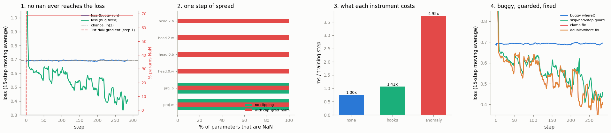

# NaN [Forensics](/shared/glossary/#forensics)

---

> A single NaN doesn't stay put — it spreads to every number it touches.

---

## Key Insight

A [NaN](/shared/glossary/#nan) ("Not a Number") poisons every later calculation, so by the time training visibly breaks the real cause is many steps behind. Turning on [anomaly detection](/shared/glossary/#anomaly-detection) makes [autograd](/shared/glossary/#autograd) stop at the exact operation that first produced the NaN.

## Why This Matters

Chasing the symptom — a loss that suddenly reads NaN — wastes hours. Finding the first bad op tells you which layer and which math (a `log(0)`, a divide-by-zero, an exploding [gradient](/shared/glossary/#gradients)) to fix.

---

**This is project 48.**

### The words first

- **NaN** is short for *Not a Number*. It is a real value your computer can
  store, like `3.5` is, but it means "this calculation had no answer". `0/0`
  makes one. So does `inf - inf`. Its defining property: **every arithmetic
  operation involving a NaN returns a NaN**. `nan + 1` is `nan`. `nan * 0` is
  `nan`. That single rule is why one bad number becomes a thousand.
- **Forensics** is the word police use for reconstructing a crime after the
  fact, from the traces it left. It fits here exactly: by the time you notice,
  the event is long over, and all you have is evidence.
- **Anomaly detection** in PyTorch means one switch,
  `torch.autograd.set_detect_anomaly(True)`. With it on, [autograd](/shared/glossary/#autograd) checks
  the output of every backward operation and stops at the first one that
  produces a NaN — and, crucially, tells you where in your *forward* code that
  operation came from.

### The twist in this project

The textbook version of this bug ends with `loss = nan` printed to your
terminal. **This one never prints a nan at all.**

The run below trains for 300 steps. Its loss goes to 0.6931 and sits there.
0.6931 is `ln(2)` — exactly the loss of a coin flip on a two-class problem — so
it reads as "the model is not learning, maybe the task is too hard". The truth
is that **68.7% of its parameters became NaN at step 1**, and the very layer
that created the NaN is also quietly converting it back to `0.0` on every
forward pass, so nothing downstream ever sees one.

That is the most expensive kind of bug: not the one that crashes, but the one
that looks like a disappointing result.

### What is real here

A small sequence classifier (a projection, a per-position vector length, a
2-layer head) on synthetic padded sequences. Everything measured is a real
PyTorch behaviour on this machine, including the timings — which come from
interleaved rounds because the box is shared.

What `run.py` finds:

- the loss **never once prints `nan`**, over 300 steps, while the model is 68.7%
  destroyed from step 1 — accuracy **0.523** (chance) against **0.910** for the
  same code with the bug fixed
- **`clip_grad_norm_` turns a 68.7% disaster into a 100% one**: one NaN anywhere
  makes the total norm NaN, and every parameter is then scaled by NaN
- the forward-hook scanner flags **0 modules** at the step the NaN is born —
  because the forward pass is genuinely clean — and 1 module on the *next* step,
  which is one step too late
- [anomaly detection](/shared/glossary/#anomaly-detection) names it in one line: **`Function 'SqrtBackward0'
  returned nan values in its 0th output`** — and a *second*, separate message
  quotes the forward line `return torch.where(sq > 0, torch.sqrt(sq), ...)`
- what that costs: **4.95×** the step time (hooks: **1.41×**)
- the reason, in numbers: `d/dx sqrt(x)` at `x=0` is **inf**, and `0 * inf` is
  **nan** — so a branch that is *not taken* still poisons the gradient
- and a second surprise: after Adam has seen one NaN gradient, **restoring the
  weights from a clean checkpoint is not enough** — 68.7% NaN again after one
  step with a perfectly clean gradient, because the poison is in the optimizer
  state, not the weights

---

## Files

| file | what it is |
|---|---|
| `run.py` | all nine sections |
| `debug_lib.py` | shared helpers for projects 48-52 (findings CSV, memory and graph instruments, timing) |
| `outputs/findings.csv` | every number quoted on this page |
| `outputs/anomaly_traceback.txt` | what anomaly mode actually printed, verbatim |
| `outputs/nan_forensics.png` | the four figures |

```bash
python3 run.py       # ~2 minutes, CPU only, no downloads
```



---

## 1. The crime scene

The model is an ordinary shape. Sequences of different lengths get **padded** —
short ones are filled out with zeros so the batch is a rectangle — and a mask
records which positions are real:

```python
def forward(self, x, mask):
    h = self.proj(x) * mask[..., None]   # padded positions become exactly 0.0
    lens = self.norm(h)                  # per-position vector length
    return self.head(lens)
```

`self.norm` wants the **L2 norm** of each position: the ordinary straight-line
length of a vector, `sqrt(x₁² + x₂² + …)`. The "L2" in the name comes from the
general family of *Lp* norms, `(Σ|xᵢ|^p)^(1/p)`; setting *p* = 2 gives the
familiar Pythagorean length, which is why everyone writes L2. (See
[L2 normalization](/shared/glossary/#l2-normalization).)

Square roots have a problem at zero, and the author knew it, so they guarded it:

```python
sq = (h * h).sum(-1)                                     # exactly 0.0 where padded
return torch.where(sq > 0, torch.sqrt(sq), torch.zeros_like(sq))
```

Read out loud, that says "take the square root only where there is something to
take the square root of". It is wrong. Section 6 says why.

Here is the run:

| | |
|---|---|
| steps | 300 |
| batches containing at least one padded row | **78 of 300** |
| first step with a non-finite **gradient** | **1** |
| first step with a non-finite **parameter** | **1** |
| first step with a non-finite **loss** | **never** |
| loss at step 0 → final step | 0.7600 → **0.6940** |
| chance level for 2 classes, `ln(2)` | **0.693147** |
| parameters non-finite at the end | **68.7%** |
| accuracy, buggy run vs. same code fixed | **0.523** vs **0.910** |
| final loss, buggy vs fixed | 0.6940 vs **0.3896** |

The printed log for the whole run:

```
step 0: 0.7600; step 25: 0.6823; step 50: 0.6946; step 75: 0.6939; step 100: 0.6979;
step 125: 0.6954; step 150: 0.6961; step 175: 0.6832; step 200: 0.6660; step 225: 0.6912;
step 250: 0.6774; step 275: 0.6934
```

Nothing in that log is alarming. It is a flat loss, which everyone has seen, and
whose usual causes are a learning rate that is too small, a model that is too
small, or a task that is too hard. None of those is the cause here.

**Why does the loss stay finite when the weights are NaN?** Because
`nan > 0` evaluates to **False**. The comparison inside the guard is False at
every position once `sq` is NaN, so `torch.where` returns the *other* branch —
`zeros_like(sq)` — and the NaN is replaced by a clean `0.0` before it reaches
the head. The layer that manufactures the poison also swallows it. That is not a
special quirk of this model; it is what happens whenever a NaN passes through
any comparison, since **every comparison against a NaN is False** (even
`nan == nan`).

---

## 2. One step of spread

Run to step 1 — the first step whose batch contained a padded row — and stop:

| parameter | % of its numbers that are non-finite |
|---|---|
| `proj.weight` | **100.0%** |
| `proj.bias` | **100.0%** |
| `head.0.weight` | 0.0% |
| `head.0.bias` | 0.0% |
| `head.2.weight` | 0.0% |
| `head.2.bias` | 0.0% |
| **whole model** | **68.7%** |

One step. Not "a NaN appeared in one element" — every single number in the layer
below the bad op is gone. The reason is the shape of the [backward
pass](/shared/glossary/#autograd): a NaN in one activation reaches
`proj.weight`'s gradient through a matrix multiply, and a matrix multiply *sums*
over the batch, so a single poisoned row contaminates the entire weight matrix.
Then one SGD step writes `weight - lr * nan` into all of it.

The layers *above* the bad op are untouched, and that is genuinely useful
evidence: **the NaN boundary in your parameters points at the guilty layer.**
Everything below `proj`'s output is dead; everything above is fine; the crime
happened between them.

---

## 3. Gradient clipping is an accomplice

[Gradient clipping](/shared/glossary/#gradient-clipping) is the standard defence
against exploding gradients: measure the total size of all gradients, and if it
exceeds a threshold, scale them all down. It is in almost every training script,
and here is what it does to a NaN.

Three parameters, twelve gradient numbers, exactly **one** of them NaN:

| | |
|---|---|
| `total_norm` returned by `clip_grad_norm_(params, 1.0)` | **nan** |
| gradient numbers non-finite *after* clipping | **12 of 12** |
| same experiment on the real model: NaN parameters without clipping | 68.7% |
| ...with `clip_grad_norm_(1.0)` | **100.0%** |

The mechanism is one line of arithmetic. Clipping computes
`total_norm = sqrt(Σ gᵢ²)` over *all* parameters, then multiplies every gradient
by `max_norm / total_norm`. One NaN in the sum makes the sum NaN, so the
multiplier is NaN, so **every gradient in the model is multiplied by NaN**.

Clipping does not cause the bug. It converts a localised bug into a global one,
and in doing so **destroys the evidence from section 2** — with clipping on,
every layer is 100% NaN and the boundary that told you where to look is gone.

PyTorch offers an opt-in guard:

```python
torch.nn.utils.clip_grad_norm_(params, 1.0, error_if_nonfinite=True)
# RuntimeError: The total norm of order 2.0 for gradients from `parameters` is non-finite...
```

It is **off by default**. Turning it on costs nothing and converts a silent
catastrophe into an exception at the right moment.

---

## 4. Instrument A: a forward-hook scanner

A [forward hook](/shared/glossary/#forward-hook) is a function PyTorch calls for
you every time a module runs, with that module's input and output. You register
one and you are done — no editing of the model, no wrapping. So the cheapest
NaN detector in existence is:

```python
for name, mod in model.named_modules():
    if not list(mod.children()):                    # leaves only
        mod.register_forward_hook(
            lambda m, i, out, n=name: hits.append(n)
            if not torch.isfinite(out).all() else None)
```

> **"Leaves only" — why?** A container like `nn.Sequential` also fires a hook,
> but its "output" is just its last child's output, so counting both reports the
> same tensor twice and makes the first flagged module ambiguous.

Point it at our run:

| | |
|---|---|
| gradient numbers non-finite at the bad step | **1056** |
| modules flagged by the scanner, up to and including that step | **0** |
| modules flagged on the **next** forward | **1** (`proj`) |

**Zero.** The scanner is not broken — there was genuinely no NaN in the forward
pass. The NaN was born during the backward pass, and a forward hook cannot see
the backward pass by construction.

On the *next* forward, once the poisoned weights are used, it flags `proj`
immediately. That is still useful — but notice what it tells you: `proj` is
where the NaN *is*, not where it *came from*. `proj` is the victim. The
instrument points at the wrong layer, confidently.

---

## 5. Instrument B: anomaly detection, and what it costs

> **"Isn't the hook scanner already doing this?"** No — and this is the whole
> point of running both. The scanner watches **values flowing forward**;
> anomaly mode watches **gradients flowing backward**. They see disjoint halves
> of a training step. Our bug lives entirely in the half the scanner cannot
> reach, and section 7's bug lives entirely in the half anomaly mode is slower
> at. Neither instrument subsumes the other.

```python
with torch.autograd.set_detect_anomaly(True):
    loss = F.cross_entropy(model(x, mask), y)
    loss.backward()
```

Anomaly mode answers in **two separate messages**, and most people throw the
better one away. The exception says *which backward op*:

```
RuntimeError: Function 'SqrtBackward0' returned nan values in its 0th output.
```

and a **warning**, emitted just before it, says *where in your forward code that
op was created*:

```
Error detected in SqrtBackward0. Traceback of forward call that caused the error:
  File "run.py", line 341, in <module>
    loss = F.cross_entropy(m5(x5[bad], mask5[bad]), y5[bad])
  ...
  File "run.py", line 102, in forward
    return torch.where(sq > 0, torch.sqrt(sq), torch.zeros_like(sq))
```

That last line is the answer, printed for you. The full text is in
[`outputs/anomaly_traceback.txt`](outputs/anomaly_traceback.txt).

> **Why does that traceback even exist?** By the time backward runs, your
> forward code has finished and its Python stack is gone — a normal traceback
> would only show the autograd engine's internals, which name no line of yours.
> So anomaly mode **records the forward stack at the moment each graph node is
> created** and replays it if that node later misbehaves. Storing a stack for
> every operation is exactly why it is slow. If you catch the exception with a
> bare `except RuntimeError` and print only the exception, you lose this half.

The bill, measured with interleaved rounds on this shared machine:

| instrument | ms / training step | vs. nothing |
|---|---|---|
| no instrument | 0.755 | 1.00× |
| forward hooks | 1.064 | **1.41×** |
| anomaly mode | 3.732 | **4.95×** |

In plain terms: **hooks are cheap enough to leave on in a real run; anomaly
mode is not.** Turn anomaly mode on for one step, get your answer, turn it off.

---

## 6. The verdict: `where` evaluates both branches

```python
x = torch.tensor([0.0, 1.0, 4.0], requires_grad=True)
y = torch.where(x > 0, torch.sqrt(x), torch.zeros_like(x))
y.sum().backward()
```

| | |
|---|---|
| forward output | `[0.0, 1.0, 2.0]` |
| forward contains a NaN? | **False** |
| `x.grad` | **`[nan, 0.5, 0.25]`** |

Three finite numbers in, three finite numbers out, and a NaN gradient.

`torch.where(cond, a, b)` is **not** an `if`. It is not lazy. Both `a` and `b`
are fully computed as tensors, and *then* `where` selects element-by-element.
So `torch.sqrt(x)` runs on the whole tensor, including the `0.0` — which is
fine in the forward direction, since `sqrt(0) = 0`.

Backward is where it breaks, in two steps:

1. `where` sends a gradient of **0** to the un-selected branch. Correct: that
   branch did not influence the output.
2. `sqrt`'s backward multiplies the gradient it receives by `0.5 / sqrt(x)`. At
   `x = 0` that factor is **`inf`**.

| | |
|---|---|
| `d/dx sqrt(x)` at `x = 0` | **inf** |
| `0 * inf` in IEEE-754 floating point | **nan** |

So the un-taken branch contributes `0 × inf = nan`, and that NaN is added into
`x.grad`. **The gradient of a branch you did not take poisons the gradient of
the branch you did.**

This is not a PyTorch bug. `0 × inf` genuinely has no defined answer — that is
what NaN is *for* — and autograd has no way to know that the `0` came from a
mask rather than from real arithmetic.

### Two fixes, both one line

Make the value fed into `sqrt` safe *before* the square root, so the dangerous
factor never exists:

```python
safe = torch.where(sq > 0, sq, torch.ones_like(sq))       # the "double where"
out  = torch.where(sq > 0, torch.sqrt(safe), torch.zeros_like(sq))
```

```python
out = torch.sqrt(sq.clamp_min(1e-12))                      # or just clamp
```

| | gradient at `x = 0` |
|---|---|
| the guarded version | **nan** |
| double-`where` | **0.0** |
| `clamp_min(1e-12)` | **0** (i.e. `0.5/sqrt(1e-12)` scaled by an incoming 0) |

The double-`where` looks redundant — you are writing the same condition twice,
and a reader will ask why the second one is not enough. It is not redundant,
and the reason is exactly the mechanism above: the **first** `where` fixes the
*input* to `sqrt` so no infinite derivative is ever produced, and the **second**
fixes the *output* so padded positions still report a length of zero. One
protects the backward pass, the other protects the forward pass. Delete either
and you lose one of the two.

The same trap catches `torch.norm`, `torch.linalg.norm`, `x.pow(0.5)`,
`torch.acos` at ±1, `torch.log` at 0, and division by a masked-out denominator.
Anything with an unbounded derivative at the boundary of its domain.

---

## 7. The other bug, the one the hooks *do* catch

Someone writes log-softmax by hand, from the definition:

```python
torch.log(torch.exp(logits) / torch.exp(logits).sum(-1, keepdim=True))
```

| | |
|---|---|
| `exp(120)` in [float32](/shared/glossary/#float32) | **inf** |
| hand-rolled result for logits `[0.5, 120.0, -3.0]` | **`[-inf, nan, -inf]`** |
| `torch.log_softmax` on the same input | `[-119.5, 0, -123]` |
| forward scanner catches it | **yes** |

float32's largest finite value is about 3.4 × 10³⁸, and `exp(120)` is about
1.3 × 10⁵². So `exp(120)` is `inf`, the sum is `inf`, and `inf / inf` is `nan`.

`torch.log_softmax` gets the right answer because it subtracts the maximum
[logit](/shared/glossary/#logits) first — mathematically a no-op (it cancels in
the ratio), numerically the difference between working and not. **This is why
you use the library function even when the formula is three symbols long.**

Two bugs, two instruments:

| | forward-hook scanner | anomaly mode |
|---|---|---|
| the `where`+`sqrt` bug (backward only) | **misses it** | finds it |
| the hand-rolled log-softmax (forward) | **finds it** | finds it, 3.5× slower |
| cost | 1.41× | 4.95× |

The practical routine: leave a cheap forward scanner on, and reach for anomaly
mode for one step when the scanner says nothing but the model is clearly sick.

---

## 8. Restoring the checkpoint is not enough

You found the bug and you want to resume from the last good checkpoint. With
[Adam](/shared/glossary/#adam), that is not sufficient — and the reason is worth
knowing before it costs you a day.

Adam keeps two running averages per parameter: `exp_avg` (the average recent
gradient) and `exp_avg_sq` (the average recent squared gradient). Both are
updated with `new = β·old + (1-β)·current`. Feed one NaN in and `old` is NaN
**forever after**, because every later update multiplies the NaN by β and adds
to it.

| | |
|---|---|
| parameters non-finite after 4 Adam steps | 68.7% |
| optimizer state tensors non-finite | **4 of 12** |
| parameters non-finite right after `load_state_dict(clean_weights)` | **0.0%** |
| ...after **one** step with a perfectly clean gradient | **68.7%** |
| ...if you also rebuild the optimizer | **0.0%** |

Read the last three rows together: the weights are clean, the gradient handed
to the optimizer is clean, and the model still dies in one step. Nothing about
the weights or the data explains it. The poison is in the
[optimizer state](/shared/glossary/#optimizer-state), which is a *separate*
object that `model.load_state_dict` does not touch.

So a resumable checkpoint has to contain the optimizer state too — and a
checkpoint written *after* the NaN contains the poison. When resuming from a
suspect run, rebuild the optimizer.

---

## 9. Fix it, or survive it

Four variants of the same 300-step run:

| variant | final loss | accuracy | NaN params at the end | steps skipped |
|---|---|---|---|---|
| the buggy `where()` | 0.6940 | **0.523** | **68.7%** | — |
| skip-bad-step guard | 0.6425 | 0.742 | 0.0% | **78 of 300** |
| `clamp_min` fix | **0.3896** | **0.910** | 0.0% | — |
| double-`where` fix | **0.3896** | **0.910** | 0.0% | — |

The guard is four lines and needs no understanding of the bug:

```python
loss.backward()
if any(p.grad is not None and not torch.isfinite(p.grad).all()
       for p in model.parameters()):
    opt.zero_grad(set_to_none=True)          # drop this batch, keep the model
    skipped += 1
else:
    opt.step()
```

It works — the model survives and reaches 0.742 accuracy instead of 0.523. But
read the last column: it threw away **78 of 300 batches, 26% of the training
data**, and those were exactly the batches containing short sequences. So the
guard silently changed *what the model was trained on*. It kept the run alive
and biased the result.

Both real fixes land on the identical number, 0.3896 / 0.910 — they compute the
same thing, and the choice between them is taste. (In figure 4 the two fix
curves lie exactly on top of each other, which is why you only see one.)

**A guard is for production, where you would rather lose a batch than a
week-long run. It is not a fix, and a run that is silently discarding a quarter
of its data should be telling you so in the logs.**

---

## What to remember

1. **A NaN loss is the lucky case.** The unlucky case is a NaN that gets masked
   before it reaches the loss, and then all you see is a model that "doesn't
   learn". Check `torch.isfinite` on your *parameters*, not just your loss —
   it is one line per step and it is the difference between step 1 and step
   never.
2. **`torch.where` is not an `if`.** Both branches are computed, and the branch
   you did not take can still hand you an `inf` that becomes a `nan` when
   multiplied by the mask's zero. Guard the *input* to the dangerous op, not
   just its output.
3. **`clip_grad_norm_` broadcasts NaN to every parameter in the model.** Pass
   `error_if_nonfinite=True`.
4. **The two instruments see different halves of the step.** Forward hooks:
   cheap, forward only, 1.41×. Anomaly mode: expensive, sees backward, 4.95×,
   and its most useful output is the *warning* with the forward traceback, not
   the exception.
5. **The NaN boundary in your parameters is evidence.** The first layer that is
   100% NaN sits directly below the guilty op — unless you clipped, in which
   case you erased it.
6. **Adam remembers.** Restore the optimizer state as well, or rebuild it.

---

## Try it yourself

- Change `SHORT_ROWS` from 4 to 0 in `run.py` — no padded rows, no zero vectors,
  and the identical buggy code trains perfectly. That is what a bug that only
  fires on 26% of batches looks like from the outside.
- Replace `torch.sqrt(sq)` with `torch.linalg.norm(h, dim=-1)` and confirm the
  same NaN: the trap is the maths, not the spelling.
- Set `optimizer="adam"` in `train()` and watch how much longer the model
  survives before dying — Adam's normalisation hides an exploding gradient for
  a while, which is why "switch to Adam" sometimes looks like a fix.
- Register the forward scanner as a **backward** hook
  (`register_full_backward_hook`) instead, and see whether it now catches the
  `sqrt` bug. Compare its cost to anomaly mode's 4.95×.

---

**Next:** [project 49](../49-memory-leak-hunt/README.md) takes the same
"instrument it and measure" approach to memory that only ever climbs — where
the surprise is that the number everyone watches, resident memory, is not
measuring your tensors at all.
