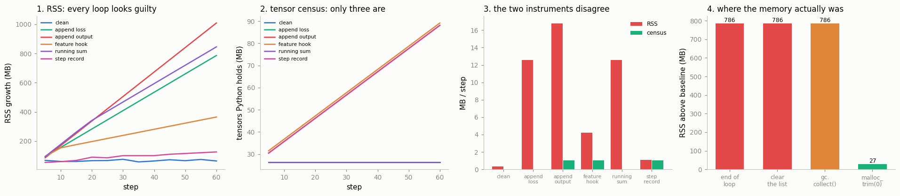

# Memory Leak Hunt

---

> Memory that only ever climbs is a reference you forgot to let go of.

---

## Key Insight

A [memory leak](/shared/glossary/#memory-leak) in PyTorch usually means you kept a reference to the [loss](/shared/glossary/#loss-function) or another piece of the [computation graph](/shared/glossary/#dynamic-computation-graph) across iterations, so the memory it holds can never be freed. Comparing [memory snapshots](/shared/glossary/#memory-snapshot) taken over many steps exposes the slow, steady climb.

## Why This Matters

A leak that adds a few megabytes per step runs fine for an hour and then crashes with an out-of-memory error. Snapshots turn that mysterious late crash into an obvious upward line you can trace back to its source.

---

**This is project 49.**

### The words first

- **RSS** stands for *resident set size*: how much physical memory
  ([RAM](/shared/glossary/#ram)) the process is occupying right now. "Resident"
  means actually living in RAM, as opposed to address space the process asked
  for and never touched. It is the number `top` shows you and the number the
  system's out-of-memory killer looks at, which is why everyone watches it.
- A **leak**, in a language with automatic memory management, is not memory that
  went missing. It is memory that is *still reachable* — something in your
  program still points at it — so the runtime is not allowed to reclaim it. Find
  the pointer and you have found the leak.
- The **allocator** is the layer between your program and the operating system.
  When you free memory, the allocator usually keeps it, because handing it back
  and asking for it again is slow. This is the reason RSS and "memory my program
  is using" are two different quantities, and most of this project is about the
  gap between them.

### The result that reorganises this project

Six training loops that differ by one line each are measured with three
instruments. On the loop everyone calls "the classic leak" —
`losses.append(loss)` — the instruments disagree completely:

| instrument | what it says about the classic leak |
|---|---|
| **RSS** | growing **12.58 MB/step**, all RAM gone in 14 minutes |
| **tensor census** | **0.000 MB/step** — Python is holding no extra tensor data at all |
| **graph walk** | 32 autograd node objects, **0 MB** of saved activations |

Both of the last two are right, and RSS is not lying either. `backward()` had
already freed all 28.31 MB of saved activations; the 12.58 MB/step is memory
that **glibc has freed but will not give back**, because a handful of tiny
surviving objects sit at the top of its heap. One environment variable —
`MALLOC_MMAP_THRESHOLD_=65536` — takes the same run from **1278 MB to 41 MB**,
a **31.2×** difference, with no change to a single line of PyTorch code.

So the practical lesson is not "never append the loss". It is: **RSS tells you
*that* something is wrong; it cannot tell you *what*, and on Linux it will
routinely overstate a leak by an order of magnitude.**

### What is real here

Real training loops (a 6-layer MLP, batch 256, SGD), real PyTorch memory
behaviour, real glibc behaviour. Nothing is simulated.

What `run.py` finds:

- the suspect loop grows **12.58 MB/step** while the clean one grows **0.32**,
  and at 3 steps/second it exhausts 32.7 GB of RAM in **14 minutes**
- `backward()` frees the saved activations but **not the graph nodes**: 32 nodes
  before, 32 nodes after, 28.31 MB of tensors before, **0.00 MB** after
- clearing the list and calling `gc.collect()` returns **0 MB**;
  `malloc_trim(0)` returns **758.9 MB** instantly
- the `running_sum` loop grows its autograd graph to **1272 nodes** — the one
  leak the census cannot see and the graph walk names exactly
- a [reference cycle](/shared/glossary/#reference-cycle) holds **83.9 MB** that
  reference counting can never release, and one `gc.collect()` frees **160
  objects**
- and the instrument-writing trap that cost a debugging session: `id(grad_fn)`
  is not a stable identity, and a `seen` set built on it makes a graph walk stop
  after 2 nodes instead of 32

---

## Files

| file | what it is |
|---|---|
| `run.py` | all nine sections |
| `child_loop.py` | the same loop in a fresh process, for section 6's environment variables |
| [`../48-nan-forensics/debug_lib.py`](../48-nan-forensics/debug_lib.py) | `rss_mb`, `live_tensor_bytes`, `walk_graph`, `malloc_trim` |
| `outputs/findings.csv` | every number quoted here |
| `outputs/catalogue.csv` | the six loops × three instruments table |
| `outputs/memory_leak.png` | the four figures |

```bash
python3 run.py       # ~3 minutes, CPU only, no downloads
```



---

## 1. The suspect

The model is 6 × `Linear(1024, 1024)` with [ReLU](/shared/glossary/#relu), batch
256. One activation tensor is `256 × 1024 × 4 bytes = 1.05 MB`, and a forward
pass makes 12 of them — **12.6 MB per step** that autograd must keep until the
backward pass consumes it.

Two loops, identical except for one line:

```python
keep.append(loss.item())     # clean
keep.append(loss)            # suspect
```

| | clean | suspect |
|---|---|---|
| RSS growth over 60 steps | 63.7 MB | **786.1 MB** |
| RSS slope over the second half | **0.32 MB/step** | **12.58 MB/step** |

A factor of **39** between them. The clean loop's 0.32 MB/step is not a small
leak — it is the allocator wandering, and it moves between runs while the
suspect's 12.58 never does. (Section 3's census reports the clean loop at
exactly 0.00, which is the check that settles it.)

The slope is fitted over the **second half** of the run on purpose. The first
few steps always cost memory — weights, the first activation buffers, lazily
imported modules — and that is not a leak. The question a leak hunt asks is *is
it still growing*, and only the tail of the curve answers it.

Extrapolating the slope:

| | |
|---|---|
| RAM on this machine | 32.7 GB |
| steps until the suspect loop uses all of it | **2,599** |
| at 3 steps/second | **14 minutes** |

That last row is the whole reason to measure a slope rather than eyeball a
graph. "It crashed after 40 minutes" and "it grows 12.58 MB/step" are the same
fact, but only one of them can be checked in one minute.

---

## 2. Instrument 2: a census of every tensor Python can reach

```python
for obj in gc.get_objects():
    if isinstance(obj, torch.Tensor):
        st = obj.untyped_storage()
        ...deduplicate on st.data_ptr(), sum st.nbytes()
```

Two details matter:

- **Deduplicate on the storage, not the tensor.** A [view](/shared/glossary/#view)
  and its base are two tensor objects sharing one buffer of numbers
  ([project 02](../02-view-vs-copy-detective/README.md) is entirely about this). Counting both double-counts the memory.
- **`gc.get_objects()` returns objects the garbage collector tracks**, which
  means Python-level objects. This is the instrument's blind spot, and section 4
  is about what falls into it.

Applied to the suspect loop:

| | |
|---|---|
| RSS at the end | 786.1 MB |
| tensor census at the end | **26.24 MB** in 73 storages |
| census slope | **0.000 MB/step** |

The census says the leak does not exist. It is not broken: the 26.24 MB it does
report is the [gradient](/shared/glossary/#gradients) buffers (6 weight matrices
× 4.2 MB), which appear once after the first backward pass and then stay flat —
exactly right.

---

## 3. Instrument 3: walking the autograd graph

Keeping `loss` alive keeps `loss.grad_fn` alive, and `grad_fn` is the entry
point to the whole recorded graph. So walk it and count:

```python
stack = [tensor.grad_fn]
while stack:
    fn = stack.pop()
    ...
    stack += [nxt for nxt, _ in fn.next_functions if nxt is not None]
```

| | before `backward()` | after `backward()` |
|---|---|---|
| graph nodes reachable from the loss | 32 | **32** |
| tensors still saved on those nodes | **28.31 MB** | **0.00 MB** |

There is the answer to "what does keeping the loss actually keep": **32 small
node objects and zero activations**. `backward()` releases each node's saved
tensors as it traverses it — that is what "the graph is freed after backward"
means, and it is *only* the tensors that get freed. The node objects, and the
edges between them, stay as long as anyone holds the loss.

> **The trap in writing this walker.** The obvious version keeps a `seen` set of
> `id(fn)` to avoid revisiting nodes. It reports **2** nodes instead of 32.
>
> A `grad_fn` in Python is a temporary wrapper object built on demand each time
> you touch `.grad_fn` or `.next_functions`. Let go of it and CPython frees it
> immediately — and hands the *same memory address* to the next wrapper. So
> `id()` values collide between nodes that were never the same node, and the
> walk convinces itself it has been everywhere. The fix is one line: append
> every wrapper to a list so it stays alive for the duration of the walk.
> This is in `debug_lib.walk_graph` with a comment, because it will bite you
> the first time you write one of these.

---

## 4-5. RSS was not measuring your tensors

Three instruments, three answers. Settle it by taking the memory away step by
step and watching what comes back:

| after | RSS above baseline |
|---|---|
| the loop finishes | 786.1 MB |
| `keep.clear()` — nothing points at the losses any more | **786.1 MB** |
| `gc.collect()` | **786.1 MB** |
| `malloc_trim(0)` | **27.1 MB** |

**758.9 MB of the "leak" was memory the process had already freed and simply had
not returned to the operating system.** Python was not holding it. PyTorch was
not holding it. glibc was.

### Why glibc holds it

Two mechanisms, both ordinary:

- glibc serves large allocations either from its **heap** (grown with `brk`,
  which can only shrink from the *top*) or by asking the kernel for a fresh
  region (`mmap`, which can be returned individually). It decides using a
  **threshold** that starts at 128 KB and *rises dynamically* — every time you
  free an `mmap`'d block, glibc raises the threshold, up to 32 MB, on the theory
  that you will want that size again.
- Our 1.05 MB activation tensors quickly land above that rising threshold, so
  they come from the heap. Each step also leaves behind a few tiny long-lived
  objects (the 32 graph nodes). A small live object above a large free block
  pins the heap top, so the free block below it cannot be returned.

The result is a process whose RSS grows by exactly one step's worth of
allocation per step, while its actual live data is flat.

### One environment variable

`MALLOC_MMAP_THRESHOLD_` freezes the threshold instead of letting it grow, so
the big tensors keep going through `mmap` and get returned individually.
`MALLOC_TRIM_THRESHOLD_` makes glibc trim the heap far more eagerly. Both are
read by glibc once at process start, which is why `run.py` measures them in a
child process.

| configuration | RSS growth over 60 steps |
|---|---|
| default glibc | **1277.7 MB** (21.29 MB/step) |
| `MALLOC_MMAP_THRESHOLD_=65536` | **41.0 MB** (0.68 MB/step) |
| `MALLOC_TRIM_THRESHOLD_=131072` | **40.1 MB** (0.67 MB/step) |
| ratio | **31.2×** |

Same PyTorch, same tensors, same bug still in the code. Thirty times less
memory. (The default-glibc row is the noisiest number in this project — it lands
between 1000 and 1300 MB across runs, because it is measuring the allocator's
mood rather than the program. The other two rows are stable to the megabyte,
which is itself the point.)

**This is not a recommendation to set these variables** — they trade speed for
memory, and the right value depends on your allocation pattern. It is a
demonstration that a number you were about to file a PyTorch bug about belongs
to a different layer entirely. (The equivalent question on a GPU has a
different answer: `torch.cuda.memory_allocated()` reports PyTorch's own
caching allocator, so on CUDA you *can* ask PyTorch directly. On CPU there is no
such API, which is why this project builds one.)

---

## 6. The catalogue: six loops, three instruments

| loop | the extra line | RSS MB/step | census MB/step | new storages/step | graph nodes at the end |
|---|---|---|---|---|---|
| clean | `keep.append(loss.item())` | 0.32 | 0.00 | 0.0 | 0 |
| append loss | `keep.append(loss)` | **12.58** | 0.00 | 1.0 | **32** |
| append output | `keep.append(out)` | **16.78** | **1.05** | 1.0 | 30 |
| feature hook | a forward hook stores one layer's output | **4.20** | **1.05** | 1.0 | 0 |
| running sum | `running = running + loss` | **12.59** | 0.00 | 0.0 | **1272** |
| step record | `records.append(StepRecord(out.detach(), prev))` | **1.10** | **1.05** | 1.0 | 0 |

(The RSS column is the allocator-dependent one and moves between runs; the
census and node columns are stable.)

Read the columns, not the rows — each instrument answers a different question,
and no two rows have the same signature:

- **`append output` and `feature hook`** hold a real 1.05 MB tensor per step,
  and the census says so exactly: one activation, `256 × 1024 × 4 bytes`. This
  is the [forward hook](/shared/glossary/#forward-hook) from [project 13](../13-hook-based-feature-extractor/README.md) left
  registered after you finished extracting features — the most common real leak
  in this list, because the hook is invisible at the call site.
- **`running sum`** holds no tensor data at all (census 0.00) and grows the
  *graph* to **1272 nodes** — 21 new nodes per step, forever. Only the graph
  walk sees it. The line looks innocent: `running = running + loss` is how you
  accumulate a running total, and it is correct if you write
  `running += loss.item()`. Without `.item()`, each addition records one more
  node onto a chain that is never backwarded and never freed.
- **`step record`** stores a `.detach()`ed tensor. Detaching removes the graph,
  which is why its graph-node count is 0 — and it still leaks 1.05 MB/step,
  because the *data* is what you kept. **`.detach()` is not a memory fix.**
- **`append loss`** is the one with no tensor data and only 32 nodes, whose RSS
  nevertheless grows fastest of all. Sections 4-5.

> **"Doesn't the census already cover the graph walk?"** No, and this table is
> the proof. The census reads `gc.get_objects()`, which enumerates Python
> objects; autograd nodes and their saved tensors are C++ objects that the
> Python collector never sees. `running sum` is invisible to the census and
> obvious to the walk. `feature hook` is the other way round only in the sense
> that the walk reports 0 — it has nothing to say. You need both.

---

## 7. The leak reference counting cannot fix

Python frees an object the instant its **reference count** — the number of
things pointing at it — reaches zero. That handles almost everything
immediately, without waiting for anything. Almost.

```python
class StepRecord:
    __slots__ = ("tensor", "prev", "next")
    def __init__(self, tensor, prev):
        self.tensor, self.prev, self.next = tensor, prev, None
        if prev is not None:
            prev.next = self          # now prev -> self AND self -> prev
```

A doubly linked list of training-step records is a completely ordinary thing to
build. It is also a **reference cycle**: `a.next` is `b` and `b.prev` is `a`, so
even after your code forgets both of them, each still has a count of 1 from the
other. Reference counting can never free either one.

Python's **cycle-collecting garbage collector** exists exactly for this. It
periodically looks for groups of objects that only point at each other and
frees them — but it runs on its own schedule, based on allocation counts, and it
does not know that each of those little records is holding a megabyte.

| | |
|---|---|
| tensors created and dropped | 80 × 1.05 MB = 83.9 MB |
| RSS growth, records **not** in a cycle | **2.1 MB** |
| RSS growth, records **in** a cycle | **83.9 MB** |
| after one `gc.collect()` | 83.9 MB |
| objects `gc.collect()` freed | **160** |
| after `gc.collect()` **and** `malloc_trim(0)` | **0.0 MB** |
| RSS growth calling `gc.collect()` every step | **2.1 MB** |

Read the middle three rows together, because on their own they look
contradictory. `gc.collect()` **did** free the objects — it says so, 160 of them
— and RSS did not move, because freeing is not returning. Ask glibc to hand the
pages back and every megabyte comes home. It is exactly the two-layer story of
section 5, met a second time from the other direction.

The signature is unmistakable once you know it — as long as you ask
`gc.collect()` the right question. It **returns the number of objects it
freed**, and that count, not the RSS, is the evidence:

| what you observe | what it is | the fix |
|---|---|---|
| `gc.collect()` returns a large count | a **reference cycle** | break the cycle (a `weakref` back-pointer) |
| count is 0, but `malloc_trim(0)` drops RSS | the **allocator** | usually nothing; tune glibc if you must |
| count is 0 and `malloc_trim(0)` does nothing | still **referenced** | find the reference (sections 2-3) |

The fix is not "call `gc.collect()` in your training loop" — that is a
sledgehammer that costs real time, and the measurement above shows it only keeps
RSS flat because it is running on every single step. It is to break the cycle: drop the back
pointer, or hold it as a `weakref` (a reference that does not count).

---

## 8. The fixes, verified

| change | RSS MB/step | census MB/step |
|---|---|---|
| `keep.append(loss)` (the bug) | 12.58 | 0.00 |
| `keep.append(loss.item())` | **0.32** | **0.00** |
| `keep.append(out)` | 16.78 | 1.05 |

`.item()` pulls the single number out of the tensor and returns a plain Python
`float`, which owns nothing. It is the whole fix for a scalar. For anything
bigger, `.detach().cpu()` removes the graph but keeps the data — useful, but as
the `step record` row shows, **not a memory fix**; if you only need statistics,
reduce first and store the number.

And the fix for the hook, which has no PyTorch-level trick at all:

```python
handle = model.layer2.register_forward_hook(fn)
...
handle.remove()          # or: with a context manager that removes it for you
```

---

## What to remember

1. **Measure a slope, not two points.** Fit the second half of the curve. The
   first steps are startup cost, and a single "before/after" pair cannot tell
   growth from a one-off.
2. **RSS answers "is something wrong", never "what".** On Linux with glibc it
   overstated this leak by **31.2×**, and the code was not to blame.
3. **Three questions, three fixes.** `gc.collect()` returns a large count → a
   reference cycle. It returns 0 but `malloc_trim(0)` drops RSS → the allocator.
   Neither → something still points at it. Judge the first one by the count it
   returns, not by RSS.
4. **The census and the graph walk see different worlds.** Python-held tensors
   vs. C++-held graph. `running sum` is invisible to one; the hook leak is
   invisible to the other.
5. **`.detach()` is not a memory fix.** It drops the graph, not the data.
6. **`backward()` frees saved tensors, not graph nodes.** 28.31 MB → 0 MB, 32
   nodes → 32 nodes.
7. **`id()` is not an identity for a `grad_fn`.** Pin the wrappers or your walker
   silently stops after two nodes.

---

## Try it yourself

- Set `STEPS = 300` and re-run. Does the suspect loop's slope stay at 12.58
  MB/step, or does glibc eventually settle? (This is the difference between an
  unbounded leak and a bounded one, and it decides whether your job survives.)
- Add a fourth instrument: `tracemalloc`. It attributes allocations to the
  *source line* that made them — which the census and the walk cannot do — and
  it too has a blind spot. Find it. (Hint: `tracemalloc` traces the Python
  allocator.)
- Change `StepRecord` to hold `prev` as a `weakref.ref` and confirm the 83.9 MB
  cycle disappears without any `gc.collect()`.
- Run `child_loop.py` under `MALLOC_ARENA_MAX=1` and see whether the arena count
  matters here as much as the thresholds did.

---

**Next:** [project 50](../50-determinism-audit/README.md) asks a question that
sounds easier and is not — make the same run produce the same bits twice — and
finds that three of the seven controls everyone recommends do nothing at all on
this machine.
