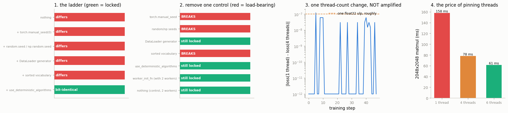

# Determinism Audit

---

> "It worked on my run" means nothing until the run is bit-exact every time.

---

## Key Insight

Bit-exact reproducibility means fixing every source of randomness: setting one [seed](/shared/glossary/#seed) for all the random-number generators and enabling [deterministic algorithms](/shared/glossary/#deterministic-algorithms), because some fast GPU [kernels](/shared/glossary/#kernel) give slightly different results each run by default.

## Why This Matters

Without determinism you cannot tell a real improvement from random noise, and you cannot reliably reproduce a bug. Documenting every flag needed to get identical outputs is what makes an experiment trustworthy.

---

**This is project 50.**

### The words first

- **Bit-exact** means the two runs produce the *same bits*, not "the same to
  five decimal places". The test is a hash of the raw bytes, not a comparison
  with a tolerance. This is deliberately the strictest possible question,
  because it is the only one with a yes/no answer that does not depend on
  a threshold somebody chose.
- **Deterministic** means: same inputs, same outputs, every time. Its opposite
  is not "random" in the dice-rolling sense. On a CPU, as section 5 shows, the
  runs are perfectly repeatable — they just repeat a *different* answer once you
  change something you did not think of as an input.
- An **audit** is what makes this a project rather than a checklist. Anyone can
  paste six lines of `seed_everything()`. An audit asks, for each line, *what
  breaks if I remove it?* — and the answer here is that **three of the seven
  recommended controls do nothing at all** on this machine.

### The method

Not "add flags until the numbers match". That way you end up with a ritual you
cannot explain and cannot shorten. Instead:

1. Run the identical script **in two fresh operating-system processes**.
2. Hash the final [parameters](/shared/glossary/#parameters) byte for byte.
3. Add controls one at a time until the hashes match — **the ladder**.
4. From the locked configuration, remove exactly one control at a time — **the
   ablation**. Only the ones whose removal breaks it were doing anything.

Two fresh processes, not two calls in one process: `PYTHONHASHSEED` is read at
interpreter startup, the thread pool is built on first use, and a seed set
halfway through a program does not undo what already happened.

### What is real here

A small MLP with an [embedding](/shared/glossary/#embedding) table, an unseeded
numpy augmentation, and a vocabulary built the sloppy way. 40-odd real child
processes. All measurements on this CPU with PyTorch 2.10.

What `run.py` finds:

- the naive script gives **two different models**, and final losses of
  **0.2723 and 0.5444** — a gap far bigger than most reported improvements
- the ladder locks after **five** controls; the sixth changes nothing
- the ablation: **3 of 7** controls are load-bearing. The [DataLoader](/shared/glossary/#dataloader)
  generator, `use_deterministic_algorithms`, and `worker_init_fn` can all be
  removed with no effect
- `torch.use_deterministic_algorithms(True)` blocks **1 of 15** probed
  operations on this CPU build — it is a GPU tool
- the classic "`worker_init_fn` is required to seed numpy in workers" advice is
  **out of date**: PyTorch's worker loop seeds `random`, `torch` *and* `numpy`,
  and the source is quoted to prove it
- thread count changes the bits: 4 thread counts give **3 distinct** results for
  the same `sum()`, while 20 repeats at a *fixed* thread count give **1**
- `PYTHONHASHSEED` alone decides your embedding table if you build a vocabulary
  by iterating a `set`
- and the run that differs only in thread count converges to the **same loss to
  8 decimal places** while its weights stay permanently different

---

## Files

| file | what it is |
|---|---|
| `run.py` | the orchestrator: all nine sections |
| `train_once.py` | one training run, one JSON line of fingerprints; every control is a switch |
| [`../48-nan-forensics/debug_lib.py`](../48-nan-forensics/debug_lib.py) | `fingerprint`, `state_fingerprint`, `interleaved` |
| `outputs/findings.csv` | every number quoted here |
| `outputs/recipe.py` | the recipe the audit arrived at, ready to copy |
| `outputs/determinism.png` | the four figures |

```bash
python3 run.py       # ~5 minutes; it launches around 40 short child processes
```



---

## 1. The baseline

The script has no seeding at all. Run it twice:

| | run A | run B |
|---|---|---|
| parameter fingerprint | `4d5f0de0852f60b5` | `5a22a3d52220f900` |
| final loss | **0.272279** | **0.544352** |

The two losses differ by **0.272**. That is not a rounding artefact you can
wave away — it is *twice* the better number, and it is larger than almost any
improvement anyone reports in a paper. If you changed something between those
two runs, you would have concluded that your change worked, or that it broke
everything, depending on which order you ran them in.

---

## 2. The ladder

Each row adds one control to the row above and runs the whole thing twice again:

| control added | result |
|---|---|
| nothing | differs |
| `+ torch.manual_seed(0)` | differs |
| `+ random.seed(0)` / `np.random.seed(0)` | differs |
| `+ DataLoader(generator=...)` | differs |
| `+ sorted(vocabulary)` | **bit-identical** `e0dc394dfb4b8be8` |
| `+ torch.use_deterministic_algorithms(True)` | bit-identical (unchanged) |

Three things are worth noticing.

**One seed is not enough.** `torch.manual_seed` does not touch `numpy` or
Python's `random`. Three libraries, three generators, three seeds. The
augmentation in this dataset uses `np.random.randn`, so seeding torch alone
leaves the data different every run.

**The last thing to fall is not a PyTorch setting at all.** It is
`sorted(...)` around a set. Section 6.

**The flag everyone recommends changes nothing.** The run was already locked
before `use_deterministic_algorithms` was added. That is not an argument for
leaving it out — see section 4 — but it is an argument for measuring instead of
assuming.

---

## 3. The ablation

Now go the other way. Start from the locked configuration and remove exactly one
control:

| remove | result |
|---|---|
| `torch.manual_seed` | **breaks** |
| `random.seed` / `np.random.seed` | **breaks** |
| `sorted(vocabulary)` | **breaks** |
| `DataLoader(generator=...)` | still locked |
| `use_deterministic_algorithms` | still locked |
| `worker_init_fn` (with 2 workers) | still locked |
| nothing (control, 2 workers) | still locked |

**3 load-bearing, 4 inert.** Two of the inert ones deserve an explanation,
because both are standard advice.

### Why the DataLoader generator was not needed

`DataLoader(shuffle=True)` without an explicit `generator=` draws its shuffling
order from the *global* torch generator — which `torch.manual_seed(0)` has
already fixed. So in this script it is redundant.

It stops being redundant the moment anything else consumes the global generator
between epochs: a dropout layer, a random augmentation, a model rebuilt
mid-script. Then the loader's position in the global stream depends on how many
numbers everything else drew, and a change anywhere reshuffles your data.
**Passing an explicit generator is cheap insurance against a coupling you cannot
see in the code**, which is a different justification than the one usually
given, and a better one.

### Why `worker_init_fn` was not needed — a correction

Every tutorial says: PyTorch seeds each worker's *torch* generator, but leaves
`numpy` alone, so you must pass a `worker_init_fn` that seeds numpy yourself.

Measured here with 2 workers and no `worker_init_fn`:

| | |
|---|---|
| two fresh processes, same fingerprint? | **True** |

And in this PyTorch's own source, `torch/utils/data/_utils/worker.py`:

```python
seed = base_seed + worker_id
random.seed(seed)
torch.manual_seed(seed)
if HAS_NUMPY:
    np_seed = _generate_state(base_seed, worker_id)
    np.random.seed(np_seed)
```

All three are seeded, per worker, derived from the base seed. `run.py` checks
for each of those three lines in the installed source and reports `True` for all
three.

So the advice is **out of date for `random`, `numpy` and `torch`** — and still
correct for anything else that keeps global random state: OpenCV, a C extension,
`imgaug`, your own module-level `Random()` object. Pass `worker_init_fn` for
*those*, not for numpy.

---

## 4. Auditing `use_deterministic_algorithms` on CPU

`torch.use_deterministic_algorithms(True)` tells PyTorch to refuse to run any
[kernel](/shared/glossary/#kernel) that has no reproducible implementation,
instead of silently running a fast one. It is the most-recommended line in every
reproducibility guide. Here is what it actually blocks, out of 15 operations
that are documented as risky:

| | |
|---|---|
| operations probed | 15 |
| blocked on this CPU build | **1** — `put_` |

`index_add_`, `scatter_add_`, `index_put_(accumulate=True)`, `bincount`,
`grid_sample` backward, `max_pool3d` backward, bilinear `interpolate` backward,
`embedding_bag` backward and the rest all run without complaint.

**This is not a flaw.** The flag exists because of a GPU problem: thousands of
threads doing `atomicAdd` into the same memory finish in whatever order the
hardware schedules them, and floating-point addition is not associative — `(a+b)+c`
is not always `a+(b+c)` — so the sum genuinely changes run to run. On CPU
those operations are implemented with a fixed traversal order, so there is
nothing to block.

The practical reading: **on CPU this flag is nearly free and nearly pointless;
keep it because it costs nothing and pays off the day the same code runs on a
GPU.** And do not let it make you feel finished — it caught none of the three
things that were actually breaking reproducibility here.

---

## 5. Thread count is part of your seed

The same `sum()` over 4 million numbers, at four thread counts:

| threads | value | fingerprint |
|---|---|---|
| 1 | `-1431.026611328125` | `46ba8a3c1a74751f` |
| 2 | `-1431.0263671875` | `db5522d0d4a7cd61` |
| 4 | `-1431.026123046875` | `d14fd4f1e94769b3` |
| 6 | `-1431.026123046875` | `d14fd4f1e94769b3` |

| | |
|---|---|
| distinct results across the 4 thread counts | **3** |
| distinct results over **20 repeats** at a fixed thread count | **1** |

Read those two rows together, because they are the point of the section:

**CPU non-determinism is not randomness. It is a configuration you forgot to
record.** Running the same reduction twenty times in a row gives one answer,
every time. Change the thread count and you get a different one, every time.
A parallel sum splits the array into one chunk per thread and adds the chunk
totals at the end, so the number of chunks decides the order of additions, and
the order decides the last bit.

The full training run confirms it:

| | |
|---|---|
| 1 thread vs 4 threads: same fingerprint? | **False** |
| final loss, 1 thread / 4 threads | `0.21361661` / `0.21361661` |

Same loss to eight decimals. Different model.

This is why `torch.set_num_threads()` belongs in your determinism recipe next to
the seeds, and why the thread count belongs in your checkpoint metadata. A run
reproduced on a machine with a different core count is not the same run.

---

## 6. `PYTHONHASHSEED`: randomness that is not in your code

```python
words = {f"cat{i}" for i in range(16)}     # a set: no order
vocab = {w: i for i, w in enumerate(words)}
```

That is an ordinary way to build a token-to-index mapping, and it is
irreproducible. A Python `set` has no defined order; its iteration order comes
from the hash of each element. Since Python 3.3, **the hash of a string is
randomised per process** — a security measure against attacks that deliberately
collide dictionary keys — unless you set `PYTHONHASHSEED`.

So `"cat7"` gets index 3 in one process and index 11 in the next, and the model
reads a different row of the embedding table for the same word.

| configuration | two runs match? |
|---|---|
| vocab from a `set`, `PYTHONHASHSEED=random` | **False** |
| vocab from a `set`, `PYTHONHASHSEED=0` | **True** |
| vocab from `sorted(set)`, `PYTHONHASHSEED=random` | **True** |

Both fixes work. **Prefer `sorted()`**: it lives in the code, travels with it,
and cannot be forgotten by whoever launches the job. `PYTHONHASHSEED` must be
set *before* the interpreter starts, so it cannot be set from inside your own
`main()` — it has to be in the launcher, the Dockerfile, the Slurm script, and
every one of your colleagues' shells.

The same trap applies to iterating any unordered dict of strings, to
`set(labels)`, and to `glob()` results (which come back in filesystem order).
Sort anything whose order will become a number.

---

## 7. How big does one changed bit get?

Two runs identical except `torch.set_num_threads(1)` vs `(4)`:

| | |
|---|---|
| first step at which the losses differ at all | **5** |
| difference at that step | **1.192e-07** |
| largest difference over the whole run | **1.192e-07** (at step 5) |
| difference at the last step | **0.000e+00** |
| final losses, 8 decimals | `0.21361661` vs `0.21361661` |
| sum of all parameters | `210.65407149924613` vs `210.65406657983476` |
| fingerprints match? | **False** |

This is the honest, slightly deflating result, and it is more useful than the
dramatic one. The difference appears at one unit in the last place of a float32
and **does not grow** — [AdamW](/shared/glossary/#adamw) normalises each update
by the size of recent gradients, which damps small perturbations rather than
amplifying them, and the task is easy enough that both runs land in the same
place.

But the weights are still permanently different in the 8th significant digit,
so the fingerprints never match again.

**"Same answer" and "same bits" are different tests, and the gap between them is
where arguments happen.** If your acceptance criterion is the loss to 4 decimal
places, this run is reproducible. If it is a hash, it is not. Decide which one
you mean before you start, because chasing bit-exactness across machines is a
much larger project than chasing a stable metric.

(The other direction is real too, and this project does not show it: a model
near a decision boundary, a reinforcement-learning loop, or a long
[autoregressive](/shared/glossary/#autoregressive-model) generation can turn 1e-7 into
a completely different output — see [project 52](../52-eager-vs-compile-diff/README.md) section 4, where a
difference of this exact size flips classifications.)

---

## 8. What determinism costs

| | best of interleaved rounds | vs 6 threads |
|---|---|---|
| 2048×2048 matmul, 1 thread | **157.8 ms** | **2.58×** |
| 2048×2048 matmul, 4 threads | 77.9 ms | 1.27× |
| 2048×2048 matmul, 6 threads | **61.2 ms** | 1.00× |

| | |
|---|---|
| `index_add_`, deterministic flag off | 75.3 µs |
| ...on | **76.7 µs** |

The flag everyone worries about costs **1.9%** on this operation — which is
itself inside this shared machine's run-to-run spread, so read it as "no
measurable difference". Pinning yourself to a single thread, which you do **not**
need to do (you only need to *record* the number), would cost **2.58×**.

So the cost of determinism, correctly done, is close to zero. The expensive
mistake is over-reacting to it and serialising your training run.

---

## 9. The recipe

`run.py` writes [`outputs/recipe.py`](outputs/recipe.py). The short version:

```python
def set_determinism(seed=0, threads=None):
    random.seed(seed)
    np.random.seed(seed)
    torch.manual_seed(seed)                  # also seeds CUDA if present
    torch.use_deterministic_algorithms(True, warn_only=True)
    torch.backends.cudnn.benchmark = False   # stop cuDNN re-picking algorithms
    if threads is not None:
        torch.set_num_threads(threads)
```

plus two rules no function can enforce:

- never derive anything order-dependent from a `set` or an unordered dict —
  `sorted()` it;
- record the torch version, the thread count and the device alongside the
  checkpoint.

Verified:

| | |
|---|---|
| full recipe, two fresh processes | **bit-identical** (`e0dc394dfb4b8be8`) |
| full recipe with 2 DataLoader workers | **bit-identical** |
| same recipe, 6 epochs instead of 3 | different fingerprint (of course) |

> **`warn_only=True`, and why.** With `warn_only=False`, hitting a
> non-deterministic operation raises and your job dies. With `warn_only=True` it
> prints a warning and continues. For an audit you want the exception; for a
> long training run you usually want the warning, because a job that dies at
> hour six over one `put_` call has cost you more than the missing determinism
> would have.

---

## What to remember

1. **Two fresh processes, and hash the bytes.** Anything less is not a
   reproducibility test.
2. **Ladder up, then ablate down.** The ladder tells you what is sufficient; only
   the ablation tells you what is *necessary*. Here 4 of 7 controls were inert.
3. **One seed is three seeds.** `torch`, `numpy`, `random`.
4. **`use_deterministic_algorithms` blocked 1 of 15 ops on this CPU.** Keep it;
   do not believe it has finished the job.
5. **Thread count is an input.** 3 distinct answers across 4 thread counts;
   1 answer across 20 repeats at a fixed count.
6. **Sort your sets.** `PYTHONHASHSEED` is real, and `sorted()` is the fix that
   travels with the code.
7. **`worker_init_fn` no longer needs to seed numpy** — check your own version's
   `worker.py` rather than repeating advice.
8. **Decide whether you need the same bits or the same answer.** They are
   different projects.

---

## Try it yourself

- Add a `nn.Dropout` to the model and re-run the ablation. Does the DataLoader
  generator become load-bearing? (It should — dropout draws from the same global
  generator the shuffler does.)
- Run `train_once.py` under `OMP_NUM_THREADS=2` *without* calling
  `torch.set_num_threads`. Which one wins?
- Replace AdamW with plain SGD at a high learning rate and re-measure section 7.
  Does the 1e-7 stay bounded, or does the run diverge?
- Copy the fingerprint from this machine and compare it against a run on any
  other computer you have. That number is where "reproducible" usually ends.

---

**Next:** [project 51](../51-hang-diagnosis/README.md) leaves the world of wrong
numbers for the world of no numbers at all — a process that has stopped printing,
and the five questions that tell you why.
