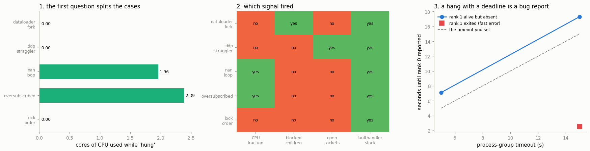

# Hang Diagnosis

---

> A frozen distributed job is almost always one rank waiting on a call the others already made.

---

## Key Insight

In [DDP](/shared/glossary/#ddp), every [rank](/shared/glossary/#rank) must reach the same [collective operation](/shared/glossary/#collective-operation) in the same order; if one rank skips it or passes a different shape, the rest wait forever. Setting `NCCL_DEBUG=INFO` makes [NCCL](/shared/glossary/#nccl) print which collective each rank is stuck on.

## Why This Matters

A hang produces no error and no stack trace, so it is one of the hardest distributed bugs to face blind. Knowing it is almost always a mismatched collective — and how to ask NCCL where each rank stopped — turns an indefinite freeze into a quick fix.

---

**This is project 51.**

### How this differs from project 40

[Project 40](../40-debug-a-hang/README.md) *built* six hangs and read the error
messages PyTorch produced for each. This project starts one step later and one
step harder:

> **A process on a machine has stopped printing. You have its process ID. Go.**

You do not know whether it is distributed. You do not know whether it is even
stuck. Nothing has been logged. This is what a hang looks like at 3 a.m. on a
cluster, and it needs a *procedure*, not a list of known messages.

Also: this machine has no NVIDIA GPU that PyTorch can use, so the backend is
[gloo](/shared/glossary/#gloo) and `NCCL_DEBUG=INFO` does nothing. Section 4
covers what to use instead. The hangs are identical either way — a
[deadlock](/shared/glossary/#deadlock) is a property of who is waiting for whom,
not of the library doing the waiting.

### The procedure

Five questions, cheapest first. The first one is the important one, because its
answer splits the world in half and the two halves share no tools at all:

| # | question | how |
|---|---|---|
| 1 | Is it burning CPU, or asleep? | `/proc/<pid>/stat` |
| 2 | If asleep, waiting on what? | `/proc/<pid>/wchan` |
| 3 | Does it have children, and are they stuck too? | `/proc/<pid>/task/*/children` |
| 4 | Is it talking to anybody? | sockets in `/proc/<pid>/fd` |
| 5 | What is every thread executing *right now*? | `kill -USR1` → `faulthandler` |

A process at **0% CPU** is *waiting* — for a lock, a socket, a pipe, a child —
and the job is to find out what for. A process at **100% CPU** is *running* and
simply never finishing, and the job is to find the loop. Reaching for a stack
dump before you know which of those you have is how people spend an hour reading
a perfectly healthy traceback.

### What is real here

Five real hangs in real child processes, diagnosed from outside with real
`/proc` reads and real signals. Nothing is simulated.

What `run.py` finds:

- the five cases look identical from the outside and split cleanly on question 1:
  **0.0, 0.0, 1.96, 2.39 and 0.0 cores**
- a job that is **not hung at all** — just 4× oversubscribed — is the one that
  most looks hung, and only a heartbeat separates it from a real infinite loop
- `gdb -p` **cannot attach** here: `ptrace_scope` is **1**, so the tool everyone
  reaches for first is unavailable, and so is `py-spy`
- what still works is `faulthandler.register(signal.SIGUSR1)` — **2 lines at
  startup**, no runtime cost, and it names the exact line every thread is on
  *without killing the process*
- ...and if you did not register it, the information **does not exist**: asking a
  running process for a stack returns nothing
- a rank that is **alive and absent** is noticed after exactly your timeout
  (5 s → 5.0 s, 15 s → 15.0 s); a rank that **exited** is noticed in **0.2 s**
  regardless — two different failures with two different signatures

---

## Files

| file | what it is |
|---|---|
| `run.py` | the orchestrator: launches each hang, triages it, kills it |
| `victim.py` | the five hangs, one function each |
| `triage.py` | the diagnostic tool — run it standalone: `python3 triage.py <pid> [stack_file]` |
| `timeout_demo.py` | section 7's two-rank job |
| `outputs/findings.csv` | every number quoted here |
| `outputs/triage_reports.json` | the full report for each case |
| `outputs/stacks.txt` | the faulthandler dumps, verbatim |
| `outputs/register_me.py` | the two lines to paste into your own jobs |
| `outputs/hang_diagnosis.png` | the three figures |

```bash
python3 run.py                    # ~4 minutes; it deliberately waits on real hangs
python3 triage.py 12345 /tmp/stacks-12345.log     # on any stuck process of your own
```



---

## 1. Five things that look identical from the outside

| case | what is actually wrong |
|---|---|
| `dataloader_fork` | DataLoader workers deadlock on a lock inherited through `fork` |
| `ddp_straggler` | rank 1 is alive but never arrives; rank 0 waits at `all_reduce` |
| `nan_loop` | `while not (loss < tol)` where `loss` is NaN |
| `oversubscribed` | 4 processes × 12 threads on 12 cores — slow, **not** stuck |
| `lock_order` | two threads take two locks in opposite orders |

From a terminal, all five are the same thing: a process that was printing and
now is not.

---

## 2. Question 1: is it burning CPU?

```python
def cpu_fraction(pid, window=2.0):
    a = read_stat(pid); time.sleep(window); b = read_stat(pid)
    ticks = (b["utime"] + b["stime"]) - (a["utime"] + a["stime"])
    return ticks / os.sysconf("SC_CLK_TCK") / window
```

`utime` and `stime` in `/proc/<pid>/stat` are the total CPU time the process has
used, in scheduler ticks, since it started. Take two readings two seconds apart
and divide: **0.0 means it did nothing; 1.0 means it kept one core busy; 4.0
means four.**

| case | state | CPU cores | threads | children | sockets | `wchan` |
|---|---|---|---|---|---|---|
| `dataloader_fork` | S | **0.0** | 4 | **2** | 0 | `poll_schedule_timeout` |
| `ddp_straggler` | S | **0.0** | 16 | 0 | **6** | `futex_do_wait` |
| `nan_loop` | R | **1.96** | 14 | 0 | 0 | — |
| `oversubscribed` | R | **2.39** | 34 | 0 | 0 | — |
| `lock_order` | S | **0.0** | 3 | 0 | 0 | `futex_do_wait` |

(The two CPU numbers move a little from run to run — this machine is shared, and
"burning 2 cores" rather than "burning 0" is the only precision the decision
needs.)

Three are asleep, two are running. That single column already tells you which
half of your toolbox to open.

**`state`** is the kernel's own word: `R` = runnable/running, `S` =
interruptible sleep (waiting for something, can be woken by a signal), `D` =
uninterruptible sleep (usually waiting on disk — a `D` that lasts is a storage
problem, not a Python problem), `Z` = zombie (already exited, nobody collected
the exit code).

**`wchan`** stands for *wait channel*: the name of the kernel function the
process is sleeping inside. It is free, and it is specific:

- `futex_do_wait` — a **fut**ex is a *fast userspace mutex*, the primitive Linux
  gives you to build locks on. Sleeping here means: waiting for a lock. Both
  `lock_order` and `ddp_straggler` show it, because gloo's collective also ends
  up waiting on one.
- `poll_schedule_timeout` — waiting on a file descriptor: a pipe, a socket, a
  queue. `dataloader_fork`'s main process is waiting for its workers to send it
  a batch.

---

## 3. Question 5: what is every thread doing?

The four `/proc` questions narrow it down. This one names the line.

```python
os.kill(pid, signal.SIGUSR1)      # the victim dumps and keeps running
```

| case | innermost frame in the victim's own code |
|---|---|
| `dataloader_fork` | `victim.py`, line 70, in **`holder`** |
| `ddp_straggler` | `victim.py`, line 111, in **`ddp_straggler`** |
| `nan_loop` | `victim.py`, line 136, in **`nan_loop`** |
| `oversubscribed` | `victim.py`, line 159, in **`oversubscribed`** |
| `lock_order` | `victim.py`, line 180, in **`worker`** |

Look at the first row. It does not point at the DataLoader, and it does not
point at the `for batch in dl` line. It points at **`holder`** — the background
thread that is holding the lock. `all_threads=True` dumps *every* thread, and
in a deadlock the useful thread is almost never the one you were thinking about.
The full dumps are in [`outputs/stacks.txt`](outputs/stacks.txt).

### The `fork` deadlock, since it is the one that catches everyone

`DataLoader(num_workers=2)` starts worker processes with `fork`, which makes a
copy of the parent's memory — **including the state of every lock** — but copies
**only the calling thread**. If another thread happened to be holding a lock at
that instant, the child inherits a lock that is held forever by a thread that
does not exist there. The first worker that tries to take it waits for eternity.

You will meet this through `logging`, an OpenMP thread pool, a CUDA context, an
HDF5 handle, a database connection, or OpenCV — anything with an internal lock
and a background thread. The standard fixes:

```python
torch.multiprocessing.set_start_method("spawn")   # a fresh interpreter, no
                                                  # inherited locks
DataLoader(..., num_workers=0)                    # or no forking at all
```

`spawn` starts a brand-new Python process instead of copying the current one, so
nothing is inherited. It is slower to start and requires your dataset to be
picklable — which is why `fork` is still the default on Linux, and why this bug
is still common. ([Project 36](../36-two-gpu-ddp/README.md)'s shared launcher enforces `spawn`
for exactly this reason.)

---

## 4. The tool everyone reaches for, and why it is not available

```
$ gdb -p <pid> -batch -ex "thread apply all bt"
Could not attach to process. If your uid matches the uid of the target process,
check the setting of /proc/sys/kernel/yama/ptrace_scope...
```

| | |
|---|---|
| `/proc/sys/kernel/yama/ptrace_scope` | **1** |
| `py-spy` installed here | **False** |

`ptrace` is the kernel facility that lets one process read another's memory and
registers; it is how `gdb`, `strace` and `py-spy` all work. **Yama** is a Linux
security module, and `ptrace_scope = 1` means *a process may only be traced by
its own parent*. This is the default on Ubuntu and most distributions, precisely
because "any process can read any other process's memory" is how credential
theft works.

So on this machine — and very likely on your work machine and your cluster —
`gdb -p` and `py-spy dump` **do not work from a shell**. You can get them back
with `sudo`, or by lowering the setting system-wide, and often you can do
neither.

What still works, with no privileges at all:

- **everything in `/proc`** — state, CPU time, `wchan`, children, file
  descriptors, thread count. Always readable for your own processes.
- **`faulthandler` on a signal** — *if* the process registered it before it got
  stuck.

---

## 5. The scoreboard

| case | CPU fraction | blocked children | open sockets | faulthandler stack |
|---|---|---|---|---|
| `dataloader_fork` | no | **yes** | no | yes |
| `ddp_straggler` | no | no | **yes** | yes |
| `nan_loop` | **yes** | no | no | yes |
| `oversubscribed` | **yes** | no | no | yes |
| `lock_order` | no | no | no | **yes** |

Each of the four narrowing signals fires for a different subset, and `lock_order`
— an ordinary two-thread deadlock with no children, no sockets and no CPU — is
identified by the stack dump alone.

Two readings:

**The stack dump answers every case.** If you only ever do one thing, do that.

**But the CPU fraction is the one that changes what you do next.** It is the
only signal that distinguishes *waiting* from *running*, and those need opposite
responses. On `nan_loop` and `oversubscribed`, a stack dump shows a matrix
multiply — which is completely normal and tells you nothing on its own. Combined
with "2.16 cores busy" it tells you the process is fine and something else is
wrong.

### Separating the two running cases

`nan_loop` and `oversubscribed` both burn about 2 cores. What separates them is
**progress**, and progress is not something `/proc` can tell you:

| | `nan_loop` | `oversubscribed` |
|---|---|---|
| CPU cores | 1.96 | 2.39 |
| heartbeat file changed over 2 s | **False** | **True** |

`oversubscribed` writes a counter to a file every iteration. That is the whole
trick, and it is why every long-running job should log something cheap and
monotonic — a step number, a batch index — often enough that "has it moved in
the last minute?" is a question you can answer. Without it, the only way to
separate an infinite loop from slow progress is to dump the stack twice and see
whether the line number moved.

`oversubscribed` is also worth its place for a second reason: **it is not a
bug in the code at all.** Four processes each calling
`torch.set_num_threads(12)` on a 12-core machine means 48 threads fighting for
12 cores, and the operating system spends its time swapping them on and off
instead of doing arithmetic. The fix is `OMP_NUM_THREADS`, not a debugger.
([Project 36](../36-two-gpu-ddp/README.md) measured this effect at **15.7×**.)

---

## 6. The two lines

```python
import faulthandler, os, signal
faulthandler.enable()                              # stacks on a segfault
_dump = open(f"/tmp/stacks-{os.getpid()}.log", "w")
faulthandler.register(signal.SIGUSR1, file=_dump, all_threads=True)
```

Then, from any shell: `kill -USR1 <pid>`, and read the file. The process **keeps
running** — you can do this to a production job, twice, and compare.

| | |
|---|---|
| cost of registering at startup | 2 lines, no measurable runtime cost |
| asking a process that did **not** register | `(no stack file — was faulthandler registered?)` |

That second row is the point of the section. This is not information you can go
and get later. Either the handler was installed before the hang, or the
information does not exist — and with `ptrace_scope = 1`, `gdb` cannot recover
it for you.

`run.py` writes [`outputs/register_me.py`](outputs/register_me.py) ready to
paste.

> **Why `SIGUSR1`?** Linux reserves two signals, `SIGUSR1` and `SIGUSR2`, with no
> predefined meaning, exactly so applications can define their own. Using, say,
> `SIGTERM` would work and would also mean your debugging tool is the same
> keystroke as "shut down".

---

## 7. What a timeout buys you, and the two distributed failures

`init_process_group(..., timeout=...)` puts a deadline on every collective.

| rank 1's behaviour | timeout set | rank 0 reported after |
|---|---|---|
| alive but absent | 5 s | **5.0 s** (7.1 s including startup) |
| alive but absent | 15 s | **15.0 s** (17.3 s including startup) |
| **exited** | 15 s | **0.2 s** (2.5 s including startup) |

```
TIMEOUT after 15.0s: RuntimeError: [gloo/transport/tcp/unbound_buffer.cc:78]
    Timed out waiting 15000ms for recv operation to complete
TIMEOUT after 0.1s: RuntimeError: [gloo/transport/tcp/pair.cc:547]
    Connection closed by peer
```

Two failures that people describe with the same word, and they behave nothing
alike:

- **A rank that exits** closes its TCP sockets, the kernel tells the peer
  immediately, and you get `Connection closed by peer` in **0.2 s** no matter
  what timeout you set. Unpleasant, and *not a hang*. Note also how
  misleading the message is: it sounds like a network fault, and the actual
  cause is a Python exception on another machine.
- **A rank that is alive and simply not participating** — stuck on its own slow
  data loading, waiting on a lock, in an infinite loop — produces **no signal at
  all** until the deadline fires. This is the real hang, and the timeout is the
  only thing that ends it.

PyTorch's defaults are **30 minutes** for gloo and **10 minutes** for NCCL.
Those are reasonable production values (a slow checkpoint write should not kill
a job) and terrible development ones. Lower it while you are debugging:

```python
dist.init_process_group("gloo", timeout=datetime.timedelta(seconds=120))
```

A hang with a deadline is a bug report. A hang without one is a blank screen.

### The gloo equivalents of the NCCL variables

| what the guide says | what to use here |
|---|---|
| `NCCL_DEBUG=INFO` | `GLOO_SOCKET_IFNAME` for interface selection; gloo has no equivalent verbose trace |
| `TORCH_NCCL_BLOCKING_WAIT=1` | gloo is already blocking; set `timeout=` on the process group |
| NCCL flight recorder (`TORCH_NCCL_TRACE_BUFFER_SIZE`) | not available — use `dist.monitored_barrier()`, which names the guilty rank ([project 40](../40-debug-a-hang/README.md) section 3) |
| — | `TORCH_DISTRIBUTED_DEBUG=DETAIL`, which works on both and adds shape/order consistency checks to every collective |

---

## What to remember

1. **Measure CPU before you read anything else.** Asleep and spinning need
   opposite tools, and the number takes two seconds to get.
2. **`gdb -p` probably will not attach.** `ptrace_scope = 1` is the default.
   Plan for `/proc` and `faulthandler` instead.
3. **Register `faulthandler` on `SIGUSR1` at startup, in every long job.** Two
   lines. If you skip them, the stack does not exist later.
4. **Dump *all* threads.** In `dataloader_fork` the useful frame belonged to a
   background thread nobody was thinking about.
5. **Log a heartbeat.** It is the only cheap way to tell an infinite loop from
   slow progress.
6. **Not every hang is your model.** One of these five was a healthy job with
   too many threads.
7. **Put a `timeout=` on your process group in development.** A rank that
   *exited* announces itself in 3 s; a rank that is *alive and absent* announces
   itself never.

---

## Try it yourself

- Start a victim yourself and point the tool at it:
  ```bash
  python3 victim.py lock_order /tmp/s.log &
  python3 triage.py $! /tmp/s.log
  ```
- Send `SIGUSR1` twice, ten seconds apart, to the `nan_loop` victim and diff the
  two dumps. Same line both times = an infinite loop. A moving line = slow
  progress. This is the whole of "poor man's profiling".
- Change `dataloader_fork` to use `multiprocessing.set_start_method("spawn")`
  and confirm the hang disappears — then time the startup and see what `spawn`
  costs you.
- Run the `ddp_straggler` case with `TORCH_DISTRIBUTED_DEBUG=DETAIL` and see
  what extra checking it adds.

---

**Next:** [project 52](../52-eager-vs-compile-diff/README.md) closes the phase
with the most slippery bug of all — one where nothing crashes, nothing hangs,
and two runs of the same model simply return different numbers.
