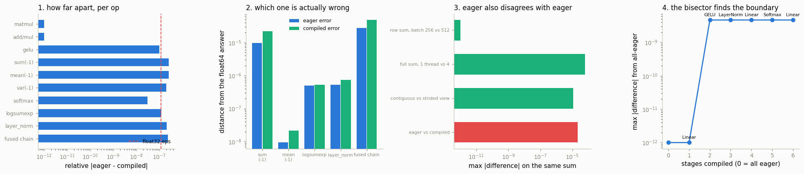

# Eager vs Compile Diff

---

> Same model, same input, two different answers — corner the one op that disagrees.

---

## Key Insight

[`torch.compile`](/shared/glossary/#torchcompile) fuses and reorders operations, which can change floating-point rounding compared to [eager mode](/shared/glossary/#eager-mode), so the two outputs may not match exactly. Bisecting the model layer by layer narrows the gap down to the single operation where they first diverge.

## Why This Matters

Most eager-vs-compiled differences are harmless rounding, but some signal a real compiler bug that quietly corrupts results. Isolating the exact op that differs is the only way to tell which case you are in and report it.

---

**This is project 52.**

### The words first

- **Eager mode** means PyTorch runs each operation the moment you write it, one
  at a time, like an ordinary Python program. The name is the standard
  computer-science opposite of *lazy*: an eager evaluator does the work now, a
  lazy one waits to see what you will ask for. `torch.compile` is the lazy one —
  it collects your operations first, then decides how to run them.
- **Fusion** is what it does with them. Instead of "compute `sigmoid(x)` into a
  new tensor, then multiply, then sum", the compiler writes **one loop** that
  does all three per element. Fewer trips to memory, so it is faster — and the
  arithmetic happens in a different order, so the last bit can change.
- **ULP** — *unit in the last place* — is the distance between one representable
  float and the next one along. It is the smallest possible disagreement between
  two computations of the same quantity. Saying "they differ by one ulp" is
  saying "they differ by the least it is possible to differ by".

### The question this project is really about

"Eager and compiled give different answers" is not, by itself, a finding. Every
correct implementation of a floating-point reduction gives a slightly different
answer, because floating-point addition is **not associative**: `(a+b)+c` and
`a+(b+c)` genuinely differ. So the useful question is not *do they differ* but:

> **Is this difference rounding, or is it a bug?**

This project builds the three measurements that answer it, and finds that the
most reassuring one is also the most surprising:

> **On this machine, `torch.compile` disagrees with eager LESS than eager
> disagrees with itself.** 2.10e-05 for compiled-vs-eager, against 6.10e-05 for
> the same eager `sum()` at one thread versus four. A ratio of **0.34×**.

If you are prepared to accept the second number without comment — and everyone
is, because nobody thinks of the thread count as changing their model — you have
no principled reason to be alarmed by the first.

### What is real here

Real `torch.compile` with the [Inductor](/shared/glossary/#torchinductor)
backend generating real C++ on this CPU. The generated kernel in section 7 is
the actual code that ran.

What `run.py` finds:

- **2 of 10** operations are bit-identical; the rest differ by at most
  **2.61e-07 relative**, against a float32 machine epsilon of **1.19e-07** —
  roughly one ulp
- against a float64 referee, **eager is closer to the truth in 5 of 5 cases** —
  compiled is slightly *less* accurate, and this is still not a bug
- the control: PyTorch's own largest self-disagreement is **6.10e-05**, nearly
  **3× larger** than the compiler's **2.10e-05**
- a difference of 1.5e-05 flips **0 of 4096** classifications on a normal
  classifier and **412 of 4096 (10.06%)** once the top-2 margin shrinks to
  7.6e-06 — the same rounding, two completely different consequences
- the bisector localises a whole 6-stage model to **one stage** (the GELU) with
  6 compiles
- and one difference that is **not** rounding at all: `dropout` differs by
  **9.32** on **50.21%** of elements — because the compiler draws its own random
  numbers. One flag, `fallback_random=True`, takes it to exactly **0.0000**

---

## Files

| file | what it is |
|---|---|
| `run.py` | all eight sections |
| [`../48-nan-forensics/debug_lib.py`](../48-nan-forensics/debug_lib.py) | findings CSV and interleaved timing |
| `outputs/findings.csv` | every number quoted here |
| `outputs/generated_kernel.txt` | the C++ Inductor wrote for `x.sum(-1)`, verbatim |
| `outputs/eager_vs_compile.png` | the four figures |

```bash
python3 run.py       # ~6 minutes; most of it is the compiler, not the maths
```



---

## 1. The survey

| operation | max &#124;eager − compiled&#124; | relative |
|---|---|---|
| `matmul` | **0.000e+00** | 0 |
| `x * 2 + 1` | **0.000e+00** | 0 |
| `softmax` | 1.863e-09 | 3.17e-08 |
| `mean(-1)` | 2.049e-08 | 2.61e-07 |
| `var(-1)` | 2.384e-07 | 2.05e-07 |
| `gelu` | 4.768e-07 | 1.02e-07 |
| `logsumexp` | 9.537e-07 | 1.26e-07 |
| `layer_norm` | 9.537e-07 | 2.10e-07 |
| `sum(-1)` | 2.098e-05 | 2.61e-07 |
| `(sigmoid(x) * x).sum(-1)` | 6.104e-05 | 2.37e-07 |

| | |
|---|---|
| bit-identical operations | **2 of 10** (`matmul`, `x*2+1`) |
| largest **relative** disagreement | **2.61e-07** |
| float32 machine epsilon, 2⁻²³ | **1.19e-07** |

**Read the relative column, not the absolute one.** `sum(-1)` differs by
2.098e-05, which looks a thousand times worse than `softmax`'s 1.863e-09 — but
the sums are around 80 and the softmax values are around 0.06. Divide by the
scale and they are both about one ulp. An absolute error is meaningless without
the size of the thing it is an error in.

The two that are exactly equal are exactly the two you would predict:

- **`matmul`** — Inductor does not generate its own matrix multiply. It calls
  the same optimised library kernel eager does, so it is the same instructions
  on the same data.
- **`x * 2 + 1`** — element-wise, no reduction, no summation order to change.
  Every element is one multiply and one add, in the only possible order.

Everything that disagrees involves **adding up many numbers**, which is where the
order matters.

---

## 2. The float64 referee

"They differ" does not say who is *wrong*. So compute the same thing in
[float64](/shared/glossary/#float64) — about 15 correct decimal digits instead of
7 — and treat that as the truth.

| operation | eager's error | compiled's error | closer to the truth |
|---|---|---|---|
| `sum(-1)` | **9.554e-06** | 2.169e-05 | eager |
| `mean(-1)` | **9.331e-09** | 2.118e-08 | eager |
| `logsumexp` | **4.938e-07** | 5.294e-07 | eager |
| `layer_norm` | **5.284e-07** | 7.409e-07 | eager |
| `(sigmoid(x)*x).sum(-1)` | **2.766e-05** | 4.798e-05 | eager |

| | |
|---|---|
| cases where the compiled answer is closer | **0 of 5** |

Eager wins every time, by up to 2.3×. Section 7 shows why: eager's CPU reduction
uses a deeper accumulation tree, which loses less precision than Inductor's
8-wide vector accumulator followed by one horizontal add.

**And this is still not a bug.** Both answers are within one ulp of the truth;
one is consistently on the slightly better side of it. Losing 2× of the last bit
in exchange for a fused kernel is the trade `torch.compile` exists to make.

What matters is that this test *would* catch a bug. If the compiled answer were
wrong by 1e-2 while eager was right to 1e-7, this table would say so
immediately, in a way that "the two differ by 1e-2" never can — because a
difference of 1e-2 is also what you would see if *eager* were the broken one.

> **"Isn't the float64 run just a third implementation with its own rounding?"**
> It is — but its rounding is about **10⁸ times smaller** than float32's, so on
> this scale it is the truth. It is exactly like checking a shop's arithmetic
> with a calculator: the calculator also rounds, just far below the precision of
> the dispute.

---

## 3. The control: eager disagreeing with eager

| the same `sum`, computed two ways | max &#124;difference&#124; |
|---|---|
| row sum, batch 256 vs batch 512 | 0.000e+00 |
| **full-tensor sum, 1 thread vs 4 threads** | **6.104e-05** |
| contiguous copy vs strided [view](/shared/glossary/#view) | 1.144e-05 |
| **eager vs compiled** | **2.098e-05** |

| | |
|---|---|
| PyTorch's largest disagreement with itself | **6.104e-05** |
| `torch.compile`'s disagreement with eager | **2.098e-05** |
| ratio | **0.34×** |

Nobody files a bug when their thread count changes the last bit. Most people do
not know it does. But it is **three times larger** than the effect they are
prepared to be alarmed by when the word "compile" is attached to it.

Two details worth understanding, because they are the same mechanism seen twice:

- The **row-wise** sum is unaffected by thread count (0.000e+00) because each of
  the 256 rows is summed by a single thread from start to finish — the work is
  split *between* rows, so the order *within* a row never changes. The
  **full-tensor** sum has to be split down the middle of the data, so the number
  of pieces changes the order and the order changes the last bit.
- The **strided view** differs from its own contiguous copy because a
  non-contiguous tensor takes a different kernel — one that walks with a
  [stride](/shared/glossary/#stride) rather than reading a solid block, and that
  kernel vectorises differently. Same numbers, same operation, different code
  path.

**Always run this control before reporting a compiler bug.** If the compiler's
difference is inside the range PyTorch already spans on its own, you have found
floating-point arithmetic, not a defect.

---

## 4. When a rounding difference decides the answer

Section 3 could be read as "so it never matters". It matters exactly when
something downstream **compares, rounds, sorts, or branches** — and only when the
things being compared are closer together than the difference.

Sixteen output classes whose weight vectors are `spread` apart. As `spread`
shrinks, the classes become near-copies and the top two scores converge:

| class spread | max &#124;eager − compiled&#124; | median top-2 margin | argmax flips |
|---|---|---|---|
| 1.0 | 2.29e-05 | 7.75e+00 | **0 of 4096** (0.00%) |
| 1e-2 | 1.53e-05 | 7.75e-02 | **0 of 4096** (0.00%) |
| 1e-4 | 1.53e-05 | 7.72e-04 | **3 of 4096** (0.07%) |
| 1e-6 | 1.53e-05 | 7.63e-06 | **412 of 4096** (10.06%) |

The rounding difference is the same size in all four rows. What changes is the
**margin** — how far ahead the winning class is. When the margin is a million
times the rounding difference, nothing happens. When the margin *is* the
rounding difference, **one prediction in ten changes**.

This is the whole rule, and it tells you where to look in your own system:
anywhere a near-tie gets resolved. Top-k retrieval over near-duplicate
documents. `argmax` on a confident-looking distribution over synonyms. A
threshold at exactly the decision boundary. Beam search, where the beam contents
determine everything that follows.

And it tells you the fix, which is not "make the arithmetic exact" — you cannot.
It is: **do not build a system whose output depends on ties being broken a
particular way.** If 10% of your answers change when the last bit changes, your
answers were never determined by the model.

---

## 5. The bisector

You have a whole model that disagrees. Which layer started it?

The instinct is to compare op by op. **You cannot**, and the reason is the point
of the section: the compiler *fused* your ops, so the intermediate tensor you
want to compare **does not exist** inside the generated kernel. There is nothing
at that point in memory to read.

What does exist is any boundary you kept. So compile **prefixes** of the model —
the first stage, the first two, the first three — always running the rest eager,
and compare each against the fully-eager result:

| stages compiled | max difference from all-eager |
|---|---|
| 0 (all eager) | 0.000e+00 |
| 1 — `Linear` | **0.000e+00** |
| 2 — `+ GELU` | **4.657e-09** |
| 3 — `+ LayerNorm` | 4.657e-09 |
| 4 — `+ Linear` | 4.657e-09 |
| 5 — `+ Softmax` | 4.657e-09 |
| 6 — `+ Linear` | 4.657e-09 |

One jump, at one place: **adding the GELU is what introduced the difference**,
and nothing after it adds any more. Six compiles, and the search space went from
a whole model to one layer. The flat tail is the correct reading, not a failure
— the later stages are simply passing an already-perturbed value along without
making it worse.

That the `Linear` alone contributes exactly **0** matches section 1: Inductor
hands matrix multiplies to the same library eager uses.

In a real model with 200 layers you would bisect instead of scanning — compile
the first half, then a quarter, then an eighth — which finds the boundary in
about 8 compiles instead of 200. The scan is shown here because with 6 stages it
also draws a readable graph.

---

## 6. A difference that is not rounding

```python
def with_dropout(t):
    return F.dropout(t, p=0.5, training=True)
```

| | |
|---|---|
| max &#124;eager − compiled&#124; | **9.3165** |
| fraction of elements that differ | **50.21%** |
| for comparison, the largest rounding difference in section 1 | 6.104e-05 |
| zeros in the eager output / compiled output | 0.499 / 0.500 |

This is **five orders of magnitude** past anything in section 1, and half the
tensor is affected. That size is itself the diagnosis: rounding differences are
at the last bit, so anything vastly bigger is a different *computation*, not a
differently-rounded one.

And yet nothing is wrong. Both outputs are correct
[dropout](/shared/glossary/#dropout) — both zero out very close to 50% of the
elements. They simply **drew different random masks**, because Inductor
generates its own random-number kernels rather than calling PyTorch's, and the
two consume the [seed](/shared/glossary/#seed) differently.

```python
torch._inductor.config.fallback_random = True
```

| | |
|---|---|
| with `fallback_random = True` | max difference **0.0000** |

The flag makes the compiled code call the *same* RNG kernels eager does. Use it
when you are comparing against an eager baseline and need the masks to line up.
Do not leave it on: it costs speed and buys no correctness, since a different
random mask is not a wrong random mask.

Other differences in this category — big, not rounding, and usually not bugs:
dtype promotion changing where a cast happens, a fused epsilon inside a
normalisation, and non-deterministic reductions on a GPU.

---

## 7. What actually changed: reading the generated kernel

`torch.compile` for `x.sum(-1)` on this CPU produces **4170 characters** of C++,
saved verbatim in
[`outputs/generated_kernel.txt`](outputs/generated_kernel.txt). The part that
answers the question:

```cpp
#pragma omp parallel num_threads(4)
    #pragma omp for
    for (int64_t x0 = 0; x0 < 256L; x0 += 1L) {          // one row per thread
        float tmp_acc0 = 0;
        at::vec::Vectorized<float> tmp_acc0_vec = at::vec::Vectorized<float>(0);
        for (int64_t x1 = 0; x1 < 1024L; x1 += 8L) {     // eight at a time
            auto tmp0 = at::vec::Vectorized<float>::loadu(in_ptr0 + x1 + 1024L*x0, 8);
            tmp_acc0_vec = tmp_acc0_vec + tmp0;
        }
        tmp_acc0 = tmp_acc0 + at::vec::vec_reduce_all<float, 1>(
            [](auto& x, auto& y) { return x + y; }, tmp_acc0_vec);
        out_ptr0[x0] = tmp_acc0;
    }
```

There is the whole explanation, in four lines. The inner loop steps by **8**,
not 1, because AVX registers hold 8 float32s — so the 1024 numbers are added as
**8 independent running totals**, and only at the end are those 8 collapsed into
one by `vec_reduce_all`. That is a specific summation order, chosen by the
compiler. Eager's reduction chooses a different one. Neither is "the" order, and
adding the same 1024 floats in two orders is exactly how you get 2.098e-05.

`num_threads(4)` is the second half: the row loop is split across 4 threads. It
does not change *this* result (each row stays with one thread — section 3), but
it is what would change a full-tensor sum.

And the speed, on this CPU:

| | |
|---|---|
| eager `sum(-1)` | **16.8 µs** |
| compiled `sum(-1)` | **43.1 µs** |

The compiled version is **2.6× slower**. A single reduction is not worth a
kernel launch through the compiled wrapper; `torch.compile` pays off when it can
fuse a *chain* of operations, which is exactly what [project 26](../26-torch-compile-test/README.md)
measured for this machine.

> **A timing trap worth naming.** The first version of this section reported the
> compiled sum at 2244 µs — 150× slower — because the timed lambda called
> `torch.compile(...)` on each iteration, so every "call" included a compiler
> cache lookup. `torch.compile` returns a *new wrapper object*; build it once,
> outside the loop, and call the result.

---

## 8. The checklist

When eager and compiled disagree:

1. **Measure the *relative* difference**, not the absolute one. Divide by the
   size of the values.
2. **Run the control.** Compare it against eager-vs-eager at another thread
   count, batch size, or memory layout. Here the control was **3× larger** than
   the thing being investigated.
3. **Ask float64 who is right.** If both are within an ulp of the truth, it is
   rounding. If one is far off, you have found something.
4. **If the difference is far above one ulp, stop thinking about fusion.**
   Suspect randomness, dtype promotion, or a genuine bug. Section 6's difference
   was 9.32, not 1e-7.
5. **Bisect by compiling prefixes**, not individual ops — fusion has deleted the
   intermediates you wanted to compare.
6. **Then ask whether it matters.** A difference only propagates through a
   comparison when the compared values are closer together than the difference.

Verdict for every operation measured here: **rounding — except dropout, which is
a different random draw.**

---

## What to remember

1. **Floating-point addition is not associative**, so any change to summation
   order changes the last bit. Fusion, vectorisation and thread count all change
   summation order.
2. **`torch.compile` disagreed with eager less than eager disagreed with
   itself** — 2.10e-05 against 6.10e-05, a ratio of 0.34×.
3. **The float64 referee is the test that decides "bug or rounding".** Nothing
   else can, because a bare difference cannot say which side is wrong.
4. **Compiled was slightly *less* accurate here (0 of 5 wins)** and that is
   still fine. Fewer memory round-trips, one more ulp of error.
5. **Size is a diagnosis.** One ulp = rounding. Five orders of magnitude bigger =
   a different computation, and section 6 says which.
6. **Rounding matters exactly at a near-tie.** 0 flips at a margin of 7.75, 412
   flips at a margin of 7.6e-06.
7. **Bisect by prefix.** Fusion means the per-op intermediates do not exist.
8. **Build the compiled callable once.** Calling `torch.compile` inside a timing
   loop measures the compiler.

---

## Try it yourself

- Add `torch.set_float32_matmul_precision("high")` and re-run section 1. The
  `matmul` row stops being 0.000e+00 — a setting you may already have in your
  code changes more than the compiler does.
- Change `dynamic=False` to `dynamic=True` and call the compiled function at two
  different batch sizes. Do the numbers change? (They can: a shape-generic
  kernel is a different program.)
- Run the section 5 bisector on a model where you have deliberately put a
  `torch.cumsum` in the middle, and confirm it lands on that stage.
- Set `torch._inductor.config.cpp.simdlen = 1` to turn off vectorisation and
  re-measure section 2's referee. If the compiled error drops to eager's, you
  have confirmed the 8-wide accumulator was the cause.

---

**This is the last project of Phase 9.** Across the five, the pattern repeats:
the number everybody watches — the loss, resident memory, "it finished", a
diff — is a summary, and a summary is exactly what a silent bug hides inside.
Every project here won by building a *second* instrument that measures something
the first one cannot see, and then checking the two against each other. Phase 10
turns from measuring PyTorch to reading it.
