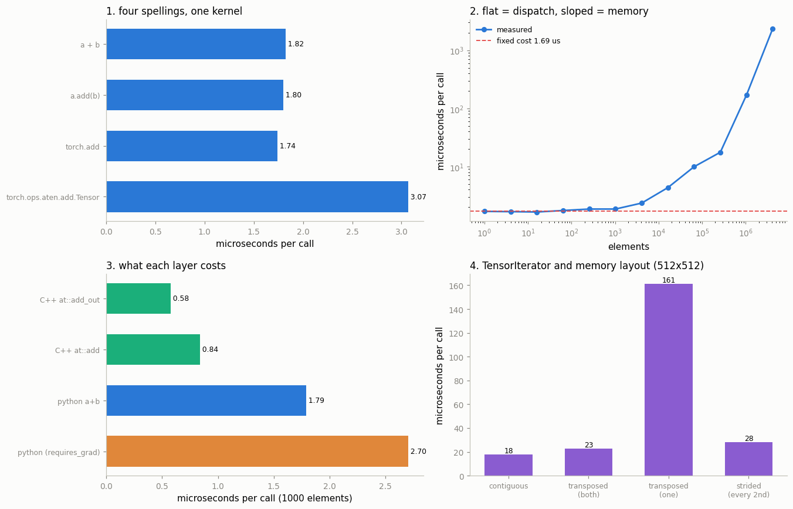

# Trace One Op End to End

---

> When you call `torch.add`, Python is just the doorbell — the real work happens in C++.

---

## Key Insight

A Python call like `torch.add(a, b)` does no math itself. It travels through the [dispatcher](/shared/glossary/#dispatcher), which picks the right [kernel](/shared/glossary/#kernel) for your [tensor](/shared/glossary/#tensor)'s device and [dtype](/shared/glossary/#dtype), and lands in [ATen](/shared/glossary/#aten), the C++ library that does the actual arithmetic.

## Why This Matters

Once you can follow one operation from the Python call all the way down to its CPU kernel, the framework stops feeling like magic. You can then trace any op and answer questions the documentation never covers.

---

**This is project 53.**

### The words first

- **[ATen](/shared/glossary/#aten)** is short for **A Tensor library**. It is the C++ library that
  holds every kernel — the real loops that add, multiply, and convolve numbers.
- A **[kernel](/shared/glossary/#kernel)** is one concrete implementation of one operation for one
  situation: "add two float32 tensors on the CPU". A single operation like
  `add` has many kernels — one per device, plus special ones for sparse
  tensors, for autograd, and so on.
- The **[dispatcher](/shared/glossary/#dispatcher)** is the switchboard that picks which of those
  kernels runs. "Dispatch" is the ordinary English word for *sending something
  to the right place* — a taxi dispatcher hears where you are and sends the
  nearest car. PyTorch's dispatcher hears what kind of tensor you passed and
  sends the matching kernel.
- A **[dispatch key](/shared/glossary/#dispatch-key)** is one label the dispatcher can
  route on: `CPU`, `CUDA`, `Autograd`, `Sparse`, and about sixty more.
- An **[operator schema](/shared/glossary/#operator-schema)** is one line of text that
  declares an operation's name, arguments and return type — the operation's
  contract, written in a small language of PyTorch's own.

### Why "one op end to end" is worth a whole project

You already know `a + b` adds two tensors. What you probably cannot answer yet:

- Why does `a + b` cost **1.8 microseconds** even when the tensors hold **one
  number**? Where does that time go if not into the addition?
- Why does setting `requires_grad=True` make the *same* addition **1.6× slower**
  before you have called `.backward()` even once?
- If you found a bug in addition, **which file would you open?**

Each of those is a question about the path, not about the maths. This project
walks the path with instruments the library itself provides, and prints a real
number or a real file path at every step.

### What is real here

Every line below comes from the PyTorch you have installed — version reported
by `torch.__version__`, built for CUDA 12.8, running on CPU with 4 threads.
Nothing is quoted from documentation. The tools used are all shipped with the
wheel:

| Tool | What it shows |
|---|---|
| `TorchDispatchMode` | the real ATen operator behind a piece of Python |
| `torch._C._dispatch_dump` | every kernel registered for an operator, and its source file |
| `torch._C._dispatch_key_set` | the keys a tensor carries, which decide the route |
| `torchgen` | PyTorch's own parse of `native_functions.yaml` |
| `load_inline` | the same op called from C++, with Python removed |

Timings use interleaved rounds (rotate between variants, report the best round)
because this machine is shared — the reasoning is in
[project 24](../24-profile-a-training-step/README.md).


> **About the numbers.** Every figure quoted below comes from the committed
> [`outputs/findings.csv`](outputs/findings.csv), produced by one run of `run.py` on this
> machine. Counts (kernels, operators, files) are exact and reproducible; timings move a
> few percent between runs because the machine is shared, so re-running will not reproduce
> the microseconds digit for digit.



---

## 1. Four spellings, one operator

```python
a + b
a.add(b)
torch.add(a, b)
torch.ops.aten.add.Tensor(a, b)
```

All four record **exactly one** ATen operator: `aten.add.Tensor`.

`TorchDispatchMode` is how we know. It is a hook the dispatcher offers to
Python: just before running a kernel, the dispatcher calls your object and hands
it the operator it was about to run. Twenty lines of Python replace what would
otherwise need a C++ debugger.

The cost is not identical, though:

| Spelling | µs per call (1000 elements) |
|---|---|
| `torch.add(a, b)` | **1.74** |
| `a.add(b)` | 1.80 |
| `a + b` | 1.82 |
| `torch.ops.aten.add.Tensor(a, b)` | **3.07** |

**The slowest one is the one that looks most "direct".** `torch.ops.aten...`
sounds like it skips layers — it does not. `torch.add` goes through a
hand-optimised C binding generated at build time; `torch.ops.aten.add.Tensor`
goes through a generic Python object that has to box every argument into a
generic value type first. Spread across spellings: **1.76×**, all of it Python
overhead, none of it arithmetic.

---

## 2. Overloads: which `add` did you call?

`aten::add` has **16 schemas**. A few:

```
aten::add.Tensor(Tensor self, Tensor other, *, Scalar alpha=1) -> Tensor
aten::add.Scalar(Tensor self, Scalar other, Scalar alpha=1) -> Tensor
aten::add.out(Tensor self, Tensor other, *, Scalar alpha=1, Tensor(a!) out) -> Tensor(a!)
aten::add.str(str a, str b) -> str
aten::add.int(int a, int b) -> int
```

The part after the dot (`Tensor`, `Scalar`, `out`, `str`) is the
**[overload](/shared/glossary/#operator-overload) name**. "Overload" is the
programming term for *several functions sharing one name, told apart by their
argument types* — the name is "overloaded" with more than one meaning, the way
the English word "run" is.

Two details in that schema text are easy to skim past:

- `*` marks the start of keyword-only arguments, exactly as in Python.
- `Tensor(a!)` means "this tensor is **written to**". The `!` marks mutation and
  the `a` names an alias group. This annotation is not decoration — it is what
  lets [torch.compile](/shared/glossary/#torchcompile) know that `add.out`
  modifies memory and cannot be freely reordered.

The measured surprise:

| You wrote | It dispatched to |
|---|---|
| `tensor + tensor` | `aten.add.Tensor` |
| `tensor + 2.5` | `aten.add.Tensor` |
| `tensor + torch.tensor(2.5)` | `aten.add.Tensor` |

**`add.Scalar` exists but Python's `+` never uses it.** The Python binding wraps
the plain number `2.5` into a 0-dimensional tensor and calls the `.Tensor`
overload. You can reach the scalar overload — `torch.ops.aten.add.Scalar(x, 2.5)`
does — but nothing in normal Python code will take you there. That is a fact
about the binding layer, invisible in the schema list.

---

## 3. The dispatch table, printed from the running library

```python
torch._C._dispatch_dump("aten::add.Tensor")
```

The full output is saved to
[`outputs/dispatch_add_tensor.txt`](outputs/dispatch_add_tensor.txt).
**20 kernels** are registered for this one operator:

| Dispatch key | Registered at |
|---|---|
| `CPU` | `build/aten/src/ATen/RegisterCPU_0.cpp:1309` |
| `CUDA` | `build/aten/src/ATen/RegisterCUDA_0.cpp:2432` |
| `Meta` | `torch/_meta_registrations.py:51` |
| `SparseCPU` | `build/aten/src/ATen/RegisterSparseCPU_0.cpp:341` |
| `NestedTensorCPU` | `build/aten/src/ATen/RegisterNestedTensorCPU_0.cpp:309` |
| `Tracer` | `torch/csrc/autograd/generated/TraceType_2.cpp:17975` |
| `FuncTorchBatched` | `aten/src/ATen/functorch/BatchRulesBinaryOps.cpp:353` |
| `CompositeExplicitAutogradNonFunctional` | `build/aten/src/ATen/RegisterCompositeExplicitAutogradNonFunctional_0.cpp:1374` |
| ... | 13 more |

Three things worth stopping on.

**`build/` in the path means the file did not exist before the build.**
**16 of the 20** kernels live in generated files. `RegisterCPU_0.cpp` was
written by a program (`torchgen`) during compilation, from the YAML entry we
read in section 5. This is why searching GitHub for `RegisterCPU_0.cpp` finds
nothing: it is not in the repository. Project 55 runs the generator that
produces it.

**One kernel is written in Python.** The `Meta` kernel is registered from
`torch/_meta_registrations.py` — a `.py` file in your site-packages, editable
right now with a text editor. Not everything in "the C++ library" is C++.

**A key is not a device.** `Tracer`, `FuncTorchBatched`, `ZeroTensor` and
`Named` are not hardware. They are *behaviours* layered on top: record this call
for the JIT tracer, apply `vmap`'s batching rule, take the shortcut for a tensor
known to be all zeros. The dispatcher runs them like any other kernel, and each
usually finishes by asking the dispatcher to continue to the next key down. That
"pass it on" step is called **redispatch**.

---

## 4. How the dispatcher chooses

A tensor does not have "a type" as far as the dispatcher is concerned. It
carries a **set** of keys:

```
plain CPU tensor         : CPU  ADInplaceOrView  AutogradCPU  AutocastCPU
requires_grad=True       : CPU  ADInplaceOrView  AutogradCPU  AutocastCPU
meta device tensor       : Meta ADInplaceOrView  AutogradMeta
```

Look carefully at the first two rows: **they are identical.** `requires_grad`
does not add a key. Every float tensor already carries `AutogradCPU`; the flag
is checked *inside* the autograd kernel, which is why the flag can be flipped at
any time without rebuilding anything.

The dispatcher runs the kernel for the **highest-priority key present**, and
autograd sits above the backends. So the route is: autograd kernel first →
it records what it needs → it redispatches → the CPU kernel runs.

A detail that confuses everyone once:

```
aten::add.Tensor has a kernel for CPU          : True
aten::add.Tensor has a kernel for Autograd     : True
aten::add.Tensor has a kernel for AutogradCPU  : False
```

`AutogradCPU` reports **False** even though the tensor carries that key. The
registration was made to `Autograd`, an **alias key** — one name standing for a
family (`AutogradCPU`, `AutogradCUDA`, `AutogradXLA`, …). The dispatcher expands
the alias when it builds its table, so at runtime the routing works; the query
function just answers about the literal key. Names in this system can be
*groups*, not only slots.

### What the autograd hop costs

| | µs per call |
|---|---|
| `requires_grad=False` | **1.65** |
| `requires_grad=True` | **2.70** |
| the hop itself | **1.06** (1.64×) |

That 1.06 µs is the price of allocating an `AddBackward0` node and wiring it
into the graph — paid on the forward pass, on every op, before any backward
call exists. It is why inference code should not carry `requires_grad=True`
tensors around.

**But the obvious fix, applied naively, makes things worse:**

| | µs per call |
|---|---|
| `requires_grad=True`, plain | 2.70 |
| `requires_grad=True`, `with torch.no_grad():` **inside** the loop | **3.85** |

Wrapping each individual call in `no_grad()` costs **1.15 µs more** than the
autograd hop it removes. Entering and leaving that context manager is itself
work — it flips a thread-local flag and installs a cleanup handler — and at this
granularity that costs more than the 1.06 µs it saves. Hoist it out and the
saving is real: measured *inside* one `no_grad()` block, the same
`requires_grad=True` add takes **1.71 µs**, matching the plain tensor's 1.66 µs
almost exactly. **`no_grad()` is free per-op and expensive per-`with`.** Put it around
your evaluation loop, never around one operation.

### The meta tensor

```
meta + meta  ->  reaches aten.add.Tensor,  result storage = 16 bytes... for 4 floats
```

A [meta tensor](/shared/glossary/#meta-tensor) has a shape and a dtype but its
storage is never really allocated (the 16 bytes are the bookkeeping struct, not
data). Adding two of them runs the `Meta` kernel, which computes only the
*output shape* and skips the arithmetic entirely. This is how PyTorch can tell
you the shape of a 70-billion-parameter model's activations on a laptop.

---

## 5. What the source says: `add.Tensor` → `add.out` → `ufunc_add_CPU`

Now we stop asking the running library and read its build-time description.
`native_functions.yaml` — the master operator list, project 54's subject —
ships **inside the wheel you already installed**, and `torchgen`, PyTorch's own
parser, is installed next to it.

```
add.Tensor signature        : add.Tensor(Tensor self, Tensor other, *, Scalar alpha=1) -> Tensor
add.Tensor structured_delegate : add.out
add.Tensor own CPU kernel   : None          <-- it has no kernel of its own
add.Tensor tags             : core pointwise pt2_compliant_tag

add.out signature           : add.out(..., Tensor(a!) out) -> Tensor(a!)
add.out structured          : True
add.out CPU kernel name     : ufunc_add_CPU
add.out CUDA kernel name    : ufunc_add_CUDA
```

Read that carefully, because it inverts the obvious expectation. **The
functional `add.Tensor` you call has no kernel.** It is a
`structured_delegate` — it forwards to `add.out`, the version that writes into a
caller-supplied buffer. The generated wrapper allocates an empty output, calls
the `out` kernel, and returns the buffer.

Why build it that way, when it looks backwards to implement `a + b` in terms of
the more complicated `add(a, b, out=c)`? Because otherwise the same maths would
be written three times — once for `add`, once for `add_` (in-place), once for
`add(out=)` — and the three copies would drift apart. Writing only the `out`
form and generating the other two is why `torch.add`, `x.add_(y)` and
`torch.add(x, y, out=z)` cannot disagree with each other. **Project 57 is
entirely about ops that were *not* built this way, and what drifted.**

**"[Structured](/shared/glossary/#structured-kernel)"** is PyTorch's word for
that modern style: the author writes only two things — a `meta` function that
computes the output shape, and the arithmetic — and the generator writes the
rest (argument checks, output allocation, output *resizing*, all three
variants).

**"[ufunc](/shared/glossary/#ufunc)"** is short for **universal function**, a
name borrowed from NumPy. It means a function defined on single numbers that
gets applied element by element to whole arrays. `ufunc_add_CPU` is generated
from a file that contains, essentially, `a + b * alpha` for one pair of
numbers — and the loop, vectorisation and threading are supplied around it.

The generated C++ declaration ships with the wheel too, in
`torch/include/ATen/ops/add_native.h`:

```cpp
struct TORCH_API structured_ufunc_add_CPU : public at::meta::structured_add_Tensor {
struct TORCH_API structured_ufunc_add_CUDA : public at::meta::structured_add_Tensor {
```

Both backends inherit from one shape-computing base class. That is the
guarantee, spelled out in code: CPU and CUDA cannot disagree about the output
shape of an addition, because there is only one function that decides it.

---

## 6. Where the maths happens: [TensorIterator](/shared/glossary/#tensoriterator)

The kernel does not contain a `for` loop over your tensor. It hands the job to
`TensorIterator`, the component that works out *how* to walk the memory. You
cannot see it from Python, but you can see its fingerprints.

**Fingerprint 1 — [broadcasting](/shared/glossary/#broadcasting) makes no copies.**
`(1000,1) + (1,1000)` returns `(1000,1000)`. TensorIterator arranged this by
setting a stride of 0 on the missing dimensions, so the same input element is
re-read instead of being duplicated in memory.

**Fingerprint 2 — [type promotion](/shared/glossary/#type-promotion) happens
before the loop:**

| Inputs | Result dtype |
|---|---|
| float32 + float64 | float64 |
| int64 + float32 | **float32** |
| bool + int64 | int64 |

The middle row is the interesting one: an int64 holds far more digits than a
float32, yet the result is float32. Promotion follows *category* first
(bool < integer < floating point), and only then width. This rule lives in
TensorIterator, not in the add kernel, which is why every elementwise op in
PyTorch promotes identically.

**Fingerprint 3 — memory layout costs more than arithmetic.** Same 512×512 add,
same 262,144 additions, four layouts:

| Layout | µs |
|---|---|
| both contiguous | **17.9** |
| both transposed | 22.9 |
| **one transposed** | **161.4** |
| every 2nd column | 28.2 |

Both-transposed is nearly as fast as contiguous, because TensorIterator may
*reorder its own dimensions*: if every input is transposed, it can just walk
them in the other order and the memory access is sequential again. One
transposed input removes that freedom — now one tensor is walked in row order
and the other in column order, and every read of the second lands in a different
cache line. **7.06× slower, with identical arithmetic.**

**Fingerprint 4 — the size sweep tells you what you are paying for:**

| Elements | µs |
|---|---|
| 1 | 1.69 |
| 64 | 1.75 |
| 1,024 | 1.86 |
| 16,384 | 4.34 |
| 262,144 | 17.6 |
| 1,048,576 | 170 |
| 4,194,304 | 2,355 |

Below ~1,000 elements the time is **flat at 1.69 µs**, because none of it is
arithmetic — it is Python, dispatch, and setup. That fixed cost is worth
**≈3,012 elements**: adding a 3,000-element tensor takes about as long as adding
a 1-element one. Above that the curve turns linear and the slope is memory:
**21.4 GB/s** at 4M elements, counting two reads and one write.

The jump between 262,144 and 1,048,576 elements is much steeper than 4× — the
working set (3 buffers × 4 MB) has left the CPU's last-level cache, and the
measurement changes from "cache speed" to "RAM speed". Elementwise ops are
**memory-bound**: the addition is free, moving the numbers is the whole cost.

---

## 7. The tax: the same op called from C++

Everything above is measured from Python, so "1.68 µs of fixed cost" could be
Python's fault or the dispatcher's. To separate them, the project compiles a
small C++ extension that calls `at::add` in a tight loop — the same entry point
the Python binding calls, but with no interpreter in the way.

| 1000 elements | µs per call |
|---|---|
| `at::add_out` from C++ (no allocation) | **0.58** |
| `at::add` from C++ | **0.84** |
| `a + b` from Python | **1.79** |
| `a + b` from Python, `requires_grad=True` | 2.70 |

So, for a small tensor:

- **Python's share is 0.95 µs — 53% of the call.** Argument parsing, the
  binding, reference counting.
- **The dispatcher's share is 0.84 µs**, of which **0.26 µs** is allocating the
  output tensor (the difference between `at::add` and `at::add_out`).
- The addition of 1000 floats itself is a rounding error next to both.

At 4 million elements the picture inverts completely: Python `a + b` takes
2,353 µs and the C++ loop 2,578 µs — **the Python tax is no longer measurable**,
because 1 µs of overhead against 2,400 µs of memory traffic is noise.

> **A trap this section walked into.** The first version of the C++ loop was
> *slower* than Python at 4M elements (3,393 µs vs 2,353 µs) — a nonsense
> result, since it does strictly less work. The cause was one line:
> `out = at::add(a, b)` allocates the **new** 16 MB buffer before releasing the
> **old** one, so two live buffers alternate and the [caching
> allocator](/shared/glossary/#caching-allocator) cannot hand the same block
> back. Adding `out.reset()` first brought it to 2,578 µs — **1.32× faster from
> freeing memory one line earlier**. When a measurement says the impossible,
> suspect the harness before the framework.

---

## 8. The whole path

```
  a + b                                  Python
    |
    v  torch/_tensor.py -> generated C binding
  THPVariable_add                        torch/csrc/autograd/generated/python_variable_methods.cpp
    |                                    parses Python args into C++ types
    v
  aten::add.Tensor                       the schema, declared in native_functions.yaml
    |
    v  dispatcher looks at the tensor's key set: {CPU, ADInplaceOrView, AutogradCPU, ...}
  Autograd kernel                        torch/csrc/autograd/generated/VariableType_2.cpp
    |                                    creates AddBackward0, then REDISPATCHES
    v
  CPU kernel (generated wrapper)         build/aten/src/ATen/RegisterCPU_0.cpp:1309
    |                                    allocates the output tensor
    v  structured_delegate: add.out
  structured_ufunc_add_CPU               generated from aten/src/ATen/native/ufunc/add.h
    |
    v
  TensorIterator                         aten/src/ATen/TensorIterator.cpp
                                         broadcasting, promotion, loop order, threads, SIMD
```

Saved as [`outputs/call_path.txt`](outputs/call_path.txt). Four of those nine
stages are files that **did not exist before your wheel was built**.

---

## What to remember

1. **Python does no arithmetic.** For a 1000-element add, **53% of the wall
   clock is Python** and the addition itself is invisible.
2. **`torch.ops.aten.add.Tensor` is the slowest spelling (3.07 µs), not the
   fastest.** Looking low-level and being low-level are different things.
3. **`torch._C._dispatch_dump(op)` prints the file path of every kernel.** It is
   the fastest way to find out what to open on GitHub — and it reveals that 16
   of add's 20 kernels live in generated files, and one lives in a `.py`.
4. **A dispatch key is not a device.** Autograd, tracing, `vmap` batching and
   sparse layouts are all keys, layered above the backend and redispatching
   downwards.
5. **`requires_grad=True` costs 1.06 µs per op before any backward exists** —
   but `no_grad()` around a *single* op costs 1.15 µs more than it saves. Hoist
   it out of the loop.
6. **The functional `add` has no kernel; the `out=` version has it.** One
   implementation is generated into three, which is why they cannot disagree.
7. **Memory layout beat arithmetic 7.06×** on identical work. TensorIterator can
   reorder dimensions when *all* inputs agree, and loses that freedom when one
   input is transposed.
8. **Fixed per-call cost buys you ~3,012 elements.** Below that size you are
   paying for the framework, not the maths.

---

## Try it yourself

- Run `torch._C._dispatch_dump("aten::matmul")` and compare with `add`. `matmul`
  has far fewer kernels — find out why by reading its entry in project 54.
- Put a `TorchDispatchMode` around `torch.nn.functional.linear(x, w, b)`. It
  reports `aten.t` and `aten.addmm`, not `aten.linear` — a whole op decomposed
  before the dispatcher ever sees it.
- Repeat section 6's layout test with `torch.matmul` instead of `+`. The
  one-transposed penalty should mostly vanish: matmul is compute-bound and has
  kernels for each layout.
- Set `torch.set_num_threads(1)` and re-run the size sweep. The flat region
  should be unchanged (it is not arithmetic) and the sloped region should get
  slower.

---

**Next:** [project 54](../54-read-native-functions-yaml/README.md) opens the
file this project kept quoting — `native_functions.yaml`, all 3,184 entries of
it — and checks its claims against the dispatch tables printed here.
