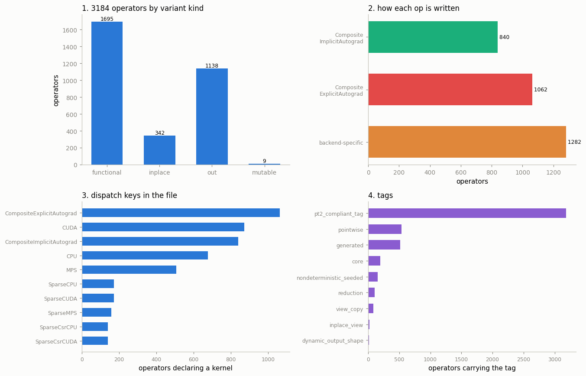

# Read native_functions.yaml

---

> Every operation PyTorch knows about is listed in one giant file — and you can read it.

---

## Key Insight

`native_functions.yaml` is the master list of every built-in PyTorch operation. Each entry declares an op's name and arguments and tells the [dispatcher](/shared/glossary/#dispatcher) which [kernel](/shared/glossary/#kernel) to run for each device and [dtype](/shared/glossary/#dtype).

## Why This Matters

This one file is the table of contents for [ATen](/shared/glossary/#aten). Knowing how to read it lets you discover exactly what an op does, which [backends](/shared/glossary/#backend) support it, and where its real implementation lives.

---

**This is project 54.**

### The words first

- **[YAML](https://yaml.org/)** is a plain-text format for structured data —
  indentation instead of brackets. `native_functions.yaml` is a list of
  entries, each entry a set of `key: value` lines.
- **[native_functions.yaml](/shared/glossary/#native_functionsyaml)** — "native"
  here means *implemented inside PyTorch in C++*, as opposed to composed in
  Python. The file lists the operations the framework itself provides.
- **[torchgen](/shared/glossary/#torchgen)** is the program that reads this file
  during a build and writes C++ from it. "gen" is short for *generator*.
- A **[dispatch key](/shared/glossary/#dispatch-key)** is one routing label:
  `CPU`, `CUDA`, `SparseCPU`, `Meta`, and so on.
- **[Composite](/shared/glossary/#composite-operator)** describes an op built
  out of other ops rather than out of a loop over numbers. `matmul` is
  composite: it reshapes, then calls `mm` or `bmm`.

### The surprise before we start

You do not need to clone PyTorch to read this file. **It is already on your
disk**, inside the wheel `pip` installed:

```
~/.local/lib/python3.12/site-packages/torchgen/packaged/ATen/native/native_functions.yaml
```

Why would a *binary* package ship the file its build already consumed? Because
`torchgen` ships too — it is a normal Python package, and other projects
(custom backends, out-of-tree accelerators) run it to generate their own
bindings. A generator without its input file is useless, so the input file
comes along. The whole of this project therefore runs offline.

### What is real here

`run.py` parses the file with **PyTorch's own parser** (`torchgen`), not with a
plain `yaml.safe_load`. That matters more than it sounds: the file uses defaults
and shorthands, and a missing field often means something specific. Reading it
with the same code the build uses means what you see is what the build saw.

Then it does the part most tutorials skip — it **checks the file's claims
against the running library**.


> **About the numbers.** Every figure quoted below comes from the committed
> [`outputs/findings.csv`](outputs/findings.csv), produced by one run of `run.py` on this
> machine. Counts (kernels, operators, files) are exact and reproducible; timings move a
> few percent between runs because the machine is shared, so re-running will not reproduce
> the microseconds digit for digit.



---

## 1. The file, in numbers

| | |
|---|---|
| Size | **604 KB** |
| Lines | **16,099** |
| Entries physically in the file | **2,666** |
| Operators `torchgen` produces from it | **3,184** |

The last two rows disagree, and the gap is the first real lesson. **518
operators exist that have no entry.** They come from `autogen:` lines — 497
entries carry one — which say "also create the `out=` and in-place versions of
me automatically". `2,666 + 518 = 3,184` exactly.

So *searching the file for an operator and not finding it does not mean it does
not exist*. If you grep for `add_.out` and get nothing, look for `autogen:` on a
nearby entry instead.

Two smaller YAML files ship beside it:

| File | Size | What it holds |
|---|---|---|
| `tags.yaml` | 5 KB | the list of legal tags and what each means |
| `derivatives.yaml` | 179 KB | hand-written backward formulas |

---

## 2. Anatomy of one entry

Here is `add.out` exactly as it appears (also saved to
[`outputs/entry_add_out.yaml`](outputs/entry_add_out.yaml)):

```yaml
- func: add.out(Tensor self, Tensor other, *, Scalar alpha=1, Tensor(a!) out) -> Tensor(a!)
  device_check: NoCheck
  structured: true
  structured_inherits: TensorIteratorBase
  ufunc_inner_loop:
    Generic: add (AllAndComplex, BFloat16, Half, ComplexHalf)
    ScalarOnly: add (Bool)
  dispatch:
    SparseCPU, SparseMeta: add_out_sparse_cpu
    SparseCUDA: add_out_sparse_cuda
    MkldnnCPU: mkldnn_add_out
    MPS: add_out_mps
  tags: pointwise
```

Field by field:

- **`func:`** — the [schema](/shared/glossary/#operator-schema). Name, overload
  (`.out`), arguments, return type. `Tensor(a!)` marks a tensor that is
  **written to**.
- **`device_check: NoCheck`** — skip the automatic "are all tensors on the same
  device?" check. Here it is skipped because a CPU scalar added to a CUDA tensor
  is legal.
- **`structured: true`** — this op is written in the modern
  [structured](/shared/glossary/#structured-kernel) style: the author supplies
  the shape rule and the arithmetic, and the generator writes the boilerplate.
- **`structured_inherits: TensorIteratorBase`** — reuse
  [TensorIterator](/shared/glossary/#tensoriterator)'s machinery for
  broadcasting, type promotion, and looping.
- **`ufunc_inner_loop:`** — the arithmetic itself, per dtype family. A
  [ufunc](/shared/glossary/#ufunc) ("universal function", a name borrowed from
  NumPy) is a scalar formula that gets applied element by element.
- **`dispatch:`** — kernels for the *unusual* cases.
- **`tags: pointwise`** — machine-readable metadata other parts of PyTorch query.

**The most important thing about this entry is what is missing from it.** The
`dispatch:` block never mentions `CPU` or `CUDA` — the two backends you actually
use. Yet the parser reports:

```
parsed: CPU kernel  ->  ufunc_add_CPU
```

The CPU and CUDA kernels are *derived from* `ufunc_inner_loop`, not listed. If
you read this entry expecting a `CPU:` line and concluded "addition has no CPU
kernel", you would be wrong in a way the file does not warn you about. Section 6
measures how often that trap fires.

---

## 3. The census

**By variant kind** (3,184 operators):

| Kind | Count | Meaning |
|---|---|---|
| functional | 1,695 | `torch.add(a, b)` — returns a new tensor |
| out | 1,138 | `torch.add(a, b, out=c)` — writes into a buffer you supply |
| inplace | 342 | `a.add_(b)` — modifies `a` |
| mutable | 9 | modifies an argument that is not `self` |

**Distinct base names: 1,329.** So on average each operation exists in about 2.4
variants. That ratio is the file's whole design: write the maths once, generate
the variants.

**By how the op is written:**

| Style | Count | What it means |
|---|---|---|
| backend-specific | 1,282 | a real kernel per device |
| `CompositeExplicitAutograd` | 1,062 | one implementation for all devices, but autograd is told separately |
| `CompositeImplicitAutograd` | 840 | built from other ops; **autograd comes free** |

The last row is the one worth internalising. **840 operators have no backward
pass written for them at all.** `matmul` is one. Because it is expressed as
reshapes plus `mm`, autograd differentiates *those* and the chain rule assembles
the result. Adding a new composite op to PyTorch therefore costs zero backward
code — and that is why the number is so large.

**By structured-ness:**

| | Count |
|---|---|
| unstructured (hand-written boilerplate) | **2,528** |
| delegates to a structured op | 383 |
| structured (the base) | 273 |

**Most of PyTorch is still unstructured.** Structured kernels are the newer,
safer style, and after years of migration they cover about 20% of entries. That
number is the reason project 57 finds what it finds.

**By tag** (top of the list):

| Tag | Count | Used for |
|---|---|---|
| `pt2_compliant_tag` | 3,184 | works under `torch.compile` |
| `pointwise` | 537 | elementwise — fusable |
| `generated` | 518 | created by an `autogen:` line |
| `core` | 192 | the small set every backend must implement |
| `nondeterministic_seeded` | 154 | consumes the random generator |

---

## 4. Five ops you use every day

| Op | Composite? | Own CPU kernel | In `derivatives.yaml` | Kernels loaded at runtime |
|---|---|---|---|---|
| `add.Tensor` | no | — (delegates to `add.out`) | yes | **20** |
| `relu` | no | `relu` | yes | 19 |
| `linear` | implicit | — | **yes** | 14 |
| `matmul` | implicit | — | **yes** | 14 |
| `softmax.int` | implicit | — | no | 9 |
| `conv2d` | implicit | — | no | 9 |

Read the last two columns together and a pattern appears, then breaks.

`softmax` and `conv2d` behave as the "composite" story predicts: no kernel of
their own, no derivative formula, few runtime kernels. They are thin wrappers —
`conv2d` picks between `thnn_conv2d`, `cudnn_convolution`, `mkldnn_convolution`
and others, and the *chosen* op is where the real work and the real derivative
live.

`linear` and `matmul` are composite **and** have hand-written derivatives, which
should not be necessary. That contradiction is section 5.

---

## 5. A plausible rule, tested and broken

State the rule before looking, so the test is honest:

> A `CompositeImplicitAutograd` op is built from other ops, so autograd can
> differentiate it by differentiating those. It should therefore never need an
> entry in `derivatives.yaml`.

Result across all 590 composite functional ops:

| | |
|---|---|
| Rule holds for | **583 / 590 (98.8%)** |
| Breaks the rule | **7** |

The seven: `chunk`, `_fused_rms_norm`, `linear`, `matmul`, `max_pool2d`,
`one_hot`, `_test_autograd_multiple_dispatch.ntonly`.

A 98.8% rule is not a rule — it is a default with exceptions, and the exceptions
are where the interesting engineering is. So: **what happens when an op has
both?** Ask the dispatcher, not the file.

| | Autograd kernel loaded at runtime |
|---|---|
| composites **with** a formula (6 checked) | **5 / 6** |
| composites **without** a formula (394 checked) | **5 / 394** |

Concretely:

```
linear      : in derivatives.yaml = True   Autograd keys loaded: Autograd
softmax.int : in derivatives.yaml = False  Autograd keys loaded: (none)
```

**Writing a formula changes the routing.** When `derivatives.yaml` has an entry,
the generator emits a kernel at the `Autograd` key — and that key sits *above*
the composite decomposition, so it runs first and the decomposition is never
reached for the backward pass. When there is no entry, no Autograd kernel
exists, and autograd sees the decomposition.

So why write a formula for something that already works? **Speed and memory.**
Differentiating `linear`'s decomposition means recording `t` (transpose) and
`addmm` separately, saving both intermediates and running two backward nodes.
The hand-written formula does it in one node with fewer saved tensors. The
formula is not fixing a correctness gap — it is buying performance, at the cost
of a second implementation that can drift from the first.

(The 5-out-of-394 that have an Autograd kernel without a formula —
`narrow`, `silu_backward`, `mish_backward`, `native_channel_shuffle`,
`value_selecting_reduction_backward` — are registered by hand in C++ rather than
through `derivatives.yaml`. Another route to the same key, invisible to a
YAML-only reading.)

---

## 6. What the file declares vs what the library loaded

600 randomly chosen operators. For each, read the entry and predict "does this
op have a CPU implementation?", then ask the running dispatcher.

**Prediction rule A — the naive reading.** The entry names a `CPU:` kernel, or
one of the composite alias keys that covers CPU.

| | |
|---|---|
| agrees with runtime | 542 / 600 |
| **disagrees** | **58 / 600 (9.7%)** |

Every one of the 58 fails the same way: the file appears to say *no CPU kernel*,
the library has one. Examples: `min.dim`, `ge.Tensor`, `clamp_max`, `xlogy.Tensor`.

**Prediction rule B — add one rule.** An op with `structured_delegate:` has no
kernel of its own, but the generator still emits a CPU registration that
forwards to the delegate. (This is exactly `add.Tensor` from
[project 53](../53-trace-one-op-end-to-end/README.md).)

| | |
|---|---|
| agrees with runtime | **600 / 600** |
| disagrees | **0** |

One extra rule takes the reading from 90.3% to **100%**. That is what "learning
to read this file" actually means: not memorising fields, but knowing which
fields are filled in later by the generator.

### The other direction: kernels the file never mentions

Of the 600 probed operators, **231 have a `Meta` kernel registered from a
`.py` file** — `torch/_meta_registrations.py`, in your site-packages. Only
**1** of those 231 is declared in the YAML. **161** have a Meta kernel that the
file does not mention in any form.

Meta kernels compute output shapes without touching data
([project 53](../53-trace-one-op-end-to-end/README.md) section 4). Hundreds of
them are written in Python, registered at import time, and are therefore
invisible to any tool that only reads `native_functions.yaml`. **The file is the
table of contents for the C++ half of PyTorch, not for all of it.**

---

## 7. From a kernel name to the file that defines it

The YAML gives you a C++ *function name* — `ufunc_add_CPU`, `relu`,
`add_out_sparse_cpu` — never a file path. Two things bridge the gap.

**The generated declaration headers, which ship in your wheel.** There are
**7,010** of them in `torch/include/ATen/ops/`, 12.5 MB in total (the full
include tree is 9,319 files and 37.8 MB). One per operator, and reading one
tells you the namespace and exact signature:

```cpp
// ATen/ops/relu_native.h
TORCH_API at::Tensor relu(const at::Tensor & self);
TORCH_API at::Tensor & relu_out(const at::Tensor & self, at::Tensor & out);

// ATen/ops/add_native.h
struct TORCH_API structured_ufunc_add_CPU : public at::meta::structured_add_Tensor {
```

**Then grep the repository for that name.** Kernel names are unique by
convention, so `git grep ufunc_add_CPU` in a PyTorch checkout lands on the
definition immediately. `TORCH_API` in front of each declaration is a macro that
marks the symbol as exported from the [shared
library](/shared/glossary/#shared-library) — that is why `nm` can find it, and
why removing it breaks builds in confusing ways.

---

## 8. Answering a real question with tags

Tags turn the file into a queryable database. A question that actually comes up:
**"which operations does `torch.manual_seed` affect?"**

```python
[f for f in fns if "nondeterministic_seeded" in f.tags]
```

**154 entries, 54 distinct operations** — written to
[`outputs/nondeterministic_ops.txt`](outputs/nondeterministic_ops.txt). They
include the obvious (`rand`, `randn`, `multinomial`, `bernoulli`) and the
easily-forgotten (`_fused_dropout`, `_sample_dirichlet`, `_cudnn_rnn`,
`_flash_attention_forward`).

That last one matters in practice: **flash attention consumes the random
generator** because dropout happens inside the fused kernel. If you seed, run
attention, and then expect a later `torch.rand` to match a run without
attention, it will not. No documentation page lists this; the tag does.

Verified by hand, so the tag is not taken on faith:

```
rand reproduces under manual_seed : True
'rand' carries the tag            : True
```

Two more useful tags: **`core` (163 ops)** is the minimum set a new backend must
implement — the answer to "how much work is porting PyTorch to new hardware?"
And **`pointwise` (170 ops)** is what `torch.compile` is allowed to fuse into
one loop.

---

## What to remember

1. **The file is already installed** at
   `torchgen/packaged/ATen/native/native_functions.yaml`. No clone needed.
2. **2,666 entries describe 3,184 operators.** The missing 518 come from
   `autogen:`, so "not in the file" does not mean "does not exist".
3. **What an entry does not say is as important as what it says.** `add.out`
   never names a CPU kernel; `ufunc_inner_loop` produces it.
4. **840 ops (26%) have no backward code**, because composite ops inherit
   autograd from the ops they call.
5. **Most of PyTorch (2,528 of 3,184) is still unstructured** — the older style
   where each kernel hand-writes its own boilerplate. Project 57 lives there.
6. **The plausible rule "composite ⇒ no derivative formula" is 98.8% true**, and
   the 7 exceptions exist for speed: a formula silently moves the op's backward
   to the `Autograd` key, above the decomposition.
7. **One extra rule (`structured_delegate`) took prediction from 90.3% to 100%**
   across 600 operators.
8. **231 of 600 ops have Meta kernels written in Python**, only 1 of which the
   YAML mentions. The file covers the C++ half of the library.

---

## Try it yourself

- Grep the file for `nondeterministic_seeded` and pick an op you did not expect.
  Verify by hand that `manual_seed` controls it.
- Find an op with `autogen:` and confirm the generated variant works from Python
  even though it has no entry of its own.
- Compare `mm` (backend-specific) with `matmul` (composite) side by side. Then
  run `TorchDispatchMode` over `torch.matmul(a, b)` and watch the decomposition.
- Run the section 6 comparison on the `Meta` key instead of `CPU`. It should
  disagree wildly — and now you know why.

---

**Next:** [project 55](../55-build-pytorch-from-source/README.md) runs the
program that reads this file — `torchgen` — and measures what building the
result would actually cost.
