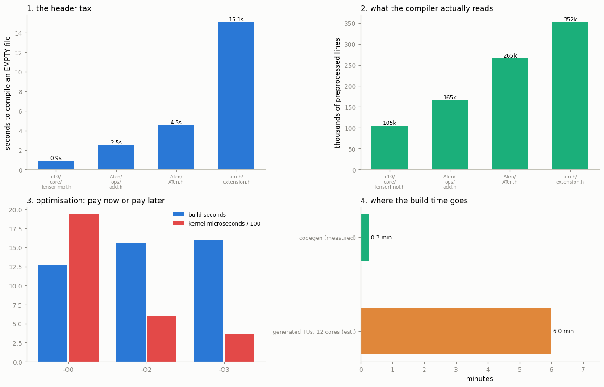

# Build PyTorch from Source

---

> You don't truly know a tool until you've compiled it yourself.

---

## Key Insight

PyTorch is a thin Python layer wrapped around a large C++ codebase — [ATen](/shared/glossary/#aten), [c10](/shared/glossary/#c10), and the [CUDA](/shared/glossary/#cuda) [kernels](/shared/glossary/#kernel). Building it from source compiles all of that C++ into the libraries that `import torch` loads.

## Why This Matters

A source build is the gateway to changing PyTorch itself. Doing it once — even though it is slow — turns the framework from a black box into code you can edit, patch, and explore.

---

**This is project 55.**

### What this project actually does — and why

A full PyTorch build takes **one to three hours** and needs tens of gigabytes of
disk. This project does not run one; it would be a ten-minute page telling you
to come back tomorrow.

Instead it does something you will learn more from:

1. **Runs the first real stage of the build for real.** Code generation is a
   genuine build step, it takes 16 seconds, and its output can be checked
   against the wheel you already have.
2. **Measures the second stage** — compilation — on single files, until the
   hours-long total becomes an arithmetic result you can predict rather than a
   folk legend.

Everything below is measured on this machine (12 cores, 33.5 GB RAM, GCC 13.3).

### The words first

- A **[translation unit](/shared/glossary/#translation-unit)** (TU) is one `.cpp`
  file plus everything it `#include`s, compiled as a single job. "Translation"
  is the C++ standard's word for compiling; the compiler translates one unit at
  a time, which is why build time scales with the number of files, not the size
  of the project.
- **[Code generation](/shared/glossary/#code-generation)** ("codegen") means a
  program writing source code that another program then compiles. PyTorch's
  generator is `torchgen` — project 54's subject.
- A **[shared library](/shared/glossary/#shared-library)** (`.so` on Linux) is a
  compiled blob loaded at run time. `import torch` loads several.
- A **[symbol](/shared/glossary/#symbol-table)** is one named thing inside a
  library — a function or a global. The list of them is the symbol table, and
  it is how one library finds another's functions.
- **[ccache](/shared/glossary/#ccache)** is a cache that remembers "I already
  compiled this exact file with these exact flags; here is the result."


> **About the numbers.** Every figure quoted below comes from the committed
> [`outputs/findings.csv`](outputs/findings.csv), produced by one run of `run.py` on this
> machine. Counts (kernels, operators, files) are exact and reproducible; timings move a
> few percent between runs because the machine is shared, so re-running will not reproduce
> the microseconds digit for digit.



---

## 1. What your wheel was built with

`torch.__config__.show()` prints the build's own record of itself (full text in
[`outputs/torch_config.txt`](outputs/torch_config.txt)):

```
GCC 13.3   |   C++ Version: 201703   |   CPU capability usage: AVX2
OpenMP 201511 (a.k.a. OpenMP 4.5)    |   CUDA Runtime 12.8
```

And what came out of that build:

| Library | Size |
|---|---|
| `libtorch_cuda.so` | **1,044 MB** |
| `libtorch_cpu.so` | **448 MB** |
| `libtorch_cuda_linalg.so` | 128 MB |
| `libtorch_python.so` | 33 MB |
| `libc10.so` | **1.5 MB** |
| **total** | **1,665 MB** |

Plus **2,113 Python files** and **9,378 C++ headers**.

Two numbers are worth pausing on. `libtorch_cpu.so` exports **77,791 symbols**;
`libc10.so` exports **1,136**. That 68× ratio is the architecture in one line:
`c10` is a small core of abstractions (device, dtype, `TensorImpl`) that
everything else depends on, and ATen is the enormous library of kernels built on
top. When people say "PyTorch is well-layered", this is the measurement behind
the claim.

The second: **you did not install PyTorch, you installed a build of PyTorch.**
`CPU capability usage: AVX2` means the kernels were compiled for a specific
instruction set. `USE_CUDA=ON` means over a gigabyte of your download is GPU
code you may never run. A source build is how you choose differently.

---

## 2. Stage 1 for real: running the generator

```bash
python -m torchgen.gen -s <packaged ATen> -d <output> --per-operator-headers
```

This is not a simulation. It is the same command the build runs, on the same
input file, using the `torchgen` package pip installed for you.

| | |
|---|---|
| Wall time | **15.9 s** |
| Files generated | **7,113** |
| Bytes generated | **64.8 MB** |
| ... of which headers | 7,035 |
| ... of which `.cpp` | 76 |
| Rate | **447 files per second** |

**Sixty-five megabytes of C++ that does not exist in the git repository.** This
is why `git clone` gives you a few hundred megabytes of source and the build
directory swells to gigabytes, and why grepping GitHub for `RegisterCPU_0.cpp`
finds nothing.

### Checking it against the wheel

Same generator, same input, so the output should match what shipped:

| `ATen/ops/add_native.h` | Lines |
|---|---|
| we generated | 43 |
| in the wheel | 48 |
| **identical lines** | **43** |

All 43 of our lines appear in the shipped file. The extra 5 are an
`#if !defined(TORCH_STABLE_ONLY)` guard that the official build enables and our
plain invocation does not. **We regenerated a shipped file, and the difference
is exactly one build option** — which is the strongest possible evidence that
this stage is understood.

---

## 3. Finding the file the dispatcher pointed at

[Project 53](../53-trace-one-op-end-to-end/README.md) asked the running library
where `add`'s CPU kernel lives and got:

```
/pytorch/build/aten/src/ATen/RegisterCPU_0.cpp:1309
```

That path is on a machine that no longer exists — PyTorch's build server. But we
just generated the same file. It is **10,338 lines** long, and:

```
our line 1310:  m.impl("add.Tensor", TORCH_FN(wrapper_CPU_add_Tensor));
```

**Line 1310 against their line 1309 — a difference of one.** The registration
that the dispatcher reported at build-server line 1309 is, in our freshly
generated copy, one line away. (The offset comes from that same
`TORCH_STABLE_ONLY` guard.) The file was never missing; it simply had not been
generated yet on your machine.

Copies are saved for reading:
[`outputs/generated_RegisterCPU_0_excerpt.cpp`](outputs/generated_RegisterCPU_0_excerpt.cpp) and
[`outputs/generated_add_native.h`](outputs/generated_add_native.h).

### And the kernel itself

[`outputs/generated_UfuncCPUKernel_add.cpp`](outputs/generated_UfuncCPUKernel_add.cpp)
— **207 lines**, **13 dtype cases**, and it mentions `cpu_kernel_vec`:

```cpp
AT_DISPATCH_CASE(at::ScalarType::Float,
  [&]() {
    auto _s_alpha = alpha.to<scalar_t>();
    auto _v_alpha = at::vec::Vectorized<scalar_t>(_s_alpha);
    cpu_kernel_vec(iter,
      [=](scalar_t self, scalar_t other) { return ufunc::add(self, other, _s_alpha); },
      [=](at::vec::Vectorized<scalar_t> self, at::vec::Vectorized<scalar_t> other) {
        return ufunc::add(self, other, _v_alpha); }
    );
  }
)
```

**This is the end of the chain that started in project 53.** Two lambdas: one
for a single number, one for a whole SIMD register. The human-written source is
one line of arithmetic in `ufunc/add.h`; the generator produced 13 copies of
this block, one per dtype, and `cpu_kernel_vec` supplies the loop, the
vectorisation and the threading.

---

## 4. Stage 2: the header tax

Compile an **empty** file that includes one header and nothing else:

| Header | Preprocessed lines | Headers read | Compile time |
|---|---|---|---|
| `c10/core/TensorImpl.h` | 105,194 | 114 | **0.89 s** |
| `ATen/ops/add.h` (one op) | 165,006 | 641 | **2.49 s** |
| `ATen/ATen.h` (all ops) | 265,305 | 4,467 | **4.54 s** |
| `torch/extension.h` (+ Python glue) | 352,047 | 4,894 | **15.07 s** |

"Preprocessed lines" is what the compiler *actually* reads after every
`#include` has been pasted in. Your file has 2 lines; the compiler sees a
quarter of a million.

Two consequences worth naming:

**Including all of ATen costs 1.8× what including one operator costs.** That
ratio is the entire reason the 7,010 per-operator headers exist. Without them,
every file that needed `add` would read the declaration of all 3,184 operators.

**Adding pybind11 costs 10.5 s — 3.32× more than all of ATen.** `torch/extension.h`
pulls in the Python binding library, which is famously heavy template code. This
is the measured explanation for something you already saw:
[project 53](../53-trace-one-op-end-to-end/README.md) and
[project 56](../56-patch-and-rebuild/README.md) both take ~16 s to compile a
20-line extension. **Almost none of that is your code.**

---

## 5. Extrapolating the build

An empty file measures the *fixed* cost. Real files also contain code, so
measure the slope too — the same file with 0, 250 and 1,000 lines of real ATen
calls:

| Lines of `at::add` | Compile time | Object file |
|---|---|---|
| 0 | 4.55 s | 1.5 KB |
| 250 | 5.83 s | 103 KB |
| 1,000 | **13.98 s** | 418 KB |

| | |
|---|---|
| Fixed cost (headers) | **4.55 s** |
| Marginal cost per line of code | **9.43 ms** |
| Lines of code equal to the header cost | **482** |

Now the estimate. The 49 real generated translation units average **8,860
lines** each:

```
4.55 s  +  9.43 ms x 8,860 lines  =  88.1 s per file
88.1 s  x  49 files               =  1.20 core-hours
1.20 core-hours / 12 cores        =  6.0 minutes
```

**Eighty-eight seconds to compile one generated file.** That number is the whole
answer to "why does building PyTorch take so long" — and this is a **lower
bound** covering only the 49 files we generated. The real build also compiles
thousands of hand-written `.cpp` files, every CUDA kernel for seven GPU
architectures, and bundled third-party libraries (XNNPACK, fbgemm, protobuf,
oneDNN). One to three hours is exactly what this arithmetic predicts.

---

## 6. `-O0` vs `-O2` vs `-O3`

The standard advice is "use `DEBUG=1` for a fast build". Measured, on a plain
`a*x + y` loop over 1M floats:

| Level | Build time | Kernel time | `.so` size |
|---|---|---|---|
| `-O0` | **12.69 s** | **1,935 µs** | 1,272 KB |
| `-O2` | 15.66 s | 601 µs | 208 KB |
| `-O3` | 16.01 s | **360 µs** | 211 KB |

| | |
|---|---|
| `-O0` builds faster by | **1.23×** |
| `-O0` runs slower by | **3.22×** |

**A debug build buys 19% of your build time and costs you 3.2× of your run
time.** That is a much worse trade than the folklore suggests, because for these
files the time goes into *parsing 265,000 lines of headers*, which happens at
every optimisation level. Optimisation is the small part.

Notice also that `-O0` produces a **6× larger** object file: without inlining,
every tiny function survives as a real function with a real call.

And `-O3` was **1.67× faster than `-O2`** here for the same build time — yet
PyTorch's own build uses `-O2` (section 1). `-O3` trades binary size and
compile-time memory for aggressive inlining and unrolling; across a 448 MB
library that trade stops paying.

---

## 7. Why incremental rebuilds still hurt

Change one line, rebuild — why is it not instant? Because **every translation
unit that reads the edited header must be recompiled**, and the section 4
measurement is exactly that fan-out seen from the other side:

| A file that includes | reads this many headers |
|---|---|
| `ATen/ops/add.h` | 641 |
| `ATen/ATen.h` | **4,467** |

**Per-operator headers cut the exposure 6.97×.** Any of those 641 files, if
edited, forces a rebuild of everything including `add.h`.

But there is a floor. Of 800 per-operator headers sampled, **797 (99.6%)** pull
in the central tensor header:

```
so editing ATen/core/TensorBody.h rebuilds : essentially everything
     editing ATen/ops/add.h        rebuilds : only what uses add
```

**Where you edit decides whether your rebuild is 30 seconds or 90 minutes.**
Adding a kernel touches one operator's files. Adding a field to `TensorImpl`
touches every file in the project. This is why experienced contributors do
kernel work happily and core-abstraction work reluctantly.

---

## 8. The real recipe

If you do want the full build, here it is with the times this project predicts:

```bash
git clone --recursive https://github.com/pytorch/pytorch   # ~10 min, ~3 GB
cd pytorch
pip install -r requirements.txt                            # ~2 min

export USE_CUDA=0            # removes the single largest cost (1 GB of the wheel)
export MAX_JOBS=12           # one compiler per core...
                             # ...but each needs ~2 GB RAM: 12 x 2 = 24 GB
export CMAKE_C_COMPILER_LAUNCHER=ccache      # second build ~10x faster
export CMAKE_CXX_COMPILER_LAUNCHER=ccache
# export DEBUG=1             # -O0: 1.23x faster build, 3.22x slower runtime

python setup.py develop      # the build itself
```

`MAX_JOBS` is the one that catches people. Setting it to your core count is
right only if you have `2 GB × cores` of RAM — this machine has 33.5 GB for 12
cores, which just fits. Too high and the build dies with the compiler killed by
the out-of-memory killer, usually after 40 minutes.

`python setup.py develop` rather than `install`: it leaves the build in place
and points Python at it, so the next `git pull` triggers an *incremental*
rebuild (section 7) rather than a full one.

**When not to build.** If you only want to change a kernel and see it run,
[project 56](../56-patch-and-rebuild/README.md) does the whole edit-compile-run
loop in **16.5 seconds** using the same registration macro the build uses. Build
from source when you need to change something the dispatcher cannot reach —
`TensorImpl`, the autograd engine, the dispatcher itself.

---

## What to remember

1. **`torchgen` writes 7,113 files (64.8 MB) in 16 seconds**, and none of them
   are in the git repository. That is why the build tree dwarfs the source tree.
2. **We regenerated a shipped header and matched 43 of 43 lines**, and found
   project 53's `RegisterCPU_0.cpp:1309` at our line **1310**.
3. **An empty file that includes `torch/extension.h` takes 15.1 s to compile.**
   Header parsing, not your code, is the build.
4. **88 seconds per generated translation unit**, from a measured fixed cost of
   4.55 s plus 9.43 ms per line. Hours are the arithmetic, not the mystery.
5. **`-O0` builds 1.23× faster and runs 3.22× slower.** The debug-build folklore
   is a much worse deal than advertised.
6. **99.6% of per-operator headers reach the central tensor header**, so editing
   `TensorBody.h` rebuilds essentially everything. Where you edit sets your
   rebuild cost.
7. **`libtorch_cpu.so` exports 77,791 symbols; `libc10.so` exports 1,136.** The
   layering is visible in the symbol counts.
8. **`MAX_JOBS` is limited by RAM (~2 GB per job), not by cores.**

---

## Try it yourself

- Run `torchgen` twice into different directories and `diff -r` them. Identical
  — the generator is deterministic, which is what makes build caching possible.
- Delete `--per-operator-headers` and count the files again. Then re-measure
  section 4's `ATen/ops/add.h` row against the monolithic header.
- Compile the section 5 probe with `-ftime-report` and see where GCC says the
  time goes (spoiler: parsing and template instantiation).
- Install `ccache`, compile the section 4 probe twice, and measure the second
  run. That ratio is what `CMAKE_CXX_COMPILER_LAUNCHER=ccache` buys you.

---

**Next:** [project 56](../56-patch-and-rebuild/README.md) changes a kernel and
watches its own `printf` fire — without paying the hour this project just
priced.
