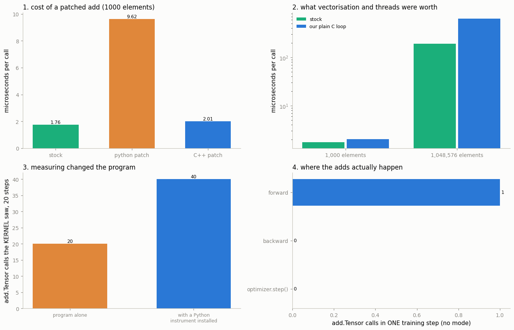

# Patch and Rebuild

---

> The fastest way to believe you can change PyTorch is to watch your own `printf` fire.

---

## Key Insight

Adding a simple `printf` inside a [CUDA](/shared/glossary/#cuda) [kernel](/shared/glossary/#kernel) and rebuilding lets you confirm that the code you just edited is the same code that runs when you call the op from Python.

## Why This Matters

This tiny change proves the whole loop — edit C++, recompile, run from Python — works on your machine. After that, real fixes and experiments are just bigger versions of the same loop.

---

**This is project 56.**

### What changed, and why it is an improvement

The textbook version of this exercise edits a CUDA kernel inside the PyTorch
source tree and rebuilds. Neither half is available here: this machine's GPU is
a GTX 1070 Ti (compute capability sm_61) and the installed wheel supports
sm_70 and newer, so no CUDA kernel of ours could run. And
[project 55](../55-build-pytorch-from-source/README.md) just measured what a
rebuild costs — **one to three hours**.

So this project patches a **CPU** kernel, and registers it with
[`TORCH_LIBRARY_IMPL`](/shared/glossary/#torch_library) — **the same macro
PyTorch's own generated code uses** for every kernel you saw in project 53.
Project 55 printed the generated line itself:

```cpp
// generated RegisterCPU_0.cpp, line 1310
m.impl("add.Tensor", TORCH_FN(wrapper_CPU_add_Tensor));
```

We write that line ourselves, in our own file. The mechanism is identical; the
loop takes **16.5 seconds** instead of an hour. You lose nothing except the wait.

### Why patch a kernel at all — isn't `TorchDispatchMode` enough?

A fair question, since [project 53](../53-trace-one-op-end-to-end/README.md)
already intercepted operators from Python with twenty lines and no compiler.

They intercept at **different depths**, and section 5 measures the difference in
both directions:

- A `TorchDispatchMode` sits *above* the backend. It cannot see a call made from
  inside a C++ kernel, because such a call never returns to Python.
- A `TorchDispatchMode` is an **active** instrument: installing it changed the
  program under measurement (section 5 found **2× the adds**). A registered
  kernel is passive — the program runs exactly as it would without it.

Neither replaces the other. The point of this project is that the deeper one is
also within reach.


> **About the numbers.** Every figure quoted below comes from the committed
> [`outputs/findings.csv`](outputs/findings.csv), produced by one run of `run.py` on this
> machine. Counts (kernels, operators, files) are exact and reproducible; timings move a
> few percent between runs because the machine is shared, so re-running will not reproduce
> the microseconds digit for digit.



---

## 1. Baselines, before touching anything

```
stock CPU kernel registered at : /pytorch/build/aten/src/ATen/RegisterCPU_0.cpp:1309
stock add, 1,000 elements      : 1.76 µs
stock add, 1,048,576 elements  : 191.2 µs
```

Measured first, because once a patch is loaded there is no going back within the
process — a C++ registration lives until the interpreter exits.

---

## 2. Route 1: patching from Python, with no compiler

```python
lib = torch.library.Library("aten", "IMPL")

def python_add(self, other, alpha=1):
    out = torch.empty(0, dtype=self.dtype, device=self.device)
    return torch.ops.aten.add.out(self, other, alpha=alpha, out=out)

lib.impl("add.Tensor", python_add, "CPU")
```

Three lines, no build step, and `a + b` now runs your Python function.

**Why the body calls `add.out` and not `torch.add`.** Calling `torch.add` would
re-enter the dispatcher, arrive back at this same kernel, and recurse until the
stack dies. `add.out` is a *different operator* with its own CPU kernel, so
there is no loop. And it is not a hack: project 53 showed the stock `add.Tensor`
is a `structured_delegate` to `add.out` — **we are doing exactly what the real
kernel does.**

PyTorch tells you loudly:

```
UserWarning: Overriding a previously registered kernel for the same operator
             and the same dispatch key
  operator: aten::add.Tensor(...)
  dispatch key: CPU
  previous kernel: registered at .../LegacyBatchingRegistrations.cpp:1076
       new kernel: registered at .../56-patch-and-rebuild/run.py:2
```

Verified: the warning fires, it says "Overriding", and it **names our file**.

| | µs per call |
|---|---|
| stock | 1.76 |
| Python-patched | **9.62** |

**5.47× slower** — every addition now makes a round trip into the Python
interpreter. Useful for experiments and prototypes, useless for anything hot.

Then:

```python
lib._destroy()      # every registration this Library made is removed
```

and the result is correct again at **1.88 µs**. **A Python patch is reversible.**
That makes it the right tool for "what happens if…" questions, and it is why you
should reach for it before the compiler.

---

## 3. Route 2: patching in C++, and watching `printf` fire

```cpp
at::Tensor patched_add(const at::Tensor& self, const at::Tensor& other,
                       const at::Scalar& alpha) {
  g_calls += 1;
  g_elements += self.numel();
  if (g_verbose && g_calls <= 3) {
    printf("[patched C++ kernel] aten::add.Tensor call #%ld, numel=%ld\n",
           (long)g_calls, (long)self.numel());
    fflush(stdout);
  }
  ...
}

TORCH_LIBRARY_IMPL(aten, CPU, m) {
  m.impl("add.Tensor", TORCH_FN(patched_add));
}
```

Compiled with `load_inline` in **16.5 s** (cold; a second run reuses
`~/.cache/torch_extensions` and takes under a second). And on the next `a + b`:

```
[patched C++ kernel] aten::add.Tensor call #1, numel=1000
[patched C++ kernel] aten::add.Tensor call #2, numel=8
[patched C++ kernel] aten::add.Tensor call #3, numel=8
```

**That is your own C++, running because Python wrote `+`.**

| | |
|---|---|
| result still correct | **True** |
| max difference from the stock kernel | **0** |
| gradient still flows | **True** |
| `grad_fn` still built | `AddBackward0` |

> **The `fflush(stdout)` is not decoration.** Without it, the first version of
> this project printed all three messages *at the very end of the run*, after
> every Python line had already scrolled past. C's `printf` writes into a
> C-level buffer that is flushed when the process exits, while Python's `print`
> uses its own buffer and flushes on newline. **Two buffers, one terminal, and
> the interleaving is a lie.** Every "my printf never fired" bug report is this.

**Autograd still works, and that is the point of the key we chose.** We
registered at `CPU`, which sits *below* `Autograd` in the dispatcher's ordering,
so the autograd kernel had already recorded `AddBackward0` before our code ran.
Section 7 registers the identical function one key higher and the gradients
vanish.

---

## 4. Proof: the dispatch table now names your file

The same `torch._C._dispatch_dump("aten::add.Tensor")` from project 53
(full text in [`outputs/dispatch_after_patch.txt`](outputs/dispatch_after_patch.txt)):

| | Before | After |
|---|---|---|
| `CPU` | `/pytorch/build/aten/.../RegisterCPU_0.cpp:1309` | **`~/.cache/torch_extensions/py312_cu128/p56_patch/main.cpp:54`** |
| `CUDA` | `/pytorch/build/aten/.../RegisterCUDA_0.cpp:2432` | *unchanged* |

**One row changed, and it is the row for the device we targeted.** The other
nineteen kernels are untouched. This is what "the dispatcher is a table" means
in practice: patching is a table update, not a recompile of the library.

---

## 5. Two instruments, two blind spots

Now the payoff — and the honest surprise.

### The Python instrument changed the program it was measuring

The same 20 training steps of a small residual network, counted three ways:

| | `add.Tensor` calls |
|---|---|
| kernel counter, program running alone | **20** |
| kernel counter, with a `TorchDispatchMode` installed | **40** |
| the `TorchDispatchMode`'s own count, same run | 40 |

**Installing the Python instrument caused 20 extra executions of the very
operation it was counting — a factor of 2.**

Attributing them to a phase makes the cause clear:

| | no mode | mode installed |
|---|---|---|
| adds during forward | 1 | 1 |
| adds during **backward** | **0** | **1** |

The network computes `h + relu(fc2(h))`, so during the backward pass `h`
receives gradient from two paths and they must be summed. Normally autograd does
that sum **in place**, reusing a buffer it knows nobody else can see. With a
`TorchDispatchMode` installed, that assumption no longer holds — a Python mode
could inspect or alias any tensor — so autograd falls back to an out-of-place
`add.Tensor`. The instrument is visible to the code it observes.

**Both counts are honest and they disagree, because they are measuring two
different programs.** The kernel-level patch is the one that measures your
program; the mode measures your program plus itself. This is the same lesson as
[project 24](../24-profile-a-training-step/README.md)'s profiler overhead, one
layer deeper, and it is why "40" would have been the wrong number to put in a
report.

### And the blind spot in the other direction

| Call | Python mode sees | kernel patch sees |
|---|---|---|
| `u + v` | 1 | 1 |
| `torch.cdist(u, v)` | 0 | 0 |
| `torch.logaddexp(u, v)` | 0 | 0 |
| `torch.trapezoid(u)` | 1 | 1 |
| **`F.pairwise_distance(u, v)`** | **0** | **1** |

`pairwise_distance` calls `at::add` **inside its C++ implementation**. That call
is dispatched entirely within C++ and never travels back up to Python, so a
`TorchDispatchMode` cannot see it. Only a kernel-level patch can.

**That is the concrete answer to "why bother compiling something".** If you are
counting operations, measuring memory traffic, or hunting for a numerically bad
input, a Python-level hook silently misses every call that one C++ kernel makes
to another — and it inflates the ones it does see.

---

## 6. The price: your kernel vs theirs

Our replacement is a plain `for` loop. The stock kernel is `cpu_kernel_vec`
(project 55 printed it), which vectorises and threads. What is that worth?

| | stock | our loop | ratio |
|---|---|---|---|
| 1,000 elements | 1.76 µs | 2.01 µs | **1.14×** |
| 1,048,576 elements | 191.2 µs | 630.2 µs | **3.30×** |
| effective bandwidth at 1M | **65.8 GB/s** | 20.0 GB/s | 3.30× |

At 1,000 elements our loop is barely slower — the time is dispatch overhead
either way (project 53, section 6). At a million elements the stock kernel is
**3.3× faster** and reaches **65.8 GB/s**, roughly three times what a single thread
can pull from this machine's memory.

**That 3.3× is the entire content of `cpu_kernel_vec`:** AVX2 registers holding 8
floats at a time, and OpenMP splitting the range across threads. Neither is
visible in `ufunc/add.h`, which just says `a + b * alpha`. The generator and the
loop helper supply everything else — which is precisely why PyTorch is written
this way.

---

## 7. The danger: one word changed, autograd gone

Take the identical kernel body and change one word in the registration:

```cpp
TORCH_LIBRARY_IMPL(aten, Autograd, m) {   // was: CPU
  m.impl("add.Tensor", TORCH_FN(forgetful_add));
}
```

The autograd kernel's real job is two things: record a node in the graph, then
redispatch downwards. Ours only redispatches.

| | before | after |
|---|---|---|
| `grad_fn` on `x + y` | `AddBackward0` | **`None`** |
| `requires_grad` on the result | True | **False** |
| values still correct | — | **True** |
| `backward()` | works | `RuntimeError: element 0 of tensors does not require grad` |
| gradients for ops we did not patch | — | **unaffected** |

**Nothing warned. Nothing crashed at the point of the mistake.** Every number
coming out of `add` is bit-for-bit correct. The graph simply stops being built,
and the failure surfaces later — as an error if you are lucky, or as a model
that trains to nowhere if the affected parameter was not the only one, which is
[project 48](../48-nan-forensics/README.md)'s "expensive kind of bug" all over
again.

**The lesson is not "do not patch". It is that the dispatch key is not a
detail — it is the whole contract.** Registering at `CPU` means "I am the
arithmetic". Registering at `Autograd` means "I am responsible for
differentiability". Same function, same file, one word apart.

---

## 8. The loop, and doing it for real

| | |
|---|---|
| our C++ build, cold | **16.5 s** |
| our C++ build, warm | < 1 s |
| a full PyTorch rebuild ([project 55](../55-build-pytorch-from-source/README.md)) | **1+ hours** |
| speedup | **≈ 200×** |

The recipe, which generalises to any operator:

1. **Find the kernel** — `torch._C._dispatch_dump("aten::your_op")` gives the
   file and line ([project 53](../53-trace-one-op-end-to-end/README.md)).
2. **Copy its signature** — `torch/include/ATen/ops/<op>_native.h`, shipped in
   your wheel ([project 54](../54-read-native-functions-yaml/README.md)).
3. **Write the replacement** — same signature, your body.
4. **Register it** — `TORCH_LIBRARY_IMPL(aten, <Key>, m) { m.impl("op", TORCH_FN(fn)); }`.
5. **Build** — `load_inline(...)`.
6. **Verify** — dump the table again; the path should now be yours.

**When you still need the real thing.** A patch can only replace something the
dispatcher routes to. Changing `TensorImpl`, the autograd engine, the dispatcher
itself, or adding a *new* operator's schema needs a source build. Everything
kernel-shaped does not.

**About the CUDA `printf`.** On a supported GPU the same recipe works with
`TORCH_LIBRARY_IMPL(aten, CUDA, m)` and a `.cu` source passed to
`load_inline(cuda_sources=...)`; `printf` inside a CUDA kernel prints once per
thread, so guard it with `if (threadIdx.x == 0 && blockIdx.x == 0)` unless you
enjoy a million lines of output.

---

## What to remember

1. **You do not need to rebuild PyTorch to replace a kernel.**
   `TORCH_LIBRARY_IMPL` is the same macro the generated code uses — 16.5 seconds
   against an hour, **≈200×**.
2. **Start in Python.** `torch.library.Library(...).impl(...)` needs no compiler
   and `lib._destroy()` puts everything back. It costs 5.47× at run time, which
   for an experiment is free.
3. **Never call the operator you are patching from inside your patch.** Call the
   `out=` variant, which is what the real kernel does anyway.
4. **`fflush(stdout)`**, or your C `printf` appears after everything Python
   printed. Two buffers, one terminal.
5. **The dispatch table proves the patch**: one row changes, the other 19 do not.
6. **Installing a `TorchDispatchMode` doubled the number of `add` calls the
   program executed** — the Python instrument is visible to autograd and
   suppresses its in-place gradient accumulation.
7. **A `TorchDispatchMode` cannot see `at::add` called from inside another C++
   kernel** (`F.pairwise_distance`: 0 vs 1). Two instruments, two blind spots.
8. **A plain loop costs 3.30× and 46 GB/s** against `cpu_kernel_vec`. That gap
   is the vectorisation and threading you get for free.
9. **The dispatch key is the contract.** The same function registered at
   `Autograd` instead of `CPU` silently stopped building the graph, with correct
   values throughout.

---

## Try it yourself

- Change the patched kernel to return `self - other` and watch a training run
  diverge. Then find how far downstream you had to look before anything
  complained.
- Patch `aten::mm` instead and count matrix multiplications in a real model.
  Compare with `TorchDispatchMode`'s count and see which ops hide `mm` calls
  inside C++.
- Register at `CompositeExplicitAutograd` instead of `CPU`. Does your kernel
  still run for CPU tensors? For meta tensors?
- Add `#pragma omp parallel for` to the loop in section 6 and re-measure the 1M
  case. How much of the stock kernel's 3.07× is threading and how much is SIMD?

---

**Next:** [project 57](../57-fix-a-good-first-issue/README.md) uses everything
from projects 53–56 to hunt for a real bug in the installed PyTorch, and finds
one — along with the place the maintainers were already tracking it.
