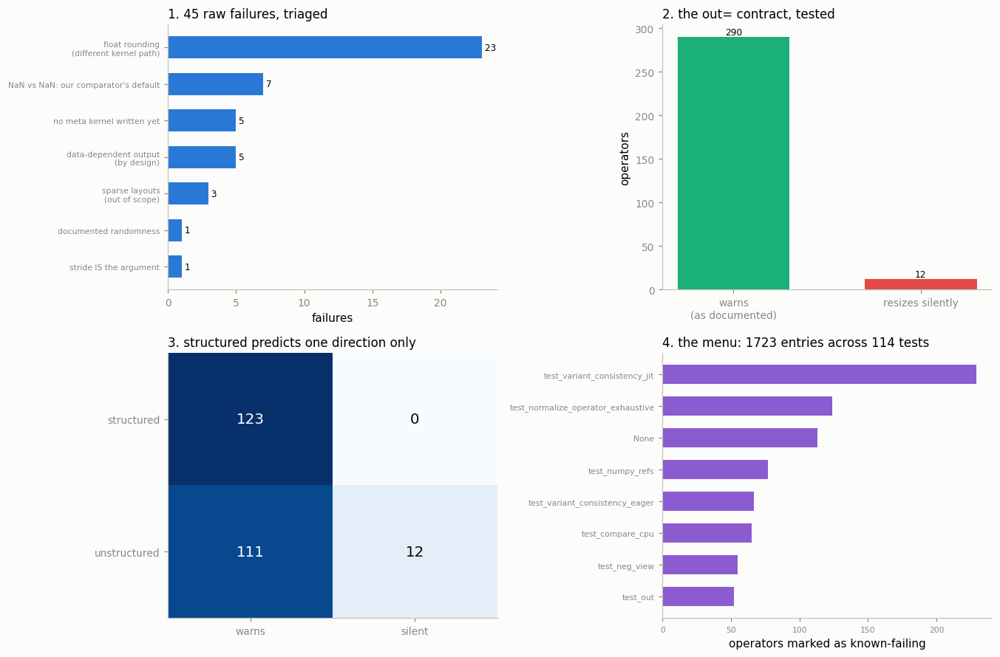

# Fix a "Good First Issue"

---

> The best way to learn a codebase is to fix something real inside it.

---

## Key Insight

PyTorch labels some open issues "good first issue" — small, well-scoped bugs or features meant for newcomers. Fixing one walks you through the full contributor workflow: find the code, change it, test it, and open a pull request.

## Why This Matters

Reading the source teaches you how PyTorch works; fixing an issue teaches you how to change it. It is the step that turns you from a user of PyTorch into a contributor to it.

---

**This is project 57.**

### Why this project does not browse the issue tracker

The obvious version of this exercise is: open GitHub, filter by
`label:"good first issue"`, pick one. That is a fine way to spend an afternoon
and a poor way to learn anything durable — the list changes weekly, the good
ones are claimed within hours, and you learn how to read a webpage.

This project does the harder and more useful half instead: **finding a bug
nobody told you about.** It hunts through the PyTorch you have installed, finds
a real inconsistency, explains its cause from the source, writes the fix,
validates the fix, and writes the test. Then — at the end, deliberately — it
discovers that the maintainers were already tracking it, in a place that turns
out to be a menu of a thousand more.

Every earlier project of this phase is used:

| From | Used for |
|---|---|
| [53](../53-trace-one-op-end-to-end/README.md) | the dispatch table, to find which kernel to look at |
| [54](../54-read-native-functions-yaml/README.md) | `native_functions.yaml`, to explain *why* the bug exists |
| [55](../55-build-pytorch-from-source/README.md) | knowing what the fix would cost to build for real |
| [56](../56-patch-and-rebuild/README.md) | `TORCH_LIBRARY_IMPL`, to apply and test the fix in 16 s |

### The words first

- **[Property-based testing](/shared/glossary/#property-based-testing)** means
  checking a rule that must hold for *every* input ("the answer does not depend
  on memory layout") instead of checking specific expected outputs. You need no
  answer key, so you can test thousands of cases you never thought about.
- **[OpInfo](/shared/glossary/#opinfo)** is PyTorch's database of operator
  metadata: for each operator, how to build valid inputs, which dtypes it
  supports, and which of its own tests are known to fail. It ships inside your
  wheel.
- **[Expected failure](/shared/glossary/#expected-failure)** is a test marked
  "this is known to fail". The suite runs it, expects the failure, and goes red
  if it ever *passes* — which is how a fix gets noticed.
- A **[minimal reproduction](/shared/glossary/#minimal-reproduction)** is the
  smallest program that shows the bug. Producing one is most of the work in any
  bug report.
- The **[`out=` variant](/shared/glossary/#out-variant)** of an operator writes
  its result into a buffer you supply instead of allocating a new one.

### What is real here

`op_db`, PyTorch's OpInfo database, is importable from your installed wheel:
**697 entries covering 634 operators**, 359 of which claim `out=` support. Two
seconds to import. Every number below comes from running against that.


> **About the numbers.** Every figure quoted below comes from the committed
> [`outputs/findings.csv`](outputs/findings.csv), produced by one run of `run.py` on this
> machine. Counts (kernels, operators, files) are exact and reproducible; timings move a
> few percent between runs because the machine is shared, so re-running will not reproduce
> the microseconds digit for digit.



---

## 1. The hunt, part 1: two properties

Two rules that any correct implementation must satisfy:

- **Property A — the [meta](/shared/glossary/#meta-tensor) device agrees.**
  Running an op on meta tensors (shape and dtype, no data) must predict the same
  shape and dtype as running it for real.
- **Property B — layout invariance.** An op must give the same answer on a
  non-contiguous input as on a contiguous copy of the same numbers. Memory
  layout is not part of the mathematics.

| | |
|---|---|
| Property A checks | 565 |
| Property A failures | **13** |
| Property B checks | 387 |
| Property B failures | **32** |
| **Raw failures** | **45** |
| Sweep time | **4.6 s** |

Forty-five failures in under five seconds. If you stopped here you would file
forty-five issues and lose your reviewers forever.

---

## 2. Triage: 45 failures, 0 bugs

| Bucket | Count | Why it is not a bug |
|---|---|---|
| float rounding (different kernel path) | **23** | a non-contiguous input takes the scalar path instead of the vectorised one; differences ~1e-7 |
| NaN vs NaN: our comparator's default | 7 | `assert_close` treats NaN ≠ NaN unless you pass `equal_nan=True` — **our** bug |
| no meta kernel written yet | 5 | a gap, not a wrong answer |
| data-dependent output (by design) | 5 | `nonzero` cannot know the output shape without the data |
| sparse layouts (out of scope) | 3 | our harness fed a strided tensor to a sparse op |
| documented randomness | 1 | `normal` returns different numbers each call — that is the job |
| stride IS the argument | 1 | `as_strided` reinterprets strides; changing them changes the meaning |
| **SURVIVORS** | **0** | |

**Zero.** The largest "failures" by size tell the story:

| Op | absolute | relative |
|---|---|---|
| `normal` | 13.5 | 1.17 |
| `as_strided` | 8.07 | 1.00 |
| `matmul` | 1.53e-05 | **2.02e-07** |
| `inner` | 4.77e-07 | 1.76e-07 |

Two enormous ones that are correct by definition, then a cliff to 1e-7 —
float32's rounding floor, the same boundary
[project 52](../52-eager-vs-compile-diff/README.md) measured. **A bimodal
distribution is itself the triage tool:** huge differences are semantic, tiny
ones are arithmetic, and nothing lives in between.

Three of these buckets deserve a name, because you will meet them again:

- **Your comparator has defaults.** `assert_close` with `equal_nan=False`
  invented 7 bugs. Before blaming the library, read your own assertion.
- **Some behaviour is documented.** `native_functions.yaml`'s tags
  (`data_dependent_output`, `nondeterministic_seeded` — project 54) tell you
  which failures are contractual. The triage above uses those tags rather than
  a hand-written exception list.
- **The mature-codebase prior is right.** A five-second sweep does not find
  correctness bugs in a library this heavily tested. **Look for contract
  violations instead** — behaviour that is not *wrong* but is not *consistent*.

---

## 3. The hunt, part 2: the `out=` contract

PyTorch documents a rule for `out=`:

> If the `out` tensor has the wrong shape, it is resized — and if it was not
> empty, **a warning is issued**, because silently discarding a buffer the
> caller supplied is how data goes missing.

That is a contract, so it is testable across every operator that supports `out=`.
(The test perturbs only the last dimension, copying PyTorch's own `test_out`
exactly, so a disagreement cannot be blamed on a different test.)

| | |
|---|---|
| Operators tested | **302** |
| Warn, as documented | **290** |
| **Resize silently** | **12** |

The twelve: `addbmm`, `arange`, `bernoulli`, `empty`, `full`, **`log_sigmoid`**,
`multinomial`, `narrow_copy`, `normal`, `ones`, `randn`, `zeros`.

And the sharpest evidence — sibling operators, same family, same shape of call:

| | warns on resize |
|---|---|
| `torch.sigmoid(x, out=y)` | **True** |
| `torch.tanh(x, out=y)` | **True** |
| `torch.threshold(x, 0, 0, out=y)` | **True** |
| **`F.logsigmoid(x, out=y)`** | **False** |

A control that differs in exactly one thing is worth a hundred assertions. Here
is the minimal reproduction ([`outputs/repro.py`](outputs/repro.py)):

```python
import torch, warnings
x = torch.randn(20)
out = torch.empty(21)                      # wrong shape, NOT empty
with warnings.catch_warnings(record=True) as w:
    warnings.simplefilter("always")
    torch.nn.functional.logsigmoid(x, out=out)
print(out.shape, [str(m.message)[:40] for m in w])
# torch.Size([20]) []      <- resized, no warning
torch.sigmoid(x, out=torch.empty(21))      # the sibling op DOES warn
```

Six lines. **This is the deliverable** — the artefact that turns "I noticed
something" into a report a maintainer can act on in thirty seconds.

---

## 4. Why: structured vs unstructured

Project 54 gives the explanation without opening a single `.cpp` file:

| Operator | warns? | `structured`? |
|---|---|---|
| `sigmoid.out` | yes | **True** |
| `tanh.out` | yes | **True** |
| `threshold.out` | yes | **True** |
| `add.out` | yes | **True** |
| `baddbmm.out` | yes | **True** |
| `log_sigmoid.out` | **no** | **False** |
| `addbmm.out` | **no** | **False** |
| `narrow_copy.out` | **no** | **False** |

Six for six, then three for three the other way.

A [structured kernel](/shared/glossary/#structured-kernel) does not resize its
own output — the *generator* writes that code, once, and the generated code
calls `at::native::resize_output`, which warns. An unstructured kernel
hand-writes its own resize, and whoever wrote it chose whichever function came
to mind.

The database even names the guilty function:

```
the kernel that actually resizes : log_sigmoid_forward_out_cpu
```

In `aten/src/ATen/native/Activation.cpp`:

```cpp
std::tuple<Tensor&, Tensor&> log_sigmoid_forward_out_cpu(
    const Tensor& input, Tensor& result, Tensor& buffer) {
  result.resize_as_(input);          // <-- silent
  buffer.resize_as_(input, at::MemoryFormat::Contiguous);
  ...
```

`resize_as_` resizes and says nothing. `at::native::resize_output` resizes and
warns. **One function call, chosen years ago, is the entire bug.** That is what
a good first issue looks like from the inside.

---

## 5. Testing the explanation — and watching it half-fail

The obvious next claim: *unstructured ops are the ones that resize silently.*
Test it on all 246 operators whose entry we can read:

| | warns | silent |
|---|---|---|
| **structured** | **123** | **0** |
| **unstructured** | 111 | 12 |

| | |
|---|---|
| `P(warns \| structured)` | **1.00** |
| `P(silent \| unstructured)` | **0.098** |
| accuracy of "structured ⇔ warns" | **0.549** |

**The rule is perfect in one direction and nearly useless in the other.**
Structured ops *never* get this wrong — 123 out of 123 — because they do not
write the code that could get it wrong. But 111 of 123 unstructured ops warn
correctly anyway: their authors called `resize_output` by hand, as they should.

So "unstructured" is **necessary but not sufficient**. In plain terms: being
unstructured is what makes the mistake *possible*, not what makes it *happen*.
A predictor built on it alone scores **54.9%** — barely better than a coin
flip — even though the underlying explanation is correct.

This is worth sitting with, because the failure mode is common: a hypothesis
that explains your three examples perfectly, and then collapses on the full
population. **Three examples cannot distinguish "causes" from "permits".** The
only way to find that out is to test the rule on everything, which took two
lines and no new data.

---

## 6. Search before you file — in the right place

The instinct is to search GitHub issues. There is a better index, and it is on
your disk: **the OpInfo skip list.**

```python
[oi.name for oi in op_db
         for skip in oi.skips if skip.test_name == "test_out_warning"]
```

**27 operators** carry an `expectedFailure` marker for `test_out_warning`:

```
_batch_norm_with_update, _native_batch_norm_legit, addbmm, arange, bernoulli,
empty, empty_permuted, eye, full, linspace, log_sigmoid, logcumsumexp, logspace,
lu, max_pool2d_with_indices_backward, mode, multinomial, narrow_copy,
native_batch_norm, nonzero, nonzero_static, normal, ones, randint, randn,
sparse.sampled_addmm, zeros
```

Compare with our sweep:

| | |
|---|---|
| Operators our sweep found silent | **12** |
| Of those, already tracked | **12** |
| **Precision against the maintainers' own list** | **1.00** |
| Tracked but not found by our sweep | 15 |

**Every single operator we found is on their list.** The 15 we missed are the
sweep's recall problem, not a disagreement: it tests one sample per operator and
skips shapes it cannot build.

Two conclusions, one nice and one better.

**The nice one:** the method works. An independent five-second sweep reproduced
a curated list exactly, with no false positives.

**The better one:** `expectedFailure` is not a dismissal — it means *the test
runs, the failure is expected, and the suite goes red if someone fixes it
without removing the marker.* It is a tracked, unfixed, small, well-understood
bug. **That is the definition of a good first issue**, and it is sitting in a
Python file in your site-packages rather than on an issue tracker.

And there are more:

| | |
|---|---|
| Total skip/xfail entries in `op_db` | **1,723** |
| Distinct tests they cover | **114** |

The top of that list ([`outputs/good_first_issue_menu.txt`](outputs/good_first_issue_menu.txt)):

| Test | Operators marked |
|---|---|
| `test_variant_consistency_jit` | 229 |
| `test_normalize_operator_exhaustive` | 124 |
| `test_numpy_refs` | 77 |
| `test_variant_consistency_eager` | 67 |
| `test_compare_cpu` | 65 |
| `test_out` | 52 |

**1,723 places where PyTorch's own tests say "this is known not to work."** Each
one is scoped, reproducible, and already has a test waiting to confirm the fix.
No issue tracker has a better queue than this.

---

## 7. The fix, written and validated

The real patch is one line in `Activation.cpp`. But you can validate it *now*,
without the hour that [project 55](../55-build-pytorch-from-source/README.md)
priced, using [project 56](../56-patch-and-rebuild/README.md)'s technique:

```cpp
at::Tensor& fixed_log_sigmoid_out(const at::Tensor& self, at::Tensor& out) {
  at::native::resize_output(out, self.sizes());   // <-- the fix: warns
  at::Tensor buffer = at::empty({0}, self.options());
  at::log_sigmoid_forward_out(out, buffer, self); // arithmetic unchanged
  return out;
}

TORCH_LIBRARY_IMPL(aten, CPU, m) {
  m.impl("log_sigmoid.out", TORCH_FN(fixed_log_sigmoid_out));
}
```

Built in **16.2 s**. Results:

| | before | after |
|---|---|---|
| warns on resize | **False** | **True** |
| value correct | True | **True** |
| `sigmoid`, `tanh` still correct | — | **True** |
| empty `out=` still resizes quietly | — | **True** |

That last row is the one a reviewer will ask about. Resizing an **empty**
`out=` tensor is the normal path — `torch.empty(0)` is how you say "allocate it
for me" — and it must stay silent, or every well-written program starts
printing warnings. A fix that turns a silent bug into a noisy regression is not
a fix. The check confirms `out=torch.empty(0)` still resizes to `(20,)` with no
warning.

And the dispatch table proves whose kernel ran:

```
aten::log_sigmoid.out  CPU -> ~/.cache/torch_extensions/py312_cu128/p57_fix/main.cpp:21
```

---

## 8. The test that would go in the pull request

A fix without a test will not be merged. This one uses PyTorch's own assertion
helper and covers both directions:

```python
class TestLogSigmoidOutWarning(unittest.TestCase):
    def test_out_warning_on_resize(self):
        x, out = torch.randn(20), torch.empty(21)
        with self.assertWarnsRegex(UserWarning, "An output with one or more elements"):
            torch.nn.functional.logsigmoid(x, out=out)
        self.assertEqual(out.shape, torch.Size([20]))
        torch.testing.assert_close(out, torch.nn.functional.logsigmoid(x))

    def test_no_warning_when_out_is_empty(self):
        x, out = torch.randn(20), torch.empty(0)
        with warnings.catch_warnings(record=True) as w:
            warnings.simplefilter("always")
            torch.nn.functional.logsigmoid(x, out=out)
        self.assertFalse(any("An output with one or more elements" in str(m.message)
                             for m in w))
```

```
tests run : 2      failures : 0      errors : 0      -> PASS
```

(Output in [`outputs/test_output.txt`](outputs/test_output.txt); the filled-in
report in [`outputs/issue.md`](outputs/issue.md).)

### What a real pull request needs beyond this

1. **The one-line change** in `aten/src/ATen/native/Activation.cpp`.
2. **Remove the `expectedFailure`** from `nn.functional.logsigmoid`'s OpInfo in
   `torch/testing/_internal/common_methods_invocations.py`. Forgetting this
   turns CI red *because the test now passes* — the marker exists precisely to
   catch the fix.
3. **Run the real test**: `python test/test_ops.py -k test_out_warning`.
4. **Lint**: `lintrunner -a`.
5. **A PR description** with the repro, the cause, and the before/after.

Steps 2 and 3 are where first-time contributors are most often surprised, and
they follow directly from understanding what `expectedFailure` means.

---

## What to remember

1. **Property-based sweeps are cheap and mostly wrong.** 45 raw failures in 4.6
   seconds, **0** of them bugs after triage.
2. **Triage before you file.** 7 of the 45 came from our own comparator's
   `equal_nan=False` default. Suspect your instrument first.
3. **Failure sizes are bimodal**: ~1e-7 means rounding, ~1e+1 means semantics,
   and nothing lands in between.
4. **In a mature library, hunt contract violations, not wrong answers.** The
   `out=` rule found 12 real ones where correctness testing found none.
5. **A sibling comparison is the strongest evidence available.** `sigmoid`
   warns, `logsigmoid` does not, and everything else about the two calls is the
   same.
6. **`structured` predicts correctness in exactly one direction**: 123/123
   structured ops warn, but only 9.8% of unstructured ops are broken. The rule
   that explains your three examples scores **54.9%** on the population.
7. **Every one of the 12 operators we found was already on the maintainers'
   expected-failure list** — precision 1.00. Search the codebase before the
   issue tracker.
8. **`op_db` holds 1,723 known-failure markers across 114 tests.** That is a
   queue of scoped, reproducible, test-backed tasks, and almost nobody reads it.
9. **You can validate a core fix in 16 seconds** with `TORCH_LIBRARY_IMPL`,
   before deciding whether the hour-long rebuild is worth it.
10. **Check that the fix does not become noise.** Empty `out=` must stay silent.

---

## Try it yourself

- Run the section 3 sweep with more than one sample per operator. Do the 15
  tracked-but-unfound operators appear?
- Pick another entry from `outputs/good_first_issue_menu.txt` —
  `test_variant_consistency_eager` has 67 — and find out what the inconsistency
  actually is for one operator.
- Fix `narrow_copy` the same way and check whether its resize path is the same
  `resize_as_` call or a different one.
- Add a third property to section 1: `op(x)` versus `op(x.clone())` on an input
  the op is documented not to modify. Any survivor is a real aliasing bug.

---

## The end of the phase, and of the guide

Five projects that started from "what happens when I type `a + b`":

- **[53](../53-trace-one-op-end-to-end/README.md)** followed one operator down
  to its kernel, and found 55% of a small call was Python.
- **[54](../54-read-native-functions-yaml/README.md)** read the file that
  declares all 3,184 operators, and predicted the runtime perfectly once one
  extra rule was added.
- **[55](../55-build-pytorch-from-source/README.md)** ran the build's first
  stage for real and landed one line away from the dispatcher's own report.
- **[56](../56-patch-and-rebuild/README.md)** replaced a kernel in 16.5 seconds,
  and found that a Python instrument doubled the work it was measuring.
- **57** used all four to find a real bug, explain it, fix it, and test it.

The thread through the whole phase: **PyTorch's source is not a wall of C++ to
be admired — it is a set of tables, files and registrations you can print,
query, regenerate and replace from a Python prompt.** Once the framework is
something you can query rather than something you must trust, every question you
have about it becomes answerable.
