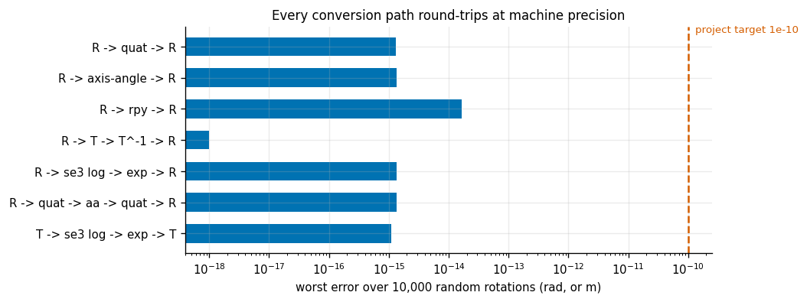
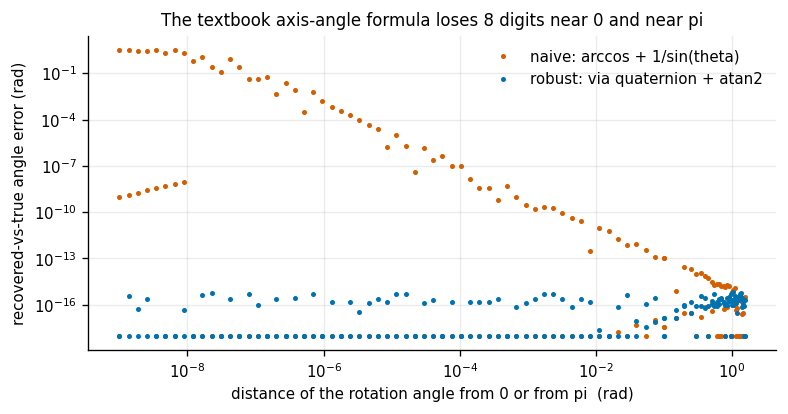
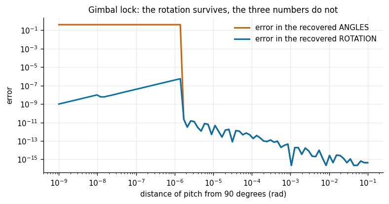
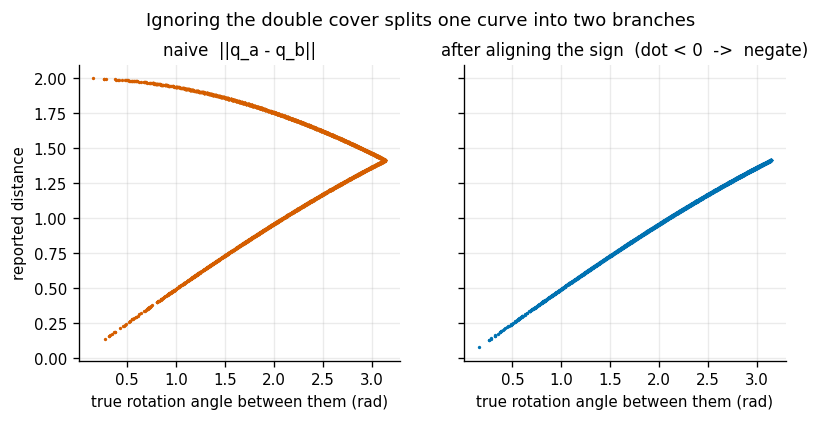
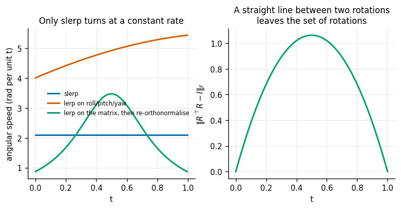
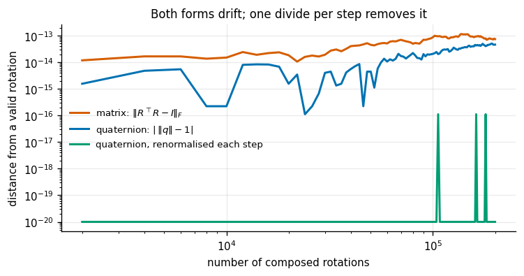

# Transform Calculator

## Key Insight

A rotation in 3D has only three [degrees of freedom](/shared/glossary/#degrees-of-freedom), yet robotics code stores it in several different shapes — a 3×3 [rotation matrix](/shared/glossary/#se3--so3), a four-number [quaternion](/shared/glossary/#quaternion), or a three-number [axis-angle](/shared/glossary/#axis-angle) vector — because each shape is best at a different job: matrices compose by plain multiplication, quaternions interpolate smoothly and never suffer [gimbal lock](/shared/glossary/#gimbal-lock), and axis-angle vectors are the natural variables for optimization. The skill this project drills is converting between those shapes and round-tripping back to the original without drift, because a real codebase mixes all three and a silent conversion bug sends your [gripper](/shared/glossary/#gripper) to the wrong orientation while still reporting success. Round-tripping 10,000 random rotations and checking that the error stays below 1e-10 is how you prove the math itself is correct, not just that one lucky example happened to work.

**This is project 1.** It builds `transforms.py` — the rotation library that projects [2](../02-urdf-visualizer/README.md) through [7](../07-hand-eye-calibration/README.md) all import — and then runs seven experiments on it. The round-trip test passes with room to spare (**1.7e-14**, four thousand times better than the 1e-10 target), so the interesting results are the other six. Two of them contradict things you will read in textbooks and tutorials.

---

## Files

| file | what it is |
|---|---|
| `transforms.py` | the library: conversions, distances, interpolation, 4×4 transforms |
| `plot_style.py` | shared figure styling, imported by every project in this phase |
| `run.py` | the seven experiments |
| `outputs/` | figures and `results.csv` |

```bash
python3 run.py       # about 12 seconds, NumPy and Matplotlib only
```

---

## The four shapes, and why there are four

You will meet the same rotation written four ways. They are not redundant — each one is the *only* good answer to a different question.

| shape | numbers | good at | bad at |
|---|---|---|---|
| [rotation matrix](/shared/glossary/#se3--so3) `R` | 9 | composing (`R₁ @ R₂`), rotating a vector | 9 numbers for 3 [DoF](/shared/glossary/#degrees-of-freedom); drifts off the valid set |
| [quaternion](/shared/glossary/#quaternion) `(w,x,y,z)` | 4 | storage, interpolation, no [gimbal lock](/shared/glossary/#gimbal-lock) | unreadable; two of them mean the same rotation |
| [axis-angle](/shared/glossary/#axis-angle) `r = θ·axis` | 3 | optimisation variables, "how far apart are these?" | needs care near θ = 0 and θ = π |
| [roll](/shared/glossary/#roll)-[pitch](/shared/glossary/#pitch)-[yaw](/shared/glossary/#yaw) ([Euler angles](/shared/glossary/#euler-angles)) | 3 | humans reading a log file | singular; different triples can name one rotation |

> **"Nine numbers for three degrees of freedom — isn't a rotation matrix just wasteful?"** It is redundant, and that redundancy is what you are paying for. Applying a rotation to a vector, or composing two rotations, is one matrix product — the hardware already does that fast, with no trigonometry anywhere. The compact forms have to be *unpacked* into something matrix-shaped before they can act on anything. So the rule is: store compactly (quaternion), compute in matrices, optimise in axis-angle vectors, and print roll-pitch-yaw only for humans.

One detail worth naming early, because the whole phase depends on it: the axis-angle form stores the angle *as the length of the vector*. `r = (0, 0, 0.5)` means "half a radian about z". So "no rotation" is simply the zero vector — no special case, no unit-length constraint, nothing to renormalise. That is exactly what an optimiser wants, and it is why the [inverse kinematics](/shared/glossary/#inverse-kinematics) in project [5](../05-damped-least-squares-ik/README.md) measures orientation error in this form and no other.

### One convention you must write down

There are two conventions for the four quaternion numbers: scalar-first `(w, x, y, z)` and scalar-last `(x, y, z, w)`. This library uses **scalar-first**; ROS uses **scalar-last**. Neither is more correct, and mixing them produces a rotation that is wrong in a plausible-looking way. Every function here states which one it wants in its docstring, which costs one line and saves an afternoon.

---

## 1. Every conversion path round-trips at machine precision



10,000 rotations drawn **uniformly** over the space of all rotations, pushed out to every other representation and back:

| path | worst error over 10,000 rotations |
|---|---|
| `R → quaternion → R` | 1.3e-15 rad |
| `R → axis-angle → R` | 1.3e-15 rad |
| `R → roll-pitch-yaw → R` | 1.7e-14 rad |
| `R → 4×4 → inverse → inverse → R` | 0.0 (exactly) |
| `R → SE(3) log → exp → R` | 1.3e-15 rad |
| full 4×4 including translation, log → exp | 1.1e-15 m |

Two details make this a real test rather than a decorative one.

**Sampling uniformly is harder than it looks.** Drawing roll, pitch and yaw from a uniform distribution does *not* give uniform rotations — it bunches them near the poles, exactly where that representation misbehaves, so a bug there would be over-tested and bugs elsewhere under-tested. The correct recipe is one line: draw four numbers from a Gaussian and normalise. A Gaussian in 4D is spherically symmetric, so the direction it points is uniform on the sphere of unit quaternions, which is uniform on rotations.

**Two different error measures are reported.** The *geodesic* error asks "by what angle did the rotation move?" — the physically meaningful question. The *elementwise* error asks "how far did any single matrix entry move?" — what a unit test usually checks. They agree here within a factor of two, but they can diverge, and knowing which one you are looking at matters when a number surprises you.

The `4×4 → inverse → inverse` path returns **exactly** zero, which is not luck. `T_inv` never calls a general matrix inverse; it uses the structure of a rigid transform directly:

```
T⁻¹ = [[Rᵀ, −Rᵀp], [0, 1]]
```

Transposing and negating are exact operations in floating point, so inverting twice returns the identical bits. Calling `np.linalg.inv` instead would spend a full factorisation rediscovering a fact you already knew, and would come back a few bits off.

---

## 2. The textbook axis-angle formula loses eight digits



Almost every reference gives this recipe for pulling an axis and angle back out of a rotation matrix:

```
θ    = arccos((trace(R) − 1) / 2)
axis = unskew(R − Rᵀ) / (2 sin θ)
```

It is correct algebra and a poor program. Both halves fail in the same two places:

- `arccos` has an infinite slope at its endpoints. A round-off error of 1e-16 in the trace becomes an error of about **1e-8** in θ — eight digits gone, for free, near θ = 0.
- Dividing by `sin θ` explodes as θ approaches 0 **or** π. Near π the numerator `R − Rᵀ` also goes to zero, so you are computing 0/0 and the answer is whatever the round-off happened to be.

The robust route goes through the [quaternion](/shared/glossary/#quaternion) instead and uses `θ = 2·atan2(‖vec‖, w)`. `atan2` takes the two parts separately and never divides them itself, so there is no small denominator anywhere, and it stays accurate across the whole range.

The plot sweeps both from θ = 1e-9 up to θ = π − 1e-9:

| | worst error | error at θ = π − 1e-9 |
|---|---|---|
| naive formula | **3.14 rad** | 3.14 rad |
| robust formula | 7e-16 rad | 0.0 |

A 3.14 rad error means the function was handed a rotation of nearly 180° and confidently reported "no rotation at all". Nothing crashes. Nothing warns. Downstream, a controller told the arm is already aligned simply stops correcting.

> **A guard clause that causes the bug it was meant to prevent.** The obvious defence is `if theta < 1e-12: return zeros`. In the robust version that guard is actively harmful: `θ/‖vec‖` there is a ratio of two small numbers that stays perfectly conditioned, so the correct threshold is *exactly zero*. A 1e-12 guard would silently round away every rotation smaller than a millionth of a degree — and small rotations are precisely what an [IK](/shared/glossary/#inverse-kinematics) solver spends its last iterations on.

The root cause here is [machine epsilon](/shared/glossary/#machine-epsilon): a double carries about 16 significant digits, and a badly conditioned formula spends them. Project [4](../04-jacobian-from-scratch/README.md) hits the same wall from the other direction, where it sets a hard ceiling on how well [finite differences](/shared/glossary/#finite-difference) can ever agree with an analytic derivative.

---

## 3. Gimbal lock: the rotation survives, the three numbers do not



[Gimbal lock](/shared/glossary/#gimbal-lock) is usually explained with a picture of mechanical rings collapsing. Here is the numerical version. Sweep pitch toward 90° and round-trip `rpy → R → rpy`:

- the recovered **rotation** stays good for a long time, then degrades to about **5.6e-7 rad** as pitch approaches 90°
- the recovered **angles** are wrong by **0.4 rad** — which happens to be the exact value of the roll we started with

At pitch = 90° the roll axis and the yaw axis point the same way. Only their *sum* is determined; the individual values are not. The measurement that makes this concrete:

```
rpy = (0.0, 90°, 0.0)   and   rpy = (0.8, 90°, 0.8)
                        →  the same rotation, to 4.8e-17 rad
```

Two completely different-looking angle triples, one physical orientation. Any code that compares poses by subtracting roll-pitch-yaw triples will report a large error between these two *identical* orientations.

The name is worth decoding. A gimbal is a set of nested pivoting rings, used since antiquity to keep a ship's compass level. Each ring supplies one rotational freedom. When two rings become coplanar they turn about the same line, and the assembly *loses a degree of freedom* — it is "locked" out of one direction of motion. Roll-pitch-yaw is a gimbal made of arithmetic, and it inherits the same failure. It is also the same phenomenon you will meet as a [kinematic singularity](/shared/glossary/#kinematic-singularity) in project [5](../05-damped-least-squares-ik/README.md), where two *joint* axes line up and the arm loses a direction of motion. Same geometry, different hardware.

---

## 4. The double cover, and the one line that fixes it



`q` and `−q` are the same rotation. This is the [double cover](/shared/glossary/#double-cover), and it is not an edge case — anything that produces quaternions (a solver, a filter, a neural network) has no reason to prefer one sign, so both appear in real data constantly.

Take 4,000 random pairs of rotations, flip the sign of half the second elements, and compare the naive distance `‖qₐ − q_b‖` against the true angle between them:

| distance measure | correlation with the true rotation angle |
|---|---|
| naive `‖qₐ − q_b‖` | **0.17** |
| after aligning the sign (`if dot < 0: negate`) | **0.999** |

The left panel shows why the correlation collapses: one curve splits into two branches. Worse than a weak correlation, the ordering *inverts* — the pair the naive distance calls closest is actually **0.28 rad apart**, while genuinely identical rotations can score the maximum distance of 2.0. A loss function built on this would push a model away from the right answer.

The fix is one line, and it is the same line that lives inside [slerp](/shared/glossary/#slerp):

```python
if np.dot(qa, qb) < 0:
    qb = -qb
```

> **"Why not just always store the `w ≥ 0` representative and forget about it?"** Because that half-sphere has an edge. A rotation passing smoothly through 180° crosses it, and the stored value jumps discontinuously from one side to the other. For inert storage that is fine; for anything that differentiates, interpolates or filters, the jump is a cliff. Canonicalising at *comparison* time is safe; canonicalising at *storage* time is not.

---

## 5. Interpolation: only one of three methods turns at a constant rate



Rotate from orientation A to orientation B over `t ∈ [0, 1]`, three ways, and measure the angular speed along the way. A perfect answer is a flat line.

| method | fastest-to-slowest speed ratio |
|---|---|
| [slerp](/shared/glossary/#slerp) | **1.000** |
| interpolate roll-pitch-yaw linearly | 1.36 |
| interpolate the matrix linearly, then re-orthonormalise | 3.99 |

Slerp is *spherical linear interpolation*: it walks along the surface of the unit-quaternion sphere at a constant angular rate. The name says exactly what it does — linear interpolation, but on a sphere instead of in a straight line.

The right panel measures why a straight line is wrong. Halfway between two rotation matrices, `‖RᵀR − I‖` reaches **1.06** — the average of two rotations is not a rotation at all. It is a squashed matrix that shrinks some directions and stretches others, and if you hand it to code that assumes a rotation, that code is now wrong in a way no assertion catches. Re-orthonormalising with the [SVD](/shared/glossary/#singular-value-decomposition) rescues validity but not smoothness: the speed still swings by 4×.

Why that matters on hardware: a lurching orientation profile means a lurching angular *acceleration*, which means a torque spike, which the joint controller will chase and overshoot. Interpolation quality is not cosmetic.

---

## 6. Drift: the folklore has the mechanism right and the scale wrong



Compose 200,000 small random rotations and watch how far each representation wanders from being valid:

| representation | distance from valid after 200,000 compositions |
|---|---|
| matrix, `‖RᵀR − I‖` | 7.4e-14 |
| quaternion, `‖q‖ − 1`, never renormalised | 4.6e-14 |
| quaternion, renormalised every step | **0.0** |

This is an honest correction to something often stated too strongly. You will read that rotation matrices "drift badly" while quaternions do not. The mechanism is real — both accumulate round-off, both leave their valid set — but after 200,000 compositions, roughly an hour of a 60 Hz control loop, both are off by less than a ten-trillionth. Neither is a crisis.

What *is* worth knowing is the cost of the cure. Restoring a quaternion costs one square root and one divide. Restoring a matrix requires an [SVD](/shared/glossary/#singular-value-decomposition), hundreds of times more work. Quaternions do not win by drifting less; they win by being **cheap to repair**.

---

## 7. The honest inversion: quaternions are slower here

The guide's Phase 1 notes point out that composing two rotations costs 27 multiplies as matrices and 16 as quaternions. That arithmetic is correct. Measured in this NumPy implementation:

| operation | measured |
|---|---|
| one 3×3 matrix product | **1,164 ns** |
| one quaternion product | **3,230 ns** |
| quaternion speed-up | **0.36×** — that is, 2.8× *slower* |

The 16-versus-27 count is real and irrelevant at this scale. A 3×3 matrix product is a single call down into optimised C; a hand-written quaternion product is a dozen Python-level operations, each carrying interpreter overhead that dwarfs the arithmetic entirely. The ranking would flip in C, or on batches of thousands, or on a microcontroller — but *in this program, on this data*, the matrix wins.

The transferable lesson is not "quaternions are slow". It is that an operation-count argument predicts the winner only when arithmetic is what you are actually paying for. **Measure before you optimise.** The real reasons to reach for quaternions are the other rows of the table:

| | matrix | quaternion |
|---|---|---|
| bytes per rotation | 72 | **32** |
| gimbal lock | never | never |
| clean constant-rate interpolation | no | **yes** |
| cost to repair drift | an SVD | one divide |

---

## What the library gives the rest of the phase

```python
import transforms as tf

R  = tf.rpy_to_R([0.1, 0.2, 0.3])     # URDF convention: Rz(yaw) Ry(pitch) Rx(roll)
q  = tf.R_to_quat(R)                  # (w, x, y, z), Shepperd's method
r  = tf.R_to_axis_angle(R)            # rotation vector, robust at every angle
T  = tf.T_from_Rp(R, [0.4, 0, 0.5])   # 4x4 homogeneous transform
Ti = tf.T_inv(T)                      # structural inverse, not np.linalg.inv
e  = tf.pose_error(T_current, T_goal) # 6-vector (dp, dw) -- the IK workhorse
```

`pose_error` is the one to remember. It returns position error in metres stacked on orientation error as an axis-angle vector in radians — the exact 6-vector that projects [5](../05-damped-least-squares-ik/README.md), [6](../06-null-space-posture-control/README.md) and [7](../07-hand-eye-calibration/README.md) feed to a [Jacobian](/shared/glossary/#jacobian).

`R_to_quat` uses **Shepperd's method** rather than the one-line formula. The naive version computes `w = sqrt(1 + trace(R)) / 2` and then divides by `w` to get the rest — which dies for a 180° rotation, where `w` is zero. Shepperd's trick is to look at four candidate expressions and expand whichever is largest, so the divisor is never small. Same answer, no bad region.

There is also `se3_log` / `se3_exp`, the [exponential map](/shared/glossary/#exponential-map) for full rigid transforms. `se3_log(T)` answers "what single constant screw motion, run for one second, produces exactly this transform?" — the [screw theory](/shared/glossary/#screw-theory) view the guide mentions. Project [5](../05-damped-least-squares-ik/README.md) contains a worked account of what goes wrong when that screw [twist](/shared/glossary/#twist) is used where a point-velocity twist was wanted: an 110 mm tracking error on a path 200 mm long.

---

## What to take away

1. **Round-tripping is a real test, and it needs uniform sampling.** Uniform roll-pitch-yaw is not uniform rotations, so it tests the wrong places.
2. **The textbook axis-angle formula is unusable near 0 and π.** Route through the quaternion, use `atan2`, and do not add a small-angle guard to the robust version — the guard is the bug.
3. **Gimbal lock destroys the numbers, not the rotation.** Never compare orientations by subtracting Euler angles.
4. **Handle the double cover at comparison time.** One line. Without it, distance measures are not merely noisy — they are ordered wrongly.
5. **A straight line between two rotations leaves the set of rotations.** Use slerp.
6. **Drift is real but slow; what differs is the price of the cure.** One divide versus an SVD.
7. **Measure before you optimise.** A 16-versus-27 multiply-count argument loses to interpreter overhead by 2.8×.

## Next

Project [2](../02-urdf-visualizer/README.md) uses this library to load a real robot description and draw it.
