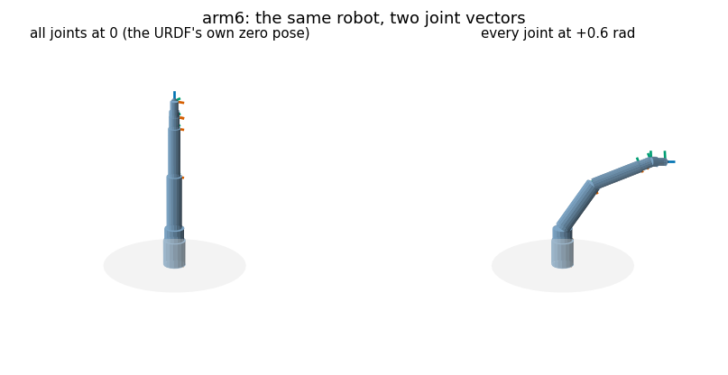
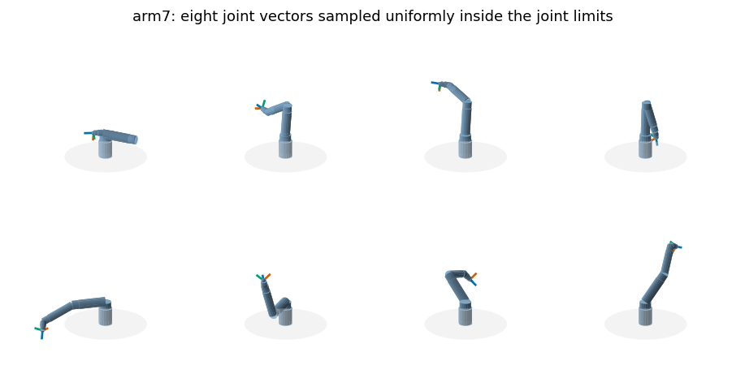
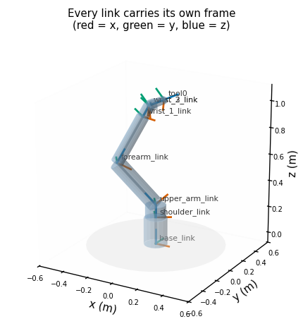
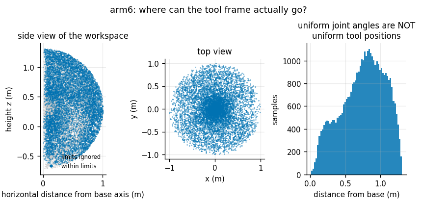

# URDF Visualizer

## Key Insight

A robot is a tree of [rigid](/shared/glossary/#rigid-body) links joined by movable joints, and a [URDF](/shared/glossary/#urdf--mjcf--usd) file is the standard text description of that tree — each link's shape and mass, each joint's axis and motion limits, and how they nest from the base out to the hand. Loading that file and drawing the robot at random joint angles turns an abstract spec into a picture, which is the fastest way to catch a flipped axis or a mis-parented link before it wastes hours on real hardware. This is also your first hands-on use of a fast rigid-body library like [Pinocchio](/shared/glossary/#pinocchio) — the [kinematics](/shared/glossary/#kinematics)-and-dynamics engine you will lean on for the rest of the guide.

**This is project 2.** It writes the URDF parser from scratch in about 120 lines, builds three robots that the whole phase then uses, draws them, and — because a picture only proves that *something* was drawn — checks the parse against a completely independent implementation. Agreement: **4.4e-16 m**, the last bit of a double.

> **A note on libraries.** The Key Insight suggests [Pinocchio](/shared/glossary/#pinocchio). It is not installed in this environment, so [MuJoCo](/shared/glossary/#mujoco) plays the reference role instead. That substitution is fine, and arguably better for this purpose: MuJoCo has its own URDF reader and its own [kinematics](/shared/glossary/#kinematics) written in C, developed by different people from different source material. Two implementations agreeing to the last bit of a double is evidence about the *specification*, not about one library's quirks. Wherever the guide says "verify against the modeling library", read "MuJoCo" here.

---

## Files

| file | what it is |
|---|---|
| `urdf.py` | the parser: XML → links, joints, tree. **No kinematics.** |
| `viz.py` | 3-D drawing. Takes poses as an argument; never computes them. |
| `models/arm6.urdf` | a 6-DoF industrial-style arm with a spherical wrist |
| `models/arm7.urdf` | a 7-DoF redundant arm, Panda / iiwa layout |
| `models/testarm.urdf` | a deliberately awkward robot, built to break wrong code |
| `run.py` | parse, cross-check, draw |

```bash
python3 run.py       # about 25 seconds, almost all of it matplotlib
```

Everything from project [3](../03-forward-kinematics-from-scratch/README.md) onward imports `urdf.py` and the models in `models/`. They are this phase's shared furniture.

---

## What a URDF actually says

Strip away meshes, materials and simulator plug-ins and a URDF is two lists.

**Links** are rigid bodies. Each has a mass, an inertia, and optionally some shapes to draw.

**Joints** are the interesting part. Each names a parent link, a child link, and three things:

```xml
<joint name="elbow" type="revolute">
  <parent link="upper_arm_link"/>
  <child  link="forearm_link"/>
  <origin xyz="0 0 0.42" rpy="0 0 0"/>   <!-- FIXED offset: where the joint sits -->
  <axis   xyz="0 1 0"/>                  <!-- what it turns about -->
  <limit lower="-2.80" upper="2.80" effort="120" velocity="3.2"/>
</joint>
```

`<origin>` is the part beginners most often misread. It is **not** where the child link is; it is where the child's frame sits *when the joint is at zero*. The joint's own motion is applied afterwards, in the child frame. Getting that order backwards is one of the five bugs project [3](../03-forward-kinematics-from-scratch/README.md) injects and measures, and on this arm it costs 48 cm at the tool.

The `rpy` attribute is fixed-axis [roll](/shared/glossary/#roll)-[pitch](/shared/glossary/#pitch)-[yaw](/shared/glossary/#yaw), meaning `R = Rz(yaw) · Ry(pitch) · Rx(roll)`. Reading it in the opposite order is another of the five bugs.

Four joint types matter here:

| type | motion | joint value |
|---|---|---|
| [revolute](/shared/glossary/#revolute-joint) | turns about the axis, with limits | an angle in radians |
| continuous | turns about the axis, forever | an angle in radians |
| [prismatic](/shared/glossary/#prismatic-joint) | slides along the axis | a **length** in metres |
| fixed | nothing | none — it has no joint value at all |

> **"If a fixed joint cannot move, why write it down at all?"** Because it names a frame. `tool0` on these arms is attached by a fixed joint 12 cm past the last wrist link. It adds no [degree of freedom](/shared/glossary/#degrees-of-freedom) and no state — but it is the frame every downstream calculation actually cares about, because it is where the [gripper](/shared/glossary/#gripper) touches the world. A grasp planner reasons about `tool0`, not about `wrist_3_link`. Writing the offset once in the URDF means it cannot be forgotten in the ten other places that would each have to add it by hand.

### The parser contains no kinematics, on purpose

`urdf.py` answers "what is this robot made of?". It does not answer "where are its parts right now?". Those are different jobs, and keeping them apart is what lets project [3](../03-forward-kinematics-from-scratch/README.md) rebuild the kinematics carefully, verify it against an outside reference, and *deliberately break it five different ways* — all while reading the same robot description. If the parser owned the kinematics too, the bug study would have had to fork the parser.

The renderer follows the same rule. `viz.draw_robot(ax, robot, poses)` takes the poses as an argument. That is why project [3](../03-forward-kinematics-from-scratch/README.md) can hand it poses from *broken* kinematics and get a picture of a wrong robot through the same call.

---

## The three robots

### `arm6` — a spherical wrist



Six joints, axes alternating z, y, y, z, y, z, every joint origin a pure translation along the parent's z. Reach 1.31 m, mass 19.2 kg.

The design choice that matters is in the last three joints. `wrist_3`'s origin offset is exactly zero, so it shares an origin with `wrist_2`, and `wrist_2`'s offset lies along `wrist_1`'s axis. The result: **joint axes 4, 5 and 6 all pass through one point**. That is a *spherical wrist*, and almost every industrial arm has one, because it splits [inverse kinematics](/shared/glossary/#inverse-kinematics) in two — joints 1–3 decide where the wrist centre goes, joints 4–6 decide the orientation — turning one intractable six-dimensional search into two three-dimensional ones with closed-form answers.

It also creates a specific, famous failure. When `wrist_2` is zero, axes 4 and 6 point the same way, so between them they can produce only one rotation instead of two. Project [5](../05-damped-least-squares-ik/README.md) drives the arm straight through that configuration and measures what happens.

### `arm7` — one joint spare



Seven joints in the roll-pitch-roll-pitch-roll-pitch-roll pattern used by research arms like the Franka Panda and KUKA iiwa. Six numbers specify a tool pose, so a seventh joint means that for almost every reachable pose there is a whole **one-parameter family** of joint vectors that achieves it — the elbow can swing around the shoulder-to-wrist line like a hinge while the hand stays perfectly still. That family is the [null space](/shared/glossary/#null-space), and project [6](../06-null-space-posture-control/README.md) is entirely about spending it.

One deliberate detail: `joint4`, the elbow, has limits `[0.10, 2.90]` rather than something symmetric around zero. A perfectly straight arm is a [singularity](/shared/glossary/#kinematic-singularity) — the hand can no longer be pushed outward, because there is nothing left to extend. Real arms are built so the elbow cannot fully lock; the limit encodes that.

### `testarm` — built to be hard, not to be pretty

`arm6` and `arm7` are readable: every `<origin rpy>` is zero and every axis points along x, y or z. That makes them easy to learn from and **useless as a test fixture**, because several classic kinematics bugs are invisible on them. Transpose a rotation that happens to be the identity and nothing changes.

So `testarm` breaks every symmetry on purpose:

- every joint origin carries a real rotation, not just a shift
- axes point in arbitrary directions
- one axis is written `"0 2 0"` — length 2, not 1. A loader that forgets to normalise it turns that joint through **twice** the commanded angle.
- one joint is [prismatic](/shared/glossary/#prismatic-joint), so the sliding code path is exercised
- the tree **branches**: `link2` carries both the rest of the arm and a camera bracket

Project [3](../03-forward-kinematics-from-scratch/README.md) shows the payoff. Of five injected bugs, **two are completely silent on `arm6` and `arm7`** and only `testarm` catches them. Project [4](../04-jacobian-from-scratch/README.md) uses the branch to catch a different class of error entirely.

Nothing here needs to look like a real machine. It needs to make wrong code produce a visibly wrong answer, which is a completely different goal.

---

## Every link carries a frame



Red is x, green is y, blue is z. This picture is the guide's forward-kinematics pipeline made visible: each triad is one link's frame, and forward kinematics is the act of expressing all of them in the base frame at once.

The naming discipline the guide insists on comes from here. `T_world_camera` and `T_camera_world` are both 4×4 matrices, both invertible, and both perfectly plausible-looking. Naming a transform by its two endpoints is what makes `T_world_camera @ T_camera_tag = T_world_tag` readable as a sentence — the inner names cancel — and makes `T_world_camera @ T_world_tag` visibly nonsense. Project [3](../03-forward-kinematics-from-scratch/README.md) measures what that specific mix-up costs: **52 cm**, with both answers landing inside the workspace where neither looks obviously wrong.

The ASCII tree in `outputs/tree.txt` says the same thing in text:

```
base_link
  |
  +-- <shoulder_pan> revolute: xyz=(0 0 0.2)  axis=(0 0 1)  limits=[-2.90, +2.90]
      shoulder_link
        |
        +-- <shoulder_lift> revolute: xyz=(0 0 0.1)  axis=(0 1 0)  limits=[-2.60, +2.60]
            upper_arm_link
              ...
                                      +-- <tool_fixed> fixed: xyz=(0 0 0.12)  no degree of freedom
                                          tool0
```

---

## Forward kinematics is twelve lines

The visualizer needs poses, and the whole computation is this:

```python
def link_poses(robot, q):
    T = {robot.root: np.eye(4)}
    qi = 0
    for j in robot.ordered:                 # parents always before children
        T_joint = np.eye(4)
        if j.movable:
            if j.jtype == "prismatic":
                T_joint[:3, 3] = j.axis * q[qi]                        # slide
            else:
                T_joint[:3, :3] = tf.axis_angle_to_R(j.axis * q[qi])   # turn
            qi += 1
        T[j.child] = T[j.parent] @ j.T_origin @ T_joint
    return T
```

One product per joint: step through the joint's fixed offset, then through its moving part. `robot.ordered` guarantees a parent is processed before its children, so a single left-to-right sweep suffices — no recursion, nothing revisited.

> **"If it is twelve lines here, what is project 3 for?"** Two different things are being built. This version exists so the picture can be drawn, and it is shown as twelve lines precisely to demonstrate how little there is to it. Project [3](../03-forward-kinematics-from-scratch/README.md) turns the same idea into a *verified module*: tool frames, an independent cross-check across 40,000 link poses, timing, and a controlled study of what each classic mistake costs — and every later project imports that module rather than this snippet. The twelve lines teach the idea; the module is the thing the rest of the phase stands on.

---

## The check that makes the picture mean something

A picture proves that *something* was drawn. It does not prove the parse was right — a robot with a transposed rotation still looks like a robot, as project [3](../03-forward-kinematics-from-scratch/README.md) demonstrates with pictures.

So `run.py` loads each URDF **again** with MuJoCo, sets 200 random joint vectors, and compares every link pose:

| robot | links compared | worst position error | worst orientation error |
|---|---|---|---|
| `arm6` | 6 of 8 | **4.4e-16 m** | 5.8e-16 rad |
| `arm7` | 7 of 9 | **3.3e-16 m** | 6.6e-16 rad |

Two independent XML readers, two independent kinematics implementations, agreement at the last bit of a double.

**"6 of 8" is deliberately printed, not hidden.** MuJoCo *welds fixed joints away* when it imports a URDF, so `tool0` and `base_link` are not bodies in its model at all. Asking MuJoCo for `tool0`'s pose returns a silent block of zeros rather than an error. The first version of this check used `if not found: continue` — and passed while quietly testing nothing at the one frame that matters most. Naming the skipped links in the output is what makes the number honest, and project [4](../04-jacobian-from-scratch/README.md) covers the gap with an exact algebraic identity instead.

That is a general lesson about verification, not a MuJoCo quirk: **an unreported skip is how a passing test ends up testing nothing.**

---

## The workspace is not shaped the way you expect



Sample 40,000 joint vectors uniformly inside the limits and plot where the tool ends up. The [workspace](/shared/glossary/#workspace) has a hole around the robot's own base, a rounded outer shell, and — the part the right panel makes obvious — is **very** unevenly filled.

That last point catches people out. Uniform joint angles are not uniform tool positions. The tool spends most of its time at middling radius simply because far more joint combinations put it there, the same way rolling two dice gives 7 far more often than 12. If you ever sample joint space to "cover the workspace", you are oversampling the middle by a large factor.

### What joint limits actually cost

The instinct is that limits shrink where a robot can reach. Measured, that is barely true here, and the interesting part is *which* number moves:

| robot | furthest reach, with limits | ignoring limits | lowest tool height, with limits | ignoring limits |
|---|---|---|---|---|
| `arm6` | 1.3099 m | 1.3097 m | −0.643 m | −0.709 m |
| `arm7` | 1.1877 m | 1.1893 m | −0.289 m | **−0.628 m** |

Outward reach is essentially unchanged — it is set by the link lengths, and these limits are generous enough not to bite. But `arm7` loses **34 cm of downward reach**, because `joint2` cannot lean back far enough.

So joint limits mostly do not change *where* the arm can go. They change *which postures are available* to get there — and that is exactly the currency projects [5](../05-damped-least-squares-ik/README.md) and [6](../06-null-space-posture-control/README.md) trade in. Project [5](../05-damped-least-squares-ik/README.md) finds that naively enforcing these same limits inside an IK solver drops its success rate from 99.8% to **48.6%**, which is the strongest possible evidence that limits are not a footnote.

> **A methodological aside worth copying.** The first version of this measurement compared *reachable volume* by counting occupied voxels, and reported that ignoring joint limits made the workspace **smaller** — impossible, since the unlimited set contains the limited one. The cause: both samplers drew 40,000 points, but the unlimited one spread them over a joint space many times larger, so it hit fewer voxels. The estimator was biased, not the robot. Extremes (furthest, lowest) do not carry that bias, so the table above uses those instead. When a measurement returns something impossible, suspect the measurement.

---

## What to take away

1. **A URDF is two lists.** Links are bodies; joints carry a fixed offset, an axis, and limits. `<origin>` is where the child sits *at joint value zero*, not where it ends up.
2. **Fixed joints earn their place by naming frames.** `tool0` adds no freedom and is the frame everything downstream uses.
3. **Separate parsing from kinematics from drawing.** That separation is what lets later projects verify and deliberately break the kinematics without forking anything.
4. **Your test robot must exercise the code paths.** A robot whose origin rotations are all identity will pass a transposed-rotation test. `testarm` exists for that reason and catches two bugs the pretty robots miss.
5. **Verify against an independent implementation, and print what you skipped.** An unreported skip is how a passing test tests nothing.
6. **Uniform joint sampling is not uniform workspace coverage,** and joint limits cost you postures far more than they cost you reach.

## Next

Project [3](../03-forward-kinematics-from-scratch/README.md) rebuilds forward kinematics as a verified module, then breaks it five ways on purpose to measure what each classic frame bug costs.
