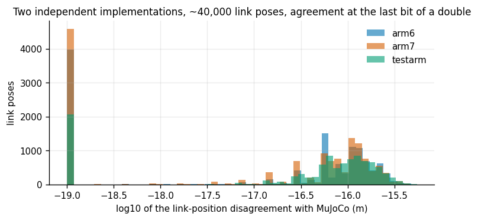
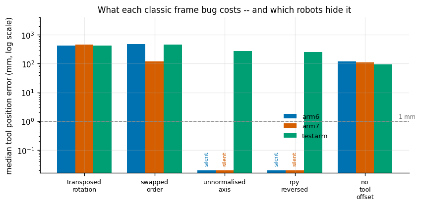
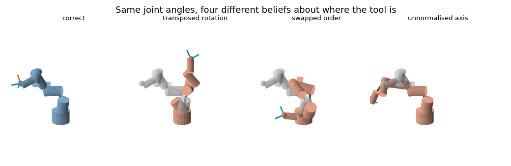

# Forward Kinematics From Scratch

## Key Insight

[Forward kinematics](/shared/glossary/#forward-kinematics) answers the most basic question in robotics: given the angle of every joint, where in space is the hand? You compute it by multiplying one [homogeneous transform](/shared/glossary/#homogeneous-transform) per joint, walking outward from the robot's base frame to its [end-effector](/shared/glossary/#end-effector), so the whole computation is just a chain of 4×4 matrix products. It is always solvable and always cheap — unlike [inverse kinematics](/shared/glossary/#inverse-kinematics), its much harder mirror image — which is why coding it from raw NumPy and checking the result against a trusted library like [Pinocchio](/shared/glossary/#pinocchio) is the rite of passage that makes [Jacobians](/shared/glossary/#jacobian), control, and planning concrete later on.

**This is project 3.** It builds `fk.py`, the module every later project imports, and verifies it against [MuJoCo](/shared/glossary/#mujoco) across **40,000 link poses** on three robots — worst disagreement **5.5e-16 m**. Then it does the part that teaches more than the verification: it switches on five classic frame bugs, one at a time, and measures what each one costs.

The headline is that **two of the five bugs are completely invisible on a nicely-built robot**. They produce zero error, on every configuration tested, and only show up on a robot deliberately designed to be awkward.

---

## Files

| file | what it is |
|---|---|
| `fk.py` | the module: `fk_all`, `fk`, `joint_axes_world`, and the five injected bugs |
| `run.py` | verify, time, and run the bug study |
| `outputs/` | figures and `results.csv` |

```bash
python3 run.py       # about 6 seconds
```

It reads the robots from project [2](../02-urdf-visualizer/README.md)'s `models/` and the rotation maths from project [1](../01-transform-calculator/README.md)'s `transforms.py`.

> **A note on libraries.** The Key Insight names [Pinocchio](/shared/glossary/#pinocchio). It is not installed here, so [MuJoCo](/shared/glossary/#mujoco) — which has its own independent URDF reader and its own kinematics in C — plays the trusted-library role. Project [2](../02-urdf-visualizer/README.md) explains why that swap is fine.

---

## The whole computation

Every step down the [kinematic chain](/shared/glossary/#kinematic-chain) is the same two-part move:

```
T_world_child  =  T_world_parent  @  T_origin(joint)  @  T_move(joint, qᵢ)
                                     ^^^^^^^^^^^^^^^     ^^^^^^^^^^^^^^^^^
                                     fixed, from the     the joint's own
                                     URDF, never          motion, in the
                                     changes             CHILD frame
```

`T_move` is a rotation about the joint axis for a [revolute](/shared/glossary/#revolute-joint) joint, a slide along it for a [prismatic](/shared/glossary/#prismatic-joint) one, and the identity for a fixed one. That is all of it. Run through the joints in parent-before-child order and every link's world pose falls out in one sweep:

```python
def fk_all(robot, q):
    poses = {robot.root: np.eye(4)}
    qi = 0
    for j in robot.ordered:
        value = 0.0
        if j.movable:
            value = q[qi]; qi += 1
        poses[j.child] = poses[j.parent] @ j.T_origin @ joint_transform(j, value)
    return poses
```

Two properties follow from this shape, and both are worth stating plainly because [inverse kinematics](/shared/glossary/#inverse-kinematics) has neither:

- **Always solvable.** There is no search, no failure case, no configuration where the answer does not exist. You put joint angles in; poses come out.
- **Always cheap.** One 4×4 product per joint. Measured below: about 19 µs per joint in NumPy, and a few hundred nanoseconds in compiled code.

### Why this is a *module* and not the twelve lines from project 2

Project [2](../02-urdf-visualizer/README.md) already has a twelve-line sweep that draws the robot. This one adds four things that a drawing does not need and that everything else does:

1. **Verification** against an independent implementation, across 40,000 link poses.
2. **Tool frames**, so `fk(robot, q)` returns `tool0` — the frame a grasp actually happens at — rather than the last wrist link.
3. **`joint_axes_world(robot, q)`**, which returns each joint's world-frame origin and axis in the same sweep. Project [4](../04-jacobian-from-scratch/README.md)'s [Jacobian](/shared/glossary/#jacobian) is built entirely out of those two things, so computing them here saves a second pass.
4. **The five deliberate bugs**, which need to live next to the correct code to stay honest about being one-line changes.

---

## Verification: 40,000 link poses, three robots

Load each URDF again in MuJoCo, set 2,000 random joint vectors, compare every link.

| robot | links compared | worst position error | worst orientation error | median position error |
|---|---|---|---|---|
| `arm6` | 6 of 8 | **4.8e-16 m** | 7.1e-16 rad | 5.7e-17 m |
| `arm7` | 7 of 9 | **4.6e-16 m** | 7.4e-16 rad | 5.6e-17 m |
| `testarm` | 5 of 8 | **5.5e-16 m** | 1.2e-15 rad | 7.5e-17 m |



The x axis is `log10` of the disagreement in metres. Everything sits between 1e-17 and 1e-15, which for lengths around a metre is the last one or two bits of a 64-bit float. There is no meaningful sense in which either implementation is more correct.

**Note the "5 of 8" for `testarm`.** MuJoCo welds fixed joints away on import, so `tool0`, `camera_link` and `base_link` do not exist as bodies in its model — and asking for a missing body returns silent zeros rather than an error. The count and the names are printed on every run. Project [4](../04-jacobian-from-scratch/README.md) closes that gap with an exact algebraic identity that needs no external reference at all.

### Timing

| robot | full sweep | per joint |
|---|---|---|
| `arm6` (6 joints) | 113 µs | 18.9 µs |
| `arm7` (7 joints) | 133 µs | 18.9 µs |
| `testarm` (5 joints) | 87 µs | 17.5 µs |

Perfectly linear in the number of joints, as the single sweep guarantees. The 19 µs is almost entirely Python and NumPy call overhead — the actual arithmetic is a handful of 4×4 products. A C implementation is roughly a hundred times faster, which is why a 1 kHz control loop is not a problem for anybody.

---

## The bug study

The guide says that when a robot motion goes wrong, "~80% of the time the bug is in one of these four lines: a swapped frame, a transposed rotation, an inverted convention, or DH alpha vs theta confused." This section turns that claim into numbers.

`fk_all_buggy(robot, q, bug)` is the same sweep with exactly one mistake switched on. Each is a realistic one-line slip:

| bug | the mistake |
|---|---|
| `transposed_rotation` | uses `R.T` instead of `R` for the joint rotation |
| `swapped_order` | applies the joint's motion **before** its fixed offset |
| `unnormalised_axis` | uses the axis exactly as written in the file, without normalising |
| `rpy_reversed` | reads `<origin rpy>` as `Rx·Ry·Rz` instead of URDF's `Rz·Ry·Rx` |
| `no_tool_offset` | skips the fixed tool joint — "the tool is at the wrist, near enough" |

Median tool position error over 500 random configurations:



| bug | `arm6` | `arm7` | `testarm` |
|---|---|---|---|
| transposed rotation | 422 mm | 463 mm | 427 mm |
| joint before offset | 482 mm | 117 mm | 459 mm |
| axis not normalised | **silent** | **silent** | 276 mm |
| rpy read backwards | **silent** | **silent** | 249 mm |
| tool offset skipped | 120 mm | 110 mm | 95 mm |

### Finding 1: a nice robot hides two of the five bugs completely

Not "small error" — **exactly zero**, on every one of 500 configurations.

`arm6` and `arm7` were written to be readable: every `<origin rpy>` is `0 0 0` and every axis is a clean `0 0 1` or `0 1 0`. Both silent bugs need exactly what those files lack:

- *rpy read backwards* changes `Rz·Ry·Rx` into `Rx·Ry·Rz`. When all three angles are zero, both products are the identity. Nothing to get wrong.
- *axis not normalised* scales the joint angle by the axis vector's length. When every axis is already a unit vector, the scale factor is 1.

`testarm` exists precisely to break those assumptions — arbitrary origin rotations, and one axis written `"0 2 0"` so a loader that forgets to normalise doubles that joint's angle. On `testarm` both bugs cost about a quarter of a metre.

**The transferable point is about test design, not about URDFs.** A test fixture chosen for readability tends to be a fixture in which several code paths are constant, and a constant code path cannot be wrong. If your verification robot has no rotated joint origins, your rotation-composition code is untested no matter how many configurations you sample.

### Finding 2: the home pose is the worst place to test

The same bugs, evaluated at `q = 0` instead of at random configurations:

| bug | error at `q = 0` (testarm) | median over random configurations |
|---|---|---|
| transposed rotation | **0.0 mm** | 427 mm |
| joint before offset | **0.0 mm** | 459 mm |
| axis not normalised | **0.0 mm** | 276 mm |
| rpy read backwards | 339 mm | 249 mm |
| tool offset skipped | 95 mm | 95 mm |

Three of the five vanish at the home pose. The reason is the same in all three cases: at `q = 0` the joint's moving part is the identity matrix, and the identity commutes with everything and is its own transpose. Ordering bugs and transposition bugs need a *non-identity* rotation to have anything to disagree about.

This is why "I checked it at the home position and it looked right" is not a check. The home position is the single configuration where the largest number of kinematics bugs are guaranteed to hide.

### Finding 3: a wrong robot still looks exactly like a robot



Grey is the correct robot; orange is the buggy one, at identical joint values. None of the three broken robots looks *broken*. They are all connected, all plausibly proportioned, all sitting in reasonable poses. If you had only ever seen the orange one, nothing would tell you.

This is what the guide means when it says frame bugs are silent: **the robot moves somewhere, just not where you meant.** There is no exception, no NaN, no assertion. On real hardware the first symptom is a grasp that misses by a few centimetres, and the natural response is to blame the camera calibration.

### Finding 4: the tool offset bug is exactly as large as the offset

`no_tool_offset` costs 120 mm on `arm6`, 110 mm on `arm7`, 95 mm on `testarm` — and those are precisely the tool-joint offsets in the three URDFs (0.12 m, 0.11 m, and `‖(0.03, 0, 0.09)‖` = 0.095 m). Constant across every configuration.

That constancy is what makes it dangerous. A bug that produces a fixed offset is very easy to "fix" by nudging a number somewhere else — for example by adjusting a calibration until grasps land again. You then have two errors that cancel in the configurations you tested, and reappear as soon as anything changes.

---

## The inverted transform: 52 cm, and both answers look fine

A camera on the arm reports a point 30 cm in front of its lens. To place that point in the world you need

```
p_world = T_world_camera @ p_camera
```

Using the inverse by mistake type-checks, runs, and returns a perfectly reasonable-looking 3-D point:

| | |
|---|---|
| distance between the right and wrong answers | **0.52 m** |
| both answers' distance from the base | 0.48 m and less — comfortably inside the workspace |

There is no clue. The wrong point is not at infinity, not behind the robot, not NaN. It is a plausible place for an object to be, about half a metre from where the object actually is.

This is the entire argument for the naming discipline the guide pushes. Written as `T_world_camera @ T_camera_tag`, the inner names cancel and the expression reads as a sentence; written as `cam_pose @ tag_pose` there is nothing to check. Project [7](../07-hand-eye-calibration/README.md) is about *measuring* `T_ee_camera` in the first place — and it only makes sense once you can be confident which direction the transform points.

---

## What to take away

1. **Forward kinematics is one sweep of 4×4 products,** always solvable and always cheap. Everything harder in this phase is built on it.
2. **Verify against a genuinely independent implementation,** and print how many things you actually compared.
3. **A readable test robot is a weak test robot.** Two of five bugs produce exactly zero error on a robot with no rotated joint origins and unit axes.
4. **Never verify at the home pose.** Three of five bugs vanish there, because the identity matrix commutes with everything and is its own transpose.
5. **A wrong robot looks like a robot.** Frame bugs do not crash; they relocate.
6. **A constant-offset bug is the most dangerous kind,** because it is so easy to cancel out with a second error somewhere else.
7. **Name transforms by their endpoints.** `T_world_camera`, never `cam_pose`. The inverted version of that mistake is worth 52 cm here, and it looks entirely reasonable.

## Next

Project [4](../04-jacobian-from-scratch/README.md) builds the [Jacobian](/shared/glossary/#jacobian) — the derivative of this function — two independent ways, and finds out exactly how well they can be expected to agree.
