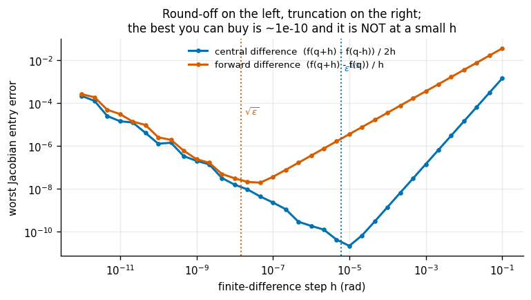
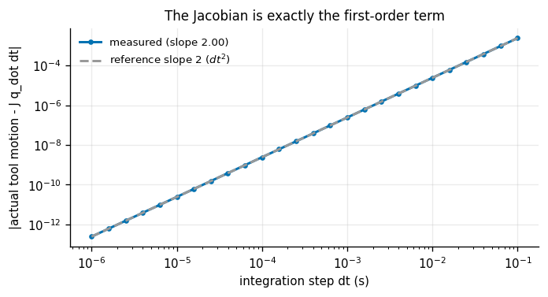
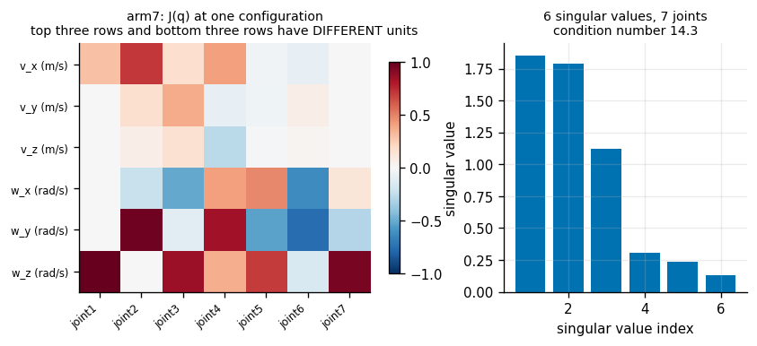

# Jacobian From Scratch

## Key Insight

The [Jacobian](/shared/glossary/#jacobian) is the matrix that turns "how fast each joint is turning" into "how fast the hand is moving and rotating," and it is the single most reused object in robot control. This project builds it two independent ways — analytically from the [kinematics](/shared/glossary/#kinematics), and numerically by nudging each joint a hair and measuring how the [end-effector](/shared/glossary/#end-effector) responds (a [finite difference](/shared/glossary/#finite-difference)) — then demands the two agree to six decimal places, a cross-check that exposes the sign and frame mistakes a single method would quietly hide. Once you trust your Jacobian, velocity control, force control, and [inverse kinematics](/shared/glossary/#inverse-kinematics) all reduce to a few lines of linear algebra.

**This is project 4.** The two methods agree to **2.7e-10** — about *nine and a half* decimal places, comfortably past the six the project asks for. The interesting part is why they cannot do much better than that no matter how carefully you try, and what the sweep that proves it looks like.

Two other results here are worth arriving for. A branching robot exposes a class of Jacobian bug that no chain can. And "the [condition number](/shared/glossary/#condition-number) of the Jacobian", a number quoted constantly, turns out **not to be a property of the robot at all** — it moves by three orders of magnitude if you switch from metres to millimetres.

---

## Files

| file | what it is |
|---|---|
| `jacobian.py` | analytic and finite-difference Jacobians, plus what you read off one |
| `run.py` | six experiments |
| `outputs/` | figures and `results.csv` |

```bash
python3 run.py       # about 8 seconds
```

---

## What the matrix means

```
[ v ]                       v = linear velocity of the tool   (m/s)
[   ]  =  J(q) @ q̇          ω = angular velocity of the tool  (rad/s)
[ ω ]                       q̇ = joint speeds        (rad/s, or m/s if sliding)
```

Six rows, one column per joint. Column `i` answers: *if joint `i` alone turned at one radian per second, how would the tool move?*

For a [revolute](/shared/glossary/#revolute-joint) joint whose axis points along the world vector `z` and passes through the world point `p_joint`, the answer is the cross-product formula for a rotating rigid body:

```python
J[:3, i] = np.cross(axis_w, p_tool - p_joint)   # the tool sweeps around the axis
J[3:, i] = axis_w                               # and spins about it
```

For a [prismatic](/shared/glossary/#prismatic-joint) joint it is simpler still: `J[:3,i] = axis_w`, and the angular part is zero, because sliding cannot spin the tool.

That is the whole derivation. Both ingredients — each joint's world-frame axis and origin — come straight out of project [3](../03-forward-kinematics-from-scratch/README.md)'s `joint_axes_world`, so the analytic Jacobian costs exactly one forward-kinematics sweep.

### The finite-difference version, and why it exists at all

The other way needs no derivation: nudge one joint, see how far the tool moved, divide.

> **"If the analytic version is faster and exact, why write the slow approximate one?"** Because it is not a competitor — it is the **oracle**. The analytic formula is a piece of derived mathematics, and derived mathematics is where sign errors and frame confusions live. The finite-difference version is derived from *nothing except the forward kinematics you already verified in project [3](../03-forward-kinematics-from-scratch/README.md)*. So the two share no assumptions, and agreement between them is real evidence. A single method, however carefully checked, can only confirm that you implemented what you wrote down.

One detail in the finite-difference code matters more than it looks:

```python
J[3:, i] = tf.R_to_axis_angle(Tp[:3,:3] @ Tm[:3,:3].T) / denom
```

The angular column is **not** the difference of two roll-pitch-yaw triples. Doing it that way would inherit every wrap-around and [gimbal-lock](/shared/glossary/#gimbal-lock) problem from project [1](../01-transform-calculator/README.md). It is the [axis-angle](/shared/glossary/#axis-angle) of the small rotation *between* the two poses, divided by the step — which is the definition of angular velocity, and is well-behaved everywhere.

---

## 1. Analytic vs MuJoCo: 1e-15

| robot | link checked | worst entry disagreement over 500 configurations |
|---|---|---|
| `arm6` | `wrist_3_link` | 1.2e-15 |
| `arm7` | `link7` | 1.4e-15 |
| `testarm` | `link5` | 3.0e-15 |

The check is **not** run at `tool0`, and the reason is the trap project [2](../02-urdf-visualizer/README.md) found: MuJoCo welds fixed joints away, so `tool0` is not one of its bodies, and `mj_jacBody` on a missing body returns a silent block of zeros. An earlier version of this file did ask for `tool0` and got a Jacobian of all zeros, which — because the comparison then reported a difference of exactly 1.0 — was at least loud enough to notice. It would have been quieter if the true answer had been small.

So the external check runs on the last real body, and the tool is covered by an **exact identity** instead:

```
J_tool[:3] = J_wrist[:3] − skew(p) · J_wrist[3:]        p = p_tool − p_wrist
J_tool[3:] = J_wrist[3:]
```

In words: a rigid body has one angular velocity, so the bottom three rows are shared; a point offset by `p` from the wrist picks up the extra linear velocity `ω × p` — the lever-arm term, exactly like a point on a spinning wheel moving faster the further out it sits. (`skew(p)` is the [skew-symmetric matrix](/shared/glossary/#skew-symmetric-matrix) that turns a cross product into a matrix product.) Measured error in that identity: **2.2e-16** on all three robots. It needs no external library, so the gap MuJoCo cannot cover is closed by algebra.

---

## 2 & 3. Nine and a half digits, and why not more

Analytic versus central finite difference at `h = 1e-6`:

| robot | worst entry disagreement | matching decimal places |
|---|---|---|
| `arm6` | 2.7e-10 | 9.56 |
| `arm7` | 2.7e-10 | 9.57 |
| `testarm` | 2.9e-10 | 9.53 |

The project asked for six decimal places and got nine and a half. But you cannot get sixteen, and the sweep shows exactly why:



Every finite difference is two competing errors:

- **truncation** — the step is not infinitesimal, so you measure a chord rather than a tangent. Shrinking `h` helps.
- **round-off** — you subtract two nearly-equal numbers and divide by something tiny. Shrinking `h` *hurts*, because the subtraction cancels away significant digits ([machine epsilon](/shared/glossary/#machine-epsilon) is about 2.2e-16 for a double).

Together they make a U. The bottom of the U is the best you can ever buy:

| method | truncation | best `h`, theory | best `h`, measured | best error achieved |
|---|---|---|---|---|
| forward, `(f(q+h) − f(q))/h` | `O(h)` | `√ε` ≈ 1.5e-8 | 4.6e-8 | **2.0e-8** |
| central, `(f(q+h) − f(q−h))/2h` | `O(h²)` | `ε^(1/3)` ≈ 6.1e-6 | 1.0e-5 | **2.2e-11** |

Both measured optima land within a factor of three of theory, which is as good as this kind of estimate gets.

The practical consequences are worth stating plainly, because they are the opposite of most people's instinct:

- **The best step size is not small.** For central differences it is about 1e-5 — a hundredth of a degree, not a millionth. Choosing `h = 1e-12` because it "feels more exact" costs you *five orders of magnitude* of accuracy.
- **Central differences are worth the doubled cost.** Two evaluations instead of one buys a thousand times better accuracy.
- **"Agree to six decimal places" is a well-chosen target.** It sits comfortably inside what a central difference can deliver and comfortably outside what a real bug survives. Asking for twelve would be asking arithmetic for something it does not have.

---

## 4. Does the Jacobian actually predict motion?

Matching numbers to another matrix is a weak test — a subtly wrong Jacobian would still look close. The strong test is physical: pick joint speeds `q̇`, ask the Jacobian where the tool will go, then actually move the joints and see.

`J` is a **derivative**, so it is exact only in the limit. Predicting a finite step should leave an error proportional to `dt²`. Measuring that exponent is a much stronger claim than "the numbers look similar" — it confirms `J` is the correct first-order term, not merely a nearby matrix.



| | |
|---|---|
| measured log-log slope | **2.00002** (theory: exactly 2) |
| prediction error after a 1 ms step | 2.4e-7 (metres and radians combined) |

A slope of 2.00002 over two decades is not something a wrong matrix produces by accident.

---

## 5. The branching trap: three columns that must be exactly zero

`testarm` has a camera bracket bolted to `link2`, so joints 3, 4 and 5 are *downstream* of the camera. They can move the tool. They cannot possibly move the camera.

A Jacobian routine that walks all the joints without checking which ones are actually ancestors of the target link will happily fill those columns with plausible numbers — and then a visual-servoing controller built on it will confidently command joints that cannot affect what the camera sees.

| | |
|---|---|
| columns of the camera Jacobian that are exactly zero | **3** (`j3`, `j4`, `j5`) |
| columns of the tool Jacobian that are exactly zero | 0 |
| camera motion when those three joints turn by 0.3 rad | **0.0 m** |

The fix is four lines: walk up the tree from the target link to the root, collect the ancestors, and skip any joint whose child is not among them. The physical confirmation — turn only those joints and watch the camera not move, to exactly zero metres — is the check worth keeping.

This is the class of bug that a serial-chain test robot cannot catch, because on a chain every joint is an ancestor of every later link. Any real robot with a wrist camera, a gripper with fingers, a torso with two arms, or a mobile base with a sensor mast is a tree, not a chain.

---

## 6. The unit trap: the condition number is not a property of the robot



Look at the row labels. Rows 0–2 are metres per radian. Rows 3–5 are dimensionless (radians per radian). Stacking them into one matrix and taking a [singular value decomposition](/shared/glossary/#singular-value-decomposition) adds metres to nothing — which means the result depends on your choice of length unit.

Rescale lengths and re-measure, over 200 random configurations of `arm7`:

| lengths in | median [condition number](/shared/glossary/#condition-number) | median [manipulability](/shared/glossary/#manipulability) |
|---|---|---|
| kilometres | 16,425 | 3.9e-11 |
| metres | **17.9** | 0.0386 |
| centimetres | 157 | 38,573 |
| millimetres | 1,566 | 3.9e7 |

Same robot. Same configurations. Same physics. The condition number moves by three orders of magnitude and manipulability by eighteen, purely from the choice of unit.

So the quantity you can legitimately use is a *relative* one:

- ✅ "σ_min fell by 40× along this trajectory" — a ratio, unit-free, meaningful.
- ✅ "manipulability is highest here and lowest there, in metres throughout" — comparison at fixed units.
- ❌ "this arm's condition number is 17.9" — 17.9 of what?
- ❌ "keep the condition number below 50" — below 50 in which unit?

The clean fix, when you need an absolute threshold, is to pick a **characteristic length** for the robot (say its reach) and divide the linear rows by it before decomposing. Then both halves are dimensionless and the number means something. Nothing in this phase needs an absolute threshold, so projects [5](../05-damped-least-squares-ik/README.md) and [6](../06-null-space-posture-control/README.md) use σ_min and manipulability only as relative signals along a single trajectory, in fixed units.

### What the two numbers mean

**[Manipulability](/shared/glossary/#manipulability)**, `√det(J Jᵀ)`, is Yoshikawa's measure. Joint speeds inside a unit ball map to an ellipsoid of tool velocities, and this number is proportional to that ellipsoid's volume. Big means the tool moves freely in every direction; zero means a [singularity](/shared/glossary/#kinematic-singularity) — the ellipsoid has collapsed to a pancake and some direction of motion is unreachable no matter how fast the joints turn.

**Condition number**, `σ_max/σ_min`, measures how *lopsided* that ellipsoid is rather than how big. 1 means a perfect sphere: equally easy to move every way. Large means one direction is nearly free and another nearly impossible.

The right panel of the figure shows the six singular values at one configuration. Note there are six of them and seven joints — `arm7` is [redundant](/shared/glossary/#kinematic-redundancy), the matrix is 6×7, and the seventh direction in joint space maps to *nothing*. That is the [null space](/shared/glossary/#null-space), and project [6](../06-null-space-posture-control/README.md) spends it.

---

## Timing

| | |
|---|---|
| analytic Jacobian, `arm7` | 336 µs |
| finite-difference Jacobian, `arm7` | 2,100 µs |
| ratio | **6.2×** |

Exactly what the arithmetic predicts: a central difference needs `2n = 14` forward-kinematics sweeps where the analytic method needs one, and the sweep dominates. The analytic version is the one that ships. The finite-difference version is the one that proves the analytic version is right, and it runs in your test suite, not your control loop.

---

## What the module gives the rest of the phase

```python
from jacobian import jacobian_analytic, singular_values, manipulability, damped_pinv

J    = jacobian_analytic(robot, q)          # 6 x n, world frame, at tool0
s    = singular_values(J)                   # s[-1] is the singularity warning light
w    = manipulability(J)                    # volume of the velocity ellipsoid
Jinv = damped_pinv(J, lam=1e-2)             # the workhorse of projects 5 and 6
```

`damped_pinv` is `Jᵀ(J Jᵀ + λ²I)⁻¹`. With `λ = 0` it is the ordinary right [pseudo-inverse](/shared/glossary/#pseudo-inverse), which explodes at a singularity. With `λ > 0` it stays bounded at the cost of a small deliberate error. That trade-off is the whole subject of project [5](../05-damped-least-squares-ik/README.md).

---

## What to take away

1. **The Jacobian is one cross product per joint.** `[axis × (p_tool − p_joint); axis]` for a revolute joint, and it costs one forward-kinematics sweep.
2. **Finite differences are the oracle, not a competitor.** They share no assumptions with the analytic derivation, which is what makes agreement meaningful.
3. **The best finite-difference step is not the smallest one.** It is `ε^(1/3)` ≈ 6e-6 for a central difference, and the U-shaped error curve is a fact of floating point, not of robotics.
4. **Test that the Jacobian predicts real motion,** and check the `dt²` slope rather than just eyeballing agreement.
5. **A branching robot exposes bugs no chain can.** Three columns of the camera Jacobian must be *exactly* zero.
6. **The condition number of a Jacobian is not a property of the robot.** It changes with your length unit. Use it as a relative signal, or non-dimensionalise first.

## Next

Project [5](../05-damped-least-squares-ik/README.md) inverts this matrix to solve [inverse kinematics](/shared/glossary/#inverse-kinematics) — and finds out what happens when it cannot be inverted.
