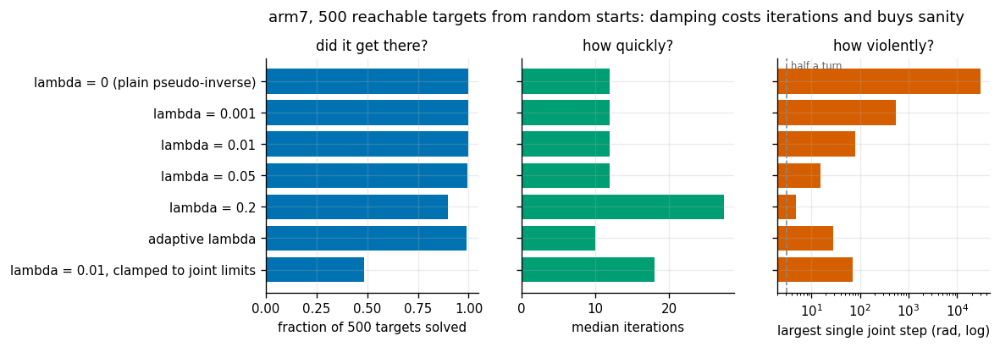
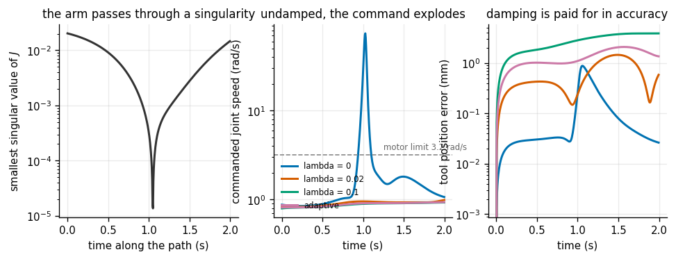
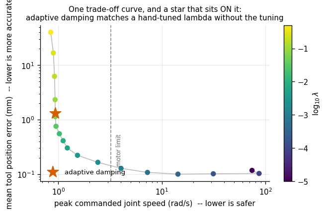
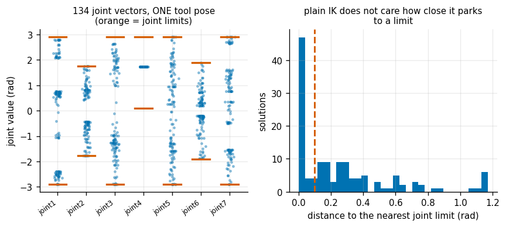
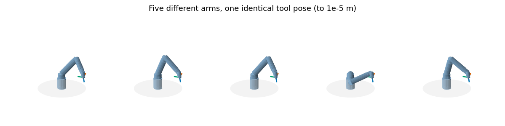

# Damped Least-Squares IK

## Key Insight

[Inverse kinematics](/shared/glossary/#inverse-kinematics) runs [forward kinematics](/shared/glossary/#forward-kinematics) backward — given a desired hand pose, find the joint angles that achieve it — and the workhorse method repeatedly inverts the [Jacobian](/shared/glossary/#jacobian) to step the joints toward the target. The catch is that near a [singularity](/shared/glossary/#kinematic-singularity) the Jacobian loses rank, and a plain inverse then demands impossibly fast joint motion; [damped least-squares](/shared/glossary/#damped-least-squares) cures this by adding a small penalty (the "damping") that trades a little tracking accuracy for bounded, stable joint velocities. Watching the arm ease through a wrist singularity instead of flailing is the clearest lesson in why this one regularization trick ships inside real industrial controllers.

**This is project 5.** It solves 500 reachable targets on the 7-DoF arm at six damping settings, then drives the 6-DoF arm on a straight-line path *straight through* its wrist singularity and measures what each setting costs.

The headline number: with no damping, that path commands a peak joint speed of **74 rad/s** — twenty-three times the motor's limit — while a hint of damping brings it to **0.99 rad/s** and costs half a millimetre of accuracy. Two other findings are less comfortable. Naively enforcing joint limits inside the solver **halves its success rate**, from 99.8% to 48.6%. And variable damping, usually sold as strictly better than a fixed λ, turns out to **tie** a well-chosen fixed λ on this path.

---

## Files

| file | what it is |
|---|---|
| `ik.py` | `ik()` (position-level solve), `track_path()` (velocity-level), damping rules |
| `run.py` | four experiments |
| `outputs/` | figures and `results.csv` |

```bash
python3 run.py       # about 90 seconds
```

---

## Why inverse kinematics is not just "forward kinematics backwards"

Forward kinematics is a **function**: joint angles in, one pose out, always, cheaply. Inverse kinematics is an **equation**, and equations can have no solution, one, several, or infinitely many:

- **no solution** — the target is outside the [workspace](/shared/glossary/#workspace), or reachable in position but not in orientation
- **finitely many** — a 6-DoF arm typically has up to 8 exact solutions for one pose (elbow up or down, wrist flipped, base facing forwards or backwards)
- **infinitely many** — a 7-DoF arm has a whole continuum, the subject of project [6](../06-null-space-posture-control/README.md)

So we do not "solve" it. We start somewhere and walk downhill on the pose error:

```
e   = pose_error(current, target)      a 6-vector: 3 metres, 3 radians
dq  = J(q)⁺ e                          which joints to turn
q  <- q + dq                           repeat
```

`pose_error` comes from project [1](../01-transform-calculator/README.md): position difference stacked on the [axis-angle](/shared/glossary/#axis-angle) of the residual rotation. `J` comes from project [4](../04-jacobian-from-scratch/README.md). The entire difficulty lives in that superscript `⁺`.

---

## What the damping actually changes

The plain [pseudo-inverse](/shared/glossary/#pseudo-inverse) answers a specific question:

```
minimise ‖dq‖    subject to    J dq = e            "hit the target exactly, with the smallest joint motion"
```

Near a singularity the arm has almost stopped responding in some direction, so "the smallest motion that hits it exactly" becomes enormous — the only way to force a nearly-unresponsive direction is to spin the joints wildly.

Damped least squares changes the question to a compromise:

```
minimise ‖J dq − e‖² + λ² ‖dq‖²                    "get close AND stay small"
```

with λ setting the exchange rate. The solution is `Jᵀ(J Jᵀ + λ²I)⁻¹e`, and the `λ²I` term is what keeps the matrix invertible when `J Jᵀ` is not.

> **"Isn't this just admitting defeat — deliberately not solving the problem?"** It is deliberately solving a *different* problem, and the different problem is the one you actually have. "Hit the target exactly" is only the right objective if any joint velocity is acceptable, and no real motor accepts 74 rad/s. Adding `λ²‖dq‖²` writes the motor's existence into the objective. The undamped answer is not more correct; it is the correct answer to a question that ignores the hardware.

### One idea, four names

You will meet this exact `+ λ²I` under several names, and recognising them as one thing means a lesson learned in any of them transfers:

| name | field | why it is called that |
|---|---|---|
| **[Levenberg-Marquardt](/shared/glossary/#levenberg-marquardt)** | optimisation | Kenneth Levenberg (1944) and Donald Marquardt (1963) each proposed adding a multiple of the identity so the step stays finite when the local model is degenerate |
| **[Tikhonov regularization](/shared/glossary/#tikhonov-regularization)** | inverse problems | Andrey Tikhonov, who formalised penalising the size of the answer for ill-posed problems |
| **ridge regression** | statistics | the penalty puts a "ridge" along the diagonal of the normal-equation matrix |
| **[damped least squares](/shared/glossary/#damped-least-squares)** | robotics | the same algebra, named for what it does to the motion |

The λ is called *damping* by analogy with a shock absorber: it does not stop the motion, it stops the motion from being violent.

---

## 1. Five hundred targets, six damping settings



Targets are generated by running forward kinematics on random joint vectors, so **every one is reachable by construction**. That matters: targets drawn at random in space would mostly be unreachable, and every solver would "fail" for a reason with nothing to do with damping. This separates *the solver could not find it* from *there was nothing to find*.

| setting | success rate | median iterations | largest single joint step seen |
|---|---|---|---|
| λ = 0 (plain pseudo-inverse) | 100% | 12 | **30,194 rad** |
| λ = 0.001 | 100% | 12 | 540 rad |
| λ = 0.01 | 99.8% | 12 | 81 rad |
| λ = 0.05 | 99.4% | 12 | 15 rad |
| λ = 0.2 | 89.6% | 27.5 | 4.9 rad |
| adaptive λ | 99.0% | **10** | 28 rad |
| λ = 0.01, clamped to joint limits | **48.6%** | 18 | 72 rad |

Three things to read out of that table.

**Undamped IK "succeeds" while behaving insanely.** 100% success and a single step of 30,194 radians — about 4,800 full turns of a joint, in one iteration. It converges because the *next* iteration recovers, and on a plot of success rate it looks perfect. If you had commanded those intermediate configurations to a real arm, you would have destroyed it. **Success rate alone is a dangerously incomplete metric.**

**Too much damping does break convergence.** λ = 0.2 drops to 89.6% and more than doubles the iteration count. Damping is not free safety; past some point the steps are so conservative that the solver runs out of iterations. There is a real optimum, roughly λ ∈ [0.01, 0.05] here.

**Enforcing joint limits by clamping halves the success rate.** This is the most practically important row. Clamping is the obvious thing to do — after each step, push any out-of-range joint back into range — and it takes the solver from 99.8% to 48.6%. Clamping is not a projection onto the constraint set in any useful sense: it kills the component of the step that would have carried the arm around the obstacle, and the solver dead-ends against the boundary.

That failure is exactly what project [6](../06-null-space-posture-control/README.md) fixes properly, by pushing away from limits *inside the [null space](/shared/glossary/#null-space)* where the push costs the primary task nothing.

---

## 2. Through the wrist singularity

`arm6` has a spherical wrist: joints 4, 5 and 6 all turn about axes through one point. When joint 5 (`wrist_2`) is zero, axes 4 and 6 point the same way — so between them they can produce only **one** rotation instead of two. The Jacobian drops from rank 6 to rank 5, and one direction of tool rotation becomes unreachable at any joint speed.

| | smallest [singular value](/shared/glossary/#singular-value-decomposition) of J |
|---|---|
| at `wrist_2` = 0.85 rad | 0.0203 |
| at `wrist_2` = 0 | **4.7e-18** — zero, to the last bit |

The test path takes the tool from the pose at `wrist_2 = +0.85` to the pose at `wrist_2 = −0.85`, interpolating **in Cartesian space**: a straight line in position, [slerp](/shared/glossary/#slerp) in orientation.

> **"Why interpolate in Cartesian space rather than just sweeping the joint?"** Because the straight line is what a user actually asks for, and it is deliberately *not* the path the joints would produce on their own. Sweeping joint 5 through zero is perfectly safe — the arm passes through the singular configuration without ever needing an impossible velocity. It is the *mismatch* that hurts: the straight line the user drew asks for motion in a direction the arm is about to lose, and near the singularity the only way to supply it is a huge joint velocity. Test the safe path and the singularity looks harmless.

The controller is [resolved-rate control](/shared/glossary/#resolved-rate-control): each 5 ms tick, ask for the twist that keeps up with the path plus corrects accumulated error, convert to joint velocities with the damped pseudo-inverse, integrate.



| setting | peak joint speed | mean position error | worst orientation error |
|---|---|---|---|
| λ = 0 | **74.2 rad/s** | 0.12 mm | 0.423° |
| λ = 0.02 | **0.99 rad/s** | 0.61 mm | 0.013° |
| λ = 0.1 | 0.93 rad/s | 2.71 mm | 0.097° |
| adaptive | 0.94 rad/s | 1.30 mm | 0.036° |

The motor's own limit, from the URDF, is 3.2 rad/s. Undamped, the solver asks for **twenty-three times** that. On real hardware the drive saturates, the arm falls behind the trajectory, the error grows, the controller asks for even more speed — and what you see is the flailing the Key Insight describes.

The most striking number is how *cheap* the fix is. Going from λ = 0 to λ = 0.02 removes a 75× velocity spike for **half a millimetre** of mean tracking error. That is not a trade-off anybody would refuse.

Note also that the orientation error goes *down* with a little damping (0.423° → 0.013°). Undamped, the arm is thrashing so hard near the singular point that its actual tracking gets worse, not better. Damping helps twice.

---

## 3. The trade-off curve, and an honest tie



Sweep λ from 0 to 0.5 and plot the two quantities it trades: peak joint speed (safety) against mean position error (accuracy). The result is a clean hyperbola — the classic shape of a genuine trade-off, where improving either axis costs you the other.

The star is the **adaptive** rule (Nakamura & Hanafusa 1986; Chiaverini 1994): zero damping in open space, and damping that grows only when σ_min drops below a threshold.

```python
def adaptive_lambda(J, lam_max=0.06, sigma_thresh=0.05):
    s_min = singular_values(J)[-1]
    if s_min >= sigma_thresh:
        return 0.0
    return lam_max * np.sqrt(1.0 - (s_min / sigma_thresh) ** 2)
```

The pitch is that a fixed λ is a *permanent tax*: it costs accuracy everywhere in order to buy safety in the few places that need it. Switch it on only near the danger and you get the safety without the tax.

**Measured on this path, that pitch does not hold up:**

| comparison | result |
|---|---|
| adaptive vs the fixed λ with the same peak speed (λ = 0.052) | **0.87×** — the fixed λ was slightly *more* accurate |
| adaptive vs a badly chosen fixed λ (the largest swept) | **30.8×** better |

The star lands **on** the curve, not below it. On a path with one singularity crossing, tuning λ for that crossing is exactly as good as adapting it.

That is an honest negative result, and it sharpens what adaptive damping is actually for. Its value is not that it beats a tuned λ — it is that **nobody had to tune it.** A fixed λ is tuned for one trajectory and one robot; move to a different task and a badly chosen λ is 31× worse. In the 500-target study the adaptive rule also converged in 10 iterations against the fixed rules' 12, because it uses no damping at all where none is needed. Robustness across conditions, not peak performance in one.

---

## 4. One pose, many arms



Pick one tool pose on the 7-DoF arm and solve for it 200 times from random starts. 134 runs converge (to within 1e-5 m and 1e-5 rad). They land on **134 different joint vectors**, spread up to 5.8 rad apart.



Every arm in that picture puts the tool in the identical place, to a hundredth of a millimetre. They are visibly different machines to stand next to.

The uncomfortable statistic:

| | |
|---|---|
| solutions within 0.1 rad of a joint limit | **40.3%** |
| solutions sitting exactly **on** a joint limit | **31.3%** |

Nearly a third of the "successful" solutions have a joint pinned against its hard stop. The solver did nothing wrong — it was asked for a tool pose and it delivered one. It has no opinion about anything else, because nothing in the objective mentions anything else.

A configuration on a limit is a bad place to start any motion from: half the directions the joint could move are gone, so the very next command may be unachievable. That is the gap project [6](../06-null-space-posture-control/README.md) fills — using the spare freedom of a 7-joint arm to say "and also, keep a comfortable posture" at zero cost to the pose.

---

## What the module gives the rest of the phase

```python
from ik import ik, track_path, damped_pinv, adaptive_lambda, cartesian_lerp

q, info = ik(robot, q_seed, T_target, lam=1e-2, clamp_limits=True)
#   info["ok"], info["iters"], info["e_pos"], info["max_step"]

q_end, log = track_path(robot, q0, poses, dt=0.005, adaptive=True)
#   log["qd"], log["sigma_min"], log["err_pos"], log["err_rot"]
```

`info["max_step"]` is worth returning from your own solvers. It is the number that distinguishes a run that was *solved* from one that merely *survived*.

### A bug worth showing, because the symptom was so misleading

The first version of `track_path` computed its feed-forward twist with the 4×4 matrix logarithm:

```python
ff = tf.se3_log(poses[k+1] @ tf.T_inv(poses[k])) / dt        # WRONG here
```

which is a perfectly correct way to get a [twist](/shared/glossary/#twist) — just not the *same* twist the Jacobian speaks. There are two conventions:

- the **screw** twist that `se3_log` returns, whose linear part is the velocity of the imaginary body-fixed point currently at the world origin
- the **point-velocity** (hybrid) twist that project [4](../04-jacobian-from-scratch/README.md)'s Jacobian produces, whose linear part is the velocity of the tool's own origin

For a tool half a metre from the origin these are completely different vectors. The symptom was a mean tracking error of **110 mm on a path 200 mm long** — identical for every damping setting, which was the clue. A real damping problem changes when you change λ. The fix is four lines:

```python
dp = (poses[k+1][:3,3] - poses[k][:3,3]) / dt
dw = tf.R_to_axis_angle(poses[k+1][:3,:3] @ poses[k][:3,:3].T) / dt
v  = np.concatenate([dp, dw]) + gain * e
```

Tracking error dropped to 0.12 mm. This is project [3](../03-forward-kinematics-from-scratch/README.md)'s lesson in a new costume: the two twists are both valid, both plausible, and mixing them produces an error the size of the arm with nothing that looks like a crash.

---

## What to take away

1. **IK is an equation, not a function.** Zero, one, several or infinitely many answers, so it is solved by iteration rather than evaluation.
2. **Damping changes the question, not the answer.** "Hit it exactly" ignores the motors; "get close and stay small" does not.
3. **Success rate alone is a dangerous metric.** Undamped IK scores 100% while asking for 4,800 turns of a joint in one step. Report the largest step too.
4. **The fix is astonishingly cheap.** λ = 0.02 removes a 75× velocity spike for half a millimetre of accuracy — and *improves* orientation tracking at the same time.
5. **Test the path the user asked for, not the path the joints prefer.** Sweeping the joint through the singularity is harmless; the straight Cartesian line through it is where the danger lives.
6. **Adaptive damping ties a hand-tuned λ here** — its value is robustness across tasks (31× better than a badly chosen one), not peak accuracy on one.
7. **Clamping to joint limits halves the success rate.** Constraints need to be handled inside the solver's geometry, not stapled on afterwards.

## Next

Project [6](../06-null-space-posture-control/README.md) uses the 7-DoF arm's spare freedom to fix exactly the problem section 4 uncovered — and does it without moving the tool by more than 1e-14.
