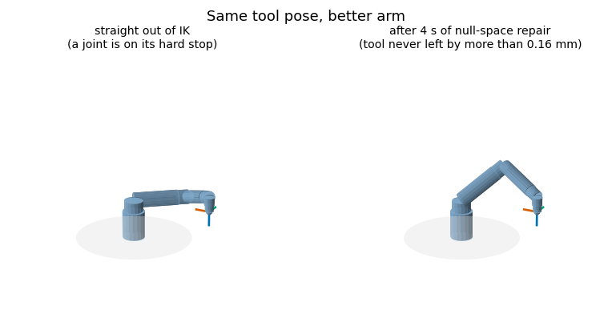
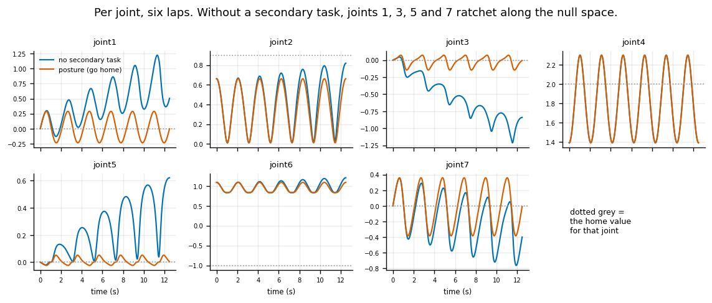
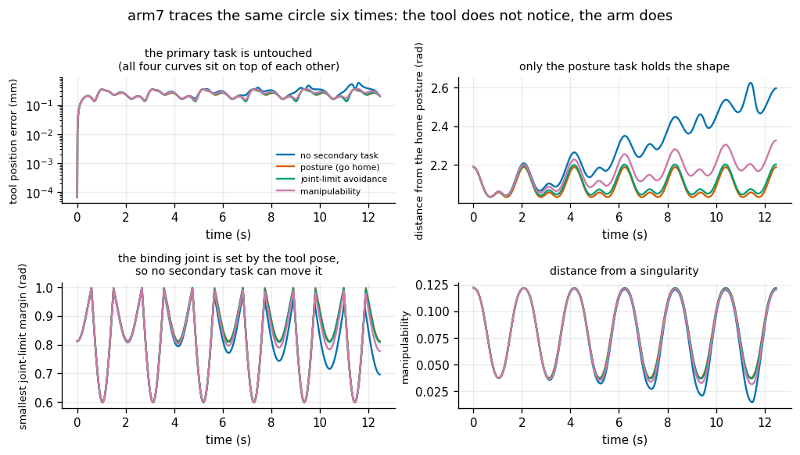
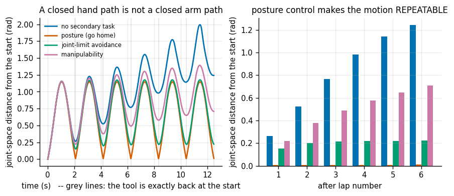
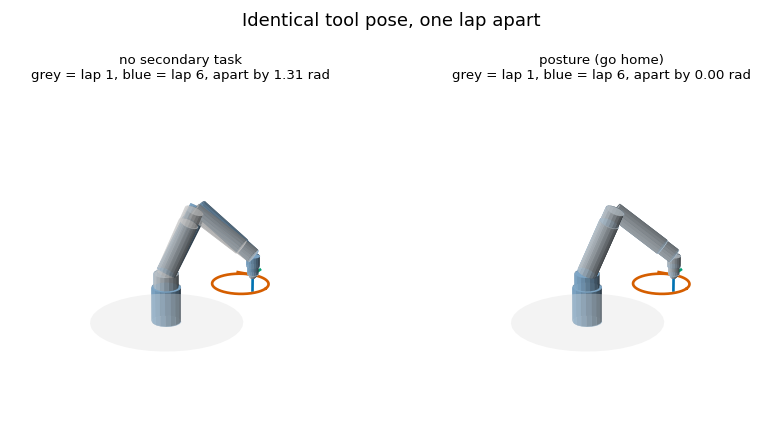
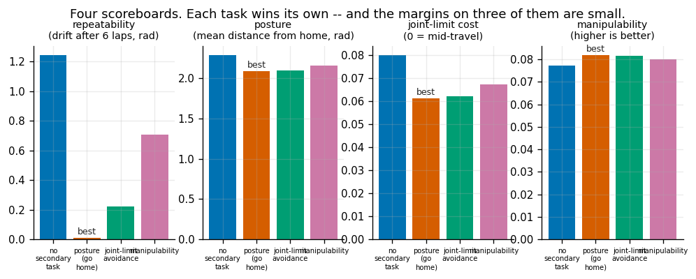

# Null-Space Posture Control

## Key Insight

An arm with more than six joints is [redundant](/shared/glossary/#kinematic-redundancy) — many different joint configurations place the hand in exactly the same pose — and the set of joint motions that move the joints *without* moving the hand is the [null space](/shared/glossary/#null-space) of the [Jacobian](/shared/glossary/#jacobian). This project uses that spare freedom to do two jobs at once: track an [end-effector](/shared/glossary/#end-effector) trajectory with the primary task while quietly nudging the elbow toward a comfortable "home" posture with the leftover motion. The same trick is the foundation of collision avoidance, joint-limit avoidance, and natural-looking motion on 7-[DoF](/shared/glossary/#degrees-of-freedom) and humanoid arms.

**This is project 6.** It measures the promise rather than assuming it — the secondary task disturbs the tool by **1.1e-14** of a twist, machine noise — and then finds the result that makes the technique worth having.

The headline: drive the 7-DoF arm six times around the same circle. With no secondary task the hand path closes perfectly every lap while the *arm* drifts **1.24 rad** away from where it started. Add posture control and the drift is **0.011 rad**, from the first lap onward, with identical tool accuracy. A closed hand path is not a closed arm path — unless you make it one.

---

## Files

| file | what it is |
|---|---|
| `nullspace.py` | the projector, three secondary tasks, and the tracking loop |
| `run.py` | four experiments |
| `outputs/` | figures and `results.csv` |

```bash
python3 run.py       # about 15 seconds
```

---

## The control law is one line

```
q̇  =  J⁺ v          +      (I − J⁺J) q̇₀
      ^^^^^                 ^^^^^^^^^^^^
      do the job            do whatever else you like, filtered
      (track the tool)      so that it cannot disturb the job
```

`N = I − J⁺J` is a [projection matrix](/shared/glossary/#projection-matrix). Hand it any desired joint velocity `q̇₀` and it deletes exactly the component that would have moved the tool, keeping the rest.

The word *projector* is precise, not decorative: a projector is a map that does nothing further when applied twice, `N·N = N`. Like a shadow on the floor — shadowing a shadow changes nothing. Measured here: `max|NN − N| = 3.3e-12`.

And *null space* means what it says. The joint velocities in it satisfy `J q̇ = 0` — the tool motion they produce is **null**, nothing at all.

| measurement | value |
|---|---|
| dimension of the null space (7 joints − rank 6) | **1** |
| worst tool twist caused by the secondary term, exact projector | **9.2e-13** |
| worst `|NN − N|` | 3.3e-12 |
| worst tool twist caused by the secondary term, **damped** projector (λ=0.01) | **7.5e-3** |

That last row is a caveat worth carrying. Building the projector from a *damped* pseudo-inverse makes it only approximately a projector, and the secondary task then leaks into the tool by about 7.5e-3 — ten orders of magnitude worse. So this code builds the projector with `λ = 0` even when the primary task is solved with damping. Damping is a deliberate compromise on the primary task; it should not silently become a compromise on the guarantee.

> **"If the extra motion cannot move the tool, what is it for?"** The tool pose is not the only thing that matters. The same hand position can be reached with the elbow jammed against a joint limit and one twitch from a fault, or with the elbow relaxed in mid-travel. The primary task cannot tell those apart — it is blind to everything except the tool, which is precisely why project [5](../05-damped-least-squares-ik/README.md) found 31% of its IK solutions sitting exactly *on* a joint limit. The null-space term is where "and also keep a sane posture" gets to speak, at provably zero cost to the tool.

### The three secondary tasks

```python
def secondary_posture(robot, q, q_home, k=2.0):
    return k * (q_home - q)                       # pull toward a chosen posture

def secondary_limits(robot, q, k=6.0):
    mid, half = (lower+upper)/2, (upper-lower)/2
    return -k * 2*(q - mid)/half**2 / robot.n     # descend a distance-from-limits cost

def secondary_manipulability(robot, q, k=6.0):
    return k * numerical_gradient(manipulability) # climb away from singularities
```

The joint-limit cost is `H(q) = mean of ((q − middle)/half-range)²`: zero in the middle of every joint's travel, 1 at a limit. Squaring is what makes the push **gentle in the middle and firm near the end**, which is the behaviour you want — there is no reason to fight for the exact centre, and every reason to fight at the edge.

Manipulability has no simple closed-form gradient for a general robot, so it is taken numerically: `n` extra Jacobians per control tick. That is what most real implementations do, and at 7 joints it is affordable.

---

## 1. Repairing a jammed posture without moving the tool



Plain IK, seeded at random, lands on a solution with a joint **on** its hard stop. Then, holding the tool commanded at exactly the same pose, run only the joint-limit secondary task for four seconds:

| | before | after |
|---|---|---|
| smallest joint-limit margin | **0.0026 rad** (jammed) | **0.338 rad** |
| how far the arm moved | — | 1.60 rad |
| worst tool position error during the repair | — | 0.16 mm |
| tool twist caused by the secondary term itself | — | **3.0e-15** |

The arm rearranged itself by more than a radian and the tool never left its target by more than a sixth of a millimetre. (Even that 0.16 mm is the tracking loop settling from the initial IK residual, not the secondary task — the twist the projected term actually injected is 3e-15.)

This is a real technique, not a demo: it is how you get a redundant arm into a sane posture *without disturbing what it is holding*. It also removes the need for the setup hack the first draft of this project used, and it is a direct answer to project [5](../05-damped-least-squares-ik/README.md)'s finding.

---

## 2. Six laps of a circle

The task is drawing a circle on a table: radius 15 cm, centred 45 cm in front of the base at 30 cm height, tool pointing straight down, six laps, 2.1 s each.



Without a secondary task, joints 1, 3, 5 and 7 **ratchet**. Each lap leaves them a little further from where they began. Those four are exactly the "roll" joints of the roll-pitch-roll-pitch pattern — the ones whose combined motion spans the arm's redundancy. Joints 2, 4 and 6 (the "pitch" joints, which do the actual reaching) return cleanly every lap in both runs.

With posture control the same four joints trace closed loops.

### The primary task does not notice



| secondary task | mean tool position error | worst orientation error | worst tool twist it caused |
|---|---|---|---|
| none | 0.272 mm | 0.056° | 0 (by definition) |
| posture | 0.232 mm | 0.012° | **1.2e-14** |
| joint-limit avoidance | 0.232 mm | 0.013° | **3.5e-15** |
| manipulability | 0.242 mm | 0.028° | **1.9e-15** |

All four rows are the same to within a rounding error of the tracking loop's own accuracy, and the disturbance column is machine noise. The promise holds exactly.

(The secondary runs are very slightly *more* accurate than the baseline, because they keep the arm in a better-conditioned region — a small bonus, not the point.)

---

## 3. The headline: a closed hand path is not a closed arm path



| secondary task | drift after 1 lap | after 6 laps |
|---|---|---|
| **none** | 0.264 rad | **1.242 rad** |
| posture (go home) | **0.007 rad** | **0.011 rad** |
| joint-limit avoidance | 0.151 rad | 0.223 rad |
| manipulability | 0.220 rad | 0.708 rad |

The hand returns to the identical point after every lap — the tracking error table above proves it. The *arm* does not. With no secondary task it wanders more than a radian away and keeps going.

This is not a bug in the pseudo-inverse. It is a known property of it, identified by Klein and Huang in 1983, and the technical name is **non-[repeatability](/shared/glossary/#repeatability)**. The reason is worth understanding, because it is a general fact about greedy algorithms rather than a quirk of robot arms:

> At each instant the pseudo-inverse chooses the *smallest joint motion right now* that produces the required tool motion. That is a locally optimal choice, and locally optimal choices do not compose into a globally consistent one. Going around the loop and coming back, the sum of all those small locally-best steps is not zero — the arm has quietly slid along its null space. Nothing accumulates error in the hand, because every step was exactly right for the hand. The drift lives entirely in the dimension the hand cannot see.

Adding a posture term makes the motion **cyclic**: the arm converges within the first lap to a periodic orbit and stays on it. The drift of 0.011 rad after six laps is essentially the initial transient, not accumulation.

Why this matters in practice: an industrial arm doing the same pick-and-place ten thousand times a shift, driven by unmodified resolved-rate control, will not be in the same configuration on cycle 10,000 as on cycle 1. Eventually it hits a joint limit, or a singularity, or the fixture, and the failure appears *hours* into a run that was verified for one cycle. The cure costs one line.

The two other secondary tasks partly reduce the drift as a side effect — they too pull toward a preferred configuration — but only the explicit posture task nails it, because only it has a fixed target to return to.



---

## 4. What the secondary tasks do not buy — an honest scoreboard



| metric | none | posture | limits | manipulability |
|---|---|---|---|---|
| drift after 6 laps (rad, lower better) | 1.242 | **0.011** | 0.223 | 0.708 |
| mean distance from home (rad, lower better) | 2.284 | **2.086** | 2.098 | 2.156 |
| joint-limit cost (lower better) | 0.0801 | **0.0613** | 0.0624 | 0.0675 |
| mean manipulability (higher better) | 0.0771 | 0.0818 | 0.0814 | 0.0799 |
| smallest joint-limit margin (rad) | 0.5997 | 0.5997 | 0.5997 | 0.5997 |

Each task wins its own scoreboard — except manipulability, where the posture task wins narrowly. But look at the margins. Only the repeatability row shows a large effect. The others move by a few percent, and the smallest joint-limit margin is **identical to four decimal places across all four runs.**

Two honest reasons, both worth understanding:

**The null space is only one-dimensional.** Seven joints, six constraints, one spare number. The secondary task cannot pursue its objective freely; it can only slide along a single curve and take the best point available on it. Ask for "get every joint to its home value" and it can grant you exactly one scalar's worth of that wish. On a humanoid arm with more redundancy — or on a whole-body controller with dozens of spare degrees of freedom — the same code has far more room and the effects are correspondingly larger.

**The binding joint is fixed by the tool pose.** The 0.5997 rad margin is set by a joint whose value is *determined* by where the tool has to be. No amount of null-space motion can change it, because moving it would move the tool. That is a genuine limit on the method, and the honest statement is: the null space can improve what is free to vary, and nothing else. If your problem is that the primary task itself demands a bad configuration, you need a different tool pose, not a better secondary task.

The instructive framing is that **three scoreboards were nearly ties and one was not.** Repeatability is where the null space has real leverage on this task, and that is worth knowing in advance rather than discovering after tuning three gains.

### Reading a "0.6 rad margin" correctly

All four runs stay 0.6 rad clear of every limit, so nothing here was ever in danger. That is a property of the circle we chose, not a property of the method. On a task that genuinely pushes the arm toward its stops, the joint-limit row would separate — section 1's repair experiment, where the arm starts *at* a limit, is the version of that where it does.

---

## What the module gives you

```python
from nullspace import null_projector, secondary_posture, secondary_limits, track

N = null_projector(J, lam=0.0)             # I - J⁺J, exact
q_end, log = track(robot, q0, poses, dt,
                   secondary=lambda robot, q: secondary_posture(robot, q, q_home),
                   lam=1e-2)
# log["disturbance"] -- the tool twist the secondary task caused, every tick
```

`log["disturbance"]` is the field to copy into your own implementation. It is the guarantee, measured continuously, and it goes from 1e-15 to 7.5e-3 the moment you build the projector from a damped inverse. Without it that regression is invisible.

---

## One design note: `clamp=False` on purpose

The tracking loop does **not** clamp joint values to their limits. Two reasons:

1. A limit violation should show up **as a violation**. Clamping silently repairs it, so a controller that would have driven a real arm into its hard stop looks fine in simulation.
2. Clamping breaks the projector's guarantee. Once you modify `q` outside the control law, the tool motion is no longer what `J q̇` predicted, and the 1e-15 disturbance number stops meaning anything.

The first version of this project did clamp, and every run reported a joint-limit margin of exactly 0.0 with a 40 mm tool error that no amount of staring at the projector explained. The clamp was doing both bad things at once.

---

## What to take away

1. **`N = I − J⁺J` is a projector, and it works.** Measured tool disturbance 1e-14. Verify it every tick rather than trusting it.
2. **Build the projector with λ = 0** even when the primary task uses damping — a damped projector leaks 7.5e-3 instead of 1e-15.
3. **A closed hand path is not a closed arm path.** The pseudo-inverse is greedy, and greedy choices do not compose; the drift lives in the one dimension the hand cannot see.
4. **Posture control makes the motion repeatable** — 1.242 rad of drift becomes 0.011 rad — for one line and zero tool accuracy.
5. **You can repair a posture without moving the tool.** More than a radian of rearrangement, 3e-15 of disturbance.
6. **The other benefits are real but small here,** because the null space is one-dimensional and the binding joint is fixed by the tool pose. Say so rather than overclaiming.
7. **Do not clamp inside the control law.** It hides violations and breaks the guarantee simultaneously.

## Next

Project [7](../07-hand-eye-calibration/README.md) closes the phase by measuring something no ruler can reach: the transform between a robot's hand and the camera bolted to it.
