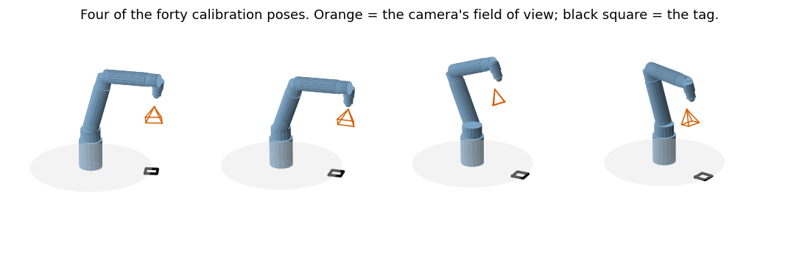
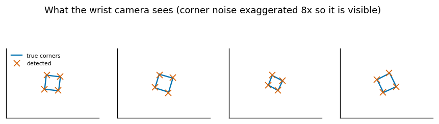
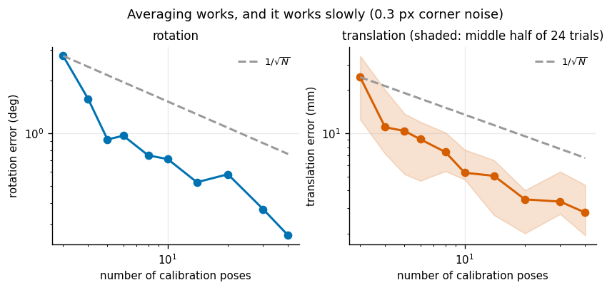
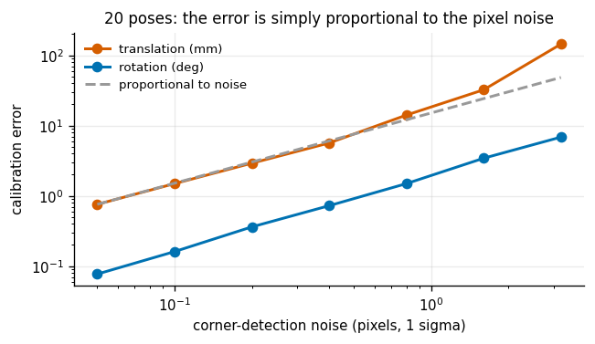
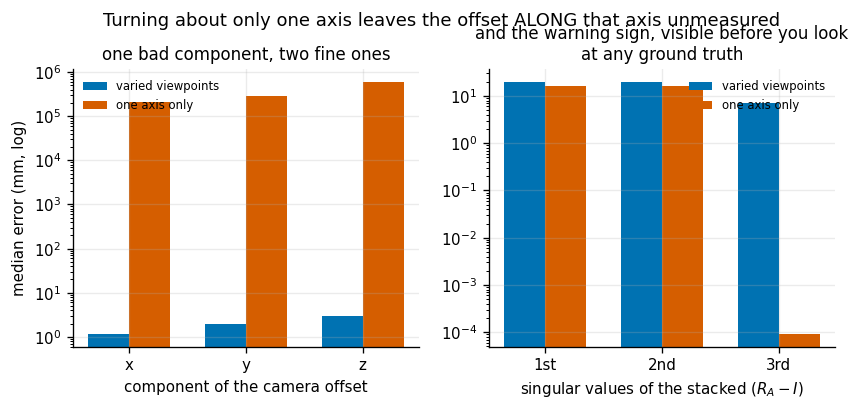
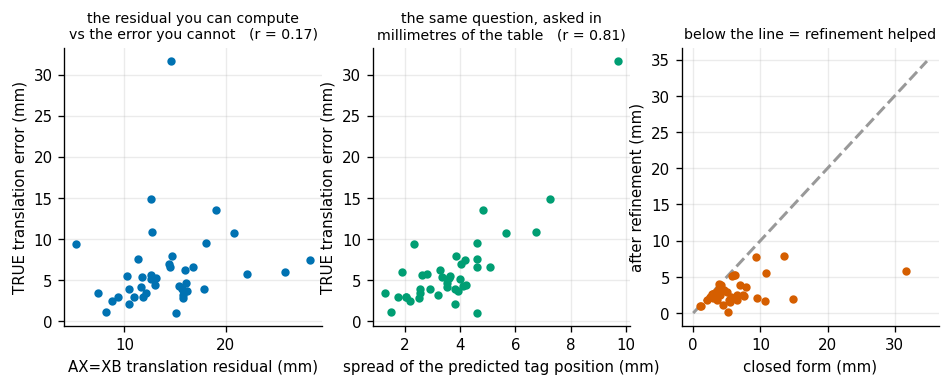

# Hand-Eye Calibration

## Key Insight

A camera bolted to a robot arm is useless until you know the exact [transform](/shared/glossary/#homogeneous-transform) between the camera's frame and the arm's frame, and you cannot measure that offset with a ruler. [Hand-eye calibration](/shared/glossary/#hand-eye-calibration) recovers it by moving the arm to many poses, recording how a fixed [tag](/shared/glossary/#apriltag) appears to shift in the camera, and solving the resulting `AX = XB` equation, where the unknown `X` is the rigid camera-to-hand offset. Get it right and the arm can grasp whatever the camera sees; get it wrong by even a degree and every grasp drifts, which is why reporting the residual error is part of finishing the project.

**This is project 7.** It builds a full simulated calibration rig — the 7-DoF arm from project [2](../02-urdf-visualizer/README.md), a [fiducial marker](/shared/glossary/#fiducial-marker) on a table, and a real pinhole camera whose noise is added *in pixels* and turned back into a pose by `cv2.solvePnP` — then solves `AX = XB` in closed form and studies when it works.

Noise-free, the solver is exact to **5.4e-12 mm**. With realistic camera noise and 40 viewpoints it lands at **0.26°** and **2.8 mm**. Two results matter more than either number:

- Collect your poses badly — all rotations about one axis — and the answer is wrong by **200 metres**, while the residual you would normally report barely twitches.
- The residual everybody *does* report correlates with the true error at only **r = 0.17**. A different check, which costs one line, gets **r = 0.81**.

---

## Files

| file | what it is |
|---|---|
| `handeye.py` | motion pairs, the Park-Martin closed form, refinement, self-checks |
| `sim.py` | the rig: arm, tag, pinhole camera, pixel noise, `solvePnP` |
| `run.py` | six experiments |
| `outputs/` | figures and `results.csv` |

```bash
python3 run.py       # about 25 seconds; needs opencv (cv2)
```

---

## Why the offset cannot simply be measured

The unknown is `X = T_ee_camera`: the rigid transform from the arm's [end-effector](/shared/glossary/#end-effector) frame to the camera's optical frame. Here it is 78 mm of translation and 45.6° of rotation.

A ruler cannot reach it. The camera's optical centre is a point *inside* the lens assembly with no physical marking, and the end-effector frame is a mathematical fiction defined by a line in the [URDF](/shared/glossary/#urdf--mjcf--usd). Neither endpoint is a thing you can put a caliper on.

> **"The camera already reports the tag's pose. Why is another transform needed at all?"** Because the camera reports it *in camera coordinates*, and the robot can only act in *base coordinates*. Those are two descriptions of the same physical object, related by exactly one unknown transform — `X`, chained with [forward kinematics](/shared/glossary/#forward-kinematics). Until you have it, "the cup is 30 cm in front of the lens" cannot be turned into a joint command. `X` is the missing link in the chain, not a duplicate of anything already in it. Project [3](../03-forward-kinematics-from-scratch/README.md) supplies `T_base_ee`; the tag detector supplies `T_camera_tag`; `X` is the only gap between them.

### From "measure it" to "measure motion"

Park the arm at two poses that both see the same tag. The tag has not moved, so:

```
T_base_tag  =  T_base_ee(i) @ X @ T_camera_tag(i)
T_base_tag  =  T_base_ee(j) @ X @ T_camera_tag(j)
```

Set the right-hand sides equal and rearrange:

```
A X = X B        A = T_base_ee(j)⁻¹ @ T_base_ee(i)     how the HAND moved
                 B = T_camera_tag(j) @ T_camera_tag(i)⁻¹   how the CAMERA moved
```

`A` comes from the encoders and forward kinematics. `B` comes from two tag detections. `X` is the only unknown, and it sits *sandwiched* between them, which is what makes this an equation you can solve rather than a subtraction you cannot.

The physical intuition: if the camera were exactly at the end-effector frame, `A` and `B` would be the same motion. They are not, and how they differ is entirely determined by the offset between the frames. Watching the mismatch over many motions pins the offset down.

40 poses give **780** motion pairs, since every pair of viewpoints is usable.

---

## The rig



Each viewpoint is generated backwards from what you want to see: pick a camera position on a dome above the tag, aim it at the tag centre, add a random roll about the line of sight, convert the wanted *camera* pose into the required *arm* pose via `T_base_ee = T_base_camera @ X⁻¹`, then solve [IK](/shared/glossary/#inverse-kinematics) with project [5](../05-damped-least-squares-ik/README.md)'s solver. Reject anything unreachable or with the tag out of frame.

### Noise is added in pixels, not in poses



The tag's four corners are projected with `cv2.projectPoints`, Gaussian noise is added **to the pixel coordinates**, and `cv2.solvePnP` turns the noisy pixels back into a pose — exactly what a real [AprilTag](/shared/glossary/#apriltag) pipeline does.

> **"Why not just add noise to the tag pose directly? It is much simpler."** Because it would give every direction the same error, and real camera noise emphatically does not. Sideways position is pinned down tightly by the pixels — move the tag 1 mm left and the whole image shifts visibly. Distance is inferred from the marker's apparent *size*, which changes very slowly with range, so depth is always the noisiest number a [Perspective-n-Point](/shared/glossary/#perspective-n-point) solver returns. That asymmetry survives into the calibration result and into which parts of it you should distrust. Simulating the wrong noise gives you a study of a camera that does not exist.

---

## The solver: Park & Martin (1994)

Rotation first, then translation.

**Rotation.** Taking the [logarithm](/shared/glossary/#exponential-map) of `R_A R_X = R_X R_B` turns rotations into rotation vectors and the equation into `α = R_X β` — an ordinary "rotate this arrow onto that arrow" problem, one arrow pair per motion. The least-squares answer is

```
M = Σ β αᵀ          R_X = (MᵀM)^(−1/2) Mᵀ
```

The inverse square root is what strips the stretch out of `M` and leaves a pure rotation — the same idea as project [1](../01-transform-calculator/README.md)'s `orthonormalize`, computed here from a symmetric eigendecomposition.

**Translation.** With `R_X` known, the translation part of `A X = X B` is

```
(R_A − I) t_X = R_X t_B − t_A
```

which is *linear* in `t_X`. Stack every pair and solve by least squares. That `(R_A − I)` factor is where all the trouble in section 4 comes from.

---

## 1. Noise-free: the solver is exact

| | |
|---|---|
| rotation error | **4.7e-13 °** |
| translation error | **5.4e-12 mm** |
| `AX = XB` residual | 4.2e-12 ° |

Worth running before anything else. If the noise-free case is not exact, the problem is your algebra or your frame conventions, and no amount of tuning noise models will find it. Separate "is my maths right?" from "how does it behave under noise?" and debug them one at a time.

---

## 2. How many poses do you need?



At 0.3 px corner noise, median over 24 trials:

| poses | rotation error | translation error |
|---|---|---|
| 3 | 2.78° | 24.6 mm |
| 5 | 0.92° | 10.4 mm |
| 10 | 0.71° | 5.3 mm |
| 20 | 0.58° | 3.5 mm |
| 40 | **0.26°** | **2.8 mm** |

Both curves follow the `1/√N` reference closely, which is the ordinary law for averaging independent noise: to halve the error you need four times the data.

The practical reading is a warning against both extremes. Three poses is technically enough — the equation is solvable — and gives 25 mm of error, which will miss a grasp. But going from 20 to 40 poses buys only 0.7 mm, and each pose costs real time on a real robot. Twelve to twenty is the sweet spot, and the way to do better after that is **not more poses**; it is better viewpoint diversity (section 4) and a better estimator (section 6).

---

## 3. Camera noise maps almost linearly onto calibration error



20 poses, sweeping the corner-detection noise:

| corner noise | translation error |
|---|---|
| 0.05 px | 0.76 mm |
| 0.2 px | 2.9 mm |
| 0.8 px | 14.1 mm |
| 3.2 px | 144 mm |

Roughly proportional up to about 1 px, then worse than proportional — at 3.2 px `solvePnP` itself starts producing badly wrong poses and the linear relationship breaks.

The engineering consequence is direct: **corner accuracy is the lever.** Halving your detector's noise halves your calibration error, exactly and for free. That means good lighting, a big tag, a well-focused lens, sub-pixel corner refinement, and a properly done intrinsic [camera calibration](/shared/glossary/#camera-calibration) first. Those are cheaper than doubling the number of arm poses, which buys only `√2`.

---

## 4. The failure that looks like success



Repeat the calibration with 20 viewpoints arranged as a **turntable**: same height, same tilt, same roll, only the azimuth varying. The tag is beautifully visible in every frame. Every image looks perfect.

| | varied viewpoints | one axis only |
|---|---|---|
| error along x | 1.2 mm | **207 m** |
| error along y | 1.9 mm | **292 m** |
| error along z | 2.9 mm | **595 m** |
| smallest [singular value](/shared/glossary/#singular-value-decomposition) of the translation system | 7.17 | **9.1e-5** |
| reported `AX = XB` translation residual | 9.4 mm | 253 mm |

The answer is wrong by **hundreds of metres**. Not degraded — meaningless.

The cause is visible in the algebra. Every row block of the translation system is `(R_A − I)`, and a rotation matrix minus the identity **annihilates its own rotation axis**: turning about an axis tells you nothing whatsoever about the offset *along* that axis. Normally that is fine, because different motions have different axes and between them they cover all three directions. When every motion shares one axis, the stacked matrix is rank 2, one direction is not merely noisy but **entirely absent from the data**, and least squares returns whatever the round-off suggests.

Two things make this the most practically important result in the project:

**It is easy to do by accident.** A turntable, a robot with one joint locked, a fixture that constrains the wrist, an operator who moves the arm in a comfortable arc — all produce it. Nothing about the images warns you.

**The usual quality check barely notices.** The residual grew from 9 mm to 253 mm, a factor of 27, while the actual error grew by a factor of **200,000**. If your acceptance criterion is "residual under 50 mm", this catastrophe passes with room to spare on a scale that has no natural threshold.

The reliable warning sign needs no ground truth at all: **the smallest singular value of the stacked `(R_A − I)` matrix**, which collapses from 7.17 to 9.1e-5 — four orders of magnitude, unambiguous.

```python
def translation_conditioning(AB):
    C = np.vstack([A[:3,:3] - np.eye(3) for A, _ in AB])
    return np.linalg.svd(C, compute_uv=False)      # look at the smallest
```

Practical rule, from the geometry rather than from taste: **your motions must rotate about at least two clearly different axes**, and the more different the better. That is exactly why `sim.collect` randomises the camera roll about its own line of sight. Rolling changes nothing about what is visible and everything about whether the problem is solvable — a fine example of a step that looks pointless until you measure what it buys.

---

## 5. The self-check everybody reports does not work



On a real robot you have no ground truth. You have the `AX = XB` residual, which is what calibration tools print and what papers report. Across 40 trials with varying pose counts:

| ground-truth-free check | correlation with the TRUE translation error |
|---|---|
| `AX = XB` residual | **r = 0.17** |
| spread of the predicted tag position | **r = 0.81** |

The standard residual is very nearly uninformative. Section 4 showed why in the extreme case; the middle panel shows it in the ordinary case too.

The check that works is one line, and its logic is simpler than the residual's:

```python
P = np.array([(T_base_ee @ X @ T_cam_tag)[:3,3] for ...])
spread = np.linalg.norm(P - P.mean(axis=0), axis=1).max()
```

The tag never moved. So predict where the tag is from *every* observation using your estimated `X`, and see how far apart the predictions land. If `X` is right they all agree; if it is wrong they scatter.

> **"Both numbers measure inconsistency. Why does one work and the other not?"** They measure inconsistency of different things. The `AX = XB` residual is built from *pairs of motions*, and errors that are consistent across pairs — exactly the systematic errors that come from a biased `X` — partly cancel inside it. The tag-scatter check is built from *absolute predictions against a single fixed truth*, so a biased `X` makes every prediction wrong in a correlated way and the scatter grows. It also has the practical virtue of being in units a person can reason about: millimetres of disagreement about where a thing on the table is, which is directly comparable to how precisely you need to grasp it.

Report both. The residual is nearly free and catches gross blunders. The scatter is what you should actually gate on.

---

## 6. Refinement halves the error

The closed form throws information away: it only ever looks at *differences* between poses, so absolute agreement is never enforced. A [Gauss-Newton](/shared/glossary/#gauss-newton) refinement fixes that by estimating `X` **and the tag's pose** together — twelve unknowns, six residuals per observation, where each residual is "where this observation says the tag is, versus where we currently think it is".

| | closed form | after refinement |
|---|---|---|
| median translation error | 5.16 mm | **2.60 mm** |
| median rotation error | 0.578° | 0.548° |
| trials improved | — | **97.5%** |

Translation error halves. Rotation barely moves, which makes sense: the closed form already solves rotation with a dedicated least-squares fit, while translation is a downstream by-product of it.

The closed form is still needed — Gauss-Newton needs a starting point close enough to converge, and Park-Martin supplies one from nothing. **Closed form for initialisation, non-linear refinement for accuracy** is the standard shape of estimation problems in robotics, and it is the same pattern you will meet again in bundle adjustment and [pose-graph](/shared/glossary/#pose-graph) [SLAM](/shared/glossary/#slam).

---

## What 0.26° and 2.8 mm mean in practice

The Key Insight says "get it wrong by even a degree and every grasp drifts". Concretely: a 1° rotation error, applied at a working distance of 30 cm, moves the predicted grasp point by `0.3 × tan(1°)` ≈ **5.2 mm**. Add the translation error directly. For a [gripper](/shared/glossary/#gripper) with a 10 mm capture range, a 1° calibration is already at the edge; 0.26° plus 2.8 mm sits comfortably inside it.

That is the real reason to report the residual and the scatter: not to fill a table, but because calibration error is a fixed budget that everything downstream spends. Project [5](../05-damped-least-squares-ik/README.md)'s IK converges to 1e-5 m, and project [3](../03-forward-kinematics-from-scratch/README.md)'s forward kinematics is exact to 5e-16 m. Neither matters if `X` is off by a centimetre.

---

## What to take away

1. **You cannot measure `X`; you must infer it from motion.** `A X = X B`, with `A` from the encoders and `B` from the tag.
2. **Run the noise-free case first.** If it is not exact, the bug is in your algebra, not your noise model.
3. **Simulate noise where it lives.** Pixel noise and pose noise have different shapes, and the difference propagates into which parts of the answer you should trust.
4. **Error falls as `1/√N`.** Twelve to twenty poses is the sweet spot; past that, improve the *diversity* and the *estimator*, not the count.
5. **Corner accuracy is the strongest lever** — the error is proportional to pixel noise up to about 1 px.
6. **Rotate about at least two clearly different axes.** One shared axis leaves the offset along it entirely unmeasured, and the answer can be wrong by 200 metres while every image looks perfect.
7. **The `AX = XB` residual is a weak quality signal (r = 0.17).** Use the tag-prediction scatter (r = 0.81), and gate on the conditioning of `(R_A − I)`.
8. **Closed form to initialise, Gauss-Newton to refine.** It halves the translation error and helps in 97.5% of runs.

---

## Phase 1 in one line

Seven projects, one chain: **represent a pose** ([1](../01-transform-calculator/README.md)) → **describe a robot** ([2](../02-urdf-visualizer/README.md)) → **place its parts** ([3](../03-forward-kinematics-from-scratch/README.md)) → **differentiate that** ([4](../04-jacobian-from-scratch/README.md)) → **invert it** ([5](../05-damped-least-squares-ik/README.md)) → **spend what is left over** ([6](../06-null-space-posture-control/README.md)) → **connect it to a camera** (7).

Every one of them turned out to have the same failure mode, which is the real lesson of the phase: **frame and convention errors do not crash.** A transposed rotation still draws a robot. A screw twist used where a point twist was wanted still tracks a path, 110 mm to one side. A one-axis calibration still returns a clean-looking `X`, 200 metres wrong. Nothing raises an exception; the robot simply goes somewhere else. That is why every project here ends in a *measurement* rather than a picture, and why the numbers that matter most were the ones that came out wrong.
