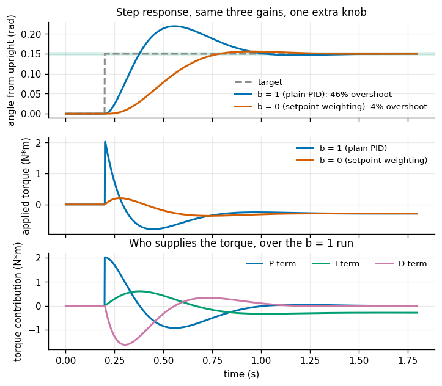
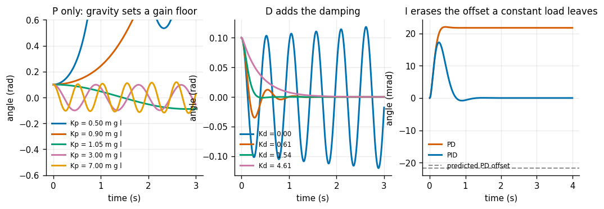
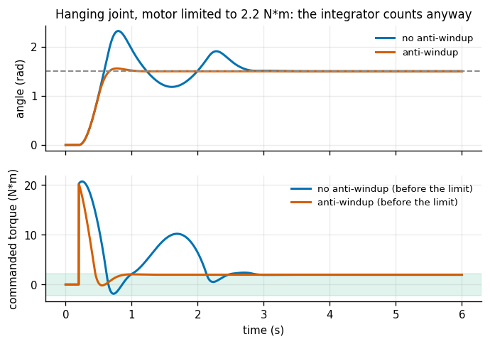
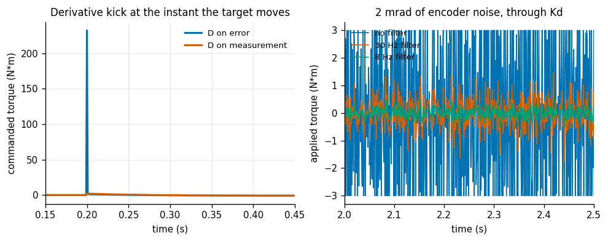
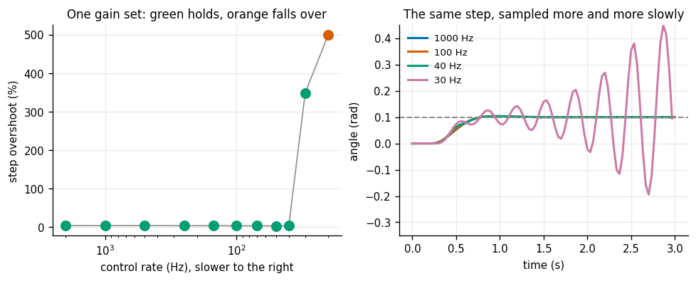
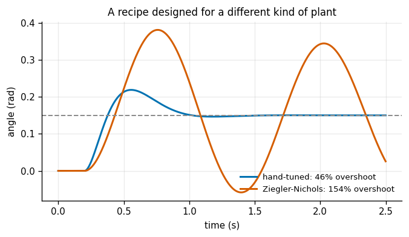
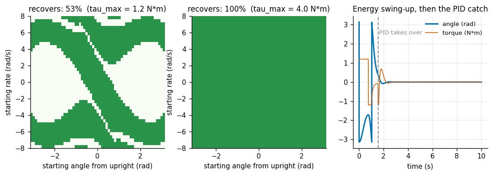

# Pendulum PID

## Key Insight

A [pendulum](/shared/glossary/#pendulum) is the smallest system where you can watch every term of a [PID controller](/shared/glossary/#pid) earn its keep: the proportional term pulls the pole back toward the upright [setpoint](/shared/glossary/#setpoint), the derivative term damps the swinging so it stops overshooting, and the integral term erases any steady lean left by gravity or a miscalibrated model. This project stabilizes the pole *once it is already near upright* — holding a balance point, which PID does well — rather than the harder swing-up from hanging, where a weak motor must pump energy in over several swings and plain PID is not enough on its own. Plotting the [step response](/shared/glossary/#step-response) — how the angle reacts when you suddenly command a new target — is how you read off, in one picture, whether your gains are too sluggish, too twitchy, or just right.

**This is project 8.** It is the first project of Phase 2 and the first one where the robot *moves under its own control* rather than being asked where it is. It builds `pid.py` — the controller class that project [14](../14-real-arm-pid-tune/README.md) also uses — and `pendulum.py`, then runs seven experiments. Two of the seven contradict things you will read in tutorials.

---

## Files

| file | what it is |
|---|---|
| `pendulum.py` | the plant: a torque-driven pendulum, plus the closed-loop simulator |
| `pid.py` | the controller: PID with the five details real implementations need |
| `run.py` | the seven experiments |
| `outputs/` | figures and `results.csv` |

```bash
python3 run.py       # about 60 seconds, NumPy and Matplotlib only
```

---

## The system, and why upright is the hard part

`theta` is measured from **straight up**. So `theta = 0` is balanced and `theta = pi` is hanging at rest. The equation of motion is

```
I * theta_ddot  =  tau  -  b * theta_dot  +  m*g*l * sin(theta)
```

with `I = m*l**2 = 0.08 kg m^2`, `m*g*l = 1.962 N m`, and a small viscous drag `b = 0.01`.

That **plus** sign in front of gravity is the entire difficulty. For a *hanging* pendulum the sign would be minus, and gravity would pull the pendulum back to rest all by itself. Upright, gravity pushes harder the further you tip — it behaves like a spring wound the wrong way.

Near `theta = 0`, `sin(theta)` is very nearly `theta`, so a plain proportional controller `tau = -Kp * theta` gives

```
I * theta_ddot  =  -(Kp - m*g*l) * theta  -  b * theta_dot
```

Read the bracket. The closed loop behaves like a spring of stiffness `Kp - m*g*l`. Below `Kp = m*g*l = 1.962` that spring pushes the *wrong way* and no amount of patience will balance the pendulum. Gravity has eaten your first 1.962 units of gain before you get to use any.

> **"Why simulate two different clocks?"** `pendulum.py` integrates the physics with a small fixed step ([Runge-Kutta](/shared/glossary/#runge-kutta), 0.2 ms) while the controller runs on its own, slower clock and holds its output constant in between — a [zero-order hold](/shared/glossary/#zero-order-hold), which is exactly what a real control loop does. Keeping the clocks separate is what makes experiment 5 mean anything. If the controller ran at the physics rate, changing the control rate would also change the accuracy of the physics, and you could never tell which of the two caused the failure.

The loop also carries **one sample of dead time** by default: the controller reads the encoder, computes, and the answer reaches the motor at the start of the next period. That one period is not a detail — it is what gives the loop a finite ultimate gain in experiment 6. A delay-free model of a nearly frictionless plant would tolerate arbitrarily large gains, which no physical machine does.

---

## 1. The step response, and a knob that is not a gain



The gains are placed rather than guessed. Asking for a closed loop with natural frequency `wn = 12 rad/s` and damping ratio `zeta = 0.8` gives

```
Kp = m*g*l + I*wn**2      = 13.48 N m/rad     <- note the m*g*l that gravity ate
Kd = 2*zeta*wn*I          = 1.54 N m s/rad
Ki = 40                                        (chosen, then checked)
```

The step is a jump in the *target* angle from 0 to 0.15 rad. And the textbook PID formula does this with it:

| | plain PID (`b = 1`) | with [setpoint weighting](/shared/glossary/#setpoint-weighting) (`b = 0`) |
|---|---|---|
| rise time (10–90%) | **122 ms** | 351 ms |
| [overshoot](/shared/glossary/#overshoot) | **45.9%** | **3.9%** |
| [settling time](/shared/glossary/#settling-time) (2% band) | 1063 ms | **935 ms** |
| steady-state error | 0.16 mrad | −0.19 mrad |
| peak angle after a 0.2 N·m push | 13.7594 mrad | 13.7594 mrad |

46% overshoot from carefully placed poles looks like a mistake, and it is not. The overshoot does not come from the poles; it comes from a **zero** that the PID structure adds to the path from target to output. With the derivative taken on the measurement (see below), the target reaches the output through `Kp*s + Ki`, which contributes a zero at `-Ki/Kp = -2.97` — slow compared with `wn = 12`, and a slow zero means overshoot.

> **"Isn't `b` just another proportional gain? We already have `Kp`."** No, and this is the distinction worth internalising. `Kp` decides how hard the loop pushes back against *any* deviation, whether the operator moved the target or the world shoved the pendulum. `b` decides only how much of a *target change* is allowed to reach the output immediately. They answer different questions, and the last row of the table proves it: the response to a 0.2 N·m disturbance is **13.7594 mrad in both cases, identical to six digits**, because a disturbance does not move the setpoint and so never touches the `b` path. So `b = 0` buys a 12× reduction in overshoot at the cost of a slower *target-following* response and **nothing else at all**. That is a rare bargain, and it is why the form with `b = 0` has its own name in industry ("I-PD") and is the default on a lot of process controllers.

The bottom panel of the figure separates the three terms. Watch the order they act in: D spikes first and briefly (it sees the motion starting), P does the bulk of the work, and I only becomes visible late, quietly removing the last fraction of a milliradian.

---

## 2. What each gain actually does



**Proportional, and the floor gravity sets.** Releasing the pendulum from 0.10 rad with P only:

| `Kp` | tilt after 3 s |
|---|---|
| 0.50 × m·g·l | 2.04 rad (fallen over) |
| 0.90 × m·g·l | 0.85 rad (fallen over) |
| 1.05 × m·g·l | 0.087 rad (just holding, ringing) |
| 3.00 × m·g·l | 0.053 rad |
| 7.00 × m·g·l | 0.029 rad |

The cliff sits exactly where the algebra said it would. Below `m·g·l` the pendulum falls; a hair above it, it survives.

**Derivative, and why more is not better.** Time for the angle to come back inside a 5 mrad band:

| `Kd` | time to settle |
|---|---|
| 0 | never (it rings forever) |
| 0.4 × Kd | 659 ms |
| 1.0 × Kd | **282 ms** |
| 3.0 × Kd | 1165 ms |

A clean U-shape. Too little damping and it oscillates; too much and the derivative term fights every motion including the ones you wanted, so recovery crawls. The minimum is near critical damping, which is exactly what the pole placement was aiming at.

**Integral, and the one thing P and D cannot do.** Hang a constant 0.25 N·m load on the pendulum — an off-centre payload, or a motor with a small bias:

| controller | steady offset |
|---|---|
| PD | **21.70 mrad** |
| predicted, `-load / (Kp - m*g*l)` | **21.70 mrad** |
| PID | 0.0000 mrad |

The prediction matches the measurement to four digits, which is worth pausing on: it confirms that near upright the closed loop really does behave like a spring of stiffness `Kp - m·g·l`, gravity's bite included. A proportional term can only produce force when there *is* an error, so against a constant load it must settle at whatever error produces exactly enough force to balance it. The integral term has no such limitation — it keeps accumulating until the error is zero, and then holds whatever output it reached.

---

## 3. Integral windup, and the one experiment that turns the pendulum over



This is the only experiment that flips the pendulum the right way up, and the reason is worth stating: [integral windup](/shared/glossary/#integral-windup) needs the motor to sit at its limit for a *long stretch*, and an inverted pendulum falls over in a fraction of a second once it is beyond what the motor can hold. You never get the long saturated stretch — only a crash. A hanging joint is stable on its own and will sit there saturated for as long as the move takes. This is also the honest setting: windup is a positioning-servo problem, and almost every joint on a real robot arm is exactly that, a load gravity pulls back toward rest.

A 1.5 rad move with a 2.2 N·m motor. `Kp × 1.5 = 20 N·m` is nine times the limit, so the motor spends the first part of the move flat out with the integrator counting the whole time.

| | no anti-windup | with [anti-windup](/shared/glossary/#anti-windup) |
|---|---|---|
| overshoot | **54.6%** | **3.9%** |
| settling time | 2551 ms | **727 ms** |
| peak *commanded* torque (before the limit) | 20.7 N·m | 20.2 N·m |

A **14× reduction in overshoot** from an `if` statement. The mechanism is in the lower panel: while the output is pinned at 2.2 N·m the integrator has no way to know its command is going nowhere, so it keeps adding. By the time the pendulum arrives, the integrator holds a large stale command that has to be unwound before the output can come back down — and unwinding takes time, during which the pendulum sails past.

The cure implemented here is *conditional integration*: skip the integral update whenever the output is already saturated **and** the current error would push it further into the stop. Two lines.

```python
if anti_windup and u != u_sat and np.sign(e) == np.sign(u):
    pass            # already flat out in this direction; do not add more
else:
    self.integral += e * self.dt
```

---

## 4. Derivative kick, and derivative noise



Two separate reasons the naive derivative term misbehaves.

**Kick.** When the target jumps, the *error* jumps with it, and `d(error)/dt` across one sample is a spike of nearly unbounded height:

| | peak commanded torque at the step |
|---|---|
| D on the error | **232.4 N·m** |
| D on the measurement | 2.0 N·m |

A **115× spike**, lasting one sample, from an ordinary target change. On hardware that is a bang and possibly a tripped driver. The fix costs one minus sign: differentiate the *measurement* instead of the error, since `d(error) = -d(measurement)` whenever the target is standing still, and the measurement — being the position of a physical object — cannot jump.

**Noise.** Now add 2 mrad of encoder noise, about what a 12-bit [encoder](/shared/glossary/#encoder) gives over one revolution:

| | applied torque RMS | angle RMS |
|---|---|---|
| no filter | **2.41 N·m** | 19.26 mrad |
| 30 Hz filter on D | 0.54 N·m | **0.26 mrad** |
| 8 Hz filter on D | **0.18 N·m** | 0.27 mrad |

Read the second column before the first. Without filtering, the controller is not merely noisy — it is **74× worse at the actual job**, holding the angle to 19 mrad instead of 0.26. Differentiation amplifies noise in proportion to frequency, so the raw derivative of a jittering signal is mostly jitter, and pumping that into the motor shakes the pendulum for real. The filter is a one-line first-order low pass:

```python
alpha = dt / (dt + 1/(2*pi*f_cut))     # dt / (dt + the filter's time constant)
self._d += alpha * (raw - self._d)
```

Going from 30 Hz to 8 Hz cuts the torque RMS another 3× at essentially no cost in accuracy here — the useful part of the derivative signal on this plant lives below 8 Hz.

---

## 5. The same gains at ten control rates



One gain set, designed at 1 kHz, applied at rates from 2 kHz down to 20 Hz (with `b = 0` so the baseline overshoot is near zero and every percent that appears is caused by the sampling):

| rate | overshoot |
|---|---|
| 2000 Hz | 3.90% |
| 1000 Hz | 3.88% |
| 500 Hz | 3.83% |
| 250 Hz | 3.73% |
| 100 Hz | 3.46% |
| 50 Hz | 3.20% |
| 40 Hz | 3.57% |
| **30 Hz** | **348.6%** (falls over) |
| 20 Hz | falls over |

Two things here are not what folklore predicts.

**There is no graceful degradation.** From 2 kHz to 40 Hz — a factor of *fifty* — the response is essentially unchanged. Then one more step down and the pendulum is on the floor. Sampling does not slowly erode performance; it works, and then it does not. The practical consequence is that "it seems fine at the rate we can afford" is not evidence of margin, because a system two steps from the cliff looks identical to one fifty steps away.

**Overshoot slightly *falls* as the rate drops.** 3.90% at 2 kHz down to 3.20% at 50 Hz. Slower sampling adds phase lag, which reduces damping — but it also smooths the discrete derivative term, and on this plant the second effect wins slightly until the first one wins completely. Do not read a small improvement in one metric as margin.

The design rate here is 1 kHz and the cliff is at 30 Hz, so this loop has about **33× of margin**. That is a comfortable number, and it is comfortable *because* the pendulum is slow. A 1 kHz loop on a stiff, fast joint can be two steps from the same cliff.

---

## 6. The honest inversion: Ziegler-Nichols does badly here



The classic [Ziegler-Nichols](/shared/glossary/#ziegler-nichols) recipe: turn I and D off, raise `Kp` until the loop oscillates at a steady amplitude, read off that gain (`Ku`) and the period of the hum (`Tu`), then set `Kp = 0.6 Ku`, `Ki = 1.2 Ku/Tu`, `Kd = 0.075 Ku Tu`.

Found by bisection:

| | value |
|---|---|
| ultimate gain `Ku` | 6.67 N·m/rad |
| ultimate period `Tu` | 819 ms |

> **A trap in the search itself.** The bisection starts at `Kp = 3`, safely above the gravity floor of 1.962. Below that floor the pendulum simply falls over — which also looks like "the amplitude grew" to a detector that just compares early and late swing size. Bisecting from zero converges on the gravity floor and reports it as the ultimate gain. The two failures are physically opposite and numerically identical.

And then the comparison:

| | overshoot | settling time | peak torque |
|---|---|---|---|
| hand-tuned (pole placement) | **45.9%** | **1063 ms** | 2.03 N·m |
| Ziegler-Nichols | **154.0%** | never settles | 1.17 N·m |

Ziegler-Nichols is not a bad method; it is a method **for a different kind of plant**. Ziegler and Nichols derived it in 1942 for industrial process loops — temperature, flow, level — which are *self-regulating* (leave them alone and they settle somewhere) and dominated by transport delay. This pendulum is the opposite: open-loop *unstable*, and almost frictionless. The recipe's assumption that a quarter-amplitude-decay response is desirable is also a process-control value judgement; on a robot joint, a response that overshoots by a quarter every time is a response that bangs into things.

Notice also that the hand-tuned `Kp = 13.48` is **twice `Ku`**. That is not a contradiction: `Ku` is a *proportional-only* property. With `Kd = 1.54` supplying real damping, the loop is happy at a gain that would oscillate without it. Any tuning rule that computes all three gains from one number measured with the other two switched off is making a strong assumption about how they interact.

---

## 7. The basin of attraction, and the problem PID cannot solve



Give the motor a 1.2 N·m limit — deliberately **less** than `m·g·l = 1.96 N·m`, so it cannot hold the pendulum horizontal at all — and sweep 2,501 starting states (angle × rate):

| | recovers |
|---|---|
| 1.2 N·m motor | **53.4%** of the grid |
| 4.0 N·m motor | **100%** |
| largest recoverable tilt from rest, 1.2 N·m | **36°** |

The green region is the [basin of attraction](/shared/glossary/#basin-of-attraction): the set of starting conditions from which this controller actually recovers. Its boundary is set by the torque limit, not by the gains — with a strong enough motor the same gains recover from everywhere on the grid.

> **The 2,501 simulations run as NumPy arrays, not a loop.** The scalar simulator would need one Python loop per grid point; running the whole grid as arrays turns 2,501 simulations into 1,500 array operations. The physics and the controller are identical — only the bookkeeping differs.

**And then the part PID structurally cannot do.** Start hanging (`theta = pi`) with a motor too weak to lift the pendulum, and no gain setting will help: the controller can only push toward the target, and at 90° gravity out-pulls it. The way up is to stop thinking about position and think about *energy*. Differentiating the pendulum's mechanical energy along its own motion gives

```
dE/dt  =  theta_dot * tau  -  b * theta_dot**2
```

so pushing in the direction the pendulum is **already moving** always adds energy, whatever the angle:

```
tau  =  k * (E_top - E) * sign(theta_dot)
```

Several swings, each a little higher — exactly how a child on a playground swing gets going. Measured:

| | |
|---|---|
| hand-over to PID | **1.54 s** |
| final angle after the catch | **0.0000 rad** |
| peak swing-up torque used | 1.20 N·m (the full limit) |

> **A sign error worth naming, because it is the first thing this script got wrong.** The famous Åström-Furuta swing-up law carries an extra `cos(theta)` factor. That version is for a **cart-pole**, where the input is a horizontal *cart acceleration* rather than a torque at the pivot — the `cos` converts one to the other. Copied here, it pumps no energy at all and the pendulum hangs there forever while the plot looks entirely plausible. The lesson generalises: a control law is only correct relative to a specific definition of "the input", and that definition is usually left implicit in the paper.

Note also the second term of the energy equation, `- b * theta_dot**2`. Friction always removes energy, whatever you do. That is why a motor limit *near* the friction level can leave a pendulum that never quite makes it up, no matter how many swings you allow.

---

## What the library gives project 14

```python
from pid import PID, step_metrics

ctrl = PID(kp, ki, kd, dt=1e-3,
           u_min=-3.0, u_max=3.0,     # the motor's real limit
           d_on_measurement=True,      # no derivative kick
           d_filter_hz=30.0,           # no derivative noise
           anti_windup=True,           # no stale integral
           b_sp=0.0)                   # no overshoot from the target zero
u = ctrl(setpoint, measurement)
m = step_metrics(t, y, target)         # rise, overshoot, settle, steady error
```

Every one of those five keyword arguments exists because of one of the experiments above. Project [14](../14-real-arm-pid-tune/README.md) reuses this exact class against a joint model with friction, [backlash](/shared/glossary/#backlash) and latency, and finds that three of the five matter even more there.

---

## What to take away

1. **Gravity charges you `m·g·l` of proportional gain before you get to use any.** Below that floor an inverted pendulum is unstabilisable by P, at any patience.
2. **Overshoot from a well-placed pole pair usually comes from the controller's zero, not the poles.** [Setpoint weighting](/shared/glossary/#setpoint-weighting) removes it for free — disturbance rejection is identical to six digits.
3. **Anti-windup is two lines and worth 14× of overshoot.** Every real actuator saturates, so this is not an edge case.
4. **Differentiate the measurement, and filter it.** 115× less torque spike, and 74× better angle holding under realistic encoder noise.
5. **Sampling rate does not degrade gracefully — it cliffs.** Fifty-fold margin and two-fold margin look identical from the outside.
6. **Ziegler-Nichols is a recipe for self-regulating process loops.** On an unstable, low-friction plant it gives 154% overshoot where hand placement gives 46%.
7. **PID holds a balance point; it does not find one.** Swing-up is an energy problem, and the correct energy law depends on what "the input" physically is.

## Next

Project [9](../09-cart-pole-lqr/README.md) keeps the pendulum but takes the motor away from it — the only actuator is now a cart underneath, and one knob has to steer four state variables at once.
