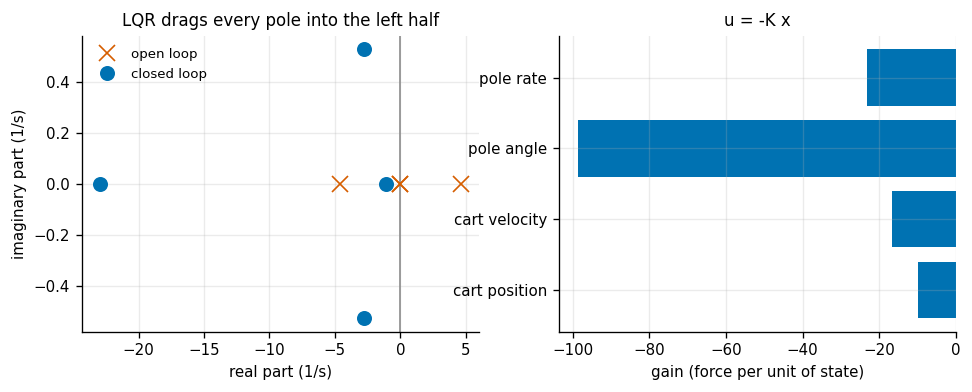
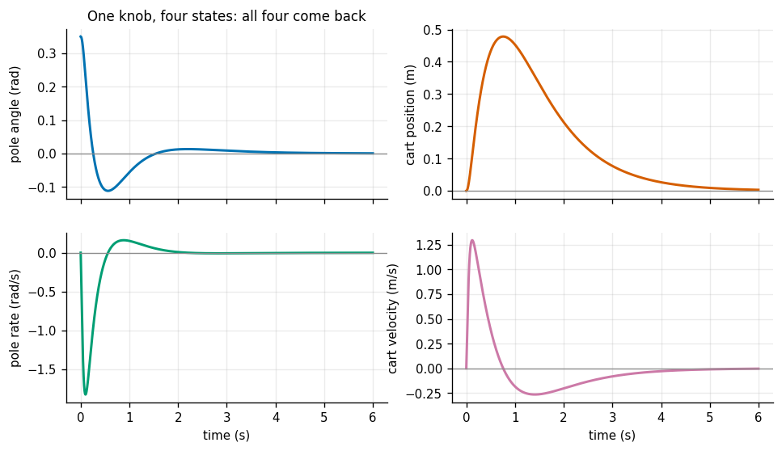
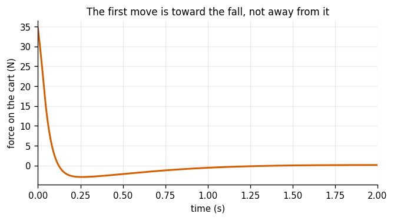
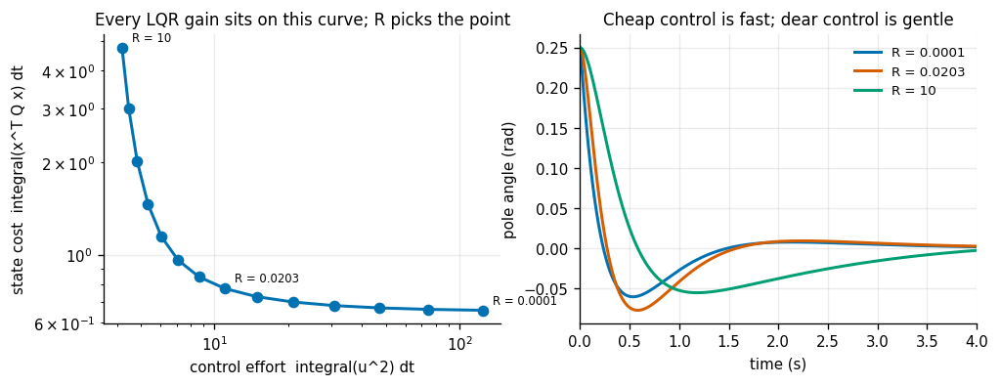
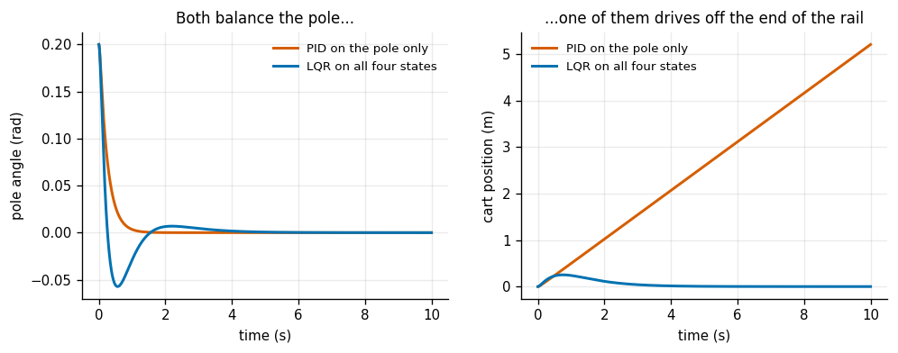
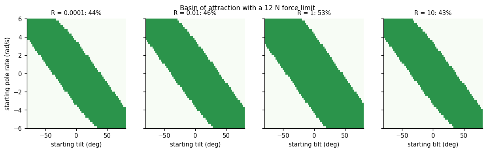
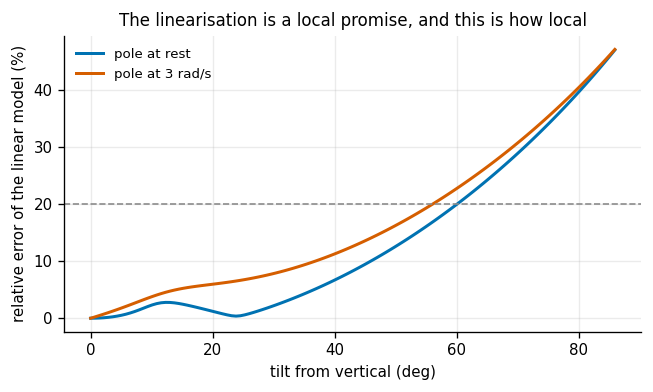
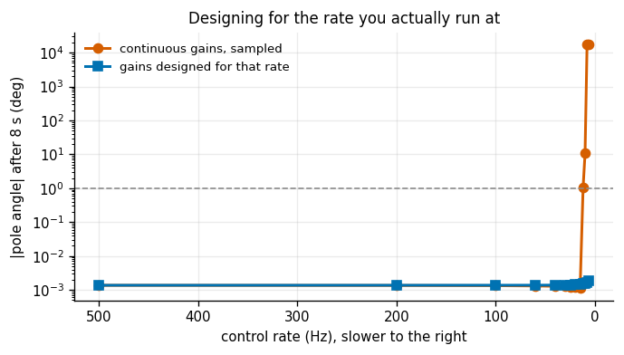

# Cart-Pole LQR

## Key Insight

The [cart-pole](/shared/glossary/#cartpole) is nonlinear, but near the upright balance point it behaves almost like a simple linear system, and the [Linear-Quadratic Regulator (LQR)](/shared/glossary/#lqr) is the optimal feedback controller for exactly that case — it picks the control that minimizes a weighted sum of how far the [state](/shared/glossary/#state) strays and how much force you spend. The trick is *linearization*: you replace the true dynamics with their [state-space](/shared/glossary/#state-space-representation) approximation `ẋ = Ax + Bu` taken right at the upright [setpoint](/shared/glossary/#setpoint), solve once for a constant gain matrix `K`, and apply `u = -Kx` forever after. Because that approximation only holds nearby, the controller has a [basin of attraction](/shared/glossary/#basin-of-attraction) — the region of starting tilts and speeds it can actually recover from — and pushing past its edge is where you watch the linear model's promises break and the pole topple.

**This is project 9.** It builds `lqr.py` — a [Riccati](/shared/glossary/#riccati-equation) solver written twice, by two unrelated methods — and `cartpole.py`, then runs seven experiments. The most interesting result is experiment 5, where the *optimal* controller turns out to have a smaller basin of attraction than a deliberately gentler one.

---

## Files

| file | what it is |
|---|---|
| `cartpole.py` | the plant: nonlinear dynamics, its linearisation, and a simulator |
| `lqr.py` | two Riccati solvers, a matrix exponential, and the discrete-time LQR |
| `run.py` | the seven experiments |
| `outputs/` | figures and `results.csv` |

```bash
python3 run.py       # about 60 seconds, NumPy and Matplotlib only
```

> **The guide's sample code calls `scipy.linalg.solve_continuous_are`. SciPy is not installed here.** That turns out to be a gift rather than an obstacle: the Riccati equation is short enough to solve *twice*, by two methods that share no code and no idea, and two independent answers are a far better test than trusting one library call. Project [1](../01-transform-calculator/README.md) made the same argument about rotation conversions.

---

## The system, and the word "underactuated"

A cart of mass `M = 1 kg` slides on a rail; a pole of mass `m = 0.1 kg` is hinged to it, free to swing, with its mass `l = 0.5 m` from the pivot. The only input is a horizontal force on the cart. The state is four numbers:

```
x = [ cart position, cart velocity, pole angle from UP, pole rate ]
```

Four numbers to steer, **one** knob to steer them with. That is what [underactuated](/shared/glossary/#underactuated) means, and it is the whole character of the problem: you cannot ask for a cart position and a pole angle independently. The only way to move the cart to the right is to first tip the pole to the right, let it start falling, and then chase it.

The nonlinear equations (Lagrange, pole as a point mass):

```
x_ddot     = ( u + m*l*theta_dot**2*sin(theta) - m*g*sin(theta)*cos(theta) )
             / ( M + m*sin(theta)**2 )
theta_ddot = ( g*sin(theta) - x_ddot*cos(theta) ) / l
```

Linearised at `theta = 0` (upright, at rest, no force) by taking `sin(theta) ≈ theta`, `cos(theta) ≈ 1` and dropping `theta_dot**2`:

```
A = [[0, 1,               0,      0],
     [0, 0,        -m*g/M,        0],
     [0, 0,               0,      1],
     [0, 0,  (M+m)*g/(M*l),       0]]
B = [0, 1/M, 0, -1/(M*l)]^T
```

Read `A` row by row and it says something physical. Row 2: tipping the pole by `theta` pushes the cart the **other** way, at `-m*g*theta/M`. Row 4 of `B`: pushing the cart forward tips the pole **backward**, at `-u/(M*l)`. Those two minus signs are the problem in a nutshell.

---

## 1. Two solvers that must agree



LQR asks for the feedback law `u = -K x` minimising

```
J = integral( x^T Q x  +  u^T R u ) dt
```

`Q` prices being in the wrong state; `R` prices the effort of fixing it. The answer turns out to be governed by one matrix `P` — the minimum total future cost from state `x` is exactly `x^T P x` — solving the continuous algebraic [Riccati equation](/shared/glossary/#riccati-equation)

```
A^T P + P A - P B R^-1 B^T P + Q = 0
```

and then `K = R^-1 B^T P`.

> **Why "Riccati"?** Jacopo Riccati was an 18th-century Venetian mathematician who studied scalar equations of the form `y' = a + b y + c y²` — quadratic in the unknown. This matrix equation is quadratic in `P` for the same reason (the `P B R^-1 B^T P` term), so it carries his name, two hundred years before anyone thought of control theory.

**Method 1: the Hamiltonian eigenvectors.** Stack the state and its "co-state" (the running price of being at `x`) into one 8-vector. The optimality conditions say that stacked vector evolves under

```
H = [[  A, -B R^-1 B^T ],
     [ -Q,   -A^T      ]]
```

`H` has a special structure — its eigenvalues come in pairs `(lambda, -lambda)` — so exactly four are stable and four unstable. The optimal solution must stay finite as time goes to infinity, so it lives entirely in the space spanned by the four **stable** eigenvectors. Write those as a block `[[X1], [X2]]` and `P = X2 X1^-1`. That is the whole method.

> "Hamiltonian" here is the same word as in Hamiltonian mechanics, for the same reason: William Rowan Hamilton's reformulation of mechanics pairs each coordinate with a momentum and evolves both together. Optimal control pairs each state with its co-state and does exactly the same thing.

**Method 2: iterate the discrete equation.** Discretise the system at a step `dt`, then repeatedly apply

```
P <- Q + Ad^T P Ad - Ad^T P Bd (R + Bd^T P Bd)^-1 Bd^T P Ad
```

until it stops moving. This is dynamic programming read backwards: `P` after `k` iterations is the optimal cost-to-go with `k` steps left to live, and as `k` grows it stops changing.

The two answers **cannot** agree exactly, and that is the point of the test. A sampled controller is genuinely a different controller from a continuous one, so the gap is proportional to `dt`. The test is not "is the gap small" but "does the gap halve when `dt` halves":

| time step | largest entry of `P_hamiltonian − P_iterated` | iterations to converge |
|---|---|---|
| 4.0 ms | 0.02406 | 3,373 |
| 2.0 ms | 0.01101 | 6,581 |
| 1.0 ms | 0.00525 | 12,840 |
| 0.5 ms | 0.00256 | 25,029 |
| **ratio when `dt` halves** | **2.11** | | |

2.11, where 2.00 is exact first order. The two solvers agree in the limit, and the residual gap is the sampling — not a bug. The Hamiltonian method's own [ARE](/shared/glossary/#riccati-equation) residual is **0.0**, exactly.

And the gain it produces, for `Q = diag(1, 1, 10, 1)` and `R = 0.01`:

| state | gain |
|---|---|
| cart position | −10.00 |
| cart velocity | −16.71 |
| **pole angle** | **−98.69** |
| pole rate | −23.14 |

The pole angle gain is ten times the cart-position gain, without anyone saying so. `Q` weighted the angle only 10× more than position, but LQR also knows from `A` that the pole is the unstable part — its worst open-loop pole is at **+4.65 /s**, meaning an untouched pole's tilt grows by `e` (about 2.7×) every 215 ms. The closed-loop poles are all in the left half-plane, from −1.07 (the slow cart-recentring mode) to −22.96 (the fast pole-catching mode).

---

## 2. Balancing the real system with a gain designed on the fake one



Released 20° off vertical, on the **nonlinear** plant, with a 20 N force limit:

| | |
|---|---|
| peak cart excursion | **0.478 m** |
| final cart position | 0.003 m |
| final pole angle | 0.022° |
| time for the angle to stay under 0.01 rad | 2.80 s |
| peak force | 34.5 N |

All four states come back, from one input. The 2.8 s is set by that slowest pole at −1.07: catching the pole takes a fraction of a second, but shepherding the cart back to the origin afterwards is deliberately gentle, because `Q` did not price cart position very highly.



The measured sign of the first significant force, relative to the direction of the tilt, is **+1** — the controller drives the cart **toward** the fall, not away from it. This is the counter-intuitive move underactuation forces, and it is worth sitting with: to bring a falling pole back upright you must slide its base *under* it, which means accelerating in the direction it is already falling. Everyone who has balanced a broom on their palm does this without thinking; a single-loop controller that "pushes back against the error" does the opposite and drops it.

---

## 3. Q against R: what "optimal" is optimal for



`Q` and `R` are not tuning knobs in the PID sense — they are a statement of what you want. Sweeping `R` from 1e-4 (control is nearly free) to 10 (control is expensive), from the same 0.25 rad start:

| `R` | peak force | settling time |
|---|---|---|
| 0.0001 | **203.4 N** | 2.91 s |
| 0.0034 | 38.5 N | 3.04 s |
| 0.1194 | 11.0 N | 3.79 s |
| 1.701 | 7.2 N | 5.73 s |
| 10 | **6.4 N** | **7.54 s** |

A **32× range in force** buying a **2.6× range in settling time**. Every one of these controllers is genuinely optimal — for its own `R`. The left panel plots them all on one curve of state cost against control effort, and no point on that curve is "better" than another; picking a point *is* the design decision. That is the real content of the word "optimal" in LQR: it does not tell you what you want, it tells you the best available trade between two things you have already priced.

Note also that the force is unbounded as `R` shrinks. LQR has no concept of a force limit; it will happily hand you a 203 N gain for a motor that can deliver 12. Which leads directly to:

---

## 4. Against a controller that only watches the pole



The fairest possible single-loop baseline: a PD on the pole angle with **exactly the LQR's own angle and rate gains** copied across, so the *only* difference is that this controller cannot see the cart at all.

| | pole angle after 10 s | cart drift after 10 s | cart speed at 10 s |
|---|---|---|---|
| PD on the pole only | **0.00000°** | **5.20 m** | 0.52 m/s |
| LQR on all four states | 0.00016° | **0.00002 m** | ~0 |

Both balance the pole perfectly. One of them is 5.2 metres down the rail and still accelerating.

This is not a bug in the PD controller — it is doing exactly its job. Nothing in its objective mentions the cart, and a cart-pole gliding at constant speed with the pole vertical is a *perfectly valid* equilibrium of the pole subsystem. The system has a mode the controller cannot see, and unobserved modes drift. The ratio here is **235,000×**, which is really just a way of saying "one of these numbers is not being controlled at all".

The general lesson costs nothing to state and a lot to learn the hard way: **a controller regulates what is in its error signal and nothing else.** If a state does not appear in the cost, you have not decided it does not matter — you have decided not to look.

---

## 5. The honest inversion: optimal is not the same as robust



Now give the cart a realistic **12 N force limit** and sweep 3,621 starting states (tilt × pole rate) for four values of `R`:

| `R` | angle gain | recovers | largest recoverable tilt from rest |
|---|---|---|---|
| 0.0001 | −813.5 | 44.5% | 39.0° |
| 0.01 | −98.7 | 46.0% | 39.0° |
| **1.0** | **−30.6** | **52.7%** | **45.8°** |
| 10 | −25.7 | 43.1% | 36.7° |

**The largest basin belongs to `R = 1`, not to the cheapest control.** The gentlest-but-one controller recovers from **18% more** starting states than the aggressive one, despite having a 27× smaller angle gain.

The reason is that "optimal" was computed for a problem with **no force limit in it**. The `R = 1e-4` gain is optimal for a cart that can push with 800 N. Give it 12 N and its commands are saturated almost immediately, so what actually reaches the plant is a crude bang-bang signal that bears little resemblance to the elegant thing the Riccati equation designed. The `R = 1` gain asks for less, stays inside the limit longer, and therefore *is* the controller it was designed to be over a wider range of states.

And the basin is not monotone in `R` either — `R = 10` is worse again, because by then the controller is simply too slow to catch a fast-falling pole even though it never saturates. There is an **interior optimum**, and it is not at either end.

The plain-language version: *optimality is relative to the problem you wrote down.* If the real world has a constraint your cost function does not mention, the optimal solution to your problem can be worse in the real world than a solution you deliberately handicapped. Project [13](../13-mpc-for-a-unicycle/README.md) is the direct answer to this — [MPC](/shared/glossary/#mpc) puts the limit *inside* the optimisation, so it plans around a constraint instead of colliding with it.

---

## 6. How local is "local"?



The linear model is a promise made at exactly one point. Measuring the relative error between `f_nonlinear(x, u)` and `A x + B u` as the tilt grows:

| | |
|---|---|
| tilt where the linear model is 5% wrong (pole at rest) | **36.8°** |
| tilt where it is 20% wrong (pole at rest) | 60.7° |
| tilt where it is 20% wrong while the pole spins at 3 rad/s | 56.3° |
| error at 45°, at rest | 9.5% |

Compare with experiment 5's largest recoverable tilt at rest: **45.8°**, where the model is about 9.5% wrong. The basin edge is not where the *linearisation* fails — it is comfortably inside that — it is where the **force limit** fails. Which is a useful correction to the intuition the Key Insight above sets up: the linear approximation is more forgiving than it sounds, and the actuator is less so.

Note also that the two curves nearly coincide. Adding 3 rad/s of pole rate barely moves the point where the model breaks, because the dropped `theta_dot**2` term is small compared with the dropped `sin`/`cos` curvature at these angles. The geometry breaks before the velocity terms do.

---

## 7. Designing for the rate you actually run at



A continuous-time gain is a fiction: real controllers sample. Applying the continuous `K` at ever-slower rates, against a gain designed for that specific rate using an exact [zero-order-hold](/shared/glossary/#zero-order-hold) discretisation:

| | lowest rate that still balances |
|---|---|
| continuous gains, sampled | **15 Hz** |
| gains designed for that rate | **6 Hz** |

A **2.5× wider usable range** for zero extra hardware. The discrete design is not a different controller philosophy — it is the same LQR, solved against a model that knows the command will be *held constant* for a whole period instead of applied continuously. At 20 Hz that difference shows up in the gains themselves:

| state | discrete gain / continuous gain |
|---|---|
| cart position | 0.49× |
| cart velocity | 0.50× |
| pole angle | 0.57× |
| pole rate | 0.56× |

The discrete design asks for roughly **half** the gain. That is the arithmetic version of "a controller that only gets to act 20 times a second should not act as if it can act continuously" — half the gain, twice the survival range.

The exact discretisation is one matrix exponential:

```
expm([[A, B], [0, 0]] * dt)  =  [[Ad, Bd], [0, I]]
```

`lqr.py` implements `expm` by scaling and squaring — divide the matrix until its norm is small, Taylor-expand, then square back up — and checks it against a plain Taylor series computed a different way (agreement: **0.0**). The lazy approximation `Ad = I + A*dt` is precisely what makes a naive discrete design disagree with a continuous one, so getting this right is what the experiment is measuring.

---

## What to take away

1. **Solve important equations twice.** Two unrelated methods agreeing to first order in `dt` is a real test; one library call is an assumption.
2. **LQR reads the physics out of `A`, not just your weights.** A 10× weight on angle produced a 10× gain on angle *and* the knowledge that the pole is the unstable mode.
3. **Underactuation makes the first move counter-intuitive.** To catch a falling pole you drive the cart toward the fall.
4. **A controller regulates what is in its error signal.** The single-loop PD balanced the pole perfectly and drove 5.2 m off the rail, because nothing told it the rail was finite.
5. **`Q` and `R` are a statement of what you want, not tuning knobs.** Every point on the trade-off curve is optimal for its own weights; picking a point is the design.
6. **Optimal is not robust.** Under a 12 N limit, the *gentlest-but-one* controller had the largest basin — 52.7% against 44.5% — because the optimality was computed for a problem with no limit in it.
7. **Design for the sample rate you can afford.** The same LQR, solved against a zero-order-hold model, survives down to 6 Hz instead of 15 Hz, and does it by asking for half the gain.

## Next

Project [10](../10-inverse-dynamics-from-scratch/README.md) leaves toy plants behind and computes the dynamics of a real robot arm from its URDF — the `M`, `C` and `g` that every controller from here on will use.
