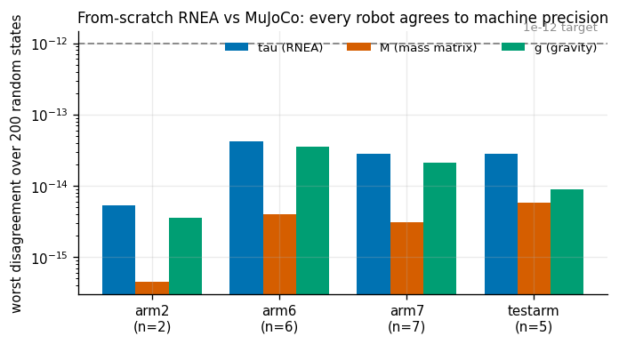
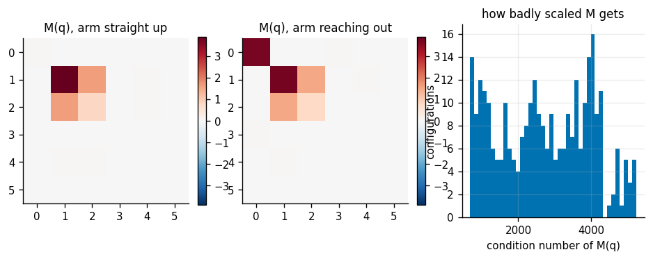
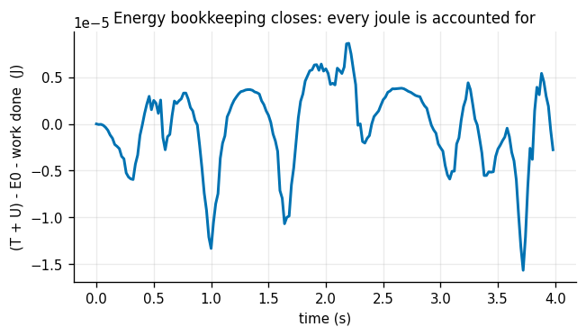
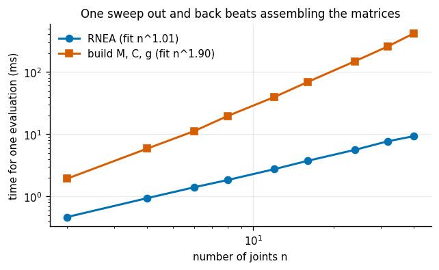
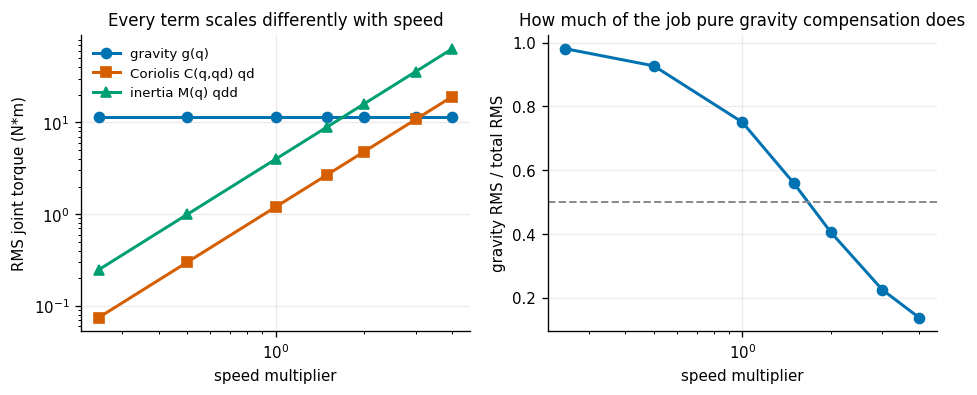
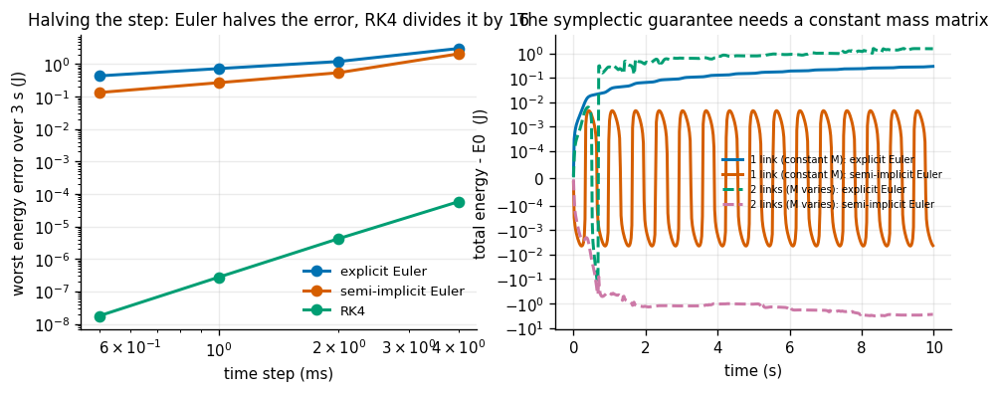
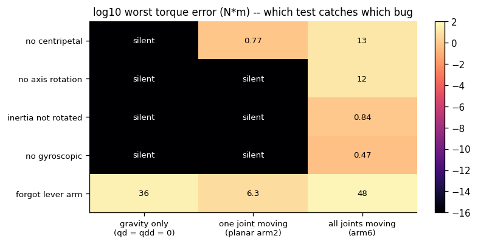

# Inverse Dynamics from Scratch

## Key Insight

[Inverse dynamics](/shared/glossary/#inverse-dynamics) answers the question a controller actually needs: *what joint torques will produce this exact motion?* The answer is the [manipulator equation](/shared/glossary/#manipulator-equation) `M(q)q̈ + C(q,q̇)q̇ + g(q) = τ`, and the [Recursive Newton-Euler Algorithm (RNEA)](/shared/glossary/#rnea) evaluates it in time that grows only linearly with the number of joints by sweeping outward to accumulate each link's velocity and acceleration, then inward to add up the forces. Coding it by hand for a 2-link arm and checking it against [Pinocchio](/shared/glossary/#pinocchio) is the cleanest way to internalize where the gravity, [inertia](/shared/glossary/#inertia), and velocity-dependent [Coriolis](/shared/glossary/#coriolis) terms each come from — a single sign error shows up immediately as a torque that disagrees with the reference.

**This is project 10**, and it is the load-bearing one for the rest of Phase 2. It builds `dynamics.py`, which projects [11](../11-computed-torque-trajectory-tracking/README.md), [12](../12-impedance-control/README.md) and [15](../15-force-controlled-drawing/README.md) all import, and verifies it against an outside reference on four different robots — including one with a sliding joint and one with a branch. Then it runs six more experiments on the result.

> **Pinocchio is not installed in this environment; MuJoCo is.** MuJoCo substitutes for it perfectly and is arguably the better reference: it reads the URDF with its own independent parser and computes kinematics and dynamics in C, so a disagreement cannot be blamed on shared code. Project [3](../03-forward-kinematics-from-scratch/README.md) made the same substitution for forward kinematics.

---

## Files

| file | what it is |
|---|---|
| `inertial.py` | reads `<inertial>` and joint effort limits out of a URDF |
| `dynamics.py` | RNEA, the mass matrix, forward dynamics, three integrators, energy |
| `models/arm2.urdf` | the textbook planar two-link arm |
| `run.py` | the seven experiments |
| `outputs/` | figures and `results.csv` |

```bash
python3 run.py       # about four minutes, NumPy, Matplotlib and MuJoCo
```

> **"Why a new parser? Project 2 already parses URDFs."** Project 2's parser reads exactly what kinematics needs — the tree, the joint origins, the axes, and the shapes to draw. Where a link *is* does not depend on how heavy it is, so it never reads `<inertial>`. Dynamics is the first place mass matters, so `inertial.py` adds that half and hangs it off an already-parsed `Robot`. Keeping it separate rather than editing `urdf.py` means the four projects already using that parser are unaffected, and a parser that reads only what it needs stays easy to trust.

---

## The algorithm, in the frame that makes it readable

Textbook RNEA works in per-link frames, which saves a few multiplies and costs a lot of readability. This implementation works entirely in the **world frame**: at six joints the saving is invisible and the readability is not.

**Outward sweep (base to tip) — kinematics.** Each link is rigidly carried by its parent, so it inherits the parent's motion first:

```
w_c   = w_p                                                  (angular velocity)
al_c  = al_p                                                 (angular acceleration)
a_c   = a_p + al_p x r + w_p x (w_p x r)                     (r = parent origin -> child origin)
```

and then the joint adds its own on top. For a revolute joint about world axis `z`:

```
w_c  += z * qd
al_c += z * qdd  +  w_p x (z * qd)
```

That last cross product is the one people drop. It is not the joint accelerating — it is the *axis itself* being carried around by the parent while the joint spins about it, and a rotating axis with a non-zero rate has an angular acceleration of its own. Experiment 7 measures exactly what dropping it costs.

**Inward sweep (tip to base) — kinetics.** Newton for the force, Euler for the torque:

```
F = m * a_com                                (Newton:  force = mass x acceleration)
N = I_world @ al + w x (I_world @ w)         (Euler:   its rotational twin)
```

then walk back toward the base accumulating whatever each subtree needs, and project onto the joint axis. A revolute joint can only supply torque *about* its axis and a prismatic joint only force *along* it — everything else is carried by the bearings, which is why those components simply do not appear in the answer.

### The gravity trick

Nothing in `dynamics.py` ever adds a gravity force. Instead the base link is given a fictitious **upward** acceleration of +9.81 m/s², and the gravity torques fall out of the same recursion that handles everything else. The justification is Einstein's equivalence principle in its most mundane form: a robot standing still on Earth and a robot accelerating upward at 9.81 m/s² in deep space feel identical forces. One less special case in the code, and it is why `gravity=False` is a one-line switch rather than a separate code path.

---

## 1. Four robots, machine precision



200 random states per robot, comparing against MuJoCo's `mj_inverse`, `mj_fullM` and a gravity-only call:

| robot | joints | worst torque disagreement | worst mass-matrix disagreement | worst gravity disagreement |
|---|---|---|---|---|
| arm2 | 2 | **5.3e-15** N·m | 4.4e-16 | 3.6e-15 |
| arm6 | 6 | 4.3e-14 | 4.0e-15 | 3.6e-14 |
| arm7 | 7 | 2.8e-14 | 3.1e-15 | 2.1e-14 |
| **testarm** | 5 | 1.2e-14 | 5.8e-15 | 8.9e-15 |

`testarm` is Phase 1's deliberately awkward fixture — non-zero `rpy` on every origin, arbitrary axes, one axis written unnormalised, **one prismatic joint**, and a **branch** for a camera bracket. It matters here for the same reason it mattered in project [3](../03-forward-kinematics-from-scratch/README.md): the tidy arms cannot catch a bug in the prismatic Coriolis term or the branch accumulation, because they contain neither.

> **A comparison bug that looks exactly like a physics bug.** The first run of this experiment reported a **430 N·m** disagreement on arm7 at `q = 0`, with everything else at machine precision. Nothing was wrong with the RNEA. MuJoCo's `mj_inverse` returns the torque needed **including whatever force the joint-limit stops are supplying**, and arm7's joint 4 at `q = 0` sits outside its limit. Our RNEA has never heard of joint limits, so leaving them enabled compares two different physics. The fix is one line — `m.opt.disableflags |= mjDSBL_CONSTRAINT` — and the lesson is that when a reference implementation disagrees with you by a huge amount at exactly one configuration, suspect the *question* before the *answer*.

---

## 2. The mass matrix, and how much it moves



`M(q)` is extracted one column at a time: column `i` is the torque needed to accelerate joint `i` at 1 rad/s² with every other joint held still, no velocity and no gravity — which is exactly the definition of the `i`-th column. So `n` RNEA calls give the whole matrix, with no new code.

Over 300 random configurations of arm6:

| | |
|---|---|
| worst asymmetry of `M`, *before* symmetrising | **4.4e-16** kg·m² |
| smallest eigenvalue of `M` | 8.7e-4 kg·m² (always positive) |
| median condition number | 2,725 |
| worst condition number | 5,249 |

The symmetry is a real test, not a formality. `M` is symmetric in exact arithmetic for deep physical reasons (it is the Hessian of the kinetic energy), and nothing in the RNEA sweep enforces it — the columns are computed independently. Getting 4.4e-16 means the implementation reproduces a property it was never told about.

And the reason `M(q)` carries a `q` at all:

| shoulder-pan inertia `M[0,0]` | |
|---|---|
| arm straight up | 0.0311 kg·m² |
| arm reaching out | **3.6912 kg·m²** |
| ratio | **119×** |

The same joint, the same motor, **119 times** more inertia to accelerate depending on where the rest of the arm is. This is a figure skater pulling their arms in, and it is why a single fixed gain set cannot be right everywhere on an arm — a gain tuned with the arm tucked will be 119× too soft with it extended. Cancelling exactly this variation is what [computed-torque control](/shared/glossary/#computed-torque-control) does in project [11](../11-computed-torque-trajectory-tracking/README.md).

The condition number of ~2,700 says something else: `M` is badly scaled, because the shoulder carries the whole arm while the wrist carries a 0.5 kg stub. Any algorithm that inverts `M` inherits that scaling, which is one reason [forward dynamics](/shared/glossary/#forward-dynamics) is numerically harder than inverse dynamics.

---

## 3. Passivity: the check no sign error survives



There is an identity every correct rigid-body model must satisfy: the matrix `Mdot − 2C` is **skew-symmetric**, meaning it equals minus its own transpose. In plain terms, the [Coriolis](/shared/glossary/#coriolis) terms shuffle energy between joints but never create or destroy any — which is what you would expect of a term that comes from geometry rather than from a motor. This is [passivity](/shared/glossary/#passivity), and it is the sharpest single check available on a hand-written dynamics implementation because it ties `M` and `C` together; a sign error in either one breaks it.

| | |
|---|---|
| worst departure from skew-symmetry of `S = Mdot − 2C` | **3.9e-10** |
| worst value of the scalar `qd^T (Mdot − 2C) qd` | 6.4e-10 W |
| worst gap between `C qd` and RNEA's velocity term | 3.1e-10 N·m |

(1e-10 rather than 1e-15 because `Mdot` and the Christoffel symbols are taken by [finite differences](/shared/glossary/#finite-difference), which is accurate to about nine digits at best — the same wall project [4](../04-jacobian-from-scratch/README.md) measured from the other side. The physics is exact; the diagnostic is not.)

> **"Why build a `C` matrix at all, if `rnea` already gives `C·qd` directly?"** Because they are different objects. A controller only ever needs the *product* `C·qd`, and one RNEA call with zero acceleration and no gravity gives it. But the matrix `C` is not unique — many different matrices produce the same product — and the passivity identity only holds for one particular choice, the one built from Christoffel symbols. So `coriolis_matrix` exists purely as a diagnostic, is slow, and is never called by a controller.

The second panel is the energy audit: drive the arm with random torques for 4 seconds and check that the change in total energy exactly equals the work done. Drift after 4 s: **2.8e-6 J**.

> **A bookkeeping error that masquerades as a physics error.** The first version of this test summed `tau · qd` using only the velocity at the *start* of each step — a rectangle rule, whose own error is proportional to `dt`. It reported a drift of **0.1 J** and looked like a broken integrator. Switching to the trapezoidal rule (average the rate before and after the step) moved it to a few millionths of a joule. The measurement was wrong, not the physics. When an error is exactly first order in your step size, suspect the measurement first.

---

## 4. O(n): why RNEA exists



Synthetic serial chains from 2 to 40 links, timing one RNEA call against the alternative of building `M`, `C` and `g` separately and multiplying:

| | fitted exponent `p` in `time ~ n^p` |
|---|---|
| RNEA | **1.01** |
| build `M`, `C`, `g` | **1.90** |

| | |
|---|---|
| speed-up of RNEA at n = 40 | **44.8×** |
| RNEA time at n = 40 | 9.3 ms |

Almost exactly the predicted linear-versus-quadratic split, measured rather than asserted. The reason is structural: RNEA never *builds* `M` — it goes straight from `(q, qd, qdd)` to `tau` in two sweeps, so doubling the joints doubles the work. Building `M` costs one RNEA call per column, so doubling the joints doubles the number of columns *and* the cost of each, giving `n²`.

The practical consequence: a controller that needs only `tau` should never assemble the matrices. Project [11](../11-computed-torque-trajectory-tracking/README.md)'s [computed-torque](/shared/glossary/#computed-torque-control) law is `tau = M qdd_cmd + C qd + g`, which *looks* like it needs all three — and is computed as a single `rnea(q, qd, qdd_cmd)` call, because that expression is precisely what RNEA evaluates.

---

## 5. Which term dominates, and when



RMS joint torque from each term of the manipulator equation, as the same trajectory is played back faster and faster:

| speed | gravity `g(q)` | Coriolis `C(q,qd) qd` | inertia `M(q) qdd` |
|---|---|---|---|
| ×0.25 | **11.34** N·m | 0.07 | 0.25 |
| ×0.50 | **11.34** | 0.30 | 0.99 |
| ×1.00 | **11.34** | 1.20 | 3.97 |
| ×2.00 | 11.34 | 4.78 | **15.88** |
| ×4.00 | 11.34 | 19.14 | **63.52** |

Read the columns as the physics, not as numbers. Gravity does not depend on speed at all — it is the same 11.34 N·m at every row, because it depends only on the arm's *shape*. Coriolis grows as speed **squared** (0.07 → 0.30 → 1.20 is a factor of 4 per doubling). Inertia also grows as speed squared, because playing a fixed path `k` times faster multiplies every acceleration by `k²`.

The crossover: **Coriolis overtakes gravity at ×3.1**, and inertia overtakes it somewhere just past ×1.5.

The non-obvious implication, which is really project 11's headline arriving early: **at ordinary speeds, gravity is most of the job.** At ×0.25 it is 97% of the total torque. So a controller that compensates gravity and nothing else — one RNEA call with zero velocity and zero acceleration, the cheapest possible model — captures nearly all of the benefit for a slow arm. It is only when the arm starts moving quickly that the other two terms matter, and that is exactly when a full dynamics model starts to pay.

---

## 6. Three integrators, and what "better" means



An undriven arm must keep exactly the energy it started with, which makes the energy error a free, exact error measure — no reference solution needed.

Left panel: worst energy error over 3 s, against the time step.

| integrator | error at dt = 1 ms | fitted order `p` in `error ~ dt^p` |
|---|---|---|
| explicit Euler | 0.725 J | 0.91 |
| semi-implicit Euler | 0.267 J | 1.29 |
| **[RK4](/shared/glossary/#runge-kutta)** | **2.8e-7 J** | **3.90** |

RK4 is **2.6 million times** more accurate than explicit Euler at the same step size. The fitted orders come out near 1, 1 and 4 — the textbook values, measured. Halve the step and Euler roughly halves its error; RK4 divides it by sixteen. That is why RK4's four function evaluations per step are almost always a bargain: you can take steps several times larger and still come out ahead.

(The two Euler exponents land at 0.91 and 1.29 rather than exactly 1.00. This particular arm is a *double pendulum*, which is chaotic: two nearby trajectories separate exponentially, so the energy error of a low-order method is not a clean power of `dt` — it is a clean power plus the chaos. RK4's 3.90 is close to 4 precisely because its error is small enough that the chaos has not had time to amplify it.)

Right panel is the **shape** of the error, not its size — and it exposes a condition the textbook claim quietly depends on.

The usual story is that semi-implicit Euler is a [symplectic integrator](/shared/glossary/#symplectic-integrator), so its energy error *wobbles around* the true value instead of drifting one way. That guarantee holds in position–**momentum** coordinates. This integrator (like every one you will write for a robot arm) works in position–**velocity** coordinates, and momentum is `M(q) qd` — the same thing only while `M` is constant. A robot arm's `M` depends on configuration, as experiment 2 measured to the tune of 119×. So run it both ways, over 10 s at dt = 1 ms:

| system | integrator | drift after 10 s | peak-to-peak wobble |
|---|---|---|---|
| **1 link** (`M` constant) | explicit Euler | **+0.291 J** | 0.291 J |
| **1 link** (`M` constant) | semi-implicit Euler | **−0.0043 J** | 0.0090 J |
| 2 links (`M` varies) | explicit Euler | +1.53 J | 1.70 J |
| 2 links (`M` varies) | semi-implicit Euler | **−2.79 J** | 3.22 J |

On the one-link arm the classic picture appears exactly: explicit Euler's drift **equals** its wobble (0.291 and 0.291 — it climbs monotonically and never turns round), while semi-implicit Euler's drift is **half** its wobble and **68× smaller** than explicit Euler's. That is what "bounded" looks like in numbers.

On the two-link arm it evaporates. Semi-implicit Euler is not merely no better — it is **worse** than explicit Euler, drifting 2.79 J against 1.53 J. Two things broke the guarantee at once: `M` varies (so this is not the symplectic map), and a two-link arm is a *double pendulum*, which is chaotic — nearby trajectories separate exponentially, so nothing about the long-run error is well behaved.

The transferable version: **"semi-implicit Euler conserves energy" is a claim about a class of systems, not about the two lines of code.** For a robot arm, it is not true, and the honest reasons to prefer RK4 there are the ones the left panel shows — 2.6 million times more accurate at the same step.

---

## 7. Five injected bugs, and which test catches which



`rnea_buggy` is the same algorithm with exactly one classic mistake switched on. Worst torque error over 60 random states, against three increasingly demanding checks:

| injected bug | gravity only | arm2, one joint moving | arm6, all joints moving |
|---|---|---|---|
| forgot the lever arm `r × f` | **36.4** N·m | 6.26 | 47.8 |
| dropped the centripetal term `w × (w × r)` | **silent** | 0.766 | 12.8 |
| dropped `w_p × (z qd)` from `alpha` | **silent** | **silent** | 12.2 |
| forgot to rotate the inertia tensor | **silent** | **silent** | 0.839 |
| dropped the gyroscopic term `w × I w` | **silent** | **silent** | 0.466 |

This is the table to remember. Only **one** of the five bugs is visible in a gravity-only test — the test almost everyone writes first, because it is the easiest to reason about. Two more need velocity. And **three of the five are completely silent on the planar two-link arm**, which is the robot the guide's brief actually names.

The reason is geometric, not numerical. A planar arm has all its joint axes parallel, so `w_p × (z qd)` is a cross product of two parallel vectors — identically zero. Its inertia tensors are already aligned with the world in the plane of motion, so failing to rotate them changes nothing. And `w × I w` vanishes when `w` is an eigenvector of `I`, which it is when the arm is planar. **Three real bugs, three exact cancellations, all from the same symmetry.**

A test that a bug cannot fail is not a test. This is the same finding project [3](../03-forward-kinematics-from-scratch/README.md) reached about forward kinematics — two of its five injected bugs were silent on the tidy arms and only `testarm` caught them — and it generalises: build your test fixture to be *awkward*, because a robot with no coincidences has no hiding places.

---

## What the library gives the rest of the phase

```python
import dynamics as dyn

arm = dyn.Model("models/arm2.urdf")            # tree + mass properties + limits

tau  = dyn.rnea(arm, q, qd, qdd)               # inverse dynamics, one O(n) sweep
g    = dyn.gravity_torque(arm, q)              # the same call, velocity and accel zero
c    = dyn.coriolis_torque(arm, q, qd)         # the same call, gravity off
M    = dyn.mass_matrix(arm, q)                 # n calls, one per column

qdd  = dyn.forward_dynamics(arm, q, qd, tau, f_ext={"tool0": wrench})
q, qd, _ = dyn.step_semi_implicit(arm, q, qd, tau, dt)
E    = dyn.total_energy(arm, q, qd)            # the free correctness check

light = arm.scaled(0.8)                        # a controller that believes wrong masses
```

`f_ext` and `scaled` are the two that the later projects lean on hardest. `f_ext` is how project [12](../12-impedance-control/README.md) pushes on the arm and how project [15](../15-force-controlled-drawing/README.md) presses a pen against a surface. `scaled` is how project [11](../11-computed-torque-trajectory-tracking/README.md) gives the controller a model that disagrees with the robot — because a controller that shares the simulator's numbers is not being tested, it is being flattered.

---

## What to take away

1. **Verify against something that shares no code with you.** Four robots, three quantities, machine precision — and one 430 N·m "bug" that was entirely in the question being asked.
2. **The world frame costs nothing at six joints and reads far better.** The gravity trick removes the last special case.
3. **`M` is symmetric because of physics, and your code should reproduce that without being told.** 4.4e-16 is a real test result.
4. **The same joint can have 119× more inertia depending on the arm's shape.** No fixed gain set is right everywhere.
5. **Passivity is the sharpest check there is, and finite differences cap it at 1e-10.** Also: when an error is exactly first order in `dt`, suspect your measurement.
6. **RNEA is `O(n)` and assembling the matrices is `O(n²)` — measured at 1.01 and 1.90.** Ask for the torque, not the matrices.
7. **Gravity is 97% of the torque at a quarter speed and 30% at four times speed.** Which term you bother to model depends entirely on how fast you intend to move.
8. **"Semi-implicit Euler conserves energy" is true for a constant mass matrix and false for a robot arm.** Measured: 68× better than explicit Euler on one link, 1.8× *worse* on two.
9. **Three of five injected bugs are silent on a planar two-link arm.** Its parallel axes cancel exactly the terms those bugs break.

## Next

Project [11](../11-computed-torque-trajectory-tracking/README.md) puts `dynamics.py` inside a control loop and asks how much a model is actually worth — against a PID baseline, at five speeds, and with the model deliberately wrong.
