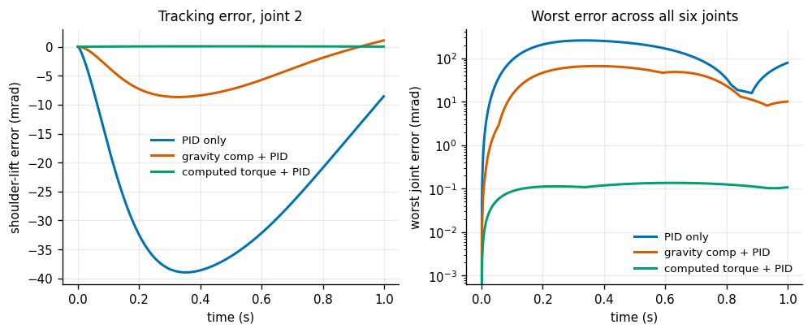
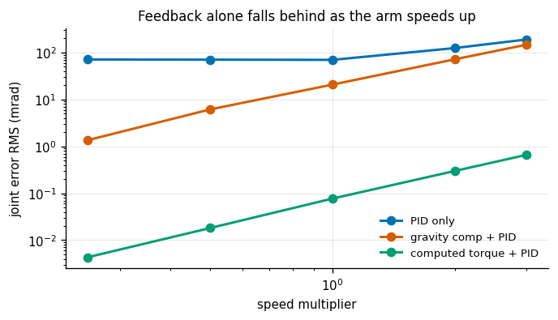
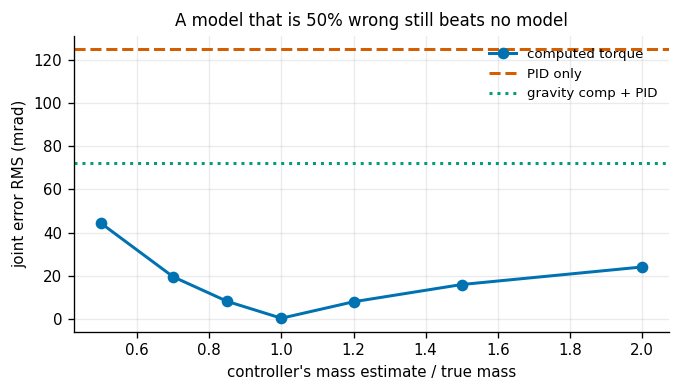
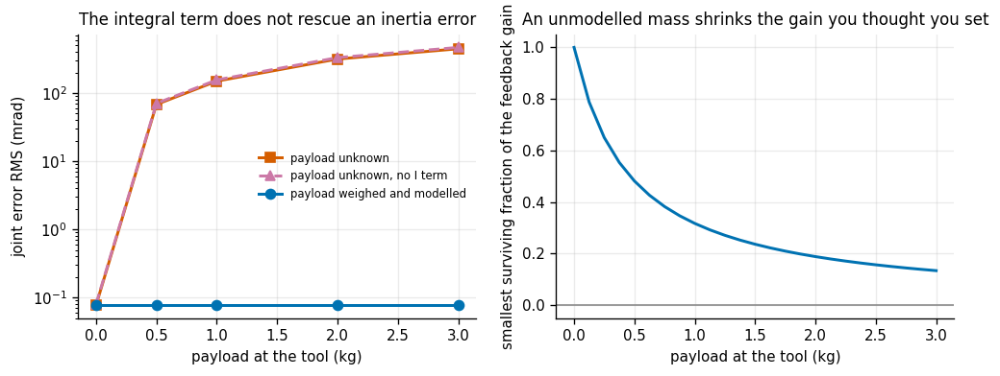
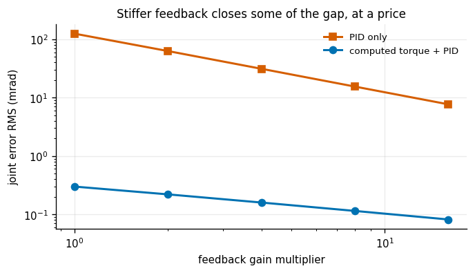
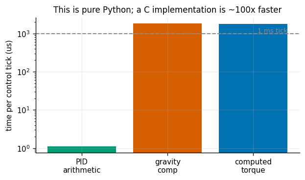

# Computed-Torque Trajectory Tracking

## Key Insight

[Computed-torque control](/shared/glossary/#computed-torque-control) uses a model of the arm's own physics — the [manipulator equation](/shared/glossary/#manipulator-equation) — as a [feedforward](/shared/glossary/#feedforward-control) term that cancels its nonlinear dynamics in advance, so the leftover error behaves like a simple, decoupled linear system that a light [PID](/shared/glossary/#pid) correction can clean up. Tracking a sinusoidal joint trajectory on a 6-DoF arm and comparing PID-only against feedforward-plus-PID makes the lesson concrete: the model-based prediction does the heavy lifting, and feedback only mops up what the model got slightly wrong. This is why a *good enough* dynamics model, not an ever-higher feedback gain, is what separates a wobbly tracker from a crisp one.

**This is project 11.** It imports project [10](../10-inverse-dynamics-from-scratch/README.md)'s `dynamics.py` twice over — once as the simulated robot, once as the controller's *belief* about that robot — and the whole point is that those two objects can be made to disagree. A controller that shares the simulator's numbers is not being tested, it is being flattered.

---

## Files

| file | what it is |
|---|---|
| `run.py` | the six experiments; all the physics comes from project 10 |
| `outputs/` | figures and `results.csv` |

```bash
python3 run.py       # about eleven minutes, NumPy and Matplotlib only
```

Every run is **1.0 s** long. The arm starts exactly *on* the reference, so there is no start-up transient to wait out, and at the base rate of 0.35 Hz one second covers about a third of a cycle — with the six joints' phases staggered, that is enough of the trajectory for the RMS to be representative. Longer runs changed no conclusion and tripled the runtime.

---

## The three controllers, and what makes the comparison fair

All three track the same smooth sinusoidal joint trajectory on the 6-DoF arm at 1 kHz.

```python
qdd_cmd = qddr + Kp*e + Kd*ed + Ki*integ          # the same outer loop for all three

'pid'      tau = SCALE * (Kp*e + Kd*ed + Ki*integ)                  # no model at all
'gravity'  tau = SCALE * (Kp*e + Kd*ed + Ki*integ) + g(q)           # one term of the equation
'ct'       tau = rnea(model, q, qd, qdd_cmd)                        # the whole left-hand side
```

Two details make this a real comparison rather than a rigged one.

**The outer-loop gains are in acceleration units.** Computed torque turns the arm into six independent unit masses, so `Kp` and `Kd` can be chosen directly as a second-order system: `wn = 20 rad/s`, `zeta = 1` (critically damped, no overshoot). That is the whole appeal of the method — the tuning problem stops being about the robot.

**The model-free baselines are scaled by a representative inertia.** A PID whose gains are in acceleration units would command a hundredth of the torque this arm needs, and would lose by a mile for a silly reason. `SCALE` is the diagonal of `M(q)` at the trajectory's mid-point — the single best constant guess available *without* a model, which is exactly what a hand-tuned joint PID is.

**And `tau = rnea(model, q, qd, qdd_cmd)` is one call, not three.** The computed-torque law is usually written `M(q) qdd_cmd + C(q,qd) qd + g(q)`, which looks like it needs all three terms assembled separately. It does not: that expression is precisely what RNEA evaluates, so the whole feedforward is one `O(n)` sweep. Project [10](../10-inverse-dynamics-from-scratch/README.md)'s experiment 4 measured the difference — 43× at forty joints.

---

## 1. The three controllers, side by side



| | joint error RMS | worst joint error | torque RMS |
|---|---|---|---|
| PID only | **69.92 mrad** | 256.9 mrad | 15.86 N·m |
| gravity comp + PID | **20.77 mrad** | 66.1 mrad | 15.01 N·m |
| computed torque + PID | **0.077 mrad** | 0.136 mrad | 14.67 N·m |

| | |
|---|---|
| gravity compensation vs PID only | **3.4× better** |
| computed torque vs PID only | **907× better** |
| computed torque vs gravity compensation | 269× better |

Three orders of magnitude, and the torque RMS barely changes — 15.86 down to 14.67 N·m. The model is not letting the controller push harder; it is letting it push at the **right times**. Feedback is inherently reactive: it can only respond to an error that has already happened. A feedforward term acts on the reference, so it supplies the torque *before* the error exists.

And a number worth reading carefully:

| | |
|---|---|
| share of the total gain that gravity compensation alone buys | **70.4%** |

Gravity compensation is one RNEA call with zero velocity and zero acceleration — the cheapest possible model, three lines — and it captures nearly three quarters of the *log-scale* gap on the way from PID-only to full computed torque. Project [10](../10-inverse-dynamics-from-scratch/README.md)'s experiment 5 explains why: at these speeds gravity is most of the required torque. **If you can only afford one model term, make it gravity.**

---

## 2. The same three, faster and faster



| speed | PID only | gravity comp + PID | computed torque + PID |
|---|---|---|---|
| ×0.25 | 71.15 mrad | **1.36 mrad** | **0.0043 mrad** |
| ×0.50 | 70.66 | 6.14 | 0.018 |
| ×1.00 | 69.92 | 20.77 | 0.077 |
| ×2.00 | 124.89 | 72.03 | 0.300 |
| ×3.00 | 190.26 | 147.24 | 0.660 |

| | |
|---|---|
| computed-torque advantage at ×0.25 | **16,442×** |
| computed-torque advantage at ×3.0 | **288×** |

The interesting column is the middle one. Gravity compensation is **52× better** than plain PID at quarter speed and only **1.3× better** at triple speed — it decays to nearly nothing, because the terms it does not model (Coriolis, inertia) grow as speed squared while gravity stays put.

The first column is worth a second look too: plain PID's error is essentially **flat** from ×0.25 to ×1.00 (71.1 → 69.9 mrad) and only starts growing above that. Its error at low speed is not a tracking-lag error at all — it is the *static* deflection needed to generate the gravity torque, which does not care how fast you are going. Only past ×1 do the speed-dependent terms overtake gravity and the error starts to climb.

So "gravity compensation captures 70% of the benefit" is a claim with a speed attached to it. At a crawl it captures nearly all of it; at speed it captures almost none. Which model terms are worth computing is a function of how fast you intend to move — the same conclusion project 10's term-breakdown reached from the physics side, arrived at here from the control side.

Note also that computed torque's own error grows with speed (0.0043 → 0.660 mrad). Nothing is wrong: at 1 kHz the discrete-time approximation of a faster trajectory is simply coarser. It grows about 150× while the trajectory speeds up 12×, and still stays two to four orders of magnitude below either baseline throughout.

---

## 3. How wrong may the model be?



Every link mass and inertia in the *controller's* model multiplied by a factor, at ×2 speed:

| controller's mass estimate | error RMS |
|---|---|
| ×0.50 (half the true mass) | **44.31 mrad** |
| ×0.70 | 19.50 |
| ×0.85 | 8.10 |
| **×1.00 (correct)** | **0.30** |
| ×1.20 | 7.93 |
| ×1.50 | 15.92 |
| ×2.00 (twice the true mass) | 24.05 |

| baseline at the same speed | |
|---|---|
| PID only | 124.89 mrad |
| gravity comp + PID | 72.03 mrad |
| **worst computed torque in the whole sweep** | **44.31 mrad** |
| still better than PID only by | **2.8×** |

**A model that is 50% wrong still beats no model by 2.8×.** That is the practical headline, and it is what makes computed torque usable at all — nobody knows a real arm's inertias to 1%, and this says you do not need to.

The V shape is worth reading, though. The penalty is **not symmetric**: under-estimating by half costs 44 mrad while over-estimating by double costs 24 mrad. Under-estimating means the controller supplies too little torque and the arm lags — and the feedback that has to make up the difference is itself scaled by the too-small model. Over-estimating means it supplies too much and the feedback fights it, which is wasteful but self-limiting. **If you must guess an inertia, guess high.**

---

## 4. An unmodelled payload, and what the integral term cannot fix



A payload clamped to the tool that the controller knows nothing about:

| payload | unknown to the controller | weighed and modelled | unknown, and no I term |
|---|---|---|---|
| 0.0 kg | 0.077 mrad | 0.077 | 0.080 |
| 0.5 kg | **68.2 mrad** | **0.077** | 70.7 |
| 1.0 kg | 150.1 | 0.077 | 156.5 |
| 2.0 kg | 316.6 | 0.077 | 332.4 |
| 3.0 kg | **447.8 mrad** | **0.077** | 469.0 |

| | |
|---|---|
| what the **integral term** recovers at 3 kg | **1.05×** (essentially nothing) |
| what **weighing the payload** recovers at 3 kg | **5,807×** |

The middle column is flat at 0.077 mrad all the way to 3 kg: telling the controller about the payload restores *exactly* the unloaded performance. So the arm can carry it fine — the problem is purely that the model is wrong.

> **"Isn't that what the integral term is for? It removes constant errors."** It removes constant *torque* errors, and an unmodelled payload is not one. It changes `M(q)`, and `M` **multiplies the feedback command**. Write the closed loop out: with the true mass matrix `M_p` and the controller's `M_c`,
>
> ```
> qdd  =  qdd_cmd  -  M_p^-1 ( (M_p - M_c) qdd_cmd  +  bias error )
> ```
>
> and `qdd_cmd` contains `Kp*e + Kd*ed + Ki*integ`. So the term in the middle does not add a constant to the output — it **scales the gains you thought you set**, by `(I - M_p^-1 (M_p - M_c))`. The integral term can add torque; it cannot restore a gain that has been silently divided down.

The right-hand panel plots exactly that scale factor, and the diagnostic numbers make it concrete:

| payload | worst eigenvalue of `M_true⁻¹ (M_true − M_model)` | surviving fraction of the gain |
|---|---|---|
| 1.0 kg | 0.683 | **0.32×** |
| 3.0 kg | 0.866 | **0.13×** |

At 3 kg, some direction of the arm's motion is receiving **13%** of the feedback gain the designer thought they had set — an 87% cut, silently, with no warning anywhere. At the wrist joints the payload is comparable to the distal link masses in the first place (`wrist_3` is 0.5 kg and the tool 0.1 kg), so 3 kg is not a perturbation: it is most of the inertia. This is the mechanism behind the industrial rule that a robot's rated payload is a *dynamic* limit, not a strength limit: the arm can hold far more than it can accurately move.

The general form, worth carrying: **feedforward errors that add to the output are fixable by an integrator; feedforward errors that multiply the command are not.** Only the first kind is a "disturbance".

---

## 5. Raising the gains instead



The obvious alternative to building a model is to turn the feedback up. At ×2 speed:

| gain multiplier | PID-only error | torque saturated | computed-torque error |
|---|---|---|---|
| ×1 | 124.9 mrad | 0.0% of ticks | 0.300 mrad |
| ×2 | 62.9 | 0.0% | 0.220 |
| ×4 | 31.3 | 0.0% | 0.160 |
| ×8 | 15.5 | 0.0% | 0.115 |
| ×16 | **7.70** | 0.0% | **0.082** |

Brute force works: sixteen times the gain buys **sixteen** times less error, textbook `1/Kp`. It just does not work *far enough*. At the end of the sweep, PID-only is still **26× worse** than computed torque was at its *lowest* gain, and extrapolating the same trend to match it would need roughly a **400×** multiplier — at which point every bit of encoder noise is amplified 400× into the motor (project [8](../08-pendulum-pid/README.md)'s experiment 4), the torque saturates, and the loop is one modelling surprise away from instability.

The last column is the other half of the story. Computed torque also improves with gain, but only **3.7×** over the same 16× range, not 16×. Its error is no longer dominated by the feedback loop at all — the residual is discretisation, the 1 kHz sampling of a continuous trajectory — so raising the gains has very little left to fix. That flattening is the signature of a controller where the *model*, not the feedback, is doing the work.

---

## 6. What the feedforward costs



| | time per control tick |
|---|---|
| the PID arithmetic itself | **1.10 µs** |
| gravity compensation (one RNEA) | 1,817 µs |
| computed torque (one RNEA) | **1,785 µs** |
| **how much slower than plain PID** | **1,617×** |
| as a share of a 1 ms tick | 179% |

> **Read the ratio, not the absolute numbers.** These were measured on a shared machine (load average 2.9 at the time), and the same measurement on a quiet one gave 404 µs — a factor of four. Any absolute timing from a busy, shared, pure-Python environment is a statement about the environment. The **ratio** to the PID arithmetic, measured in the same process seconds apart, is the load-robust number: computed torque costs about **1,600× more arithmetic** than a PID update.

Two things to notice.

**Gravity compensation and full computed torque cost the same** — 1,817 vs 1,785 µs, identical within the noise, and note that gravity compensation came out nominally *slower*. That is not a mystery: they are the same function call with different arguments. The gravity version passes zeros for velocity and acceleration; the arithmetic is identical. So the 70% of the benefit that gravity compensation buys in experiment 1 is not the *cheap* 70% — there is no cheaper option than the full thing. (The real saving from a gravity-only controller is that you do not need to *measure* velocity accurately, which on a machine with a coarse [encoder](/shared/glossary/#encoder) is a genuine advantage — see project [14](../14-real-arm-pid-tune/README.md)'s experiment 6.)

**At 179% of a 1 ms tick, this implementation does not fit in a 1 kHz loop**, and saying so is more useful than hiding it. A C implementation of RNEA for six joints is routinely 100× faster than pure Python, which puts it at roughly 18 µs — under 2% of the tick, and free for any control rate you can actually achieve. The number worth carrying away is not the microseconds but the shape: **the algorithm is `O(n)` and small**, and the only reason 1980s arms did not ship with it is that 400 µs was a real budget then.

---

## What to take away

1. **Feedforward acts before the error exists; feedback can only act after.** 907× better tracking at the same torque RMS is what that difference is worth.
2. **If you can afford one model term, make it gravity** — 70% of the benefit at low speed, from three lines.
3. **But that "70%" has a speed attached.** Gravity compensation is 52× better than PID at quarter speed and 1.3× at triple speed.
4. **A 50%-wrong model still beats no model by 2.8×**, and the penalty is asymmetric — guess inertias high, not low.
5. **An unmodelled payload is not a disturbance.** It rescales `M`, which multiplies your gains — 3 kg left one direction with 13% of the gain you set. The integral term recovers 1.05× of that; weighing the payload recovers 5,807×.
6. **Brute-force gain works and does not work far enough** — 16× the gain for 16× less error, still 26× short of what a model gives for free.
7. **The whole feedforward is one RNEA call.** Writing it as `M qdd + C qd + g` invites you to build three matrices you do not need.

## Next

Project [12](../12-impedance-control/README.md) stops asking the arm to be *accurate* and starts asking it to be *soft* — the same dynamics model, used to make the arm yield in a controlled way instead of resisting.
