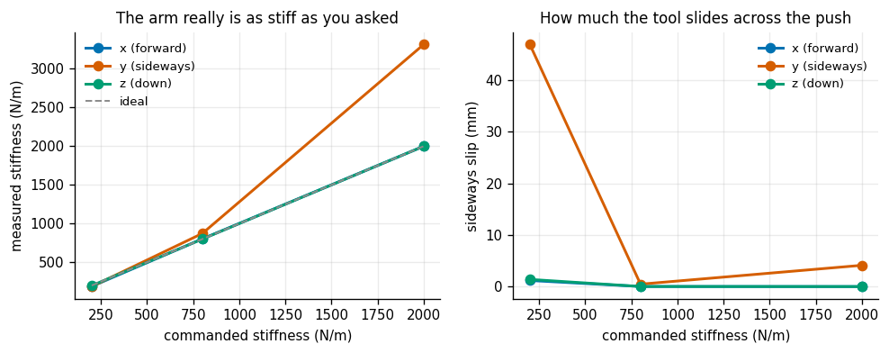
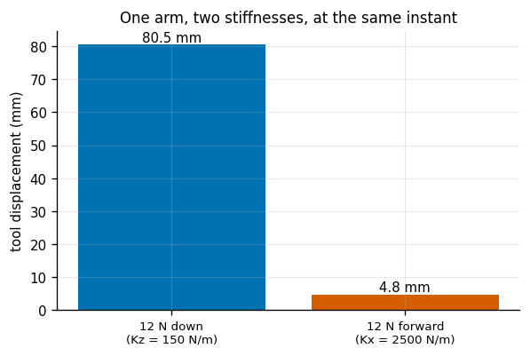
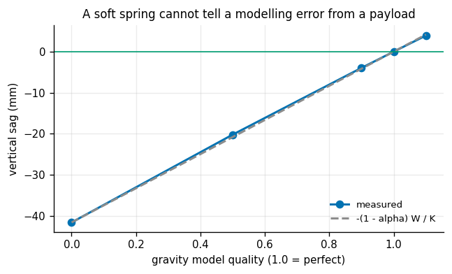
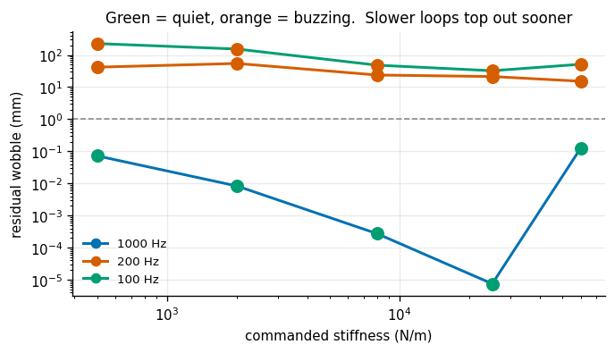
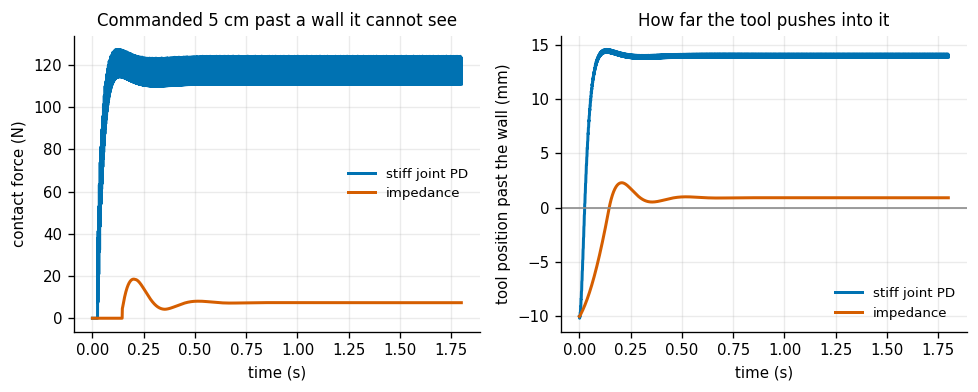
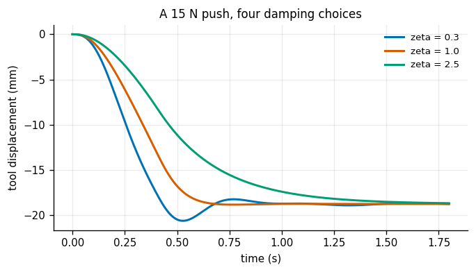

# Impedance Control

## Key Insight

Position control fights the world: tell the arm to be at a spot and it will push arbitrarily hard to get there, snapping anything in the way. [Impedance control](/shared/glossary/#impedance-control) instead commands a *virtual spring-damper* between the [end-effector](/shared/glossary/#end-effector) and a moving reference, so the arm pushes back gently in proportion to how far it has been displaced — you set the spring's stiffness, and that directly sets how much the arm yields under contact, its [compliance](/shared/glossary/#compliance). Pushing on the simulated arm and watching it give, then tuning the virtual stiffness from soft to stiff, is the core skill behind every contact-rich task: insertion, polishing, and working safely next to people.

**This is project 12.** It builds `impedance.py` — the controller project [15](../15-force-controlled-drawing/README.md) uses to draw on a surface nobody measured — on top of project [10](../10-inverse-dynamics-from-scratch/README.md)'s dynamics. Three of its six experiments produced results that were not what the design expected, and all three are in the tables below rather than tuned away.

---

## Files

| file | what it is |
|---|---|
| `impedance.py` | the controller: `J^T` virtual spring-damper, gravity, null-space damping, a wall |
| `run.py` | the six experiments |
| `outputs/` | figures and `results.csv` |

```bash
python3 run.py       # about nine minutes, NumPy and Matplotlib only
```

---

## The control law, in three lines

```
wrench  =  K (x_ref - x)  -  D v            the virtual spring-damper
tau     =  J(q)^T wrench                    that wrench, as joint torques
tau    +=  g(q)                             so the arm does not sag
```

**Why `J^T`.** The [Jacobian](/shared/glossary/#jacobian) maps joint velocities to tool velocity, `v = J qd`. Power must come out the same however you measure it — `wrench · v = tau · qd` for *every* possible motion — and substituting `v = J qd` forces `tau = J^T wrench`. So the transpose is not a trick or an approximation: it is what conservation of power says the answer has to be. Nothing is inverted anywhere, which means this controller works perfectly well at a [kinematic singularity](/shared/glossary/#kinematic-singularity), unlike the inverse-kinematics controller of project [5](../05-damped-least-squares-ik/README.md).

> **"Why is gravity a separate term? Isn't that what the spring is for?"** The spring only ever produces force *proportional to displacement*. Gravity pulls on the arm whether or not the tool has moved, so leaving it out means the arm sags until the spring's stretch happens to balance the weight — and a soft spring sags a lot. Adding `g(q)` cancels the weight so that the spring's rest length is the place the tool actually rests. The two terms answer different questions: `g(q)` asks "what does it take to hold still?", the spring asks "what does it take to resist being moved?" Experiment 3 measures exactly what happens when you get the first one wrong.

---

## 1. Do you get the stiffness you asked for?



Hold the tool still, apply a steady 12 N push (ramped over 0.4 s, so this measures the spring and not the impulse response to an impossible jump in force), and divide.

| commanded `K` | push forward (x) | push sideways (y) | push down (z) |
|---|---|---|---|
| 200 N/m | 0.939× | 0.931× | 0.991× |
| 800 N/m | **1.003×** | **1.091×** | **1.000×** |
| 2000 N/m | **1.000×** | **1.657×** | **1.000×** |

Forward and down are exact to three or four decimal places. **Sideways is not**, and at 2000 N/m it is 66% too stiff. That is the first surprise, and it has a clean explanation.

The damping is chosen from a textbook formula, `D = 2 ζ √(K m)`, using a single guess for the arm's apparent mass at the tool. But the arm is not equally heavy in every direction — different directions of push have to accelerate different amounts of arm. The exact object is the **operational-space inertia**

```
Lambda(q) = ( J M(q)^-1 J^T )^-1
```

the Cartesian counterpart of the joint-space [mass matrix](/shared/glossary/#mass-matrix). Measured at this posture:

| direction | apparent mass at the tool |
|---|---|
| x (forward) | 0.885 kg |
| y (sideways) | 0.843 kg |
| **z (down)** | **3.873 kg** |
| heaviest / lightest | **4.6×** |
| what `damping_for()` assumed | 3.0 kg |

A **4.6× spread**, against one constant. So the vertical axis is damped about right (3.0 vs 3.87 kg) and the two horizontal ones are over-damped by `√(3.0/0.85) = 1.9×`. Over-damping does not make a spring stiffer, but it does make it *slow*, and a measurement taken before a slow axis has finished settling reads as stiffer than it is. The fix is not a better constant — it is to compute `D` from `Lambda(q)` at the current configuration, which is what a production impedance controller does and what makes it configuration-dependent code rather than three gains in a config file.

### 1b. The same command, at a bad posture

The working posture was chosen by scanning for a large smallest singular value of the Jacobian. The **first** posture this project used was a nearly straight-up arm, and it is worth keeping as an experiment:

| | smallest singular value | 12 N sideways gives |
|---|---|---|
| working posture | **0.228** | as commanded |
| nearly straight up | **0.032** | **46.5 mm**, i.e. **258 N/m** where 800 was asked |

| | |
|---|---|
| joint torques saturated | **24.7% of ticks** |

A **3.1× stiffness error** and a quarter of the run spent flat out against the torque limits. With the arm nearly straight up, the tool sits almost *on* the base's turning axis, so the shoulder has almost no lever arm to push sideways with — it must supply enormous torque for a modest force, and it runs out. `J^T` never inverts anything, so nothing blows up or divides by zero; the arm simply, quietly, is not as stiff as you asked. **A commanded stiffness is a request, and the Jacobian decides how much of it the arm can actually deliver.**

---

## 2. Soft in one direction, stiff in the others



This is the reason to bother with impedance control at all. Command `Kx = Ky = 2500 N/m` and `Kz = 150 N/m` — a 16.7:1 ratio — and push 12 N each way:

| | |
|---|---|
| commanded stiffness ratio (x / z) | **16.67×** |
| **measured displacement ratio** | **16.78×** |

Within 0.7%. The same arm, at the same instant, is rigid along one axis and springy along another, with no mechanical change of any kind. That is not something a position controller can express at all: a position controller has one behaviour, "go there", and its stiffness in every direction is whatever the joint gains and the geometry happen to produce (project [15](../15-force-controlled-drawing/README.md) measures that number and finds it is nobody's design choice).

This split is what makes contact tasks tractable. Inserting a peg: stiff along the hole's axis, soft across it. Polishing: stiff in the plane, soft into the surface. Working next to a person: soft everywhere.

---

## 3. What a wrong gravity model costs a soft spring



Feed the controller only an `alpha` fraction of the true gravity torque, with a fairly soft `K = 1200 N/m`, and let it hang:

| gravity model | vertical sag |
|---|---|
| ×0.00 (none at all) | **−41.60 mm** |
| ×0.50 | −20.22 mm |
| ×0.90 | −3.96 mm |
| **×1.00 (perfect)** | **0.00 mm** |
| ×1.10 (over-compensated) | **+3.92 mm** |

The prediction is that an `alpha`-fraction model leaves `(1 − alpha)` of the weight for the spring to hold, so `sag = −(1 − alpha) W / K`. With the apparent weight at the tool measured at **49.9 N**, that predicts **−20.80 mm** at `alpha = 0.5` against a measured **−20.22 mm** — 3% agreement, and dead linear across the whole range.

The consequence worth sitting with: **a soft spring cannot tell a modelling error from a payload.** Both are a constant force it did not expect, both produce exactly `force / K` of droop, and the controller has no way to distinguish them. That is a property of the physics, not a limitation of the implementation. It is also why over-compensating is not "safer" — at ×1.10 the arm drifts *upward* by 3.9 mm, which on a polishing task means losing contact.

---

## 4. The stiffness ceiling your control rate imposes



Residual wobble after settling, as the commanded stiffness rises, at three control rates:

| `K` | 1000 Hz | 200 Hz | 100 Hz |
|---|---|---|---|
| 500 N/m | 0.073 mm | **41.7 mm** | **227.1 mm** |
| 2,000 | 0.008 | **54.5** | **153.3** |
| 8,000 | 0.0003 | **23.8** | **48.2** |
| 25,000 | **0.00001** | **21.3** | **32.3** |
| 60,000 | 0.126 | **15.2** | **51.4** |

| | highest stable stiffness |
|---|---|
| 1000 Hz | **60,000 N/m** (and beyond) |
| 200 Hz | **none of them** |
| 100 Hz | **none of them** |

That second table is the surprise. Dropping from 1 kHz to 200 Hz does not lower the ceiling — it removes it. **Not one** of the tested stiffnesses is stable at 200 Hz, including 500 N/m, which is soft enough that its own natural frequency is only about 12 rad/s: at 200 Hz the loop samples it a hundred times per oscillation, which by any naive reckoning is luxurious.

The reason is that the spring is not the fastest thing in the loop. The **damper on the wrist's tiny inertia** is. The wrist link's rotational inertia is about 0.003 kg·m², and the orientation damping is 2.5 N·m·s/rad, so

```
D * dt / I  =  2.5 * 0.005 / 0.003  =  4.2
```

at 200 Hz, where the discrete-time stability bound for a pure damper is **2**. That one term is unstable on its own, whatever the translational stiffness is doing, which is why the entire row fails together.

> **This cost a debug cycle.** An earlier version of this file ran the first three experiments at 500 Hz, on exactly the reasoning above — "the spring is only 29 rad/s, a 500 Hz loop is seventeen times faster than anything it has to follow." The loop buzzed hard enough to report a *sideways stiffness 400× the commanded one*, which looked like a physics bug for some time. **Discrete-time stability is set by the fastest thing in the loop, not by the thing you were thinking about**, and on an arm the fastest thing is almost always a damping term acting on a small distal inertia. Project [8](../08-pendulum-pid/README.md)'s experiment 5 found the same cliff-not-slope shape from the other direction.

Note also the U-shape in the 1 kHz column: the wobble falls to 1e-5 mm at 25,000 N/m and then rises again at 60,000. That is the ceiling starting to appear even at 1 kHz — you can see it coming before it bites.

---

## 5. Hitting a wall



The classic accident: the geometry was measured wrong, or the part is thicker than the drawing, and the reference is commanded **5 cm past a wall the robot cannot see**. The impedance controller uses `K = 150 N/m`; the position baseline is a stiff joint-space PD tracking the same target through project [5](../05-damped-least-squares-ik/README.md)'s inverse kinematics (IK residual: 0.00008 mm — the baseline is not being handicapped by a bad solve).

| | peak contact force | steady force | penetration into the wall |
|---|---|---|---|
| stiff joint PD | **127.3 N** | **116.7 N** | 14.6 mm |
| impedance | **18.5 N** | **7.4 N** | 2.3 mm |
| ratio | **6.9×** | **15.9×** | 6.3× |

And the steady force is not an accident of tuning — it is arithmetic you did in advance:

```
K * (commanded overshoot)  =  150 N/m * 0.05 m  =  7.5 N        predicted
                                                   7.4 N        measured
```

**You chose the contact force before the robot ever touched anything.** The position controller also "chose" a contact force — 117 N — it just did so implicitly, through gains selected for a completely different reason, and nobody would have been able to predict the number from the gain table.

That is the whole argument for impedance control in contact, in two rows: not that it is gentler (you can always turn a position controller's gains down) but that the force it produces is a **stated design parameter** instead of an emergent property of the geometry.

---

## 6. Choosing the damping



A 15 N push with `K = 800 N/m`, at three damping ratios:

| `zeta` | overshoot past the final position | time to settle within 0.5 mm |
|---|---|---|
| 0.3 | **1.86 mm** | 0.79 s |
| **1.0** | **0.075 mm** | **0.59 s** |
| 2.5 | **0.00 mm** | 1.24 s |

The usual U-shape, and worth reading in terms of what each failure feels like on hardware. Under-damped (`ζ = 0.3`) the tool **bounces** off whatever it touches — on a contact task that means chatter, and on a fragile part it means several impacts instead of one. Over-damped (`ζ = 2.5`) it never overshoots at all, but takes **twice as long** to settle: the arm feels like it is moving through treacle, and a task that involves many small contacts spends all its time waiting.

Critical damping wins on both counts here, which is the usual answer — but recall experiment 1: `damping_for()` computes `ζ = 1` against a *guessed* mass, and the true apparent mass varies 4.6× with direction. So "critically damped" is itself only true along one axis, and the honest version of this table is that `ζ = 1` is the right *target*, not a value you get by writing `zeta = 1.0` in a config file.

---

## What the library gives project 15

```python
import impedance as imp

tau, e, wrench = imp.impedance_torque(
    model, q, qd, T_ref, v_ref,
    Kp, Kd,                 # translational stiffness and damping, per axis
    Ko=40.0, Do=2.5,        # orientation stiffness and damping
    gravity=True,           # cancel the weight so the spring's rest length is real
    null_damping=0.0)       # damping that lives only where the tool cannot feel it

tau = imp.joint_pd_torque(model, q, qd, q_ref, qd_ref, kp, kd)   # the stiff baseline
w   = imp.wall_force(p, v, wall_x)                               # a penalty contact
ts, P, Q, TAU, F, ok = imp.simulate(model, q0, controller, ext_fn=...)
```

`null_damping` is the one that has not appeared above. On a redundant arm the elbow can drift while the tool stays put; projecting a joint-damping torque through `N = I − J⁺J` slows that drift **without changing the tool's behaviour at all**, because the projector keeps it entirely in the directions the tool cannot feel. It is the dynamic cousin of the null-space posture control of project [6](../06-null-space-posture-control/README.md).

---

## What to take away

1. **`J^T` is conservation of power, not an approximation** — which is why an impedance controller stays well behaved at a singularity while an IK-based one does not.
2. **A commanded stiffness is a request.** At a near-singular posture, 800 N/m came out as 258 N/m with the torques saturated a quarter of the time.
3. **The arm's apparent mass varies 4.6× with direction**, so one damping constant cannot critically damp all three axes. Compute `D` from `Lambda(q) = (J M⁻¹ Jᵀ)⁻¹`.
4. **A 16.7:1 commanded stiffness ratio came out at 16.8:1** — stiff and soft on the same arm at the same instant is the whole point of the method.
5. **A soft spring cannot tell a modelling error from a payload.** Both droop by exactly `force / K`, and over-compensating drifts you off the surface.
6. **Discrete stability is set by the fastest thing in the loop.** At 200 Hz *no* stiffness was stable, because a damper on the wrist's 0.003 kg·m² inertia was already past its own bound.
7. **Impedance control lets you state the contact force in advance** — 7.5 N predicted, 7.4 N measured, against 117 N that nobody chose.

## Next

Project [13](../13-mpc-for-a-unicycle/README.md) leaves the arm for a wheeled robot and replaces "react to the error now" with "optimise the next second and a half, then throw most of it away".
