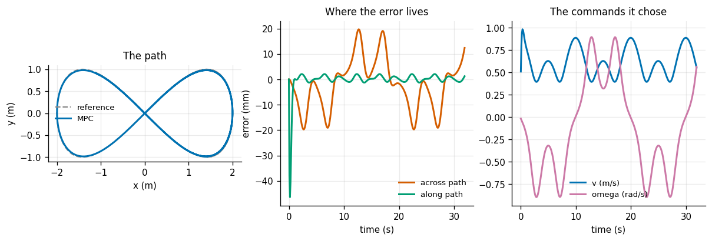
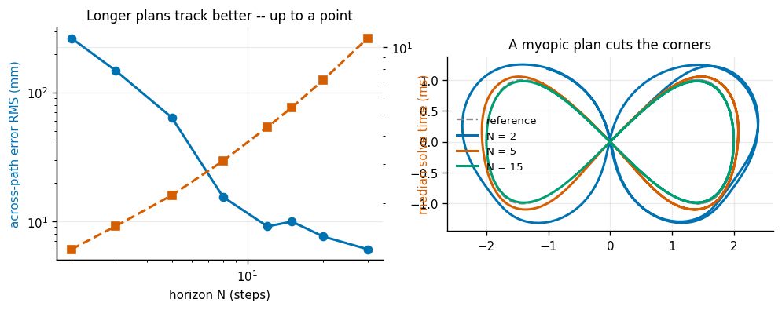
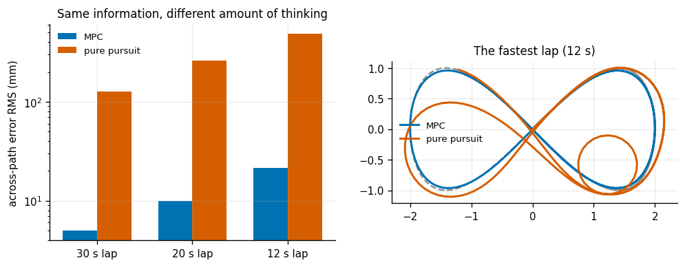
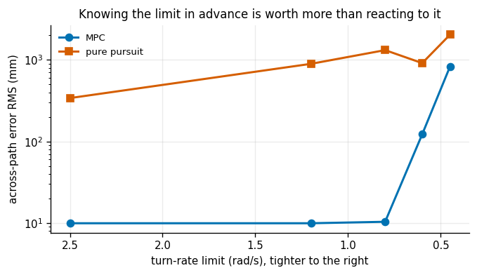
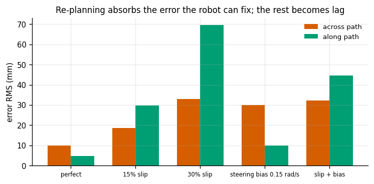
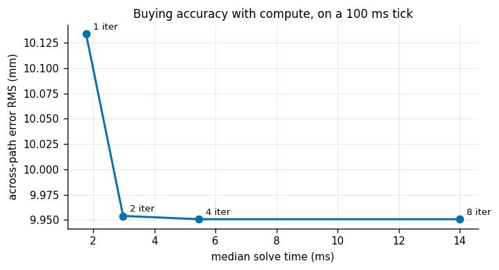

# MPC for a Unicycle

## Key Insight

[Model Predictive Control (MPC)](/shared/glossary/#mpc) drives a robot by re-solving a short look-ahead optimization at every step — predict where each candidate sequence of controls would take you, keep the best, apply only the first control, then re-plan with fresh measurements. Here the prediction model is a [unicycle](/shared/glossary/#unicycle-model) (a point that can only roll forward and turn, never slide sideways — the [kinematic bicycle](/shared/glossary/#kinematic-bicycle-model) is the same idea with an explicit steering angle), and chasing a figure-8 forces the controller to honor that no-sideways-motion constraint while still tracking a curvy path. Writing the optimization in [CasADi](/shared/glossary/#casadi), which supplies the automatic derivatives and hands the problem to a numerical solver, is what makes each re-plan fast enough to run inside the control loop.

**This is project 13.** CasADi is not installed in this environment, so `mpc.py` does by hand the two jobs CasADi would have done — differentiating the rolled-out trajectory, and solving the resulting nonlinear least-squares problem — in about a hundred lines. That turns out to be worth the trouble once, because the *shape* of the problem is the whole idea of MPC and it is easy to lose behind a library API.

---

## Files

| file | what it is |
|---|---|
| `mpc.py` | the unicycle model, the Gauss-Newton MPC solver, the reference path, and a pure-pursuit baseline |
| `run.py` | the six experiments |
| `outputs/` | figures and `results.csv` |

```bash
python3 run.py       # about 90 seconds, NumPy and Matplotlib only
```

---

## What the solver has to do, and what CasADi would have done

At every control tick, with the robot at state `x0`:

```
choose u_0 ... u_{N-1}  to minimise
    sum_k ||p_k - ref_k||^2_Q + ||u_k||^2_R + ||u_k - u_{k-1}||^2_Rd
        + ||p_N - ref_N||^2_Qf
subject to  x_{k+1} = f(x_k, u_k)  and the box limits on u
```

then apply **only** `u_0`, throw the rest away, and re-solve next tick from a fresh measurement. That last sentence is the [receding horizon](/shared/glossary/#receding-horizon), and it is what turns an optimisation into a feedback controller.

> **"Why compute a whole plan and then discard 14/15 of it?"** Because the discarded tail was computed from a model that is already slightly wrong, while the next solve starts from where the robot *actually is*. Keeping the plan would let modelling error accumulate; discarding it means the error is corrected every tick. Experiment 5 measures exactly this: with 30% wheel slip, re-planning absorbs most of the damage. It is the difference between memorising turn-by-turn directions at the start of a journey and re-deciding your route from wherever you currently are.

CasADi would supply two things here. **Automatic differentiation** — the exact derivative of the rolled-out trajectory with respect to the control sequence, obtained by differentiating the code itself. And **an interface to a solver** like IPOPT. `mpc.py` substitutes:

- **Finite differences, vectorised.** Perturb all `2N` control variables at once and roll out `2N + 1` trajectories in a single batched NumPy pass. This is what makes a from-scratch solver fast enough to sit inside the loop at all — perturbing them one at a time in a Python loop would be about thirty times slower.
- **[Gauss-Newton](/shared/glossary/#gauss-newton) with Levenberg-Marquardt damping.** Write the cost as a sum of squares of a residual vector `r(U)`. The exact second derivative of such a cost is `J^T J` plus a term involving the curvature of `r`; Gauss-Newton simply **drops** that second term. The approximation is excellent when the residual is small at the solution — which is exactly the situation in tracking, where you expect to nearly hit the reference — and it buys a Hessian that costs nothing extra and is automatically positive semi-definite, so the step always points downhill. The `+ lambda*I` is the same Levenberg-Marquardt trick as the damped-least-squares [IK](/shared/glossary/#inverse-kinematics) in project [5](../05-damped-least-squares-ik/README.md), and here `lambda` also adapts: it shrinks when a step improves the cost and grows when it does not.

---

## 1. Tracking a figure-8



The reference is a lemniscate — `x = a sin(s)`, `y = a sin(s) cos(s)` — traversed in 20 s, with the heading that traces it. The crossing in the middle is the interesting part: the robot passes through the same *point* twice with opposite headings, so any controller that just chases the nearest point on the path gets confused there.

Horizon `N = 15` steps of 0.1 s each, so 1.5 s of look-ahead:

| | |
|---|---|
| position error RMS | **11.0 mm** |
| worst position error | 46.3 mm |
| **across-path** error RMS | **9.95 mm** |
| **along-path** error RMS | 4.67 mm |
| heading error RMS | 1.12° |
| median solve time | 5.7 ms |
| solve time as a share of the 100 ms tick | **5.7%** |

The error is split into **along-path** and **across-path** components, and for a robot with a [nonholonomic constraint](/shared/glossary/#nonholonomic-constraint) the split matters. Lagging behind on the path (along) is harmless and self-correcting: drive a bit faster. Being off to the side (across) is what actually puts a wheel in the ditch, and it is precisely the direction the robot **cannot** fix by sliding over — the only way to correct it is to steer, drive, and come back. So across-path error is the number every later experiment reports.

---

## 2. How far ahead is far enough?



| horizon `N` | look-ahead | across-path RMS | median solve time |
|---|---|---|---|
| 2 | 0.2 s | **264.2 mm** | 1.3 ms |
| 3 | 0.3 s | 147.5 mm | 1.7 ms |
| 5 | 0.5 s | 64.0 mm | 2.3 ms |
| 8 | 0.8 s | 15.4 mm | 3.3 ms |
| 12 | 1.2 s | 9.1 mm | 4.7 ms |
| 15 | 1.5 s | 10.0 mm | 5.8 ms |
| 20 | 2.0 s | 7.6 mm | 7.6 ms |
| 30 | 3.0 s | **6.1 mm** | 11.6 ms |

A **43× improvement** from `N = 2` to `N = 30`, but look at where it happens: 264 → 15 mm over the first four rows, and 15 → 6 mm over the last four. The knee is at about `N = 8`, roughly 0.8 s of look-ahead.

That number is not arbitrary. The lemniscate's tightest turn takes about a second to traverse, so a controller that cannot see one second ahead cannot see the turn coming, and the right-hand panel shows the consequence — `N = 2` visibly cuts every corner. **Look-ahead should be measured against the time-scale of the thing you are trying to anticipate**, not chosen as a round number. Past that point you are paying compute to plan a future that the next re-solve will discard anyway.

---

## 3. Against pure pursuit



[Pure pursuit](/shared/glossary/#pure-pursuit) is the classic baseline: aim at a point a fixed distance ahead on the path and turn toward it. To keep the comparison honest, its one tuning knob — the look-ahead distance — is **swept and the best value used**, since handing MPC a carefully chosen horizon while leaving the baseline at an arbitrary default would make the result about tuning, not about method.

| lap time | best look-ahead | MPC | pure pursuit | ratio |
|---|---|---|---|---|
| 30 s | 0.25 m | **4.98 mm** | 127.0 mm | 25.5× |
| 20 s | 0.60 m | 9.95 mm | 263.3 mm | 26.5× |
| 12 s | 0.60 m | 21.6 mm | 484.5 mm | 22.4× |

A consistent ~25× gap. But the *reason* is worth naming rather than treating as a victory, because it is structural rather than a matter of effort: **pure pursuit is a steering law only.** It has no speed control at all — it drives at a fixed nominal speed and only chooses how to turn. On a lemniscate the path's own speed varies (it slows at the ends of the figure and speeds through the middle), so a fixed-speed controller must lag by construction, and the lag turns into across-path error at every curve.

That is a real limitation of the method, not a rigged comparison — but the fair summary is "MPC controls two things and pure pursuit controls one", not "optimisation beats geometry by 25×". Pure pursuit costs microseconds, needs no model, and has one knob; on a path traversed at constant speed the gap would be much smaller.

---

## 4. A tight turn-rate limit



Now squeeze the turn rate the robot is allowed to use:

| `omega` limit | MPC across-path RMS | MPC at the limit | pure pursuit | MPC advantage |
|---|---|---|---|---|
| 2.50 rad/s | 9.95 mm | 0.0% of ticks | 340.6 mm | **34.2×** |
| 1.20 rad/s | 9.95 mm | 0.0% | 895.2 mm | 90× |
| 0.80 rad/s | 10.4 mm | 22.5% | 1318.0 mm | 127× |
| 0.60 rad/s | 122.5 mm | 67.5% | 913.7 mm | 7.5× |
| 0.45 rad/s | 829.2 mm | 94.4% | 2038.6 mm | **2.5×** |

Two findings, in opposite directions.

**At 0.80 rad/s, MPC is spending 22.5% of its ticks pinned at the limit and its error has grown by 4%.** That is what "handles constraints" actually means: the limit is *inside* the optimisation, so the solver plans a trajectory that turns early and gently rather than one that demands an impossible turn later. Pure pursuit meets the same limit by asking for more than it can have and getting clipped, which is why its error grows 4× over the same range.

**And at 0.45 rad/s, MPC fails too** — 829 mm, and the advantage collapses from 34× to 2.5×. This is the honest half. Anticipation buys you the *feasible* part of the problem; when the path genuinely requires a turn the robot cannot make, no amount of look-ahead invents the missing turning circle. The advantage of MPC is largest in the middle band where the constraint is *binding but survivable* — which is, usefully, where most real robots operate.

(Pure pursuit's error is non-monotone — 1318 mm at 0.80 rad/s but 914 mm at 0.60 — because at severe limits it stops even attempting the tight lobes and wanders on a wider, smoother path. A geometric controller failing more gracefully than it fails is not the same as failing less.)

---

## 5. A robot that does not do what it is told



The controller's model says the robot moves at the speed it is told. The simulated robot does not:

| | across-path RMS | along-path RMS | mean commanded speed |
|---|---|---|---|
| perfect | **9.95 mm** | **4.67 mm** | 0.614 m/s |
| 15% wheel slip | 18.8 mm | 29.7 mm | 0.716 m/s |
| 30% wheel slip | 32.9 mm | 69.7 mm | 0.857 m/s |
| steering bias 0.15 rad/s | 30.0 mm | 10.0 mm | 0.618 m/s |
| slip + bias | 32.2 mm | 44.7 mm | 0.762 m/s |

30% slip — the robot travels 30% less far than commanded — costs **3.3× in across-path error but 14.9× along-path**. The asymmetry is the point, and it is the [receding horizon](/shared/glossary/#receding-horizon) doing its job. Re-planning cannot invent the missing 30% of speed, so the robot falls behind on the path and stays behind: that is the along-path error, and the controller responds sensibly by commanding 40% more speed (0.614 → 0.857 m/s). But it *can* keep the robot on the line, because being on the line is a matter of steering and steering still works. So the error that matters — the one that puts a wheel in a ditch — grows four times more slowly than the error that does not.

The steering bias behaves the mirror-image way: it corrupts heading, so it lands almost entirely in the across-path column (30.0 mm) and barely touches along-path (10.0 mm). **A model error shows up in the direction of the thing it corrupts, and re-planning silently absorbs the rest.**

---

## 6. The compute budget



| Gauss-Newton iterations per tick | across-path RMS | median solve time |
|---|---|---|
| 1 | **10.13 mm** | **1.8 ms** |
| 2 | 9.95 mm | 3.1 ms |
| 4 | 9.951 mm | 5.6 ms |
| 8 | 9.951 mm | 14.5 ms |

**One iteration is essentially as good as eight**, at a quarter of the cost. That is not a statement about Gauss-Newton being magically good; it is a statement about the *warm start*:

```python
self.U = np.vstack([U[1:], U[-1:]])     # shift the plan one step and reuse it
```

Tomorrow's optimisation problem is almost today's, shifted by 100 ms. Starting from today's answer means the solver begins nearly at the optimum and one step finishes the job. Removing exactly that one line:

| | across-path RMS |
|---|---|
| 1 iteration, warm start | **10.1 mm** |
| 1 iteration, cold start (`U = 0` every tick) | **58.2 mm** |
| ratio | **5.7× worse** |

So the two-line shift is worth more than quadrupling the compute budget. This is the standard reason real MPC ships at rates that look impossible on paper: it is not solving a fresh problem every tick, it is nudging yesterday's answer.

The whole controller runs in **5.7% of its 100 ms tick** in pure Python. A C implementation with analytic derivatives would be another one to two orders of magnitude faster, which is why MPC is now routine on vehicles and drones and was exotic twenty years ago.

---

## What to take away

1. **Receding horizon is what makes MPC feedback.** Throwing away 14/15 of every plan is the mechanism, not the waste — it is why modelling error never accumulates into the plan.
2. **Split the error along-path and across-path.** For a nonholonomic robot they are physically different failures, and every result in this project is clearer in that basis.
3. **Choose the horizon against the time-scale of what you must anticipate**, not as a round number. The knee here is 0.8 s, and the tightest turn takes about a second.
4. **Constraints inside the optimisation beat constraints applied afterwards** — 22.5% of ticks at the limit with a 4% error penalty, against a baseline that grew 4×.
5. **But anticipation cannot invent feasibility.** At a turn limit the path genuinely needs, MPC fails too, and its advantage falls from 34× to 2.5×.
6. **Warm-starting is worth more than compute.** One iteration warm-started beats eight cold-started, 10.1 mm against 58.2 mm.
7. **Beat a baseline on the merits, not by leaving it untuned** — and then say honestly *why* you beat it. Pure pursuit lost here mostly because it is a steering law with no speed control.

## Next

Project [14](../14-real-arm-pid-tune/README.md) leaves simulation-grade plants behind and tunes a joint that has friction, [backlash](/shared/glossary/#backlash), quantised sensing and latency — the effects that make tuning on hardware feel like a different subject.
