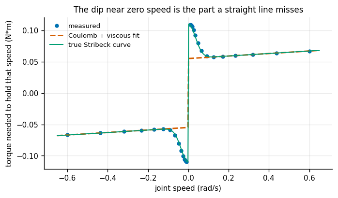
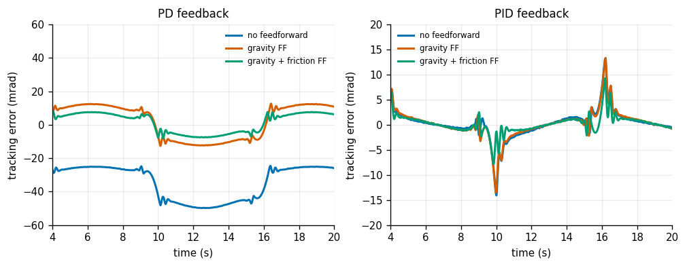
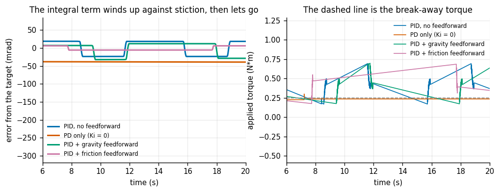
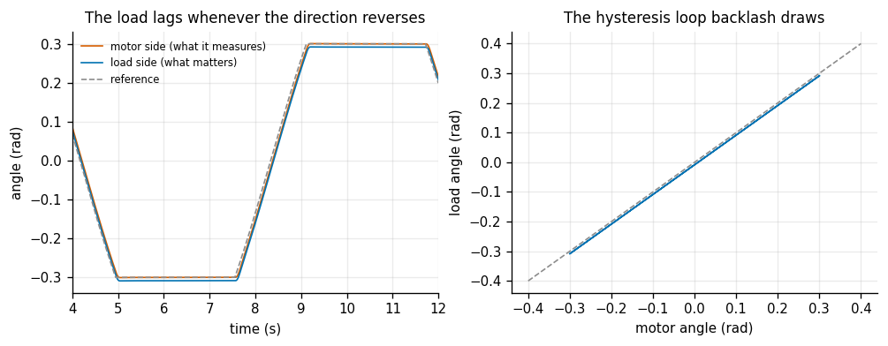
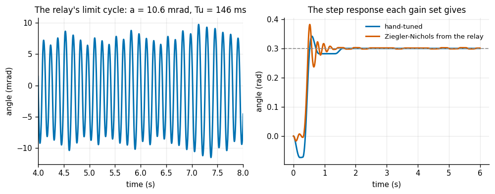
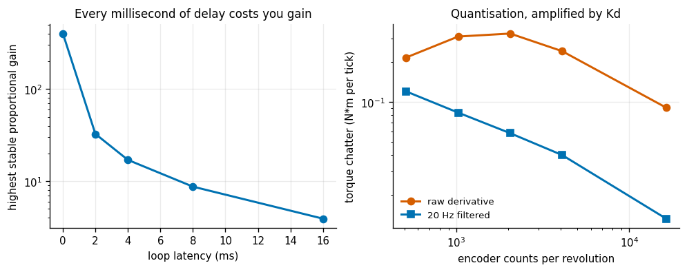

# Real-Arm PID Tune

## Key Insight

A simulator hides the messiest part of real motors: friction. On a physical hobby arm the joints stick before they slip ([stiction](/shared/glossary/#stiction)) and drag once moving, so [PID](/shared/glossary/#pid) gains that looked perfect in simulation buzz or sag on hardware. This project has you tune the joint PIDs by feel or with a recipe like [Ziegler-Nichols](/shared/glossary/#ziegler-nichols), measure how much torque each joint loses to friction, and add a [friction-compensation](/shared/glossary/#friction-compensation) [feedforward](/shared/glossary/#feedforward-control) term that pre-cancels that drag — the single change that most often turns a sloppy real arm into a precise one.

**This is project 14.**

> **An honest disclaimer, first.** The brief says "on a real hobby arm". There is no hobby arm attached to this machine. `servo.py` is a **stand-in**: a single joint carrying every effect that makes tuning on hardware feel different from tuning in simulation. What it *can* teach is the shape of each pathology — what stiction looks like on a plot, why an integral term starts hunting, how latency eats your gain margin, and what a friction feedforward fixes and what it does not. What it *cannot* teach is the part only hardware teaches: that the numbers drift with temperature, that joint 3 is not like joint 2, and that the smell of a hot servo is the real end-stop detector. Treat what follows as a rehearsal with the right choreography, not as a substitute for the bench.

It reuses project [8](../08-pendulum-pid/README.md)'s `PID` class unchanged — all five of that class's optional features earn their keep here.

---

## Files

| file | what it is |
|---|---|
| `servo.py` | the joint model: friction, saturation, quantisation, latency, backlash |
| `run.py` | the six experiments |
| `outputs/` | figures and `results.csv` |

```bash
python3 run.py       # about 30 seconds, NumPy and Matplotlib only
```

The joint runs at **500 Hz** with **one tick of latency** — a realistic rate and delay for a serial-bus hobby servo.

---

## What the model contains, and why each piece is there

| effect | what it does | why it is here |
|---|---|---|
| [Stribeck friction](/shared/glossary/#stribeck-friction) | more torque to start than to keep moving | joints creep in jerks |
| torque saturation and quantisation | a maximum output, and finite PWM levels | 0.3617 N·m arrives as 0.36 |
| [encoder](/shared/glossary/#encoder) quantisation | position read in whole counts | differentiating it multiplies the step by the control rate |
| loop latency | sensing + computing + writing takes time | pure phase lag, and it sets the maximum gain |
| [backlash](/shared/glossary/#backlash) | clearance in the gear train | reverse direction and the load does not hear about it |

> **Why "Stribeck"?** Richard Stribeck measured friction in journal bearings around 1902 and found something counter-intuitive: as speed rises from zero, friction first **falls** before viscous drag makes it rise again. The explanation is that the lubricant gets dragged into the gap and builds a film that lifts the surfaces apart. That dip is why a slow-moving joint is jerkier than a fast one, and it is the whole reason experiment 1 exists.

---

## 1. Identifying the friction curve



The standard bench procedure: close a velocity loop, hold the joint at a series of steady speeds, average the torque at each, and subtract gravity. What is left is the friction curve. Then fit a straight line — Coulomb friction is the offset at zero speed, viscous friction is the slope.

Fitting **only** on the fast half (`|speed| > 0.15 rad/s`), where the Stribeck dip has died away:

| | true | fitted | error |
|---|---|---|---|
| Coulomb friction | 0.0550 N·m | 0.0550 | **0.06%** |
| viscous friction | 0.0200 N·m·s/rad | 0.0200 | **0.07%** |

Two parameters, three digits each, from a five-line least-squares fit. That is the good news.

The bad news is what the straight line cannot see:

| | |
|---|---|
| measured torque at 0.01 rad/s | **0.1093 N·m** |
| what the straight line predicts there | 0.0552 N·m |
| under-prediction near zero speed | **98%** |
| the true break-away torque | 0.1100 N·m |

**A model fitted perfectly at normal speeds is wrong by a factor of two at a crawl.** And a crawl is exactly where slow, precise robot motions live. The fix is to fit only where the model is valid and be explicit that below 0.15 rad/s you are extrapolating into a region the model does not describe — not to fit through the dip, which would bend the line and corrupt *both* numbers instead of just one.

---

## 2. Friction feedforward, and the honest inversion



A slow move: ±0.3 rad at 0.08 Hz, peak speed 0.15 rad/s. Slow on purpose — friction is a fixed torque, so it matters most when the torque you actually need is small; at high speed the inertia term swamps it.

The feedforward, added on top of the feedback:

```python
tau_ff = m_g_l*cos(theta_ref) + fc*tanh(w_ref / 0.02) + fv*w_ref
```

> **`tanh` rather than `sign`.** A hard `sign()` would flip between `+fc` and `−fc` every time the reference speed crosses zero, and on hardware that is an audible buzz and a shortened gearbox. `tanh` smooths the switch over a small speed band, which costs a little compensation accuracy exactly where the joint is barely moving anyway.

Two families of feedback, three feedforward settings each:

| feedback | no feedforward | gravity FF | gravity + friction FF |
|---|---|---|---|
| **PD** (no integral) | **35.75 mrad** | 10.49 | **6.04** |
| **PID** | **2.93 mrad** | 2.87 | **1.78** |

| | |
|---|---|
| PD: friction FF vs no feedforward | **5.92×** |
| PID: friction FF vs no feedforward | **1.64×** |

> **"Isn't the integral term already a friction compensator? Why add a second one?"** Yes — and that is exactly the finding. An integrator *is* a friction compensator: it notices a persistent error and slowly builds whatever constant torque removes it. So on a PD loop, adding friction feedforward is worth **5.9×**; on a loop that already has an integrator, it is worth only **1.6×**. The folklore claim that friction compensation transforms a real arm is true, and it is measuring the gap against a **PD** baseline.
>
> The two are not redundant, though, and the difference is *when* they act. The integrator is **slow and blind**: it has to observe the error before it can correct it, so every direction reversal costs a fresh error while it re-learns the new sign. The feedforward is **instant and informed**: it knows the reference velocity is about to change sign and pre-pays the torque before any error exists. That is why the feedforward's remaining advantage on the PID loop shows up almost entirely at the reversals, and why it matters far more on a velocity or impedance loop, where you cannot afford a large integral gain at all.

---

## 3. Stick-slip: an integrator hunting against stiction



This experiment uses a **stickier** joint than the default — 0.25 N·m to break free against 0.055 N·m once moving, a **4.5:1** ratio. Real joints drift this way as the grease ages and the bearings wear, and it is the *ratio*, not the absolute friction, that decides whether a joint hunts.

Commanding a 0.30 rad hold:

| | residual amplitude | hunting period | steady-state error |
|---|---|---|---|
| PID, no feedforward | **21.2 mrad** | **6.8 s** | 0.08 mrad |
| PD only (`Ki = 0`) | **0.53 mrad** | — | **−38.9 mrad** |
| PID + gravity feedforward | 22.2 mrad | — | −2.6 mrad |
| PID + friction feedforward | **5.9 mrad** | — | −2.6 mrad |

Read the first two rows as a pair, because they are the trade-off:

- **PD parks in the dead band.** It sits 38.9 mrad off target, perfectly still, because inside the stiction band a small proportional torque produces no motion at all and therefore no feedback. A joint that is quietly wrong.
- **PID hunts.** The integrator builds torque until it exceeds the break-away threshold; the joint lurches free; friction instantly drops to the smaller Coulomb value so it overshoots; the error reverses; the integrator unwinds; it sticks again. A **6.8-second** limit cycle. A joint that is on average right and never still.

And the cures, in order of usefulness:

- **Gravity feedforward does nothing** (0.95×, i.e. very slightly worse). This is worth stating plainly because it is the term everyone adds first: gravity compensation is a fix for a *gravity* problem, and stick-slip is a *friction* problem. Adding the wrong feedforward buys nothing.
- **Friction feedforward gives 3.6×.** It pre-pays 80% of the break-away torque in the direction the error says the joint still needs to go, so the integrator has far less work to do and its slow wind-up cycle never gets going. Not 100% of the break-away torque — over-paying would push the joint straight past the target and start the hunt from the other side.

---

## 4. Backlash, and where you put the encoder



`GearedJoint` is a two-inertia model: motor and load joined by a stiff spring that is **disconnected** while their relative angle is inside a ±8 mrad dead band. Reverse direction and the motor turns freely through the whole dead band before it picks the load up again.

The reference is a back-and-forth move that **dwells** at each end. That detail is the experiment: a pure sine never stops, so its tracking error is dominated by ordinary lag and the backlash hides inside it. Waiting at each end lets the lag decay to nothing, and whatever offset is left is the dead band and only the dead band.

| encoder mounted on the... | error the **controller** sees at rest | error the **tool** actually has at rest |
|---|---|---|
| load | 1.22 mrad | **1.22 mrad** |
| motor | 1.23 mrad | **8.57 mrad** |

The two controllers report **the same 1.2 mrad**. One of them is lying by a factor of **seven**.

This is a real design decision, not a detail. A motor-side encoder is cheap, and the gear ratio multiplies its resolution — it is what almost every hobby servo ships with. A load-side encoder costs more and is coarser. The measurement above is what the cheap choice actually costs: everything downstream of the gear is invisible to the loop, so the controller converges happily on a number that is not the number you care about. The right-hand panel draws the consequence directly — a **hysteresis loop** in the motor-versus-load plot, whose width is the dead band, and which no amount of gain will close.

---

## 5. Relay auto-tuning



[Relay auto-tuning](/shared/glossary/#relay-auto-tuning) is how you get [Ziegler-Nichols](/shared/glossary/#ziegler-nichols)'s two numbers without risking the hardware. Replace the controller with a simple switch — drive `+d` when below the target, `−d` when above — and the loop settles into a steady oscillation:

| | |
|---|---|
| relay amplitude `d` | 0.40 N·m |
| limit-cycle amplitude `a` | 10.63 mrad |
| ultimate period `Tu` | 146.5 ms |
| **ultimate gain `Ku = 4d/(pi a)`** | **47.9 N·m/rad** |

> **Where the `4/pi` comes from.** The relay emits a square wave, but the joint is an inertia and only really responds to the wave's slowest component. The fundamental sine hidden inside a square wave of amplitude `d` has amplitude `4d/pi`. So the relay's *effective* gain is that amplitude divided by the oscillation it produced. This is describing-function analysis in one line, and it is why the formula has a `pi` in it at all.

> **A trap this experiment fell into first.** Without gravity compensation the relay is not symmetric about the setpoint: gravity biases every swing one way, and the joint simply falls instead of oscillating. Amplitude zero, `Ku` divides by zero. Compensating gravity *before* the relay makes the experiment measure the loop instead of the load.

Why the relay is better than the textbook "raise `Kp` until it hums": the relay's output is bounded by `d` **by construction**, so the experiment cannot run away. A gain ramp finds the stability limit by crossing it, on real hardware, at full torque.

And then Ziegler-Nichols does with those numbers what it did in project [8](../08-pendulum-pid/README.md):

| | overshoot | residual wobble | steady error |
|---|---|---|---|
| hand-tuned (`Kp` 6, `Ki` 12, `Kd` 0.35) | **13.8%** | **0.00 mrad** | −0.32 mrad |
| Ziegler-Nichols (`Kp` 28.7, `Ki` 392, `Kd` 0.53) | **27.2%** | 1.61 mrad | **0.02 mrad** |

Twice the overshoot, and a residual buzz where the hand-tuned gains are perfectly still. Note the `Ki` in particular: ZN asks for **392**, thirty-three times the hand-tuned value, because its formula `Ki = 1.2 Ku / Tu` divides by a *short* ultimate period. On a fast, low-friction process that is reasonable; on a joint with a 4.5:1 stiction ratio it is an invitation to hunt.

The fair reading is that ZN gets you into the right *order of magnitude* from two measurements and no intuition, which on a 6-joint arm is a genuinely useful starting point. It is a starting point, not an answer.

---

## 6. The two limits nobody quotes



**Latency.** Bisecting for the highest proportional gain the loop survives, as the delay grows:

| loop latency | highest stable `Kp` |
|---|---|
| 0 ms | **400** (the search ceiling) |
| 2 ms (1 tick) | **32.6** |
| 4 ms | 17.0 |
| 8 ms | 8.7 |
| 16 ms | **3.9** |

Going from zero to one tick of delay costs **12× of gain**; going to eight ticks costs **102×**. And zero delay is not achievable — it is in the table only to show the size of the cliff at the first step. A delay is pure phase lag: by the time your correction arrives, the joint has moved on, so the correction is aimed at where the joint *was*. The faster you push, the more that matters, which is why the ceiling falls roughly in proportion to the delay.

This is the concrete reason a control loop's *jitter* matters as much as its rate. A loop that usually takes 2 ms but occasionally takes 8 is not a 2 ms loop for stability purposes; it is a loop that occasionally has a quarter of its gain margin.

**Encoder resolution.** Measured while the joint is **moving slowly**, not standing still — a stuck joint reads the same count every tick, so its derivative is exactly zero and it would look beautifully quiet no matter how coarse the encoder is.

| counts/rev | torque chatter, raw D | torque chatter, 20 Hz filtered D | tracking error, filtered |
|---|---|---|---|
| 512 | 0.216 N·m | **0.120** | 4.44 mrad |
| 1024 | 0.311 | 0.083 | 3.26 mrad |
| 2048 | 0.327 | 0.058 | 2.92 mrad |
| 4096 | 0.241 | 0.040 | 3.10 mrad |
| 16384 | **0.091** | **0.013** | 3.04 mrad |

The filtered column behaves exactly as expected: **9× less chatter** from 512 to 16384 counts, monotone all the way. The raw column does **not** — it rises from 512 to 2048 before falling again.

That non-monotonicity is real and worth explaining rather than smoothing over. A coarse encoder does two opposite things at once: each count it *does* report is a bigger jump (more chatter), but it reports *fewer* of them, because the joint often fails to cross a count boundary at all within one tick (less chatter). At 512 counts the second effect is winning; by 2048 the first one is. Filtering removes the first effect and leaves the clean monotone trend, which is another way of saying **the filter is not a cosmetic fix — it is what makes the resolution/noise relationship behave the way your intuition expects.**

---

## What to take away

1. **A friction model fitted at normal speeds is 98% wrong at a crawl.** Fit where the model is valid and say out loud that below that speed you are extrapolating.
2. **Friction feedforward is worth 5.9× against a PD baseline and 1.6× against PID.** An integrator is already a slow, blind friction compensator; the feedforward's real advantage is being fast and informed, which shows up at reversals.
3. **PD parks in the stiction dead band; PID hunts out of it.** 38.9 mrad quietly wrong, or a 6.8-second limit cycle. Pick deliberately.
4. **Adding the wrong feedforward buys nothing.** Gravity compensation did not touch stick-slip (0.95×) because stick-slip is not a gravity problem.
5. **A motor-side encoder can report 1.2 mrad while the tool is 8.6 mrad off.** Close the loop where you can measure, and you get the error you did not measure.
6. **Relay auto-tuning is the safe way to find `Ku`** — bounded output by construction — and it still needs gravity compensated first or it measures the load instead of the loop.
7. **One tick of latency costs 12× of gain; eight ticks cost 102×.** Jitter is a stability problem, not a performance one.
8. **Raw derivative chatter is not monotone in encoder resolution.** Filter it, and the relationship becomes the one you expected.

## Next

Project [15](../15-force-controlled-drawing/README.md) closes Phase 2 by putting a pen on the end of the arm and pressing it against a surface nobody measured — the point where all of position control, [impedance control](/shared/glossary/#impedance-control) and honest modelling have to work at once.
