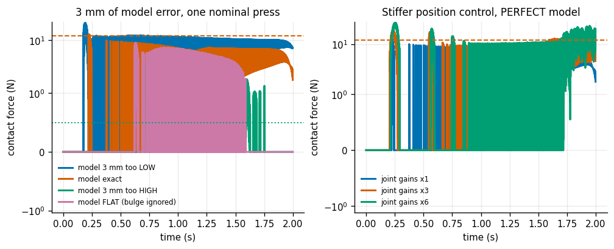
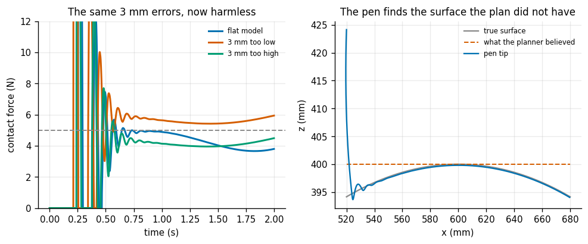
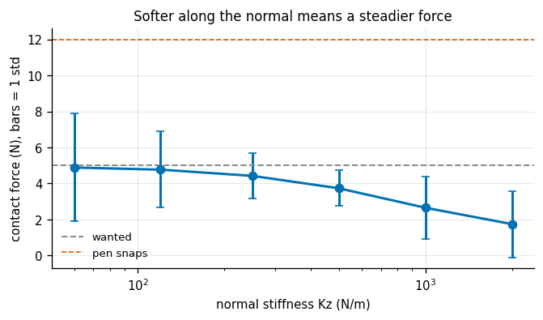
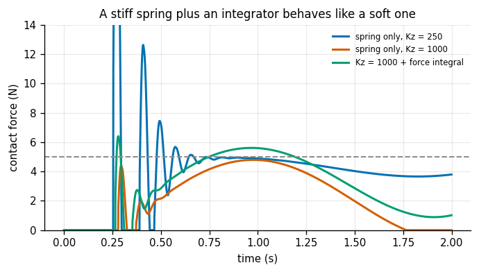
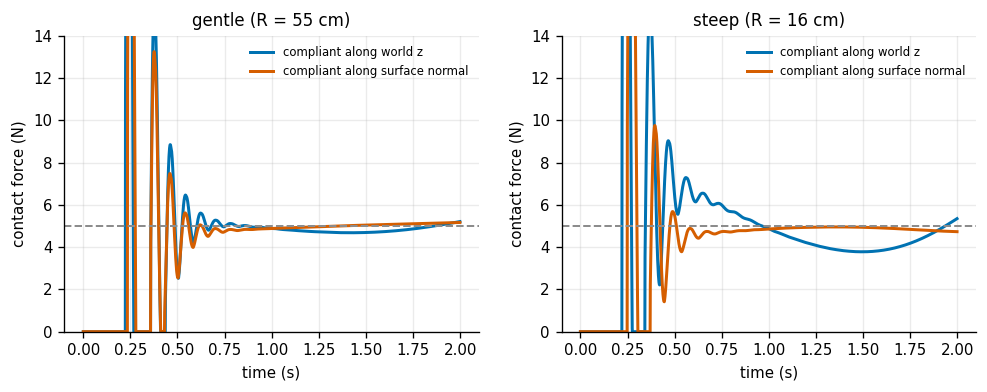
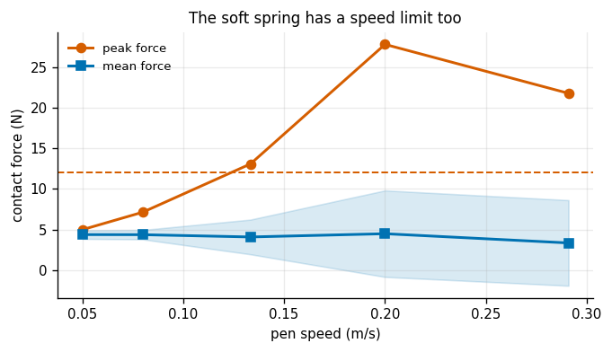

# Force-Controlled Drawing

## Key Insight

Drawing on a curved surface you have not measured exactly is impossible with pure position control — aim the tip a hair too deep and you snap the pen, a hair too shallow and it lifts off the paper. The fix is to stop commanding *where* the tip is and start regulating *how hard* it presses: [force control](/shared/glossary/#force-control), realized here with [impedance control](/shared/glossary/#impedance-control), makes the arm soft (highly [compliant](/shared/glossary/#compliance)) along the direction into the surface so the pen rides the unknown curve at a steady, gentle force, while still tracking the drawing path in the other directions. This split — stiff where you know the geometry, soft where you do not — is the central idea of every contact task, and why a robot can write on a surface it cannot see perfectly.

**This is project 15**, the last of Phase 2 and the one where everything has to work at once: project [10](../10-inverse-dynamics-from-scratch/README.md)'s dynamics, project [12](../12-impedance-control/README.md)'s impedance controller, and project [5](../05-damped-least-squares-ik/README.md)'s inverse kinematics for the position baseline. The task is to drag a pen 16 cm along a gently curved surface at a steady 5 N, with a planner that has the surface wrong.

---

## Files

| file | what it is |
|---|---|
| `surface.py` | the curved surface, what the planner *believes* it is, and the contact model |
| `run.py` | the six experiments; the controller comes from project 12 |
| `outputs/` | figures and `results.csv` |

```bash
python3 run.py       # about 12 minutes, NumPy and Matplotlib only
```

The pen **snaps above 12 N** and **leaves no line below 0.5 N**. Both limits are marked on every force plot, and both are what "the drawing worked" actually means — a mean force of 5 N with wild swings is a broken pen, not a success.

---

## The setup, and what the robot is not told

The surface is a gently curved cylinder — a bulge in the middle of the drawing area, like a book that will not lie flat. Over the 16 cm stroke it rises and falls by **5.85 mm**, with a maximum slope of **8.4°**.

Nothing about it is special except that **the robot does not know it**. The planner is handed a *wrong* surface: flat, or the right shape shifted 3 mm up or down. That is the honest situation — you measured the fixture with a ruler, the part is thicker than the drawing said, the table sags under load.

> **Why the contact is written out by hand rather than left to a physics engine.** `surface.py` models contact as a one-sided spring-damper along the surface normal (a "penalty" contact, 25 kN/m) plus Coulomb friction along the surface. That keeps the experiment about the **controller**: the paper stiffness is a number we chose and can quote, not a solver setting we would have to reverse-engineer afterwards. It also means the "pen snaps at 12 N" threshold is a claim about a specific, stated model rather than about an opaque simulator.

> **Why the plan aims *into* the surface.** `PRESS_NOMINAL = 3 mm`: the position-control plan targets 3 mm below the believed surface rather than exactly on it. A plan that aims at the surface only grazes it — the arm is not infinitely stiff, so it stops short and the pen leaves no line. Every real CAM plan commands a small nominal press for the same reason.

---

## 1. Position control, and a stiffness nobody chose



Four beliefs about the surface, one nominal 3 mm press:

| the planner's model | mean force | force std | peak | above 12 N | **below 0.5 N (no line)** |
|---|---|---|---|---|---|
| 3 mm too LOW | 7.31 N | 4.14 | **12.53 N** | **5.1%** | 8.4% |
| **exact** | 3.12 N | 3.16 | 9.76 N | 0% | **41.2%** |
| 3 mm too HIGH | 0.05 N | 0.28 | 4.18 N | 0% | **96.4%** |
| FLAT (bulge ignored) | 1.20 N | 2.40 | 9.02 N | 0% | **78.7%** |

Read the last column first. With a **perfect** model of the surface, position control still fails to touch the paper **41% of the time**. Three millimetres in one direction and it is snapping the pen; three millimetres the other way and it draws nothing at all for 96% of the stroke. The usable window is well under a millimetre wide, and nobody measures a fixture to better than that with a ruler.

And then the part that is genuinely counter-intuitive.

A position-controlled arm **still has a contact stiffness** — it is just not one you chose. It is whatever the joint gains and the current geometry happen to produce, it changes as the arm moves, and it is nowhere in the specification. Measured here (as the slope of force against penetration, fitted through the origin) and then raised, with a **perfect** surface model throughout:

| joint gains | effective contact stiffness | mean force | peak force | **above the 12 N break limit** |
|---|---|---|---|---|
| ×1 | 39,745 N/m | 3.12 N | 9.76 N | **0%** |
| ×3 | 49,270 N/m | 3.69 N | 17.61 N | **12.6%** |
| ×6 | 45,588 N/m | 3.82 N | **22.84 N** | **11.6%** |

**Raising the gains — which is exactly what you would do to track the path better — breaks the pen, with a perfect model.** The effective stiffness barely moves (it is dominated by the 25 kN/m paper, in series with the arm), but the arm becomes less willing to be pushed *off* its planned trajectory, so the small mismatch between plan and reality turns into force instead of motion. That is the whole case for force control in one table: the problem is not that position control is inaccurate, it is that **an accurate position controller is a bad force controller**, and gets worse as it gets more accurate.

> **A metric that lied, and how.** The first version of this measurement averaged the per-sample ratio `force / penetration` and reported **2,000,000 N/m** for a 25,000 N/m surface. At the moment of contact both quantities are near zero and their ratio is whatever the round-off happened to be, so a handful of samples dominated the average. Fitting a slope through the origin instead — which weights each sample by how much penetration it actually has — gives the ~40,000 N/m above, which is the series combination of the paper and the arm, exactly as it should be.

---

## 2. Impedance control, on the same wrong models



Now hang a spring between the tool and a reference that sits `press` metres **below** the believed surface. At rest the spring is stretched by that much, so it pushes with `kz × press` newtons. Choosing `press = F_des / kz` is how you ask for a particular force with a spring:

```
kz = 250 N/m,  press = 5 N / 250 N/m = 20 mm   ->  predicts 5 N
```

| the planner's model | mean force | force std | peak | above 12 N | below 0.5 N |
|---|---|---|---|---|---|
| FLAT (bulge ignored) | **4.42 N** | 1.26 | 12.64 N | 0.69% | 1.6% |
| 3 mm too low | **5.62 N** | 0.92 | 10.01 N | 0% | 1.2% |
| 3 mm too high | **4.17 N** | 1.02 | 12.87 N | 0.25% | 1.8% |

The same 3 mm errors that decided between snapping and not touching are now worth **1.4 N**, and the pen draws through all of them. A 3 mm surface error costs `250 N/m × 3 mm = 0.75 N`, which is exactly the arithmetic: the force error is the model error times the stiffness *you selected*, and you selected it to be small in that direction.

The right-hand panel is the picture worth keeping: the pen tip traces the true bulge while the plan it is following is a flat line 3 mm away. Nobody told the robot the surface was curved. The spring found it.

Note also that the stiffness is soft only along the normal — **2,500 N/m in the plane of the drawing**, ten times stiffer. That is the split the Key Insight names: stiff where you know the geometry (you know exactly where along the line the pen should be), soft where you do not (you do not know how high the paper is).

---

## 3. Choosing the normal stiffness, and an honest inversion



The obvious rule is "softer along the normal gives a steadier force". It is half right.

| `Kz` | press depth needed | mean force | **force std** | peak | above 12 N | below 0.5 N |
|---|---|---|---|---|---|---|
| 60 N/m | 83 mm | 4.88 N | **3.00** | **23.62 N** | **3.3%** | 9.3% |
| 120 N/m | 42 mm | 4.77 N | 2.11 | 18.29 N | 1.4% | 4.6% |
| 250 N/m | 20 mm | 4.42 N | 1.26 | 12.64 N | 0.7% | 1.6% |
| **500 N/m** | 10 mm | 3.73 N | **0.99** | **5.07 N** | **0%** | **0%** |
| 1000 N/m | 5 mm | 2.65 N | 1.72 | 4.79 N | 0% | **19.6%** |
| 2000 N/m | 2.5 mm | 1.74 N | 1.84 | 4.62 N | 0% | **47.7%** |

The force variation has an **interior minimum at 500 N/m**, and the softest setting is nearly the worst — 3.00 N of variation against 0.99, with peaks of 23.6 N that snap the pen 3.3% of the time. The softest-to-stiffest std ratio comes out at **0.61×**: the stiffest setting is *steadier* than the softest, the opposite of the rule.

The reason is in the second column. To get 5 N out of a 60 N/m spring you must command the reference **83 mm below the surface** — the spring has to be stretched that far. A reference sitting 8 cm underneath a surface it cannot see is an enormous lever on any lag: whenever the tool falls behind the reference's descent, or the surface rises faster than the soft spring can respond, the resulting force excursion is huge. Too *stiff*, at the other end, and the 5.85 mm bulge is larger than the 2.5 mm press depth, so the pen simply lifts off on the far side — 47.7% of the stroke with no line at all.

So the real rule is: **the press depth must be comfortably larger than the surface error you expect, and comfortably smaller than the distance over which the arm can keep up.** `Kz = 500 N/m` gives a 10 mm press against a 5.85 mm bulge and 3 mm of model error — enough to stay in contact, small enough to stay controlled. "Softer is gentler" is true only until the spring is too weak to follow the surface at all.

---

## 4. An integral on the force error



A spring gives you `F = kz × (press depth)`, which only equals the force you wanted if the surface is where you thought. An integral on the *force* error moves the reference until the measured force is right, whatever the geometry:

| | mean force | mean force **error** | force std | peak |
|---|---|---|---|---|
| spring only, `Kz` = 250 | 4.42 N | **0.58 N** | 1.26 | 12.64 N |
| spring only, `Kz` = 1000 | 2.65 N | **2.35 N** | 1.72 | 4.79 N |
| `Kz` = 1000 + force integral | 3.51 N | **1.49 N** | 1.65 | 5.61 N |

The integral cuts the stiff spring's force error by **1.6×** — real, and not enough. It does not reach the soft spring's 0.58 N, because it is fighting a stiff spring's own opinion about where the tool should be, and its gain is limited by the same stability considerations as any integrator in a contact loop.

> **"Why bother with a soft spring at all, if an integrator can fix the force?"** Because they fix different things. The integrator corrects the *average* force over time — it must observe an error before it can act, so it always lags the surface. The soft spring is *instantaneous*: it produces the right force at every point of a bumpy surface without ever measuring one, because being soft is a property of the mechanics, not of a control loop. On a surface with fine texture, the spring handles what the integrator is far too slow to see. The right design uses both — pick the spring for the bandwidth, add the integrator for the offset — which is exactly the [feedforward](/shared/glossary/#feedforward-control)-plus-feedback split of project [11](../11-computed-torque-trajectory-tracking/README.md), transplanted from position into force.

---

## 5. Aligning the compliance with the surface



So far the soft direction has been world **z** — straight down — while the surface's normal tilts away from vertical as the bulge curves. Rotating the whole stiffness matrix to follow the estimated normal instead,

```
K = K_inplane * (I - n n^T)  +  kz * n n^T
```

which is exact for any normal (the two projectors split space into "along the normal" and "everything else"):

| surface | steepest slope | world-z: force std | normal-aligned: force std | ratio |
|---|---|---|---|---|
| gentle (R = 55 cm) | 8.4° | 0.89 N | 0.77 N | **1.15×** |
| steep (R = 16 cm) | **30.0°** | 1.12 N | **0.58 N** | **1.93×** |

On the gentle surface, aligning the compliance is worth **15%** — barely measurable, and easy to skip. On the steep one it is worth **1.93×**.

The reason is one cosine. At a slope `θ`, the fraction of a world-z spring that acts along the true normal is `cos θ`. At 8.4°, `cos θ = 0.989` — a 1% error, which is why nothing happens. At 30°, `cos θ = 0.866`, and worse, the remaining half of the spring's pull now acts *along* the surface, where it fights the stiff in-plane spring that is trying to hold the drawing path. The two springs pull against each other and the contact force wobbles.

This is a useful shape of result to recognise: an "obviously more correct" refinement that is genuinely not worth implementing in the regime you are actually in, and becomes essential a factor of three away. The honest engineering answer is not "always align the compliance" but "**measure your slope first**".

---

## 6. Drawing faster



The soft spring has a speed limit too:

| stroke time | pen speed | mean force | **force std** | peak | above 12 N | below 0.5 N |
|---|---|---|---|---|---|---|
| 3.2 s | 0.050 m/s | 4.36 N | **0.53** | 4.97 N | 0% | 0% |
| **2.0 s** | 0.080 m/s | 4.35 N | **0.58** | 7.13 N | **0%** | 0% |
| 1.2 s | 0.133 m/s | 4.07 N | 2.15 | **13.10 N** | **1.2%** | 4.8% |
| 0.8 s | 0.200 m/s | 4.47 N | 5.35 | **27.87 N** | **7.0%** | 28.4% |
| 0.6 s | 0.291 m/s | 3.33 N | 5.29 | 21.83 N | 6.8% | 59.5% |

| | |
|---|---|
| fastest stroke that keeps the pen intact | **2.0 s** (0.08 m/s) |
| force std, slowest vs fastest | 0.53 N → **5.29 N** (10×) |

And notice the *mean* force barely moves — 4.36 N at the slowest, 4.47 N at 0.8 s. A controller judged only on its average would report success right up to the point where it has snapped the pen 7% of the time. **The variance is the specification here, not the mean.**

The mechanism is that a spring is a *static* relationship between displacement and force. Move fast enough and the arm's own inertia and the damper start contributing force that the spring did not ask for, and the tool overshoots the surface it is riding. The natural frequency of the 250 N/m spring against the arm's apparent mass at the tool is about 9 rad/s — roughly 0.7 s per cycle — so a stroke that crosses the bulge in about a second is asking the spring to respond at its own resonance. That is precisely where it stops behaving like a spring.

---

## What to take away

1. **Position control fails on an unmeasured surface even with a perfect model** — 41% of this stroke left no line, and ±3 mm decides between snapping the pen and drawing nothing.
2. **A position-controlled arm has a contact stiffness you did not choose.** Raising the gains to track better raised the peak force from 9.8 N to 22.8 N with a perfect model.
3. **Impedance control turns a 3 mm geometry error into a 0.75 N force error**, because the conversion factor is the stiffness *you* selected.
4. **Stiff where you know the geometry, soft where you do not.** 2,500 N/m along the path, 250 N/m into the surface, on the same arm at the same instant.
5. **"Softer is gentler" has an interior optimum.** 60 N/m needs an 83 mm press and gave the *worst* force variation of the sweep; 500 N/m gave the best.
6. **An integral on the force fixes the average; a soft spring fixes the instant.** Use the spring for bandwidth and the integrator for offset.
7. **Aligning the compliance with the normal is worth 15% at 8° and 93% at 30°.** Measure your slope before implementing it.
8. **Judge a contact controller on its variance, not its mean.** The mean force was ~4.4 N at every speed, including the ones that broke the pen.

## Next

That closes Phase 2. [Phase 3](../../README.md) gives the robot sensors — starting with a camera, the first device in this guide that reports something other than exactly what it measured.
