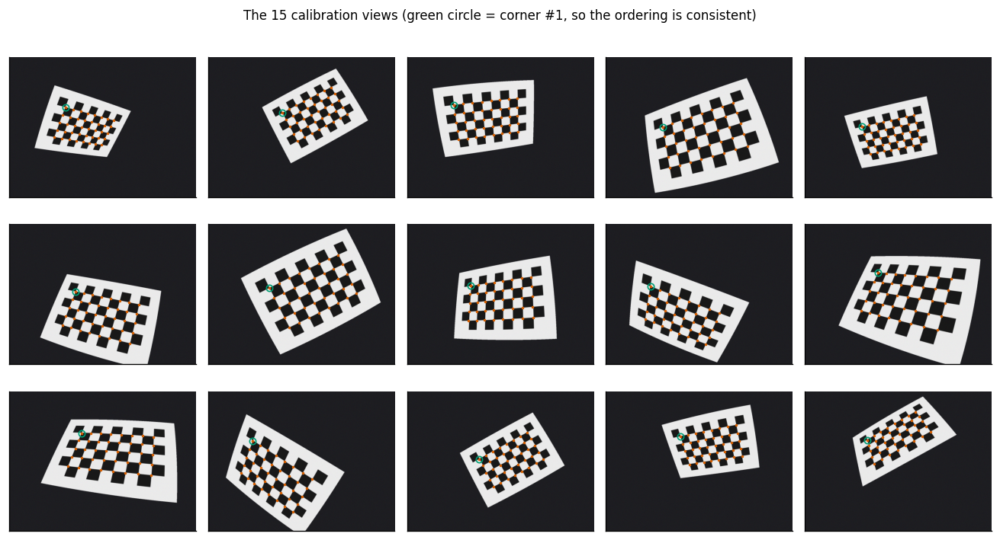
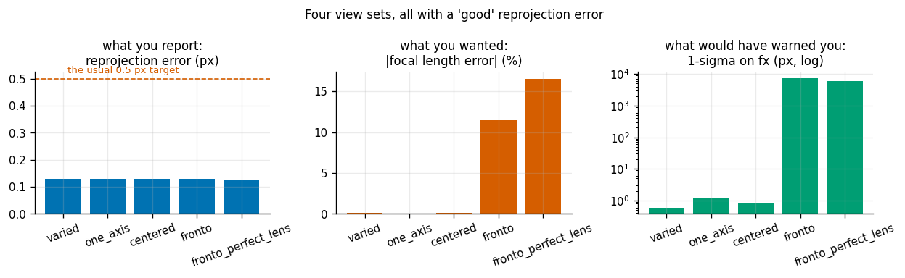
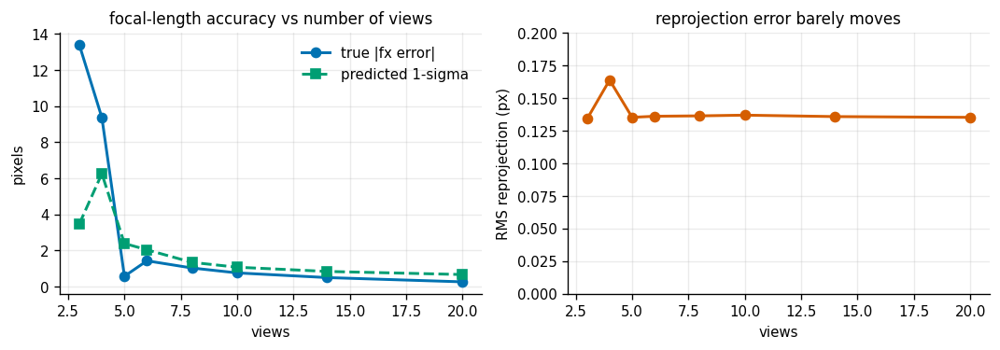
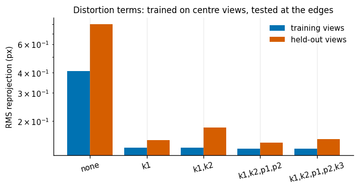
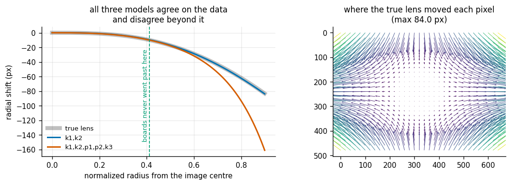
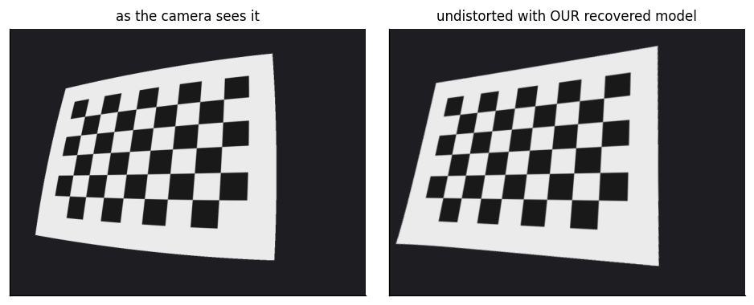
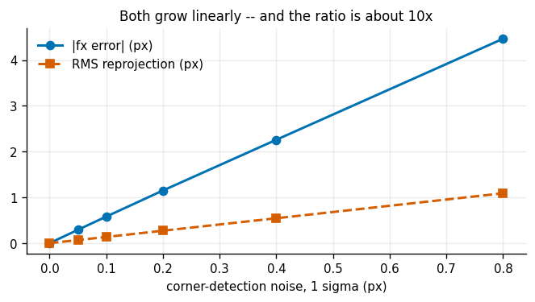

# Camera Calibration

## Key Insight

Before a camera can tell a robot *where* something is, you must measure the camera's own optics: its [focal length and principal point](/shared/glossary/#camera-intrinsics) and the way its lens bends straight lines into gentle curves, called [lens distortion](/shared/glossary/#lens-distortion). [Camera calibration](/shared/glossary/#camera-calibration) recovers these numbers by photographing a checkerboard of known square size from many angles and solving for the [pinhole camera model](/shared/glossary/#pinhole-camera-model) that best explains where every corner landed. The score you report — [reprojection error](/shared/glossary/#reprojection-error), the average pixel gap between where the model predicts a corner should appear and where it actually did — must drop below half a pixel, because every later step (depth, pose, grasping) inherits this error and can never be more accurate than the calibration beneath it.

**This is project 16**, the first of Phase 3 and the foundation the whole phase stands on. Projects [17](../17-apriltag-pose/README.md) through [23](../23-open-vocab-grasping/README.md) all import the camera model written here.

And there is a catch the Key Insight does not mention, which this project spends most of its time on. A reprojection error below half a pixel is **necessary but not sufficient**. You can hit 0.13 px with a focal length that is 16% wrong. Getting the number you report to look good is easy; making it *mean* something is the actual skill.

---

## Files

| file | what it is |
|---|---|
| `camera.py` | the pinhole camera + distortion model, by hand. **Imported by every project in Phase 3.** |
| `render.py` | a tiny ray-traced renderer for textured planes, plus the checkerboard. Also shared. |
| `calib.py` | Zhang's calibration from scratch: homography, closed-form intrinsics, Levenberg-Marquardt |
| `run.py` | the seven experiments |
| `outputs/` | figures and `results.csv` |

```bash
python3 run.py       # about 2 minutes; NumPy, Matplotlib, and OpenCV for the corner detector
```

---

## Why we photograph a *simulated* camera

Nothing stops you pointing a real webcam at a real checkerboard — and you should, once. But then you have no way to check the answer. Calibration returns nine numbers, and a real camera will not tell you what they should have been. Every claim in this project ("that focal length is 16% wrong") would be unprovable.

So `render.py` builds a camera whose parameters we chose, renders checkerboards *through* that camera's real distortion, and hands the images to the same corner detector you would use on a webcam. We recover the parameters and compare with the truth. That comparison is the only reason this project can distinguish "the fit is good" from "the answer is right" — a distinction which, it turns out, is the whole lesson.

Two conventions in `camera.py` are worth calling out, because both cost real debugging time here:

> **Pixel `i`'s centre sits at coordinate `i`, not `i + 0.5`.** That is OpenCV's convention and the one the projection formula assumes. Rendering with the other convention shifts every image by exactly half a pixel — which showed up as a perfectly steady "detector bias" of (−0.50, −0.50) px, ten times bigger than the detector's real error.
>
> **A texture pixel's colour belongs at the *centre* of the area it covers.** Sampling a `w`-pixel-wide texture with `u × (w−1)` instead of `u × w − 0.5` stretches it by `w/(w−1)`. That is only 0.2%, but across a 300-pixel-wide board it moved every corner by 0.7 px — again, larger than the entire error budget of a calibration.

---

## The three stages, and why there are three

Calibration is not one algorithm. It is a linear method that needs no starting guess, followed by a non-linear method that needs a very good one.

```
detected corners
      │
      ▼
1. homography per view      dst ≈ H · src, fitted by the Direct Linear Transform
      │                     LINEAR: solvable in one SVD, no initial guess needed
      ▼
2. closed-form intrinsics   N homographies -> one K, via Zhang's constraints
      │                     LINEAR, but assumes NO lens distortion, so it is only a start
      ▼
3. Levenberg-Marquardt      K + distortion + every board pose, all at once,
                            minimizing the real reprojection error in pixels
```

Beginners reasonably ask: *if step 3 optimizes everything anyway, why bother with 1 and 2?* Because step 3 is a **local** optimizer. It walks downhill from wherever you start it, and the error surface is full of wrong valleys — a camera whose board poses are flipped behind it explains nothing, but it is a resting point all the same. Steps 1 and 2 exist purely to drop step 3 into the right valley. They are the scaffolding, not the building.

Some names decoded, since each encodes what it does:

- **DLT — Direct Linear Transform.** "Direct" because it goes straight from correspondences to an answer with no iteration; "linear" because it rearranges the projection equations into the form `A h = 0`, whose answer is the smallest [singular vector](/shared/glossary/#singular-value-decomposition) of `A`.
- **Homography.** From Greek *homo-* ("same") + *-graphy* ("drawing"): the 3×3 map that redraws one flat surface as it appears in another image. Any two photographs of the same *plane* are related by one, which is exactly why a flat checkerboard is the target of choice.
- **[Levenberg-Marquardt](/shared/glossary/#levenberg-marquardt)** is named for Kenneth Levenberg and Donald Marquardt. It blends two solvers: [Gauss-Newton](/shared/glossary/#gauss-newton) (fast, but happily jumps off a cliff) and gradient descent (safe, but crawls). A damping number decides the mix — raise it after a step that made things worse, lower it after a step that helped. Think of a driver slowing into the bends and accelerating on the straights.
- **Reprojection error.** "Re-projection" because you project the known 3D corners *back* into the image using the model you just fitted, and measure how far they land from the corners you actually detected.

---

## 1. It works: rendered images in, camera parameters out



Fifteen boards, detected by OpenCV's `findChessboardCorners` plus subpixel refinement, on images that carry sensor noise. The green circle marks corner #1 in every view — if the detector ever numbered the corners from the opposite end, the calibration would be quietly fitting nonsense, and that circle is the cheapest way to see it.

| | value |
|---|---|
| corners detected | 600 (15 views × 40) |
| detector error vs ground truth | **0.040 px** mean, 0.129 px max |

| stage | fx | fy | cx | cy | k1 | RMS reprojection | fx error |
|---|---|---|---|---|---|---|---|
| closed form (steps 1-2) | 521.89 | 525.96 | 311.77 | 237.76 | — | 2.656 px | −18.1 px |
| **refined (step 3)** | **539.84** | **537.81** | **321.70** | **240.93** | −0.2853 | **0.0414 px** | **−0.16 px** |
| OpenCV `calibrateCamera` | 539.84 | 537.81 | 321.70 | 240.93 | −0.2853 | 0.0414 px | −0.16 px |
| *truth* | *540.00* | *538.00* | *322.00* | *241.00* | *−0.28* | — | — |

Two things to read here. First, the closed form is genuinely bad — 2.7 px, 18 px off on the focal length — and that is fine, because it was never meant to be the answer. Second, our from-scratch solver and OpenCV's agree to the digits shown, and the board poses they recover agree to **0.0000 degrees and 0.0001 mm**. That is the point of writing it yourself: not to beat the library, but to know that nothing mysterious is happening inside it.

---

## 2. The trap: a beautiful number and a wrong camera

This is the experiment worth remembering.

Four sets of fifteen views each, identical corner noise (0.10 px), identical everything except **how the board was held**:

| view set | what it means | RMS reprojection | focal-length error | reported distance to the board |
|---|---|---|---|---|
| varied tilts | boards tilted every which way | 0.1296 px | +0.12% | +0.10% |
| one-axis tilts | tilted, but always about the same axis | 0.1288 px | +0.02% | +0.02% |
| centred | varied tilt, always mid-image | 0.1287 px | +0.16% | +0.13% |
| **fronto-parallel** | **board always flat-on to the camera** | **0.1286 px** | **−11.42%** | **−11.39%** |
| fronto-parallel, perfect lens | same, with distortion switched off | 0.1281 px | −16.53% | −16.55% |



Every row passes the "under 0.5 px" test. Every row would be written up as a successful calibration. The last two are wrong by more than a tenth.

**Why.** Hold a board flat-on to the camera and move it away: the image simply shrinks. A board twice as far away photographed with a lens of twice the focal length looks *identical*. The two unknowns — focal length and distance — only ever appear as their ratio, so no amount of data of that kind can separate them. Nothing in the reprojection error can see this, because the fit really is perfect; the model just cannot tell which of infinitely many equally good answers is yours. Tilting the board breaks the tie: on a tilted board the near edge and the far edge shrink by *different* amounts, and how much they differ depends on the focal length alone.

The last row makes it exact. With the lens distortion switched off, nothing at all pins the focal length down, and the error grows from 11% to 17%. In other words, on a real camera **the only thing rescuing a fronto-parallel calibration is the lens being imperfect** — which is a thin reed to lean on.

Here is the same trap at its sharpest. Same data, four different starting guesses for the focal length:

| starting fx | final fx | RMS reprojection | reported board distance | true board distance |
|---|---|---|---|---|
| 400 | 350.3 | 0.1285 px | 271.4 mm | 418.3 mm |
| 540 | 454.7 | 0.1286 px | 352.4 mm | 418.3 mm |
| 700 | 578.0 | 0.1286 px | 447.8 mm | 418.3 mm |
| 900 | 724.4 | 0.1286 px | 561.3 mm | 418.3 mm |

The optimizer does not converge to an answer. It converges to *wherever it started*, and reports the same excellent residual each time. The recovered distance is wrong in exact proportion — which is what "focal length and distance are the same unknown here" means in practice.

### The warning sign that actually works

Reprojection error cannot detect this. Something else can: the **uncertainty** of the fitted parameters, which is a different question. The residual asks "does the model explain the corners I saw?" The uncertainty asks "how far could `fx` move and still explain them just as well?"

`calib.py` computes it the standard way, as the diagonal of `σ² (JᵀJ)⁻¹` — the [covariance](/shared/glossary/#covariance) of a least-squares fit, where `J` is the [Jacobian](/shared/glossary/#jacobian) (a table of how much each residual changes when each parameter is nudged) and `σ` is the noise level.

| view set | 1σ on fx | [condition number](/shared/glossary/#condition-number) of J |
|---|---|---|
| varied | 0.6 px | 8.0 × 10² |
| one-axis | 1.2 px | 7.8 × 10² |
| centred | 0.8 px | 8.9 × 10² |
| **fronto-parallel** | **7263 px** | **1.6 × 10⁶** |

A ±7263 px uncertainty on a 540 px focal length is the solver telling you, in the clearest terms available, that it has no idea. The condition number says the same thing in one number: it is the ratio between the best-determined and worst-determined directions in parameter space, so 10⁶ means one direction is a million times less visible to the data than another.

> **A trap inside the trap.** The first version of this code computed the covariance with `np.linalg.pinv(JᵀJ)` at its default tolerance, and reported a *comforting* 0.1 px uncertainty for the fronto-parallel case. A pseudo-inverse quietly deletes directions it judges too weak to invert — which is precisely the direction we were trying to detect. `rcond=0` keeps every direction, however faint, and lets the number blow up as it should.

---

## 3. How many views?



Averaged over six random view sets each, with 0.10 px corner noise:

| views | true \|fx error\| | predicted 1σ | RMS reprojection |
|---|---|---|---|
| 3 | 13.39 px | 3.48 px | 0.134 px |
| 4 | 9.36 px | 6.26 px | 0.164 px |
| 5 | 0.58 px | 2.39 px | 0.135 px |
| 8 | 1.03 px | 1.34 px | 0.136 px |
| 14 | 0.50 px | 0.84 px | 0.136 px |
| 20 | 0.27 px | 0.67 px | 0.135 px |

Accuracy improves roughly as `1/√views`, exactly as averaging noise should. The reprojection error, meanwhile, sits flat at 0.135 px whether you took three views or twenty — **it measures the noise, not the accuracy**, which is the same lesson as experiment 2 arriving from a different direction.

Note also that at three or four views the predicted 1σ *under*-states the real error (3.5 px predicted, 13.4 px actual). Covariance from a Jacobian assumes the problem behaves like a straight line near the answer; with barely enough data to determine the parameters at all, that assumption is thin. Trust the uncertainty as a warning, not as a guarantee.

---

## 4. How many distortion terms?

The distortion model is a polynomial in the radius from the image centre: `k1 r² + k2 r⁴ + k3 r⁶` for the radial part, plus two tangential terms `p1, p2` for a lens sitting slightly askew relative to the sensor. More terms fit better. That is the problem.

Trained on twelve views held in the **middle** of the image (the common mistake), tested on eight views that reach the **edges** — with the camera frozen, so the test can only fit the new boards' poses and cannot quietly re-fit the intrinsics it is supposed to be testing:



| model | training views | held-out views |
|---|---|---|
| no distortion | 0.409 px | 0.801 px |
| k1 | 0.137 px | 0.152 px |
| k1, k2 | 0.137 px | 0.183 px |
| k1, k2, p1, p2 | 0.135 px | 0.148 px |
| k1, k2, p1, p2, k3 | 0.135 px | 0.155 px |

Read the "no distortion" row first: **0.409 px passes the half-pixel test**. If all your boards live in the middle of the frame, you can skip the distortion model entirely and still report a "successful" calibration — and then be wrong by 0.8 px the moment something appears near the edge.

Beyond that, everything from one term upward is a wash. [Overfitting](/shared/glossary/#overfitting) here is mild, because the extra terms are still being pulled into line by 480 real corners.

---

## 5. Where the extra terms *do* explode: outside the data

The held-out test above was still inside the region the boards covered. Now look outside it.

Our fifteen boards, all fully inside the frame, only ever reached **46%** of the way out to the image corners (normalized radius 0.412 out of 0.899). Everything beyond that is the polynomial guessing.



| model | training RMS | max error *inside* the data | error *at the image corner* | still invertible? |
|---|---|---|---|---|
| k1, k2 | 0.0528 px | 0.303 px | **0.52 px** | yes |
| k1, k2, p1, p2, k3 | **0.0414 px** | 0.123 px | **77.89 px** | **no** |

The five-term model is better everywhere the data goes — 0.041 px against 0.053 px — and catastrophically worse everywhere else. Seventy-eight pixels of error at the corner of the image, from the model whose reported score was the better of the two.

"Invertible" is the sharper failure. Going from a 3D direction to a pixel is a formula; going from a pixel back to a 3D direction requires *undoing* that formula, which is only possible if the mapping is one-to-one — the distorted radius must keep increasing as the true radius increases. The fitted `k3 = −0.43` (the truth is −0.02) makes that curve turn back on itself before it reaches the corner. Past that point two different directions land on the same pixel, and "undistort this image" is not a well-posed request. Our undistortion loop simply fails to converge there; OpenCV silently returns whatever its fixed iteration count produced, which is worse, because it looks like an answer.

**What to do about it:** get the board into the corners of the image (that is what actually fixes it), and use no more distortion terms than your coverage justifies.



---

## 6. Noise in, error out

| corner noise (1σ) | \|fx error\| | RMS reprojection |
|---|---|---|
| 0.00 px | 0.000 px | 0.000 px |
| 0.05 px | 0.292 px | 0.068 px |
| 0.10 px | 0.581 px | 0.136 px |
| 0.20 px | 1.151 px | 0.273 px |
| 0.40 px | 2.260 px | 0.545 px |
| 0.80 px | 4.467 px | 1.091 px |



Both scale linearly, with a fixed exchange rate of about **10 px of focal-length error per 1 px of corner noise** (at 12 views). This is the one place the reprojection error *is* informative — as a noise meter. Halving your corner noise halves your parameter error, which is why subpixel corner refinement is not optional, and why one sharp, well-lit, motion-blur-free image is worth more than three smeared ones.

---

## What to take away

1. **Reprojection error measures the fit, not the answer.** It is a necessary check that catches gross mistakes (wrong board size, mis-ordered corners, a bad detection). It cannot see an unobservable parameter, and it cannot see extrapolation.
2. **Tilt the board.** Every view held flat-on to the camera is a view that tells you nothing new about the focal length.
3. **Fill the frame, corners included.** Distortion is *measured* where the board went and *invented* everywhere else.
4. **Report the uncertainty next to the value.** `fx = 540 ± 0.6` is a calibration; `fx = 540` is a hope. The [condition number](/shared/glossary/#condition-number) of the Jacobian is the one-number version of the same warning.
5. **A perfect calibration is still only the *start* of the error budget.** Project [17](../17-apriltag-pose/README.md) measures what an 11%-wrong focal length does to a tag pose (it makes every distance 11% wrong), and project [18](../18-stereo-depth/README.md) measures what it does to stereo depth.
