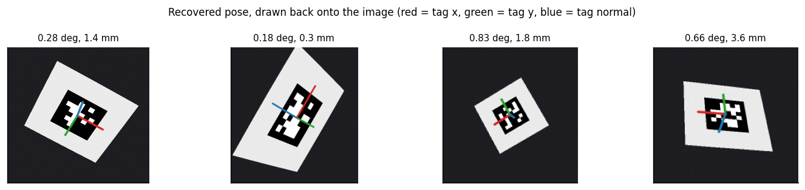
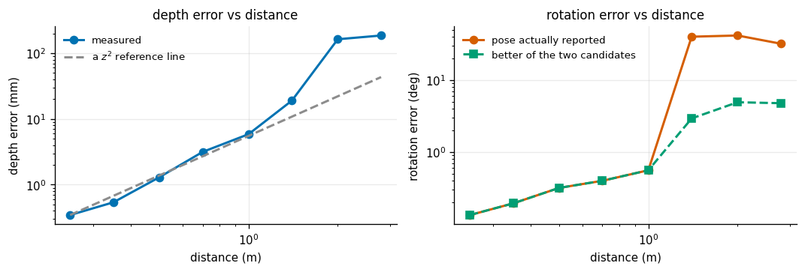
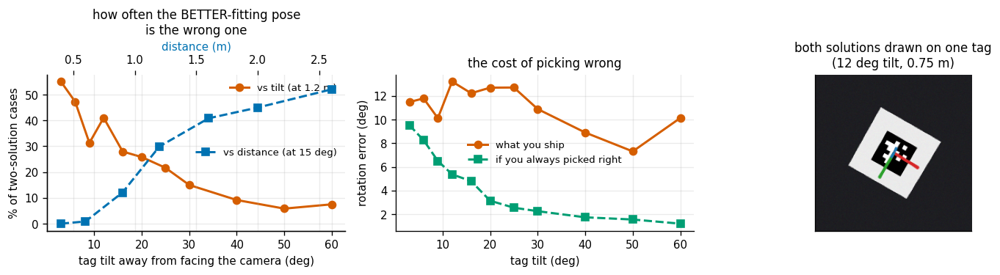
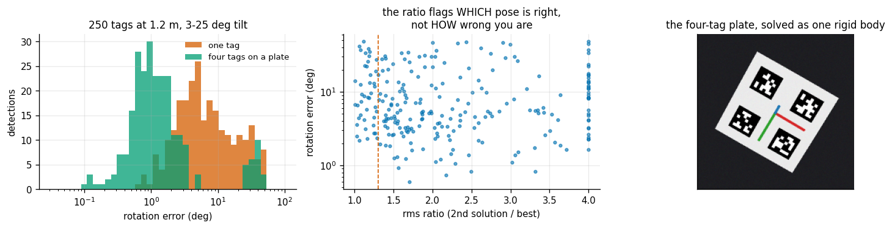

# AprilTag Pose

## Key Insight

An [AprilTag](/shared/glossary/#apriltag) is a printed black-and-white square — a [fiducial marker](/shared/glossary/#fiducial-marker) — whose pattern encodes an ID the robot can detect instantly and unambiguously, making it the cheapest reliable way to drop a known landmark into a scene. Because the tag's real-world size and flat square shape are known in advance, locating its four corners in the image is enough to solve for its full [6-DoF pose](/shared/glossary/#6-dof-pose) — position and orientation — using the [Perspective-n-Point](/shared/glossary/#pnp-perspective-n-point) algorithm, which back-solves the camera geometry that maps the 3D corners to their 2D pixels. Projecting the tag's coordinate axes back onto the image is the honest visual check: if the drawn axes sit squarely on the tag, the recovered pose is right.

**This is project 17.** It builds directly on project [16](../16-camera-calibration/README.md) — the camera model, the renderer and the Levenberg-Marquardt solver all come from there — and it answers the question 16 left open: what does a slightly wrong calibration actually cost you?

It also adds the fact nobody puts in the tutorial: for a **flat** target the PnP problem usually has **two** answers that fit the image almost equally well. At close range you never notice. At two metres, the better-fitting one is the wrong one **half the time**, and the pose flips by twenty degrees while your reprojection error stays beautiful.

---

## Files

| file | what it is |
|---|---|
| `tags.py` | making tag images, placing them in a scene, detecting them, drawing axes |
| `pnp.py` | planar pose from four corners, **both** solutions, from scratch |
| `run.py` | the six experiments |
| `outputs/` | figures and `results.csv` |

```bash
python3 run.py       # about 70 seconds
```

Imports `camera.py`, `render.py` and `calib.py` from project [16](../16-camera-calibration/README.md).

---

## What "PnP" means, and why perspective is the whole trick

**P-n-P = Perspective-n-Point.** You know where `n` points sit on a rigid object (here: the four corners of a 6 cm square, in the square's own frame). You see where they landed in the image. Recover the object's position and orientation.

The word **perspective** is doing real work. Under perspective, near things look bigger — and *that* is what makes distance recoverable at all. A hypothetical camera without perspective (an "orthographic" one, like an engineering drawing) would draw the tag exactly the same size at every distance, and no algorithm could tell you how far away it was. Every millimetre of depth you get out of a single image comes from the fact that the tag's far edge is drawn slightly smaller than its near edge.

That also tells you when it will fail: when the tag is far away and nearly facing you, the near and far edges differ by almost nothing, and the depth information has all but vanished. Experiment 3 measures exactly this.

**Why a border around the tag?** `tags.py` pads every tag with a white "quiet zone". This looks like decoration and is not. The detector finds candidate tags by looking for a dark quadrilateral against a lighter background; a tag printed edge-to-edge on dark paper very often is simply never found.

---

## 1. Detect, solve, draw the axes back



Four tags rendered at known poses, detected, solved, and their axes projected back on. Red is the tag's x axis, green its y, blue its normal (the direction pointing out of the tag's face).

| tag | distance | detected corner error | reprojection RMS | rotation error | position error | vs OpenCV |
|---|---|---|---|---|---|---|
| 0 | 450 mm | 0.239 px | 0.075 px | 0.281° | 1.37 mm | 0.027° |
| 1 | 300 mm | 0.223 px | 0.061 px | 0.180° | 0.29 mm | 0.018° |
| 2 | 800 mm | 0.229 px | 0.019 px | 0.831° | 1.76 mm | 0.054° |
| 3 | 550 mm | 0.336 px | 0.147 px | 0.662° | 3.60 mm | 0.056° |

The last column is our from-scratch solver against OpenCV's `solvePnPGeneric` on the identical corners: they agree to within a twentieth of a degree, which is smaller than either one's error against the truth.

> **Getting this comparison to work took one debugging cycle worth repeating.** The first version compared against `SOLVEPNP_IPPE_SQUARE` and got disagreements of 70-150°. Nothing was wrong with either solver: `IPPE_SQUARE` ignores the object points you pass and assumes its *own* corner order (with y pointing up), while our tag frame has y pointing down to match the order the detector returns. Same square, two conventions, a 180° flip. When two pose solvers disagree by roughly 90° or 180°, suspect a convention before suspecting the maths.

---

## 2. Accuracy versus distance

Eight viewing angles averaged at each distance, all on rendered images with a real detector:



| distance | tag width in image | depth error | relative | rotation error (reported) | rotation error (better of the two candidates) |
|---|---|---|---|---|---|
| 0.25 m | 120 px | 0.35 mm | 0.14% | 0.13° | 0.13° |
| 0.35 m | 86 px | 0.54 mm | 0.15% | 0.19° | 0.19° |
| 0.50 m | 60 px | 1.30 mm | 0.26% | 0.32° | 0.32° |
| 0.70 m | 43 px | 3.15 mm | 0.45% | 0.40° | 0.40° |
| 1.00 m | 30 px | 5.87 mm | 0.59% | 0.56° | 0.56° |
| 1.40 m | 21 px | 19.0 mm | 1.36% | **40.2°** | 2.94° |
| 2.00 m | 14 px | 163 mm | 8.16% | **41.8°** | 4.94° |
| 2.80 m | 10 px | 186 mm | 6.64% | **32.2°** | 4.79° |

Depth error grows faster than distance — roughly as distance squared, for the same reason stereo depth does (project [18](../18-stereo-depth/README.md) measures the identical law): the measurement you actually make is an *angle*, and turning an angle into a distance divides by the angle's size, which shrinks with range.

But look at the two rotation columns. Up to a metre they are the same number. Past 1.4 m the reported error explodes to 40° while "the better of the two candidates" stays under 5°. **The solver had the right answer available and chose the other one.** That is the subject of the next experiment.

---

## 3. The planar pose ambiguity

Take a square, tilt it 15° toward you, and photograph it. Now tilt the same square 15° *away* from you and photograph it again. The two pictures are not identical — but they differ by less than a pixel once the tag is small in the frame. Any solver looking only at the corners has to choose, and the reprojection error barely helps it.

This is not a defect of a particular library. It is a property of flat targets, and every planar solver (OpenCV's IPPE included) returns two candidate poses for exactly this reason.

**How `pnp.py` finds the second one.** Take the first solution, then reflect the tag's normal about the line of sight — keep the tag where it is and keep which way it points *along* the viewing ray, but flip which way it leans. That lands inside the second solution's basin, so running the same local optimizer from there converges to it. (If the two have merged into one, the optimizer slides back to the first solution and we report one solution honestly, rather than pretending to have two.)



**As tilt changes** (tag at 1.2 m, corner noise 0.30 px, 120 trials per point):

| tilt | cases with two solutions | of those, the better fit is **wrong** | median reprojection ratio (2nd/best) | error you ship | error if you always chose right |
|---|---|---|---|---|---|
| 3° | 81.7% | **55.1%** | 1.62 | 11.5° | 9.5° |
| 9° | 82.5% | 31.3% | 1.56 | 10.1° | 6.5° |
| 16° | 98.3% | 28.0% | 1.85 | 12.2° | 4.8° |
| 30° | 100% | 15.0% | 2.22 | 10.9° | 2.3° |
| 60° | 100% | 7.5% | 2.83 | 10.1° | **1.2°** |

**As distance changes** (fixed 15° tilt — the same effect, now visible as "how many pixels wide is the tag"):

| distance | tag width | the better fit is wrong | median ratio | error you ship | error if you always chose right |
|---|---|---|---|---|---|
| 0.4 m | 79 px | **0.0%** | 4.32 | 1.28° | 1.28° |
| 0.6 m | 53 px | 0.9% | 3.87 | 2.35° | 2.14° |
| 0.9 m | 35 px | 12.1% | 2.36 | 6.32° | 3.26° |
| 1.2 m | 27 px | 29.9% | 1.78 | 12.0° | 4.43° |
| 1.6 m | 20 px | 40.9% | 1.39 | 15.6° | 5.70° |
| 2.0 m | 16 px | 45.0% | 1.33 | 18.0° | 7.94° |
| 2.6 m | 12 px | **52.1%** | 1.16 | 21.3° | 8.95° |

At 2.6 m the choice is worse than a coin flip, and the two candidates fit the image within 16% of each other. Meanwhile at 0.4 m the correct pose fits **4.3 times** better and the problem does not exist. In one sentence: **the ambiguity is governed by how many pixels the tag spans, and a tag that fills 80 pixels does not have it.**

The right-hand panel of the figure shows both solutions drawn on a single real detection at 0.75 m and 12° tilt. Their normals point 22° apart; the reprojection errors are 0.053 px and 0.305 px. Even here — where the ratio is a healthy 5.8× and the solver picks correctly — the wrong answer is only three tenths of a pixel away from perfect.

---

## 4. Two cures, one of which does not work

Same regime throughout: 250 tags at 1.2 m with 3-25° of tilt, i.e. right in the danger zone.



| approach | mean error | median | 90th percentile | worse than 10° |
|---|---|---|---|---|
| one tag, take the best fit | 10.92° | 5.67° | 30.1° | 32.8% |
| reject when ratio < 1.1 (keeps 94.8%) | 10.87° | 5.64° | 30.1° | 32.9% |
| reject when ratio < 1.3 (keeps 82.8%) | 10.25° | 5.31° | 28.5° | 30.4% |
| reject when ratio < 2.0 (keeps 47.6%) | 11.06° | 5.48° | 30.8° | 32.8% |
| reject when ratio < 3.0 (keeps 23.6%) | 10.48° | 6.13° | 24.1° | 35.6% |
| **four tags on one rigid plate** | **4.62°** | **1.08°** | **4.95°** | **9.6%** |

### The cure that fails, and why it is worth knowing

The obvious fix — "throw away detections where the two solutions fit almost equally well" — barely moves the needle. Throwing away *half* the data leaves the mean error unchanged.

The ratio is not useless; it is useless for the job we asked of it. Split by ratio:

| ratio band | how often the better fit is the wrong pose |
|---|---|
| below 1.2 | 46.7% |
| above 2.0 | 21.8% |

So a high ratio does mean you are more likely to have picked the right candidate. But the correlation between the ratio and how wrong the shipped pose actually is comes out at **−0.06** — no relationship at all. The reason is that at 1.2 m most of the error is plain corner noise shared by *both* candidates, not the flip. Filtering removes some flips and leaves the noise, so the average barely moves.

This is the same shape of lesson as project [7](../07-hand-eye-calibration/README.md)'s hand-eye result, where the AX = XB residual correlated with true error at only r = 0.17: **a quantity that is small when things are good is not automatically a detector of when things are bad.**

### The cure that works

Four tags on one rigid plate, solved as a single body: mean 10.9° → 4.6°, median 5.7° → 1.1°, catastrophic failures 32.8% → 9.6%.

Why does it work when one tag does not? The four tags sit at different places on the plate, so they are at slightly different distances and angles from the camera. The wrong tilt can be made to explain one tag's corners, but it then predicts the *other* tags in visibly wrong places. Stacking all sixteen corners into one solve makes the wrong minimum a bad fit instead of a near-tie. On a rendered plate at 1.0 m, this recovers the pose to **0.71° and 3.1 mm**.

The practical rule for real robots: **one tag is a landmark, several tags on a rigid plate are a measurement.** If you can only afford one, make it big and get close.

---

## 5. A tag measured wrong, and a camera calibrated wrong

The tag's physical size is the one number in the whole pipeline that comes from a ruler rather than an algorithm. Forty poses, with the believed tag size deliberately wrong:

| believed size error | depth error | rotation error |
|---|---|---|
| −5% | −4.99% | 0.62° |
| −2% | −2.02% | 0.65° |
| 0% | −0.05% | 0.68° |
| +2% | +1.97% | 0.58° |
| +5% | +5.06% | 0.65° |

**Size error goes straight through to distance, one-for-one, and does not touch the rotation at all.** That is the shape of the object as seen in the image staying the same while its scale changes — the same coupling between size and distance that made the fronto-parallel calibration of project [16](../16-camera-calibration/README.md) ambiguous. Practical consequence: measure the black square edge-to-edge with calipers, and remember that "6 cm" printed by a printer that scales to fit is usually not 6 cm.

Now the camera itself. The image is always the truth; only the camera model the solver is told about changes:

| camera model used | depth error | rotation error |
|---|---|---|
| correct | +0.05% | 0.79° |
| project [16](../16-camera-calibration/README.md)'s fronto-parallel calibration (fx 11% low) | **−12.07%** | 1.82° |
| correct focal length, **no distortion model** | −3.67% | **4.89°** |

The first row is the payoff of project [16](../16-camera-calibration/README.md)'s cautionary tale: a calibration that reported a flawless 0.13 px reprojection error makes every distance you measure 12% wrong, forever, silently. At 1 m that is 12 cm — the difference between grasping a mug and knocking it over.

The third row is why undistortion is not optional. These tags are spread across the whole image; near the corners the lens moves pixels by tens of pixels (project [16](../16-camera-calibration/README.md) measured a maximum of 84 px), and pretending it does not costs almost 5° of rotation. Note that this only shows up because the tags roam the frame: an earlier version of this experiment kept every tag near the image centre, where distortion is nearly zero, and "proved" that the distortion model does not matter (0.17% error). **A test that never visits the region where an effect lives will always report that the effect is absent.**

---

## 6. Subpixel corner refinement

Twelve rendered tags at 0.4-0.9 m:

| corner refinement | detected corner error | rotation error | position error |
|---|---|---|---|
| off | 0.689 px | 1.484° | 14.49 mm |
| **on** | **0.206 px** | **0.359°** | **2.69 mm** |

The detector's raw corners come from fitting straight lines to a thresholded black quadrilateral, so they are only as good as that threshold. The refinement step re-reads the actual intensity gradients in a small window around each corner and slides it to where the gradients say the corner really is. It costs microseconds and buys a **4× better rotation and a 5× better position**. There is never a reason to leave it off.

---

## What to take away

1. **A flat target gives two poses.** Always compute both. Solvers that hand you one have already chosen for you.
2. **The ambiguity is about pixels, not metres.** A tag 80 px wide is unambiguous; the same tag at 12 px is a coin flip. If the pose matters, make the tag big in the image — get closer, use a bigger tag, or use a longer lens.
3. **Several tags on a rigid plate beat one tag by 5× on the median.** This is the cheapest reliable fix in the whole project.
4. **A screening rule that flags "this might be ambiguous" is not the same as a rule that predicts "this pose is wrong."** Ours had a correlation of −0.06 with the actual error. Check that your quality flag correlates with the quality you care about before you trust it.
5. **Two ruler-grade numbers dominate the error budget**: the tag's printed size (1:1 into distance) and the camera's focal length (also 1:1 into distance). Both are set before any code runs.
