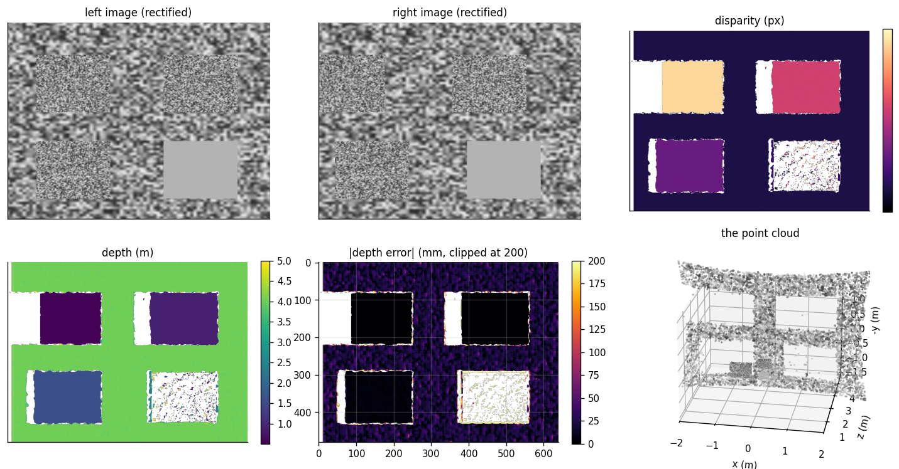
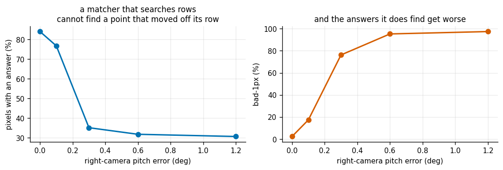
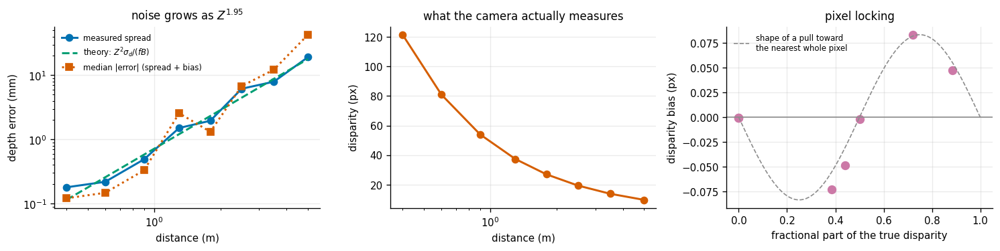
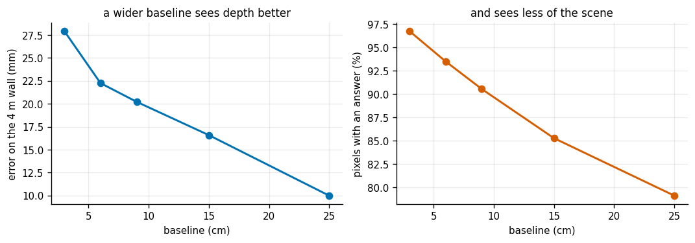
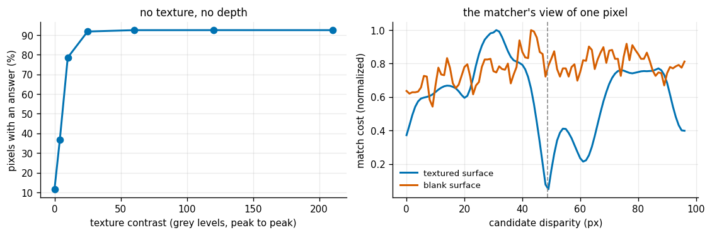
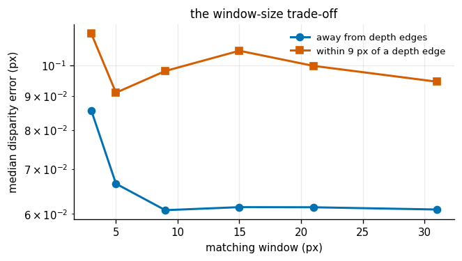

# Stereo Depth

## Key Insight

A single camera cannot see depth, but two cameras a known distance apart can — exactly how your two eyes do it. The same object appears shifted sideways between the left and right images, and that shift, called [disparity](/shared/glossary/#disparity), is large for near objects and small for far ones. [Stereo vision](/shared/glossary/#stereo-vision) measures the disparity for every pixel and converts it to distance by [triangulation](/shared/glossary/#triangulation) — intersecting the two lines of sight in 3D — producing a [depth map](/shared/glossary/#depth-map) you can lift into a [point cloud](/shared/glossary/#point-cloud). The catch this project teaches: depth precision falls off with the square of distance, so a rig accurate to a millimeter up close may be off by centimeters across the room.

**This is project 18.** It uses project [16](../16-camera-calibration/README.md)'s camera model and renderer, and it is where the `Z²` law announced above stops being a slogan and becomes a measured exponent of **1.95**.

It also uncovers a second error, invisible in any textbook formula, that at 5 m is **twice as big as the noise**: the subpixel step quietly pulls every disparity toward the nearest whole pixel.

---

## Files

| file | what it is |
|---|---|
| `stereo.py` | the rig, block matching by hand, disparity → depth → point cloud, the test scene |
| `run.py` | the seven experiments |
| `outputs/` | figures and `results.csv` |

```bash
python3 run.py       # about 70 seconds
```

---

## The one equation

```
        f · B
  Z  =  ─────
          d

  Z = distance to the surface     (metres)      <- what you want
  f = focal length                (pixels)      <- from project 16
  B = baseline, the gap between the cameras (m) <- you measure it once
  d = disparity, the sideways shift (pixels)    <- the only thing measured per pixel
```

Everything else in stereo — rectification, matching, filtering — exists to get a trustworthy `d` for as many pixels as possible.

Two consequences fall straight out of the formula and are worth internalizing before any code:

- **Depth is `1/d`.** Disparity is what the camera measures, and it is measured in pixels, so its error is roughly the same everywhere in the image. But `Z = fB/d` means a fixed error in `d` becomes a *growing* error in `Z`: differentiate and you get `ΔZ = Z²·Δd/(fB)`. Double the distance, quadruple the error. That is the whole `Z²` story.
- **Near objects are easy, far objects are hard, and there is no tuning around it.** At 0.4 m our rig sees 121 px of disparity; at 5 m it sees 9.7 px. The far surface is being measured with one twelfth of the signal.

---

## 1. The pipeline, end to end



Four textured posters at 0.55, 0.90, 1.60 and 2.60 m (the last one deliberately blank) in front of a wall at 4 m, seen by two 640×480 cameras 9 cm apart.

| | value |
|---|---|
| pixels that got an answer ("density") | 84.0% |
| median depth error | 15.3 mm |
| bad-1px (answers off by more than 1 px of disparity) | 2.37% |

Three metrics, because no single one is honest on its own:

- **Density** — the fraction of pixels with any answer at all. A matcher can score a perfect error by answering only where it is sure.
- **Median depth error** — the *typical* error. The mean is useless here: a handful of grossly wrong matches drags it up by an order of magnitude and hides what the other 99% did.
- **bad-1px** — the fraction of answers wrong by more than one pixel of disparity. This is the standard stereo metric, and it is quoted in *disparity* rather than millimetres on purpose: one pixel of disparity is 0.15 mm at 0.4 m and 500 mm at 5 m, so a millimetre-based average would mostly report which surface happened to fill the most pixels.

Note the white bands in the disparity map, all on the **left** edge of every object. That is not a bug. The right camera, sitting to the right, physically cannot see the strip of background hiding just behind an object's left edge, so no correct match exists there. The left-right consistency check — match in both directions and keep only pixels where the two agree — is what finds and removes them.

### Block matching, and the integral-image trick

For each pixel in the left image, slide a window along the same row of the right image and take the position where the two windows look most alike. "Most alike" here is **SAD — the Sum of Absolute Differences**, the cheapest sensible similarity measure: add up how far apart the two windows' pixel values are.

Done naively, testing 96 candidate disparities with a 9×9 window costs 96 × 81 additions per pixel. The **integral image** (a running sum from the top-left corner of the image) reduces any window sum to exactly four lookups, whatever the window size — so a 31×31 window costs the same as a 3×3 one. That is what makes every sweep in this project run in a minute instead of an hour.

---

## 2. Rectification: what "the rows line up" is worth

The matcher only searches along a row. That is a hundred times cheaper than searching the whole image — and it is only correct if a point at row `v` in the left image really is at row `v` in the right one. Making that true is **rectification**: undistort both images and warp them so their rows correspond.

| images fed to the matcher | density | median depth error | bad-1px |
|---|---|---|---|
| raw, still distorted | 77.4% | **387 mm** | **64.9%** |
| undistorted | 84.0% | **15.3 mm** | **2.37%** |

Twenty-five times worse, from skipping one warp. The lens bends each row into a curve, and a curve that starts on row `v` does not stay on it.

Then the mechanical version of the same problem — the right camera pitched slightly up:



| pitch error | rows the image slides by | density | median depth error | bad-1px |
|---|---|---|---|---|
| 0.0° | 0.00 px | 84.0% | 15.3 mm | 2.4% |
| 0.1° | 0.94 px | 76.7% | 76.2 mm | 17.4% |
| 0.3° | 2.82 px | 35.1% | 739 mm | 76.2% |
| 0.6° | 5.63 px | 31.7% | 2658 mm | 95.3% |
| 1.2° | 11.27 px | 30.6% | 2785 mm | 97.4% |

**One tenth of a degree** — a misalignment you could not see by eye, one six-hundredth of this camera's field of view — costs a seven-fold increase in the error rate. Three tenths of a degree destroys the depth map.

This is why stereo cameras are sold as a single rigid factory-calibrated unit rather than two cameras you screw to a bar, and why a rig that has been bumped needs re-calibrating rather than a look and a shrug. It is also why the number to watch after re-calibrating is the *vertical* disagreement between matched features, not the reprojection error.

---

## 3. Depth error versus distance, and the artifact hiding underneath

One textured wall filling the view, moved from 0.4 m to 5 m:



| distance | true disparity | disparity noise | depth spread | median depth error | relative |
|---|---|---|---|---|---|
| 0.4 m | 121.50 px | 0.055 px | 0.18 mm | 0.12 mm | 0.03% |
| 0.6 m | 81.00 px | 0.030 px | 0.22 mm | 0.15 mm | 0.03% |
| 0.9 m | 54.00 px | 0.029 px | 0.49 mm | 0.33 mm | 0.04% |
| 1.3 m | 37.38 px | 0.043 px | 1.51 mm | 2.56 mm | 0.20% |
| 1.8 m | 27.00 px | 0.029 px | 1.95 mm | 1.32 mm | 0.07% |
| 2.5 m | 19.44 px | 0.048 px | 6.16 mm | 6.77 mm | 0.27% |
| 3.5 m | 13.89 px | 0.032 px | 7.93 mm | 12.21 mm | 0.35% |
| 5.0 m | 9.72 px | 0.038 px | 19.15 mm | **42.75 mm** | 0.86% |

**The law holds.** Fitting `error ∝ Z^p` to the depth *spread* gives **p = 1.95**. The spread predicted at 5 m by the formula `Z²σ_d/(fB)`, using the measured disparity noise, is **17.9 mm** against **19.1 mm** measured — theory and experiment agree to 7%. Over 12× the distance, the error grows 100×.

### But look at the last two columns

At 5 m the *spread* is 19 mm and the *median error* is 43 mm. The extra is not noise; noise averages out and this does not. Something is pushing every disparity the same way.

Sort the same runs by the fractional part of the true disparity:

| distance | true disparity | fractional part | measured bias |
|---|---|---|---|
| 0.6 m | 81.00 | 0.00 | −0.0003 px |
| 0.9 m | 54.00 | 0.00 | −0.0002 px |
| 1.8 m | 27.00 | 0.00 | −0.0004 px |
| 1.3 m | 37.38 | 0.39 | **−0.0728 px** |
| 2.5 m | 19.44 | 0.44 | **−0.0483 px** |
| 0.4 m | 121.50 | 0.50 | −0.0020 px |
| 5.0 m | 9.72 | 0.72 | **+0.0835 px** |
| 3.5 m | 13.89 | 0.89 | **+0.0478 px** |

The pattern is unmistakable. When the true disparity is a whole number, the bias is *zero to four decimal places*. When it is 0.39, the estimate is pulled **down**. When it is 0.72 or 0.89, it is pulled **up**. When it is exactly 0.5 — equally far from both neighbours — the two pulls cancel and the bias vanishes again.

This is **pixel locking**, a property of the parabola fit used for subpixel refinement. The matcher tests disparities at whole pixels and then fits a parabola through the three costs around the winner to guess where the true minimum lies between them. But the real cost curve is not a parabola: it is more V-shaped, with a sharper bottom. Fitting a rounded curve into a pointy valley systematically places the estimate too close to the whole-pixel sample at the bottom.

The consequence for a robot: **your depth error depends on where the object happens to be**, in a way that repeats every time you look at that distance and never averages away. Ten frames of the same scene will not remove it. The standard fixes are to fit a shape closer to the true cost curve, or to blur the cost volume slightly so that the valley really is parabolic. Both are beyond this project — but knowing the artifact exists is what stops you chasing it as a calibration error.

---

## 4. Baseline: accuracy against coverage



| baseline | disparities to search | density | median error (whole scene) | error on the 4 m wall |
|---|---|---|---|---|
| 3 cm | 33 | **96.7%** | 20.5 mm | 27.9 mm |
| 6 cm | 65 | 93.5% | 14.1 mm | 22.3 mm |
| 9 cm | 98 | 90.5% | 14.3 mm | 20.2 mm |
| 15 cm | 162 | 85.3% | 11.7 mm | 16.6 mm |
| 25 cm | 270 | **79.1%** | **7.6 mm** | **10.0 mm** |

Look at the formula again: `ΔZ = Z²Δd/(fB)`. `B` is in the denominator, so a wider baseline divides the error. Going from 3 cm to 25 cm — 8× wider — cuts the error on the far wall by 2.8×.

So why not build every rig with a two-metre baseline? Three reasons, two of them in the table:

1. **You see less.** Density drops from 97% to 79%. The further apart the cameras, the more of the scene one of them cannot see behind an object — those occluded strips grow in direct proportion to the baseline.
2. **You search more.** The disparity range you must cover grows with `B`, from 33 candidates to 270, and cost is linear in that number.
3. **The minimum range grows.** A surface closer than `fB/d_max` produces a disparity larger than anything you searched for. With a 25 cm baseline anything nearer than about 50 cm is off the end of the search — and the matcher does not report "too close", it reports a confident wrong answer at the edge of its range.

The practical rule: pick the baseline for the distance you actually care about, and accept that one rig cannot be good at 30 cm and at 20 m.

---

## 5. Texture: the one thing that cannot be tuned around

Same wall at 1 m, with the texture's contrast dialled from flat grey to full range:



| texture contrast (grey levels, peak to peak) | density | median disparity error |
|---|---|---|
| 0 (blank) | **11.6%** | 26.6 px |
| 4 | 36.7% | 0.886 px |
| 10 | 78.6% | 0.329 px |
| 25 | 91.8% | 0.144 px |
| 60 | 92.5% | 0.083 px |
| 120 | 92.5% | 0.070 px |
| 210 | 92.5% | 0.068 px |

The right-hand panel shows *why*, better than the table can: it plots the match cost of one pixel against every candidate disparity. On the textured surface the curve has a deep, unmistakable minimum at the right answer — the cost there is **8%** of the average. On the blank surface the curve is nearly flat: the minimum is **70%** of the average, so which candidate wins is decided by sensor noise, not by the scene.

There is nothing to fix here, because there is no information. Every window on a blank wall looks like every other window on a blank wall. This is exactly why depth cameras built for robots (RealSense and its relatives) carry an infrared **projector** that sprays a random dot pattern onto the scene: it is not lighting the room, it is painting on the texture that block matching needs. A stereo rig aimed at a white wall, a glass door, or a clear sky returns nothing, and no parameter tuning changes that.

Notice also that a contrast of 10 out of 255 — barely visible to a human — already recovers 79% density. Block matching does not need strong texture, only *some*.

---

## 6. Window size: noise against fat edges

| window | error away from depth edges | error near depth edges | bad-1px near edges | density |
|---|---|---|---|---|
| 3×3 | 0.086 px | 0.112 px | 13.0% | 82.8% |
| 5×5 | 0.067 px | 0.091 px | 11.5% | 84.4% |
| 9×9 | **0.061 px** | 0.098 px | 15.2% | 84.0% |
| 15×15 | 0.061 px | 0.105 px | 19.0% | 84.2% |
| 21×21 | 0.061 px | 0.100 px | 20.1% | 84.6% |
| 31×31 | 0.061 px | 0.095 px | **23.4%** | 85.4% |



(Scored in *disparity* pixels rather than millimetres, for the reason given in experiment 1: this scene spans 0.55 m to 4 m, and a millimetre average would mostly report which surface has the most pixels.)

Two competing effects:

- **A bigger window averages away noise.** From 3×3 to 9×9 the error on flat surfaces drops 30%, then stops improving — beyond that the window already contains ample texture and there is nothing left to gain.
- **A bigger window straddles depth edges.** Any window overlapping an object boundary contains two surfaces at two different depths, and one disparity has to explain both. The result is "edge fattening": objects grow a skirt of wrong depth, and the failure rate near edges climbs steadily from 13% to 23%.

The best window is therefore *just big enough*, and on this scene that is 5×5 to 9×9. This trade-off is precisely why modern stereo uses semi-global matching instead: rather than averaging over a window, it keeps a per-pixel cost and adds a penalty for disparity changing between neighbours — smoothing where the image is smooth, and allowing a jump where the image has an edge.

---

## 7. Against OpenCV

The same rectified pair, three matchers:

| matcher | density | median depth error | bad-1px |
|---|---|---|---|
| ours (SAD 9×9, subpixel, left-right check) | 84.0% | 15.34 mm | **2.37%** |
| OpenCV `StereoBM` | 73.0% | **12.31 mm** | 4.53% |
| OpenCV `StereoSGBM` | 81.2% | 29.02 mm | 8.08% |

All three land in the same ballpark, which is the real point: nothing exotic is happening inside the library, and now you know exactly what.

**Do not read this as "our matcher beats OpenCV."** It does not. Ours was written for this scene and tuned on it; SGBM's default penalties are tuned for photographs of real rooms, where its smoothness assumption pays for itself and where these crisp synthetic edges work against it. A comparison in which the home team picked the test set is a sanity check, not a benchmark.

---

## What to take away

1. **`Z = fB/d`, and every error in the chain flows through it.** Focal length comes from project [16](../16-camera-calibration/README.md) (an 11%-wrong `f` makes every depth 11% wrong), baseline from a ruler, disparity from the matcher.
2. **Depth error grows as `Z²`** — measured exponent 1.95, with the theoretical formula predicting the size to within 7%. Quote your sensor's accuracy *with a distance attached*, or you have said nothing.
3. **Rectification is not a formality.** 0.1° of camera pitch — invisible by eye — raised the failure rate 7×.
4. **No texture, no depth.** Not a tuning problem; there is no information in a blank wall. Projected-pattern depth cameras exist for exactly this reason.
5. **Subpixel refinement carries a bias that averaging cannot remove.** At 5 m the pixel-locking bias was twice the noise. If your depth is repeatably wrong at one particular distance, suspect this before you suspect the calibration.
6. **Baseline is a design decision, not a default.** Wider is more accurate, sees less, costs more compute, and cannot see close up.

Project [19](../19-icp-registration/README.md) picks up the point cloud this project produced and asks the next question: given two of them, taken from different places, how do you line them up?
