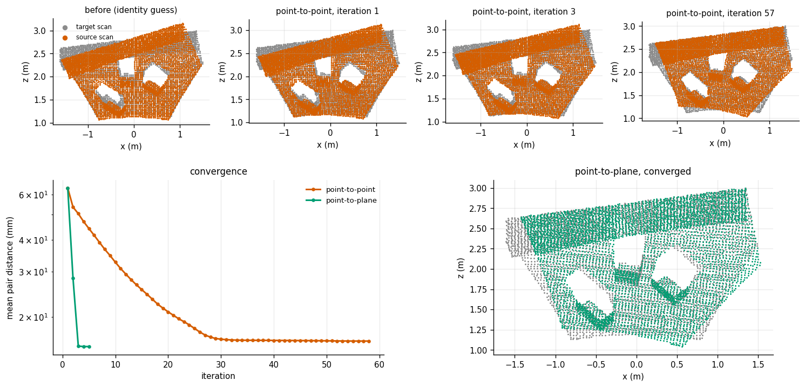
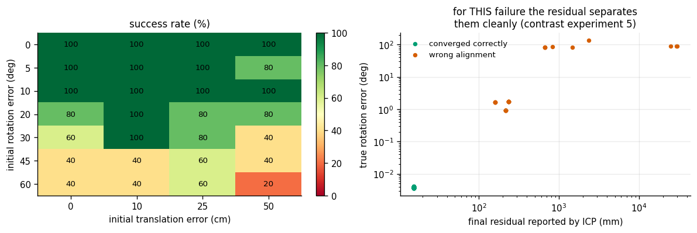
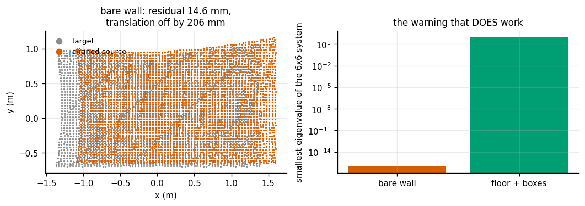

# ICP Registration

## Key Insight

Two depth scans of the same scene taken from different viewpoints describe the same surfaces, but each in its own coordinate frame — [registration](/shared/glossary/#point-cloud-registration) is the job of finding the rigid [transform](/shared/glossary/#homogeneous-transform) that snaps one onto the other. [Iterative Closest Point (ICP)](/shared/glossary/#iterative-closest-point-icp) solves it with a simple loop: pair each point with the nearest point in the other cloud, compute the rotation and translation that best align those pairs, move, and repeat until the clouds stop sliding. Visualizing the convergence — the two [point clouds](/shared/glossary/#point-cloud) lurching together over a handful of iterations — builds the intuition for ICP's main weakness: it only ever seeks the *nearest* alignment, so without a decent initial guess it happily locks onto the wrong one.

**This is project 19.** The scans come from the same renderer as projects [16](../16-camera-calibration/README.md) and [18](../18-stereo-depth/README.md), so the true transform between them is known exactly and every claim can be checked.

Two results here are worth the whole project. First, one line of change — asking each point to land on the other cloud's *surface* rather than on a specific point — takes the alignment from 58 iterations and 53 mm to **5 iterations and 0.54 mm**. Second, ICP's own residual is an excellent failure detector in one situation and completely blind in another, and knowing which is which is the difference between a robot that notices it is lost and one that does not.

---

## Files

| file | what it is |
|---|---|
| `icp.py` | nearest neighbours, voxel downsampling, normals, both ICP flavours |
| `scene.py` | the scene, taking depth scans of it, the true relative pose |
| `run.py` | the seven experiments |
| `outputs/` | figures and `results.csv` |

```bash
python3 run.py       # about 6 minutes
```

---

## The loop, and where each piece of trouble enters

```
   guess a transform
        │
        ▼
   ┌─► for every point in A, find the nearest point in B     <- a GUESS about
   │        │                                                   which point is
   │        │                                                   which.  If it
   │        │                                                   is wrong, so is
   │        ▼                                                   everything after
   │   compute the rigid motion that best lines up those pairs
   │        │
   │        ▼
   └─── apply it; stop when it stops changing
```

ICP is not solving a well-posed problem and then converging to its answer. It is alternating between two guesses that each depend on the other, and that structure explains everything it does well and everything it does badly:

- It always converges **to something** — every step reduces the pairing distance.
- It converges to the **nearest** consistent alignment, not the correct one.
- It has no idea which of those it just did.

Two names decoded:

- **Kabsch algorithm** (Wolfgang Kabsch, 1976) — the closed-form solution for "the rotation that best maps these points onto those points", computed with one [SVD](/shared/glossary/#singular-value-decomposition). It is also called the **orthogonal Procrustes** problem, after the Greek innkeeper who stretched or trimmed his guests to fit the bed; here the fit is restricted to rotations, so nothing gets stretched.
- **Voxel downsampling** — "voxel" is *volume* + *pixel*, a cube of space. Keeping one point per cube is not only about speed: it makes the point density even, and ICP silently weights its answer by density. A cloud with 50,000 points on a near wall and 500 on a far one is really an alignment of the near wall, with the far one along for the ride.

---

## 1. Two scans in, one alignment out

Two depth scans of a tabletop (floor, backdrop, three boxes at three different angles), taken from viewpoints 30 cm and 11° apart:



| | value |
|---|---|
| points after voxel downsampling (4 cm) | 4726 and 5046 |
| true relative pose | 11.03°, 293 mm |
| mean pair distance before alignment | 90.3 mm |

| method | iterations | seconds | final residual | rotation error | translation error |
|---|---|---|---|---|---|
| point-to-point | 58 | 7.5 | 16.11 mm | 0.0354° | 53.09 mm |
| **point-to-plane** | **5** | **0.65** | 15.34 mm | **0.0037°** | **0.54 mm** |

Eleven times fewer iterations and a hundred times better translation, from one change in what the loop asks for.

### Why point-to-plane wins so decisively

**Point-to-point** asks each source point to land *on* its matched target point. But there is no reason the two scans sampled the same physical spots — one camera's pixel grid landed where it landed and the other's landed somewhere else. On a flat floor, point-to-point spends its effort dragging points sideways to meet partners they should never have had to meet.

**Point-to-plane** asks each source point only to land on the target's local *surface*. It is free to slide along that surface, which costs nothing, because sliding along a flat floor genuinely does not change the alignment. In effect it stops fighting the parts of the geometry that carry no information and concentrates on the parts that do.

The price is that you need a surface normal at every target point. `estimate_normals` gets it by asking, for each point, which direction its neighbours vary *least* in — the smallest eigenvector of their [covariance](/shared/glossary/#covariance). On a flat patch the neighbours spread out in two directions and not at all in the third, and the third is the normal.

---

## 2. How wrong may the initial guess be?

Every run started from the true pose deliberately corrupted by a known rotation and translation. Success = final error under 1° and 20 mm. Five runs per cell:



| initial rotation error ↓ / initial translation error → | 0 cm | 10 cm | 25 cm | 50 cm |
|---|---|---|---|---|
| 0° | 100% | 100% | 100% | 100% |
| 5° | 100% | 100% | 100% | 80% |
| 10° | 100% | 100% | 100% | 100% |
| 20° | 80% | 100% | 80% | 80% |
| 30° | 60% | 100% | 80% | 40% |
| 45° | 40% | 40% | 60% | 40% |
| 60° | 40% | 40% | 60% | 20% |

The basin is generous up to about 20° and then falls off a cliff. Note the shape: **rotation is what breaks it**, not translation — half a metre of translation error at 0° rotation still succeeds every time, while 45° of rotation fails more often than not from any starting position. That is worth knowing, because it tells you where to spend your effort: a rough initial *heading* matters far more than a rough initial position, which is exactly what wheel odometry, an [IMU](/shared/glossary/#imu) (project [21](../21-imu-integration/README.md)) or a previous frame's estimate gives you cheaply.

This is also why a real pipeline never calls ICP cold. It is a *refinement* step. Something else — odometry, a global descriptor match, a fiducial ([project 17](../17-apriltag-pose/README.md)) — provides a guess good to a few degrees, and ICP polishes it to a fraction of one.

---

## 3. Does the residual know when it is wrong?

Across all 140 runs above:

| | value |
|---|---|
| runs that converged correctly | 76.4% |
| median residual when right | 15.34 mm |
| median residual when wrong | 234.92 mm |
| correlation of log(residual) with log(rotation error) | **0.96** |
| a threshold at 18 mm catches | **100% of the failures, with 0% false alarms** |

So for *this* kind of failure the residual is an excellent detector. A wrong alignment leaves the clouds visibly apart, the residual is fifteen times larger, and a single threshold separates the two populations completely.

Do not generalize that into "the residual tells you when ICP is wrong". Experiment 5 shows the case where it says nothing at all.

---

## 4. Partial overlap, outliers, and trimming

Real scans do not see the same thing. The second camera looked from somewhere else, so part of what it captured has no partner at all — and a point with no true partner still gets matched to *something*, contributing a long, wrong pair that drags the whole solution.

**Trimmed ICP** is the standard defence: sort the pairs by distance and use only the closest fraction. The long, wrong pairs are exactly the ones dropped.

Cutting the target cloud down so that only part of it overlaps the source:

| overlap | trim 1.0 (use everything) | trim 0.8 | trim 0.6 |
|---|---|---|---|
| 100% | 0.75 mm | 0.21 mm | 0.35 mm |
| 70% | **82.5 mm** | 11.56 mm | **0.31 mm** |
| 50% | **956.7 mm** | 328.5 mm | 126.0 mm |

And with a fraction of the source cloud replaced by random junk (what a reflective surface, a dust mote, or a sensor glitch produces):

| junk points | trim 1.0 | trim 0.8 | trim 0.6 |
|---|---|---|---|
| 0% | 0.75 mm | 0.21 mm | 0.35 mm |
| 5% | **24.92 mm** | 0.40 mm | 0.34 mm |
| 15% | **147.3 mm** | 0.32 mm | 0.20 mm |
| 30% | **128.5 mm** | 1.22 mm | 0.22 mm |

Read the 5% row: **one point in twenty being nonsense multiplies the error by 33×** if you use every pair. Trimming to 80% removes it entirely. Least-squares fitting is fragile in exactly this way — one point a metre away contributes as much to the squared cost as a hundred points a centimetre away — and every practical registration pipeline defends against it, either by trimming as here or with a robust loss such as [Huber](/shared/glossary/#huber-loss) that stops penalizing very large residuals quadratically.

The cost of trimming is real but mild: at 100% overlap, trimming to 60% still gets 0.35 mm. Trim aggressively unless you are certain of your data.

---

## 5. Degenerate geometry, and the warning that does work

Now the failure the residual cannot see. Two scans of a **single flat wall**, richly textured, 20 cm apart:



| scene | residual | rotation error | translation error | smallest eigenvalue of the 6×6 system |
|---|---|---|---|---|
| bare wall | **14.55 mm** | 0.14° | **206.15 mm** | **−7.1 × 10⁻¹⁴** |
| floor + backdrop + 3 boxes | 15.34 mm | 0.004° | 0.54 mm | 8.7 × 10¹ |

The wall alignment has a residual *slightly better* than the good scene's, and is wrong by twenty centimetres.

And the error is not random. Decomposing it:

| | |
|---|---|
| error sliding **along** the wall | **206.15 mm** |
| error **across** the wall (along its normal) | **0.00 mm** |

Every millimetre of error is in the directions the data cannot see. The wall's position perpendicular to itself is determined perfectly; where it sits *along* itself is not determined at all, because sliding a featureless plane along itself produces exactly the same measurements. ICP did not fail. It returned one arbitrary member of an infinite family of equally good answers, and reported an excellent residual for it — which is the correct behaviour and the reason the residual cannot warn you.

**The number that does warn you** is the smallest eigenvalue of the point-to-plane system matrix. That 6×6 matrix says how much the pairing cost changes for each of the six possible small motions of the cloud. A near-zero eigenvalue means some motion changes *nothing* — the definition of an unobservable direction. Here it is 10⁻¹⁴ against 87: fifteen orders of magnitude apart, an unmissable signal.

This is the same idea as project [16](../16-camera-calibration/README.md)'s [condition number](/shared/glossary/#condition-number) for calibration, and the same idea as project [7](../07-hand-eye-calibration/README.md)'s smallest singular value of the stacked rotation constraints for hand-eye calibration. The pattern is general and worth carrying with you:

> **A residual tells you how well the model explains the data you have. It cannot tell you what the data never contained. For that, look at the curvature of the cost — the smallest eigenvalue of the system you are solving.**

Practically: a mobile robot ICP-matching a [LiDAR](/shared/glossary/#lidar) scan in a long, featureless corridor is in exactly this situation, and it will drift merrily along the corridor while reporting a beautiful match. Check the eigenvalues, and when one collapses, either stop trusting that axis or go get information from somewhere else.

---

## 6. Voxel size: accuracy against time

| voxel | points | seconds | iterations | rotation error | translation error |
|---|---|---|---|---|---|
| 1.5 cm | 15,308 | 8.13 | 5 | 0.0013° | 0.04 mm |
| 2.5 cm | 9,446 | 3.26 | 5 | 0.0019° | 0.10 mm |
| 4.0 cm | 4,726 | 0.64 | 5 | 0.0037° | 0.54 mm |
| 6.0 cm | 2,375 | 0.11 | 8 | 0.0117° | 0.90 mm |
| 10 cm | 952 | 0.01 | 7 | 0.0257° | 2.53 mm |
| 16 cm | 417 | 0.00 | 6 | 0.1158° | 11.77 mm |

Runtime falls roughly as the square of the point count (both the nearest-neighbour search and the normals are pairwise operations), while accuracy degrades far more gently. From 1.5 cm to 6 cm the runtime drops **74×** and the translation error grows from 0.04 mm to 0.90 mm — still well under a millimetre. That is why the standard recipe is "downsample hard, then refine": run ICP at a coarse voxel size to get close, and only if you need the last fraction of a millimetre run a second pass on the full cloud.

(Our nearest-neighbour search is brute force in chunks, which is the right choice at a few thousand points. Production code on 100k-point clouds uses a **k-d tree** — the same idea with the search space repeatedly cut in half, so a query costs about log(N) comparisons instead of N.)

---

## What to take away

1. **Use point-to-plane.** On this scene it was 11× fewer iterations and 100× better translation than point-to-point, for the cost of estimating normals once.
2. **ICP refines, it does not search.** Rotation errors past ~20-30° break it, while half a metre of translation error does not. Feed it a heading from somewhere else.
3. **Trim your pairs.** Five percent junk multiplied the error by 33× when every pair was used, and cost nothing at all when the worst 20% were dropped.
4. **The residual catches gross failures and is blind to degenerate ones.** It separated wrong-basin failures perfectly (correlation 0.96, a clean threshold) and gave a *better than usual* score to an alignment off by 206 mm on a flat wall.
5. **Check the smallest eigenvalue of the point-to-plane system.** It is one extra line, it is already computed, and it is the only thing in the pipeline that knows the difference between "I fit the data" and "the data determined the answer".
