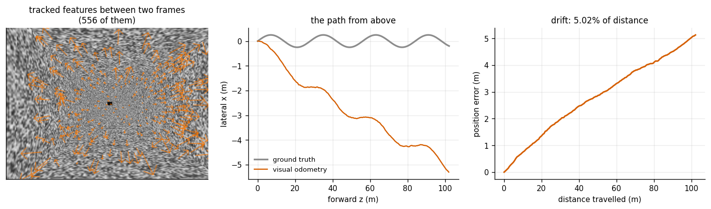
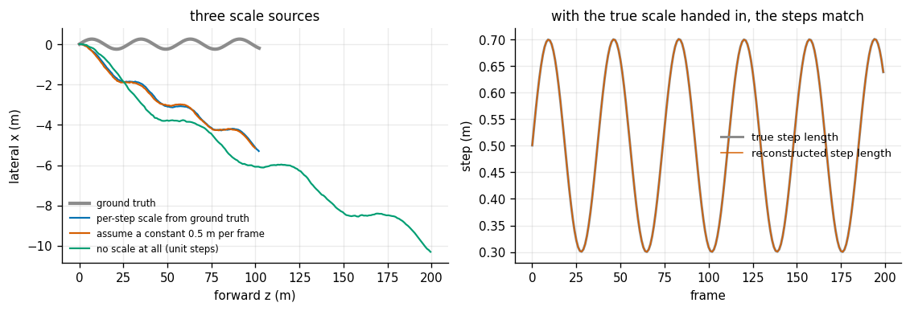
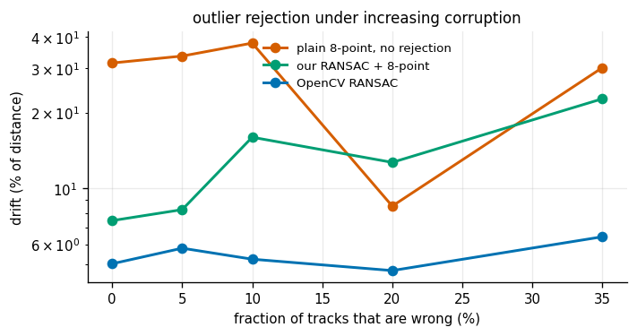
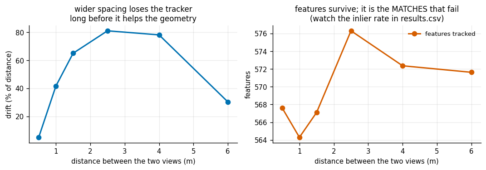
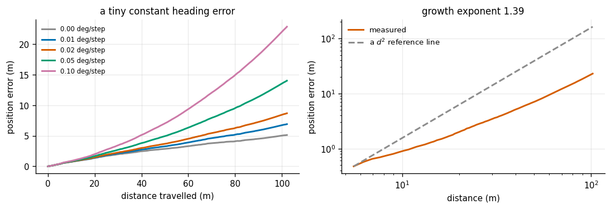

# Visual Odometry

## Key Insight

[Visual odometry (VO)](/shared/glossary/#visual-odometry) estimates how a camera moved through the world using nothing but its own video, by tracking [features](/shared/glossary/#feature) — distinctive corners and textures — from frame to frame and back-solving the camera motion that explains how they shifted. Because each step's motion is measured relative to the previous frame, small errors compound into [drift](/shared/glossary/#drift): travel 100 meters and your estimated path may be off by several, even though every single step looked accurate. This is why reporting drift over a fixed distance is the standard scorecard, and why a full [SLAM](/shared/glossary/#slam) system adds [loop closure](/shared/glossary/#loop-closure) — recognizing a previously visited place — to snap the accumulated error back down.

**This is project 20.** It drives a camera 102 metres down a textured corridor rendered with project [16](../16-camera-calibration/README.md)'s renderer, and measures a drift of **5.0%** — five metres out after a hundred travelled, from a front end where every single step looked fine.

Two things make this project worth doing rather than reading about. First, a monocular camera **cannot measure distance at all** — not badly, not approximately, at all — and seeing what happens without an external scale is more convincing than being told. Second, throwing away bad matches is worth **6×**, and that is measured against a solver written here rather than asserted.

---

## Files

| file | what it is |
|---|---|
| `vo.py` | the corridor, the trajectory, feature tracking, the eight-point algorithm, RANSAC, pose accumulation |
| `run.py` | the six experiments |
| `outputs/` | figures and `results.csv` |

```bash
python3 run.py       # about 9 minutes (most of it rendering 201 frames)
```

---

## The pipeline, and the word to watch

```
   frame k, frame k+1
        │
        ▼
   track features                cv2.goodFeaturesToTrack + Lucas-Kanade flow
        │
        ▼
   essential matrix E            the geometry that explains how they shifted
        │
        ▼
   R and a UNIT t                <-- UNIT.  Direction only.  No distance.
        │
        ▼
   multiply into the running pose
```

**The word is UNIT.** From two images of a rigid scene you can recover which way the camera turned and which *direction* it moved, but not how far. A camera that moves 1 m through a room and one that moves 2 m through a room twice as large produce pixel-for-pixel identical images. This is not a limitation of the algorithm; the information is not in the pictures.

Three names decoded, since each says what it does:

- **Odometry** — from the Greek *hodos* (road) + *metron* (measure): measuring distance travelled. A car's odometer counts wheel turns; visual odometry counts image changes. Both are *incremental*, which is exactly why both drift.
- **Essential matrix** — the 3×3 matrix `E` that encodes the epipolar constraint: a point seen in one image must lie on a particular *line* in the other, and that line depends only on how the camera moved. It is "essential" in the sense of "containing only the essentials": all the calibration has been divided out, leaving pure motion.
- **RANSAC** — RANdom SAmple Consensus (Fischler and Bolles, 1981). Fit the model to a small random subset, count how many of *all* the points agree, repeat, keep the model with the biggest agreeing set. The insight is counter-intuitive and worth stating plainly: instead of trying to down-weight the bad data, you repeatedly *gamble* that a small random sample missed it entirely — and with enough tries, one sample will.

---

## 1. The front end over 102 metres



| | value |
|---|---|
| distance travelled | 102.2 m |
| final position error | **5.13 m** |
| **drift** | **5.02% of distance** |
| final rotation error | 3.41° |
| features tracked per frame | 568 |
| inlier rate | 68.8% |
| runtime for 201 frames | 8.2 s |

Five percent is poor by the standards of a published VO system (1-2% is normal on KITTI) and completely representative of a *bare front end*. What is missing is everything that comes after: no windowed [bundle adjustment](/shared/glossary/#bundle-adjustment) re-optimizing the last few [keyframes](/shared/glossary/#keyframe) together, no map of persistent 3D points to match against, no [loop closure](/shared/glossary/#loop-closure). Each step here is estimated from exactly two frames and then never revisited, and every error is permanent. That is the honest baseline the rest of Phase 4 improves on.

The corridor's camera weaves gently and varies its speed between 0.3 and 0.7 m per frame. Both are deliberate: with no rotation the rotation half of the estimate is never exercised, and with constant speed the next experiment would prove nothing.

---

## 2. Where the scale comes from

Identical estimated rotations and translation *directions*; only the step length differs:



| scale source | drift |
|---|---|
| per-step scale from ground truth | 5.02% |
| assume a constant 0.5 m per frame | 5.39% |
| **no scale at all (every step counted as 1 unit)** | **95.8%** |

The last row is the point. With no external scale the reconstructed path is the right *shape* and completely the wrong size — the trajectory runs 200 units down a corridor that is 102 metres long, and no amount of better tracking would fix it.

The middle row deserves a caveat rather than a victory lap. Assuming a constant 0.5 m per frame barely hurt (5.39% vs 5.02%) — but only because our speed variation is a symmetric wobble around 0.5 m that averages out over 200 frames. The errors cancel. Give the same assumption a robot that is genuinely 10% slower than you thought, and you get a 10% error in every single step, all in the same direction, and a 10% drift with no cancellation anywhere. **A constant-speed assumption is not a scale source; it is a bet that your errors are symmetric.**

Real systems get scale from outside the images:

- a **stereo** rig — the baseline is a measured distance ([project 18](../18-stereo-depth/README.md))
- an **IMU** — accelerations integrate to metres ([project 21](../21-imu-integration/README.md)), which is exactly what visual-inertial odometry is for
- **wheel odometry**, a known camera height above a known ground plane, or an object of known size in view (a tag, [project 17](../17-apriltag-pose/README.md))

---

## 3. Outlier rejection is worth six times

The tracker produces bad matches all by itself — a feature slides onto a different surface, a repeated texture matches the wrong copy. On top of that we deliberately scrambled a fraction of the tracks:



| tracks deliberately wrong | plain 8-point, no rejection | our RANSAC + 8-point | OpenCV RANSAC |
|---|---|---|---|
| 0% | **31.5%** | 7.5% | **5.0%** |
| 5% | 33.6% | 8.2% | 5.8% |
| 10% | 37.8% | 16.0% | 5.2% |
| 20% | 8.5% | 12.7% | 4.7% |
| 35% | 30.2% | 22.7% | 6.4% |

Read the **0% row first**: with no injected outliers at all, refusing to reject anything gives 31.5% drift against 5.0%. A factor of six, entirely from bad tracks the pipeline generated on its own. Least-squares fitting has no defence — a single wildly wrong correspondence contributes as much to the squared error as a hundred good ones, so the fit bends to accommodate it. (The same fragility, and the same fix, as project [19](../19-icp-registration/README.md)'s trimming.)

Our from-scratch RANSAC recovers most of that gap and OpenCV's closes it. **Our implementation is honestly worse**, and the reason is instructive: ours runs a fixed 200 random samples with a fixed inlier threshold, while OpenCV adapts the number of iterations to the inlier rate it is observing and uses a better-conditioned solver internally. The gap widens as the corruption grows (22.7% vs 6.4% at 35% outliers), because a fixed iteration budget becomes exponentially less likely to find a clean sample as the outlier rate climbs. Writing it yourself is how you learn what those parameters do; shipping it yourself is usually a mistake.

The 8-point algorithm itself is worth two lines of explanation. Each correspondence gives one linear equation in the nine entries of `E`, so eight of them pin it down up to scale, and the answer is the smallest singular vector of the stacked equations. Two details in `vo.py` are not optional: work in **normalized** image coordinates (undo `K` and the lens distortion first, or the numbers span six orders of magnitude and the answer is round-off), and afterwards **force the result to be a legal essential matrix** by pushing its singular values to `(s, s, 0)`.

---

## 4. Keyframe spacing, and what it actually tests

| frames skipped | distance between views | drift | rotation error |
|---|---|---|---|
| 1 | 0.5 m | **5.0%** | 3.4° |
| 2 | 1.0 m | 41.6% | 58.1° |
| 3 | 1.5 m | 65.0% | 39.7° |
| 5 | 2.5 m | 81.0% | 4.5° |
| 8 | 4.0 m | 78.1% | 26.8° |
| 12 | 6.0 m | 30.3% | 11.0° |



There is a well-known tension here: two views taken very close together give a poorly-determined essential matrix (with almost no baseline, almost any translation direction fits), so *some* separation is better than none. That tension is real, and it does not show up in this table at all — the closest spacing simply wins and everything else collapses.

The reason is that a different stage becomes the binding constraint first. Lucas-Kanade optical flow assumes a feature's neighbourhood only *shifts* between frames; over six metres of a corridor it does not shift, it changes shape, scale and lighting. The tracker keeps returning points — the feature counts barely move — but the *matches* are wrong, and the inlier rate falls from 69% to under 20%. **The experiment measures the tracker, not the geometry.**

This is why real systems decouple the two: track *every* frame (small motion, reliable flow) but only insert a **keyframe** — a frame that is kept and optimized against — when the accumulated baseline is large enough to make the geometry well conditioned. You get short-baseline tracking and long-baseline triangulation at the same time, instead of having to choose.

---

## 5. Drift is a rotation problem

A small, constant heading error added to every step:



| yaw error added per step | final rotation error | drift |
|---|---|---|
| 0.00° | 3.4° | 5.02% |
| 0.01° | 5.3° | 6.77% |
| 0.02° | 7.3° | 8.51% |
| 0.05° | 13.3° | 13.7% |
| 0.10° | 23.2° | 22.4% |

A hundredth of a degree per step — a rounding error, three hundred times smaller than the tracker's own noise — costs 1.7 extra metres over 100 m.

The reason is structural, and it is why rotation and translation errors are not comparable. A translation error is added once and stays that size. A **rotation** error is applied to *everything that comes after it*: get the heading wrong by 0.1° and every subsequent metre of travel is aimed 0.1° off, so the sideways error is the sum of a growing series. The position error therefore grows faster than the distance travelled — the fitted growth exponent here is **1.43**, between linear and the quadratic that a pure heading bias alone would give (the baseline's own drift, which grows more slowly, is mixed in).

Practically: if you can get heading from anywhere else — a magnetometer, a gravity vector, a vanishing point, a previously mapped landmark — it is worth more than any improvement to the translation estimate.

---

## 6. How many features, and how much a single drift number is worth

| corners requested | features tracked | drift |
|---|---|---|
| 40 | 39 | 3.94% |
| 80 | 79 | 3.44% |
| 150 | 147 | 4.46% |
| 300 | 291 | 6.52% |
| 600 | 568 | 5.02% |
| 1200 | 1055 | 3.75% |

There is no trend. Forty features do as well as twelve hundred, and the ordering shuffles if you change the seed.

That is a result, and a more useful one than a curve would have been. Everything from 40 features upward is far past the eight that the geometry needs, so the drift is set by other things — which features happened to be tracked well, which frames happened to have a good inlier set — and **the spread across these six runs, 3.4% to 6.5%, is the run-to-run noise of the whole pipeline.** Any VO change that claims to improve drift from 5.0% to 4.5% on one sequence has measured nothing. Before tuning, measure your own noise floor; here it is about ±1.5 percentage points, and no honest comparison can be finer than that.

---

## What to take away

1. **A monocular camera has no scale.** Not poor scale — none. Without an external source the trajectory is the right shape and an arbitrary size (95.8% drift).
2. **Reject outliers or nothing else matters.** Six times the drift, from bad tracks the pipeline made itself, before any were injected.
3. **Drift is dominated by rotation error**, because heading errors are applied to everything after them. 0.01°/step cost 1.7 m over 100 m.
4. **Small tracking steps, large keyframe baselines.** They are separate decisions; conflating them makes the tracker the bottleneck.
5. **Measure your noise floor before you tune.** Six configurations that should differ gave a 3.4-6.5% spread with no trend.
6. **A bare front end drifts.** Everything that gets real systems to 1-2% — windowed optimization, a persistent map, loop closure — is about *revisiting* estimates instead of committing to them. That is Phase 4.

Project [28](../28-vio-mvp/README.md) fuses this with the IMU of project [21](../21-imu-integration/README.md), which supplies exactly what is missing here: metric scale and a gravity direction.
