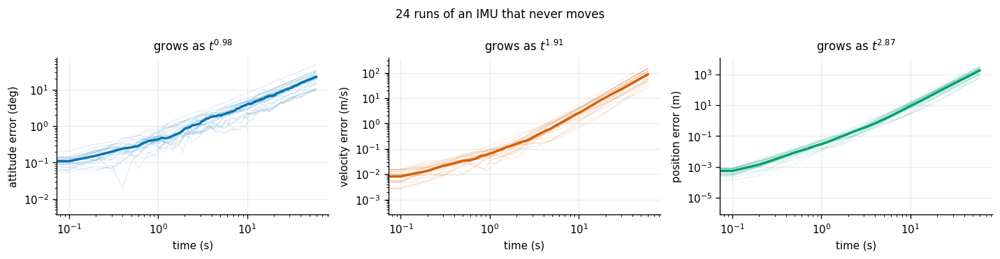
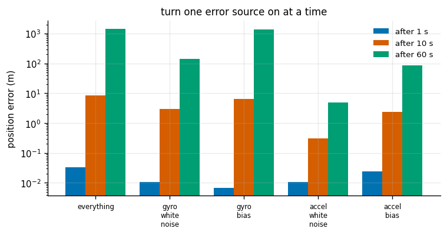
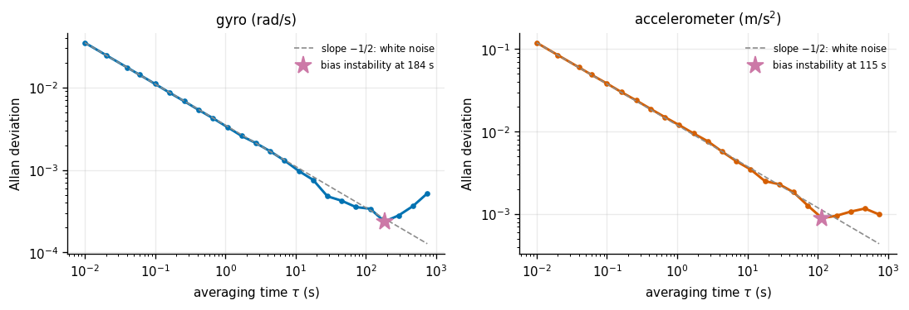
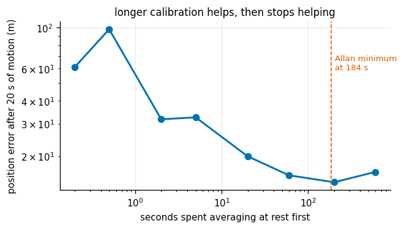
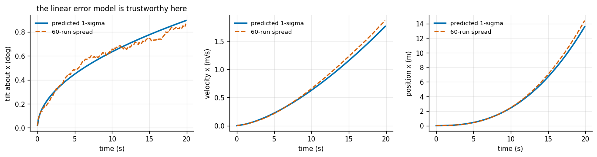

# IMU Integration

## Key Insight

An [IMU](/shared/glossary/#imu) reports motion, not position: its [accelerometer](/shared/glossary/#accelerometer) measures acceleration and its [gyroscope](/shared/glossary/#gyroscope) measures rotation rate, both hundreds of times a second. To recover orientation and position you must sum those rates over time — a process called [dead reckoning](/shared/glossary/#dead-reckoning) — but every reading carries a tiny bias, and the summation piles those biases up relentlessly. Fusing these inputs via direct integration causes errors to compound quadratically over time, whereas an error-[state](/shared/glossary/#state) formulation tracks the small deviations from a nominal trajectory, making the integration far more robust to noise and sensor bias. This project highlights how fast this [drift](/shared/glossary/#drift) grows and why error-[state](/shared/glossary/#state) integration is the standard choice for high-accuracy [state](/shared/glossary/#state) estimation.

**This is project 21.** It is the only project in Phase 3 with no camera in it, and it is the one that explains why every other sensor in the phase exists. On a desk, doing nothing at all, this IMU's position estimate is off by **1.2 metres after 5 seconds** and **1.8 kilometres after a minute**.

---

## Files

| file | what it is |
|---|---|
| `imu.py` | the sensor and its error model, quaternion helpers, strapdown integration, Allan deviation |
| `run.py` | the seven experiments |
| `outputs/` | figures and `results.csv` |

```bash
python3 run.py       # about 55 seconds, NumPy and Matplotlib only
```

---

## What an IMU actually measures, and the trap in the word "acceleration"

```
   gyroscope     ->  angular velocity  (rad/s)  in the SENSOR's own frame
   accelerometer ->  specific force    (m/s^2)  in the SENSOR's own frame
```

**Specific force** is the phrase that trips everyone up. An accelerometer at rest on a desk does *not* read zero. It reads 9.81 m/s² pointing up. It is measuring the force the desk applies to hold the sensor up, not the sensor's acceleration through space. Drop it and it reads zero all the way down.

So the first job of strapdown integration is to subtract gravity — and to subtract gravity you must know which way is down, which is what the gyroscope integration is for:

```
   gyro  ──►  integrate  ──►  attitude  ──┐
                                          │  (which way is down?)
                                          ▼
   accel ─────────────────────────────► subtract gravity ──► integrate ──► velocity ──► integrate ──► position
```

**That arrow from attitude into the gravity subtraction is the single most important fact in the whole project.** An attitude error does not just make your orientation wrong; it leaks gravity — a 9.81 m/s² signal — into your horizontal acceleration. Experiment 2 measures exactly how expensive that is.

> **Why "strapdown"?** Early inertial navigation systems mounted the sensors on a motor-driven gimbal that physically held them level, so the accelerometers always pointed along known axes and no attitude maths was needed. A *strapdown* system bolts the sensors straight to the vehicle and does the levelling in software. Cheaper, lighter, and it moved the whole problem into code — which is where we are now.

---

## 1. Sitting perfectly still

Twenty-four runs of an IMU that never moves. The IMU is a plausible consumer MEMS part (the sort in a phone or a small drone) at 100 Hz.



| time | attitude error | velocity error | position error |
|---|---|---|---|
| 1 s | 0.43° | 0.065 m/s | 0.03 m |
| 2 s | 0.87° | 0.157 m/s | 0.14 m |
| 5 s | 2.00° | 0.670 m/s | **1.21 m** |
| 10 s | 3.95° | 2.611 m/s | **8.79 m** |
| 30 s | 10.95° | 22.5 m/s | 232 m |
| 60 s | 22.6° | 87.0 m/s | **1800 m** |

Fitted growth exponents: attitude **t^0.98**, velocity **t^1.91**, position **t^2.87**.

Read those three exponents together, because they are the whole story of dead reckoning:

- **Attitude grows as t¹** — linearly. A constant gyro bias, integrated, gives an angle that grows in direct proportion to time. (Pure random noise would grow as t^0.5; after the first second or so the bias has overtaken it.)
- **Velocity grows as t²** — one power from integrating acceleration, one more because the *tilt* causing the leaked gravity is itself growing linearly.
- **Position grows as t³** — one more integration on top.

A cubic is unforgiving. Doubling the time multiplies the position error by eight. This is why nobody navigates by IMU alone for more than a few seconds, and why a Phase 4 filter fuses it with something that has no drift at all — a camera, a [LiDAR](/shared/glossary/#lidar), a GPS, a wheel encoder.

The flip side, and the reason IMUs are on every robot anyway: **at short horizons it is excellent.** Over 100 ms it is off by a fraction of a millimetre. An IMU is the perfect thing to fill the gaps *between* camera frames, and the perfect thing to tell you what happened during the 30 ms your vision pipeline was busy.

---

## 2. Which error source actually kills you

Median position error, with exactly one error source enabled at a time:



| error source alone | after 1 s | after 10 s | after 60 s |
|---|---|---|---|
| everything | 32.7 mm | 8.58 m | 1448 m |
| **gyro** white noise | 10.9 mm | 3.00 m | 142 m |
| **gyro** bias | 6.8 mm | 6.56 m | **1401 m** |
| **accelerometer** white noise | 10.7 mm | 0.30 m | 5 m |
| **accelerometer** bias | 24.7 mm | 2.43 m | 87 m |

At one second the accelerometer bias is the biggest single contributor. At sixty seconds the **gyroscope** bias is 16× larger than it and accounts for essentially the whole error.

This is genuinely counter-intuitive: the gyroscope has nothing to do with position. It measures rotation. Yet it dominates the *position* error — because of the arrow in the diagram above. A gyro bias tilts your idea of "down", and a tilted "down" means gravity is no longer fully subtracted.

Measured directly, with every sensor noise switched off and only a fixed initial tilt:

| tilt error | gravity leaked into horizontal acceleration | position error after 10 s |
|---|---|---|
| 0.05° | 0.0086 m/s² | 0.42 m |
| **0.1°** | **0.0171 m/s²** | **0.84 m** |
| 0.5° | 0.0856 m/s² | 4.20 m |
| 1.0° | 0.1712 m/s² | 8.41 m |

**One tenth of one degree of tilt error costs 84 centimetres in ten seconds.** Nothing about the accelerometer went wrong; the number it produced was simply interpreted in a frame that was a tenth of a degree off.

The practical consequences follow directly:

- Money spent on a better **gyroscope** buys more than money spent on a better accelerometer.
- Anything that pins down "which way is down" is enormously valuable. When the sensor is not accelerating, the accelerometer itself measures gravity and can correct the tilt — which is exactly what an attitude filter (Phase 4) does.
- Tilt error is only weakly observable from the accelerometer while you are accelerating, which is why IMU errors get worse precisely when the robot is doing something interesting.

---

## 3. Reading a sensor's real noise off the Allan deviation

You cannot use the model in experiment 2 without numbers, and datasheets are optimistic. The standard way to measure them is the **Allan deviation**, named after David Allan, who introduced it in 1966 to characterize atomic clocks.

The recipe: leave the sensor still for a long time, chop the log into blocks of length τ, average each block, and measure how much *neighbouring* block-averages differ. Plot that against τ on log-log axes and each noise type appears as its own straight line:

| slope | what it means | what averaging longer does |
|---|---|---|
| **−1/2** | white noise | helps — averages away as expected |
| **0** (flat) | bias instability | stops helping |
| **+1/2** | bias random walk | actively hurts |



From a 50-minute static log:

| sensor | true white-noise density | read off the curve at τ = 1 s | flat part (bias instability) | τ at the minimum |
|---|---|---|---|---|
| gyro | 0.00350 rad/s/√Hz | **0.00343** | 0.000237 rad/s | 184 s |
| accelerometer | 0.01200 m/s²/√Hz | **0.01240** | 0.000892 m/s² | 116 s |

The recovered densities are within 2-3% of the truth. That is the point of the technique: two numbers you need for any filter, read straight off a plot of data you can take while making coffee.

Notice the units of the white-noise density: **rad/s per √Hz**. That "per root hertz" is not decoration. It says the noise is specified as a *spectral density*, so the amount you see in one sample depends on how fast you sample: σ_sample = density / √dt. Sample twice as fast and each sample is √2 noisier — but you get twice as many, and the two effects cancel exactly. Which is why sampling faster does not reduce IMU drift.

---

## 4. Calibrating the bias by averaging at rest — and the point where it backfires

If a constant bias is the main enemy, measure it: hold the sensor still, average the readings, subtract. How long should you hold it still?



| seconds spent averaging first | position error after 20 s of dead reckoning |
|---|---|
| 0 (no calibration) | 61.0 m |
| **0.5** | **97.9 m — worse than not calibrating** |
| 2 | 31.8 m |
| 5 | 32.6 m |
| 20 | 20.0 m |
| 60 | 15.8 m |
| 200 | 14.5 m |
| 600 | 16.5 m |

Three things to read here.

**A short calibration makes things worse.** Half a second of averaging is 50 samples; the average of 50 noisy readings has a spread of 0.035/√50 ≈ 0.0049 rad/s, which is *larger* than the 0.004 rad/s bias you were trying to remove. You have replaced a bias you did not know with a noisier estimate of it. The crossover is at about 0.8 s. If you are going to calibrate, calibrate properly.

**Longer helps, then stops.** From 60 s to 200 s the improvement is almost nothing, and at 600 s it is slightly *worse*. The dashed line in the figure marks the minimum of the Allan deviation curve, at 184 s: that is the averaging time past which the bias's own wandering outgrows the benefit of averaging more, and the Allan plot from experiment 3 predicted it before we ran this experiment at all.

**Even a perfect calibration leaves 14 m of error after 20 seconds.** Because what remains is not bias — it is the gyro's white noise integrating into a random-walk tilt of about 0.9° after 20 s, which leaks gravity exactly as experiment 2 described. **Calibration removes the part of the error that is constant, and cannot touch the part that is random.** For that you need an external measurement.

---

## 5. How you integrate the rotation

Three ways to advance the attitude by one sample:

- **`exp`** — rotate by the exponential map of ω·dt. Exact if the rotation rate is constant over the step.
- **`euler`** — the small-angle shortcut, `R ← R (I + [ω]× dt)`. One matrix multiply, no trigonometry.
- **`euler_orth`** — the same shortcut, snapped back to the nearest true rotation after each step.

Rotating about an axis that is itself turning ("coning" motion, and the case a hand-held or leg-mounted sensor is always in), for 4 seconds:

| rotation rate | sample rate | `exp` | `euler_orth` | `euler` | how far `euler` drifted from being a rotation at all |
|---|---|---|---|---|---|
| 30 °/s | 400 Hz | 0.063° | 0.063° | 0.063° | 0.003 |
| 30 °/s | 100 Hz | 0.254° | 0.254° | 0.254° | 0.014 |
| 30 °/s | 25 Hz | 1.015° | 1.015° | 1.015° | 0.057 |
| 180 °/s | 100 Hz | 0.594° | 0.645° | 0.651° | 0.68 |
| 180 °/s | 25 Hz | 2.383° | 4.638° | 4.844° | 5.18 |
| 720 °/s | 400 Hz | **0.147°** | 1.080° | 1.090° | 6.36 |
| 720 °/s | 100 Hz | **0.591°** | 16.97° | 17.10° | 1219 |
| 720 °/s | 25 Hz | **2.479°** | 124.0° | 122.3° | 4 × 10¹⁰ |

At gentle rates all three agree exactly and the shortcut is free. At 720 °/s — a fast wrist flick, a tumbling drone, a kicked leg — the shortcut is wrong by **17 degrees at 100 Hz** where the exponential map is wrong by 0.6.

The last column is the failure that is easy to miss. `R (I + [ω]× dt)` is not a rotation matrix; it is a rotation matrix plus a small error, and errors accumulate multiplicatively. After 100 samples at 720 °/s the "attitude" is no longer orthogonal by a factor of 1219, which means it is stretching and shearing the world as well as rotating it. Any code downstream that assumes `Rᵀ = R⁻¹` — and almost all code does — is now silently wrong. **If you use the shortcut, re-orthonormalize (or use a quaternion, which stays valid by construction after a cheap re-normalization).**

Note also that even the exact-per-sample `exp` still carries error (2.48° at 25 Hz), and that error grows in proportion to dt. That residual is the true **coning error**: within one sample interval the rotation axis itself moved, and no single-rotation update can represent that. It is why high-end systems sample the gyro far faster than they run the rest of the navigation loop.

---

## 6. Zero-velocity updates

Sixty seconds of a still IMU, with the velocity forced back to zero at intervals:

| velocity reset every | position error after 60 s |
|---|---|
| never | **1554 m** |
| 10 s | 355 m |
| 2 s | 74 m |
| 1 s | 37 m |
| 0.5 s | **18.8 m** |

A factor of **83** from information that costs nothing: knowing the sensor is not moving.

A **ZUPT** (Zero-velocity UPdaTe) is legitimate whenever you *know* the velocity is zero — a foot flat on the ground during a footstep, a vehicle stopped at a light, a robot arm between motions. It is the cheapest correction in inertial navigation and it is why foot-mounted pedestrian trackers work at all: a walking human's foot is stationary for a good fraction of every step, and each of those moments resets the velocity error before it can integrate into position.

Note what it does not fix. Resetting the velocity does nothing to the attitude error, so the tilt keeps growing and the leaked gravity keeps arriving; the ZUPT just stops it accumulating for long. That is why the error still reaches 18.8 m at the fastest reset rate, and why a real system pairs ZUPTs with an attitude correction.

---

## 7. Does the error-state model tell the truth?

The Key Insight promises that an **error-state** formulation is the way to handle this. Here is what that means and whether it works.

Instead of tracking the position and its uncertainty directly (badly non-linear, because rotations are), you track the *small deviation* from your current best guess. Small deviations obey a linear equation, and for a level static sensor it is short enough to read:

```
   d(δθ)/dt  =  -n_gyro                      tilt error is the integral of gyro noise
   d(δv)/dt  =  -[f ×] δθ  +  n_accel        <- THE COUPLING: tilt error times
                                                specific force f (= 9.81 m/s^2)
   d(δp)/dt  =  δv
```

That `-[f ×] δθ` block is the gravity leak of experiment 2, written as one term of a matrix. Propagating the covariance `P ← Φ P Φᵀ + Q dt` through it predicts the whole error cascade in advance.

Comparing the predicted one-sigma against the actual spread of 60 independent runs:



| time | tilt predicted | tilt measured | position predicted | position measured |
|---|---|---|---|---|
| 1 s | 0.2015° | 0.1840° | 0.0104 m | 0.0116 m |
| 5 s | 0.4489° | 0.4853° | 0.4361 m | 0.4182 m |
| 10 s | 0.6345° | 0.6575° | 2.4377 m | 2.4794 m |
| 20 s | 0.8948° | 0.8688° | 13.577 m | 14.427 m |

Agreement within a few percent over twenty seconds and three orders of magnitude of position error. **The linearized model is trustworthy here**, which is exactly why a Phase 4 filter can use it: the filter needs to know how much to trust the IMU relative to the camera, and this is where that number comes from.

> **One trap in checking this.** The first version compared the predicted per-axis sigma against the spread of the *length* of the error vector, and the model looked 60% pessimistic. Those are different quantities: a 3-vector whose components each have spread σ has an average length of about 1.6σ. Compare like with like — per axis against per axis.

---

## What to take away

1. **An IMU is a short-horizon sensor.** Attitude error grows as t, velocity as t², position as t³. Excellent over 0.1 s, useless over 100 s. Everything else in Phase 3 exists to supply the drift-free measurement that keeps it honest.
2. **The gyroscope drives the position error, not the accelerometer.** 0.1° of tilt leaks 0.017 m/s² of gravity and costs 84 cm in ten seconds. Spend on the gyro.
3. **Measure your sensor with an Allan deviation plot.** It takes an hour of sitting still and gives you the two numbers every filter needs — to within 3% here.
4. **Calibrate the bias properly or not at all.** Half a second of averaging was *worse than nothing*; the Allan minimum tells you where to stop.
5. **Do not use the small-angle shortcut on a fast-rotating sensor**, and if you do, re-orthonormalize. At 720 °/s and 100 Hz it was 29× worse than the exponential map, and the matrix stopped being a rotation.
6. **Free constraints are worth a great deal.** Knowing "it is stationary right now" cut 60-second drift by 83×.
7. **The error-state covariance is accurate enough to trust**, which is what makes principled fusion in Phase 4 possible.

Project [28](../28-vio-mvp/README.md) in Phase 4 puts this IMU together with the visual odometry of project [20](../20-visual-odometry/README.md), where each one covers exactly the other's weakness: the camera has no drift but needs texture and time, and the IMU has neither problem for a tenth of a second at a stretch.
