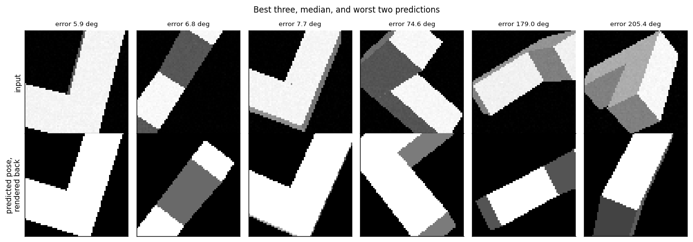
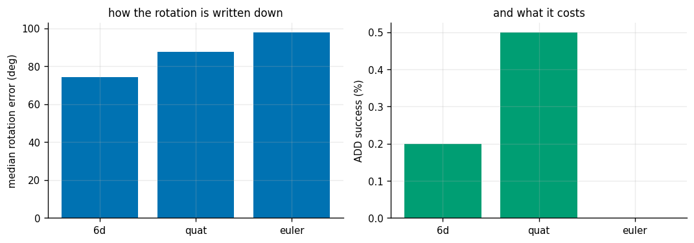
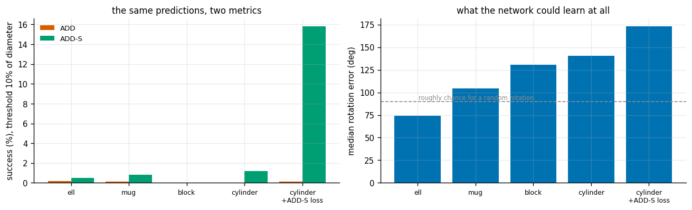
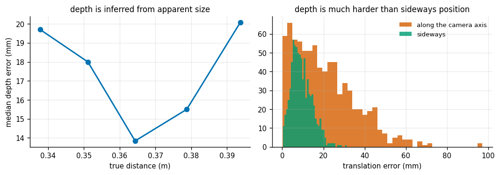

# Object 6-DoF Pose

## Key Insight

Knowing an object is "a mug" is not enough to grasp it — the robot needs its full [6-DoF pose](/shared/glossary/#6-dof-pose): where it sits and how it is turned. [6-DoF pose estimation](/shared/glossary/#6-dof-pose-estimation) trains a network to predict that pose directly from an image or [point cloud](/shared/glossary/#point-cloud), and fine-tuning it on your own small object set is far cheaper than gathering enough data to train one from scratch. Success is scored with [ADD-S](/shared/glossary/#add-s), the average 3D distance between the object's points under the predicted pose versus the true pose — computed with a nearest-point match so that symmetric objects (a featureless cylinder looks identical when flipped) are not unfairly penalized for a "wrong" rotation that is actually indistinguishable.

**This is project 22.** It is the first project in Phase 3 where the answer comes from a network rather than from geometry, and the most important thing it produces is a *comparison* with the geometric methods that came before it.

Two results define the project. First, **direct pose regression is much harder than it looks**: a from-scratch network on a CPU-sized budget only reaches 74° of median rotation error against a do-nothing control's 85°, while project [17](../17-apriltag-pose/README.md) solved the same kind of problem geometrically to **0.3°** — two hundred times better. Second, **the metric decides what "success" means**: training a symmetric object with a symmetry-aware loss multiplies its ADD-S success rate by **13×** while making its reported rotation error *worse*, and both facts are correct at the same time.

---

## Files

| file | what it is |
|---|---|
| `mesh.py` | four procedural objects, a z-buffer triangle rasterizer, and the ADD / ADD-S metrics |
| `run.py` | the six experiments (dataset, network, training, evaluation) |
| `data/` | the rendered dataset cache (gitignored; rebuilt in ~25 s per object) |
| `outputs/` | figures and `results.csv` |

```bash
python3 run.py       # about 11 minutes on a CPU; PyTorch, NumPy, Matplotlib
```

---

## The four objects, chosen for their symmetry

Everything in this project turns on one question: **how many different rotations of this object produce the same picture?**

| object | indistinguishable poses | consequence |
|---|---|---|
| **L-shape** | 1 (none) | the pose is fully determined by the image |
| **mug** (cylinder + handle) | 1 when the handle is visible | determined — but only some of the time |
| **box** (three different side lengths) | **4** | turn it 180° about any of its three axes and it looks identical |
| **cylinder** | **infinitely many** | rotation about its own axis is never observable |

The box is the one that surprises people. "A box is not symmetric, its sides are all different lengths" — but a 180° turn about any principal axis maps the box exactly onto itself, so a rectangular box has four indistinguishable poses no matter how unequal its sides are. Building an object with *no* symmetry at all took a deliberate effort: the L-shape is two boxes glued at right angles precisely so that nothing maps it onto itself.

> **Why this matters before any training happens.** A network trained to predict *one* rotation with a squared-error loss, shown an object with four equally valid answers, is being asked to output the average of the four. For a box those four rotation matrices average to the **zero matrix** — which carries no orientation at all. The loss cannot go below chance, and the network is not broken; it has correctly solved an impossible problem. Experiment 3 measures exactly this.

---

## What "ADD" and "ADD-S" measure, and why not degrees

**ADD — Average Distance of model points.** Take the object's own 3D points, move them by the predicted pose and by the true pose, and average how far apart the two copies end up.

This answers the question the robot actually asks — *how far off is the object's surface?* — instead of mixing degrees and millimetres into one meaningless score. A 5° error on a coin is nothing; a 5° error on a metre-long bar moves its end by 9 cm.

**ADD-S** is the same, with each predicted point matched to its **nearest** true point instead of to its counterpart. The "S" is for Symmetric. A featureless cylinder rotated 90° about its axis is *the same object in the same place*; plain ADD compares point *i* with point *i* and calls that a large error. ADD-S compares point *i* with whichever point is closest, so an indistinguishable rotation scores zero — the honest answer.

The usual success threshold is **ADD (or ADD-S) below 10% of the object's diameter**, and that is what the tables below report.

---

## 1. A pose network, against the control that most papers skip

Four thousand rendered views of the L-shape at random orientations, 33-40 cm away; 800 held out. A small CNN (4 strided convolutions, 130k parameters) predicts a rotation and a translation.



| | median rotation error | median ADD | median ADD-S | translation error |
|---|---|---|---|---|
| **control: always predict the average pose** | 85.50° | 64.23 mm | 32.13 mm | 19.52 mm |
| trained network (6D rotation) | **74.22°** | **51.33 mm** | **29.83 mm** | 20.93 mm |

The control is the essential experiment: a model that ignores the image entirely and always outputs the mean of the training poses. Without it, "74° of rotation error" sounds like a number; with it, you can see that the network beat *doing nothing* by 11°, and that its translation is no better than the average.

**This is a poor result, and it is the honest one.** For scale, project [17](../17-apriltag-pose/README.md) recovered pose from four tag corners to 0.3° and 1.4 mm. The difference is not that one method is cleverer — it is that PnP is handed *correspondences* ("this pixel is that 3D corner") while the network has to discover them, from 64×64 silhouettes, with no pretraining, in 35 seconds of CPU time.

That comparison is the real lesson of the project:

> **Geometry with known correspondences beats learned direct regression by orders of magnitude. What learning buys is not accuracy — it is not needing a fiducial marker glued to the object.**

Real 6-DoF pose systems reflect this. Almost none regress the pose directly. They predict *2D keypoints* or *dense correspondences* and then hand those to PnP — putting the learning where correspondences are hard and the geometry where geometry is exact.

> **One design fix worth repeating.** The first version placed the object 30-55 cm away, where it covered about 40 of the 64 pixels and its thin parts were 5 px across. The rotation head then learned *nothing at all* — chance, at every learning rate. Moving the camera in so the object fills the frame was what produced even the modest result above. Real pose networks never see a whole scene either: they run on a **detection crop**, for exactly this reason.

---

## 2. How you write the rotation down

The same network and data, changing only how the three rotational degrees of freedom are represented at the output:



| representation | outputs | median rotation error | ADD |
|---|---|---|---|
| **6D (Gram-Schmidt)** | 6 | **74.22°** | **51.33 mm** |
| quaternion | 4 | 87.58° | 56.18 mm |
| Euler angles | 3 | 97.95° | 57.81 mm |

The ordering is the one the literature reports, and the reason is worth understanding because it is not about capacity — Euler angles have *fewer* numbers to get wrong.

The problem is **discontinuity**. A rotation just past 180° must be written as an angle just past −180°: two nearby rotations, two wildly different outputs. A network's output is a continuous function of its input, so it physically cannot produce that jump; it has to smear across the gap, and everything near the seam is wrong. Quaternions have a milder version of the same disease (`q` and `−q` are the same rotation, so the target is ambiguous).

The **6D** representation avoids it by construction: output two arbitrary 3-vectors, normalize the first, remove its component from the second, and cross them for the third. Every rotation has nearby 6-number representations, with no seams anywhere — so a small change in the image can be matched by a small change in the output.

---

## 3. The symmetry ladder

The same network, the same budget, four objects:



| object | indistinguishable poses | rotation error | ADD | **ADD-S** | ADD-S success |
|---|---|---|---|---|---|
| L-shape | 1 | **74.22°** | 51.33 mm | 29.83 mm | 0.5% |
| mug | 1 (when the handle shows) | 104.20° | 62.39 mm | **22.80 mm** | 0.8% |
| box | 4 | 130.55° | 60.41 mm | 32.93 mm | 0.0% |
| cylinder | ∞ | **140.77°** | 76.16 mm | 26.85 mm | 1.2% |

Rotation error climbs monotonically with the amount of symmetry — 74° → 104° → 131° → 141° — and by the cylinder it is worse than a random guess would be. Nothing about the network changed. The *task* changed: more of the answer became unobservable, and a loss that demands one specific answer got a worse and worse deal.

Look at the ADD and ADD-S columns side by side. For the cylinder, ADD says **76.16 mm** and ADD-S says **26.85 mm** — a factor of 2.8 between two metrics scoring the *identical predictions*. The gap is exactly the part of the error that is a rotation nobody can see.

Splitting the cylinder's error into its two parts makes this concrete:

| | error |
|---|---|
| direction of the cylinder's **axis** (observable) | **44.88°** |
| full rotation including the spin about that axis (partly unobservable) | 140.77° |

The axis is three times better determined than the full rotation, because the axis is the part the image actually shows.

---

## 4. Training with the metric you will be judged by

If ADD-S is the score, train for ADD-S. The **point-matching loss** does that: move the model points by the predicted and true poses and penalize the distance to the *nearest* partner — the training-time version of the metric.

| object | loss | rotation error | ADD | ADD-S | **ADD-S success** |
|---|---|---|---|---|---|
| L-shape | squared error on the matrix | 74.22° | 51.33 mm | 29.83 mm | 0.5% |
| L-shape | point-matching | 121.65° | 72.70 mm | 28.35 mm | 1.6% |
| cylinder | squared error on the matrix | 140.77° | 76.16 mm | 26.85 mm | 1.2% |
| **cylinder** | **point-matching** | **173.03°** | 91.63 mm | **16.64 mm** | **15.8%** |

The cylinder row is the point of the experiment. Switching loss **multiplied the ADD-S success rate by 13** (1.2% → 15.8%) and cut ADD-S error by 38%, while the reported *rotation error* got worse — 141° → 173° — and ADD got worse too.

Nothing contradictory is happening. The point-matching loss stops spending capacity on the spin about the cylinder's axis, because moving that spin does not change the loss. Freed of an impossible sub-task, it gets much better at the part that matters. The rotation error then measures a quantity the model was explicitly told to ignore, and is meaningless.

**The transferable rule: pick the metric first, then choose a loss that is the training-time version of it.** If you report ADD-S for symmetric objects but train against a plain rotation error, you are paying for accuracy you will never be credited with — and, as the cylinder shows, paying for it *out of* the accuracy you will.

(On the L-shape, which has no symmetry, the point-matching loss helps ADD-S slightly and hurts everything else. That is the expected mirror image: when there is nothing to be invariant *to*, invariance is only a loss of signal.)

---

## 5. Occlusion

A random rectangle covering about a quarter of the image, standing in for a hand, a neighbouring object, or the edge of the bin:

| training / test condition | rotation error | ADD | translation error |
|---|---|---|---|
| clean → clean | 74.22° | 51.33 mm | 20.93 mm |
| occluded → occluded (trained on occluded data) | 89.04° | 55.30 mm | 21.72 mm |
| **clean → occluded (the realistic mismatch)** | **102.78°** | **67.84 mm** | **34.45 mm** |

Read the last two rows against each other. Occlusion itself costs about 15° (row 1 → row 2). Being *surprised* by occlusion costs nearly twice that, plus a 65% worse translation (row 2 → row 3).

The fix is free and is what every real pipeline does: **put the corruption in the training data.** The network that had seen occlusion during training handled it far better than the one that had not — not because occluded images are easier, but because it had learned to read the parts of the object that remained.

---

## 6. Where the depth comes from



| | median error |
|---|---|
| sideways (across the image) | **8.68 mm** |
| along the camera axis (depth) | **17.60 mm** (4.88% of the range) |

Depth is twice as hard as sideways position, and the reason is the same one that runs through the whole of Phase 3. Sideways position is read almost directly: the object's centre lands at a pixel, and the pixel maps to a direction. Depth has to be *inferred from apparent size* — the object looks smaller when it is further away — which means the network must know how big the object is and then measure a change in size that shrinks as the distance grows.

This is the single-camera version of project [18](../18-stereo-depth/README.md)'s `Z²` law and project [17](../17-apriltag-pose/README.md)'s size-to-distance coupling: whenever depth comes from apparent size, it is the weakest number you have, and it degrades with range. It is also why depth cameras exist.

---

## What to take away

1. **Always report the do-nothing control.** "74° of error" is uninterpretable until you know that predicting the average pose gives 85°.
2. **Direct pose regression is weak; correspondences are strong.** Project [17](../17-apriltag-pose/README.md) got 0.3° from four known corners. Real pose networks predict keypoints and hand them to PnP rather than regressing pose directly, and this project shows why.
3. **A box has four indistinguishable poses.** Count your object's symmetries *before* choosing a loss — with a squared-error loss on rotations, a symmetric object's optimal prediction can be no orientation at all.
4. **ADD-S is not a softer ADD; it measures a different thing.** On the cylinder the two disagree by 2.8× on identical predictions. Quote which one you mean.
5. **Train against your metric.** The symmetry-aware loss took the cylinder from 1.2% to 15.8% success while making the "rotation error" worse — and that trade is correct.
6. **Train on the corruption you expect.** Being surprised by occlusion cost more than the occlusion itself.
7. **Depth from apparent size is your weakest measurement.** Twice the error of sideways position here, and it gets worse with range.

Project [23](../23-open-vocab-grasping/README.md) closes the phase by skipping pose estimation altogether: for a top-down grasp you do not need to know how an object is turned in 3D, only where to close the fingers — which is a much easier question, and a good illustration of choosing the representation your task actually needs.
