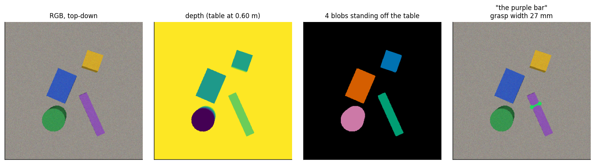
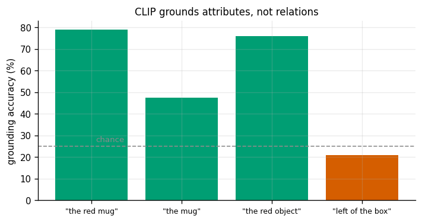
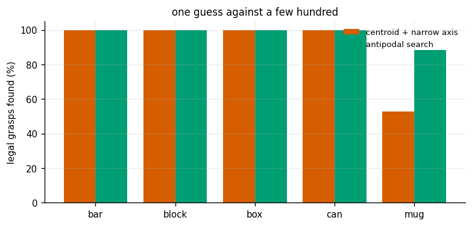

# Open-Vocab Grasping

## Key Insight

Classical grasping needs a 3D model of every object in advance; [open-vocabulary perception](/shared/glossary/#open-vocabulary-perception) removes that limit by letting you name the target in plain language — "the red cup" — and having the system find it without ever being trained on cups specifically. The pipeline pairs a [VLM](/shared/glossary/#vlm) (or [CLIP](/shared/glossary/#clip)-style model) that grounds the phrase to an image region with [SAM (Segment Anything Model)](/shared/glossary/#sam-segment-anything-model), which carves out that object's exact pixels, then fits a simple top-down [antipodal grasp](/shared/glossary/#antipodal-grasp) — two contact points on opposite sides so the [gripper](/shared/glossary/#gripper) can pinch the object. The power here is generalization: the same code grasps a cup, a stapler, or a banana, because nothing in it is hard-coded to a fixed list of objects.

**This is project 23**, the last of Phase 3 and the only one that takes an instruction in English. It runs a **real frozen CLIP ViT-B/32** on rendered tabletops, and it measures each stage of the pipeline separately, so that when the whole thing fails you know which part to blame.

Three results are worth the price of admission. Relational phrases like *"the object to the left of the box"* score **20.8%** — **below the 25% chance rate**, because CLIP has no idea what "left of" means. How you crop the region before showing it to CLIP swings accuracy from **95.8% to 27.4%**, a far bigger effect than any prompt wording. And pushing the objects together until they touch takes the whole system from **76.8% to 0.0%** — which is precisely the gap a real segmentation model like SAM exists to fill.

---

## Files

| file | what it is |
|---|---|
| `tabletop.py` | the scene: coloured objects on a table, rendered top-down with colour and depth |
| `grasp.py` | depth-based segmentation (the stand-in for SAM) and the antipodal grasp search |
| `ground.py` | the frozen CLIP wrapper, the four crop styles, and the caching that makes it fast |
| `run.py` | the six experiments |
| `outputs/` | figures and `results.csv` |

```bash
python3 run.py       # about 30 seconds once CLIP is cached (~600 MB on first run)
```

Object meshes come from project [22](../22-object-6-dof-pose/README.md); the camera model comes from project [16](../16-camera-calibration/README.md).

---

## The pipeline, and what each box is for

```
   "the red mug"                     RGB + depth, looking straight down
        │                                    │
        │                              ┌─────┴─────┐
        │                              │  segment  │  everything standing off the table
        │                              └─────┬─────┘
        │                                    │  N candidate regions
        ▼                                    ▼
   ┌──────────────────────────────────────────────┐
   │  CLIP: which region best matches the phrase? │   <- the only learned part
   └──────────────────────┬───────────────────────┘
                          │  one mask
                          ▼
                 ┌─────────────────┐
                 │ antipodal grasp │   where to close the fingers, and how wide
                 └─────────────────┘
```



Two design choices need justifying, because both look like shortcuts and neither is:

> **Why top-down?** A gripper coming straight down needs only *where* in the image to close and *how* to rotate the wrist — three numbers plus a width, instead of a full 6-DoF pose. That reduction is why "top-down grasping" is the standard first bin-picking system, and it is also a comment on project [22](../22-object-6-dof-pose/README.md): if your task does not need the object's full orientation, do not spend a neural network estimating it.
>
> **Why depth-based segmentation instead of SAM?** SAM's job here is to turn "somewhere around there" into an exact set of pixels. On a tabletop with a depth camera, *geometry already answers that*, and answers it with a metric accuracy an RGB model cannot match — anything standing more than 6 mm off the table plane is an object, and separate blobs are separate objects. What SAM adds is working when the depth blobs **merge**: cluttered, touching, non-tabletop scenes. Experiment 4 measures exactly that limit rather than asserting it.

**CLIP is used frozen, and only for matching.** It was trained to say whether a picture and a caption go together — never to find things, segment them, or grasp them. Everything here is the standard trick for borrowing it anyway: propose regions with something else, crop each one, and ask which crop best matches the phrase. At its simplest, that is all "open-vocabulary detection" is.

---

## 1. What CLIP can and cannot ground

24 random tabletops, 4 objects each, one phrase per object. Chance is 25%.



| phrase | example | accuracy | mean margin over the runner-up |
|---|---|---|---|
| colour + noun | *"the red mug"* | **78.9%** | 0.0295 |
| colour only | *"the red object"* | 75.8% | 0.0240 |
| noun only | *"the mug"* | 47.4% | 0.0099 |
| **relational** | *"the object on the left of the box"* | **20.8%** | — |

Three things to read.

**Colour is doing most of the work.** "The red object" (75.8%) does nearly as well as "the red mug" (78.9%), while "the mug" alone manages 47.4%. At this crop size CLIP is a very good colour detector and a mediocre shape detector — worth knowing before you design an instruction vocabulary around object names.

**Relational phrases score below chance.** Not "poorly" — *below chance*, 20.8% against 25%. CLIP's text encoder pools its tokens into one vector, so "the object to the left of the box" and "the box to the left of the object" land in almost the same place. It has no representation of where things sit relative to each other; it sees roughly a bag of words and matches on whichever noun is most visually salient, which actively steers it toward the wrong region.

This is the honest boundary of the technique, and an easy one to trip over, because relational instructions are exactly what people say to robots. Handling them needs either a model that reasons over layout (a real VLM with the whole image and a grounding head) or a symbolic layer that parses the relation and applies it to the region *positions* — which the segmentation step has already measured for free.

**The margins are tiny.** The best region beats the runner-up by about 0.03 of cosine similarity. CLIP's scores are not probabilities and are not calibrated; a "confidence threshold" tuned on one scene will not transfer. Compare regions *within* a scene, and do not read the absolute number.

---

## 2. How you crop matters more than what you say

The same phrases and the same regions, presented to CLIP four ways:

| crop style | what CLIP sees | accuracy |
|---|---|---|
| **tight** | just the bounding box | **95.8%** |
| **masked** | bounding box, everything outside the mask blanked out | **95.8%** |
| padded | bounding box grown by 35% | 78.9% |
| **highlight** | the whole image with a red box drawn round the region | **27.4%** (chance is 25%) |

And the same phrases through four prompt templates:

| template | accuracy |
|---|---|
| `{}` (bare) | 82.1% |
| `a photo of {}` | 78.9% |
| `a photo of {} on a table` | **83.2%** |
| `a close-up photo of {}, a single object on a plain table` | 80.0% |

**Cropping swings the result by 68 points; wording swings it by 5.** That is the practical message, and it inverts the usual folklore about prompt engineering being where the wins are.

Two rows deserve unpacking.

*The padded crop losing to the tight crop* is the opposite of the standard advice, which says to include context because CLIP was trained on whole photographs. On this tabletop the context **is another object**, so a 35% margin often drags a neighbour into the crop and CLIP obligingly matches the phrase to *that*. The advice is not wrong in general; it is wrong when your scene is dense. Measure it on your own scenes instead of inheriting the default.

*The "highlight" style scoring at chance* is the sharper lesson. Drawing a red box around the target and passing the whole image is a real published technique, and here it does nothing at all — CLIP's global image embedding is dominated by everything in the frame, and a thin rectangle moves it barely more than noise does. A model has to have been *trained* to attend to such a marker for it to mean anything.

*(The remaining experiments use the padded crop, so their grounding numbers carry the 79% figure rather than the 96% a tight crop would have given. That is deliberate: the end-to-end numbers below then show a realistic error budget rather than a best case.)*

---

## 3. Choosing where to close the fingers

A grasp is a pair of **contact points**. Walk outward from a chosen centre along the closing direction until you leave the mask on each side — those are where the fingers touch. Three conditions must then hold:

1. the closing line stays **on the object** (not across a handle's hole);
2. the gap is **no wider than the gripper opens** (75 mm here);
3. the two contact surfaces **face each other** closely enough that friction holds — the **antipodal** condition.

**"Antipodal"** is Greek for "feet opposite", as in *antipodes*, the point on the far side of the Earth: two contacts on opposite sides. Formally, the line joining them must lie inside both **friction cones** — the cone of directions a surface can push in, whose half-angle is `atan(µ)`. That is why a rubber pad grips where polished steel slips: a wider cone forgives a worse-aligned grasp.

> **The trap that top-down depth creates.** The first version of this code took the contact normal from the *visible surface*, which for a top-down camera is the object's **top face** — pointing straight at the camera, perpendicular to every possible closing direction. Every grasp then failed the antipodal test at 50-90°. The side walls the fingers actually squeeze are invisible to the camera and their 3D normals cannot be measured at all. What *is* measurable is the object's **outline**: where the silhouette runs is where the side wall is, and the outline's normal in the image is the side wall's normal in the world. Switching to silhouette normals took every grasp from "impossible" to 0-5°.



Two strategies, over 91 detected objects:

| object | one guess: centroid, closing across the narrow axis | a few hundred candidates: antipodal search |
|---|---|---|
| bar (purple) | 100% | 100% |
| block (yellow) | 100% | 100% |
| box (blue) | 100% | 100% |
| can (green) | 100% | 100% |
| **mug (red)** | **52.9%** | **88.2%** |

For every convex object one guess is enough — the principal-axis grasp is exactly right and takes three lines of code. The mug is the whole point: its handle drags the centroid sideways and stretches the widest axis, so the single guess produces a grasp that is **too wide for the gripper (4 cases)**, runs **through the handle's hole (3 cases)**, or meets the surface at a **bad angle (4 cases)**. Searching over closing angles and offsets finds a grip on the rim instead, recovering most of the gap.

The rule that generalizes: **a one-shot geometric grasp is fine for convex objects and fails on anything with a handle, hook or hole.** Since you cannot tell which you have without looking, search.

---

## 4. End to end, with the blame apportioned

Each stage is scored *given that the previous one succeeded*, so the columns show where failures enter:

| scene | requests | segmentation correct | …and grounded correctly | …and a legal grasp found |
|---|---|---|---|---|
| objects spread out | 95 | 95.8% | 78.9% | **76.8%** |
| **objects pushed together** | 103 | **0.0%** | 0.0% | 0.0% |

On the spread-out tabletop the error budget is clear: segmentation loses 4 points, **grounding loses 17**, and the grasp geometry loses only 2. Language is the weakest link by a wide margin — and, as experiment 2 showed, most of those 17 points are recoverable by cropping differently, before any model is changed.

The second row is a cliff, not a decline. Once the objects touch, the depth blobs merge into one connected component, every "object" the system proposes is really two or three, and nothing downstream can recover. **This is the measurement that justifies SAM.** A segmentation model trained on millions of images separates touching objects using colour, texture and a learned notion of objectness — information geometry alone does not have. Our depth segmenter is a perfectly good stand-in on a tidy table and worth exactly nothing in a cluttered bin, and now that claim has a number attached.

It is also a reminder of how these pipelines fail in practice: not gracefully, but all at once, at the stage nobody was measuring.

---

## What to take away

1. **Frozen CLIP grounds attributes, not relations.** Colour phrases 76-79%; "left of the box" **20.8%, below chance**. Do not build an instruction set around spatial language and expect a matching model to handle it.
2. **The crop is a bigger design decision than the prompt.** 95.8% vs 27.4% across crop styles; 5 points across prompt templates. And check the padding on *your* scenes — here, more context made things worse.
3. **CLIP's scores are relative, not calibrated.** Winning margins of about 0.03: compare regions inside one scene and never threshold the raw number.
4. **A top-down camera cannot see the surfaces the fingers will touch.** Use the silhouette's normal, not the visible surface's.
5. **One-shot geometric grasps work on convex objects and fail on handles.** 100% vs 52.9%, recovered to 88.2% by searching.
6. **Measure each stage separately.** "76.8% end to end" tells you nothing about what to fix; "grounding loses 17 points and geometry loses 2" tells you everything.
7. **Know what your stand-in cannot do.** Depth segmentation is fine on a tidy table and scores 0.0% the moment objects touch — the honest, measured argument for a learned segmentation model.

---

This closes Phase 3. The chain from project [16](../16-camera-calibration/README.md) to here is one long error budget: calibration sets the floor, [17](../17-apriltag-pose/README.md) and [18](../18-stereo-depth/README.md) turn pixels into metres, [19](../19-icp-registration/README.md) aligns what you measured with what you already knew, [20](../20-visual-odometry/README.md) and [21](../21-imu-integration/README.md) track how the sensor itself moved, [22](../22-object-6-dof-pose/README.md) asks a network for what geometry cannot supply, and this project turns the result into something a gripper can execute. Phase 4 takes the same measurements and starts *fusing* them, which is how you stop each one's weakness from becoming the whole system's weakness.
