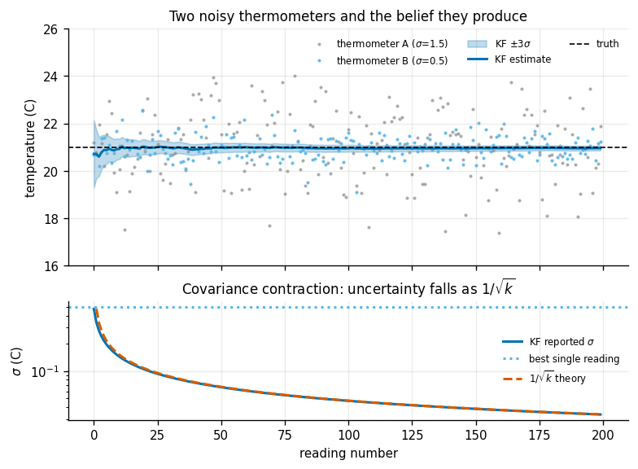
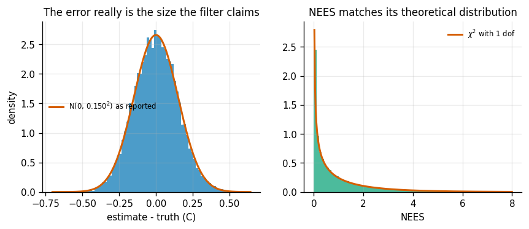
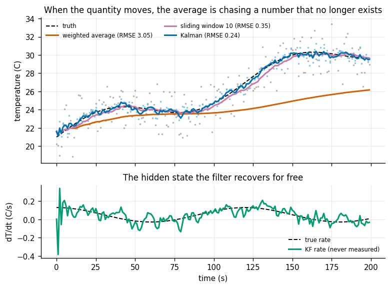
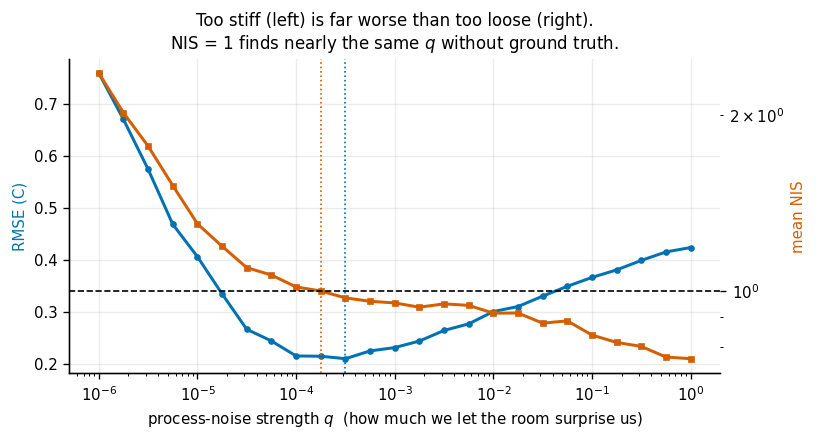
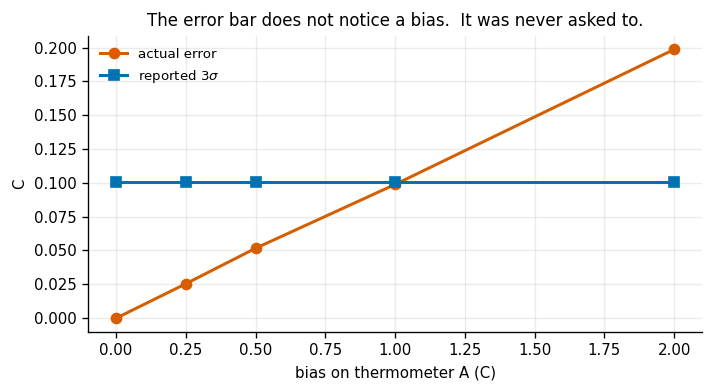
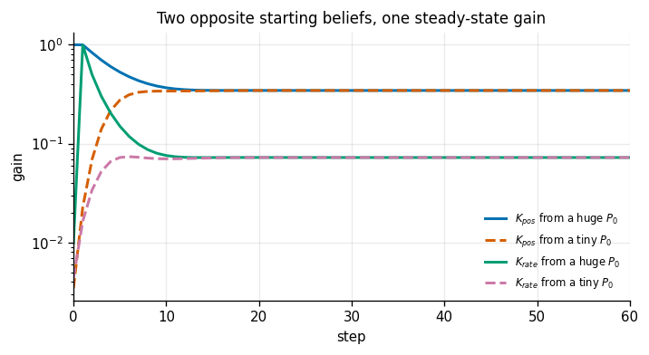
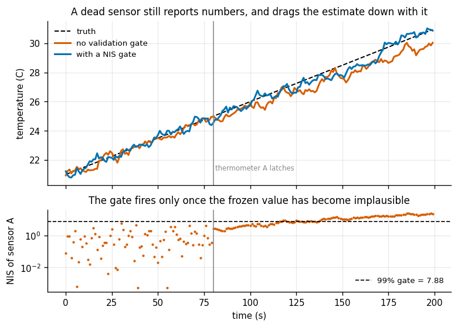

# 1D Kalman Filter

## Key Insight

Fusing multiple noisy sensors mathematically yields a far more accurate estimate than any single sensor can provide. By using a [Kalman Filter (KF)](/shared/glossary/#kf) to combine two thermometer readings, the joint estimate's uncertainty shrinks below both individual sensor variances. This [covariance](/shared/glossary/#covariance) contraction demonstrates that the filter is not just averaging the data, but actively extracting certain information from uncertainty.

**This is project 24**, the first of Phase 4. The [`kf.py`](kf.py) written here — the filter itself plus the consistency tests — is imported by [project 25](../25-2d-constant-velocity-tracker/README.md), and its diagnostics are reused all the way through [project 30](../30-factor-graph-practice/README.md).

There is a second half to the Key Insight that this project spends most of its time on. A filter that reports a tight error bar is not the same as a filter that is right. Four of the seven experiments below are about the gap between those two things, because that gap is where real robots crash.

---

## Files

| file | what it is |
|---|---|
| `kf.py` | the linear Kalman filter, the chi-square functions, and the consistency tests. **Shared with project 25.** |
| `run.py` | the seven experiments |
| `outputs/` | figures and `results.csv` |

```bash
python3 run.py       # about 45 seconds; NumPy and Matplotlib only
```

---

## The words, before the maths

Almost every term in this project is named after what it does, and each name is worth unpacking once.

- **Filter.** The word comes from signal processing: a filter lets some things through and blocks others. A Kalman filter "blocks" noise and "passes" the signal underneath it. It is *not* a filter in the sense of removing rows from a list.
- **[Kalman gain](/shared/glossary/#kalman-gain).** A "gain" in engineering is a multiplier — how strongly an input is amplified before it is applied. The Kalman gain `K` is the multiplier on the measurement's disagreement with the prediction. `K` near 0 means "ignore the sensor"; `K` near 1 means "believe the sensor completely".
- **[Innovation](/shared/glossary/#innovation).** The difference `y = z - H x` between what the sensor said and what the filter expected it to say. It is called the innovation because it is the only genuinely *new* information in the measurement — the part the filter could not have predicted. If a measurement is exactly what you expected, it teaches you nothing, and indeed `K y = 0` moves the estimate not at all.
- **[Covariance](/shared/glossary/#covariance) `P`.** The filter's own estimate of how wrong it probably is. For a single number it is just a variance, and its square root is the error bar.
- **[Process noise](/shared/glossary/#process-noise) `Q` and [measurement noise](/shared/glossary/#measurement-noise) `R`.** "Process" is the thing being tracked; `Q` says how much it can surprise you between steps. "Measurement" is the sensor; `R` says how much the sensor lies. The whole art of tuning a filter is the *ratio* of these two.
- **[NIS](/shared/glossary/#nis) — Normalized Innovation Squared.** Square the innovation, then divide by how big the filter said the innovation would be. "Normalized" because dividing by the predicted size strips out the units: a NIS of 3 means the same thing for a thermometer and for a laser scanner. [NEES](/shared/glossary/#nees) is the same trick applied to the actual state error, which you only know in simulation.

---

## Why simulate thermometers instead of buying two?

Same reason as [project 16](../16-camera-calibration/README.md). Point two real thermometers at a room and you get two numbers and no way to check the answer — you never learn the true temperature, so you can never say whether the filter's claimed `±0.03 °C` was honest or fantasy. Here we *choose* the truth (21.00 °C), *choose* the sensor noise, and then ask whether the filter's error bar matches the errors it actually makes. That comparison is the entire point of experiments 2 and 5, and it is impossible on hardware.

The two thermometers throughout:

| | noise `σ` | reading rate |
|---|---|---|
| thermometer A | 1.5 °C | 1 Hz |
| thermometer B | 0.5 °C | 1 Hz |

B is three times better than A. Keep that in mind — it decides everything in experiment 5.

---

## 1. It works: two sensors in, one tighter number out



The state is a single number, the temperature. The room is not changing, so the motion model is `F = 1` (temperature stays where it was) and `Q = 0` (nothing disturbs it). The filter starts at 0 °C with a standard deviation of 100 °C — "the room is somewhere between an ice bath and an oven" — which is how you say *I have no idea* in the language of [Gaussians](/shared/glossary/#gaussian-distribution).

After 200 seconds (400 readings):

| estimator | estimate | reported `σ` |
|---|---|---|
| thermometer A alone, averaged | 21.0229 | 0.1061 |
| thermometer B alone, averaged | 20.9557 | 0.0354 |
| plain average of the two | 20.9893 | — |
| inverse-variance weighted average | 20.9625 | 0.03354 |
| **Kalman filter** | **20.9625** | **0.03354** |

The last two rows agree to `2.4e-06 °C`. **They are the same estimator.** For a quantity that does not move, the Kalman filter *is* inverse-variance weighted averaging, derived a different way. (The residual `2.4e-06` is not round-off — it is the leftover influence of that deliberately vague 100 °C prior, which never fully washes out, only nearly.)

A beginner should stop here and ask the obvious question: **if the answer is just a weighted average, why write a filter at all?** Three reasons, and experiment 3 makes the third one decisive:

1. **It is recursive.** The weighted average needs every reading ever taken. The filter keeps two numbers, `x` and `P`, and forgets the rest. On a microcontroller with 8 kB of RAM this is not a nicety.
2. **It carries an error bar.** The weighted average gives you a number; the filter gives you a number *and* how much to trust it, updated every step, which is what the planner downstream actually needs.
3. **It generalizes to things that move.** A weighted average of a changing quantity averages over history that is no longer true. This is experiment 3, and the gap is 12×.

Note also that the *plain* average — the thing most people reach for — lands further from the truth than either weighted method, because it gives the bad thermometer equal say.

### The contraction, exactly

Fuse one reading from each sensor and the variances combine as reciprocals:

```
1/P_fused = 1/σ_A² + 1/σ_B²   ->   P_fused = 0.4743² °C²
```

`0.474 < 0.500 < 1.500`. The fused estimate is tighter than **either** input — which is the sentence in the Key Insight, now with a number on it. But notice how *little* the bad sensor bought: 5.1% off the good sensor's error bar. Reciprocals of squares punish a weak sensor brutally. A sensor three times noisier contributes one ninth as much information, which is why "we added another sensor and nothing improved" is such a common and such a predictable disappointment.

Reciprocal variance has a name — **information**, or the Fisher information — and it is additive where variance is not. Information is the natural currency of estimation: measurements *add* information, and time (process noise) *spends* it.

---

## 2. Is the error bar telling the truth?



Twenty thousand independent trials, ten seconds each, all from the same setup:

| | value |
|---|---|
| `σ` the filter reports | 0.15000 °C |
| `σ` the errors actually have | 0.14989 °C |
| ratio actual / reported | **0.9993** |
| mean NEES (should be 1.000 for a 1-D state) | 0.9985 |
| trials inside the 95% chi-square band | 94.8% (target 95.0%) |

This is what "consistent" means, and it is the property the rest of Phase 4 keeps trying to break. When the model is exactly right, the Kalman filter is not merely accurate — its **self-assessment is calibrated**. It says `0.150` and it means `0.150`.

Why bother measuring this when the maths already proves it? Because the proof assumes the model is right, and on a robot the model is never right. Experiments 4, 5 and 7 are three different ways the assumption fails, and the *only* way to notice each one is to have run this baseline first and know what healthy looks like.

---

## 3. The heating comes on, and averaging quietly stops working



Now the room warms at 0.05 °C/s with a slow wobble on top. Same two thermometers, four estimators, RMSE over the last 180 s:

| estimator | RMSE |
|---|---|
| cumulative weighted average | 3.0474 °C |
| 10-sample sliding window | 0.3526 °C |
| **Kalman filter** (state = temperature *and* rate) | **0.2425 °C** |
| raw thermometer B, unfiltered | 0.4845 °C |

The cumulative average is 12× worse than the filter — it is averaging in readings from ten minutes ago that describe a room that no longer exists. The sliding window is the usual hand-tuned patch and it works far better, but it forces a choice nobody can make well: a short window is noisy, a long window is laggy. The filter does not choose; it decides how much history to keep *from the noise model*, and re-decides every step.

The state here is two numbers, `[temperature, rate of change]`, and the rate is **never measured**. No sensor in this project reports °C/s. The filter infers it from how the temperature readings move, and reports it as an output — the bottom panel of the figure. This is the first appearance of a theme that runs through all of Phase 4: **a filter recovers states you did not measure, as long as they leave a fingerprint on the states you did.**

Honestly, though: rate RMSE is 0.048 °C/s on a signal that only ranges from −0.03 to +0.13 °C/s. The rate is recovered *roughly*, not sharply — unmeasured states always come out blurrier than measured ones. Do not over-claim this; it is real, and it is weak.

---

## 4. There is only one knob, and one end of it is much worse than the other



`q` sets how much the filter believes the room can surprise it between readings. Sweeping it across six orders of magnitude, 30 repeats each:

| `q` | RMSE (°C) | mean NIS |
|---|---|---|
| 1.0e−06 | 0.7585 | 2.357 |
| 3.2e−05 | 0.2661 | 1.095 |
| **3.2e−04** | **0.2096** | 0.972 |
| 1.0e−03 | 0.2310 | 0.953 |
| 3.2e−02 | 0.3298 | 0.880 |
| 1.0e+00 | 0.4232 | 0.765 |

Two things to take away.

**The curve is lopsided.** Setting `q` about 3000× too *large* costs 2.0× the error. Setting it only 300× too *small* costs 3.6× — ten times less abuse for twice the damage — and the failure is nastier than the number suggests. A too-small `q` means the filter has decided the temperature cannot move; it then refuses to believe the readings telling it otherwise, and lags further behind with every step. In a nonlinear filter this same mistake is how divergence starts. **When in doubt, guess `q` too big.** A sluggish filter is a bad filter; an overconfident filter is a broken one.

**You can tune `q` on hardware, with no ground truth.** Look at the NIS column: it passes through 1.0 near `q = 1.8e−04`, and the best-RMSE `q` is `3.2e−04` — within a factor of 1.8, and the RMSE at the NIS-chosen value is 0.2143 versus the best 0.2096, a **2% penalty**. NIS is computable from the innovations alone; it never sees the truth. That is the practical recipe: adjust `q` until the average NIS sits at the measurement dimension (1 here, because each reading is one number), and stop.

That is the answer to "why compute NIS when I can just measure the RMSE?" — on a real robot you cannot measure the RMSE. There is no truth column. NIS is the only self-check that survives contact with hardware, and this experiment measures what it costs you to rely on it.

---

## 5. The failure the error bar cannot see

Give thermometer A a constant offset. Not noise — a bias, the same direction every time. 200 repeats per row:

| bias on A | actual error | reported `σ` | error / `σ` | mean NIS of A | mean NIS of B | mean innovation of A |
|---|---|---|---|---|---|---|
| 0.00 °C | −0.0003 | 0.0335 | 0.0 | 1.00 | 1.00 | 0.002 |
| 0.25 °C | 0.0252 | 0.0335 | 0.8 | 1.03 | 1.00 | 0.222 |
| 0.50 °C | 0.0515 | 0.0335 | 1.5 | 1.10 | 1.00 | 0.467 |
| 1.00 °C | 0.0988 | 0.0335 | 2.9 | 1.37 | 1.04 | 0.911 |
| **2.00 °C** | **0.1987** | **0.0335** | **5.9** | 2.46 | 1.16 | **1.808** |



The `reported σ` column never moves. It cannot: `P` is computed from `F`, `Q`, `H` and `R` only — **the covariance recursion never looks at the data.** The filter's error bar is decided before the first reading arrives. That is a genuinely surprising fact about the Kalman filter and it is the single most important thing to know about trusting its output.

So at a 2 °C bias the estimate is nearly six standard deviations out and the filter is still cheerfully claiming `±0.03 °C`. A downstream planner that treats that error bar as gospel will drive into a wall with total confidence.

Two details worth pausing on:

**Why only 0.199 °C of error from a 2 °C bias?** Because A carries only 10% of the weight (its variance is 9× B's). The bias is diluted in proportion to how much the filter trusted that sensor. Useful consequence: *a bias on your best sensor is far more damaging than a bias on your worst one*, in exact proportion to the weighting.

**NIS does rise — but the mean innovation is the sharper tool.** NIS goes 1.00 → 2.46, which a gate would eventually catch. But look at the last column: A's mean innovation goes to +1.81 °C when it should hover at 0. NIS squares the innovation and throws the sign away, so it treats "always 1.8 too high" the same as "randomly ±1.8". A running *mean* of the innovation keeps the sign, and a bias is exactly a nonzero mean. This is why production estimators monitor both, and it is why serious systems put the bias *in the state vector* and estimate it — which is precisely what [project 28](../28-vio-mvp/README.md) does with IMU biases.

---

## 6. The gain stops changing, and the filter becomes two multiplications



Run the covariance recursion from two opposite starting beliefs — `P0` enormous ("no idea") and `P0` microscopic ("I know exactly") — and watch the gain:

| starting `P0` | final gain `K` |
|---|---|
| `diag(1e4, 1e2)` | `[0.34489, 0.07239]` |
| `diag(1e-4, 1e-4)` | `[0.34489, 0.07239]` |
| agreement | `1.1e-16` |

The gain forgets the prior completely. This is not a coincidence; for a stable, [observable](/shared/glossary/#observability), time-invariant system the covariance recursion has a unique fixed point (the solution of the *discrete algebraic Riccati equation*, named after Jacopo Riccati, whose 18th-century quadratic differential equation it is a discrete cousin of). Whatever you start with, you land there.

Which raises the practical question: if `K` ends up constant, why recompute it 1000 times a second? Freeze it and compare:

| filter | RMSE | cost per step |
|---|---|---|
| full KF | 0.26233 °C | a 2×2 matrix inverse |
| fixed steady-state gain | 0.26235 °C | two multiply-adds |
| penalty | **0.01%** | — |

That 0.01% is why a huge amount of shipped embedded code contains a fixed-gain **alpha-beta filter** (alpha and beta being the two constants, one for position, one for rate) and not a Kalman filter at all. The Kalman machinery was used *offline*, once, to work out what the two constants should be.

The catch, and it matters: this only holds when `F`, `Q`, `H` and `R` never change. The moment your sensor rate varies, or measurements drop out, or `R` depends on range (as a laser's does), the gain must move again — and you are back to the full filter. It also gives up the error bar, which experiments 2 and 7 just spent all their time arguing for.

---

## 7. A dead sensor keeps talking



At `t = 80 s`, thermometer A latches: it repeats its last value forever. This is the single most common real sensor failure and it is invisible to any code that only checks "did a message arrive?". Meanwhile the room keeps warming.

The fix is a **validation gate**: before folding a reading in, compute its NIS, and reject the reading if the value exceeds a chi-square threshold. At 99% for one degree of freedom that threshold is `7.879`. Two lines of code.

| | RMSE after the failure |
|---|---|
| no gate | 0.7431 °C |
| with a NIS gate | 0.3872 °C |
| readings rejected | 29 of 400 |
| false rejections before the failure | 1 (a 99% gate should discard ~1% by chance, so ~0.8 expected) |

The gate halves the error and behaves exactly as advertised on the healthy data. **But look at when it fires: step 151, seventy-one seconds after the sensor died.**

That is not a bug, and it is the most useful thing in this project. A gate cannot detect "this sensor is dead". It can only detect "this reading is implausible", and a frozen reading stays perfectly plausible until the truth drifts away from it. Two things make the delay long here: the room only moves 0.05 °C/s, and thermometer A is noisy (`σ = 1.5`), so the gate needs roughly `1.5 × √7.879 ≈ 4.2 °C` of disagreement before it objects — about 84 seconds of drift. Worse, the dead sensor is *dragging the estimate towards itself* the whole time, which shrinks the innovation and delays the gate further.

The general rule, which you can now compute rather than guess:

> **A validation gate's detection delay is roughly (√gate threshold × sensor `σ`) ÷ (rate of true change). A noisy sensor watching a slow signal is nearly undetectable when it fails.**

The remedies are all outside the filter: a heartbeat/staleness check in the driver, a *variance* check on the raw stream (a latched sensor's variance drops to exactly zero, which is unmistakable and instant), and cross-checks between redundant sensors. This is the concrete form of the guide's mantra — *never let a filter run open-loop on a sensor that has failed* — and the honest version of it is that the filter will not be the thing that tells you.

---

## What to take away

1. For a static quantity the Kalman filter **is** inverse-variance weighted averaging. Its value appears when the quantity moves (12× here), when you need the error bar, or when you cannot store the history.
2. Information — reciprocal variance — adds. A sensor 3× noisier contributes 1/9 as much, which is why adding a weak sensor to a good one bought only 5.1%.
3. The covariance recursion **never looks at the data**. `P` is a property of your model, not of your measurements. A confidently wrong filter is the normal failure mode, not an exotic one.
4. Tune with NIS, not RMSE, because RMSE does not exist on hardware. It cost 2% here.
5. Guess `q` too big rather than too small: a 2.0× penalty versus 3.6× and a filter that stops listening.
6. Gates catch implausible readings, not broken sensors, and their delay is computable — 71 seconds in this setup.

---

## Next

[Project 25](../25-2d-constant-velocity-tracker/README.md) takes exactly this filter, gives it a 4-dimensional state, and measures what happens when the target does something the motion model forbids.
