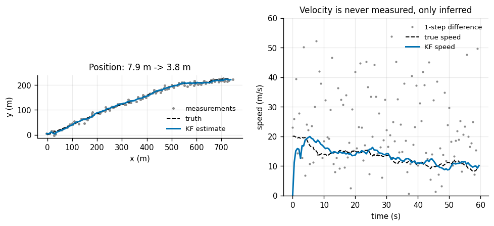
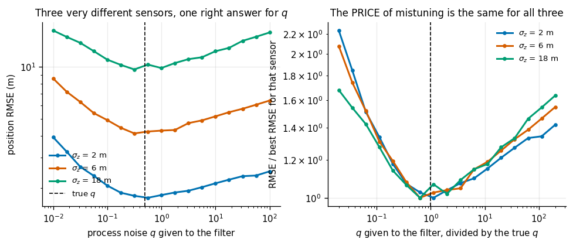
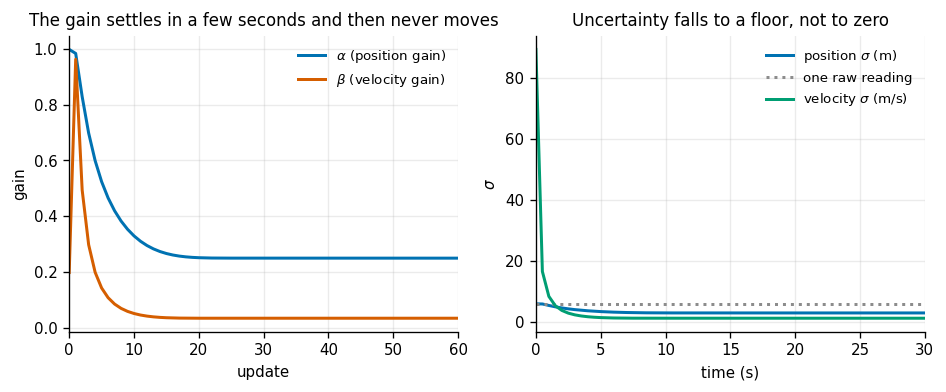
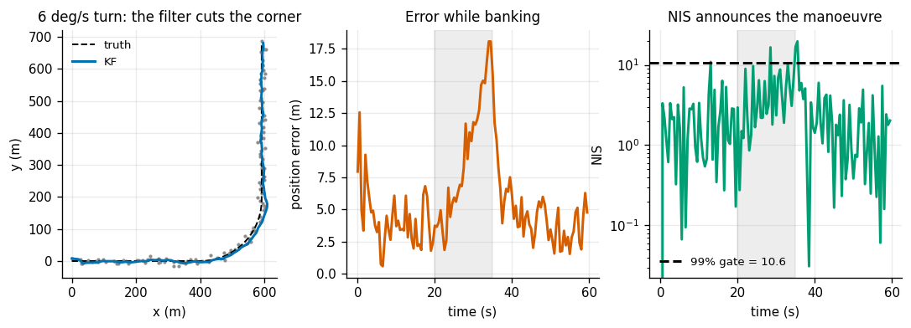
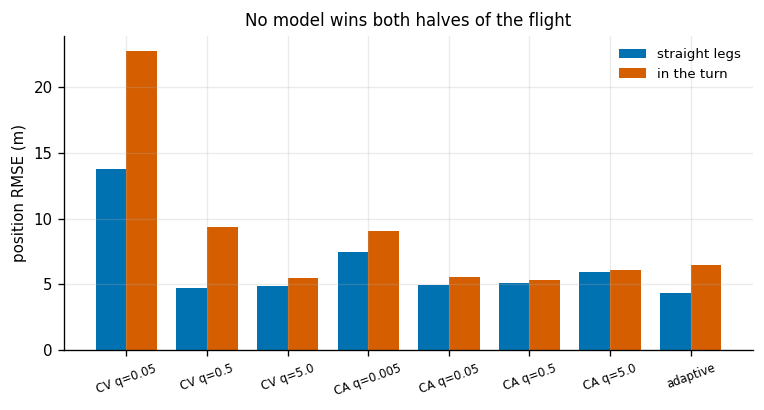
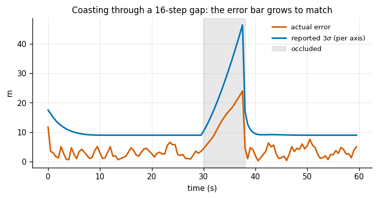
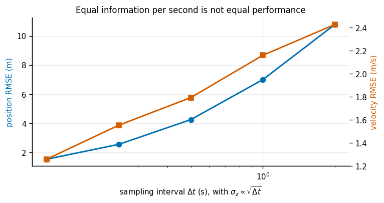

# 2D Constant-Velocity Tracker

## Key Insight

Tracking a moving object requires predicting its motion while correcting for noisy position measurements. A [Kalman Filter (KF)](/shared/glossary/#kf) uses a [constant-velocity model](/shared/glossary/#constant-velocity-model) to balance the physical expectation of momentum against incoming sensor updates. Tuning the ratio of process noise (how much the object's speed actually changes) to measurement noise (sensor error) shapes the steady-state gain, determining whether the filter responds immediately to changes or filters out high-frequency jitter.

**This is project 25.** It imports [`kf.py`](../24-1d-kf/kf.py) from [project 24](../24-1d-kf/README.md) unchanged — same class, same diagnostics — and only changes what goes into it: a 4-dimensional state instead of a 1-dimensional one.

The Key Insight says the *ratio* is what you tune. Experiment 2 measures that claim and finds it is more literally true than it sounds: scale `Q` and `R` by a thousand together and the filter's behaviour changes by `2.8e-17`. Experiments 4 and 5 then break the model on purpose, because a constant-velocity filter's real subject is what happens when the velocity stops being constant.

---

## Files

| file | what it is |
|---|---|
| `models.py` | the CV and CA motion models, and the three target trajectories |
| `run.py` | the seven experiments |
| `outputs/` | figures and `results.csv` |

```bash
python3 run.py       # about 40 seconds; NumPy and Matplotlib only
```

Imports `kf.py` from project 24 and `plot_style.py` from project 01 by `sys.path` insert — no packaging, no install.

---

## The setup

A target moves in a plane. A radar reports its **position only**, once every 0.5 s, with 6 m of noise per axis. The state we estimate is four numbers:

```
x = [ x, y, vx, vy ]        F = [[1 0 dt  0],       H = [[1 0 0 0],
                                 [0 1  0 dt],            [0 1 0 0]]
                                 [0 0  1  0],
                                 [0 0  0  1]]
```

`F` says "position advances by velocity × dt, velocity stays put". `H` says "the sensor sees the first two numbers and nothing else". Half the interest in this project is that `vx` and `vy` never appear in `H` and still get estimated.

### One deliberate choice about the "truth"

The target does not fly a perfectly straight line. It is generated by `random_walk_path`, which nudges the velocity by a random amount every step with a known strength `q = 0.5`.

This matters more than it looks. Our first attempt used a perfectly straight target, and every tuning sweep in experiments 2, 6 and 7 ran off the left edge of the plot: if the target truly never deviates, the best process noise is always `q → 0` and the "right answer" is *believe the model absolutely*. That is a degenerate answer that teaches nothing and hides every trade-off the project is about. By generating the truth from the same stochastic model the filter assumes, with a strength we know, each sweep has a genuine interior optimum and we can ask whether the filter finds the number that actually made the data.

---

## 1. Position in, position *and* velocity out



| | RMSE |
|---|---|
| raw radar returns | 7.885 m |
| **Kalman filter** | **3.766 m** (2.09× better) |

And the velocity, which no sensor in this project reports:

| estimator | velocity RMSE |
|---|---|
| difference two consecutive measurements | 22.577 m/s |
| difference over a 10-step baseline | 2.469 m/s |
| **Kalman filter** | **1.616 m/s** |

The one-step difference is a disaster — 22 m/s of error on a target moving at 20 m/s, so the "estimate" is bigger than the thing being estimated. The reason is worth internalizing: differencing divides the noise by `dt`. Two readings each with 6 m of noise, divided by 0.5 s, gives roughly `6 × √2 / 0.5 ≈ 17 m/s` of noise. **Differentiating a noisy signal amplifies the noise**, and the shorter the interval the worse it gets — which is the opposite of the intuition that a shorter interval is more accurate.

Widening the baseline to 10 steps fixes the noise and introduces lag instead: you now get the average velocity over the last 5 seconds, which is wrong whenever the target is turning. The filter is 1.53× better than that, and it is better *without* you having to pick a window.

The mean NEES here is 3.457 against a target of 4.000 — the filter is mildly conservative, i.e. its error bars are a touch wider than they need to be, mostly because the initial velocity uncertainty (50 m/s) takes a while to wash out of a 60-second run. Conservative is the safe direction to be wrong in.

---

## 2. `Q` and `R` look like two knobs. They are one.



Three radars with wildly different noise — 2 m, 6 m, 18 m, an **81× spread in variance** — tracking targets driven by the same true `q = 0.5`. For each, sweep the `q` given to the filter and find the best:

| radar `σ` | best `q` found | best RMSE |
|---|---|---|
| 2 m | 0.562 | 1.755 m |
| 6 m | 0.316 | 4.130 m |
| 18 m | 0.316 | 9.659 m |

Every one lands within a factor of 1.6 of the true 0.5, despite the 81× difference in sensor quality. **`q` is a property of the target, not of your sensor.** That is why the same tracker configuration ships across a whole fleet of radars: you measure `R` from the hardware datasheet and you learn `q` from the thing you are tracking, and the two are independent facts about the world.

The right-hand panel divides each curve by its own best value and plots against `q / q_true`. The three curves land on top of one another: **the price of mistuning is universal.** Concretely:

| | `q` 10× too small | `q` 10× too big |
|---|---|---|
| `σ` = 2 m | +33.9% | +15.1% |
| `σ` = 6 m | +51.9% | +14.7% |
| `σ` = 18 m | +42.5% | +14.7% |

Being too stiff costs 2–3× more than being too loose, the same asymmetry [project 24](../24-1d-kf/README.md) found in one dimension. The practical rule survives the jump in dimension: **when unsure, guess `q` high.**

### The invariance, exactly

Scale `Q`, `R` and `P0` all by 1000 and iterate the covariance recursion to convergence. The steady-state gain changes by `2.8e-17` — floating-point zero.

This is not a numerical accident. `K = P Hᵀ (H P Hᵀ + R)⁻¹` is *homogeneous of degree zero* in the overall scale: multiply everything on top and everything on the bottom by the same number and it cancels. So a filter cannot perceive the absolute size of its uncertainties at all; it perceives only their ratio. Two consequences worth remembering:

- If your filter behaves wrongly, doubling `Q` and doubling `R` will do **nothing**. You must change one of them.
- The units you express `Q` and `R` in do not matter as long as they agree. Metres, millimetres, furlongs — the gain is identical.

---

## 3. The steady-state gain and the closed form behind it



| | value |
|---|---|
| steady-state `α` (position gain) | 0.2507 |
| steady-state `β` (velocity gain) | 0.0361 |
| tracking index `λ = √(q·dt³) / σ_z` | 0.0417 |
| Kalata's closed form for `α` | 0.2506 (agrees to `1.9e-04`) |
| Kalata's closed form for `β` | 0.0361 (agrees to `4.5e-06`) |
| steady position `σ` | 3.004 m (from a 6.0 m sensor) |
| steady velocity `σ` | 1.270 m/s |
| updates until the gain is within 1% of final | 20 (10 s) |

The whole four-state Kalman filter collapses, at steady state, to two numbers. The **tracking index** `λ` is the single dimensionless quantity that decides them: it compares how far the target can wander between looks (`√(q·dt³)`) with how badly the sensor sees (`σ_z`). Small `λ` means "the target is predictable relative to my noise, so trust the model"; large `λ` means "trust the sensor".

Kalata's formula turns `λ` straight into the gains:

```
r = (4 + λ - sqrt(8λ + λ²)) / 4        # the "smoothing factor"
α = 1 - r²
β = 2(2 - α) - 4·sqrt(1 - α)
```

`r` is the fraction of the old estimate that survives each update; `α = 1 - r²` is therefore how much of the new measurement gets in. Our numerically iterated Kalman gain matches this to four decimal places, which is a satisfying check that the two derivations describe the same object.

A beginner will reasonably ask: **if two constants do the job, why run a Kalman filter at all?** The same answer as project 24's experiment 6, plus one new reason specific to tracking:

1. Steady state only exists if `dt`, `Q` and `R` never change. Real radars miss detections (experiment 6), and the instant a step is skipped, the "steady" gain is wrong.
2. You lose the covariance, and the covariance is what a tracker needs for *data association* — deciding which of several returns belongs to this target. That decision is made with an error ellipse, and a fixed-gain filter does not have one.
3. `α` and `β` had to be computed from `λ` in the first place, which required knowing `q`, `dt` and `σ_z` — the Kalman derivation. The shortcut is a deployment optimization, not an alternative theory.

Note the floor: position uncertainty settles at 3.0 m and stops. It does *not* keep shrinking toward zero the way project 24's static temperature did. That is the price of a moving target — every second of process noise destroys some of the information the previous measurements bought, and the filter reaches an equilibrium where the two exactly balance. Exactly 2× better than a single reading, here.

---

## 4. The target banks, and the filter falls behind



Now a target that flies straight, executes a coordinated turn for 15 s, then flies straight again. The constant-velocity model is exactly right on the straight legs and exactly wrong in the turn.

To measure the *model* error rather than the noise, we average the **signed** error vector over 60 repeats. Random measurement noise cancels; what survives is the systematic lag:

| turn rate | lateral acceleration | peak lag in the turn | straight-leg RMSE | mean NIS in the turn |
|---|---|---|---|---|
| 0 °/s | 0.00 m/s² | 0.54 m | 3.54 m | 1.86 |
| 2 °/s | 0.70 m/s² | 4.53 m | 3.51 m | 2.21 |
| 4 °/s | 1.40 m/s² | 7.64 m | 3.62 m | 3.21 |
| 6 °/s | 2.09 m/s² | 11.37 m | 3.90 m | 4.80 |
| 9 °/s | 3.14 m/s² | 16.44 m | 3.65 m | 8.17 |
| **12 °/s** | **4.19 m/s²** | **20.62 m** | 3.41 m | **12.29** |

The lag grows as `a^0.86`, close to the theoretical `a¹` (the shortfall is because the theory assumes a *constant* acceleration vector, while in a real turn the acceleration keeps rotating — over a 12 °/s, 15 s turn it sweeps through 180°). The straight-leg column barely moves, confirming that everything in the peak-lag column is model error and not noise.

Two consequences.

**NIS is the alarm, and it works.** A 2-D measurement should give a mean NIS of 2.0. At the sharpest turn it averages 12.3 — six times too surprised. You do not need ground truth to notice that your target is manoeuvring; the innovations announce it.

**But a hard gate is exactly the wrong response.** The 99% single-reading threshold for 2 degrees of freedom is 10.60. A filter that rejects readings above that will, during a sharp turn, throw away the very measurements that carry the news. This is the classic tracker death spiral: the target manoeuvres → innovations grow → readings get gated out → the estimate coasts on a stale velocity → innovations grow further → the track is lost, having rejected every piece of evidence that could have saved it. The correct response to a high NIS is to *loosen the model*, not to discard the data. Experiment 5 tries exactly that.

---

## 5. Constant velocity against constant acceleration — and the null result



The obvious fix for experiment 4 is a better motion model. A **constant-acceleration (CA)** model carries six states, `[x, y, vx, vy, ax, ay]`, and can in principle represent a turn. Here `q` becomes a *jerk* strength — how fast the acceleration itself is allowed to change.

Position RMSE, 80 repeats, split by which part of the flight:

| model | straight legs | in the turn | overall |
|---|---|---|---|
| CV, q=0.05 | 13.752 | 22.760 | 16.973 |
| CV, q=0.5 | 4.729 | 9.376 | 6.505 |
| **CV, q=5.0** | 4.907 | 5.500 | **5.108** |
| CA, q=0.005 | 7.427 | 9.041 | 7.973 |
| CA, q=0.05 | 4.921 | 5.530 | 5.141 |
| CA, q=0.5 | 5.095 | **5.351** | 5.190 |
| CA, q=5.0 | 5.959 | 6.060 | 6.005 |
| **adaptive CV** | **4.341** | 6.479 | **5.100** |

**The honest result: the extra states bought essentially nothing.** The best CA (5.141 overall) and the best CV (5.108 overall) are within 0.6% of each other — a difference smaller than the run-to-run scatter. The extra states cost +0.3% on the straight legs and buy +0.5% in the turn, which is to say nothing either way.

That deserves an explanation rather than a shrug, because it contradicts the natural expectation that a richer model must be better. Two things are happening:

1. **The rich model pays rent everywhere.** Two extra states means two more things to estimate from the same position measurements, so every estimate is noisier — including on the 45 seconds of flight where the acceleration is exactly zero and there was nothing to learn.
2. **A loose CV model already fakes it.** Look at `CV q=5.0`: turning it ten times looser than the truth costs almost nothing on the straight legs (4.907 vs 4.729) and rescues the turn (9.376 → 5.500). A CV filter with generous process noise says "the velocity might be anything by now", which is a crude but effective way of saying "the target might be accelerating".

The lesson generalizes past this project: **before adding states, try loosening the ones you have.** Extra states are the expensive fix, and here the cheap fix reached the same place.

### And the adaptive filter, which also does not save you

The `adaptive` row keeps the four-state CV model but watches its own NIS: when the last three innovations average above 4, it swaps `q = 0.5` for `q = 30` for that step. It runs loose only 8% of the time.

| versus the best fixed CV | |
|---|---|
| straight legs | **−11.5%** (better) |
| in the turn | **+17.8%** (worse) |
| overall | −0.2% (a tie) |

It wins big where the target is behaving and loses big where it is not — the opposite of the intended effect. The reason is *detection latency*: NIS only rises **after** the lag has already built up, and it needs three samples of evidence before firing. By the time the filter loosens, the damage is done; and it tightens again just as fast, before the turn is over. This is the same lesson as project 24's dead-sensor gate, in a new costume: **a statistic computed from innovations is always a lagging indicator, because the innovation only grows once the estimate is already wrong.**

The real fix is the **IMM** — Interacting Multiple Model — filter, which runs a CV model and a turning model *simultaneously* and blends their outputs by how well each is currently explaining the data. It has no detection latency, because the turning model was already running before the turn began. Our adaptive filter is the one-line caricature of an IMM, and measuring how badly the caricature does is a good argument for the real thing.

---

## 6. The target goes behind a building



Skip the update step for `g` consecutive steps — no measurements, only prediction — and look at the state when the target reappears. 200 repeats per row:

| gap | duration | error at re-entry | reported `σ` | mean NEES (4 = honest) | gain on the first fix |
|---|---|---|---|---|---|
| 0 | 0.0 s | 3.692 m | 4.249 m | 3.98 | 0.251 |
| 2 | 1.0 s | 4.945 m | 5.657 m | 3.94 | 0.369 |
| 4 | 2.0 s | 6.321 m | 7.376 m | 3.93 | 0.491 |
| 8 | 4.0 s | 10.344 m | 11.513 m | 3.83 | 0.690 |
| 16 | 8.0 s | 19.072 m | 21.870 m | 3.62 | 0.883 |
| 32 | 16.0 s | 42.901 m | 48.739 m | 4.08 | 0.973 |

Three things, all of them the point of carrying a covariance at all.

**The filter degrades gracefully instead of failing.** With no data it simply keeps predicting. A 16-second blackout costs 43 m of error on a target moving at 20 m/s — the target travelled 320 m in that time, so the filter's dead-reckoned guess is still 87% right.

**The error bar keeps up.** The reported `σ` grows as `gap^0.78` and the actual error grows as `gap^0.78` — the same exponent to two decimal places. The NEES column stays near 4 throughout. The filter has no idea where the target is, and it says so, accurately, the whole way through. That is precisely what you want to hand a planner: not a confident guess, but an honest cone.

**Recovery is instant, and the covariance is why.** Look at the last column: the gain applied to the first measurement after the gap rises from 0.251 to 0.973. After a long blackout the filter's own prediction is so uncertain that it essentially throws it away and adopts the new measurement wholesale. Nothing had to detect the end of the occlusion or reset anything — the gain formula did it automatically, because `P` had grown while `R` had not. A fixed-gain alpha-beta filter (experiment 3) cannot do this at all: it would apply `α = 0.25` to that first measurement and crawl back over the next twenty.

---

## 7. Would you rather have a fast bad sensor or a slow good one?



A real procurement question. Hold the *information rate* constant — halve the sampling interval while multiplying the noise by `√2`, so `σ_z² / dt` stays at 72 m²·s throughout — and re-tune `q` for each option:

| `dt` | `σ_z` | best `q` | position RMSE | velocity RMSE |
|---|---|---|---|---|
| **0.125 s** | **3.0 m** | 0.39 | **1.544 m** | **1.258 m/s** |
| 0.25 s | 4.24 m | 0.81 | 2.561 m | 1.553 m/s |
| 0.5 s | 6.0 m | 0.39 | 4.258 m | 1.793 m/s |
| 1.0 s | 8.49 m | 0.81 | 7.002 m | 2.161 m/s |
| 2.0 s | 12.0 m | 0.81 | 10.786 m | 2.429 m/s |

**Fast and noisy wins by 86% on position and 48% on velocity**, despite delivering identical information per second. Equal information rate is emphatically *not* equal performance.

The reason is the tracking index. With `σ_z ∝ √dt`, the index `λ = √(q·dt³)/σ_z` becomes proportional to `dt` — so the slow sensor faces a `λ` sixteen times larger, and a large `λ` means the target has wandered unpredictably far between looks. The information you collected is worth less because it is *older* by the time you use it. Every extra second between looks is a second of process noise you cannot undo, no matter how precisely you eventually measure.

Note also that all five rows independently recover `q` near the true 0.5 (the grid is coarse, so 0.39 and 0.81 bracket it) — experiment 2's claim holding up across a 16× change in sampling rate.

The practical form of this: **for a manoeuvring target, sample rate beats precision.** This is why automotive radars run at 20 Hz with metre-level accuracy rather than 1 Hz with centimetre accuracy, and it is a number you can now compute for your own case rather than argue about.

---

## What to take away

1. A filter estimates states you never measure — velocity here — and beats every differencing scheme, because differentiating noise amplifies it by `1/dt`.
2. `Q` and `R` are one knob. Scaling both changes nothing, to `2.8e-17`. And `q` belongs to the target, not the sensor: 81× different radars all recovered it within 1.6×.
3. At steady state the whole filter is two constants, given exactly by the tracking index `λ`. Verified against Kalata's closed form to four decimals.
4. A model violation shows up in NIS (2.0 → 12.3) — but gating on it discards exactly the readings that carry the news.
5. **The richer CA model bought nothing** (0.6%). Loosening `q` on the simple model achieved the same thing more cheaply. Try that before adding states.
6. The naive adaptive filter is a *tie* overall, winning on straight legs and losing in turns, because innovation-based detection is always late. That is the argument for an IMM.
7. Sample rate beats precision at equal information rate — 86% here — because information decays while you wait for the next look.

---

## Next

[Project 26](../26-ekf-localization/README.md) puts a real robot underneath the filter. The motion model stops being a matrix, the measurements stop being linear, and the [EKF](/shared/glossary/#ekf) has to linearize both — which introduces failure modes that nothing in a linear filter can have.
