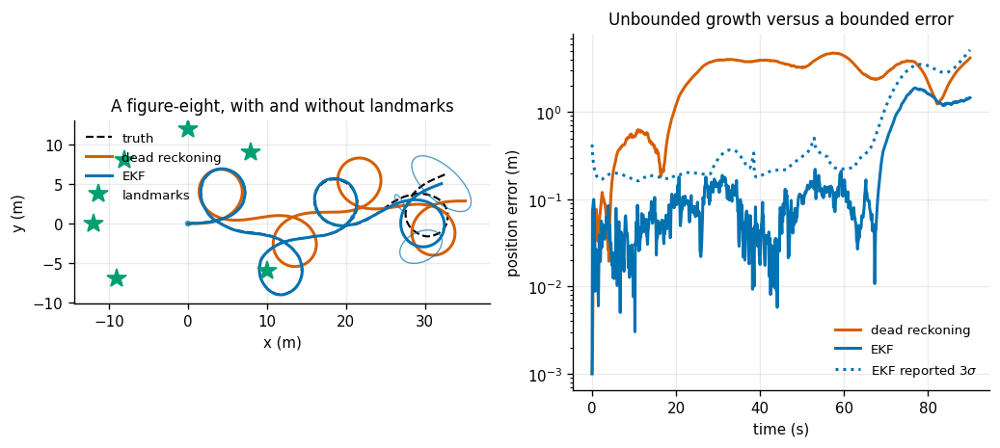
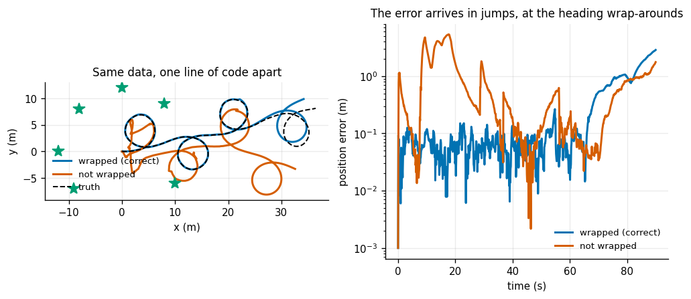
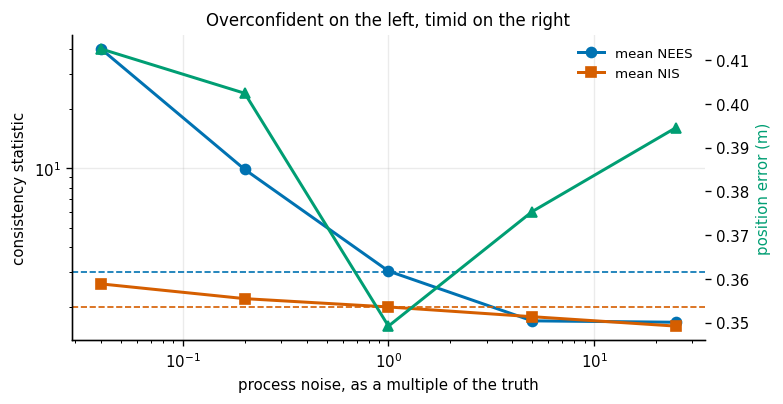
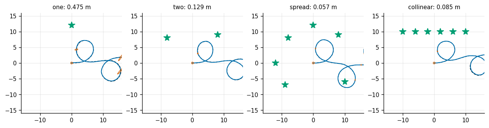
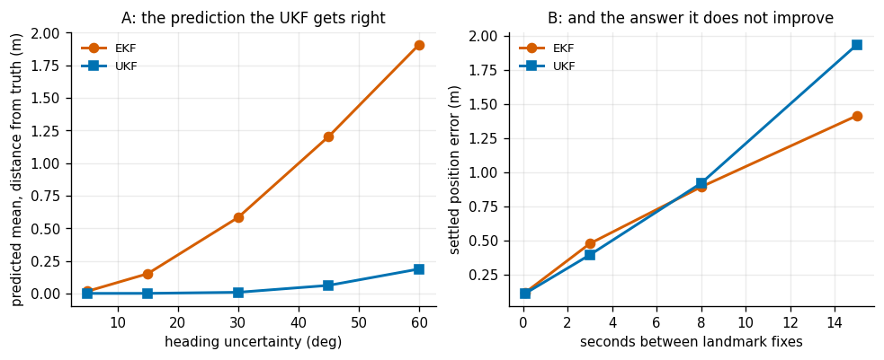
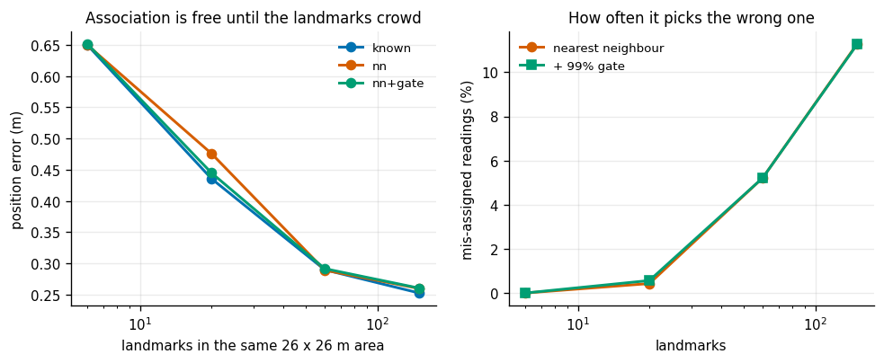

# EKF Localization

## Key Insight

Mobile robots must track their positions using internal motion estimates combined with external sensor readings. An [Extended Kalman Filter (EKF)](/shared/glossary/#ekf) localization algorithm handles nonlinear [kinematics](/shared/glossary/#kinematics)—such as wheel rotations translating to 2D coordinates—by linearizing the motion and measurement equations around the current [state](/shared/glossary/#state) estimate. This allows the robot to fuse wheel [odometry](/shared/glossary/#odometry) with landmark range and bearing measurements to limit the compounding [drift](/shared/glossary/#drift) of [dead reckoning](/shared/glossary/#dead-reckoning).

**This is project 26.** It writes `world.py` (a differential-drive robot, its noise model, and a landmark sensor) and `ekf.py` (the [EKF](/shared/glossary/#ekf) and a [UKF](/shared/glossary/#ukf) side by side). [Project 27](../27-particle-filter/README.md) reuses the motion model, and [project 29](../29-2d-lidar-slam/README.md) reuses it again through 27.

The Key Insight names the promise. This project measures four ways of breaking it, each of which is one line of code: a Jacobian with one wrong sign, a missing angle wrap, a noise model that is too confident, and landmarks in a straight line.

---

## Files

| file | what it is |
|---|---|
| `world.py` | the robot's motion model, its Jacobians, the range/bearing sensor, and the landmark layouts. **Shared with projects 27 and 29.** |
| `ekf.py` | the EKF and the UKF, written to differ in exactly one idea |
| `run.py` | the seven experiments |
| `outputs/` | figures and `results.csv` |

```bash
python3 run.py       # about 6 minutes; NumPy and Matplotlib only
```

---

## What changes when the model stops being linear

[Projects 24](../24-1d-kf/README.md) and [25](../25-2d-constant-velocity-tracker/README.md) had motion and measurement models that were matrices: `x <- F x` and `z = H x`. A real robot has neither.

**Motion.** The robot is a differential drive: two wheels, so it can go forward and turn but never sideways. Given a forward speed `v` and turn rate `w` held for `dt`, it traces an **arc**:

```
x'  = x - (v/w) sin(th) + (v/w) sin(th + w dt)
y'  = y + (v/w) cos(th) - (v/w) cos(th + w dt)
th' = th + w dt
```

That `sin(th)` is why nothing here is a matrix. (`world.py` integrates the arc exactly rather than using the straight-line shortcut `x += v cos(th) dt`. The shortcut always cuts the corner in the same direction, so its error accumulates instead of averaging out — a slow, one-sided bias that is very hard to find later.)

**Measurement.** The robot sees a landmark's **range and bearing** — how far away, and in which direction relative to where the robot is pointing:

```
r   = sqrt(dx^2 + dy^2)
phi = atan2(dy, dx) - th
```

Both are nonlinear. The EKF's answer is to replace each nonlinear function, *locally*, with its derivative — the [Jacobian](/shared/glossary/#jacobian) — and then run the ordinary Kalman equations on that. "Extended" in the name means exactly this and nothing more: the same filter, extended to nonlinear models by linearizing them at the current estimate.

A beginner should ask the obvious question here: **if the filter can compute the true nonlinear motion, why does it also need the derivative?** Because a Kalman filter carries two things forward, and only one of them can go through the real function. The *mean* is a single point, so it can be pushed through the exact arc equations — and it is. The *[covariance](/shared/glossary/#covariance)* is a whole cloud of possibilities, and there is no way to push a cloud through a curved function and still get an ellipse out the other side. The Jacobian is the flat approximation of the curve that makes it possible. That split — exact for the mean, linearized for the covariance — is the whole EKF, and experiment 6 measures precisely where it costs you.

### Noise on the control, not on the pose

`world.py` puts the noise on `(v, w)` and lets the model carry it into the pose:

```
speed noise variance = a1 v^2 + a2 w^2
turn  noise variance = a3 v^2 + a4 w^2
```

This is the standard velocity motion model, and the reason to prefer it over simply adding a fixed covariance to the pose is that it is *true of wheels*: a robot driving fast accumulates uncertainty fast, and a robot standing still accumulates none. The cross terms matter too — `a2` says a robot that turns hard also slips forward, which any real robot does.

---

## 1. Dead reckoning drifts. The EKF does not.



90 seconds, 107.8 m driven in a figure-eight, six landmarks, 1409 range/bearing readings:

| | final | mean | max |
|---|---|---|---|
| **position (m)** | | | |
| dead reckoning | 4.177 | 2.675 | 4.758 |
| EKF | 1.458 | 0.365 | 1.892 |
| **heading (deg)** | | | |
| dead reckoning | 23.947 | 14.609 | 37.907 |
| EKF | 3.774 | 2.837 | 17.735 |

Dead reckoning drifts 3.87% of the distance travelled, and — the important part — it will keep going. Drive twice as far and it will be twice as wrong. The EKF's error is **bounded**: it never exceeds 1.9 m however long the robot drives, because every landmark sighting pulls it back onto a map that does not move.

That difference — unbounded versus bounded — is the whole reason localization exists as a problem separate from odometry, and it is worth being precise about where it comes from. It is not that the EKF is a better integrator. It is that the landmarks are *fixed in the world*, so a measurement of one is a statement about absolute position, and absolute statements do not accumulate.

The figure-eight is not decoration either. A robot driving in a circle accumulates a heading bias that looks exactly like a slightly wrong wheel radius, and no amount of data can separate the two. Reversing the turn direction breaks the tie — the same trick as tilting the calibration board in [project 16](../16-camera-calibration/README.md).

Mean [NEES](/shared/glossary/#nees) over the three states is 3.375 against a target of 3.000: mildly overconfident, which experiment 4 pins down.

---

## 2. Are the Jacobians right?

An EKF's Jacobians are hand-derived calculus, and a wrong one produces a filter that runs, reports a covariance, and is nonsense. Check them against numerical differentiation, over 400 random poses, controls and landmarks:

| Jacobian | worst disagreement |
|---|---|
| `G = d(move)/d(pose)` | 1.5e−08 |
| `V = d(move)/d(control)` | 7.9e−08 |
| `H = d(measure)/d(pose)` | 3.2e−09 |

A central difference `(f(x+e) - f(x-e)) / 2e` carries an error around `e^2` plus round-off, so anything below `1e-6` means the analytic derivative is correct. Note the one subtlety: the numerical difference of two *angles* must be wrapped before dividing, or the check fails spuriously whenever the pair straddles ±180°.

Now flip a single sign — the `-1` in the bearing row's `theta` column of `H`:

| | mean position error |
|---|---|
| correct `H` | 0.217 m |
| one sign flipped | **17.754 m** (82× worse) |

The filter still runs. It still reports a covariance. It is wrong by a factor of eighty. **Ten lines of numerical-differentiation check are the cheapest insurance in this entire guide** — and unlike a test on the filter's output, they tell you *which* derivative is wrong.

---

## 3. The one missing line



Here is the line, from `ekf.py`:

```python
y = z - z_hat
y[1] = wrap(y[1])          # <- this one
```

A bearing of +179° and one of −179° describe almost the same direction — they are 2° apart. Subtract them and you get 358°. Without the wrap, the filter is handed an enormous fake surprise every time the robot's heading passes through ±180°, and it lurches to explain it.

30 runs of the same drive, one line apart:

| | mean position error | mean heading error | runs lost |
|---|---|---|---|
| wrapped | 0.283 m | 3.09° | 0 / 30 |
| **not wrapped** | **1.679 m** | **22.72°** | **21 / 30** |

Six times the position error, and 70% of runs never recover. The robot's heading passes within 30° of ±180° on 11% of steps — so the bug fires often enough to be constant, and rarely enough that a short test drive might miss it entirely.

Three separate places need this treatment and forgetting any one produces the same symptom: the innovation (above), the state after an update (`x[2] = wrap(x[2])`), and — least obvious — averaging angles in the UKF, where 179° and −179° must average to 180° and not to 0°. `ekf.py` does that on the unit circle: convert to `(cos, sin)`, average, convert back.

---

## 4. Is the filter honest, and can you tune it blind?



Scale the process noise the filter is told about, away from the truth in both directions, and watch both consistency statistics:

| `Q` scale | mean [NEES](/shared/glossary/#nees) (3 = honest) | mean [NIS](/shared/glossary/#nis) (2 = honest) | position error |
|---|---|---|---|
| 0.04 | **39.902** | 2.623 | 0.4125 m |
| 0.20 | **9.875** | 2.212 | 0.4024 m |
| **1.00** | **3.044** | **2.008** | **0.3492 m** |
| 5.00 | 1.710 | 1.794 | 0.3754 m |
| 25.00 | 1.683 | 1.609 | 0.3945 m |

Read the NEES column. At a `Q` twenty-five times too small the filter's NEES is 40 when it should be 3 — it is claiming an error bar **thirteen times tighter than the errors it is actually making**. That is the classic overconfident-EKF failure, and it is what "diverges silently" means in the guide's description of the EKF. Nothing in the position-error column would tell you: 0.41 m against 0.35 m looks like nothing at all.

Now read the NIS column, which needs no ground truth. It crosses 2.0 at exactly the same place NEES crosses 3.0, and at exactly the place the position error is lowest. **The tuning you can do on hardware finds the same answer as the tuning you cannot**, at zero cost here. That is the practical recipe for every nonlinear filter you will ever tune:

> Drive the robot. Log the innovations. Adjust `Q` until the mean NIS equals the measurement dimension. Stop.

Note the asymmetry once more, now in a nonlinear filter: 25× too small costs 18% error *and* a filter lying about its own accuracy by 13×; 25× too large costs 13% error and a filter that is merely timid. Guess `Q` high.

---

## 5. Geometry decides what you can know



Same robot, same drive, same sensor. Only the landmark positions change:

| layout | n | position error | heading error | worst-direction `σ` | best-direction `σ` | ratio |
|---|---|---|---|---|---|---|
| one | 1 | 0.4747 m | 2.673° | 1.3354 m | 0.5817 m | 2.3 |
| two | 2 | 0.1292 m | 1.261° | 0.3146 m | 0.0681 m | 4.6 |
| **spread** | 6 | **0.0565 m** | 0.855° | 0.0793 m | 0.0543 m | **1.5** |
| **collinear** | 6 | 0.0848 m | 0.854° | 0.1948 m | 0.0539 m | **3.6** |

Two results.

**One landmark is enough, in principle.** A range and a bearing to a single known point do fix a pose — three constraints per reading against three unknowns. But look at the ratio column: the uncertainty is 2.3× wider in one direction than the other. The filter knows where it is much better *across* the line to the landmark than *along* it, because a range error moves you along that line and a bearing error moves you across it, and range is the noisier of the two here.

**Six landmarks in a straight line are worse than six spread out**, by 50%, and their uncertainty is 2.5× more lopsided. All six sit in nearly the same direction from the robot, so they constrain the same one thing over and over and say nothing about the other. Tripling the landmark count from 2 to 6 bought 56% when they were spread, and only 34% when they were collinear.

This is the same lesson as [project 16](../16-camera-calibration/README.md)'s fronto-parallel calibration boards and [project 19](../19-icp-registration/README.md)'s bare wall, in a third costume: **an estimator's accuracy is set by the geometry of its measurements, not by their number.** And the warning always shows up the same way — as an eigenvalue ratio in the covariance, which is free to compute and which nobody looks at.

---

## 6. EKF against UKF, and an honest disappointment



The [UKF](/shared/glossary/#ukf) replaces the Jacobian with **[sigma points](/shared/glossary/#sigma-points)**: a handful of representative points spread over the current uncertainty, each pushed through the *real* nonlinear function, with a mean and covariance rebuilt from where they land. No derivatives anywhere. (The "unscented" in the name is famously arbitrary — Jeffrey Uhlmann has said he took the word off a deodorant bottle on a colleague's desk, to avoid the method being named after himself.)

### Part A: the UKF's belief really is better

Drive an arc for 4 seconds with no measurements, starting from a heading uncertain by `σ`, and compare each filter's *predicted* belief with the truth obtained from 40 000 Monte-Carlo samples:

| heading `σ` | EKF covariance error | UKF covariance error | EKF mean, distance from truth | UKF mean |
|---|---|---|---|---|
| 5° | 0.007 | 0.004 | 0.0173 m | 0.0010 m |
| 15° | 0.076 | 0.040 | 0.1522 m | 0.0013 m |
| 30° | 0.320 | 0.154 | 0.5836 m | 0.0094 m |
| 45° | 0.762 | 0.319 | 1.2043 m | 0.0625 m |
| **60°** | **1.377** | **0.463** | **1.9093 m** | **0.1882 m** |

At 60° of heading uncertainty the EKF's predicted mean is **1.91 m** from where the robot actually ends up on average; the UKF's is **0.19 m** — ten times better.

The reason is geometric and worth picturing. An uncertain heading turns a straight drive into a **banana** of possible positions, curved around the starting point. *The centre of a banana is not on the banana.* The EKF pushes only its mean through the model, so it reports the tip of the curve; the UKF averages several points spread along the banana and lands much closer to the true average. This is not a numerical nicety — it is the difference between "where I think I am" and "where I probably am", and the two stop being the same thing as soon as the uncertainty is wide enough for the model to curve across it.

### Part B: and it does not help

Two landmarks, seen only every `stride` steps, 12 repeats each:

| seconds between fixes | EKF error | UKF error | UKF / EKF | UKF cost |
|---|---|---|---|---|
| 0.1 | 0.1211 m | 0.1148 m | 0.95 | 2.7× |
| 3.0 | 0.4792 m | 0.3966 m | 0.83 | 2.3× |
| 8.0 | 0.8939 m | 0.9212 m | 1.03 | 2.2× |
| 15.0 | 1.4150 m | **1.9349 m** | **1.37** | 2.3× |

**The UKF ties or loses at every update rate, while costing 2.3× the compute.** At the sparsest updates it is 37% *worse*.

This is an honest inversion of what part A leads you to expect, and the explanation is more useful than a win would have been. A landmark fix pulls the estimate back onto the truth regardless of how gracefully the filter drifted on the way there. The better prediction never gets to pay off, because it is immediately overwritten. The UKF's advantage is real, and it lives in a regime — long stretches with no correction, wide uncertainty — that a well-instrumented robot spends its entire design effort trying not to enter.

That, and not inertia, is why plain EKFs still run most robots. It is also exactly why the UKF *does* matter for applications that cannot avoid that regime: an underwater vehicle between acoustic fixes, or a spacecraft between star-tracker updates.

---

## 7. Which landmark is which?



Every experiment so far quietly cheated: each measurement arrived labelled with the landmark it came from. Real sensors do not do that. Solving it is **data association**, and the standard first attempt is *nearest neighbour*: for each reading, pick the landmark whose predicted measurement is closest — closest in **[Mahalanobis distance](/shared/glossary/#mahalanobis-distance)** (named after Prasanta Chandra Mahalanobis), which is ordinary distance divided by how uncertain the prediction is. That division is not optional: raw distance in `(range, bearing)` space would be adding metres to radians, a quantity with no meaning.

Same 26 × 26 m area, more and more landmarks crammed into it, with paired data so all three modes see identical measurements:

| landmarks | nearest spacing | known correspondence | nearest neighbour | % mis-assigned | + 99% gate |
|---|---|---|---|---|---|
| 6 | 6.75 m | 0.6496 m | 0.6496 m | 0.00% | 0.6513 m |
| 20 | 2.60 m | 0.4357 m | 0.4759 m | 0.43% | 0.4449 m |
| 60 | 1.58 m | 0.2898 m | 0.2892 m | 5.21% | 0.2916 m |
| 150 | 0.94 m | 0.2526 m | 0.2598 m | **11.28%** | 0.2604 m |

**And here is a result that contradicts the textbook warning.** At 150 landmarks the filter mis-assigns 11.3% of its readings — more than one in nine — and the position error moves from 0.2526 m to 0.2598 m. **Three percent.** No tracks were lost. The catastrophe did not happen.

The reason is that density cuts both ways, and only one direction is usually mentioned. Packing landmarks closer together makes each one harder to identify — that is the 11.3%. It *also* means the robot sees far more of them at once, so any single wrong answer is outvoted by a dozen right ones. The two effects nearly cancel, and the net cost of guessing is 3%.

What actually predicts the danger is not the landmark count but a **ratio**: the filter's own position uncertainty against the landmark spacing. When the 3σ ellipse is smaller than the gap between landmarks, only one candidate is ever plausible and association is free. Here the filter holds 0.25 m of error against 0.94 m of spacing, and stays on the safe side of that ratio the whole time. Start the filter lost, or let it drift, and the same 150 landmarks would tear it apart — because a wrong guess pulls the estimate towards a place that makes the *next* guess more likely to be wrong, and that feedback loop is what the textbook warning is really about.

The gate is the honest defence and it behaves exactly as advertised: it does not improve the answer (0.2604 against 0.2598 m), it removes the failures — 1 of 8 runs lost at 20 landmarks becomes 0. A gate cannot tell you which landmark is right; it can only decline to guess. **Declining is worth more than guessing**, and it is what stops one bad frame from starting the loop.

---

## What to take away

1. "Extended" means one thing: the mean goes through the true model, the covariance goes through its derivative. Everything else follows from that split.
2. Check every Jacobian numerically. One flipped sign cost 82× the error and produced no other symptom.
3. Wrap every angle difference, in all three places. The missing line cost 6× the error and lost 70% of runs.
4. NIS tunes a nonlinear filter as well as NEES does, and NIS works on hardware. Free, here.
5. Geometry beats count: six collinear landmarks lost to six spread ones by 50%, and the covariance's eigenvalue ratio said so in advance.
6. **The UKF's belief is measurably better and its answer is not** — it ties or loses end to end at 2.3× the cost, because measurements overwrite predictions.
7. **11% mis-associated readings cost 3% accuracy.** The danger is not the mis-association rate; it is the ratio of your uncertainty to the landmark spacing.

---

## Next

[Project 27](../27-particle-filter/README.md) throws away the Gaussian entirely. Everything here assumed the belief has one peak; a robot that does not know which room it is in has two, and no EKF can say so.
